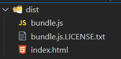

## commonJS规范

```js
// 导出 module.exports = {}
// 导入 const 变量 = require("模块标识")
```

## ES6规范

```js
// 导出 export 或者 export default {}
// 导入 import 变量名 from '模块标识'
```

## 服务器

```bash
服务器是一台性能高，24小时可以开机的电脑

服务器可以提供服务(例如: 文件存储，网页浏览，资源返回)

在电脑里安装node后，可以编写代码用node启动一个web服务，来读取本地html文件，返回给浏览器查看
```

## package.json

```bash
npm下载的包和对应版本号, 都会记录到下载包时终端所在文件夹下的package.json文件里
```

## dependencies devDependencies

```bash
dependencies生产环境

devDependencies开发环境
```

## base64字符串

~~~bash
通过base64对图片进行编码，编码后可以直接在网页引入图片，这样图片就可以和网页一起加载了，加快图片的加载速度，但是不要大量使用
~~~

## webpack基本概念

* 有了webpack让模块化开发前端项目成为了可能，底层需要node支持

* webpack本身是node的一个第三方模块包，用于打包压缩代码

* 现代 javascript 应用程序的 静态模块打包器 (module bundler)

* 为要学的 vue-cli 开发环境做铺垫

## webpack能做什么

把很多文件打包整合到一起，缩小项目体积，提高加载速度


其中功能

* less/sass -> css

* ES6/7/8 -> ES5

* html/css/js -> 压缩合并


## webpack的使用步骤

### webpack基础使用

> 把src下的2个js文件，打包到1个js中，并输出到默认dist目录下

默认入口 ./src/index.js

默认出口 ./dist/main.js

1. 初始化包环境

   ```bash
   yarn init
   ```

2. 安装依赖包

   ```bash
   yarn add webpack webpack-cli -D
   ```

3. 配置scripts(自定义命令)

   ```bash
   scripts: {
   	"build": "webpack"
   }
   ```

4. 新建目录src

5. 新建src/add/add.js 定义求和函数导出

   ```js
   export const addFn = (a, b) => a + b
   ```

6. 新建src/index.js导入使用

   ```js
   import {addFn} from './add/add'
   
   console.log(addFn(10, 20));
   ```

7. 运行打包命令

   ```bash
   yarn build
   #或者 npm run build
   ```

> 总结：src并列处，生成默认dist目录和打包后默认main.js文件

### webpack更新打包

> 以后代码变更，如何重新打包呢

1. 新建src/tool/tool.js定义导出数组求和方法

   ```js
   export const getArrSum = arr => arr.reduce((sum, val) => sum += val, 0)
   ```
   
2. src/index.js导入使用

   ```js
   import {addFn} from './add/add'
   import {getArrSum} from './tool/tool'
   
   console.log(addFn(10, 20));
   console.log(getArrSum([1, 2, 3]));
   ```
   
3. 重新打包

   ```bash
   yarn build
   ```

> 总结：src下开发环境，dist是打包后，分别独立
>
> 总结：打包后格式压缩，变量压缩等

## webpack的配置

### 入口和出口

> 告诉webpack从哪开始打包，打包后输出到哪里

默认入口 ./src/index.js

默认出口 ./dist/main.js

webpack配置 - webpack.config.js(默认)

1. 新建src并列处webpack.config.js
2. 填入配置项

```js
const path = require("path")

module.exports = {
    entry: "./src/main.js", // 入口
    output: { 
        path: path.join(__dirname, "dist"), // 出口路径
        filename: "bundle.js" // 出口文件名
    }
}
```

3. 修改package.json，自定义打包命令，让webpack使用配置文件

```json
"scripts": {
    "build": "webpack"
},
```

4. 打包观察效果

### 打包流程图


`重点：所有要被打包的资源都要跟入口产生直接/间接的引用关系`

### 案例：隔行变色

> 目标：工程化模块化开发前端项目，webpack会对ES6模块化处理

1. 回顾从0准备环境

   * 初始化包环境

   * 下载依赖包
   * 配置自定义打包命令

2. 下载jquery，新建public/index.html

   ```bash
   yarn add jquery
   ```

   

   

3. index.html 准备一些li

   * 因为import语法浏览器支持性不好，需要被webpack转换后，再使用JS代码

   ```html
   <!DOCTYPE html>
   <html lang="en">
   <head>
     <meta charset="UTF-8">
     <meta name="viewport" content="width=device-width, initial-scale=1.0">
     <meta http-equiv="X-UA-Compatible" content="ie=edge">
     <title>Document</title>
   </head>
   <body>
   
   <div id="app">
     <!-- ul>li{我是第$个li}*10 -->
     <ul>
       <li>我是第1个li</li>
       <li>我是第2个li</li>
       <li>我是第3个li</li>
       <li>我是第4个li</li>
       <li>我是第5个li</li>
       <li>我是第6个li</li>
       <li>我是第7个li</li>
       <li>我是第8个li</li>
       <li>我是第9个li</li>
     </ul>
   </div>
   
   </body>
   </html>
   ```
   
4. 在src/main.js引入jquery

   ```bash
   yarn add jquery
   ```

5. src/main.js中编写隔行变色代码

   ```js
   // 引入jquery
   import $ from 'jquery'
   $(function() {
     $('#app li:nth-child(odd)').css('color', 'red')
     $('#app li:nth-child(even)').css('color', 'green')
   })
   ```

6. 执行打包命令观察效果

7. 可以在dist下把public/index.html引入过来

   

   在index.html中，手动引入js

   ```vue
   <script src="../dist/bundle.js"></script>
   ```

> 总结：前端工程化模块化，webpack打包后引入到html中使用

### 插件：自动生成html文件

> html-webpack-plugin插件，让webpack打包后生成html文件并自动引入打包后的js

[html-webpack-plugin插件地址](https://www.webpackjs.com/plugins/html-webpack-plugin/)

  1. 下载插件

     ```
     yarn add html-webpack-plugin  -D
     ```

  2. webpack.config.js配置

     ```js
     // 引入自动生成 html 的插件
     const HtmlWebpackPlugin = require('html-webpack-plugin')
     
     module.exports = {
         // ...省略其他代码
         plugins: [
             new HtmlWebpackPlugin({
                 template: './public/index.html' // 以此为基准生成打包后html文件
             })
         ]
     }
     ```

3. 重新打包后观察dist下是否多出html并运行看效果

   打包后的index.html自动引入打包后的js文件

> 总结：webpack就像一个人，webpack.config.js是人物属性，给它穿什么装备它就干什么活

### 加载器：处理css文件问题

> 自己准备css文件，引入到webpack入口，测试webpack是否能打包css文件

1. 新建src/css/index.css

2. 编写去除li圆点样式代码

3. (重要) 一定要引入到入口才会被webpack打包

4. 执行打包命令观察效果

> 总结：处理失败，webpack默认只能处理js类型文件

### 加载器：处理css文件

> loaders加载器，可让webpack处理其他类型的文件，打包到js中

原因：webpack默认只认识 js 文件和 json文件

[style-loader文档](https://webpack.docschina.org/loaders/style-loader/)

[css-loader文档](https://webpack.docschina.org/loaders/css-loader/)

1. 安装依赖

   ```
   yarn add style-loader css-loader -D
   ```

2. webpack.config.js 配置

   ```js
   const HtmlWebpackPlugin = require('html-webpack-plugin')
   
   module.exports = {
       // ...其他代码
       module: { 
           rules: [ // loader的规则
             {
               test: /\.css$/, // 匹配所有的css文件
               // use数组里从右向左运行
               // 先用 css-loader 让webpack能够识别 css 文件的内容并打包
               // 再用 style-loader 将样式, 把css插入到dom中
               use: [ "style-loader", "css-loader"]
             }
           ]
       }
   }
   ```

3. 新建src/css/li.css去掉li默认样式

   ```css
   ul, li{
       list-style: none;
   }
   ```

4. 引入到main.js (因为这里是入口需要产生关系，才会被webpack找到打包起来)

   ```js
   import "./css/index.css"
   ```

5. 运行打包后dist/index.html观察效果和css引入情况

> 总结：万物皆模块，引到入口，才会被webpack打包。css打包进js中，然后被嵌入在style标签插入dom上

### 加载器：处理less文件

> less-loader让webpack处理less文件，less模块翻译less代码

[less-loader文档](https://webpack.docschina.org/loaders/less-loader/)

1. 下载依赖包

   ```bash
   yarn add less less-loader -D
   ```
2. webpack.config.js 配置

   ```js
   module: {
     rules: [ // loader的规则
       // ...省略其他
       {
       	test: /\.less$/,
       	// 使用less-loader, 让webpack处理less文件, 内置还会用less翻译less代码成css内容
           use: [ "style-loader", "css-loader", 'less-loader']
       }
     ]
   }
   ```
   
3. src/less/index.less设置li字体大小24px

   ```less
   @size:24px;
   
   ul, li{
       font-size: @size
   }
   ```

4. 引入到main.js中

   ```js
   import "./less/index.less"
   ```

5. 打包运行dist/index.html 观察效果

> 总结：只要找到对应的loader加载器，就能让webpack处理不同类型文件

### 加载器：处理图片文件

> 用asset module方式(webpack5版本新增)

[asset module文档](https://webpack.docschina.org/guides/asset-modules/)

如果使用的是webpack5版本的，直接配置在webpack.config.js的rules里即可

```js
{
    test: /\.(png|jpg|gif|jpeg)$/i,
    type: 'asset'
}
```

如果你用的是webpack4及以前的，请使用者里的配置

[url-loader文档](https://webpack.docschina.org/loaders/url-loader/)

[file-loader文档](https://webpack.docschina.org/loaders/file-loader/)

1. 下载依赖包

   ```bash
   yarn add url-loader file-loader -D
   ```

2. webpack.config.js 配置

   ```js
   {
     test: /\.(png|jpg|gif|jpeg)$/i,
     use: [
       {
         loader: 'url-loader', // 匹配文件，尝试转base64字符串打包到js中
         // 配置limit，超过8k，不转，file-loader复制，随机名，输出文件
         options: {
           limit: 8 * 1024,
         },
       },
     ],
   }
   ```

   图片转成 base64 字符串

   - 好处就是浏览器不用发请求了，直接可以读取
   - 坏处就是如果图片太大，再转`base64`就会让图片的体积增大 30% 左右

3. src/assets/准备老师发的2个图文件

4. 在css/less/index.less把小图片用做背景图

   ```less
   body{
       background: url(../assets/logo_small.png) no-repeat center;
   }
   ```

5. 在src/main.js把大图插入到创建的img标签上，添加body上显示

   ```js
   // 引入图片-使用
   import imgUrl from './assets/1.gif'
   const theImg = document.createElement("img")
   theImg.src = imgUrl
   document.body.appendChild(theImg)
   ```

6. 打包运行dist/index.html观察2个图片区别

> 总结：url-loader 把文件转base64 打包进js中，会有30%的增大，file-loader 把文件直接复制输出

### webpack加载文件优缺点

图片转成 base64 字符串

- 好处就是浏览器不用发请求了，直接可以读取
- 坏处就是如果图片太大，再转`base64`就会让图片的体积增大 30% 左右

### 加载器：处理字体文件

> 用asset module技术，asset/resource直接输出到dist目录下

webpack5使用这个配置

```js
{ // webpack5默认内部不认识这些文件，所以当做静态资源直接输出即可
    test: /\.(eot|svg|ttf|woff|woff2)$/,
    type: 'asset/resource',
    generator: {
    	filename: 'font/[name].[hash:6][ext]'
    }
}
```

webpack4及以前使用下面的配置

1. webpack.config.js - 准备配置

   ```js
   { // 处理字体图标的解析
      test: /\.(eot|svg|ttf|woff|woff2)$/,
      use: [
        {
          loader: 'url-loader',
          options: {
            limit: 2 * 1024,
            // 配置输出的文件名
            name: '[name].[ext]',
            // 配置输出的文件目录
            outputPath: "fonts/"
          }
        }
      ]
   }
   ```

2. src/assets/放入字体库fonts文件夹

3. 在main.js引入iconfont.css

   ```js
   // 引入字体图标文件
   import './assets/fonts/iconfont.css'
   ```

4. 在public/index.html使用字体图标样式

   ```html
   <i class="iconfont icon-weixin"></i>
   ```

5. 执行打包命令，观察打包后网页效果

> 总结：url-loader和file-loader 可以打包静态资源文件

### 加载器：处理高版本js语法

> 让webpack对高版本的js代码，降级处理后打包

高版本的js代码(箭头函数)，打包后，直接原封不动打入了js文件中，遇到一些低版本的浏览器就会报错

webpack 默认仅内置了 模块化的 兼容性处理`import export`

babel：用于处理高版本 js语法 的兼容性  [babel官网](https://www.babeljs.cn/)

让webpack配合babel-loader 对js语法做处理

[babel-loader文档](https://webpack.docschina.org/loaders/babel-loader/)

  1. 安装包

     ```bash
     yarn add -D babel-loader @babel/core @babel/preset-env
     ```

  2. 配置规则

     ```js
     module: {
       rules: [
         {
             test: /\.js$/,
             exclude: /(node_modules|bower_components)/,
             use: {
                 loader: 'babel-loader',
                 options: {
                     presets: ['@babel/preset-env'] // 预设:转码规则(用bable开发环境本来预设的)
                 }
             }
         }
       ]
     }
     ```

3. 在main.js中使用箭头函数(高版本js)

   ```js
   // 高级语法
   const fn = () => {
     console.log("你好babel");
   }
   console.log(fn) // 这里必须打印不能调用/不使用，不然webpack会精简成一句打印不要函数了/不会编译未使用的代码
   // 没有babel集成时，原样直接打包进lib/bundle.js
   // 有babel集成时，会翻译成普通函数打包进lib/bundle.js
   ```

4. 打包后观察lib/bundle.js被转成成普通函数使用了，这就是babel降级翻译的功能

> 总结：babel-loader 可以让webpack 对高版本js语法做降级处理后打包

### 图片是如何加载的

~~~bash
自己项目中的图片素材也需要请求才能拿到

但这个请求不是我们开发人员写的，是浏览器去做，浏览器读取到对应的资源引用去下载对应的资源

因为项目最终也是放在服务器上，所以项目中的图片这些东西也是由浏览器去找域名地址对应的服务器去下载的
~~~

## webpack 开发服务器

### webpack开发服务器为何学

文档地址https://webpack.docschina.org/configuration/dev-server/

抛出问题：每次修改代码，都需要重新 yarn build 打包，才能看到最新的效果，实际工作中，打包 yarn build 非常费时

为什么费时? 

1. 构建依赖
2. 磁盘读取对应的文件到内存，才能加载  
3. 用对应的 loader 进行处理  
4. 将处理完的内容，输出到磁盘指定目录  

解决问题：起一个开发服务器，在电脑内存中打包，缓存一些已经打包过的内容，只重新打包修改的文件，最终运行加载在内存中给浏览器使用

### webpack-dev-server自动刷新

> 启动本地服务，可实时更新修改的代码，打包**变化代码**到内存中，然后直接提供端口和网页访问

1. 下载包

   ```bash
   yarn add webpack-dev-server -D
   ```

2. 配置自定义命令

   ```js
   scripts: {
   	"build": "webpack",
   	"serve": "webpack serve"
   }
   ```

3. 运行命令，启动webpack开发服务器

   ```bash
   yarn serve
   #或者 npm run serve
   ```
   

> 总结：以后改了src下的资源代码，就会直接更新到内存打包，然后反馈到浏览器上了

### webpack-dev-server配置

1. 在webpack.config.js中添加服务器配置

   更多配置参考这里https://webpack.docschina.org/configuration/dev-server/#devserverafter

   ```js
   module.exports = {
       // ...其他配置
       devServer: {
         port: 3000 // 端口号
       }
   }
   ```

## 面试题

### 1、什么是webpack（必会）

webpack是一个打包模块化javascript的工具，在webpack里一切文件皆模块，通过loader转换文件，通过plugin注入钩子，最后输出由多个模块组合成的文件，webpack专注构建模块化项目，简单说就是模块打包工具

### 2、Webpack的优点是什么（必会）

减少文件体积、减少文件数量

提高网页加载速度

### 3、webpack的构建流程是什么 从读取配置到输出文件这个过程尽量说全（必会）

​    Webpack 的运行流程是一个串行的过程，从启动到结束会依次执行以下流程：

 	1. 初始化参数：从配置文件读取与合并参数，得出最终的参数
 	2. 开始编译：用上一步得到的参数初始化 Compiler 对象，加载所有配置的插件，开始执行编译
 	3. 确定入口：根据配置中的 entry 找出所有的入口文件
 	4. 编译模块：从入口文件出发，调用所有配置的 Loader 对模块进行翻译，再找出该模块依赖的模块，再递归本步骤直到所有入口依赖的文件都经过了本步骤的处理
 	5. 完成模块编译：在经过第4步使用 Loader 翻译完所有模块后，得到了每个模块被翻译后的最终内容以及它们之间的依赖关系
 	6. 输出资源：根据入口和模块之间的依赖关系，组装成一个个包含多个模块的 Chunk，再把每个 Chunk 转换成一个单独的文件加入到输出列表，这步是可以修改输出内容的最后机会
 	7. 输出完成：在确定好输出内容后，根据配置确定输出的路径和文件名，把文件内容写入到文件系统。

在以上过程中，Webpack 会在特定的时间点广播出特定的事件，插件在监听到感兴趣的事件后会执行特定的逻辑，并且插件可以调用 Webpack 提供的 API 改变 Webpack 的运行结果

### 4、说一下 Webpack 的热更新原理(必会)

webpack 的热更新又称热替换（Hot Module Replacement），缩写为 HMR。这个机制可以做到不用刷新浏览器而将新变更的模块替换掉旧的模块。

 HMR的核心就是客户端从服务端拉取更新后的文件，准确的说是 chunk diff (chunk 需要更新的部分)，实际上 WDS 与浏览器之间维护了一个 Websocket，当本地资源发生变化时，WDS 会向浏览器推送更新，并带上构建时的 hash，让客户端与上一次资源进行对比。客户端对比出差异后会向 WDS 发起 Ajax 请求来获取更改内容(文件列表、hash)，这样客户端就可以再借助这些信息继续向 WDS 发起 jsonp 请求获取该chunk的增量更新。

后续的部分(拿到增量更新之后如何处理？哪些状态该保留？哪些又需要更新？)由 HotModulePlugin 来完成，提供了相关 API 以供开发者针对自身场景进行处理，像react-hot-loader 和 vue-loader 都是借助这些 API 实现 HMR。

### 5、webpack与grunt gulp的不同（必会）

-  三者之间的区别

三者都是前端构建工具，grunt和gulp在早期比较流行，现在webpack相对来说比较主流，不过一些轻量化的任务还是会用gulp来处理，比如单独打包CSS文件等。

grunt和gulp是基于任务和流（Task、Stream）的。类似jQuery，找到一个（或一类）文件，对其做一系列链式操作，更新流上的数据， 整条链式操作构成了一个任务，多个任务就构成了整个web的构建流程。

webpack是基于入口的。webpack会自动地递归解析入口所需要加载的所有资源文件，然后用不同的Loader来处理不同的文件，用Plugin来扩展webpack功能。

- 从构建思路来说

gulp和grunt需要开发者将整个前端构建过程拆分成多个`Task`，并合理控制所有`Task`的调用关系 webpack需要开发者找到入口，并需要清楚对于不同的资源应该使用什么Loader做何种解析和加工

- 对于知识背景来说

gulp更像后端开发者的思路，需要对于整个流程了如指掌 webpack更倾向于前端开发者的思路

### 6、有哪些常见的Loader 他们是解决什么问题的（必会）

1、  file-loader：把文件输出到一个文件夹中，在代码中通过相对 URL 去引用输出的文件

2、  url-loader：和 file-loader 类似，但是能在文件很小的情况下以 base64 的方式把文件内容注入到代码中去

3、  source-map-loader：加载额外的 Source Map 文件，以方便断点调试

4、  image-loader：加载并且压缩图片文件

5、  babel-loader：把 ES6 转换成 ES5

6、  css-loader：加载 CSS，支持模块化、压缩、文件导入等特性

7、  style-loader：把 CSS 代码注入到 JavaScript 中，通过 DOM 操作去加载 CSS

8、  eslint-loader：通过 ESLint 检查 JavaScript 代码

### 7、Loader和Plugin的不同（必会）

- 不同的作用

Loader直译为"加载器"。Webpack将一切文件视为模块，但是webpack原生是只能解析js文件，如果想将其他文件也打包的话，就会用到loader。 所以Loader的作用是让webpack拥有了加载和解析非JavaScript文件的能力。

Plugin直译为"插件"。Plugin可以扩展webpack的功能，让webpack具有更多的灵活性。 在 Webpack 运行的生命周期中会广播出许多事件，Plugin 可以监听这些事件，在合适的时机通过 Webpack 提供的 API 改变输出结果。

- 不同的用法


Loader在module.rules中配置，也就是说他作为模块的解析规则而存在。 类型为数组，每一项都是一个Object，里面描述了对于什么类型的文件（test），使用什么加载(loader)和使用的参数（options）

Plugin在plugins中单独配置。 类型为数组，每一项是一个plugin的实例，参数都通过构造函数传入。

### 8、代码分割的本质是什么 有什么意义呢

代码分割的本质其实就是在`源代码直接上线`和`打包成唯一脚本main.bundle.js`这两种极端方案之间的一种更适合实际场景的中间状态。`用可接受的服务器性能压力增加来换取更好的用户体验。`

源代码直接上线：虽然过程可控，但是 http 请求多，性能开销大

打包成唯一脚本：一把梭完自己爽，服务器压力小，但是页面空白期长，用户体验不好。


```js
import App from './App.vue' // 根vue文件
import Vue from 'vue' // 引入vue.js对象

new Vue({ 
  render: h => h(App) // 渲染函数, 渲染App组件里的标签
}).$mount('#app') // 把vue文件的标签结构 -> 挂载到id为app的标签里
```

