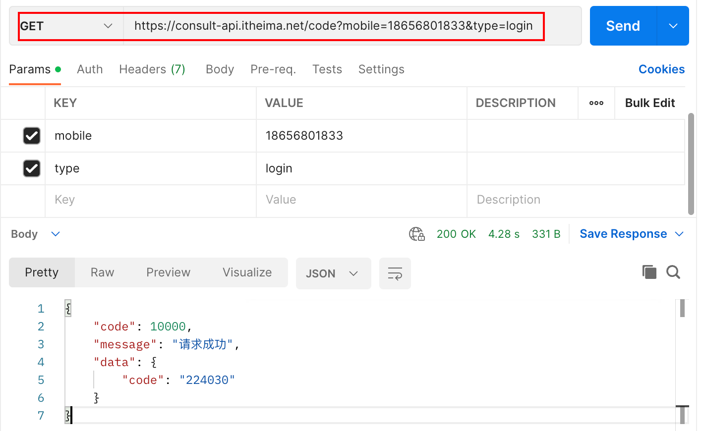
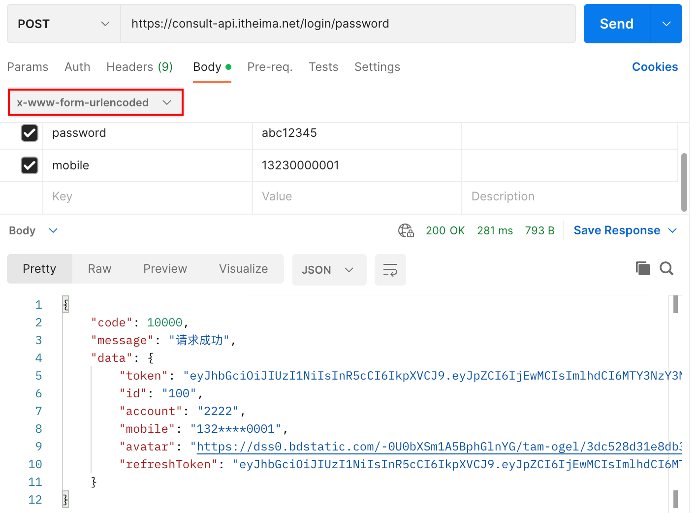
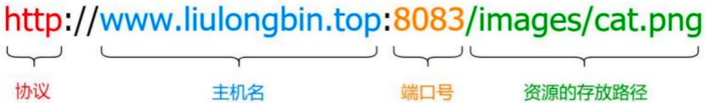
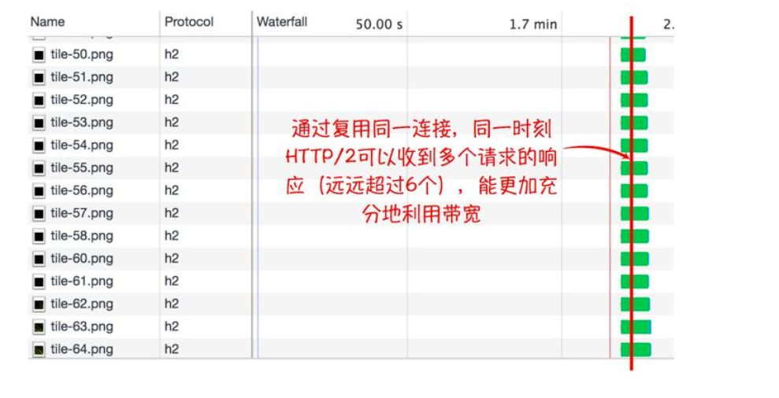
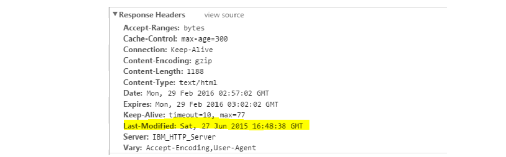
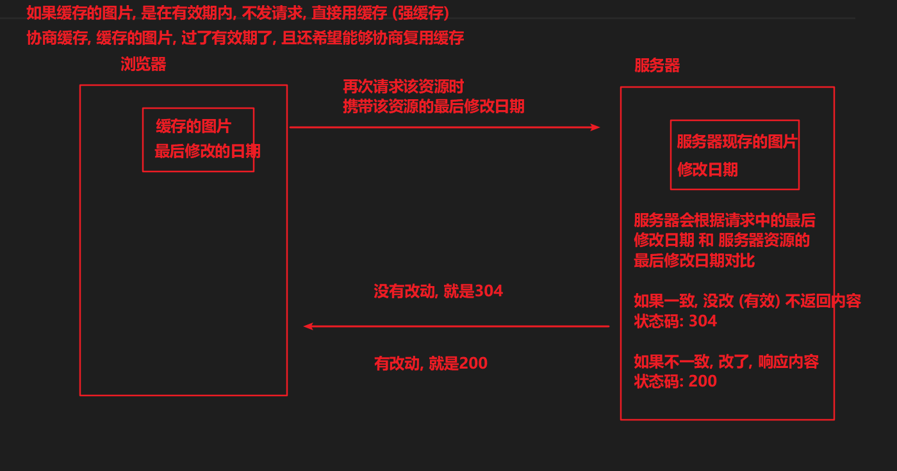
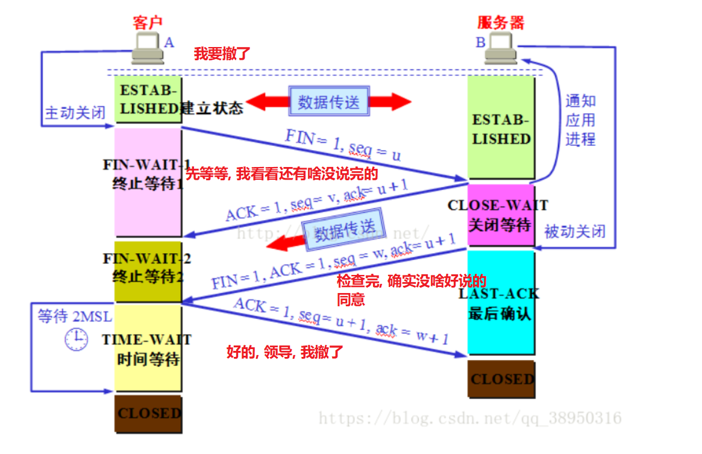

## 表单

~~~html
<!DOCTYPE html>
<html lang="zh">
  <head>
    <meta charset="UTF-8" />
    <title>表单</title>
  </head>
  <body>
    <!--
        disabled禁用表单项，不会被提交
        placeholder用来设置文本框的占位符
        value文本框中可以通过value来指定默认值
        readonly表单项无法修改，但是可以提交
        checked设置默认选中的单选和多选
        selected设置默认选中的下拉项
    -->
    <form action="">
      <div>用户名<input type="text" name="username" /></div>
      <!--
            使用input的type=password来创建密码框，密码框中的内容不会以明文显示，避免密码被偷看
            默认情况下，表单中的数据会通过url地址来发送，url地址中?后的内容被称为查询字符串（query string）
            查询字符串是一个一个的名值对结构，一个数据名对应一个值，多个名值对之间使用&隔开，?username=admin&password=123123
        -->
      <div>
        <input type="password" />
      </div>

      <!--
            单选框：使用input的type=radio来创建一个单选框
            单选框是通过name属性来分组的，相同name属性的为一组
            像这种选择框，不需要用户填写内容，还必须为表单项指定value，value最终会成为提交给服务器的值
        -->
      <div>
        性别：
        <label><input type="radio" name="gender" value="male" />男</label>
        <label><input type="radio" name="gender" value="female" /> 女</label>
      </div>

      <!-- 多选框：使用input的type=checkbox来创建多选框 -->
      <div>
        爱好：
        <input type="checkbox" name="hobby" value="ppq" />乒乓球 <input type="checkbox" name="hobby" value="lq" /> 篮球
        <input type="checkbox" name="hobby" value="ymq" />羽毛球 <input type="checkbox" name="hobby" value="zq" /> 足球
      </div>

      <!-- 下拉列表：使用select来创建下拉列表，添加multiple属性后可以将下拉列表设置为多选的下拉列表 -->
      <div>
        你最喜欢的编程语言：
        <select name="language">
          <option>Java</option>
          <option value="js">JS</option>
          <option>Python</option>
        </select>
      </div>

      <div>
        <input type="submit" value="登录" />
      </div>
    </form>
  </body>
</html>
~~~

在网页中，表单主要负责数据采集功能，ajax 用来发起网络请求。

```html
<!DOCTYPE html>
<html lang="en">
  <head>
    <meta charset="UTF-8" />
    <meta http-equiv="X-UA-Compatible" content="IE=edge" />
    <meta name="viewport" content="width=device-width, initial-scale=1.0" />
    <title>Document</title>
  </head>
  <body>
    <!-- 表单标签 -->
    <form>
      <!-- 表单域 -->
      <div>
        <input type="text" id="username" />
      </div>
      <div>
        <input type="password" id="password" />
      </div>
      <!-- 表单按钮 type="submit"表示提交按钮的意思，默认值可以不写 -->
      <button type="submit">提交</button>
    </form>

    <script src="https://unpkg.com/axios/dist/axios.min.js"></script>
    <script>
      // 监听表单的submit提交事件，按钮必须是submit，才会触发
      // 阻止默认提交行为
      // 基于axios发请求
      document.querySelector("form").addEventListener("submit", function (e) {
        console.log(e)
        e.preventDefault()
        const username = document.querySelector("#username")
        const password = document.querySelector("#password")
        axios({
          method: "POST",
          url: "http://www.liulongbin.top:3009/api/login",
          data: {
            username,
            password,
          },
        }).then(() => {})
      })
    </script>
  </body>
</html>
```

## 数据交换格式

数据交换格式，是服务器端与客户端之间数据传输的格式，目前主流是`JSON`。客户端以 JSON 格式把数据发给服务器，服务器以 JSON 格式把数据响应给客户端。

JSON 本质上是用字符串的方式来表示对象或数组类型的数据

```js
// 外层单引号表示这是一个字符串
// 这是用字符串的方式表示对象格式的数据
const obj = '{"name": "zs", "age": 20}'

// 这是用字符串的方式表示数组格式的数据
const arr = '["java", "js"]'
```

`序列化和反序列化`

```js
//序列化
const obj = { name: "zs", age: 20 }
JSON.stringy(obj)

// 反序列化
const obj = '{"name": "zs", "age": 20}'
JSON.parse(obj)
```

## XMLHttpRequest

xhr 是浏览器内置的一个构造函数，基于 new 出来的 xhr 实例对象，可以发起 Ajax 请求。axios 中的 axios.get()、axios.post()、axios() 方法，都是基于 xhr 封装出来的！

get 请求

```html
<!DOCTYPE html>
<html lang="en">
  <head>
    <meta charset="UTF-8" />
    <meta http-equiv="X-UA-Compatible" content="IE=edge" />
    <meta name="viewport" content="width=device-width, initial-scale=1.0" />
    <title>Document</title>
  </head>
  <body>
    <script>
      // 使用xhr发起get请求
      // 1.创建xhr对象
      const xhr = new XMLHttpRequest()
      // 2.调用xhr.open()函数。get请求在url地址后面通过?的形式携带查询参数
      xhr.open("GET", "http://www.liulongbin.top:3009/api/get?name=zs&age=20")
      // 3.调用xhr.send()函数
      xhr.send()
      // 4.监听load事件
      xhr.addEventListener("load", function () {
        console.log(xhr.response)
      })
    </script>
  </body>
</html>
```

post 请求

```html
<!DOCTYPE html>
<html lang="en">
  <head>
    <meta charset="UTF-8" />
    <meta http-equiv="X-UA-Compatible" content="IE=edge" />
    <meta name="viewport" content="width=device-width, initial-scale=1.0" />
    <title>Document</title>
  </head>
  <body>
    <script>
      const obj = {
        name: "zs",
        age: 20,
      }
      const xhr = new XMLHttpRequest()
      xhr.open("POST", "http://www.liulongbin.top:3009/api/post")
      // 告诉服务器我是以什么格式发送的
      xhr.setRequestHeader("Content-Type", "application/json")
      // 需要自己来处理，把js对象转成json数据，在发送给后台
      xhr.send(JSON.stringify(obj))
      xhr.addEventListener("load", function () {
        console.log(xhr.response)
      })
    </script>
  </body>
</html>
```

## Postman





## 服务器

客户端指 Web 浏览器。服务器是提供服务的设备。

通信过程：（请求）在浏览器地址栏中输入www.baidu.com，服务器把百度首页html内容发送给客户端浏览器（响应）。

url 地址：url 地址用来表示服务器上每个资源的确切访问路径。一个标准的 URL 地址主要由以下 4 个部分构成：



概念：协议是网络协议的简称，用来保证通信的双方能读懂彼此发送过来的消息内容。

概念：主机名用来标识互联网中服务器的唯一性。

概念：端口号是 0 - 65535 之间的整数，它的主要作用是表示一台计算机中的特定进程所提供的服务。

概念：路径用来表示资源在服务器上具体的存放位置。

## Ajax

Ajax 是浏览器中的技术：用来实现客户端网页请求服务器的数据。它的英文全称是 Asynchronous Javascript And XML，简称 Ajax。服务器对外提供资源，获取服务器上的资源使用 ajax 技术。

## Axios

注意事项：地址栏中不可以出现中文，如果出现了，浏览器会自动帮我们处理，不用管

## HTTP 请求方法的具体作用（前 5 个）

|  方法   |                                                                                   功能                                                                                   |
| :-----: | :----------------------------------------------------------------------------------------------------------------------------------------------------------------------: |
|   GET   |                                                                             从服务器获取资源                                                                             |
|  POST   |                                                                             向服务器新增数据                                                                             |
|  HEAD   | 请求资源的头部信息，并且这些头部与 HTTP GET ⽅法请求时返回的⼀致。<br />该请求⽅法的⼀个使⽤场景是在下载⼀个⼤⽂件前先获取其⼤⼩再决定是否要下载，以此可以节约带宽资源。 |
|   PUT   |                                                       更新服务器上的数据，侧重于完整更新。例如：更新用户的完整信息                                                       |
| DELETE  |                                                                            删除服务器上的数据                                                                            |
| OPTIONS |                                                ⽤于获取⽬的资源所⽀持的通信选项 (跨域请求前，预检请求，判断目标是否安全)                                                 |
|  TRACE  |                                                    该方法会让服务器原样返回任意客户端请求的信息内容，用于诊断和判断。                                                    |
| CONNECT |             HTTP/1.1 协议中预留给能够将连接改为管道⽅式的代理服务器<br />(把服务器作为跳板，让服务器代替用户去访问其它网页，之后把数据原原本本的返回给用户)              |
|  PATCH  |                                                       更新服务器上的数据，侧重于部分更新。例如：只更新用户的手机号                                                       |

GET/DELETE 参数是在地址栏中传递的

PUT/PATCH/POST 参数是在请求体传递的

## 03. GET 和 POST 区别

数据传输方式：GET 在地址栏中传递。POST 在请求体中传递。

数据安全：GET 相对 POST 不安全，默认 http 是明文传输，可以破解，https 会对内容进行加密。

数据类型：GET 只允许 ASCII 字符。POST ⽆限制（文件、图片...）

功能特性：GET 安全且幂等（安全：只读特性，使⽤这个⽅法不会引起服务器状态变化。幂等：同⼀个请求⽅法执⾏多次和仅执⾏⼀次的效果完全相同）。POST ⾮安全、⾮幂等。

请求长度：浏览器由于对 url 长度的限制，所以会影响 get 请求发送数据时的长度

## 04. HTTP 请求报文

HTTP 请求报⽂的组成：请求⾏、请求头、(空⾏)、请求体。


`请求行`

包含了请求⽅法、URL、HTTP 协议版本，它们之间⽤空格进行分隔。例如：

```bash
GET http://www.abc.com/articles HTTP/1.1
```

`请求头`

注意：不同的数据对应不同的请求类型，axios 默认帮我们做了设置处理

| 属性值                               | 应用场景                                         |
| ------------------------------------ | ------------------------------------------------ |
| application/x -www -form -urlencoded | 表单中不包含文件上传的场景，适用于普通数据的提交 |
| multipart/form -data                 | 表单中包含上传文件的场景                         |
| application/json                     | 上传 json 格式数据                               |

请求头由键值对组成，每⾏⼀对，键值之间⽤英⽂冒号`:`进行分隔。例如：

```
Content-Type: application/json
Host: www.abc.com
User-Agent：产请求的浏览器类型
Accept：客户端可识别的内容类型列表
Host：请求的主机名，允许多个域名同处个IP地址，即虚拟主机
```

`请求体`

请求体中放置 POST、PUT、PATCH 等请求方法所需要携带的数据。

注意：在浏览器中，`GET 请求比较特殊，没有请求体。`在浏览器中，POST、PUT、PATCH、DELETE 请求有请求体。

## 05. HTTP 响应报文

HTTP 响应报⽂的组成：响应⾏、响应头、空⾏、响应体。


`响应行`

响应行由协议版本、状态码、状态码的原因短语 3 个内容组成，中间以空格分隔。例如：

```bash
HTTP/1.1 200 OK
```

`响应头`

响应头由键值对组成，每⾏⼀对，键值之间⽤英⽂冒号`:`进行分隔。例如：

```
Content-Length: 1024
Content-Type: application/json
```

`响应体`

服务器发送过来的数据

## 06. HTTP 响应状态码

`成功（2XX）`

| 状态码 | 原因短语        | 说明                                                                                                                   |
| ------ | --------------- | ---------------------------------------------------------------------------------------------------------------------- |
| `200`  | OK              | `请求成功`。表示从客户端发来的请求在服务器端被正确处理                                                                 |
| `201`  | Created         | 资源在服务器端已成功创建，通常是在 post 请求，或者某些 put 请求之后创建了内容                                          |
| 202    | Accepted        | 请求服务器已接受，但是尚未处理，不保证完成请求<br />适合异步任务或者说需要处理时间比较长的请求，避免 HTTP 连接一直占用 |
| 204    | No content      | 表示请求成功，但响应报⽂不含实体的主体部分                                                                             |
| 206    | Partial Content | 进⾏的是范围请求，表示服务器已经成功处理了部分 GET 请求<br />响应头中会包含获取的内容范围 (常用于分段下载)             |

`重定向（3XX）`

| 状态码 | 原因短语           | 说明                                                                                                                                                         |
| ------ | ------------------ | ------------------------------------------------------------------------------------------------------------------------------------------------------------ |
| 301    | Moved Permanently  | 永久性重定向，表示资源已被分配了新的 URL<br />比如，我们访问 **http**://www.baidu.com 会跳转到 **https**://www.baidu.com                                     |
| 302    | Found              | 临时性重定向，表示资源临时被分配了新的 URL，支持搜索引擎优化<br />首页，个人中心，遇到了需要登录才能操作的内容，重定向到登录页                               |
| 303    | See Other          | 对于 POST 请求，它表示请求已经被处理，客户端可以接着使用 GET 方法去请求 Location 里的 URI                                                                    |
| `304`  | Not Modified       | 资源在客户端被缓存，响应体中不包含任何资源内容！（协商缓存）                                                                                                 |
| 307    | Temporary Redirect | 对于 POST 请求，表示请求还没有被处理，客户端应该向 Location 里的 URI 重新发起 POST 请求。<br />不对请求做额外处理, 正常发送请求, 请求 location 中的 url 地址 |

因为 post 请求，是非幂等的，从 302 中，细化出了 303 和 307

简而言之：

- 301 302 307 都是重定向。比如访问的是http://www.baidu.com会重定向到https://www.baidu.com
- 304 协商缓存

`客户端错误（4XX）`

| 状态码 | 原因短语        | 说明                                                                  |
| ------ | --------------- | --------------------------------------------------------------------- |
| `400`  | Bad Request     | 客户端的请求方式、或请求参数有误导致的请求失败！`400不一定是后台错误` |
| `401`  | UnAuthorized    | 客户端的用户身份认证未通过，导致的此次请求失败！                      |
| 403    | Forbidden       | 表示对请求资源的访问被服务器拒绝                                      |
| `404`  | Not Found       | 客户端请求的资源地址错误（在服务器找不到），导致服务器无法找到资源！  |
| 408    | Request Timeout | 客户端请求超时                                                        |
| 409    | Confict         | 请求的资源可能引起冲突                                                |

`服务端错误（5XX）`

| 状态码 | 原因短语                   | 说明                                                                                                     |
| ------ | -------------------------- | -------------------------------------------------------------------------------------------------------- |
| 500    | Internal Sever Error       | 服务器内部错误，导致的本次请求失败！                                                                     |
| 501    | Not Implemented            | 请求超出服务器能⼒范围，例如服务器不⽀持当前请求所需要的某个功能，<br />或者请求是服务器不⽀持的某个⽅法 |
| 503    | Service Unavailable        | 表明服务器暂时处于超负载或正在停机维护，⽆法处理请求                                                     |
| 505    | Http Version Not Supported | 服务器不⽀持，或者拒绝⽀持在请求中使⽤的 HTTP 版本                                                       |

在状态行中所包含的状态码，叫做“响应状态码”。响应状态码只能表示这次请求的成功与否 (成功或失败)。

在响应体的数据中所包含的状态码，叫做“业务状态码”。业务状态码用来表示这次业务处理的成功与否。


## 07. HTTP1.1 的 keep-alive 是什么作用

HTTP1.0 默认关闭，需要手动开启。HTTP1.1 默认开启。

`作用：客户端到服务器端的连接持续有效(长连接)，当出现对服务器的后继请求时，避免了建立或者重新建立连接。`

使用方法：请求头中添加 Connection: keep-alive

优点：

- 较少的 CPU 和内存的占⽤（因为要打开的连接数变少了，复用了连接）

- 减少了后续请求的延迟（⽆需再进⾏握⼿）

缺点：

- 请求已经都结束了, 但是还一直连接着也不合适，本来可以释放的资源仍旧被占用

  如何解决？服务器设置过期时间或者请求次数，超过这个时间或者次数就断掉连接。

## 08. 为什么需要 HTTPS

`HTTP 协议是明文传输数据，不安全，HTTPS 在传输数据时，会对数据进行加密。`

## 09. HTTPS 是如何对数据进行加密的

目前常见的加密算法可以分成三类：`对称加密算法`，`非对称加密算法` 和 `Hash算法`

1. 对称加密算法: 相同密钥加密解密, 可逆的! 可以用于加密解密传输数据

   想使用对称加密算法, 一定要保证密钥不被泄漏 (且进行密钥的传输约定时, 一定要保证安全)

2. 非对称加密算法: 有两把钥匙, 公钥, 私钥, 可逆的, 可以用于 https 的初步交换密钥

3. Hash 算法: 不可逆的, 根据一段内容, 生成一段唯一标识, 一般用于验证数据是否被修改! (md5)

### 对称加密

`文件加密和解密使用相同的密钥（可逆的，可以用于加密解密传输数据）。`⽐如，两个人事先约定的暗号，就属于对称加密。


优点：简单，加密速度快，效率高，破译困难

缺点：在数据传送前，发送方和接收方必须商定好秘钥，然后双方保存好秘钥。如果一方的秘钥被泄露，那么加密信息也就不安全了。`最不安全的地方，就在于第一开始，互相约定密钥的时候!!! 传递密钥!`

使用场景：本地数据加密、https 通信、网络传输等

常见算法：AES、DES、3DES、DESX、Blowfish、IDEA、RC4、RC5、RC6。全球公开，通过了层层筛选，没有被破解

### ⾮对称加密

`通信的双方使用不同的秘钥进行加密解密，即秘钥对（私钥 + 公钥）`

特征：私钥可以解密公钥加密的内容，公钥可以解密私钥加密的内容


- 优点：非对称加密与对称加密相比其安全性更好

- 缺点：加密和解密花费时间长、速度慢，只适合对少量数据进行加密

使用场景：https 会话前期、CA 数字证书、信息加密、登录认证等

常见算法：RSA、ECC（移动设备用）、Diffie-Hellman、El Gamal、DSA（数字签名用）

### HTTPS 加密解决⽅案

结合了两种加密⽅式：

- 将 `对称加密的密钥(一串约定的字符串)` ⽤非对称加密的公钥, 进⾏加密并发送出去，接收⽅使⽤私钥解密得到 `对称加密密钥`

- 双⽅沟通时使⽤ `对称加密密钥` 进⾏

**可以看到，只有在发送秘钥阶段才使用非对称加密，而后续的通信都使用对称加密，这样解决了性能问题。**

HTTPS 目前所使用的 TLS 或 SSL 协议, 就是目前采用的加密通道的规范协议

它利用对称加密、(公私钥)非对称加密, 以及其密钥交换算法，可完成可信任的信息传输

1. 利用 非对称加密 加密传输 对称加密所约定的密钥 (保证了密钥传输的安全)
2. 后续, 利用对称加密, 有效便捷的进行数据传输!!

### 数字证书

为了安全性, 一般还需要签发数字证书!

客户端 和 服务器端要初步互通消息时, 客户端发送请求可以拿到公开的公钥信息

进而进行非对称加密, 使用公钥, 加密`对称加密密钥`, 传递给服务器, 后续通信都使用对称加密!


**问题是: 初步互通消息时, 如果请求拿到的公钥信息, 就是假的, 或者不安全的! 那么后续的所有操作, 都将是不安全的!**

如何保证公钥的安全性呢?? 说白了, 需要证明公钥是安全可靠的!!! 要证明网站是安全可靠的!!!

所以, 就需要有数字证书(CA 证书), 一般是 CA 机构(互联网的机构, 登记网站和公钥的)颁发的, 证明这个公钥是安全可靠的!

**CA 证书中心会对你网站的公钥, 网站的域名地址, 证书到期时间, 等一些相关信息一起加密签发数字证书, 保证你网站的安全性**


当公司申请了 CA 证书后, 就应该在响应时, 将数字证书一起发送给客户端


而客户端, 接收到消息后, 就可以查看证书 , 权威 CA 机构都可以

1. 如果正在访问的网站 和 证书记载的网址 不一致, 说明不安全, 可能被冒用, 浏览器就会发出警告!!!

2. 如果签发证书的机构, 不权威, 发出警告

   

3. 如果证书过期了, 浏览器也会发出警告

   因为一旦证书过期了, CA 机构, 不会继续实时检测网站的安全有效性!

### 数字签名

但这还是有问题：如果证书被篡改了怎么办?

这时就需要用⼀个技术：**数字签名**。 (根据证书内容, 生成的一个唯一标识)

数字签名就是先⽤ **CA ⾃带的 Hash 算法来计算出证书内容的⼀个摘要**，然后使⽤ CA 私钥进行加密，组成数字签名。

当别⼈把他的证书发过来时，**接收方⽤同样的算法再次⽣成摘要**，⽤ CA 公钥解密后得到 CA 生成的摘要，两者进行对⽐后,

就能确定中间是否被⼈篡改。这样就能最⼤程度的保证通信的安全了。

[博客参考](https://blog.csdn.net/u014044812/article/details/80723009)

---

简要小结:

1. 为什么需要 HTTPS ? 因为 HTTP 是明文传输数据的, 不安全, 而 HTTPS 是会对内容加密的

2. HTTPS 的加密策略是什么 ?

   先用 `非对称加密`, 传递对称加密的密钥 (保证了密钥传输的安全)

   后续 使用`对称加密`, 进行交流 (保证了传输数据安全)

3. 问题: 就算是第一次交流用非对称加密, 公钥也是要在网络中传输的!

   如何证明公钥是可靠的? 如何证明网站是可靠的 ? (CA 机构认证, 网站需要申请 **`数字证书`** )

   请求时, 网站就会将数字证书给到浏览器, 浏览器默认就会检测证书的可靠性!

   (1) 是否是权威机构发布的!

   (2) 看证书中记录的地址 和 当前访问的网站的地址, 是否一致, 只有一致, 才可靠!

   (3) 看证书是否过期

   ...

4. 如何保证证书不被篡改 => **`数字签名`**, 可以根据证书的所有的内容, 生成一个唯一标识!!! (`Hash加密算法`)

   一旦内容如果被修改了, 再次生成唯一标识时, 和之前生成的唯一标识就不一样! 检测是否被修改!

## 10. HTTP/2 和 HTTP1.x 比有什么优势和特点

**HTTP/2 的升级, 对于用户来说, 是跨时代的! 基于 HTTP/2, 用户访问网页的速度会非常快!!! (充分利用带宽)**

HTTP/2: 淘宝, 天猫, 京东等, 已做升级 ....

1. HTTP/2 采⽤`⼆进制格式`来传输数据，⽽⾮ HTTP 1.x 的⽂本格式，⼆进制协议`解析起来更⾼效`
2. HTTP/2 采用一些`头部压缩技术`，减少在请求和响应头中重复携带的数据，`降低网络负担`
3. HTTP/2 采⽤`服务器推送`方式，主动向客户端推送资源，提高页面加载效率
4. **HTTP/2 采⽤`多路复用机制`，减少需要创建的连接数量，降低资源占用和性能消耗**

下面是一些与之关联的技术知识。

**⼆进制格式分帧**

帧：HTTP/2 数据通信的最⼩单位消息，是指 HTTP/2 中逻辑上的 HTTP 消息（例如请求、响应等）。消息由⼀个或多个帧组成

流：存在于连接中的⼀个虚拟通道，它可以承载双向消息，且每个流都有唯⼀的整数 ID

**头部压缩**

在 HTTP1.x 中，请求和响应中会重复携带一些不常改变、冗⻓的头数据，给⽹络带来额外负担。

在 HTTP/2 中，客户端和服务端使⽤ **“⾸部表”** 来跟踪和存储之前发送过的键值对，

相同的数据不再随着每次请求和响应发送。⾸部表在连接存续期间始终存在，由客户端和服务器共同渐进更新。

每个新的⾸部键值对，要么被追加到当前表的末尾，要么替换表中已存在的键值对。

> 可以简单的理解为：只发送差异数据，⽽不是全部发送，从⽽减少头部的信息量

下图为首部表的更新示意图：


**服务器推送**

服务端可以在发送⻚⾯ HTML 内容时，再主动推送一些其它资源，⽽不⽤等到浏览器解析到相应的位置时发起请求后再作响应。

例如，服务端可以主动把 JS 和 CSS ⽂件推送给客户端，⽽不需要客户端解析 HTML 时再发送这些请求。

不过，服务端的主动推送行为，客户端有权利选择是否要接收。

如果服务端推送的资源已经被浏览器缓存过，浏览器可以通过发送 RST_STREAM 帧来拒收。

**多路复用**

在 HTTP 1.x 中如果想并发多个请求的话，必须使⽤多个 TCP 链接，但浏览器为了控制资源，

会对单个域名有 6-8 个 TCP 链接的数量限制。而在 HTTP/2 中：

- 同域名下的所有通信，都在单个连接上完成
- 单个连接可以承载任意数量的双向数据流
- 数据流以消息的形式发送，⽽消息⼜由⼀个或多个帧组成（多个帧可以乱序发送，因为可以根据帧⾸部的流标识来重新组装）



[参考文章：HTTP/2 特性及其在实际应用中的表现](https://zhuanlan.zhihu.com/p/30166894)

**小结:**

**HTTP1.X 同一时间, 只能并发建立 6-8 个 TCP 连接, 一个连接同时只能一个请求 (虽然可以 keep-alive 复用, 但也得一个个来)**

**(建立连接的成本比较高, 不让一次性建立太多连接)**

**而新版本 HTTP/2 建立一次连接, 就可以并发很多个请求!**

所以 HTTP/2 的升级, 大大提升了页面加载的效率!

## 11. http 缓存控制

### 基本认知

缓存包括：数据库缓存、服务器端缓存（代理服务器缓存、CDN 服务器缓存）、浏览器缓存

<span style="color:red">数据库缓存：前端发请求给后台，后台执行 sq 语句查询数据库，查询是需要时间的，所以后台会有数据库缓存，下次前台发送相同请求，直接从缓存中读取。</span>

浏览器缓存也包含很多内容： HTTP 缓存、本地缓存（indexDB、cookie、localstorage 等）

HTTP 缓存（强缓存，协商缓存）： (优化页面加载的效率，如果没有缓存策略，每次重新加载页面，会非常慢)

在具体了解 HTTP 缓存之前先来明确几个术语：

- 缓存命中率：从缓存中得到数据的请求数与所有请求数的比率。理想状态是越高越好。(所有的请求中，有多少从缓存中读的)

- 过期内容：超过设置的有效时间，被标记为“陈旧”的内容

- 验证：验证缓存中的过期内容是否仍然有效，验证通过的话刷新过期时间

- 失效：失效就是把内容从缓存中移除

**浏览器缓存主要是 HTTP 协议定义的缓存机制。**

浏览器缓存分为`强缓存 `和 `协商缓存`，浏览器加载一个页面的简单流程如下：

1. 浏览器先根据这个资源的 **http 头信息** 来 **判断是否命中强缓存**。

   如果命中则直接加载在缓存中的资源，并不会将请求发送到服务器。（强缓存）

2. 如果未命中强缓存，则浏览器会将资源加载请求发送到服务器。

   服务器来判断浏览器本地缓存是否失效。

   若可以使用，则服务器并不会返回资源信息，浏览器继续从缓存加载资源。（协商缓存）

3. 如果未命中协商缓存，则服务器会将完整的资源返回给浏览器，浏览器加载新资源，并更新缓存。（新的请求）

### 强缓存 (验证缓存是否过期)

<span style="color:red">前端发请求到后台，后台响应数据给前端，在数据中有保质期（在保质期之内都可以使用这个数据）</span>

<span style="color:red">判断缓存是否有效，就是判断资源是否过期，如果未过期，直接用缓存。命中强缓存时，浏览器并不会将请求发送给服务器。</span>

在 Chrome 的开发者工具中看到 http 的返回码是 200，但是在 Size 列会显示为(from cache)。


<span style="color:red">强缓存是利用 http 的返回的响应头中的 Expires 或者 Cache-Control (优先级更高) 两个字段来控制的，用来表示资源的缓存时间。</span>

Expires：指定一个具体时间(2020 年 12 月 12 日 17:00)，到了这个时间了，缓存过期了，在时间内，都是有效的，可以直接读

Cache-Control：指定一个过期时间 (3600s)，这个资源你加载到后，可以用 3600s

1. <span style="color:red">Expires（给的是服务器的时间）</span>

缓存过期时间，用来指定资源到期的时间，是服务器端的具体的时间点。也就是说，Expires=max-age + 请求时间，需要和 Last-modified 结合使用。但在上面我们提到过，cache-control 的优先级更高。

Expires 是服务器响应消息头字段，在响应 http 请求时告诉浏览器在过期时间前浏览器可以直接从浏览器缓存取数据，而无需再次请求。


该字段会返回一个时间，比如 Expires: Wed, 23 Nov 2050 16:00:01 GMT 。这个时间代表着这个资源的失效时间，也就是说在 xx 年 xx 月 xx 日时间之前都是有效的，即命中缓存。

这种方式有一个明显的缺点，由于失效时间是一个`绝对时间`，所以当 **服务器与客户端时间偏差很大** 以后，就会导致缓存混乱。于是发展出了 Cache-Control。

2. Cache-Control

Cache-Control 是一个`相对时间`，例如 Cache-Control:max-age 3600，代表着资源的有效期是 3600 秒。

由于是相对时间，并且都是与客户端时间比较，所以服务器与客户端时间偏差也不会导致问题。

Cache-Control 与 Expires 可以在服务端配置同时启用或者启用任意一个，同时启用的时候 Cache-Control 优先级高。

Cache-Control 可以由多个字段组合而成，主要有以下几个取值：（以下几个术语不重要，了解即可）

- max-age 指定一个时间长度，在这个时间段内缓存是有效的，单位是 s。

例如设置 Cache-Control:max-age=31536000，也就是说缓存有效期为（31536000 / 24 / 60 / 60）天，

第一次访问这个资源的时候，服务器端也返回了 Expires 字段，并且过期时间是一年后。


在没有禁用缓存并且没有超过有效时间的情况下，再次访问这个资源就命中了缓存，不会向服务器请求资源而是直接从浏览器缓存中取。

- no-cache 强制所有缓存了该响应的用户，在使用已缓存的数据前，发送带验证的请求到服务器, 问服务器是否可以读缓存。

  不是字面意思上的不缓存。

- no-store 禁止缓存，每次请求都要向服务器重新获取数据。

<span style="color:red">注意：如果命中强缓存，在有效期内，使用了本地浏览器的缓存，请求该资源是不会向服务器发送请求的! (大大减轻了服务器压力)</span>

### 协商缓存 (强缓存未命中(过期) 发送请求进行协商)

看看过期时间，食品没过期，直接吃 (直接读缓存，不发请求) 命中强缓存!

食品过期时间过了，能不能吃呢？问问专家(服务器)，专家瞅了一眼，还能吃，不会死人，重新标了个过期时间(有科学依据)。

(响应 304，不返回内容) ，可以用 (协商缓存) 。

如果问过专家(服务器)，专家瞅了一眼，呀真不能用了，原来的不要了，我重新给你发一个 (响应 200，并返回内容)。

若未命中强缓存(强缓存过期了)，则浏览器会将请求发送至服务器。

服务器根据 http 头信息中的`Last-Modify/If-Modify-Since`或`Etag/If-None-Match`来判断是否命中协商缓存。

如果命中，则 http 返回码为 304 (你本地之前加载的资源是有效的)，浏览器从缓存中加载资源。

1. Last-Modify/If-Modify-Since

浏览器第一次请求一个资源的时候，服务器返回的 header 中会加上 Last-Modify

Last-modify 是一个时间标识该资源的**最后修改时间**



当浏览器再次请求该资源时(进行协商请求时)，发送的请求头中会包含 If-Modify-Since，**该值为缓存之前返回的 Last-Modify**。

服务器收到 If-Modify-Since 后，根据实际服务器的资源的最后修改时间, 进行判断是否命中缓存。


如果命中缓存，则返回 **http304**，并且不会返回资源内容，并且不会返回 Last-Modify。



由于对比的是**服务端的修改时间**，所以就算客户端与服务端时间差距, 也不会有问题。

**但是有时候通过最后修改时间来判断资源是否修改还是不太准确（资源变化了最后修改时间也可以一致）。**

比如：最后修改只能精确到秒级，一秒进行了多次修改，就不行了，**于是出现了 ETag/If-None-Match**

- ETag/If-None-Match

与 Last-Modify/If-Modify-Since (最后修改时间)不同的是，Etag/If-None-Match 返回的是一个校验码（ETag: entity tag）

ETag 可以保证每一个资源是唯一的，资源变化都会导致 ETag 变化。

ETag 值的变更则说明资源状态已经被修改。

服务器根据浏览器上发送的 If-None-Match 值来判断是否命中缓存。


ETag 生成靠以下几种因子

1. 文件的 i-node 编号，是 Linux/Unix 用来识别文件的编号。

2. 文件最后修改时间

3. 文件大小

   ...

**生成 Etag 的时候，可以使用其中一种或几种因子，使用抗碰撞散列函数来生成。生成一个标记文件的唯一值。**

- 既生 Last-Modified 何生 Etag

你可能会觉得使用 Last-Modified 已经足以让浏览器知道本地的缓存副本是否足够新，为什么还需要 Etag（实体标识）呢

Etag 的出现主要是为了解决几个 Last-Modified 比较难解决的问题：

1. Last-Modified 标注的最后修改只能精确到秒级

   如果某些文件在 1 秒钟以内，被修改多次的话，它将不能准确标注文件的修改时间

2. 有可能存在服务器没有准确获取文件修改时间，或者与代理服务器时间不一致等情形

Etag 是服务器自动生成或者由开发者生成的对应资源在服务器端的唯一标识符，能够更加**准确的控制缓存。** 不会仅仅只根据最后的修改时间判断是否进行使用缓存。Last-Modified 与 ETag 是可以一起使用的，服务器会优先验证 ETag，一致的情况下，才会继续比对 Last-Modified，最后才决定是否返回 304。

小结：

- 强缓存：检查过期时间，判断缓存是否失效，如果不失效，直接用，不发请求

  大大的减少了服务器的请求次数，在过期时间内，直接从客户端内存中读

- 协商缓存：强缓存命中失效了，超过过期时间了，拿着标识(最后的修改时间，唯一标识 etag)，去问服务器，是否真的过期了

  如果验证通过，服务器会直接响应 304，且不会返回资源

不太会变的资源 => 图片，非常的适合应用强缓存 (过期时间也可以设置的很长)

如果是一些很可能会变的资源，也希望能缓存 => 过期时间设置短一些，一旦过期，协商缓存

实际工作两者相互配合

### 整体请求缓存流程

浏览器第一次请求


浏览器第二次请求


<span style="color:red">简要小结：</span>

1. 为什么需要 HTTPS？

   因为 HTTP 协议是明文传输数据的，不安全。利用 HTTPS 协议可以更安全，在 HTTP 基础上进行数据加密。

2. HTTPS 是如何保证安全的？

   - 底层是对称加密和非对称加密的配合，实现加密数据传输
   - 使用非对称加密，加密对称加密的密钥，进行密钥的交换
   - 后续使用对称加密进行数据传输

3. 如何保证你访问的网站是安全的？或者说第一次请求某个网站拿到的公钥是安全的？（第一次进行非对称加密，后台后公开公钥，怎么证明第一次拿到的公钥是安全的）

   CA 证书 => 数字证书，由权威机构，申请统一发布的。

   证书中，就会包含公钥，网站信息，网站用途（比如我的网站是电商网站），证书过期时间...

   在浏览器第一次请求某个网站时，就会将证书响应，浏览器会自动存证书，并做证书校验

   证书校验：

   - 看证书是否过期
   - 看证书的网址和正在访问的网址是否匹配
   - 看发布证书的机构，是否权威
   - ...

4. 万一证书被篡改了怎么办？数字签名出来了

   会根据证书生成时的内容，生成一个唯一标识

   后续拿到证书时，只需要用相同的 hash 算法（不可逆的），生成一个唯一标识

   如果校验唯一标识，一致的，说明没有改过

5. 谈谈你对缓存的理解？

   前端需要关注的是，HTTP 缓存（强缓存，协商缓存相互配合实现缓存处理）

   - 强缓存：对缓存的资源，根据过期时间判断，如果未过期，直接用（不发请求），只有过期了，才会发请求。

   - 协商缓存：当强缓存未命中（资源过期了），会发请求（带上最后修改时间或者文件唯一标识 Etage），问后台，这个资源是否还能用。后台对比最后修改时间或者对比唯一标识，如果发现一致，这个资源还能用（不会返回资源）304。如果不一致，资源变化了，返回新资源 200。

## 01. TCP 协议是什么

`TCP 是 HTTP 协议的一个底层协议，属于传输层的协议。它能使两台主机能够建立连接并交换数据。`

## 02. 一次完整的 HTTP 服务过程是什么

当我们在 web 浏览器的地址栏中输入：`www.baidu.com`，具体发生了什么

1. 对`www.baidu.com`这个网址（域名）进行 DNS 解析
2. 根据这个 IP，找到对应的服务器，然后发起 TCP 的三次握手
3. 建立 TCP 连接后，发起 HTTP 请求
4. 服务器响应 HTTP 请求，浏览器得到 html 代码
5. 浏览器解析 html 代码，并请求 html 代码中的资源（如 js、css、图片等）（先得到 html 代码，才能去找这些资源）
6. 浏览器将页面渲染呈现给用户
7. 服务过程完毕，关闭 TCP 连接，四次挥手

## 03. 什么是 DNS 解析

DNS（域名）解析：`将域名转换成 ip 地址（ip：计算机在网络中的唯一标识）`

DNS 是怎么找到域名的？假定请求的是 www.baidu.com

- 首先会搜索浏览器自身的 DNS 缓存（缓存时间比较短，大概只有 1 分钟，且只能容纳 1000 条缓存）

- 如果浏览器自身的缓存里面没有找到，那么浏览器会搜索系统自身的 DNS 缓存

- 如果还没有找到，那么尝试从 hosts 文件里面去找 (一个系统电脑的文件，可以编辑，可以存域名和 ip 的对应关系)

- 在前面三个过程都没获取到的情况下，就递归地去域名服务器去查找(就近查找)，域名和 IP 是映射关系，具体登记在哪里，看是如何申请的。具体过程如下：


DNS 优化两个方面：DNS 缓存、DNS 负载均衡 (准备多台 dns 服务器，进行 dns 解析)

## 04. TCP 三次握手

`连接的发起 + 双方的确认`


假设第一次发送的请求，因为网络延迟很慢才到达服务端，服务端看到后做出响应，但是浏览器已经关闭了连接，这个响应浏览器不会收到，但是服务器以为对方收到了，就会一直等待，这样服务器的性能就被浪费了。三次握手，就不会发生。

## 05. TCP 四次挥手

客气挽留，不能直接一次性断开连接，万一还有什么数据没有传完，造成数据的丢失!



A 发起断开连接的消息（浏览器和服务器都可以发起），B 会收到断开的需求，但是会要求等一等，确认数据是否传输完毕。B 确认完后，会告知 A，连接可以断开了。A 收到确认，告知 B，我要走了。B 还会在等一等，以防 A 还有事情。
