# html
## 01. HTML 文件中的 DOCTYPE 是什么作用

HTML 超文本标记语言：有对应的语法标准。

~~~html
// DOCTYPE即Document Type，文档类型标准，表示当前网页时遵循HTML5规范，浏览器就会按照这个规范解析页面
<!DOCTYPE html>
// html根标签，一个网页只有一个根标签，其它标签都应该在根标签的内部。lang="en"什么网页，中文或者英文等。
<html lang="en">
  // 网页的头部，可以设置网页的各种数据，head中的内容不会直接在网页中显示
  <head>
    // 字符集，主要用来避免乱码问题
    <meta charset="UTF-8" />
    <meta http-equiv="X-UA-Compatible" content="IE=edge" />
    <meta name="viewport" content="width=device-width, initial-scale=1.0" />
    // 网页标题
    <title>Document</title>
  </head>
  // 网页中所有可见的内容，都应该写在body里
  <body></body>
</html>
~~~

DOCTYPE 需要放置在 HTML 文件的`<html>`标签之前

```html
<!DOCTYPE html>
<html>
  ...
</html>
(目前主流)
```

```html
<!DOCTYPE html PUBLIC "-//W3C//DTD HTML 4.01//EN" "http://www.w3.org/TR/html4/strict.dtd">
<html>
  ...
</html>
(早期)
```

## 02. HTML4 XML XHTML 之间有什么区别

`都属于标记语言。HTML4语法松散，不规范；XML语法太严格；XHTML过渡版本；HTML5目前主流。`

## 03. 前缀为`data-`开头的元素属性是什么

`为HTML元素（标签）添加额外数据信息的方式，被称为自定义属性。`现在都是框架了，用的不多。

我们可以直接在元素标签上声明这样的数据属性：

```html
<div id="mydiv" data-message="Hello,world" data-num="123"></div>
```

使用 JavaScript 来操作元素的数据属性：

```js
let mydiv = document.getElementById("mydiv")

// 读取
console.log(mydiv.dataset.message)

// 写入
mydiv.dataset.foo = "bar!!!"
```

## 04. 谈谈你对 HTML 语义化的理解

`有利于 SEO（搜索引擎优化），对人，对机器可阅读性好。`

- `<p>` 段落
- `<article>` 正⽂内容
- `<button> `按钮
- `<header>` 头部

## 05. HTML5 对比 HTML4 有哪些不同之处

考察点：是否了解 html5 新特性

`语法更标准，新增一些标签`

`语义化header main（main一个页面最好只有一个） footer aside nav section`

`功能性video canvas`

`新增一些input的type属性值date(日历) email(自带表单校验) url(自带表单校验)`

`新增一些全域属性hidden draggable(可拖拽) contenteditable(内容可编辑)`

`新增localStorage sessionStorage`

## 06. meta 标签有哪些常用用法

`<meta>`标签的具体功能一般由 name/http-equiv 和 content 两部分属性来定义。

- 如果设置 name 属性，则它描述的是网页文档的信息（例如：作者、⽇期和时间、⽹⻚描述、 关键词）
- 如果设置 http-equiv 属性，则它描述的相当于是 HTTP 响应头信息（例如：网页内容信息，网页缓存等）

1. 设置网页关键词 (SEO)

```html
<meta name="keywords" content="电商,好货,便宜" />
```

2. 设置网页视口（viewport）控制视⼝的⼤⼩、缩放和⽐例等 (移动端开发)

```html
<meta name="viewport" content="width=device-width, initial-scale=1, maximum-scale=1" />
```

3. 设置 http 响应头：Content-Type 网页内容类型 (字符集)

```html
<meta http-equiv="content-type" content="text/html;charset=utf-8" />

<!-- 设置字符集可简写为 -->
<meta charset="utf-8" />
```

## 07. img 标签的 srcset 的作用是什么

`响应式页面中经常用到根据屏幕尺寸设置不同的图片，这时就需要img标签的srcset属性。通过img的srcset可以定义一组额外的图片集合，让浏览器根据不同的屏幕选取合适的图片来显示`

考察点：处理响应式图片的方式(css 媒体查询换的是背景图片，而不是 img 标签的 src)

开发者和设计师们竞相寻求 处理响应式图片 的方法。这的确是一个[棘手的问题](https://css-tricks.com/responsive-images-hard/) ，因为我们对同一个网站在众多设备宽度下，使用同一图像源。你愿意在一个大显示屏上显示模糊地、马赛克状的图像？你愿意在你的手机上加载一个巨大的（虽然更漂亮的）图像？这个问题令人左右为难。 [博客链接](https://www.jiangweishan.com/article/response-srcset-sizes.html)

其实通过使用 img 标签的 srcset 属性，可定义一组额外的图片集合，让浏览器根据不同的屏幕状况选取合适的图片来显示。

如果你的响应式需求比较简单，只需要针对屏幕的不同 dpr （device pixel ratio 设备像素比）来决定图片的显示的话，dpr 设备像素比，越高，能够显示的越清晰 (dpr: 2, dpr: 3)

那么就只要这么写：

```html

```

对于可变宽度的图像，我们使用`srcset`搭配`w`描述符以及`sizes`属性 。

- `w`描述符告诉浏览器列表中的每个图象的宽度

- `sizes`属性需要至少包含两个值，是由逗号分隔的列表

根据最新规范，如果`srcset`中任何图像使用了`w`描述符，那么必须要设置`sizes`属性。

`sizes`属性有两个值：

1. 第一个是媒体查询条件

2. 第二个是图片对应的尺寸值

   在特定媒体条件下，此值决定了图片的宽度

   需要注意是，源图尺寸值不能使用百分比，如果要用 100%, `vw`是唯一可用的 CSS 单位

```html

```

为 img 定义以上属性后，浏览器的工作流程如下：

1. 检查设备的实际宽度
2. 检查 img 标签的 sizes 属性中定义的媒体查询条件列表，并计算哪个条件最先匹配到
3. 得到图片此时的响应式宽度
4. 加载 srcset 中最接近, 最适合媒体查询匹配到的宽度的图片

注意：测试时，清除缓存测试，因为一旦加载了高清图，就不会也没有必要，回过去再用小图替换了，且我们无法确定究竟显示哪张图像，因为每个浏览器根据我们提供的信息挑选适当图像的算法是有差异的。

srcset 和 size 列表是对浏览器的一个建议，而非指令。由浏览器根据其能力、网络等因素来决定

## 08. 响应式图片处理优化 Picture 标签

`考察点：响应式图片处理`

`<picture>`可放置零个或多个`<source>`标签、以及一个``标签，为不同的屏幕设备和场景显示不同的图片。

浏览器的工作流程如下：

- 浏览器会先根据当前的情况，去匹配和使用`<source>`提供的图片

- 如果未匹配到合适的`<source>`，就使用``标签提供的图片

```html
<picture>
  <source srcset="640.png" media="(min-width: 640px)" />
  <source srcset="480.png" media="(min-width: 480px)" />
  
</picture>
```

## 09. 在 script 标签上使用 defer 和 async 的区别是什么

`defer和async的使用，可以提升网页性能。`

`async脚本加载完，立刻执行，不能保证加载顺序，适合不依赖其它js文件的脚本加载`

`defer脚本加载完，不会立刻执行，会等dom结构的加载，且等上面的defer的脚本先执行，它在执行，保证顺序`

script 标签存在两个属性，defer 和 async，因此 script 标签 的使用分为三种情况：

1. `<script src="example.js"></script>`

   没有 defer 或 async 属性，浏览器会立即加载并执行相应的脚本。

   不等待后续加载的文档元素，读到就开始加载和执行，此举会阻塞后续文档的加载

2. `<script async src="example.js"></script>`

   有了 async 属性，表示后续文档的加载和渲染与 js 脚本的加载和执行是并行进行的，即异步执行

3. `<script defer src="example.js"></script>`

   有了 defer 属性，加载后续文档的过程和 js 脚本的加载是并行进行的(异步)，此时的 js 脚本仅加载不执行，js 脚本的执行需要等到文档所有元素解析完成之后，DOMContentLoaded 事件触发执行之前

下图是使用了 defer、async、和未使用时的运行情况对比：


> 绿线：HTML 的解析时间
>
> 蓝线：JS 脚本的加载时间
>
> 红色：JS 脚本的执行时间

从图中我们可以明确一下几点：

1. defer 和 async 在网络加载过程是一致的，都是异步执行的(放在页面顶部，也不会阻塞页面的加载，与页面加载同时进行)

2. 两者的区别：脚本加载完成之后，async 是立刻执行，defer 会等一等 (等前面的 defer 脚本执行，等 dom 的加载)

所以，js 脚本加上 async 或 defer，放在头部可以减少网页的下载加载时间，如果不考虑兼容性，可以用于优化页面加载的性能

```jsx
<script src="https://cdn.bootcdn.net/ajax/libs/vue/2.6.12/vue.js"></script>
<script src="https://cdn.bootcdn.net/ajax/libs/element-ui/2.15.0/index.js"></script>
```

## 10. 前端做本地数据存储的方式有哪些

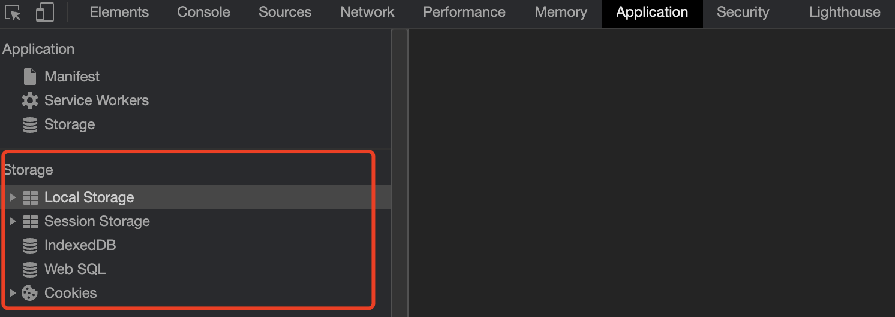

`localStorage：5M，用户不删除，一直都在。`

`sessionStorage：5M，关闭浏览器，自动销毁。`

`cookie：4k，可以设置过期时间。缺点：太小，操作不方便，可以使用js-cookie插件。`

`indexDB：存储大量数据>=250M（无上限），异步操作，性能好。`

## 11. 以上几种前端存储的区别是什么

|    方式名称    | 标准说明     |                                                                                         功能说明                                                                                         |
| :------------: | ------------ | :--------------------------------------------------------------------------------------------------------------------------------------------------------------------------------------: |
|    Cookies     | HTML5 前加入 |    会为每个请求自动携带所有的 Cookies 数据，比较方便，但是也是缺点，浪费流量。每个 domain(站点)限制存储 20 个 cookie。容量只有 4K。浏览器 API 比较原始，需要自行封装操作 (js-cookie)     |
|  localStorage  | HTML5 加入   |                                                                  兼容 IE8+，操作方便。永久存储，除非手动删除。容量为 5M                                                                  |
| sessionStorage | HTML5 加入   |                        功能基本与 localStorage 相似，但当前页面关闭后即被自动清理。与 Cookies、localStorage 不同点是不能在所有同源窗口间共享，属于会话级别的存储                         |
|    Web SQL     | 非标准功能   |                                 2010 年已被废弃，但一些主流浏览器中都有相关的实现。类似于 SQLite 数据库，是一种真正意义上的关系型数据库，⽤ SQL 进⾏操作                                 |
|   IndexedDB    | HTML5 加入   | 是一种 NoSQL 数据库，⽤键值对进⾏储存，可进⾏快速读取操作。适合复杂 Web 存储场景，⽤ JS 操作⽅便 (前端大量存数据的场景较少，如果有，可以用) 。存储空间容量，大于等于 250MB，甚至没有上限 |

# css

## 01. CSS 选择器的优先级

`!important > 内联样式` > `ID选择器` > `类选择器` > `标签选择器 > 通配符 > 继承`

优先级是由 A、B、C、D 四个值来决定的，具体计算规则如下

- A = { 如果存在内联样式则为 1，否则为 0 }
- B = { ID 选择器出现的次数 }
- C = { 类选择器、属性选择器、伪类选择器出现的总次数 }
- D = { 标签选择器、伪元素选择器出现的总次数 }

```css
/*
  A=0   不存在内联样式
  B=0   不存在ID选择器
  C=1   有一个类选择器
  D=3   有三个标签选择器

  最终计算结果：{0,0,1,3}
*/
div ul li .red {
}
```

```css
/*
  A=0   不存在内联样式
  B=1   有一个ID选择器
  C=0   不存在类选择器
  D=0   不存在标签选择器

  最终计算结果：{0,1,0,0}
*/
#mydiv {
}
```

## 02. 通过 CSS 的哪些方式可以实现隐藏页面上的元素

display: none 不占位置

visibility: hidden 占位置

opacity: 0 占位置

transform: scale(0,0)占位置

transform 不会影响布局，改了宽高会

## 03. px em rem 之间有什么区别

px 绝对单位(一旦设置了，就无法因为适应页面大小而改变)；em 相对单位(相对父盒子的 font-size，如果父盒子没有，往上找)；rem 相对单位(相对 html 根字号)

## 04. 水平居中

1. 使用 margin: 0 auto

```html
<div class="center">此盒子会居中</div>

.center {
  height: 500px;
  width: 500px;
  background-color: pink;
  margin: 0 auto;
}
```

2. 转成行内块，给父盒子设置 text-align: center

```html
<div class="father">
  <div class="center">此盒子会居中</div>
</div>

.father {
  text-align: center;
}
.center {
  width: 400px;
  height: 400px;
  background-color: pink;
  display: inline-block;
}
```

3. flex

```html
<div class="father">
  <div class="center">我是内容盒子</div>
</div>

.father {
  display: flex;
  background-color: skyblue;
  justify-content: center;
  align-items: center;
}
.center {
  width: 400px;
  height: 400px;
  background-color: pink;
}
```

4. 定位

```html
<div class="father">
  <div class="center">我是内容盒子</div>
</div>

.father {
  background-color: skyblue;
  position: relative;
  height: 500px;
}
.center {
  width: 400px;
  height: 400px;
  background-color: pink;
  position: absolute;
  left: 50%;
  top: 50%;
  transform: translate(-50%, -50%);
}
```

[【更多方式参考】实现水平居中垂直居中](https://www.cnblogs.com/chengxs/p/11231906.html)

## 05. 在 CSS 中有哪些定位方式

1. 静态定位`static` 默认值不脱离文档流，top，right，bottom，left，z-index 等属性不生效

2. relative 相对定位。参照物：元素偏移前位置。设置了相对定位，左右 margin 为 auto 仍然有效、并且不会脱离文档流。

3. absolute 绝对定位。参照物：最近的一级带有带定位的父级元素（static 除外）进行位置移动如果找不到，那么相对于浏览器窗口进行定位。元素会脱离正常文档流，不在占据空间。左右 margin 为 auto 将会失效。通过 left、top、bottom、right 来决定元素位置。

4. fixed 固定定位。参照物：浏览器窗口。固定定位会脱离文档流。当绝对定位和固定定位参照物都是浏览器窗口时的区别： 当出现滚动条时，固定定位的元素不会跟随滚动条滚动，绝对定位会跟随滚动条滚动

5. sticky 粘性定位

```css
.header {
  position: sticky;
  /* 设置盒子距离浏览器的顶部边缘，多少时开始吸顶 */
  top: 0;
}
```

```html
<style>
  * {
    margin: 0;
    padding: 0;
  }
  .header {
    width: 100%;
    height: 100px;
    background-color: orange;
  }
  .nav {
    width: 100%;
    height: 200px;
    background-color: pink;
    position: sticky;
    top: 0px;
  }
  .main {
    width: 100%;
    height: 100px;
    background-color: skyblue;
  }
</style>

<div class="header">我是头部</div>
<div class="nav">我是导航</div>
<div class="container">
  <div class="main">我是主体部分1</div>
  <div class="main">我是主体部分2</div>
  <div class="main">我是主体部分3</div>
  <div class="main">我是主体部分4</div>
  <div class="main">我是主体部分5</div>
  <div class="main">我是主体部分6</div>
  <div class="main">我是主体部分7</div>
  <div class="main">我是主体部分8</div>
</div>
```

## 06. 如何理解 z-index

z-index 元素的 position 属性需要是 relative，absolute 或是 fixed。

可以将它看做三维坐标系中的 z 轴方向上的图层层叠顺序。

元素默认的 z-index 为 0，可通过修改 z-index 来控制设置了 postion 值的元素的图层位置。

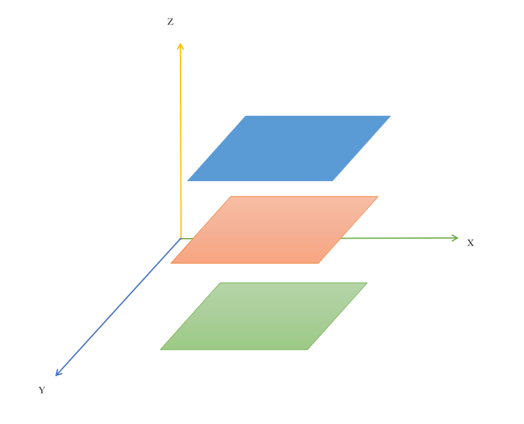

可以将这种关系想象成一摞书本，通过 z-index 可以改变一本书在这摞书中的上下位置。

`z-index 的小坑`，如果父辈元素有定位，且配置了 z-index，优先按照父辈元素的定位的 z-index 进行比较层级

```html
<style>
  .father {
    width: 100%;
    height: 200px;
    position: relative;
    background-color: skyblue;
    z-index: 1;
  }
  .son {
    position: absolute;
    width: 100px;
    height: 100px;
    background-color: red;
    left: 0;
    top: 0;
    z-index: 999;
  }
  .box2 {
    position: absolute;
    width: 100px;
    height: 100px;
    background-color: blue;
    left: 0;
    top: 0;
    z-index: 100;
  }
</style>

<div class="father">
  <div class="son"></div>
</div>

<div class="box2"></div>
```

## 07. 如何清除浮动

容器不设高度且子元素浮动时，容器高度不能被内容撑开，此时，内容会溢出到容器外面而影响布局，这种现象被称为浮动。

`清除浮动`

- 定高法（使用一个空的 div，并设置样式）

```html
<div style="clear:both"></div>
```

- 包含浮动元素的父级标签添加`overflow:hidden(触发了BFC)`或者`overflow:auto`
- 最后一个浮动元素之后添加一个空的 div 标签，并添加`clear:both`样式
- 单伪元素双伪元素清除法

```css
.clearfix:after {
  content: ""; /*设置内容为空*/
  height: 0; /*高度为0*/
  line-height: 0; /*行高为0*/
  display: block; /*将文本转为块级元素*/
  visibility: hidden; /*将元素隐藏*/
  clear: both; /*清除浮动*/
}

.clearfix {
  zoom: 1; /*为了兼容IE*/
}
```

## 08. 谈谈你对 BFC 的理解

<span style="color:red">BFC 块级格式化上下文，是一个独立的渲染区域，BFC 中的元素布局不受外部影响</span>

1. 如何触发 BFC

- 元素设置浮动：float 除 none 以外的值
- 元素设置绝对定位：position (absolute、fixed)
- display 值为：inline-block、table-cell、table-caption、flex 等
- overflow 值为：hidden、auto、scroll

2. BFC 盒子的特点

- 垂直方向上，自上而下排列，和文档流的排列方式一致
- 在 BFC 中上下相邻的两个容器的 margin 会重叠
- 计算 BFC 的高度时，需要计算浮动元素的高度
- BFC 区域不会与浮动的容器发生重叠
- BFC 是独立的容器，容器内部元素不会影响外部元素
- 每个元素的左 margin 值和容器的左 border 相接触

3. BFC 的应用场景

- 场景一：防止两个相邻块级元素的上下 margin 发生重叠 (**上下 margin 合并问题**)

  由于 BFC 是一个独立的区域，内部的元素和外部的元素互不影响，将两个元素变为两个 BFC，就解决了 margin 重叠的问题

属于同一 BFC 的，两个相邻块级子元素的上下 margin 会重叠，如果想让它们不重叠，可通过让这两个相邻块级子元素分属于不同的 BFC。

以下示例代码中的两个盒子的上下外边距会重合（即它们都设置了 10px 的外边距，我们期望它们之间的间距是 20px，但实际效果却只有 10px）

```html
<style>
  .box1 {
    width: 200px;
    height: 100px;
    background-color: red;
    margin-bottom: 10px; /* 下外边距为 10px */
  }

  .box2 {
    width: 200px;
    height: 100px;
    background-color: green;
    margin-top: 10px; /* 上外边距为 10px */
  }
</style>

<div class="box1"></div>
<div class="box2"></div>
```


下面我们让其中一个盒子触发 BFC，从而达到间隔 20px 的期望效果

```css
.box2 {
  width: 200px;
  height: 100px;
  background-color: green;
  margin-top: 10px;
  display: inline-block; /* 通过设置 display 为 inline-block 可以触发 BFC */
}
```

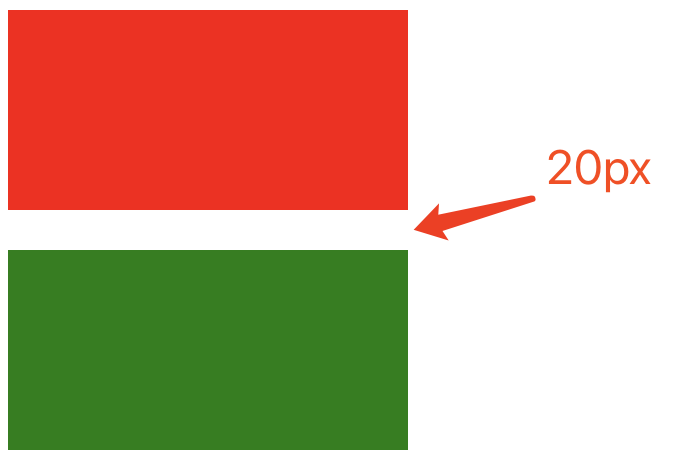

- 场景二：清除浮动

以下示例代码中， 容器元素 box1 的高度会没有高

```html
<style>
  .box1 {
    width: 200px;
    background-color: red;
  }

  .box2 {
    float: left;
    background-color: green;
  }
</style>

<div class="box1">
  <div class="box2">Hello,world</div>
  <div class="box2">Hello,world</div>
  <div class="box2">Hello,world</div>
</div>
```

而通过为 box1 添加 BFC 触发条件，可以让它的高度变回正常状态

```css
.box1 {
  width: 200px;
  background-color: red;
  overflow: hidden;
}
```

- 实现自适应布局(左边固定，右边自适应)，防止元素被浮动元素覆盖

  左侧设置`float:left`，右侧设置`overflow: hidden`。这样右边就触发了 BFC，BFC 的区域不会与浮动元素发生重叠，所以两侧就不会发生重叠，实现了自适应两栏布局

以下示例中，box2 会被设置了浮动的 box1 覆盖

```html
<style>
  .box1 {
    float: left;
    width: 300px;
    background-color: red;
    height: 400px;
  }

  .box2 {
    background-color: blue;
    height: 600px;
  }
</style>

<div class="box1"></div>
<div class="box2"></div>
```


要避免这种覆盖行为，可以让 box2 触发 BFC，实现布局效果，左边固定右边自适应

```css
.box2 {
  background-color: blue;
  height: 600px;
  overflow: hidden; /* 将 overflow 设置为非 visible 值可触发 BFC */
}
```


[参考文章：深入理解 BFC](https://www.cnblogs.com/xiaohuochai/p/5248536.html)

## 09. 什么是 CSS Sprites（雪碧图/精灵图） 以及它的好处

将一个页面涉及到的所有图片都包含到一张大图中去，然后利用 CSS 的 background-image，background-repeat，background-position 属性的组合进行背景定位。

`考察：性能优化的方案`

https://img.alicdn.com/tfs/TB1eiXTXlTH8KJjy0FiXXcRsXXa-24-595.png

优点：利用`CSS Sprites`能很好地减少网页的 http 请求，从而大大提高了页面的性能，这是`CSS Sprites`最大的优点

缺点：

- 任意一张小图的改动，都需要重新生成大图，并且用户端需要重新下载整张大图，这就降低了浏览器缓存的优势
- 随着 HTTP2 的逐渐普及，HTTP2 的多路复用机制可以解决请求多个小图片所创建多个 HTTP 请求的消耗，让 CSS Sprites 存在的价值降低了
- 图片放大会失真

目前其他主流的处理图片的方案：iconfont 字体图标，svg 矢量图...

## 10. 你对媒体查询的理解是什么样的

媒体查询是 C3 加入的功能，它可以进行响应式适配。

什么是响应式适配？根据不同的屏幕尺寸，显示不同的效果（设置盒子样式）

```css
/* 在css样式表的定义中直接使用媒体查询 */
/* min-width（从小到大）max-width（从大到小）*/
.container {
  width: 600px;
  height: 200px;
  background-color: pink;
  margin: 0 auto;
}
@media screen and (max-width: 767px) {
  .container {
    width: 100%;
  }
}
@media screen and (min-width: 768px) and (max-width: 991px) {
  .container {
    width: 750px;
  }
}
@media screen and (min-width: 992px) and (max-width: 1199px) {
  .container {
    width: 980px;
  }
}
@media screen and (min-width: 1200px) {
  .container {
    width: 1170px;
  }
}
@media (width: 1200px) {
  .container {
    background-color: skyblue;
  }
}
```

[参考文章：深入理解 CSS 媒体查询](https://www.cnblogs.com/xiaohuochai/p/5848612.html)

## 11. 你对盒子模型的理解是什么样的

浏览器的渲染引擎在对网页文档进行布局时，会按照 `CSS 基础盒模型 （CSS Basic Box Model）标准`，将文档中的所有元素都表示为一个个矩形的盒子，再用 CSS 去决定这些盒子的大小尺寸、显示位置、以及其他属性（如颜色、背景、边框等）

盒模型都是由四个部分组成的，分别是 margin、border、padding 和 content


## 12. 标准盒模型和怪异盒模型有哪些区别

在 CSS3 中，我们可以通过设置 box-sizing 的值来决定具体使用何种盒模型

- box-sizing：content-box 标准盒模型（默认值）
- box-sizing：border-box 怪异盒模型（目前主流）

1. 标准盒模型的 width 和 height 属性的范围只包含了 content


2. 怪异盒模型的 width 和 height 属性的范围包含了 border、padding 和 content

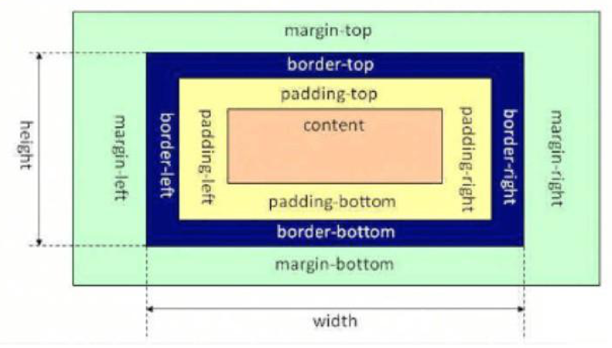

[参考文章：深入理解盒模型](https://www.cnblogs.com/xiaohuochai/p/5202597.html)

## 13. 说说伪类和伪元素的区别

1. 什么是伪类（用来选择元素，伪类和类选择器权重一样）

` :checked``:hover``:disabled ` `:first-child`

2. 什么是伪元素（伪元素创建元素，但是不在 DOM 树中，所以无法注册事件，不要通过 js 控制伪元素）

:before / :after（可以一个冒号或两个冒号为前缀）

[参考文章：伪类与伪元素](http://www.alloyteam.com/2016/05/summary-of-pseudo-classes-and-pseudo-elements/)

## 14. 谈谈你对 flex 的理解

思考：多个盒子横向排列使用什么属性？可以使用浮动，但是浮动的盒子脱标。


在真实的应用场景中，通常会遇到各种各样不同尺⼨和分辨率的设备，为了能在所有这些设备上正常的布局我们的应用界面，就需要响应式的界⾯设计方式来满⾜这种复杂的布局需求。

flex 弹性盒模型的优势在于开发⼈员只需要声明布局应该具有的⾏为，⽽不需要给出具体的实现⽅式，浏览器负责完成实际布局，当布局涉及到不定宽度，分布对⻬的场景时，就要优先考虑弹性盒布局。

flex 使用方式：父元素添加 display: flex;子元素可以自动的挤压后拉伸。

- 网页中，盒子之间有间距吗？有，在 flex 布局模型中，调节主轴或者侧轴来设置盒子之间的间距

  `justify-content`父元素添加，调节元素在主轴的对齐方式

```
flex-start: 弹性盒子元素将向起始位置对齐
flex-end: 弹性盒子元素将向结束位置对齐
center: 弹性盒子元素将向行中间位置对齐
space-around: 弹性盒子元素会平均地分布在行里
space-between: 第一个贴左边，最后一个贴右边，其他盒子均分，保证每个盒子之间的空隙是相等的
space-evenly: 弹性盒子沿主轴均匀排列,  弹性盒子与容器之间间距相等
```

`align-items`父元素添加，调节元素在侧轴的对齐方式

`align-self`（自己添加）控制某个弹性盒子在侧轴的对齐方式

```txt
flex-start：元素在侧轴的起始位置对齐。
flex-end：元素在侧轴的结束位置对齐。
center：元素在侧轴上居中对齐。
stretch：元素的高度会被拉伸到最大（不给高度时, 才拉伸）。
```

- flex 布局模型中，弹性盒子默认沿着哪个方向排列？水平方向。

  主轴默认是水平方向，侧轴默认是垂直方向

  flex-direction 调整主轴方向

```tex
row：主轴方向为水平向右
column：主轴方向为竖直向下
row-reverse：主轴方向为水平向左
column-reverse：主轴方向是竖直向上
```

- flex-wrap 父元素添加，弹性盒子多行排列效果

  

```txt
nowrap： 不换行（默认），如果宽度溢出，会压缩子盒子的宽度。
wrap： 当宽度不够的时候，会换行。
```

align-content 调整行对齐方式，取值与 justify-context 基本相同

```txt
flex-start：各行向侧轴的起始位置堆叠。
flex-end：各行向弹性盒容器的结束位置堆叠。
center：各行向弹性盒容器的中间位置堆叠。
space-around：各行在侧轴中平均分布。
space-between：第一行贴上边，最后一个行贴下边,其他行在弹性盒容器中平均分布。
stretch：拉伸，不设置高度的情况下。
```

- 使用 flex 属性修改弹性盒子伸缩比。子元素添加 flex:值。取值：整数。只占用父盒子剩余尺寸。

> 可参考 [flex 布局教程](http://www.ruanyifeng.com/blog/2015/07/flex-grammar.html)

# js

## 01. 解释下什么是变量声明提升

`变量声明之前即可被访问`，仅存在于 var 声明的变量。

JS 引擎在运行一份代码的时候，会按照下面的步骤进行工作

1. 首先，对代码进行预解析，并获取声明的所有变量

2. 然后，将这些变量的声明语句统一放到代码的最前面

3. 最后，开始一行一行运行代码

我们通过一段代码来解释这个运行过程

```js
console.log(a)

var a = 1

function b() {
  console.log(a)
}

b() // 1
```

上⾯这段代码的实际执⾏顺序为

1. JS 引擎将 `var a = 1` 分解为两个部分：变量声明语句 `var a = undefined` 和变量赋值语句 `a = 1`
2. JS 引擎将 `var a = undefined` 放到代码的最前面，而 `a = 1` 保留在原地

也就是说经过了转换，代码就变成了

```js
var a = undefined

console.log(a) // undefined

a = 1

function b() {
  console.log(a)
}

b() // 1
```

变量的这一转换过程，就被称为变量的声明提升。

而这是不规范，不合理的，我们用的 let/const 就没有这个变量提升的问题。

注意事项：

1. 变量提升是在当前作用域最前面
2. 同时存在函数和 var 时，先提升函数声明
3. 当遇到 return 以下代码不会执行，但是还是会进行预解析
4. let 声明的变量不会挂载到全局 window 上，var 会

```js
function b() {}
console.log(b)
var b = 2
// 以上代码被解析成
function b() {}
var b
console.log(b)
b = 2
```

```js
var foo = 1
function fn() {
  foo = 10
  return
  function foo() {}
}
fn()
console.log(foo)
// 以上代码被解析成
function fn() {
  function foo() {}
  foo = 10
  return
}
var foo
foo = 1
fn()
console.log(foo)
```

## 02. JS 的参数是以什么方式进行传递的

值类型（简单数据类型）： string ，number，boolean，undefined，null

值类型变量的数据直接存放在变量（栈空间）中


引用类型（复杂数据类型）：通过 new 关键字创建的对象（系统对象、自定义对象），如 Object、Array、Date 等

引用类型`变量（栈空间）里存放的是地址`，真正的对象实例存放在堆空间中


`基本数据类型：值传递`

```js
let a = 1

function test(x) {
  x = 10 // 并不会改变实参的值
  console.log(x)
}

test(a) // 10
console.log(a) // 1
```

`复杂类型：传递的是地址! (变量中存的就是地址)`

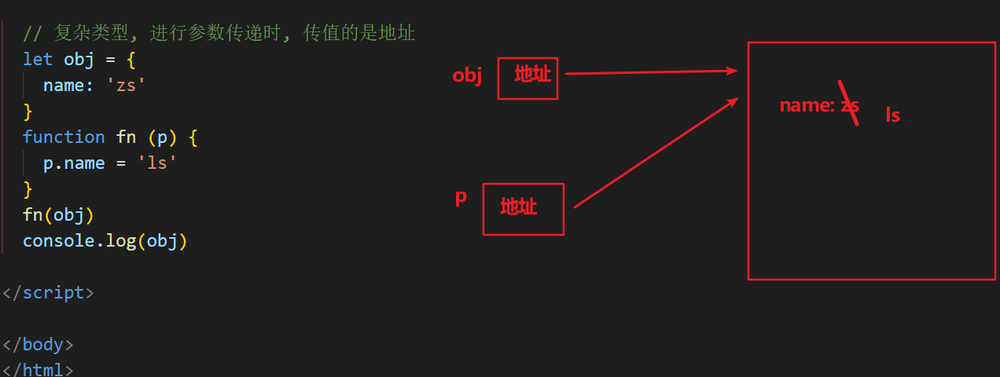

来看下面的代码：

```js
let a = {
  count: 1,
}

function test(x) {
  x.count = 10
  console.log(x)
}

test(a) // { count: 10 }
console.log(a) // { count: 10 }
```

从运行结果来看，函数内改变了参数对象内的 `count` 后，外部的实参对象 `a` 的内容也跟着改变了，所以传递的是地址。

思考题：

```js
let a = {
  count: 1,
}

function test(x) {
  x = { count: 20 }
  console.log(x)
}

test(a) // { count: 20 }
console.log(a) // { count: 1 }
```

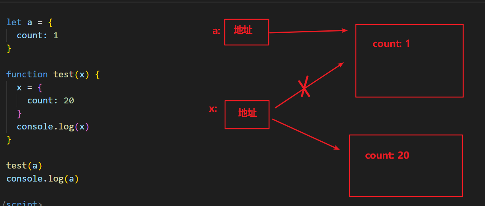

我们会发现外部的实参对象 `a` 并没有因为在函数内对形参的重新赋值而被改变！

因为当我们直接为这个形参变量重新赋值时，其实只是让形参变量指向了别的堆内存地址，而外部实参变量的指向还是不变的。

下图展示的是复杂类型参数传递后的状态：


下图展示的是重新为形参赋值后的状态：


## 03. js 垃圾回收（GC）是怎么做的

JS 中内存的分配和回收都是自动完成的，`内存`在不使用的时候会被垃圾回收器自动回收。

正因为垃圾回收器的存在，许多人认为 JS 不用太关心内存管理的问题，

但如果不了解 JS 的内存管理机制，我们同样非常容易成内存泄漏（内存无法被回收）的情况。

不在用到的内存，没有及时释放，就叫做内存泄漏

### 内存的生命周期

JS 环境中分配的内存, 一般有如下生命周期：

1. 内存分配：当我们声明变量、函数、对象的时候，系统会自动为他们分配内存

2. 内存使用：即读写内存，也就是使用变量、函数等

3. 内存回收：使用完毕，由垃圾回收自动回收不再使用的内存

   全局变量一般不会回收（关闭页面回收），一般局部变量的的值，不用了，会被自动回收掉

内存分配：

```jsx
// 为变量分配内存
let i = 11
let s = "ifcode"

// 为对象分配内存
let person = {
  age: 22,
  name: "ifcode",
}

// 为函数分配内存
function sum(a, b) {
  return a + b
}
```

### 垃圾回收算法说明

所谓垃圾回收，核心思想就是如何判断内存是否已经不再会被使用了，如果是，就视为垃圾，释放掉

下面介绍两种常见的浏览器垃圾回收算法：引用计数 和 标记清除法

### 引用计数

IE 采用的引用计数算法，定义“内存不再使用”的标准很简单，就是看一个对象是否有指向它的引用。如果没有任何变量指向它了，说明该对象已经不再需要了。

```jsx
// 创建一个对象person, person指向一块内存空间, 该内存空间的引用数 +1
let person = {
  age: 22,
  name: "ifcode",
}

let p = person // 两个变量指向一块内存空间, 该内存空间的引用数为 2
person = 1 // 原来的person对象被赋值为1，对象内存空间的引用数-1,
// 但因为p指向原person对象，还剩一个对于对象空间的引用, 所以对象它不会被回收

p = null // 原person对象已经没有引用，会被回收
```

由上面可以看出，引用计数算法是个简单有效的算法。

**但它却存在一个致命的问题：循环引用。**

如果两个对象相互引用，尽管他们已不再使用，垃圾回收器不会进行回收，导致内存泄露。

```jsx
function cycle() {
  let o1 = {}
  let o2 = {}
  o1.a = o2
  o2.a = o1
  return "Cycle reference!"
}

cycle()
```


### 标记清除算法

现代的浏览器已经不再使用引用计数算法了。

现代浏览器通用的大多是基于标记清除算法的某些改进算法，总体思想都是一致的。

标记清除法：

- 标记清除算法将“不再使用的对象”定义为“无法达到的对象”

- 简单来说，就是从根部（在 JS 中就是全局对象）出发定时扫描内存中的对象

- 凡是能从根部到达的对象，都是还需要使用的。那些无法由根部出发触及到的对象被标记为不再使用，稍后进行回收

从这个概念可以看出，无法触及的对象包含了没有引用的对象这个概念（没有任何引用的对象也是无法触及的对象）

根据这个概念，上面的例子可以正确被垃圾回收处理了

参考文章：[JavaScript 内存管理](https://www.jianshu.com/p/84a8fd5fa0ee)

## 04. 谈谈你对 JavaScript 作用域链的理解

作用域（scope）规定了变量能被访问的“范围”，离开了这个“范围”变量便不能被访问。

作用域链本质上是底层变量的查找机制，在函数被执行时，会优先在当前函数作用域中查找变量，如果当前作用域查不到则会依次逐级查找父级作用域知道全局作用域。

JavaScript 在执⾏过程中会创建一个个的**可执⾏上下⽂**。 (每个函数执行都会创建这么一个可执行上下文)

每个可执⾏上下⽂的词法环境中包含了对外部词法环境的引⽤，可通过该引⽤来获取外部词法环境中的变量和声明等。

这些引⽤串联起来，⼀直指向全局的词法环境，形成一个链式结构，被称为作⽤域链。

简而言之：函数内部 可以访问到 函数外部作用域的变量，而外部函数还可以访问到全局作用域的变量，这样的变量作用域访问的链式结构，被称之为作用域链。

```js
let num = 1

function fn() {
  let a = 100
  function inner() {
    console.log(a)
    console.log(num)
  }
  inner()
}
fn()
```

下图为由多个可执行上下文组成的调用栈：

- 栈最底部为`全局可执行上下文`
- `全局可执行上下文` 之上有多个 `函数可执行上下文`
- 每个可执行上下文中包含了指向外部其他可执行上下文的引用，直到 `全局可执行上下文` 时它指向 `null`

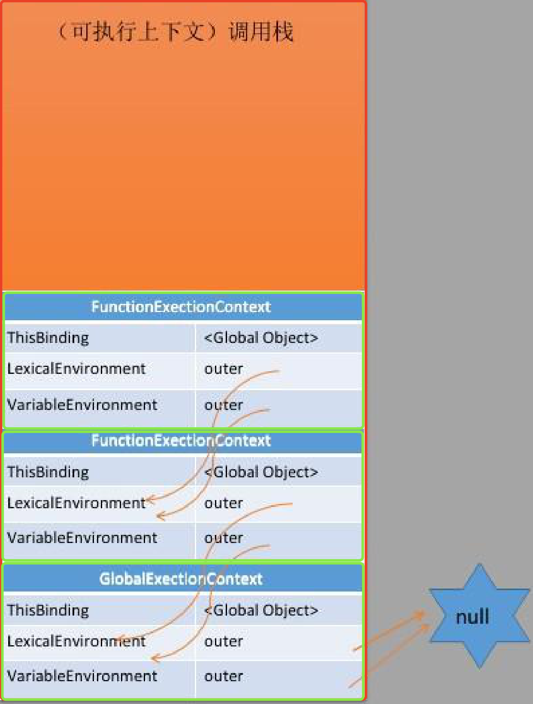


js 全局有全局可执行上下文, 每个函数调用时, 有着函数的可执行上下文, 会入 js 调用栈

每个可执行上下文, 都有者对于外部上下文词法作用域的引用, 外部上下文也有着对于再外部的上下文词法作用域的引用

**=> 就形成了作用域链**

## 05. 谈谈你对闭包的理解

这个问题想考察的主要有两个方面：

- 对闭包的基本概念的理解
- 对闭包的作用的了解

**什么是闭包？**

MDN 的官方解释：

> 闭包是函数和声明该函数的词法环境的组合

更通俗一点的解释是：

> 内层函数, 引用外层函数上的变量, 就可以形成闭包

需求: 定义一个计数器方法, 每次执行一次函数, 就调用一次进行计数

```js
let count = 0
function fn() {
  count++
  console.log("fn函数被调用了" + count + "次")
}
fn()
```

这样不好! count 定义成了全局变量, 太容易被别人修改了, 我们可以利用闭包解决

闭包实例:

```jsx
function fn() {
  let count = 0

  function add() {
    count++
    console.log("fn函数被调用了" + count + "次")
  }

  return add
}
const addFn = fn()
addFn()
addFn()
addFn()
```

**闭包的主要作用是什么？**

在实际开发中，闭包最大的作用就是用来 **变量私有**。

下面再来看一个简单示例：

```js
function Person() {
  // 以 let 声明一个局部变量，而不是 this.name
  // this.name = 'zs'     =>  p.name
  let name = "hm_programmer" // 数据私有

  this.getName = function () {
    return name
  }

  this.setName = function (value) {
    name = value
  }
}

// new:
// 1. 创建一个新的对象
// 2. 让构造函数的this指向这个新对象
// 3. 执行构造函数
// 4. 返回实例
const p = new Person()
console.log(p.getName()) // hm_programmer

p.setName("Tom")
console.log(p.getName()) // Tom

p.name // 访问不到 name 变量：undefined
```

在此示例中，变量 `name` 只能通过 Person 的实例方法进行访问，外部不能直接通过实例进行访问，形成了一个私有变量。

## 06. 隐式类型转换

判断时，尽量不要用 `==` , 要用 `===`，两个等号判断，如果类型不同，默认会进行隐式类型转换再比较。


## 07. 谈谈你对原型链的理解

要讲清楚这个问题，主要着重这几个方面

- 什么是原型对象
- 构造函数，原型对象，实例对象的三角关系图
- 原型链如何形成


`原型对象`

js规定，每一个构造函数都有一个prototype属性，指向另一个对象，这个对象称为原型对象。

基于构造函数创建出来的实例，都可以共享访问原型对象的属性。

例如我们的 `hasOwnProperty`, `toString` ⽅法等其实是 Obejct 原型对象的方法，它可以被任何对象当做⾃⼰的⽅法来使⽤。

`hasOwnProperty` 用于判断，某个属性，是不是自己的 (还是原型链上的)

来看一段代码：

```js
let person = {
  name: "Tom",
  age: 18,
  job: "student",
}

console.log(person.hasOwnProperty("name")) // true
console.log(person.hasOwnProperty("hasOwnProperty")) // false
console.log(Object.prototype.hasOwnProperty("hasOwnProperty")) // true
```

可以看到，`hasOwnProperty` 并不是 `person` 对象的属性，但是 `person` 却能调用它。

那么 `person` 对象是如何找到 Object 原型中的 `hasOwnProperty` 的呢？这就要靠原型链的能力了。

需求: 简单绘制原型三角关系图!

**原型链**

在 JavaScript 中，每个对象中都有一个 `__proto__` 属性，这个属性指向了当前对象的构造函数的原型。

对象可以通过自身的 `__proto__`属性与它的构造函数的原型对象连接起来，

而因为它的原型对象也有 `__proto__`，因此这样就串联形成一个链式结构，也就是我们称为的原型链。


## 08. 谈谈对于继承的理解

**为什么要学习继承 ?**

写的构造函数, 定义了一个类型 (人类), 万一项目非常大, 又有了细化的多个类型 (老师, 工人, 学生)

学习继承, 可以让多个构造函数之间建立关联, 便于管理和复用

**什么是继承 ?**

继承: 从别人那里, 继承东西过来 (财产, 房产)

代码层面的继承: 继承一些属性构造的过程和方法

### 原型继承

原型继承: 通过改造原型链, 利用原型链的语法, 实现继承方法!

分析需求:

人类, 属性: name, age

学生, 属性: name, age, className

工人, 属性: name, age, companyName

无论学生, 还是工人, => 都是人类, 所以人类原型上有的方法, 他们都应该要有

```js
// 1. 定义Person构造函数
function Person(name, age) {
  this.name = name
  this.age = age
}
Person.prototype.say = function () {
  console.log("人类会说话")
}

// 2. 定义Student构造函数
function Student(name, age, className) {
  this.name = name
  this.age = age
  this.className = className
}
// 3. 原型继承: 利用原型链, 继承于父级构造函数, 继承原型上的方法
// 语法: 子构造函数.prototype = new 父构造函数()
Student.prototype = new Person()
Student.prototype.study = function () {
  console.log("学生在学习")
}

let stu = new Student("张三", 18, "80期")
stu.say()
console.log(stu)
```


### 组合继承

组合继承有时候也叫伪经典继承，指的是将原型链 和 借用构造函数 call 技术组合到一块，

从而发挥二者之长的一种继承模式，其背后的思路: **是使用原型链实现对原型属性和方法的继承 (主要是方法)，**

**而通过借用构造函数来实现对实例属性构造的继承**。这样既通过在原型上定义方法实现了函数复用，又能保证每个实例都有它的自己的属性。

```js
// 1. 定义Person构造函数
function Person(name, age) {
  this.name = name
  this.age = age
}
Person.prototype.say = function () {
  console.log("人类会说话")
}

// 2. 定义Student构造函数
function Student(name, age, className) {
  Person.call(this, name, age) // 实现构造属性的继承
  this.className = className
}

// 3. 原型继承: 利用原型链, 继承于父级构造函数, 继承原型上的方法
// 语法: 子构造函数.prototype = new 父构造函数()
Student.prototype = new Person()
Student.prototype.study = function () {
  console.log("学生在学习")
}

let stu = new Student("张三", 18, "80期")
stu.say()
console.log(stu)

// 方法通过 原型继承
// 属性通过 父构造函数的.call(this, name, age)
```

### 寄生组合继承

student 实例上有 name age, 而原型 `__proto__`上不需要再有这些属性, 所以利用 Object.create 改装下

Object.create(参数对象),

1. Object.create 会创建一个新对象,
2. 并且这个新对象的`__proto__` 会指向传入的参数对象

```js
// 1. 定义Person构造函数
function Person(name, age) {
  this.name = name
  this.age = age
}
Person.prototype.say = function () {
  console.log("人类会说话")
}

// 2. 定义Student构造函数
function Student(name, age, className) {
  Person.call(this, name, age)
  this.className = className
}

// 3. 原型继承: 利用原型链, 继承于父级构造函数, 继承原型上的方法
// 语法: 子构造函数.prototype = new 父构造函数()
Student.prototype = Object.create(Person.prototype)
Student.prototype.study = function () {
  console.log("学生在学习")
}

let stu = new Student("张三", 18, "80期")
stu.say()
console.log(stu)

// 总结:
// Object.create() 以参数的对象, 作为新建对象的__proto__属性的值, 返回新建的对象
```


### es6 - class 实现继承 extends

```jsx
// 继承关键字 => extends
class Person {
  constructor(name, age) {
    this.name = name
    this.age = age
  }
  jump() {
    console.log("会跳")
  }
}

class Teacher extends Person {
  constructor(name, age, lesson) {
    super(name, age) // extends 中, 必须调用 super(), 会触发执行父类的构造函数
    this.lesson = lesson
    console.log("构造函数执行了")
  }
  sayHello() {
    console.log("会打招呼")
  }
}

let teacher1 = new Teacher("zs", 18, "体育")
console.log(teacher1)
```

## 09. 如何判断是否是数组

方法一：使用 `toString` 方法

```js
function isArray(arg) {
  return Object.prototype.toString.call(arg) === "[object Array]"
}

let arr = [1, 2, 3]
isArray(arr) // true
```

方法二：使用 ES6 新增的 `Array.isArray` 方法

```js
let arr = [1, 2, 3]
Array.isArray(arr) // true
```

## 10. this

`普通函数`

默认绑定（指向 window 的情况，函数调用模式 fn()）

默认情况下，`this` 会被绑定到全局对象上，比如在浏览器环境中就为`window`对象，在 node.js 环境下为`global`对象。

```js
message = "Hello"

function test() {
  console.log(this.message)
}

test() // "Hello"
```

隐式绑定（谁调用，this 指向谁，方法调用模式 obj.fn()）

如果函数的调用是从对象上发起时，则该函数中的 `this` 会被自动隐式绑定为对象：

```js
function test() {
  console.log(this.message)
}

let obj = {
  message: "hello,world",
  test: test,
}

obj.test() // "hello,world"
```

显式绑定（又叫做硬绑定，上下文调用模式，想让 this 指向谁，this 就指向谁）

```js
function test() {
  console.log(this.message)
}

let obj1 = {
  message: "你好世界123",
}

test.bind(obj1)() // "你好世界123"
```

new 绑定（构造函数模式）

当使用 `new` 调用构造函数时，会创建一个新的对象并将该对象绑定到构造函数的 `this` 上：

```js
function Greeting(message) {
  this.message = message
}

var obj = new Greeting("hello,world")
obj.message // "hello,world"
```

案例 1：

```jsx
let obj = {
  a: {
    fn: function () {
      console.log(this)
    },
    b: 10,
  },
}
obj.a.fn()
let temp = obj.a.fn
temp() // window
```

案例 2：

```js
function Person(theName, theAge) {
  this.name = theName
  this.age = theAge
}
Person.prototype.sayHello = function () {
  // 定义函数
  console.log(this)
}

let per = new Person("小黑", 18)
per.sayHello()
```

`箭头函数`

- 箭头函数属于表达式函数，因此不存在函数提升

- 箭头函数只有一个参数时，可以省略圆括号

- 箭头函数函数体只有一行代码时可以省略花括号，并自动作为返回值被返回

- 加括号的函数体返回对象字面量表达式

  ```js
  const fn = uname => ({ uname: uname }) // 加括号的函数体返回对象字面量表达式
  ```

- 普通函数有 arguments 动态参数，箭头函数没有，但是箭头函数有剩余参数...args

  ```js
  const getSum = (...args) => {
    let sum = 0
    for (let i = 0; i < args.length; i++) {
      sum += args
    }
    return sum
  }

  console.log(getSum(1, 2, 3)) // 6
  ```

- 箭头函数没有自己的 this，箭头函数中的 this 指向自己的作用域链的上一层的 this。它总是指向最近的外层作用域中的 this 所指对象

  ```js
  const user = {
    name: "小明",
    sleep: function () {
      console.log(this) // 指向user
      const fn = () => {
        console.log(this) // 指向user
      }
      fn()
    },
  }
  user.sleep()
  ```

  ```js
  console.log(this) // window
  const sayHi = () => {
    console.log(this) // window
  }
  btn.addEventListener("click", () => {
    console.log(this) // window
  })
  ```

  ```js
  const user = {
    name: "小明",
    walk: () => {
      console.log(this) // window
    },
  }
  user.walk()
  ```

`改变this指向`

call（了解）：返回值就是函数的返回值，因为它就是调用函数

```js
const obj = {
  name: "德华",
}
function fn(x, y) {
  console.log(this) // this指向obj
  console.log(x + y)
}
fn.call(obj, 1, 2)
```

apply（了解）：返回值就是函数的返回值，因为它就是调用函数

```js
function fn(x, y) {
  return x + y
}
let res = fn.apply(null, [1, 2])
```

`bind`：返回由指定的 this 值和初始化参数改造的 原函数拷贝 （新函数）

```js
function sayHi() {
  console.log(this)
}
let user = {
  uname: "德华",
  age: 18,
}
let res = sayHi.bind(user)
res()
```

三者区别：

都可以改变函数内部 this 指向

call 和 apply 会调用函数，并且改变函数内部 this 指向

call 和 apply 传递的参数不一样，call 传递参数 aru1,aru2...。apply 必须传入数组形式[arg]

bind 不会调用函数，可以改变函数内部 this 指向

## 11. promise

为什么js是单线程？js是运行在浏览器的脚本语言，目的是实现页面上的动态交互如果是多个线程，对某个元素进行操作，其中某个线程对该元素做了修改，另外的线程将该元素删除，这样浏览器无法确定到底采用哪个线程。

js是`单线程执行`的编程语言。也就是说同一时间只能做一件事情。如果前一个任务非常耗时，则后续的任务就不得不一直等待，从而导致`程序假死`的问题。为了防止某个耗时任务导致程序假死，js把任务分成了两类：

同步任务：在主线程上排队执行的任务

异步任务：异步（耗时）任务由js委托给宿主环境执行，当异步任务执行完成后，会通知js主线程`执行异步任务的回调函数`

- 异步任务有setTimeout setInterval ajax fs.readFile 事件处理函数

- `一般异步任务都会用到回调函数`

  ~~~js
  // 回调函数：把一个函数当作参数传递，将来特定的时机调用
  setTimeout(() => {
    console.log('hello')
  }, 1000)
  ~~~

  `回调函数有什么问题？`

  回调函数可阅读性差，难以维护，多层回调函数相互嵌套就形成了`回调地狱`

  ~~~js
  setTimeout(() => {
    console.log('延时 1 秒后输出')
  
    setTimeout(() => {
      console.log('再延时 2秒后输出')
  
      setTimeout(() => {
        console.log('再延时 3秒后输出')
      }, 3000)
    }, 2000)
  }, 1000)
  ~~~

`promise设计之初就是用来解决回调地狱的`

promise是个构造函数可以封装一个异步任务。那这个异步任务是执行成功还是执行失败？

~~~js
const p = new Promise((resolve, reject) => {
  // promise内部一般可以封装一个异步操作
  // resolve,reject是promise内部提供好的两个函数
  // 成功调用reslove,失败调用reject
})
~~~

`promie支持链式调用，从而解决回调地狱的问题。如果上一个 .then 中返回一个新的 promise 对象，则可以交给下一个 .then 继续处理。`

~~~js
new Promise((resolve, reject) => {
  setTimeout(() => {
    resolve('延时 1 秒后输出')
  }, 1000)
}).then(res => {
  console.log(res) // 延时 1 秒后输出

  return new Promise((resolve, reject) => {
    setTimeout(() => {
      resolve('再延时 2秒后输出')
    }, 2000)
  }).then(res => {
    console.log(res) // 再延时 2秒后输出

    return new Promise((resolve, reject) => {
      setTimeout(() => {
        resolve('再延时 3秒后输出')
      }, 3000)
    }).then(res => {
      console.log(res) // 再延时 3秒后输出
    })
  })
})
~~~

这样看起来似乎也并不友好，让我们进行优化下

~~~js
// 将创建 promise 对象的过程，封装到一个函数中，需要promise对象，调函数即可
function fn(msg, time) {
  return new Promise((resolve, reject) => {
    setTimeout(() => {
      resolve(msg)
    }, time)
  })
}

fn('延时 1 秒后输出', 1000)
  .then(res => {
    console.log(res) // 延时 1 秒后输出

    return fn('再延时 2秒后输出', 2000)
  })
  .then(res => {
    console.log(res) // 再延时 2秒后输出

    return fn('再延时 3秒后输出', 3000)
  })
  .then(res => {
    console.log(res) // 再延时 3秒后输出
  })
~~~

以上就解决了回调地狱的问题，那么再来看看在ajax中如何运用

~~~js
// promise是一个对象，来表示一个异步任务在执行完毕后，到底是成功还是失败
function ajax(url) {
  return new Promise((resolve, reject) => {
    const xhr = new XMLHttpRequest()
    xhr.open('GET', url)
    xhr.responseType = 'json'
    xhr.onload = function () {
      if (this.status === 200) {
        resolve(this.response)
      } else {
        reject(new Error(this.statusText))
      }
    }
  })
}
ajax(url)
~~~


promise有三种状态：`一旦promise状态发生变化，状态就会被凝固`


1. pending：默认状态，等待（进行中）
2. fulfilled：成功（已完成），调用了resolve函数，promsie的状态就会被标记为成功
3. rejected：失败（拒绝），调用了reject函数，promise的状态就会被标记为失败


## 12. async/await

async用来简化promise异步操作。在 async/await 出现之前，只能通过链式调用处理异步操作。虽然解决了回调地狱的问题，但是链式调用代码冗余、阅读性差、不易理解。

1. 同步化代码的阅读体验（Promise 虽然摆脱了回调地狱，但 then 链式调⽤的阅读负担还是存在的）
2. 和同步代码更一致的错误处理方式（ async/await 可以⽤成熟的 try/catch 做处理，比 Promise 的错误捕获更简洁直观）
3. 调试时的阅读性，也相对更友好

~~~js
function fn(msg, time) {
  return new Promise((resolve, reject) => {
    setTimeout(function () {
      resolve(msg)
    }, time)
  })
}

// async用于修饰一个函数，表示一个函数是异步的
// async会⾃动将常规函数转换成Promise，返回值也是⼀个Promise对象
// 如果async函数内没有await，那么async没有意义，全是同步的内容，只有遇到了await开始往下，才是异步的开始

// await后面一般会跟一个promise对象，await会阻塞async函数的执行，直到等到promise成功的结果（只会等待成功的结果）
// 如果失败了会报错，需要使用try/catch捕获

// 在async函数中，第一个await之前的代码会同步执行，await之后的代码会异步执行
console.log('a')
async function demo() {
  console.log('b')

  let res1 = await fn('延时 1 秒后输出', 1000)
  console.log(res1) // 延时 1 秒后输出

  let res2 = await fn('再延时 2秒后输出', 2000)
  console.log(res2) // 再延时 2秒后输出

  let res3 = await fn('再延时 3秒后输出', 3000)
  console.log(res3) // 再延时 3秒后输出

  console.log('c')
}
demo()
console.log('d')
~~~

## 15. 深拷贝 浅拷贝（只针对引用类型）

开发中，我们经常需要复制一个对象，如果直接用复制会有下面问题：

引用类型，进行复制时，复制的是地址。

```js
const obj = {
  name: "德华",
  age: 18,
}
const obj2 = obj
obj2.name = "德芙"
console.log(obj)
// obj对象里的name也发生了变化
```


浅拷贝：`拷贝对象时，里面的属性值是简单数据类型直接拷贝值。属性值是引用数据类型拷贝的是地址。`

常见方法：

1. 拷贝对象：Object.assign() / 展开运算符{ ...obj }

2. 拷贝数组：Array.prototype.concat() / [ ...arr ]

```jsx
const obj = {
  uname: "德华",
}
const obj2 = { ...obj }
```

```js
const obj = {
  uname: "德华",
  age: 18,
  family: {
    sister: "德芙",
  },
}

const obj2 = {}
Object.assign(obj2, obj)
obj2.family.sister = "丝滑"
```

深拷贝：`拷贝的是对象，不是地址。`

常见方法：

1. 通过递归实现深拷贝（如果一函数在内部可以调用自己，那么这个函数就是递归函数。递归容易发生`栈溢出`，所以必须加退出条件 return）

   ```js
   let num = 1
   function fn() {
     console.log("我要打印6次")
     if (num >= 6) return
     num++
     fn() // 函数内部调用自己
   }
   fn()
   ```

2. lodash / cloneDeep

3. 通过 JSON.stringfy()实现

```jsx
let obj = {
  name: "zs",
  age: 18,
  car: {
    brand: "宝马",
    price: 100,
  },
}

let obj2 = JSON.parse(JSON.stringify(obj))
```

## 16. 事件循环

事件循环（EventLoop）：js是单线程的，同步任务由js主线程按次序执行，遇到异步任务交给浏览器（宿主环境），浏览器帮你监听，如果满足条件（已完成的异步任务对应的回调函数，会被加入到任务队列中等待执行），先在任务队列里排队，等js主线程执行完，再把代执行的任务交给主线程。


JavaScript 把异步任务又做了进一步的划分，异步任务又分为两类，分别是：

1. 宏任务：script、ajax、setTimeout、setInterval、文件操作..

2. 微任务：Promise.then、.catch 和 .finallyprocess.nextTick

宏任务和微任务的执行顺序：每一个宏任务执行完之后，都会检查是否存在待执行的微任务，如果有，则执行完所有微任务之后，再继续执行下一个宏任务。


练习题：

~~~js
// 1 3 5 2 4
console.log(1)

setTimeout(function () {
  console.log(2)
}, 0)

console.log(3)

setTimeout(function () {
  console.log(4)
}, 1000)

console.log(5)
~~~

~~~js
let num = 10
setTimeout(function () {
  num = 100
}, 0)
console.log(num) // 10
~~~

~~~js
async function fn() {
  console.log('嘿嘿')
  // await右边的表达式会立即执行
  const res = await fn2() // fn2()是同步的内容，await等待fn2()的结果
  console.log(res) // 微任务
}
async function fn2() {
  console.log('gaga')
}
fn()
console.log(222)
// 嘿嘿 gaga 222 undefined
~~~

~~~js
// 1 3 4 5 1000 2
console.log(1)

setTimeout(function () {
  console.log(2)
}, 0)

// promise本身是一个同步代码，只有它后面调用的then方法里的回调函数才是微任务
const p = new Promise((resolve, reject) => {
  console.log(3)
  resolve(1000) // 成功后触发then方法
  console.log(4)
})

p.then(data => {
  console.log(data)
})

console.log(5)
~~~

~~~js
console.log(1)

setTimeout(function () {
  console.log(2)
  new Promise(function (resolve) {
    console.log(3)
    resolve()
  }).then(function () {
    console.log(4)
  })
})

new Promise(function (resolve) {
  console.log(5)
  resolve()
}).then(function () {
  console.log(6)
})

setTimeout(function () {
  console.log(7)
  new Promise(function (resolve) {
    console.log(8)
    resolve()
  }).then(function () {
    console.log(9)
  })
})

console.log(10)
~~~

# http

## 01. HTTP 有哪些请求⽅法

## 02. HTTP请求方法的具体作用（前5个）

|  方法   |                             功能                             |
| :-----: | :----------------------------------------------------------: |
|   GET   |                       从服务器获取资源                       |
|  POST   |                       向服务器新增数据                       |
|  HEAD   | 请求资源的头部信息，并且这些头部与 HTTP GET ⽅法请求时返回的⼀致。<br />该请求⽅法的⼀个使⽤场景是在下载⼀个⼤⽂件前先获取其⼤⼩再决定是否要下载，以此可以节约带宽资源。 |
|   PUT   | 更新服务器上的数据，侧重于完整更新。例如：更新用户的完整信息 |
| DELETE  |                      删除服务器上的数据                      |
| OPTIONS | ⽤于获取⽬的资源所⽀持的通信选项 (跨域请求前，预检请求，判断目标是否安全) |
|  TRACE  | 该方法会让服务器原样返回任意客户端请求的信息内容，用于诊断和判断。 |
| CONNECT | HTTP/1.1 协议中预留给能够将连接改为管道⽅式的代理服务器<br />(把服务器作为跳板，让服务器代替用户去访问其它网页，之后把数据原原本本的返回给用户) |
|  PATCH  | 更新服务器上的数据，侧重于部分更新。例如：只更新用户的手机号 |

GET/DELETE 参数是在地址栏中传递的

PUT/PATCH/POST 参数是在请求体传递的

## 03. GET 和 POST 区别

数据传输方式：GET在地址栏中传递。POST在请求体中传递。

数据安全：GET相对POST不安全，默认http是明文传输，可以破解，https会对内容进行加密。

数据类型：GET只允许 ASCII 字符。POST⽆限制（文件、图片...）

功能特性：GET安全且幂等（安全：只读特性，使⽤这个⽅法不会引起服务器状态变化。幂等：同⼀个请求⽅法执⾏多次和仅执⾏⼀次的效果完全相同）。POST⾮安全、⾮幂等。

请求长度：浏览器由于对 url 长度的限制，所以会影响 get 请求发送数据时的长度

## 04. HTTP 请求报文

HTTP 请求报⽂的组成：请求⾏、请求头、(空⾏)、请求体。


`请求行`

包含了请求⽅法、URL、HTTP 协议版本，它们之间⽤空格进行分隔。例如：

```bash
GET http://www.abc.com/articles HTTP/1.1
```

`请求头`

注意：不同的数据对应不同的请求类型，axios默认帮我们做了设置处理

| 属性值                               | 应用场景                                         |
| ------------------------------------ | ------------------------------------------------ |
| application/x -www -form -urlencoded | 表单中不包含文件上传的场景，适用于普通数据的提交 |
| multipart/form -data                 | 表单中包含上传文件的场景                         |
| application/json                     | 上传json格式数据                                 |

请求头由键值对组成，每⾏⼀对，键值之间⽤英⽂冒号`:`进行分隔。例如：

```
Content-Type: application/json
Host: www.abc.com
User-Agent：产请求的浏览器类型
Accept：客户端可识别的内容类型列表
Host：请求的主机名，允许多个域名同处个IP地址，即虚拟主机
```

`请求体`

请求体中放置 POST、PUT、PATCH 等请求方法所需要携带的数据。

注意：在浏览器中，`GET 请求比较特殊，没有请求体。`在浏览器中，POST、PUT、PATCH、DELETE 请求有请求体。

## 05. HTTP 响应报文

HTTP 响应报⽂的组成：响应⾏、响应头、空⾏、响应体。


`响应行`

响应行由协议版本、状态码、状态码的原因短语 3 个内容组成，中间以空格分隔。例如：

```bash
HTTP/1.1 200 OK
```

`响应头`

响应头由键值对组成，每⾏⼀对，键值之间⽤英⽂冒号`:`进行分隔。例如：

```
Content-Length: 1024
Content-Type: application/json
```

`响应体`

服务器发送过来的数据

## 06. HTTP 响应状态码

`成功（2XX）`

| 状态码 | 原因短语        | 说明                                                         |
| ------ | --------------- | ------------------------------------------------------------ |
| `200`  | OK              | `请求成功`。表示从客户端发来的请求在服务器端被正确处理       |
| `201`  | Created         | 资源在服务器端已成功创建，通常是在post请求，或者某些put请求之后创建了内容 |
| 202    | Accepted        | 请求服务器已接受，但是尚未处理，不保证完成请求<br />适合异步任务或者说需要处理时间比较长的请求，避免 HTTP 连接一直占用 |
| 204    | No content      | 表示请求成功，但响应报⽂不含实体的主体部分                   |
| 206    | Partial Content | 进⾏的是范围请求，表示服务器已经成功处理了部分 GET 请求<br />响应头中会包含获取的内容范围 (常用于分段下载) |

`重定向（3XX）`

| 状态码 | 原因短语           | 说明                                                         |
| ------ | ------------------ | ------------------------------------------------------------ |
| 301    | Moved Permanently  | 永久性重定向，表示资源已被分配了新的 URL<br />比如，我们访问 **http**://www.baidu.com 会跳转到 **https**://www.baidu.com |
| 302    | Found              | 临时性重定向，表示资源临时被分配了新的 URL，支持搜索引擎优化<br />首页，个人中心，遇到了需要登录才能操作的内容，重定向到登录页 |
| 303    | See Other          | 对于 POST 请求，它表示请求已经被处理，客户端可以接着使用 GET 方法去请求 Location 里的 URI |
| `304`  | Not Modified       | 资源在客户端被缓存，响应体中不包含任何资源内容！（协商缓存） |
| 307    | Temporary Redirect | 对于 POST 请求，表示请求还没有被处理，客户端应该向 Location 里的 URI 重新发起 POST 请求。<br />不对请求做额外处理, 正常发送请求, 请求 location 中的 url 地址 |

因为 post 请求，是非幂等的，从 302 中，细化出了 303 和 307

简而言之：

- 301 302 307 都是重定向。比如访问的是http://www.baidu.com会重定向到https://www.baidu.com
- 304 协商缓存

`客户端错误（4XX）`

| 状态码 | 原因短语        | 说明                                                         |
| ------ | --------------- | ------------------------------------------------------------ |
| `400`  | Bad Request     | 客户端的请求方式、或请求参数有误导致的请求失败！`400不一定是后台错误` |
| `401`  | UnAuthorized    | 客户端的用户身份认证未通过，导致的此次请求失败！             |
| 403    | Forbidden       | 表示对请求资源的访问被服务器拒绝                             |
| `404`  | Not Found       | 客户端请求的资源地址错误（在服务器找不到），导致服务器无法找到资源！ |
| 408    | Request Timeout | 客户端请求超时                                               |
| 409    | Confict         | 请求的资源可能引起冲突                                       |

`服务端错误（5XX）`

| 状态码 | 原因短语                   | 说明                                                         |
| ------ | -------------------------- | ------------------------------------------------------------ |
| 500    | Internal Sever Error       | 服务器内部错误，导致的本次请求失败！                         |
| 501    | Not Implemented            | 请求超出服务器能⼒范围，例如服务器不⽀持当前请求所需要的某个功能，<br />或者请求是服务器不⽀持的某个⽅法 |
| 503    | Service Unavailable        | 表明服务器暂时处于超负载或正在停机维护，⽆法处理请求         |
| 505    | Http Version Not Supported | 服务器不⽀持，或者拒绝⽀持在请求中使⽤的 HTTP 版本           |

在状态行中所包含的状态码，叫做“响应状态码”。响应状态码只能表示这次请求的成功与否 (成功或失败)。

在响应体的数据中所包含的状态码，叫做“业务状态码”。业务状态码用来表示这次业务处理的成功与否。


## 07. HTTP1.1 的 keep-alive 是什么作用

HTTP1.0默认关闭，需要手动开启。HTTP1.1默认开启。

`作用：客户端到服务器端的连接持续有效(长连接)，当出现对服务器的后继请求时，避免了建立或者重新建立连接。`

使用方法：请求头中添加Connection: keep-alive

优点：

- 较少的 CPU 和内存的占⽤（因为要打开的连接数变少了，复用了连接）

- 减少了后续请求的延迟（⽆需再进⾏握⼿）

缺点：

- 请求已经都结束了, 但是还一直连接着也不合适，本来可以释放的资源仍旧被占用

  如何解决？服务器设置过期时间或者请求次数，超过这个时间或者次数就断掉连接。

## 08. 为什么需要 HTTPS

`HTTP 协议是明文传输数据，不安全，HTTPS 在传输数据时，会对数据进行加密。`

## 09. HTTPS是如何对数据进行加密的

目前常见的加密算法可以分成三类：`对称加密算法`，`非对称加密算法` 和 `Hash算法`

1. 对称加密算法: 相同密钥加密解密, 可逆的! 可以用于加密解密传输数据

   想使用对称加密算法, 一定要保证密钥不被泄漏 (且进行密钥的传输约定时, 一定要保证安全)

2. 非对称加密算法: 有两把钥匙, 公钥, 私钥, 可逆的, 可以用于 https 的初步交换密钥

3. Hash 算法: 不可逆的, 根据一段内容, 生成一段唯一标识, 一般用于验证数据是否被修改! (md5)

### 对称加密

`文件加密和解密使用相同的密钥（可逆的，可以用于加密解密传输数据）。`⽐如，两个人事先约定的暗号，就属于对称加密。


优点：简单，加密速度快，效率高，破译困难

缺点：在数据传送前，发送方和接收方必须商定好秘钥，然后双方保存好秘钥。如果一方的秘钥被泄露，那么加密信息也就不安全了。`最不安全的地方，就在于第一开始，互相约定密钥的时候!!! 传递密钥!`

使用场景：本地数据加密、https 通信、网络传输等

常见算法：AES、DES、3DES、DESX、Blowfish、IDEA、RC4、RC5、RC6。全球公开，通过了层层筛选，没有被破解


### ⾮对称加密

`通信的双方使用不同的秘钥进行加密解密，即秘钥对（私钥 + 公钥）`

特征：私钥可以解密公钥加密的内容，公钥可以解密私钥加密的内容


- 优点：非对称加密与对称加密相比其安全性更好

- 缺点：加密和解密花费时间长、速度慢，只适合对少量数据进行加密

使用场景：https 会话前期、CA 数字证书、信息加密、登录认证等

常见算法：RSA、ECC（移动设备用）、Diffie-Hellman、El Gamal、DSA（数字签名用）

### HTTPS 加密解决⽅案

结合了两种加密⽅式：

- 将 `对称加密的密钥(一串约定的字符串)` ⽤非对称加密的公钥, 进⾏加密并发送出去，接收⽅使⽤私钥解密得到 `对称加密密钥`

- 双⽅沟通时使⽤ `对称加密密钥` 进⾏

**可以看到，只有在发送秘钥阶段才使用非对称加密，而后续的通信都使用对称加密，这样解决了性能问题。**

HTTPS 目前所使用的 TLS 或 SSL 协议, 就是目前采用的加密通道的规范协议

它利用对称加密、(公私钥)非对称加密, 以及其密钥交换算法，可完成可信任的信息传输

1. 利用 非对称加密 加密传输 对称加密所约定的密钥 (保证了密钥传输的安全)
2. 后续, 利用对称加密, 有效便捷的进行数据传输!!

### 数字证书

为了安全性, 一般还需要签发数字证书!

客户端 和 服务器端要初步互通消息时, 客户端发送请求可以拿到公开的公钥信息

进而进行非对称加密, 使用公钥, 加密`对称加密密钥`, 传递给服务器, 后续通信都使用对称加密!


**问题是: 初步互通消息时, 如果请求拿到的公钥信息, 就是假的, 或者不安全的! 那么后续的所有操作, 都将是不安全的!**

如何保证公钥的安全性呢?? 说白了, 需要证明公钥是安全可靠的!!! 要证明网站是安全可靠的!!!

所以, 就需要有数字证书(CA 证书), 一般是 CA 机构(互联网的机构, 登记网站和公钥的)颁发的, 证明这个公钥是安全可靠的!

**CA 证书中心会对你网站的公钥, 网站的域名地址, 证书到期时间, 等一些相关信息一起加密签发数字证书, 保证你网站的安全性**


当公司申请了 CA 证书后, 就应该在响应时, 将数字证书一起发送给客户端


而客户端, 接收到消息后, 就可以查看证书 , 权威 CA 机构都可以

1. 如果正在访问的网站 和 证书记载的网址 不一致, 说明不安全, 可能被冒用, 浏览器就会发出警告!!!

2. 如果签发证书的机构, 不权威, 发出警告

   

3. 如果证书过期了, 浏览器也会发出警告

   因为一旦证书过期了, CA 机构, 不会继续实时检测网站的安全有效性!

### 数字签名

但这还是有问题：如果证书被篡改了怎么办?

这时就需要用⼀个技术：**数字签名**。 (根据证书内容, 生成的一个唯一标识)

数字签名就是先⽤ **CA ⾃带的 Hash 算法来计算出证书内容的⼀个摘要**，然后使⽤ CA 私钥进行加密，组成数字签名。

当别⼈把他的证书发过来时，**接收方⽤同样的算法再次⽣成摘要**，⽤ CA 公钥解密后得到 CA 生成的摘要，两者进行对⽐后,

就能确定中间是否被⼈篡改。这样就能最⼤程度的保证通信的安全了。

[博客参考](https://blog.csdn.net/u014044812/article/details/80723009)

---

简要小结:

1. 为什么需要 HTTPS ? 因为 HTTP 是明文传输数据的, 不安全, 而 HTTPS 是会对内容加密的

2. HTTPS 的加密策略是什么 ?

   先用 `非对称加密`, 传递对称加密的密钥 (保证了密钥传输的安全)

   后续 使用`对称加密`, 进行交流 (保证了传输数据安全)

3. 问题: 就算是第一次交流用非对称加密, 公钥也是要在网络中传输的!

   如何证明公钥是可靠的? 如何证明网站是可靠的 ? (CA 机构认证, 网站需要申请 **`数字证书`** )

   请求时, 网站就会将数字证书给到浏览器, 浏览器默认就会检测证书的可靠性!

   (1) 是否是权威机构发布的!

   (2) 看证书中记录的地址 和 当前访问的网站的地址, 是否一致, 只有一致, 才可靠!

   (3) 看证书是否过期

   ...

4. 如何保证证书不被篡改 => **`数字签名`**, 可以根据证书的所有的内容, 生成一个唯一标识!!! (`Hash加密算法`)

   一旦内容如果被修改了, 再次生成唯一标识时, 和之前生成的唯一标识就不一样! 检测是否被修改!

## 10. HTTP/2 和 HTTP1.x 比有什么优势和特点

**HTTP/2 的升级, 对于用户来说, 是跨时代的! 基于 HTTP/2, 用户访问网页的速度会非常快!!! (充分利用带宽)**

HTTP/2: 淘宝, 天猫, 京东等, 已做升级 ....

1. HTTP/2 采⽤`⼆进制格式`来传输数据，⽽⾮ HTTP 1.x 的⽂本格式，⼆进制协议`解析起来更⾼效`
2. HTTP/2 采用一些`头部压缩技术`，减少在请求和响应头中重复携带的数据，`降低网络负担`
3. HTTP/2 采⽤`服务器推送`方式，主动向客户端推送资源，提高页面加载效率
4. **HTTP/2 采⽤`多路复用机制`，减少需要创建的连接数量，降低资源占用和性能消耗**

下面是一些与之关联的技术知识。

**⼆进制格式分帧**

帧：HTTP/2 数据通信的最⼩单位消息，是指 HTTP/2 中逻辑上的 HTTP 消息（例如请求、响应等）。消息由⼀个或多个帧组成

流：存在于连接中的⼀个虚拟通道，它可以承载双向消息，且每个流都有唯⼀的整数 ID

**头部压缩**

在 HTTP1.x 中，请求和响应中会重复携带一些不常改变、冗⻓的头数据，给⽹络带来额外负担。

在 HTTP/2 中，客户端和服务端使⽤ **“⾸部表”** 来跟踪和存储之前发送过的键值对，

相同的数据不再随着每次请求和响应发送。⾸部表在连接存续期间始终存在，由客户端和服务器共同渐进更新。

每个新的⾸部键值对，要么被追加到当前表的末尾，要么替换表中已存在的键值对。

> 可以简单的理解为：只发送差异数据，⽽不是全部发送，从⽽减少头部的信息量

下图为首部表的更新示意图：


**服务器推送**

服务端可以在发送⻚⾯ HTML 内容时，再主动推送一些其它资源，⽽不⽤等到浏览器解析到相应的位置时发起请求后再作响应。

例如，服务端可以主动把 JS 和 CSS ⽂件推送给客户端，⽽不需要客户端解析 HTML 时再发送这些请求。

不过，服务端的主动推送行为，客户端有权利选择是否要接收。

如果服务端推送的资源已经被浏览器缓存过，浏览器可以通过发送 RST_STREAM 帧来拒收。

**多路复用**

在 HTTP 1.x 中如果想并发多个请求的话，必须使⽤多个 TCP 链接，但浏览器为了控制资源，

会对单个域名有 6-8 个 TCP 链接的数量限制。而在 HTTP/2 中：

- 同域名下的所有通信，都在单个连接上完成
- 单个连接可以承载任意数量的双向数据流
- 数据流以消息的形式发送，⽽消息⼜由⼀个或多个帧组成（多个帧可以乱序发送，因为可以根据帧⾸部的流标识来重新组装）


[参考文章：HTTP/2 特性及其在实际应用中的表现](https://zhuanlan.zhihu.com/p/30166894)

**小结:**

**HTTP1.X 同一时间, 只能并发建立 6-8 个 TCP 连接, 一个连接同时只能一个请求 (虽然可以 keep-alive 复用, 但也得一个个来)**

**(建立连接的成本比较高, 不让一次性建立太多连接)**

**而新版本 HTTP/2 建立一次连接, 就可以并发很多个请求!**

所以 HTTP/2 的升级, 大大提升了页面加载的效率!

## 11. http 缓存控制

### 基本认知

缓存包括：数据库缓存、服务器端缓存（代理服务器缓存、CDN 服务器缓存）、浏览器缓存

<span style="color:red">数据库缓存：前端发请求给后台，后台执行 sq 语句查询数据库，查询是需要时间的，所以后台会有数据库缓存，下次前台发送相同请求，直接从缓存中读取。</span>

浏览器缓存也包含很多内容： HTTP 缓存、本地缓存（indexDB、cookie、localstorage 等）

HTTP 缓存（强缓存，协商缓存）： (优化页面加载的效率，如果没有缓存策略，每次重新加载页面，会非常慢)

在具体了解 HTTP 缓存之前先来明确几个术语：

- 缓存命中率：从缓存中得到数据的请求数与所有请求数的比率。理想状态是越高越好。(所有的请求中，有多少从缓存中读的)

- 过期内容：超过设置的有效时间，被标记为“陈旧”的内容

- 验证：验证缓存中的过期内容是否仍然有效，验证通过的话刷新过期时间

- 失效：失效就是把内容从缓存中移除

**浏览器缓存主要是 HTTP 协议定义的缓存机制。**

浏览器缓存分为`强缓存 `和 `协商缓存`，浏览器加载一个页面的简单流程如下：

1. 浏览器先根据这个资源的 **http 头信息** 来 **判断是否命中强缓存**。

   如果命中则直接加载在缓存中的资源，并不会将请求发送到服务器。（强缓存）

2. 如果未命中强缓存，则浏览器会将资源加载请求发送到服务器。

   服务器来判断浏览器本地缓存是否失效。

   若可以使用，则服务器并不会返回资源信息，浏览器继续从缓存加载资源。（协商缓存）

3. 如果未命中协商缓存，则服务器会将完整的资源返回给浏览器，浏览器加载新资源，并更新缓存。（新的请求）

### 强缓存 (验证缓存是否过期)

<span style="color:red">前端发请求到后台，后台响应数据给前端，在数据中有保质期（在保质期之内都可以使用这个数据）</span>

<span style="color:red">判断缓存是否有效，就是判断资源是否过期，如果未过期，直接用缓存。命中强缓存时，浏览器并不会将请求发送给服务器。</span>

在 Chrome 的开发者工具中看到 http 的返回码是 200，但是在 Size 列会显示为(from cache)。


<span style="color:red">强缓存是利用 http 的返回的响应头中的 Expires 或者 Cache-Control (优先级更高) 两个字段来控制的，用来表示资源的缓存时间。</span>

Expires：指定一个具体时间(2020 年 12 月 12 日 17:00)，到了这个时间了，缓存过期了，在时间内，都是有效的，可以直接读

Cache-Control：指定一个过期时间 (3600s)，这个资源你加载到后，可以用 3600s

1. <span style="color:red">Expires（给的是服务器的时间）</span>

缓存过期时间，用来指定资源到期的时间，是服务器端的具体的时间点。也就是说，Expires=max-age + 请求时间，需要和 Last-modified 结合使用。但在上面我们提到过，cache-control 的优先级更高。

Expires 是服务器响应消息头字段，在响应 http 请求时告诉浏览器在过期时间前浏览器可以直接从浏览器缓存取数据，而无需再次请求。


该字段会返回一个时间，比如 Expires: Wed, 23 Nov 2050 16:00:01 GMT 。这个时间代表着这个资源的失效时间，也就是说在 xx 年 xx 月 xx 日时间之前都是有效的，即命中缓存。

这种方式有一个明显的缺点，由于失效时间是一个`绝对时间`，所以当 **服务器与客户端时间偏差很大** 以后，就会导致缓存混乱。于是发展出了 Cache-Control。

2. Cache-Control

Cache-Control 是一个`相对时间`，例如 Cache-Control:max-age 3600，代表着资源的有效期是 3600 秒。

由于是相对时间，并且都是与客户端时间比较，所以服务器与客户端时间偏差也不会导致问题。

Cache-Control 与 Expires 可以在服务端配置同时启用或者启用任意一个，同时启用的时候 Cache-Control 优先级高。

Cache-Control 可以由多个字段组合而成，主要有以下几个取值：（以下几个术语不重要，了解即可）

- max-age 指定一个时间长度，在这个时间段内缓存是有效的，单位是 s。

例如设置 Cache-Control:max-age=31536000，也就是说缓存有效期为（31536000 / 24 / 60 / 60）天，

第一次访问这个资源的时候，服务器端也返回了 Expires 字段，并且过期时间是一年后。


在没有禁用缓存并且没有超过有效时间的情况下，再次访问这个资源就命中了缓存，不会向服务器请求资源而是直接从浏览器缓存中取。

- no-cache 强制所有缓存了该响应的用户，在使用已缓存的数据前，发送带验证的请求到服务器, 问服务器是否可以读缓存。

  不是字面意思上的不缓存。

- no-store 禁止缓存，每次请求都要向服务器重新获取数据。

<span style="color:red">注意：如果命中强缓存，在有效期内，使用了本地浏览器的缓存，请求该资源是不会向服务器发送请求的! (大大减轻了服务器压力)</span>

### 协商缓存 (强缓存未命中(过期) 发送请求进行协商)

看看过期时间，食品没过期，直接吃 (直接读缓存，不发请求) 命中强缓存!

食品过期时间过了，能不能吃呢？问问专家(服务器)，专家瞅了一眼，还能吃，不会死人，重新标了个过期时间(有科学依据)。

(响应 304，不返回内容) ，可以用 (协商缓存) 。

如果问过专家(服务器)，专家瞅了一眼，呀真不能用了，原来的不要了，我重新给你发一个 (响应 200，并返回内容)。

若未命中强缓存(强缓存过期了)，则浏览器会将请求发送至服务器。

服务器根据 http 头信息中的`Last-Modify/If-Modify-Since`或`Etag/If-None-Match`来判断是否命中协商缓存。

如果命中，则 http 返回码为 304 (你本地之前加载的资源是有效的)，浏览器从缓存中加载资源。

1. Last-Modify/If-Modify-Since

浏览器第一次请求一个资源的时候，服务器返回的 header 中会加上 Last-Modify

Last-modify 是一个时间标识该资源的**最后修改时间**


当浏览器再次请求该资源时(进行协商请求时)，发送的请求头中会包含 If-Modify-Since，**该值为缓存之前返回的 Last-Modify**。

服务器收到 If-Modify-Since 后，根据实际服务器的资源的最后修改时间, 进行判断是否命中缓存。


如果命中缓存，则返回 **http304**，并且不会返回资源内容，并且不会返回 Last-Modify。


由于对比的是**服务端的修改时间**，所以就算客户端与服务端时间差距, 也不会有问题。

**但是有时候通过最后修改时间来判断资源是否修改还是不太准确（资源变化了最后修改时间也可以一致）。**

比如：最后修改只能精确到秒级，一秒进行了多次修改，就不行了，**于是出现了 ETag/If-None-Match**

- ETag/If-None-Match

与 Last-Modify/If-Modify-Since (最后修改时间)不同的是，Etag/If-None-Match 返回的是一个校验码（ETag: entity tag）

ETag 可以保证每一个资源是唯一的，资源变化都会导致 ETag 变化。

ETag 值的变更则说明资源状态已经被修改。

服务器根据浏览器上发送的 If-None-Match 值来判断是否命中缓存。


ETag 生成靠以下几种因子

1. 文件的 i-node 编号，是 Linux/Unix 用来识别文件的编号。

2. 文件最后修改时间

3. 文件大小

   ...

**生成 Etag 的时候，可以使用其中一种或几种因子，使用抗碰撞散列函数来生成。生成一个标记文件的唯一值。**

- 既生 Last-Modified 何生 Etag

你可能会觉得使用 Last-Modified 已经足以让浏览器知道本地的缓存副本是否足够新，为什么还需要 Etag（实体标识）呢

Etag 的出现主要是为了解决几个 Last-Modified 比较难解决的问题：

1. Last-Modified 标注的最后修改只能精确到秒级

   如果某些文件在 1 秒钟以内，被修改多次的话，它将不能准确标注文件的修改时间

2. 有可能存在服务器没有准确获取文件修改时间，或者与代理服务器时间不一致等情形

Etag 是服务器自动生成或者由开发者生成的对应资源在服务器端的唯一标识符，能够更加**准确的控制缓存。** 不会仅仅只根据最后的修改时间判断是否进行使用缓存。Last-Modified 与 ETag 是可以一起使用的，服务器会优先验证 ETag，一致的情况下，才会继续比对 Last-Modified，最后才决定是否返回 304。

小结：

- 强缓存：检查过期时间，判断缓存是否失效，如果不失效，直接用，不发请求

  大大的减少了服务器的请求次数，在过期时间内，直接从客户端内存中读

- 协商缓存：强缓存命中失效了，超过过期时间了，拿着标识(最后的修改时间，唯一标识 etag)，去问服务器，是否真的过期了

  如果验证通过，服务器会直接响应 304，且不会返回资源

不太会变的资源 => 图片，非常的适合应用强缓存 (过期时间也可以设置的很长)

如果是一些很可能会变的资源，也希望能缓存 => 过期时间设置短一些，一旦过期，协商缓存

实际工作两者相互配合

### 整体请求缓存流程

浏览器第一次请求


浏览器第二次请求

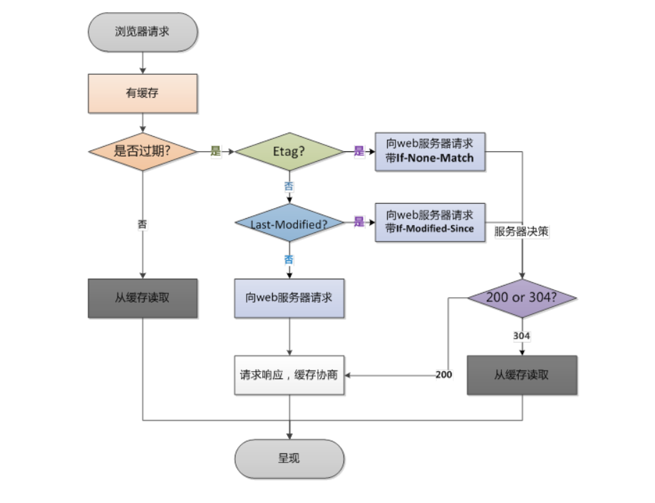

<span style="color:red">简要小结：</span>

1. 为什么需要 HTTPS？

   因为 HTTP 协议是明文传输数据的，不安全。利用 HTTPS 协议可以更安全，在 HTTP 基础上进行数据加密。

2. HTTPS 是如何保证安全的？

   - 底层是对称加密和非对称加密的配合，实现加密数据传输
   - 使用非对称加密，加密对称加密的密钥，进行密钥的交换
   - 后续使用对称加密进行数据传输

3. 如何保证你访问的网站是安全的？或者说第一次请求某个网站拿到的公钥是安全的？（第一次进行非对称加密，后台后公开公钥，怎么证明第一次拿到的公钥是安全的）

   CA 证书 => 数字证书，由权威机构，申请统一发布的。

   证书中，就会包含公钥，网站信息，网站用途（比如我的网站是电商网站），证书过期时间...

   在浏览器第一次请求某个网站时，就会将证书响应，浏览器会自动存证书，并做证书校验

   证书校验：

   - 看证书是否过期
   - 看证书的网址和正在访问的网址是否匹配
   - 看发布证书的机构，是否权威
   - ...

4. 万一证书被篡改了怎么办？数字签名出来了

   会根据证书生成时的内容，生成一个唯一标识

   后续拿到证书时，只需要用相同的 hash 算法（不可逆的），生成一个唯一标识

   如果校验唯一标识，一致的，说明没有改过

5. 谈谈你对缓存的理解？

   前端需要关注的是，HTTP 缓存（强缓存，协商缓存相互配合实现缓存处理）

   - 强缓存：对缓存的资源，根据过期时间判断，如果未过期，直接用（不发请求），只有过期了，才会发请求。

   - 协商缓存：当强缓存未命中（资源过期了），会发请求（带上最后修改时间或者文件唯一标识 Etage），问后台，这个资源是否还能用。后台对比最后修改时间或者对比唯一标识，如果发现一致，这个资源还能用（不会返回资源）304。如果不一致，资源变化了，返回新资源 200。

# tcp

## 01. TCP 协议是什么

`TCP 是 HTTP 协议的一个底层协议，属于传输层的协议。它能使两台主机能够建立连接并交换数据。`

## 02. 一次完整的 HTTP 服务过程是什么

当我们在 web 浏览器的地址栏中输入：`www.baidu.com`，具体发生了什么

1. 对`www.baidu.com`这个网址进行 DNS 解析
2. 根据这个 IP，找到对应的服务器，然后发起 TCP 的三次握手
3. 建立 TCP 连接后，发起 HTTP 请求
4. 服务器响应 HTTP 请求，浏览器得到 html 代码
5. 浏览器解析 html 代码，并请求 html 代码中的资源（如 js、css、图片等）（先得到 html 代码，才能去找这些资源）
6. 浏览器将页面渲染呈现给用户
7. 服务过程完毕，关闭 TCP 连接，四次挥手

## 03. 什么是 DNS 解析

DNS（域名）解析：`将域名转换成 ip 地址（ip：计算机在网络中的唯一标识）`

DNS 是怎么找到域名的？假定请求的是 www.baidu.com

- 首先会搜索浏览器自身的 DNS 缓存（缓存时间比较短，大概只有 1 分钟，且只能容纳 1000 条缓存）

- 如果浏览器自身的缓存里面没有找到，那么浏览器会搜索系统自身的 DNS 缓存

- 如果还没有找到，那么尝试从 hosts 文件里面去找 (一个系统电脑的文件，可以编辑，可以存域名和 ip 的对应关系)

- 在前面三个过程都没获取到的情况下，就递归地去域名服务器去查找(就近查找)，域名和 IP 是映射关系，具体登记在哪里，看是如何申请的。具体过程如下：


DNS 优化两个方面：DNS 缓存、DNS 负载均衡 (准备多台 dns 服务器，进行 dns 解析)

## 04. TCP 三次握手

`连接的发起 + 双方的确认`


假设第一次发送的请求，因为网络延迟很慢才到达服务端，服务端看到后做出响应，但是浏览器已经关闭了连接，这个响应浏览器不会收到，但是服务器以为对方收到了，就会一直等待，这样服务器的性能就被浪费了。三次握手，就不会发生。

## 05. TCP 四次挥手

客气挽留，不能直接一次性断开连接，万一还有什么数据没有传完，造成数据的丢失!


A发起断开连接的消息（浏览器和服务器都可以发起），B会收到断开的需求，但是会要求等一等，确认数据是否传输完毕。B确认完后，会告知A，连接可以断开了。A收到确认，告知B，我要走了。B还会在等一等，以防A还有事情。

# dom

## 01. DOM 的事件流是什么

事件流⼜称为事件传播，是⻚⾯中接收事件的顺序。DOM2 级事件规定的事件流包括了 3 个阶段：

- 事件捕获阶段（capture phase）
- 处于⽬标阶段（target phase）
- 事件冒泡阶段（bubbling phase）


如上图所示，事件流的触发顺序是：

1. 事件捕获阶段，为截获事件提供了机会
2. 实际的⽬标元素接收到事件
3. 事件冒泡阶段，可在这个阶段对事件做出响应

- 事件冒泡

事件开始由最具体的元素（⽂档中嵌套层次最深的那个节点）接收到后，开始逐级向上传播到较为不具体的节点。

```html
<html>
  <head>
    <title>Document</title>
  </head>

  <body>
    <button>按钮</button>
  </body>
</html>
```

如果点击了上面页面代码中的 `<button>` 按钮，那么该 `click` 点击事件会沿着 DOM 树向上逐级传播，在途经的每个节点上都会发生，具体顺序如下：

1. button 元素
2. body 元素
3. html 元素
4. document 对象

- 事件捕获（Event Capturing）

事件开始由较为不具体的节点接收后，然后开始逐级向下传播到最具体的元素上。

事件捕获的最大作用在于：事件在到达预定⽬标之前就可以捕获到它。

如果仍以上面那段 HTML 代码为例，当点击按钮后，在事件捕获的过程中，document 对象会首先接收到这个 `click` 事件，然后再沿着 DOM 树依次向下，直到 `<button>`。具体顺序如下：

1. document 对象
2. html 元素
3. body 元素
4. button 元素

## 02. 说说什么是事件委托

事件委托，就是利用了事件冒泡的机制，在较上层位置的元素上添加一个事件监听函数，来管理该元素及其所有子孙元素上的某一类的所有事件。

```html
<ul id="list">
  <li>111</li>
  <li>222</li>
  <li>333</li>
  <li>444</li>
  <li>555</li>
</ul>

<script type="text/javascript">
  // ⽗元素
  var list = document.getElementById("list")

  // 为⽗元素绑定事件，委托管理它的所有⼦元素li的点击事件
  list.onclick = function (event) {
    var currentTarget = event.target // 触发事件的事件源
    // 为什么这样写？因为ul里可能不止嵌套li，虽然不合法。
    if (currentTarget.tagName.toLowerCase() === "li") {
      alert(currentTarget.innerText)
    }
  }
</script>
```

> 适用场景：在绑定大量事件的时候，可以选择事件委托

- 事件委托可以减少事件注册数量，节省内存占⽤！
- 当新增⼦元素时，⽆需再次做事件绑定，因此非常适合动态添加元素 (vue 解析模板时，会对新创建的元素，额外进行绑定的)

# 浏览器底层原理

## 01. 浏览器是如何解析 CSS 选择器的

<span style="color:red">浏览器解析选择器，是从右往左的解析的，从左往右还是从右往左，最终选中效果是一样的，区别在于性能！</span>

<span style="color:red">从左往右，找后代，其实是在进行所有后代子树的遍历，成本非常高</span>

<span style="color:red">从右往左，找祖辈，一共一个元素，就没有几个祖辈，效率很高</span>

在生成渲染树的过程中，渲染引擎会根据选择器提供的信息来遍历 DOM 树，找到对应的 DOM 节点后将样式规则附加到上面。

来看一段样式选择器代码、以及一段要应用样式的 HTML：

```css
.mod-nav h3 span {
  font-size: 16px;
}
```

```html
<div class="mod-nav">
  <header>
    <h3>
      <span>标题</span>
    </h3>
  </header>

  <div>
    <ul>
      <li><a href="#">项目一</a></li>
      <li><a href="#">项目一</a></li>
      <li><a href="#">项目一</a></li>
    </ul>
  </div>
</div>
```

为了更直观的观查，我们先将这棵 DOM 树先绘制成图

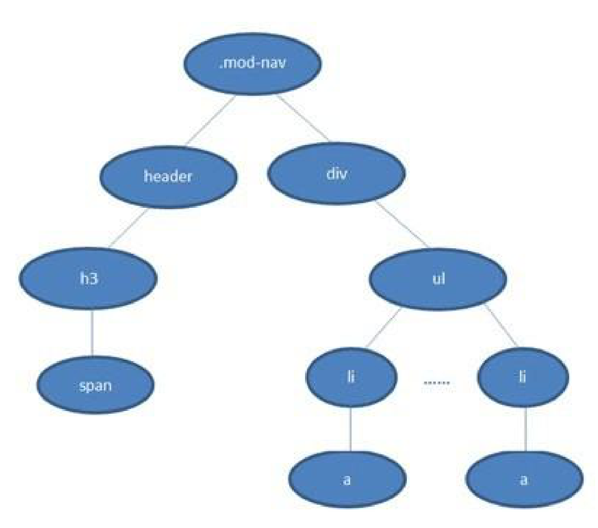

然后我们来对比一下两种顺序的匹配

- 从左往右

1. 遍历所有的元素，找有 .mod-nav 类的节点

2. 从 `.mod-nav` 开始遍历所有的⼦孙节点 `header`、`div` 、 `h3`、 `ul` ....

   遍历所有的后代元素后，知道了，整个子孙后代只有一个 h3

3. 找到 `h3` ，还要继续重新遍历 `h3` 的所有子孙节点，去找 `span`

**问题：会进行大量树形结构子孙节点的遍历，这是非常消耗成本的!**

**这在真实页面中⼀棵 DOM 树的节点成百上千的情况下，这种遍历方式的效率会非常的低，根本不适合采用。**

- 从右往左

1. 先找到所有的 `span` 节点，然后基于每⼀个 `span` 再向上查找 `h3`

2. 由 `h3` 再向上查找 `.mod-nav` 的节点

3. 最后触及根元素 `html` 结束该分⽀遍历

从右向左的匹配规则，只有第一次会遍历所有元素找节点，而剩下的就是在看父辈祖辈是否满足选择器的条件，匹配效率大大提升!

因此，浏览器遵循 “从右往左” 的规则来解析 CSS 选择器！

## 02. 浏览器是如何进行界面渲染的

<span style="color:red">解析 HTML 结构，生成 DOM 树；同时会解析 CSS 样式，生成样式规则；将 DOM 树和样式规则 rules 相结合，生成渲染树 render；基于渲染树进行布局（重排）；进行绘制（重绘）</span>

不同的渲染引擎的具体做法稍有差异，但是大体流程都是差不多的，下面以 chrome 渲染引擎的渲染流程来说明

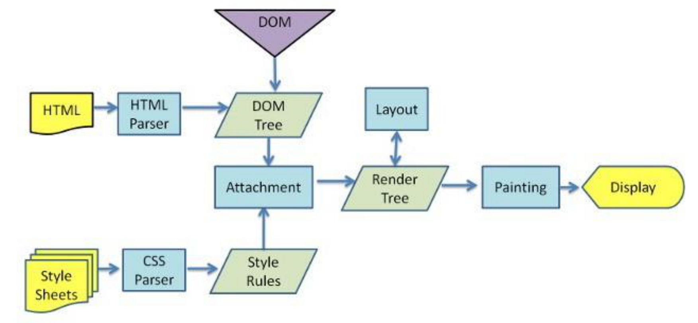

上图展示的流程是：

1. 获取 HTML ⽂件并进⾏解析，生成一棵 DOM 树（DOM Tree）

2. 解析 HTML 的同时也会解析 CSS，⽣成样式规则（Style Rules）

3. 根据 DOM 树和样式规则，生成一棵渲染树（Render Tree）

4. 进行布局（Layout）(重排)，即为每个节点分配⼀个在屏幕上应显示的确切坐标位置

5. 进⾏绘制（Paint）(重绘)，遍历渲染树节点，调⽤ GPU(图形处理器) 将元素呈现出来

## 03. 重绘(repaint)和重排(回流 reflow)是什么

- 重排（对布局重新计算排布，更新布局）

  何时会触发重排？布局发生改变

  重排是指部分或整个渲染树需要重新分析，并且节点的尺⼨需要重新计算。

  表现为 <span style="color:red">重新⽣成布局，重新排列元素</span>

- 重绘（对界面，重新渲染绘制）

  何时会触发重绘？改变了不影响布局的样式，触发重绘；布局更新后，触发重绘。

- 两者的关系

  <span style="color:red">重绘不⼀定会出现重排，重排必定会触发重绘。</span>

  每个页面至少需要一次回流+重绘。(初始化渲染)

  重排和重绘的代价都很⾼昂，频繁重排重绘，会破坏⽤户体验、让界面显示变迟缓。

  我们需要尽可能避免频繁触发重排和重绘，尤其是重排

## 04. 何时会触发重排

1、添加或者删除可见的 DOM 元素

2、元素位置改变

3、元素尺寸改变——边距、填充、边框、宽度和高度

4、内容改变——比如文本改变或者图片大小改变而引起的计算值宽度和高度改变

5、页面渲染初始化

6、浏览器窗口尺寸改变——resize 事件发生时

## 05. 浏览器对重绘重排的优化

思考下述代码的重绘重排过程！

```javascript
let s = document.body.style
s.padding = "2px" // 重排 + 重绘
s.border = "1px solid red" // 再一次 重排 + 重绘
s.color = "blue" // 再一次重绘
s.backgroundColor = "#ccc" // 再一次 重绘
s.fontSize = "14px" // 再一次 重排 + 重绘
document.body.appendChild(document.createTextNode("abc!")) // 添加node，再一次 重排 + 重绘
```

- 聪明的浏览器

从上个实例代码中可以看到几行简单的 JS 代码就引起了 4 次重排、6 次重绘。

而且我们也知道重排的花销也不小，如果每句 JS 操作都去重排重绘的话，浏览器可能就会受不了！

所以浏览器会优化这些操作，**浏览器会维护 1 个队列，把所有会引起重排、重绘的操作放入这个队列**，

**等队列中的操作到了一定的数量或者到了一定的时间间隔，浏览器就会 flush(刷新)队列，进行一个`批处理`。**

这样就会让多次的重排、重绘变成了一次重排重绘。

虽然有了浏览器的优化，但有时候我们写的一些代码可能会强制浏览器提前 flush 队列，这样浏览器的优化可能起不到作用了。

比如当你请求向浏览器获取一些样式信息的时候(保证获取结果的准确性)，就会让浏览器 flush 队列

1. offsetTop，offsetLeft，offsetWidth，offsetHeight
2. scrollTop，Left，Width，Height
3. clientTop，Left，Width，Height
4. ...

```html
<!DOCTYPE html>
<html lang="en">
  <head>
    <meta charset="UTF-8" />
    <meta http-equiv="X-UA-Compatible" content="IE=edge" />
    <meta name="viewport" content="width=device-width, initial-scale=1.0" />
    <title>Document</title>
    <style>
      div {
        width: 200px;
        height: 200px;
        background-color: pink;
        transition: all 1s;
      }
    </style>
  </head>
  <body>
    <div id="box"></div>

    <script>
      // 页面效果是什么？
      // 1. 直接显示一个400 * 400的盒子
      // 2. 一个动画，从200 * 200过渡到400 * 400
      const div = document.getElementById("box")
      // 浏览器做了优化，对所有进行了重绘和重排的操作，进行了一次批处理
      // 这里先做了渲染，再接着往下执行代码
      // console.log(div.offsetWidth) // 为了保证计算值的获取准确性，这里会提前刷新浏览器队列
      div.style.width = "400px"
      div.style.height = "400px"
    </script>
  </body>
</html>
```

## 06. 重绘重排角度 我们应该如何优化页面渲染性能

<span style="color:red">优化页面渲染性能的角度：尽可能减少重绘和重排的次数</span>

主要有几大方式来避免：

- 集中修改样式 (这样可以尽可能利用浏览器的优化机制, 一次重排重绘就完成渲染)

- 尽量避免在遍历循环中，进行元素 offsetTop 等样式值的获取操作，会强制浏览器刷新队列，进行渲染

- 利用 transform 实现动画变化效果，去代替 left top 的变换 (轮播图等)

  transform 变换, 只是视觉效果! 不会影响到其他盒子，只触发了自己的重绘

- 使用文档碎片（DocumentFragment）可以用于批量处理，创建元素，正常用的不多，框架可能会用到

文档碎片的理解：

**documentFragment**是一个保存多个元素的容器对象（保存在内存）当更新其中的一个或者多个元素时，页面不会更新。

当 documentFragment 容器中保存的所有元素操作完毕了, 只有将其插入到页面中才会更新页面。

```html
<ul id="box"></ul>

<script>
  let ul = document.getElementById("box")
  for (let i = 0; i < 20; i++) {
    let li = document.createElement("li")
    li.innerHTML = "index: " + i
    ul.appendChild(li)
  }

  // let ul = document.getElementById("box")
  // 文档碎片
  // let fragment = document.createDocumentFragment()
  // for (let i = 0; i < 20; i++) {
  //     let li = document.createElement("li")
  //     li.innerHTML = "index: " + i
  //     fragment.appendChild(li)
  // }
  // ul.appendChild(fragment)
</script>
```

vue 底层渲染更新，就用了 document.createDocumentFragment

## 07. 前端如何实现即时通讯

`HTTP协议只能做到客户端请求服务器，服务器做出响应，做不到让服务器主动给客户端推送消息！`

`即时通信需求：服务器数据一有更新，希望推送给到浏览器`

1. 短轮询（历史方案，开个定时器，每隔一段时间发请求，实时性不强）

短轮询就是客户端定时发送请求，获取服务器上的最新数据。不是真正的即时通讯，但一定程度上可以模拟即时通讯的效果。


优缺点：

- 优点：浏览器兼容性好，实现简单 setInterval
- 缺点：实时性不高，资源消耗高，存在较多无用请求，影响性能

2. Comet - ajax 长轮询（历史方案，发送一个请求，服务器只要数据不更新，就一直阻塞，服务器压力过大）

短轮询的实时性，着实太差，所以 Comet 技术方案应运而生，用以实现即时通讯

- 浏览器发出 XMLHttpRequest 请求，服务器端接收到请求后，会阻塞请求直到有数据或者超时才返回

- 浏览器 JS 在处理返回信息(有数据或者超时) 后再次发出请求。服务器收到请求后，会再次阻塞到有数据或者超时


优缺点：

- 优点：浏览器兼容性好，**即时性好**，**不存在⽆⽤请求**

- 缺点：**服务器压力较大**（维护⻓连接会消耗较多服务器资源）

3. SSE（利用了 http 协议，流数据的传输，并不是严格意义的双向通信，无法复用连接）

服务端推送事件（Server-Sent Event）它是⼀种基于 HTTP 协议，允许服务端向客户端推送新数据的 HTML5 技术

问题：HTTP 协议 不是 无法做到服务器主动向客户端推送消息么？

这些 SSE 采用了一些小技巧！详细见 [参考文章：SSE 教程](https://www.ruanyifeng.com/blog/2017/05/server-sent_events.html)

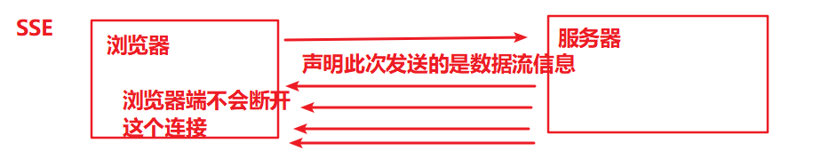

优缺点：

- 优点：基于 HTTP，无需太多改造就能使⽤；相比 WebSocket 要简单一些
- 缺点：基于⽂本传输，效率没有 WebSocket ⾼；基于 HTTP 协议，不是严格的双向通信

4. WebSocket

这是基于 TCP 协议的全新、独⽴的协议，作⽤是在服务器和客户端之间建⽴实时的双向通信。

WebSocket 协议与 HTTP 协议保持兼容，但它不会融⼊ HTTP 协议，仅作为 HTML 5 的⼀部分。

优缺点：

- 优点：真正意义上的双向实时通信，性能好、延迟低

- 缺点：由于是独⽴于 HTTP 的协议，因此要使用的话需要对项⽬作改造

  使⽤复杂度会⾼一些，通常需要引⼊成熟的库 (如: Socket-io )并且⽆法兼容低版本的浏览器

# 前端工程化

## 01. Babel 的原理是什么

Babel 的主要工作是对代码进行转译。(解决兼容, 解析执行一部分代码)

```jsx
let a = 1 + 1    =>  var a = 2
```

转译分为三阶段：

- 解析（Parse），将代码解析⽣成抽象语法树 AST，也就是词法分析与语法分析的过程

- 转换（Transform），对语法树进⾏变换方面的⼀系列操作。通过 babel-traverse，进⾏遍历并作添加、更新、删除等操作

- ⽣成（Generate），通过 babel-generator 将变换后的 AST 转换为 JS 代码

转译流程示意图：


我们可以通过 [AST Explorer 工具](https://astexplorer.net/) 来查看 Babel 具体生成的 AST 节点。

## 02. 如何编写一个 Babel 插件(了解)

Babel 插件的主要工作阶段是在 Babel 将代码解析成抽象语法树 AST 之后，

插件们对抽象语法树 AST 进行各种操作后，再由 Babel 输出最终的代码。

要编写一个 Babel 插件模块，则需要为模块代码导出一个函数，且该函数返回一个对象，对象内应包含有 `visitor` 属性：

```js
module.exports = function (babel) {
  return {
    visitor: {},
  }
}
```

`visitor` 是针对各类 抽象语法树节点作处理的地⽅。

我们可以通过 [AST Explorer 工具](https://astexplorer.net/) 来查看 Babel 具体生成的 AST 节点。

**示例**

我们来编写一个插件，其功能是能自动将源码中的数字字面量数学运算进行预计算处理，简化代码。例如：

```js
// 原来的代码
const result = 1 + 2

// 处理后的代码
const result = 3 // 这样优化以后，在实际运行时可以减少一次加法操作
```

我们可以先通过 AST Explorer 来获取 JSON 格式的 AST 结构：

```json
{
  "type": "Program",
  "start": 0,
  "end": 20,
  "body": [
    {
      "type": "VariableDeclaration",
      "start": 0,
      "end": 20,
      "declarations": [
        {
          "type": "VariableDeclarator",
          "start": 6,
          "end": 20,
          "id": {
            "type": "Identifier",
            "start": 6,
            "end": 12,
            "name": "result"
          },
          "init": {
            "type": "BinaryExpression",
            "start": 15,
            "end": 20,
            "left": {
              "type": "Literal",
              "start": 15,
              "end": 16,
              "value": 1,
              "raw": "1"
            },
            "operator": "+",
            "right": {
              "type": "Literal",
              "start": 19,
              "end": 20,
              "value": 2,
              "raw": "2"
            }
          }
        }
      ],
      "kind": "const"
    }
  ],
  "sourceType": "module"
}
```

从以上 AST 结构可以知道，`1 + 2` 是一个 `BinaryExpression` (二进制表达式)类型的节点，

那么在我们编写的插件代码中的 `visitor` 里就可以这样进行处理：

1 装包

```txt
yarn add babel-types babel-core
```

2 新建 `index.js`, 贴入下面到的代码

```js
const t = require("babel-types")

const visitor = {
  BinaryExpression(path) {
    const node = path.node

    let result

    // 判断表达式两边，是否都是数字
    if (t.isNumericLiteral(node.left) && t.isNumericLiteral(node.right)) {
      // 根据不同的操作符作运算
      switch (node.operator) {
        case "+":
          result = node.left.value + node.right.value
          break
        case "-":
          result = node.left.value - node.right.value
          break
        case "*":
          result = node.left.value * node.right.value
          break
        case "/":
          result = node.left.value / node.right.value
          break
        default:
          break
      }
    }

    // 如果上⾯的运算有结果的话
    if (result !== undefined) {
      // 把表达式节点替换成number字⾯量
      path.replaceWith(t.numericLiteral(result))
    }
  },
}

module.exports = function (babel) {
  return {
    visitor,
  }
}
```

这个插件的基本功能就完成了，新建 test.js 来运行试试：

```js
const babel = require("babel-core")

const result = babel.transform("const result = 1 + 2", {
  plugins: [require("./index")],
})

console.log(result.code) // 结果：const result = 3
```

转换结果符合预期。

不过这个插件还不能完全正确的工作，在转换如 `const result = 1 + 2 + 3 + 4 + 5;` 这样的代码时，

结果为 `const result = 3 + 3 + 4 + 5;`，也就是只转换了代码中的第一段表达式计算。

如果用 AST Explorer 查看 AST 结构的话，会发现原来这个运算由层层嵌套的 `BinaryExpression` 组成：

> BinaryExpression( BinaryExpression( BinaryExpression( BinaryExpression(1 + 2) + 3 ) + 4 ) + 5 )

因此我们得改造一下之前的代码逻辑，进行遍历操作：

```js
// 如果上⾯的运算有结果的话
if (result !== undefined) {
  // 把表达式节点替换成number字⾯量
  path.replaceWith(t.numericLiteral(result))

  // 向上遍历⽗级节点
  let parentPath = path.parentPath
  parentPath && visitor.BinaryExpression.call(this, parentPath)
}
```

这样就能正确工作了。

[参考文档：Babel 插件手册](https://github.com/jamiebuilds/babel-handbook/blob/master/translations/zh-Hans/plugin-handbook.md#builders)

## 03. 你们公司的 Git 工作流是什么样的

每个公司采用的 Git 工作流都可能会有差别，有的比较规范，有的比较随意。

在这里介绍一个名为 GitFlow 的 git 标准化操作流程。

在 GitFlow 标准下，我们的 git 仓库需要包含以下几个关键分支：

- master：主分支

- develop：主开发分⽀。包含确定即将发布的代码

- feature：新功能分⽀。⼀个新功能对应⼀个分⽀

- release：发布分⽀。发布时⽤的分⽀，⼀般测试阶段发现的 bug 在这个分⽀进⾏修复

- hotfix：热补丁分支。用于修改在线上版本中发现的严重紧急 bug

**GitFlow 的主要优点**

- 支持并⾏开发

因为每个新功能都会建⽴⼀个新的 feature 分⽀，从⽽和其他已经完成的功能隔离开，

且当只有在新功能完成开发的情况下，其对应的 feature 分⽀才会被合并到主开发分⽀（develop 分支）。

另外，如果你正在开发某个功能的同时⼜有⼀个新功能需要开始开发，那么你只需把当前 feature 的代码提交后，

切回 develop 分支, 新建另外⼀个 feature 分⽀即可开发新功能了。

你也可以随时切回之前的其他 feature 分⽀继续完成该功能的开发。

- 协作开发

因为每个 feature 分⽀上改动的代码都只对该 feature 对应的功能生效，

所以不同 feature 分支上的代码在开发时不会互相影响，大家可以相安无事的开发自己负责的功能。

同时我们可以根据分支的名称，很容易知道每个⼈都在做什么功能。

- ⽀持紧急修复

hotfix 分⽀是从某个已经发布的仓库版本基础上创建出来，用于紧急修复 Bug。

该紧急修复只影响这个已经发布的仓库版本，⽽不会影响你正在开发的其他新 feature 。

**注意点**

1. feature 分⽀都是从 develop 分⽀上创建的，开发完成后再合并到 develop 分⽀上，等待发布

2. 当需要发布时，我们要从 develop 分⽀上创建⼀个 release 分⽀，然后该 release 分⽀会发布到测试环境进⾏测试。

   如果发现问题的话，就会直接在该分⽀上进⾏修复。

   所有问题修复之前，会不停重复 `发布` > `测试` > `修复` > `重新发布` > `重新测试` 流程。

   发布结束，该 release 分⽀会被合并到 develop 以及 master 分⽀，从⽽保证不会有代码丢失

3. master 分⽀只跟踪已经发布的代码，合并到 master 上的 commit 只能来⾃ release 分⽀和 hotfix 分⽀

4. hotfix 分⽀的作⽤是紧急修复⼀些 Bug，它们都是从 master 分⽀上的某个版本建⽴，

   修复结束后再被合并到 develop 和 master 分⽀上


## 04. Git 的 rebase 和 merge 的区别是什么

`git rebase` 和 `git merge` 两个命令都⽤于从⼀个分⽀获取内容并合并到当前分⽀。

以一个 `feature/todo` 分⽀合并到 `master`主分⽀为例，我们来看一下分别⽤ `rebase` 和 `merge` 会有什么不同。

**使用 Merge**


`merge` 会⾃动创建⼀个新的 `commit`， 如果合并时遇到冲突的话，只需要修改后重新 `commit`。

- 优点：能记录真实的 `commit` 情况，包括每个分⽀的详情

- 缺点：由于每次 `merge` 会⾃动产⽣⼀个 `merge commit`，

  因此在使⽤⼀些可视化的 git 工具时会看到这些自动产生的 `commit`，

  这些 `commit` 对于程序员来说没有什么特别的意义，多了反而会影响阅读

**使用 Rebase**


`rebase` 会合并之前的 `commit` 历史。

- 优点：可以得到更简洁的提交历史，去掉了 `merge commit`

- 缺点：因为合并而产生的代码问题，就不容易定位，因为会重写提交历史信息

**建议**

- 当需要保留详细的合并信息，建议使⽤ `git merge`, 尤其是要合并到 master 上

- 当发现⾃⼰修改某个功能时提交比较频繁，并觉得过多的合并记录信息对自己来说没有必要，那么可尝试使用 `git rebase`

## 05. Git 的 reset 回退 和 revert 撤销

在利用 git 实现多人合作程序开发的过程中，我们有时会出现 **错误提交** 的情况，

此时我们希望能撤销提交操作, 或者想要回退到某个版本

reset => 回退到某个版本 `git reset --hard 版本号`

revert => 撤销某个版本内容的内容修改 `git revert -n 版本号`

博客参考: https://blog.csdn.net/yxlshk/article/details/79944535

如果 git reset 后, 版本回退了, 无法直接 push 到远程仓库(因为远程仓库版本更加新) => git push -f 覆盖推送即可

效果: 将远程仓库的版本, 也进行了回退

# vue

## 01. MVVM（设计模式）

MVVM 是一种双向数据绑定的模式，通过 ViewModel 建立起 Model 数据层和 View 视图层的连接。数据变化，视图自动更新。视图变化，数据自动更新。

~~~vue
<templete>
  这里是view视图
</templete>

ViewModel就是vue的核心，相当于引擎，底层做好了监听，所以可以双向数据绑定

<script>
  export default {
    这里是model数据
  }
</script>
~~~

## 02. MVVM 的优缺点（不重要）

- 优点

1. 实现了视图（View）和模型（Model）的分离，降低代码耦合、提⾼视图或逻辑的复⽤性
3. 能⾃动更新 DOM，利⽤双向绑定，数据更新后视图⾃动更新，让开发者从繁琐的⼿动操作 DOM 中解放出来

- 缺点

1. Bug 难被调试：因为使⽤了双向绑定的模式，当我们看到界⾯发生异常了，有可能是 View 的代码产生的 Bug，也有可能是 Model 代码的问题。数据绑定使得⼀个位置的 Bug 被快速传递到别的位置，要定位原始出问题的地⽅就变得不那么容易了

   可采用的调试方案：

   注释掉一段代码，确定代码的位置

   debugger 打断点或者 console 进行调试

2. 在⼀个⼤的模块中 Model 也会很⼤，虽然使⽤上来说⽅便，但如果⻓期不释放内存，会造成更多的内存消耗，占用的是浏览器的内存


## 03. 生命周期

组件实例从创建到销毁的整个过程就是生命周期。

开始创建（空实例） -> 初始化数据 -> 编译模板 -> 挂载DOM -> 渲染、更新数据、重新渲染 -> 卸载。

这⼀系列过程我们称之为 Vue 的⽣命周期。


| 生命周期      | 执行时机                                                     |
| ------------- | ------------------------------------------------------------ |
| beforeCreate  | data 数据初始化之前，组件还没有数据，访问不到data、watch等   |
| created       | data 数据初始化之后，可以获取到组件数据，可以访问data、watch等，但是DOM还没渲染。 |
| beforeMount   | DOM 渲染之前，DOM 还没渲染，相关的render函数首次被调用，实例已完成以下配置：编译模板，把data里的数据和模板生成html。此时还没有挂载html到页面上。在这之前，包括这，都无法获取 DOM，想要获取 DOM 使用 nextTick()。 |
| mounted       | DOM 渲染之后，可以操作 DOM 了                                |
| beforeUpdate  | 响应式数据更新时调用，此时虽然响应式数据更新了，但是对应的真实 DOM 还没有被渲染。 |
| updated       | 数据更改导致虚拟 DOM 重新渲染和打补丁之后调用。此时 DOM 已经根据响应式数据的变化更新了。 |
| activited     | 组件被激活时调用。用keep-alive包裹的组件在切换时不会销毁，而是缓存到内存中，切换时不会再次执行created。 |
| deactivated   | 组件被停用时调⽤。                                           |
| beforeDestory | 组件实例销毁前调用。这一步，实例仍然完全可用，`this` 仍能获取到实例。 |
| destoryed     | 组件实例销毁后调用。调用后，Vue 实例指示的所有东西都会解绑定，所有的事件监听器会被移除，所有的子实例也会被销毁。 (定时器、webscoket...跟 vue 没有太大关联的资源，需要手动释放) |


## 04. 网络请求应该放在哪个生命周期中发起

在 created 里 data 才生成，而请求返回的数据需要挂载到 data 上，所以要在 created 里发请求。

但是 created 这时候 DOM 还没初始化，mounted 里 DOM 才初始化，如果我们的请求不需要依赖/借助 DOM，这时候请求可以放在 created，反之则可以放在 mounted 里。

## 05. 组件之间如何进行通信

1. 父子通信 props。props[验证](https://cn.vuejs.org/v2/guide/components-props.html#Prop-%E9%AA%8C%E8%AF%81)

   ~~~js
   <jack :money="count" :obj="myobj"></jack>
   ~~~

   ~~~jsx
   export default {
     // props: ['money']
     props: {
       money: {
         type: Number,
         default: 1,
       },
       obj: {
         type: Object,
         // 工厂函数可以创建对象
         default: () => {
           return {
             name: "zs",
             age: 18,
           }
         },
       },
     },
   }
   ~~~

2. 子父通信$emit

   ~~~js
   <jack @add-action="fatherFn"></jack>
   ~~~

   ~~~jsx
   this.$emit('add-action', 参数1, 参数2, ...)
   ~~~

3. ref，通过添加 ref 和 $refs 配合，也可以很方便的获取子组件，访问调用子组件的属性或方法

   ~~~js
   // 父组件中
   <template>
     <div class="hello_world">
       <com-a ref="coma"></com-a> // this.$refs.coma.count = 200
       <com-b ref="comb"></com-b> // this.$refs.comb.addFn()
     </div>
   </template>
   ~~~

4. provide inject

   父组件

   ~~~jsx
   export default {
     provide() {
       return {
         value: this.value, // 共享给子孙组件的数据
       }
     },
     data() {
       return {
         value: "父组件的数据",
         money: 100,
       }
     },
   }
   ~~~

   子孙组件

   ~~~jsx
   export default {
     inject: ['value'],
     props: {
         ...
     }
   }
   ~~~

## 06. computed 和 watch 的区别

computed有缓存，只有当它依赖的属性值发生了改变，才会重新计算。watch没有缓存。

## 07. vue 双向绑定原理是什么（如何理解 vue 响应式系统）

通过 Object.defineProperty()来劫持各个属性的 setter/getter（访问和设置），通过观察者模式，完成数据驱动视图的更新

## 08. 观察者模式

观察者模式：当对象间存在 **一对多** 关系时，则使用观察者模式（Observer Pattern）

比如，当一个对象或者数据被修改时，则会自动通知依赖它的对象。

**意图：**定义对象间的一种 `一对多的依赖关系`，当一个对象的状态发生改变时，所有依赖于它的对象都得到通知并被自动更新。

拍卖会的时候，大家相互叫价，拍卖师(Dep) 会观察 最高标价(利用 Object.defineProperty 监听)，

一旦最高价变化了, 然后通知给其它竞价者(watcher 观察者 - 订阅者, 订阅了价格的变化)，这就是一个观察者模式

下图为 Vue 框架在数据初始化中使用观察者模式的示意图：


Dep 要进行 **依赖收集**，并通过一个 subs 数组, 记录观察者 Watcher,

Watcher 分为 **渲染 watcher、计算属性 watcher、侦听器 watcher** 三种

收集依赖: 简单点说就是谁借了我的钱，我就把那个人 **记下来** ，以后我的钱少了 我就通知他们说我没钱了

```jsx
<div>
  <p>{{ msg }}</p>   // Watcher1(渲染), 依赖于msg
</div>

<div>
  <h1>{{ car }}</h1>   // Watcher2(渲染),  依赖于car
</div>

<div>
  <h1>{{ myMsg }}</h1>   // Watcher3(渲染), 依赖于myMsg
</div>

computed: {
  myMsg () {
    console.log('计算属性重新计算了')
    return this.msg + '20'  // Watcher4(计算属性中), 依赖于msg, msg变了重新计算
  }
}

watch: {
  msg (newValue) {
    console.log('新的msg', newValue) // Watcher5(侦听器), 将来msg变化, 这边要执行这个函数
  }
}

------------------------------------------------------------------

// 收集依赖 (dep结构有点类似于二维数组, (Map结构))   arr.type="msgDep"
dep: [
  msgDep: [Watcher5(侦听器), Watcher4(计算属性中), Watcher1(渲染)],
  carDep: [Watcher2(渲染)],
  myMsgDep: [Watcher3(渲染)]
]


// Watcher
{
  callback: Function, (数据变化后, 需要执行的回调)
  isRenderWatcher: Boolean, (是否是render的watcher, 是否要触发视图的更新, 往后放, 最后统一虚拟dom对比, 统一更新)
  ...
}
```

比如: 假定数据 money 变了, 那么没有任何与 money 相关的观察者, 就不需要进行任何更新操作, 也不需要执行任何的监视函数

然而: 假定数据 msg 变了, 就会通知到相关的 Watcher, 且优先通知侦听器 Watcher 和计算属性 Watcher, 后进行统一的渲染更新

1. 通知侦听器 Watcher, 立刻执行配置的函数, console.log('新的 msg', newValue)
2. 通知计算属性 Watcher, 计算属性依赖的值变了, 需要重新计算
   且更新后, myMsg 变化了, 需要进行进行视图的渲染 (render) (--- 要更新, 等着---)
3. 通过到 watcher1, 渲染 Watcher (---要更新---)
4. 最后统一进行, 新旧虚拟 dom 的对比, 完成视图的更新

**当数据状态发生改变时，会被 Object.defineProperty 监听劫持到, 会通知到 Dep, 并根据收集的依赖关系,**

**让订阅者 Watcher 进行数据更新（update）操作 , 派发更新**

总结概述: vue 采用的是观察者模式, 是一种`一对多`的关系, 一上来 vue 在解析渲染时, 会进行依赖收集, 会将渲染 watcher、计算属性 watcher、侦听器 watcher, 都收集到对应的 dep 中, 将来 Object.defineProperty 监听到数据变化, 就根据依赖关系, 派发更新

## 09. Vue 中的 key 到底有什么用

`key` 是为 Vue 中的虚拟 DOM 节点（vNode）标记唯⼀性的 id。

### key 的作用

作用: 给虚拟 dom 添加标识, **(优化复用对比策略, 优化渲染性能)**

主要考察:

1. vue 的更新机制 (差异化更新) 对比新旧虚拟 dom, 找出不同的部分, 进行更新视图

   为什么对比虚拟 dom, 而不对比真实的 dom ? 真实的 dom 太复杂, 对比起来性能太差

2. 虚拟 dom: 使用 js 对象的方式, 模拟真实的 dom 结构 { type: 'div', className: 'box' , children: [] }

   属性的量大大的减少了, 没有真实 dom 的那么多无效的属性, 对比起来性能高很多

3. diff 算法: 默认的对比(diff) 机制, 同层兄弟元素, 是按照下标进行对比的, 但是加了 key, **就相当于给虚拟 dom 加了个标识**

   对比策略, 就是对相同 key 的元素进行对比了, 在列表 v-for 中, key 的使用尤为常见, 可以用于优化渲染性能


### 9.2 key 的常见应用场景

key 的常见应用场景 => v-for, v-for 遍历的列表中的项的顺序, 非常的容易改变

1 往后面加, 默认的对比策略, 按照下标, 没有任何问题

```jsx
// 旧
<ul>
  <li>张三</li>
  <li>李四</li>
</ul>

// 新
<ul>
  <li>张三</li>
  <li>李四</li>
  <li>王五</li>
</ul>
```

2 往前面加, 由于下标变了, 如果按照之前的下标对比, 元素是混乱的, 策略: 加上 key

一旦加上了 key, 就是按照 key 进行新旧 dom 的对比了

```jsx
// 旧
<ul>
  <li key="17">张三</li>
  <li key="31">李四</li>
</ul>

// 新  [ { id: 17, name: '张三' }, ... ]
<ul>
  <li key="52">王五</li>
  <li key="17">张三</li>
  <li key="31">李四</li>
</ul>
```

**总结: key 就是给 虚拟 dom 添加了一个 标识, 优化了对比策略!!!**

## 10. Vue 跳转路由时的传参方式 (query 和 params 的区别)

1. 通过 query 传参

```jsx
this.$router.push("/login?username=pp&age=18&desc=xx")

this.$router.push({
  path: "/login",
  query: {
    username: "pp",
    age: 18,
    desc: "xxx",
  },
})

this.$router.push({
  name: "login",
  query: {
    username: "pp",
    age: 18,
    desc: "xxx",
  },
})
```

**获取: this.$route.query.username**

2. 通过 params 传参, 必须通过命名路由的方式传递!

```jsx
this.$router.push({
  name: "login",
  params: {
    username: "pp",
    age: 18,
  },
})
```

**获取: this.$route.params.username**

**区别:**

1. params 传参, 必须要用命名路由的方式传值

2. params 传参, 不会显示在地址栏中, 刷新会丢失

   可以配合 localStorage 使用

   (1) A 跳转路由到 B, 通过 params 传值

   (2) B 页面中, 立刻通过 this.$route.params 获取参数

   (获取参数的逻辑, 优先从$route 中拿, 如果拿不到(说明刷新了), 从本地取即可)

   (3) 拿到参数后, 立刻存到本地 (保证刷新丢失后, 还能从本地拿)

   (4) 实现功能...

B 页面的逻辑

```jsx
created () {
    let username = this.$route.params.username
    if (username) {
        // 刚跳过来, 有参数, 立刻存起来
        localStorage.setItem('myParams', JSON.stringify(this.$route.params))
    } else {
        // 没有, 说明用户刷新了, 丢失了params, username参数, 本地拿
        username = JSON.parse(localStorage.getItem('myParams')).username
    }
}
```

## 11.  SEO

1. `SSR 服务器渲染`

   优势：更好的 SEO，搜索引擎爬虫抓取工具可以直接查看完全渲染的页面

   缺点：服务器 nodejs 环境的要求，且对原代码的改造成本高! `nuxt.js` (坑比较多，做好踩坑的准备)

2. 静态化 (适合用来做博客、介绍性官网)。Nuxt.js 可以进行 generate 静态化打包

   缺点：动态路由会被忽略 `/users/:id`

   优势：

   - 编译打包时，就会帮你处理，纯静态文件，访问速度超快
   - 对比 SSR，不涉及到服务器负载方面问题
   - 静态网页不宜遭到黑客攻击，安全性更高

3. `预渲染 prerender-spa-plugin (插件)`

   如果你只是对少数页面需要做 SEO 处理（例如 / 首页， /about 关于等页面）

   预渲染是一个非常好的方式，预渲染会在构建时，简单的针对特定路由，生成静态 HTML 文件 (打包时可以帮你解析静态化)

   优势：设置预渲染简单，对代码的改动小

   缺点：只适合于做少数页面进行 SEO 的情况，如果页面几百上千，就不推荐了 (会打包很慢)

4. 使用 Phantomjs `针对爬虫` 做处理（我项目都写完了，你在给我说做 SEO 优化？合理吗？很不合理。）

   Phantomjs 是一个基于 webkit 内核的无头浏览器，没有 UI 界面，就是一个浏览器，其内的点击、翻页等人为相关操作需要程序设计实现。这种解决方案其实是一种旁路机制，原理就是通过 Nginx 配置， 判断访问的来源 UA 是否是爬虫访问，如果是则将搜索引擎的爬虫请求转发到一个 node server，再通过 PhantomJS 来解析完整的 HTML，返回给爬虫

   

   优势：

   - 完全不用改动项目代码，按原本的 SPA 开发即可，对比开发 SSR 成本小太多了
   - 对已用 SPA 开发完成的项目，这是不二之选

   不足：

   - 部署需要 node 服务器支持

   - 爬虫访问比网页访问要慢一些，因为定时要定时资源加载完成才返回给爬虫(不影响用户的访问)

   - 如果被恶意模拟百度爬虫大量循环爬取，会造成服务器负载方面问题

     解决方法是判断访问的 IP，是否是百度官方爬虫的 IP

小结：

- 如果构建大型网站，如商城类 => SSR 服务器渲染

- 如果只是正常公司官网，博客网站等 => 预渲染/静态化/Phantomjs 都比较方便
- 如果是已用 SPA 开发完成的项目进行 SEO 优化，而且部署环境支持 node 服务器，使用 Phantomjs

博客参考： [SEO 优化方案](https://www.jb51.net/article/164285.htm)

## 12. 权限处理

现在权限相关管理系统用的框架都是 element 提供的[vue-element-admin](https://panjiachen.github.io/vue-element-admin-site/zh/)模板框架比较常见。

权限控制常见分为三大块

- **菜单权限控制**
- **按钮权限控制**
- 请求 url 权限控制。

**权限管理在后端中主要体现在对接口访问权限的控制，在前端中主要体现在对菜单访问权限的控制。**

1. 按钮权限控制比较容易，主要采取的方式是从后端返回按钮的权限标识，然后在前端进行显隐操作 v-if / disabled。

2. url 权限控制，主要是后端代码来控制，前端只需要规范好格式即可。

3. 剩下的菜单权限控制，是相对复杂一些的

   (1) **需要在路由设计时, 就拆分成静态路由和动态路由**

   静态路由: 所有用户都能访问到的路由, 不会动态变化的 (登录页, 首页, 404, ...)

   动态路由: 动态控制的路由, 只有用户有这个权限, 才将这个路由添加给你 (审批页, 社保页, 权限管理页...)

   (2) 用户登录进入首页时, 需要立刻发送请求, 获取个人信息 (包含权限的标识)

   

   (3) **利用权限信息的标识, 筛选出合适的动态路由**, 通过路由的 **addRoutes 方法**, 动态添加路由即可!

   (4) router.options.routes (拿的是默认配置的项, 拿不到动态新增的) 不是响应式的!

   为了能正确的显示菜单, 为了能够将来正确的获取到用户路由, 我们需要用**vuex 管理 routes 路由数组**

   (5) 利用 vuex 中的 routes, 动态渲染菜单

## 13. 项目支付功能

支付宝方式：点击支付宝支付，调用后台接口(携带订单号)，后台返回一个 form 表单(HTML 字符串结构)

提交 form 就可以调用支付宝支付

```jsx
//  alipayWap: 后台接口返回的form 片段
<div v-html="alipayWap" ref="alipayWap"></div>

methods: {
  toAlipay () {
  this.$axios.get('xxx').then (res = > {
    this.alipayWap = res
       // 等待dom更新, 等页面中有这个form表单了
    this.$nextTick(() => {
       this.$refs.alipayWap.children[0].submit()
     })
   })
  }
}
```


微信支付：需要自己根据后台返回的 url 生成二维码页面，如图所示


博客参考 1: https://blog.csdn.net/qq_36710522/article/details/90480914

博客参考 2: https://blog.csdn.net/zyg1515330502/article/details/94737044

## 14. 如何处理项目(首屏)加载过慢的问题

SPA 单页面应用：所有的功能，都在一个页面中，单页面跳转就是切换组件，仅刷新局部资源，公共资源（js、html、css等）仅需要加载一次。

加载过慢主要原因：一次性加载了过多的资源，一次性加载了过大的资源

- 加载过多：路由懒加载，访问到路由，再加载该路由相关的组件内容
- 加载过大：图片压缩、文件压缩合并处理、开启 gzip 压缩等

比如：

1. 配置异步组件，路由懒加载

   ```js
   const login = () => import("../pages/login.vue")
   ```

2. 图片压缩：使用 webp 格式的图片，提升首页加载的速度

3. CDN 加速：配置 CDN 加速（公司的地址和用户使用的地方太远了），加快资源的加载效率 (花钱)

4. 开启 gzip 压缩 (一般默认服务器开启的，如果没开，确实可能会很慢，可以让后台开一下)

   浏览器请求服务器，原本是服务器有什么图片就给我们什么图片，比如 jpg/png，但是这样文件会比较大，所以服务器可以将文件进行 gzip 压缩，发送给浏览器，浏览器看到这样压缩过的资源会自动解压，不需要我们做什么东西。

5. 使用v-if代替v-show

6. ...


博客: https://www.cnblogs.com/xidian-Jingbin/p/10643391.html

## 15. 你在项目中遇到过什么技术难题

`考察解决问题的能力！`

话术：前端要学的东西确实很多，但是并不夸张，肯多花点时间沉淀一般都会有解决方案。

一般遇到难题 (这些前端所谓的难题，一般都是一些没有做过，没有尝试过得一些业务)，我们要时刻保持独立思考，**知道自己要做什么业务**，**由此决定要学什么知识**，然后**实现业务**，举一反三，总结归纳！

比如：如果之前没有做过国际化，换肤，没有做过支付，权限控制，没有做过即时通信 websocket，excel 导入导出，就会觉得很难，但其实真正上手花时间去学着做了，也都能逐步思考解决相关页面。

有时候, `复杂的或者困难的`，并不是技术层面的，而是`业务需求方面`的，需要进行大量树形结构的处理，展示列表式数据时，展示图表数据时，筛选条件关联条件多了，`组件与组件的联动关系`的控制也比较麻烦，将联动的条件，存 vuex，然后进行分模块管理也是比较合适的选择，还有后台给的数据非常的难搞，需要进行大量的遍历处理。前一家公司给的数据都是处理好的。


## 16. 发布订阅模式（自定义事件）

~~~html
<!DOCTYPE html>
<html lang="en">
  <head>
    <meta charset="UTF-8" />
    <meta http-equiv="X-UA-Compatible" content="IE=edge" />
    <meta name="viewport" content="width=device-width, initial-scale=1.0" />
    <title>Document</title>
  </head>
  <body>
    <button id="btn">点击我</button>

    <script>
      const btn = document.querySelector("#btn")

      // btn.onclick = function () {
      //   console.log("btn被点击了")
      // }
      // btn.onclick = function () {
      //   console.log("btn又被点击了吗")
      // }
      // 以上实现并不能完成两个回调函数都执行，是一个一对一的实现

      // 优化：从一对一变成一对多
      btn.addEventListener("click", function () {
        console.log("btn被点击了")
      })
      btn.addEventListener("click", function () {
        console.log("btn又被点击了吗")
      })

      // 发布订阅模式（自定义事件）
      // 这种模式下可以实现同一个事件对应多个回调函数，实现了一对多，这种优化，就是发布订阅模式

      // 浏览器的实现原理：
      // 浏览器实现了一个方法，叫做addEventListener
      // 这个方法接收两个参数，参数一：事件类型。参数二：会回调函数
      // 为了实现一对多架构，内部大概是这样的。{ click: ['回调函数1', '回调函数2'] }
      // 当鼠标点击时，通过事件类型click去数据结构中找到存放了所有相关的回调函数的数组然后遍历，都执行一遍，从而实现了一对多

      // 实现一个自己的自定义事件
      const map = {}
      function collect(eventName, fn) {
        if (!map[eventName]) map[eventName] = []
        map[eventName].push(fn)
      }
      collect("click", function () {
        console.log("收集成功了click")
      })
      console.log(map)
    </script>
  </body>
</html>
~~~

