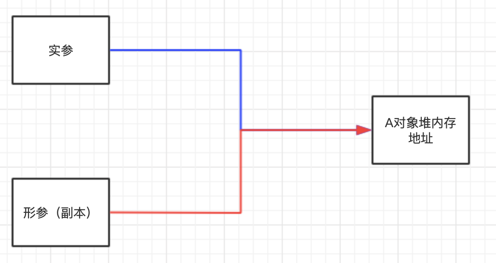
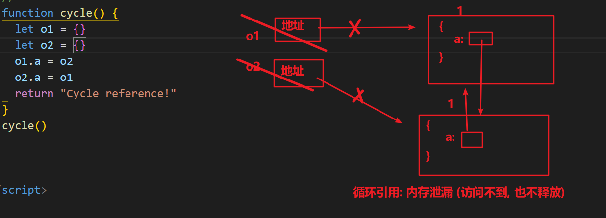
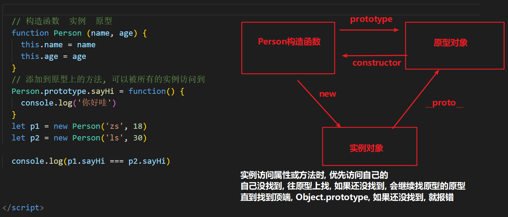
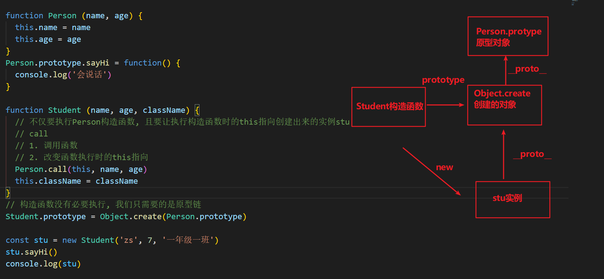
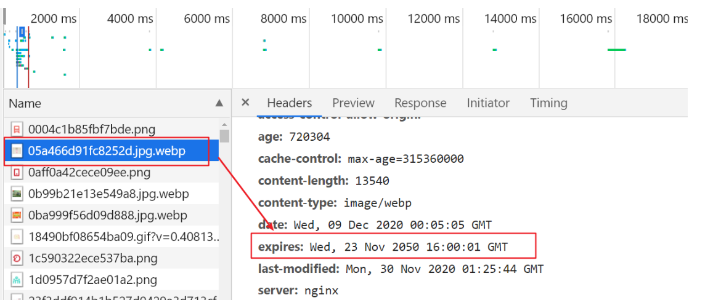
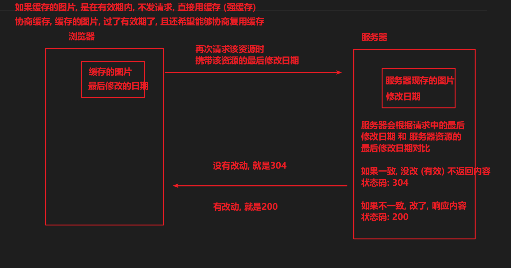
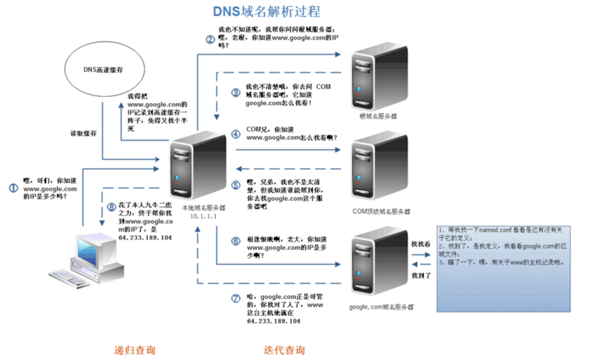
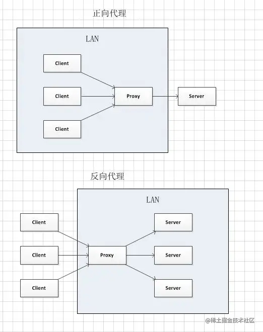
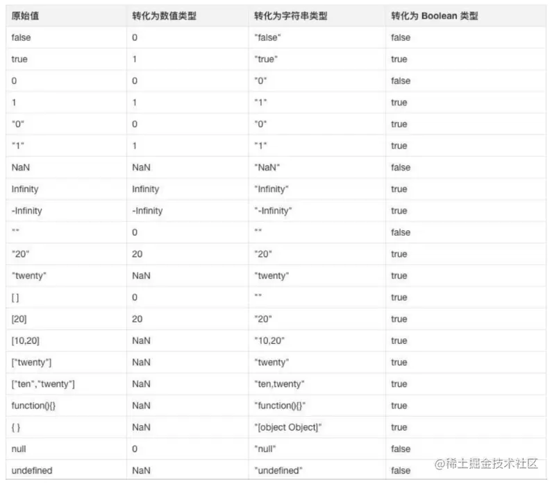
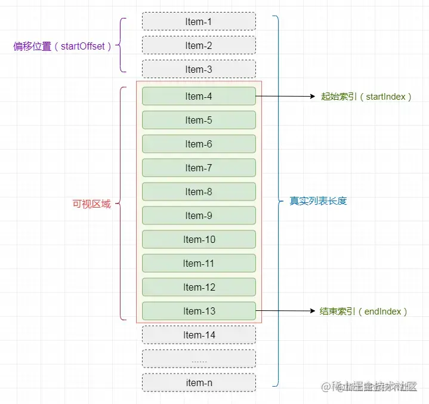

# JS

## 01. 解释下什么是变量声明提升

`变量声明之前即可被访问`，仅存在于 var 声明的变量。

JS 引擎在运行一份代码的时候，会按照下面的步骤进行工作

1. 首先，对代码进行预解析，并获取声明的所有变量

2. 然后，将这些变量的声明语句统一放到代码的最前面

3. 最后，开始一行一行运行代码

我们通过一段代码来解释这个运行过程

```js
console.log(a)

var a = 1

function b() {
  console.log(a)
}

b() // 1
```

上⾯这段代码的实际执⾏顺序为

1. JS 引擎将 `var a = 1` 分解为两个部分：变量声明语句 `var a = undefined` 和变量赋值语句 `a = 1`
2. JS 引擎将 `var a = undefined` 放到代码的最前面，而 `a = 1` 保留在原地

也就是说经过了转换，代码就变成了

```js
var a = undefined

console.log(a) // undefined

a = 1

function b() {
  console.log(a)
}

b() // 1
```

变量的这一转换过程，就被称为变量的声明提升。

而这是不规范，不合理的，我们用的 let/const 就没有这个变量提升的问题。

注意事项：

1. 变量提升是在当前作用域最前面
2. 同时存在函数和 var 时，先提升函数声明
3. 当遇到 return 以下代码不会执行，但是还是会进行预解析
4. let 声明的变量不会挂载到全局 window 上，var 会

```js
function b() {}
console.log(b)
var b = 2
// 以上代码被解析成
function b() {}
var b
console.log(b)
b = 2
```

```js
var foo = 1
function fn() {
  foo = 10
  return
  function foo() {}
}
fn()
console.log(foo)
// 以上代码被解析成
function fn() {
  function foo() {}
  foo = 10
  return
}
var foo
foo = 1
fn()
console.log(foo)
```

## 02. JS 的参数是以什么方式进行传递的

值类型（简单数据类型）： string ，number，boolean，undefined，null

值类型变量的数据直接存放在变量（栈空间）中


引用类型（复杂数据类型）：通过 new 关键字创建的对象（系统对象、自定义对象），如 Object、Array、Date 等

引用类型`变量（栈空间）里存放的是地址`，真正的对象实例存放在堆空间中


`基本数据类型：值传递`

```js
let a = 1

function test(x) {
  x = 10 // 并不会改变实参的值
  console.log(x)
}

test(a) // 10
console.log(a) // 1
```

`复杂类型：传递的是地址! (变量中存的就是地址)`


来看下面的代码：

```js
let a = {
  count: 1,
}

function test(x) {
  x.count = 10
  console.log(x)
}

test(a) // { count: 10 }
console.log(a) // { count: 10 }
```

从运行结果来看，函数内改变了参数对象内的 `count` 后，外部的实参对象 `a` 的内容也跟着改变了，所以传递的是地址。

思考题：

```js
let a = {
  count: 1,
}

function test(x) {
  x = { count: 20 }
  console.log(x)
}

test(a) // { count: 20 }
console.log(a) // { count: 1 }
```


我们会发现外部的实参对象 `a` 并没有因为在函数内对形参的重新赋值而被改变！

因为当我们直接为这个形参变量重新赋值时，其实只是让形参变量指向了别的堆内存地址，而外部实参变量的指向还是不变的。

下图展示的是复杂类型参数传递后的状态：



下图展示的是重新为形参赋值后的状态：


## 03. js 垃圾回收（GC）是怎么做的

JS 中内存的分配和回收都是自动完成的，`内存`在不使用的时候会被垃圾回收器自动回收。

正因为垃圾回收器的存在，许多人认为 JS 不用太关心内存管理的问题，

但如果不了解 JS 的内存管理机制，我们同样非常容易成内存泄漏（内存无法被回收）的情况。

不在用到的内存，没有及时释放，就叫做内存泄漏

### 内存的生命周期

JS 环境中分配的内存, 一般有如下生命周期：

1. 内存分配：当我们声明变量、函数、对象的时候，系统会自动为他们分配内存

2. 内存使用：即读写内存，也就是使用变量、函数等

3. 内存回收：使用完毕，由垃圾回收自动回收不再使用的内存

   全局变量一般不会回收（关闭页面回收），一般局部变量的的值，不用了，会被自动回收掉

内存分配：

```jsx
// 为变量分配内存
let i = 11
let s = "ifcode"

// 为对象分配内存
let person = {
  age: 22,
  name: "ifcode",
}

// 为函数分配内存
function sum(a, b) {
  return a + b
}
```

### 垃圾回收算法说明

所谓垃圾回收，核心思想就是如何判断内存是否已经不再会被使用了，如果是，就视为垃圾，释放掉

下面介绍两种常见的浏览器垃圾回收算法：引用计数 和 标记清除法

### 引用计数

IE 采用的引用计数算法，定义“内存不再使用”的标准很简单，就是看一个对象是否有指向它的引用。如果没有任何变量指向它了，说明该对象已经不再需要了。

```jsx
// 创建一个对象person, person指向一块内存空间, 该内存空间的引用数 +1
let person = {
  age: 22,
  name: "ifcode",
}

let p = person // 两个变量指向一块内存空间, 该内存空间的引用数为 2
person = 1 // 原来的person对象被赋值为1，对象内存空间的引用数-1,
// 但因为p指向原person对象，还剩一个对于对象空间的引用, 所以对象它不会被回收

p = null // 原person对象已经没有引用，会被回收
```

由上面可以看出，引用计数算法是个简单有效的算法。

**但它却存在一个致命的问题：循环引用。**

如果两个对象相互引用，尽管他们已不再使用，垃圾回收器不会进行回收，导致内存泄露。

```jsx
function cycle() {
  let o1 = {}
  let o2 = {}
  o1.a = o2
  o2.a = o1
  return "Cycle reference!"
}

cycle()
```



### 标记清除算法

现代的浏览器已经不再使用引用计数算法了。

现代浏览器通用的大多是基于标记清除算法的某些改进算法，总体思想都是一致的。

标记清除法：

- 标记清除算法将“不再使用的对象”定义为“无法达到的对象”

- 简单来说，就是从根部（在 JS 中就是全局对象）出发定时扫描内存中的对象

- 凡是能从根部到达的对象，都是还需要使用的。那些无法由根部出发触及到的对象被标记为不再使用，稍后进行回收

从这个概念可以看出，无法触及的对象包含了没有引用的对象这个概念（没有任何引用的对象也是无法触及的对象）

根据这个概念，上面的例子可以正确被垃圾回收处理了

参考文章：[JavaScript 内存管理](https://www.jianshu.com/p/84a8fd5fa0ee)

## 04. 谈谈你对 JavaScript 作用域链的理解

作用域（scope）规定了变量能被访问的“范围”，离开了这个“范围”变量便不能被访问。

作用域链本质上是底层变量的查找机制，在函数被执行时，会优先在当前函数作用域中查找变量，如果当前作用域查不到则会依次逐级查找父级作用域知道全局作用域。

JavaScript 在执⾏过程中会创建一个个的**可执⾏上下⽂**。 (每个函数执行都会创建这么一个可执行上下文)

每个可执⾏上下⽂的词法环境中包含了对外部词法环境的引⽤，可通过该引⽤来获取外部词法环境中的变量和声明等。

这些引⽤串联起来，⼀直指向全局的词法环境，形成一个链式结构，被称为作⽤域链。

简而言之：函数内部 可以访问到 函数外部作用域的变量，而外部函数还可以访问到全局作用域的变量，这样的变量作用域访问的链式结构，被称之为作用域链。

```js
let num = 1

function fn() {
  let a = 100
  function inner() {
    console.log(a)
    console.log(num)
  }
  inner()
}
fn()
```

下图为由多个可执行上下文组成的调用栈：

- 栈最底部为`全局可执行上下文`
- `全局可执行上下文` 之上有多个 `函数可执行上下文`
- 每个可执行上下文中包含了指向外部其他可执行上下文的引用，直到 `全局可执行上下文` 时它指向 `null`


js 全局有全局可执行上下文, 每个函数调用时, 有着函数的可执行上下文, 会入 js 调用栈

每个可执行上下文, 都有者对于外部上下文词法作用域的引用, 外部上下文也有着对于再外部的上下文词法作用域的引用

**=> 就形成了作用域链**

## 05. 谈谈你对闭包的理解

这个问题想考察的主要有两个方面：

- 对闭包的基本概念的理解
- 对闭包的作用的了解

**什么是闭包？**

MDN 的官方解释：

> 闭包是函数和声明该函数的词法环境的组合

更通俗一点的解释是：

> 内层函数, 引用外层函数上的变量, 就可以形成闭包

需求: 定义一个计数器方法, 每次执行一次函数, 就调用一次进行计数

```js
let count = 0
function fn() {
  count++
  console.log("fn函数被调用了" + count + "次")
}
fn()
```

这样不好! count 定义成了全局变量, 太容易被别人修改了, 我们可以利用闭包解决

闭包实例:

```jsx
function fn() {
  let count = 0

  function add() {
    count++
    console.log("fn函数被调用了" + count + "次")
  }

  return add
}
const addFn = fn()
addFn()
addFn()
addFn()
```

**闭包的主要作用是什么？**

在实际开发中，闭包最大的作用就是用来 **变量私有**。

下面再来看一个简单示例：

```js
function Person() {
  // 以 let 声明一个局部变量，而不是 this.name
  // this.name = 'zs'     =>  p.name
  let name = "hm_programmer" // 数据私有

  this.getName = function () {
    return name
  }

  this.setName = function (value) {
    name = value
  }
}

// new:
// 1. 创建一个新的对象
// 2. 让构造函数的this指向这个新对象
// 3. 执行构造函数
// 4. 返回实例
const p = new Person()
console.log(p.getName()) // hm_programmer

p.setName("Tom")
console.log(p.getName()) // Tom

p.name // 访问不到 name 变量：undefined
```

在此示例中，变量 `name` 只能通过 Person 的实例方法进行访问，外部不能直接通过实例进行访问，形成了一个私有变量。

## 06. 隐式类型转换

判断时，尽量不要用 `==` , 要用 `===`，两个等号判断，如果类型不同，默认会进行隐式类型转换再比较。


## 07. 谈谈你对原型链的理解

要讲清楚这个问题，主要着重这几个方面

- 什么是原型对象
- 构造函数，原型对象，实例对象的三角关系图
- 原型链如何形成



`原型对象`

js 规定，每一个构造函数都有一个 prototype 属性，指向另一个对象，这个对象称为原型对象。

基于构造函数创建出来的实例，都可以共享访问原型对象的属性。

例如我们的 `hasOwnProperty`, `toString` ⽅法等其实是 Obejct 原型对象的方法，它可以被任何对象当做⾃⼰的⽅法来使⽤。

`hasOwnProperty` 用于判断，某个属性，是不是自己的 (还是原型链上的)

来看一段代码：

```js
let person = {
  name: "Tom",
  age: 18,
  job: "student",
}

console.log(person.hasOwnProperty("name")) // true
console.log(person.hasOwnProperty("hasOwnProperty")) // false
console.log(Object.prototype.hasOwnProperty("hasOwnProperty")) // true
```

可以看到，`hasOwnProperty` 并不是 `person` 对象的属性，但是 `person` 却能调用它。

那么 `person` 对象是如何找到 Object 原型中的 `hasOwnProperty` 的呢？这就要靠原型链的能力了。

需求: 简单绘制原型三角关系图!

**原型链**

在 JavaScript 中，每个对象中都有一个 `__proto__` 属性，这个属性指向了当前对象的构造函数的原型。

对象可以通过自身的 `__proto__`属性与它的构造函数的原型对象连接起来，

而因为它的原型对象也有 `__proto__`，因此这样就串联形成一个链式结构，也就是我们称为的原型链。


## 08. 谈谈对于继承的理解

**为什么要学习继承 ?**

写的构造函数, 定义了一个类型 (人类), 万一项目非常大, 又有了细化的多个类型 (老师, 工人, 学生)

学习继承, 可以让多个构造函数之间建立关联, 便于管理和复用

**什么是继承 ?**

继承: 从别人那里, 继承东西过来 (财产, 房产)

代码层面的继承: 继承一些属性构造的过程和方法

### 原型继承

原型继承: 通过改造原型链, 利用原型链的语法, 实现继承方法!

分析需求:

人类, 属性: name, age

学生, 属性: name, age, className

工人, 属性: name, age, companyName

无论学生, 还是工人, => 都是人类, 所以人类原型上有的方法, 他们都应该要有

```js
// 1. 定义Person构造函数
function Person(name, age) {
  this.name = name
  this.age = age
}
Person.prototype.say = function () {
  console.log("人类会说话")
}

// 2. 定义Student构造函数
function Student(name, age, className) {
  this.name = name
  this.age = age
  this.className = className
}
// 3. 原型继承: 利用原型链, 继承于父级构造函数, 继承原型上的方法
// 语法: 子构造函数.prototype = new 父构造函数()
Student.prototype = new Person()
Student.prototype.study = function () {
  console.log("学生在学习")
}

let stu = new Student("张三", 18, "80期")
stu.say()
console.log(stu)
```


### 组合继承

组合继承有时候也叫伪经典继承，指的是将原型链 和 借用构造函数 call 技术组合到一块，

从而发挥二者之长的一种继承模式，其背后的思路: **是使用原型链实现对原型属性和方法的继承 (主要是方法)，**

**而通过借用构造函数来实现对实例属性构造的继承**。这样既通过在原型上定义方法实现了函数复用，又能保证每个实例都有它的自己的属性。

```js
// 1. 定义Person构造函数
function Person(name, age) {
  this.name = name
  this.age = age
}
Person.prototype.say = function () {
  console.log("人类会说话")
}

// 2. 定义Student构造函数
function Student(name, age, className) {
  Person.call(this, name, age) // 实现构造属性的继承
  this.className = className
}

// 3. 原型继承: 利用原型链, 继承于父级构造函数, 继承原型上的方法
// 语法: 子构造函数.prototype = new 父构造函数()
Student.prototype = new Person()
Student.prototype.study = function () {
  console.log("学生在学习")
}

let stu = new Student("张三", 18, "80期")
stu.say()
console.log(stu)

// 方法通过 原型继承
// 属性通过 父构造函数的.call(this, name, age)
```

### 寄生组合继承

student 实例上有 name age, 而原型 `__proto__`上不需要再有这些属性, 所以利用 Object.create 改装下

Object.create(参数对象),

1. Object.create 会创建一个新对象,
2. 并且这个新对象的`__proto__` 会指向传入的参数对象

```js
// 1. 定义Person构造函数
function Person(name, age) {
  this.name = name
  this.age = age
}
Person.prototype.say = function () {
  console.log("人类会说话")
}

// 2. 定义Student构造函数
function Student(name, age, className) {
  Person.call(this, name, age)
  this.className = className
}

// 3. 原型继承: 利用原型链, 继承于父级构造函数, 继承原型上的方法
// 语法: 子构造函数.prototype = new 父构造函数()
Student.prototype = Object.create(Person.prototype)
Student.prototype.study = function () {
  console.log("学生在学习")
}

let stu = new Student("张三", 18, "80期")
stu.say()
console.log(stu)

// 总结:
// Object.create() 以参数的对象, 作为新建对象的__proto__属性的值, 返回新建的对象
```



### es6 - class 实现继承 extends

```jsx
// 继承关键字 => extends
class Person {
  constructor(name, age) {
    this.name = name
    this.age = age
  }
  jump() {
    console.log("会跳")
  }
}

class Teacher extends Person {
  constructor(name, age, lesson) {
    super(name, age) // extends 中, 必须调用 super(), 会触发执行父类的构造函数
    this.lesson = lesson
    console.log("构造函数执行了")
  }
  sayHello() {
    console.log("会打招呼")
  }
}

let teacher1 = new Teacher("zs", 18, "体育")
console.log(teacher1)
```

## 09. 如何判断是否是数组

方法一：使用 `toString` 方法

```js
function isArray(arg) {
  return Object.prototype.toString.call(arg) === "[object Array]"
}

let arr = [1, 2, 3]
isArray(arr) // true
```

方法二：使用 ES6 新增的 `Array.isArray` 方法

```js
let arr = [1, 2, 3]
Array.isArray(arr) // true
```

## 10. this

`普通函数`

默认绑定（指向 window 的情况，函数调用模式 fn()）

默认情况下，`this` 会被绑定到全局对象上，比如在浏览器环境中就为`window`对象，在 node.js 环境下为`global`对象。

```js
message = "Hello"

function test() {
  console.log(this.message)
}

test() // "Hello"
```

隐式绑定（谁调用，this 指向谁，方法调用模式 obj.fn()）

如果函数的调用是从对象上发起时，则该函数中的 `this` 会被自动隐式绑定为对象：

```js
function test() {
  console.log(this.message)
}

let obj = {
  message: "hello,world",
  test: test,
}

obj.test() // "hello,world"
```

显式绑定（又叫做硬绑定，上下文调用模式，想让 this 指向谁，this 就指向谁）

```js
function test() {
  console.log(this.message)
}

let obj1 = {
  message: "你好世界123",
}

test.bind(obj1)() // "你好世界123"
```

new 绑定（构造函数模式）

当使用 `new` 调用构造函数时，会创建一个新的对象并将该对象绑定到构造函数的 `this` 上：

```js
function Greeting(message) {
  this.message = message
}

var obj = new Greeting("hello,world")
obj.message // "hello,world"
```

案例 1：

```jsx
let obj = {
  a: {
    fn: function () {
      console.log(this)
    },
    b: 10,
  },
}
obj.a.fn()
let temp = obj.a.fn
temp() // window
```

案例 2：

```js
function Person(theName, theAge) {
  this.name = theName
  this.age = theAge
}
Person.prototype.sayHello = function () {
  // 定义函数
  console.log(this)
}

let per = new Person("小黑", 18)
per.sayHello()
```

`箭头函数`

- 箭头函数属于表达式函数，因此不存在函数提升

- 箭头函数只有一个参数时，可以省略圆括号

- 箭头函数函数体只有一行代码时可以省略花括号，并自动作为返回值被返回

- 加括号的函数体返回对象字面量表达式

  ```js
  const fn = uname => ({ uname: uname }) // 加括号的函数体返回对象字面量表达式
  ```

- 普通函数有 arguments 动态参数，箭头函数没有，但是箭头函数有剩余参数...args

  ```js
  const getSum = (...args) => {
    let sum = 0
    for (let i = 0; i < args.length; i++) {
      sum += args
    }
    return sum
  }

  console.log(getSum(1, 2, 3)) // 6
  ```

- 箭头函数没有自己的 this，箭头函数中的 this 指向自己的作用域链的上一层的 this。它总是指向最近的外层作用域中的 this 所指对象

  ```js
  const user = {
    name: "小明",
    sleep: function () {
      console.log(this) // 指向user
      const fn = () => {
        console.log(this) // 指向user
      }
      fn()
    },
  }
  user.sleep()
  ```

  ```js
  console.log(this) // window
  const sayHi = () => {
    console.log(this) // window
  }
  btn.addEventListener("click", () => {
    console.log(this) // window
  })
  ```

  ```js
  const user = {
    name: "小明",
    walk: () => {
      console.log(this) // window
    },
  }
  user.walk()
  ```

`改变this指向`

call（了解）：返回值就是函数的返回值，因为它就是调用函数

```js
const obj = {
  name: "德华",
}
function fn(x, y) {
  console.log(this) // this指向obj
  console.log(x + y)
}
fn.call(obj, 1, 2)
```

apply（了解）：返回值就是函数的返回值，因为它就是调用函数

```js
function fn(x, y) {
  return x + y
}
let res = fn.apply(null, [1, 2])
```

`bind`：返回由指定的 this 值和初始化参数改造的 原函数拷贝 （新函数）

```js
function sayHi() {
  console.log(this)
}
let user = {
  uname: "德华",
  age: 18,
}
let res = sayHi.bind(user)
res()
```

三者区别：

都可以改变函数内部 this 指向

call 和 apply 会调用函数，并且改变函数内部 this 指向

call 和 apply 传递的参数不一样，call 传递参数 aru1,aru2...。apply 必须传入数组形式[arg]

bind 不会调用函数，可以改变函数内部 this 指向

## 11. promise

为什么 js 是单线程？js 是运行在浏览器的脚本语言，目的是实现页面上的动态交互如果是多个线程，对某个元素进行操作，其中某个线程对该元素做了修改，另外的线程将该元素删除，这样浏览器无法确定到底采用哪个线程。

js 是`单线程执行`的编程语言。也就是说同一时间只能做一件事情。如果前一个任务非常耗时，则后续的任务就不得不一直等待，从而导致`程序假死`的问题。为了防止某个耗时任务导致程序假死，js 把任务分成了两类：

同步任务：在主线程上排队执行的任务

异步任务：异步（耗时）任务由 js 委托给宿主环境执行，当异步任务执行完成后，会通知 js 主线程`执行异步任务的回调函数`

- 异步任务有 setTimeout setInterval ajax fs.readFile 事件处理函数

- `一般异步任务都会用到回调函数`

  ```js
  // 回调函数：把一个函数当作参数传递，将来特定的时机调用
  setTimeout(() => {
    console.log("hello")
  }, 1000)
  ```

  `回调函数有什么问题？`

  回调函数可阅读性差，难以维护，多层回调函数相互嵌套就形成了`回调地狱`

  ```js
  setTimeout(() => {
    console.log("延时 1 秒后输出")
  
    setTimeout(() => {
      console.log("再延时 2秒后输出")
  
      setTimeout(() => {
        console.log("再延时 3秒后输出")
      }, 3000)
    }, 2000)
  }, 1000)
  ```

`promise设计之初就是用来解决回调地狱的`

promise 是个构造函数可以封装一个异步任务。那这个异步任务是执行成功还是执行失败？

```js
const p = new Promise((resolve, reject) => {
  // promise内部一般可以封装一个异步操作
  // resolve,reject是promise内部提供好的两个函数
  // 成功调用reslove,失败调用reject
})
```

`promie支持链式调用，从而解决回调地狱的问题。如果上一个 .then 中返回一个新的 promise 对象，则可以交给下一个 .then 继续处理。`

```js
new Promise((resolve, reject) => {
  setTimeout(() => {
    resolve("延时 1 秒后输出")
  }, 1000)
}).then(res => {
  console.log(res) // 延时 1 秒后输出

  return new Promise((resolve, reject) => {
    setTimeout(() => {
      resolve("再延时 2秒后输出")
    }, 2000)
  }).then(res => {
    console.log(res) // 再延时 2秒后输出

    return new Promise((resolve, reject) => {
      setTimeout(() => {
        resolve("再延时 3秒后输出")
      }, 3000)
    }).then(res => {
      console.log(res) // 再延时 3秒后输出
    })
  })
})
```

这样看起来似乎也并不友好，让我们进行优化下

```js
// 将创建 promise 对象的过程，封装到一个函数中，需要promise对象，调函数即可
function fn(msg, time) {
  return new Promise((resolve, reject) => {
    setTimeout(() => {
      resolve(msg)
    }, time)
  })
}

fn("延时 1 秒后输出", 1000)
  .then(res => {
    console.log(res) // 延时 1 秒后输出

    return fn("再延时 2秒后输出", 2000)
  })
  .then(res => {
    console.log(res) // 再延时 2秒后输出

    return fn("再延时 3秒后输出", 3000)
  })
  .then(res => {
    console.log(res) // 再延时 3秒后输出
  })
```

以上就解决了回调地狱的问题，那么再来看看在 ajax 中如何运用

```js
// promise是一个对象，来表示一个异步任务在执行完毕后，到底是成功还是失败
function ajax(url) {
  return new Promise((resolve, reject) => {
    const xhr = new XMLHttpRequest()
    xhr.open("GET", url)
    xhr.responseType = "json"
    xhr.onload = function () {
      if (this.status === 200) {
        resolve(this.response)
      } else {
        reject(new Error(this.statusText))
      }
    }
  })
}
ajax(url)
```


promise 有三种状态：`一旦promise状态发生变化，状态就会被凝固`


1. pending：默认状态，等待（进行中）
2. fulfilled：成功（已完成），调用了 resolve 函数，promsie 的状态就会被标记为成功
3. rejected：失败（拒绝），调用了 reject 函数，promise 的状态就会被标记为失败


## 12. async/await

async 用来简化 promise 异步操作。在 async/await 出现之前，只能通过链式调用处理异步操作。虽然解决了回调地狱的问题，但是链式调用代码冗余、阅读性差、不易理解。

1. 同步化代码的阅读体验（Promise 虽然摆脱了回调地狱，但 then 链式调⽤的阅读负担还是存在的）
2. 和同步代码更一致的错误处理方式（ async/await 可以⽤成熟的 try/catch 做处理，比 Promise 的错误捕获更简洁直观）
3. 调试时的阅读性，也相对更友好

```js
function fn(msg, time) {
  return new Promise((resolve, reject) => {
    setTimeout(function () {
      resolve(msg)
    }, time)
  })
}

// async用于修饰一个函数，表示一个函数是异步的
// async会⾃动将常规函数转换成Promise，返回值也是⼀个Promise对象
// 如果async函数内没有await，那么async没有意义，全是同步的内容，只有遇到了await开始往下，才是异步的开始

// await后面一般会跟一个promise对象，await会阻塞async函数的执行，直到等到promise成功的结果（只会等待成功的结果）
// 如果失败了会报错，需要使用try/catch捕获

// 在async函数中，第一个await之前的代码会同步执行，await之后的代码会异步执行
console.log("a")
async function demo() {
  console.log("b")

  let res1 = await fn("延时 1 秒后输出", 1000)
  console.log(res1) // 延时 1 秒后输出

  let res2 = await fn("再延时 2秒后输出", 2000)
  console.log(res2) // 再延时 2秒后输出

  let res3 = await fn("再延时 3秒后输出", 3000)
  console.log(res3) // 再延时 3秒后输出

  console.log("c")
}
demo()
console.log("d")
```

## 15. 深拷贝 浅拷贝（只针对引用类型）

开发中，我们经常需要复制一个对象，如果直接用复制会有下面问题：

引用类型，进行复制时，复制的是地址。

```js
const obj = {
  name: "德华",
  age: 18,
}
const obj2 = obj
obj2.name = "德芙"
console.log(obj)
// obj对象里的name也发生了变化
```


浅拷贝：`拷贝对象时，里面的属性值是简单数据类型直接拷贝值。属性值是引用数据类型拷贝的是地址。`

常见方法：

1. 拷贝对象：Object.assign() / 展开运算符{ ...obj }

2. 拷贝数组：Array.prototype.concat() / [ ...arr ]

```jsx
const obj = {
  uname: "德华",
}
const obj2 = { ...obj }
```

```js
const obj = {
  uname: "德华",
  age: 18,
  family: {
    sister: "德芙",
  },
}

const obj2 = {}
Object.assign(obj2, obj)
obj2.family.sister = "丝滑"
```

深拷贝：`拷贝的是对象，不是地址。`

常见方法：

1. 通过递归实现深拷贝（如果一函数在内部可以调用自己，那么这个函数就是递归函数。递归容易发生`栈溢出`，所以必须加退出条件 return）

   ```js
   let num = 1
   function fn() {
     console.log("我要打印6次")
     if (num >= 6) return
     num++
     fn() // 函数内部调用自己
   }
   fn()
   ```

2. lodash / cloneDeep

3. 通过 JSON.stringfy()实现

```jsx
let obj = {
  name: "zs",
  age: 18,
  car: {
    brand: "宝马",
    price: 100,
  },
}

let obj2 = JSON.parse(JSON.stringify(obj))
```

## 16. 事件循环

事件循环（EventLoop）：js 是单线程的，同步任务由 js 主线程按次序执行，遇到异步任务交给浏览器（宿主环境），浏览器帮你监听，如果满足条件（已完成的异步任务对应的回调函数，会被加入到任务队列中等待执行），先在任务队列里排队，等 js 主线程执行完，再把代执行的任务交给主线程。


JavaScript 把异步任务又做了进一步的划分，异步任务又分为两类，分别是：

1. 宏任务：script、ajax、setTimeout、setInterval、文件操作..

2. 微任务：Promise.then、.catch 和 .finallyprocess.nextTick

宏任务和微任务的执行顺序：每一个宏任务执行完之后，都会检查是否存在待执行的微任务，如果有，则执行完所有微任务之后，再继续执行下一个宏任务。


练习题：

```js
// 1 3 5 2 4
console.log(1)

setTimeout(function () {
  console.log(2)
}, 0)

console.log(3)

setTimeout(function () {
  console.log(4)
}, 1000)

console.log(5)
```

```js
let num = 10
setTimeout(function () {
  num = 100
}, 0)
console.log(num) // 10
```

```js
async function fn() {
  console.log("嘿嘿")
  // await右边的表达式会立即执行
  const res = await fn2() // fn2()是同步的内容，await等待fn2()的结果
  console.log(res) // 微任务
}
async function fn2() {
  console.log("gaga")
}
fn()
console.log(222)
// 嘿嘿 gaga 222 undefined
```

```js
// 1 3 4 5 1000 2
console.log(1)

setTimeout(function () {
  console.log(2)
}, 0)

// promise本身是一个同步代码，只有它后面调用的then方法里的回调函数才是微任务
const p = new Promise((resolve, reject) => {
  console.log(3)
  resolve(1000) // 成功后触发then方法
  console.log(4)
})

p.then(data => {
  console.log(data)
})

console.log(5)
```

```js
console.log(1)

setTimeout(function () {
  console.log(2)
  new Promise(function (resolve) {
    console.log(3)
    resolve()
  }).then(function () {
    console.log(4)
  })
})

new Promise(function (resolve) {
  console.log(5)
  resolve()
}).then(function () {
  console.log(6)
})

setTimeout(function () {
  console.log(7)
  new Promise(function (resolve) {
    console.log(8)
    resolve()
  }).then(function () {
    console.log(9)
  })
})

console.log(10)
```

# HTTP

## 01. HTTP 有哪些请求⽅法

## 02. HTTP 请求方法的具体作用（前 5 个）

|  方法   |                                                                                   功能                                                                                   |
| :-----: | :----------------------------------------------------------------------------------------------------------------------------------------------------------------------: |
|   GET   |                                                                             从服务器获取资源                                                                             |
|  POST   |                                                                             向服务器新增数据                                                                             |
|  HEAD   | 请求资源的头部信息，并且这些头部与 HTTP GET ⽅法请求时返回的⼀致。<br />该请求⽅法的⼀个使⽤场景是在下载⼀个⼤⽂件前先获取其⼤⼩再决定是否要下载，以此可以节约带宽资源。 |
|   PUT   |                                                       更新服务器上的数据，侧重于完整更新。例如：更新用户的完整信息                                                       |
| DELETE  |                                                                            删除服务器上的数据                                                                            |
| OPTIONS |                                                ⽤于获取⽬的资源所⽀持的通信选项 (跨域请求前，预检请求，判断目标是否安全)                                                 |
|  TRACE  |                                                    该方法会让服务器原样返回任意客户端请求的信息内容，用于诊断和判断。                                                    |
| CONNECT |             HTTP/1.1 协议中预留给能够将连接改为管道⽅式的代理服务器<br />(把服务器作为跳板，让服务器代替用户去访问其它网页，之后把数据原原本本的返回给用户)              |
|  PATCH  |                                                       更新服务器上的数据，侧重于部分更新。例如：只更新用户的手机号                                                       |

GET/DELETE 参数是在地址栏中传递的

PUT/PATCH/POST 参数是在请求体传递的

## 03. GET 和 POST 区别

数据传输方式：GET 在地址栏中传递。POST 在请求体中传递。

数据安全：GET 相对 POST 不安全，默认 http 是明文传输，可以破解，https 会对内容进行加密。

数据类型：GET 只允许 ASCII 字符。POST ⽆限制（文件、图片...）

功能特性：GET 安全且幂等（安全：只读特性，使⽤这个⽅法不会引起服务器状态变化。幂等：同⼀个请求⽅法执⾏多次和仅执⾏⼀次的效果完全相同）。POST ⾮安全、⾮幂等。

请求长度：浏览器由于对 url 长度的限制，所以会影响 get 请求发送数据时的长度

## 04. HTTP 请求报文

HTTP 请求报⽂的组成：请求⾏、请求头、(空⾏)、请求体。


`请求行`

包含了请求⽅法、URL、HTTP 协议版本，它们之间⽤空格进行分隔。例如：

```bash
GET http://www.abc.com/articles HTTP/1.1
```

`请求头`

注意：不同的数据对应不同的请求类型，axios 默认帮我们做了设置处理

| 属性值                               | 应用场景                                         |
| ------------------------------------ | ------------------------------------------------ |
| application/x -www -form -urlencoded | 表单中不包含文件上传的场景，适用于普通数据的提交 |
| multipart/form -data                 | 表单中包含上传文件的场景                         |
| application/json                     | 上传 json 格式数据                               |

请求头由键值对组成，每⾏⼀对，键值之间⽤英⽂冒号`:`进行分隔。例如：

```
Content-Type: application/json
Host: www.abc.com
User-Agent：产请求的浏览器类型
Accept：客户端可识别的内容类型列表
Host：请求的主机名，允许多个域名同处个IP地址，即虚拟主机
```

`请求体`

请求体中放置 POST、PUT、PATCH 等请求方法所需要携带的数据。

注意：在浏览器中，`GET 请求比较特殊，没有请求体。`在浏览器中，POST、PUT、PATCH、DELETE 请求有请求体。

## 05. HTTP 响应报文

HTTP 响应报⽂的组成：响应⾏、响应头、空⾏、响应体。


`响应行`

响应行由协议版本、状态码、状态码的原因短语 3 个内容组成，中间以空格分隔。例如：

```bash
HTTP/1.1 200 OK
```

`响应头`

响应头由键值对组成，每⾏⼀对，键值之间⽤英⽂冒号`:`进行分隔。例如：

```
Content-Length: 1024
Content-Type: application/json
```

`响应体`

服务器发送过来的数据

## 06. HTTP 响应状态码

`成功（2XX）`

| 状态码 | 原因短语        | 说明                                                                                                                   |
| ------ | --------------- | ---------------------------------------------------------------------------------------------------------------------- |
| `200`  | OK              | `请求成功`。表示从客户端发来的请求在服务器端被正确处理                                                                 |
| `201`  | Created         | 资源在服务器端已成功创建，通常是在 post 请求，或者某些 put 请求之后创建了内容                                          |
| 202    | Accepted        | 请求服务器已接受，但是尚未处理，不保证完成请求<br />适合异步任务或者说需要处理时间比较长的请求，避免 HTTP 连接一直占用 |
| 204    | No content      | 表示请求成功，但响应报⽂不含实体的主体部分                                                                             |
| 206    | Partial Content | 进⾏的是范围请求，表示服务器已经成功处理了部分 GET 请求<br />响应头中会包含获取的内容范围 (常用于分段下载)             |

`重定向（3XX）`

| 状态码 | 原因短语           | 说明                                                                                                                                                         |
| ------ | ------------------ | ------------------------------------------------------------------------------------------------------------------------------------------------------------ |
| 301    | Moved Permanently  | 永久性重定向，表示资源已被分配了新的 URL<br />比如，我们访问 **http**://www.baidu.com 会跳转到 **https**://www.baidu.com                                     |
| 302    | Found              | 临时性重定向，表示资源临时被分配了新的 URL，支持搜索引擎优化<br />首页，个人中心，遇到了需要登录才能操作的内容，重定向到登录页                               |
| 303    | See Other          | 对于 POST 请求，它表示请求已经被处理，客户端可以接着使用 GET 方法去请求 Location 里的 URI                                                                    |
| `304`  | Not Modified       | 资源在客户端被缓存，响应体中不包含任何资源内容！（协商缓存）                                                                                                 |
| 307    | Temporary Redirect | 对于 POST 请求，表示请求还没有被处理，客户端应该向 Location 里的 URI 重新发起 POST 请求。<br />不对请求做额外处理, 正常发送请求, 请求 location 中的 url 地址 |

因为 post 请求，是非幂等的，从 302 中，细化出了 303 和 307

简而言之：

- 301 302 307 都是重定向。比如访问的是http://www.baidu.com会重定向到https://www.baidu.com
- 304 协商缓存

`客户端错误（4XX）`

| 状态码 | 原因短语        | 说明                                                                  |
| ------ | --------------- | --------------------------------------------------------------------- |
| `400`  | Bad Request     | 客户端的请求方式、或请求参数有误导致的请求失败！`400不一定是后台错误` |
| `401`  | UnAuthorized    | 客户端的用户身份认证未通过，导致的此次请求失败！                      |
| 403    | Forbidden       | 表示对请求资源的访问被服务器拒绝                                      |
| `404`  | Not Found       | 客户端请求的资源地址错误（在服务器找不到），导致服务器无法找到资源！  |
| 408    | Request Timeout | 客户端请求超时                                                        |
| 409    | Confict         | 请求的资源可能引起冲突                                                |

`服务端错误（5XX）`

| 状态码 | 原因短语                   | 说明                                                                                                     |
| ------ | -------------------------- | -------------------------------------------------------------------------------------------------------- |
| 500    | Internal Sever Error       | 服务器内部错误，导致的本次请求失败！                                                                     |
| 501    | Not Implemented            | 请求超出服务器能⼒范围，例如服务器不⽀持当前请求所需要的某个功能，<br />或者请求是服务器不⽀持的某个⽅法 |
| 503    | Service Unavailable        | 表明服务器暂时处于超负载或正在停机维护，⽆法处理请求                                                     |
| 505    | Http Version Not Supported | 服务器不⽀持，或者拒绝⽀持在请求中使⽤的 HTTP 版本                                                       |

在状态行中所包含的状态码，叫做“响应状态码”。响应状态码只能表示这次请求的成功与否 (成功或失败)。

在响应体的数据中所包含的状态码，叫做“业务状态码”。业务状态码用来表示这次业务处理的成功与否。


## 07. HTTP1.1 的 keep-alive 是什么作用

HTTP1.0 默认关闭，需要手动开启。HTTP1.1 默认开启。

`作用：客户端到服务器端的连接持续有效(长连接)，当出现对服务器的后继请求时，避免了建立或者重新建立连接。`

使用方法：请求头中添加 Connection: keep-alive

优点：

- 较少的 CPU 和内存的占⽤（因为要打开的连接数变少了，复用了连接）

- 减少了后续请求的延迟（⽆需再进⾏握⼿）

缺点：

- 请求已经都结束了, 但是还一直连接着也不合适，本来可以释放的资源仍旧被占用

  如何解决？服务器设置过期时间或者请求次数，超过这个时间或者次数就断掉连接。

## 08. 为什么需要 HTTPS

`HTTP 协议是明文传输数据，不安全，HTTPS 在传输数据时，会对数据进行加密。`

## 09. HTTPS 是如何对数据进行加密的

目前常见的加密算法可以分成三类：`对称加密算法`，`非对称加密算法` 和 `Hash算法`

1. 对称加密算法: 相同密钥加密解密, 可逆的! 可以用于加密解密传输数据

   想使用对称加密算法, 一定要保证密钥不被泄漏 (且进行密钥的传输约定时, 一定要保证安全)

2. 非对称加密算法: 有两把钥匙, 公钥, 私钥, 可逆的, 可以用于 https 的初步交换密钥

3. Hash 算法: 不可逆的, 根据一段内容, 生成一段唯一标识, 一般用于验证数据是否被修改! (md5)

### 对称加密

`文件加密和解密使用相同的密钥（可逆的，可以用于加密解密传输数据）。`⽐如，两个人事先约定的暗号，就属于对称加密。


优点：简单，加密速度快，效率高，破译困难

缺点：在数据传送前，发送方和接收方必须商定好秘钥，然后双方保存好秘钥。如果一方的秘钥被泄露，那么加密信息也就不安全了。`最不安全的地方，就在于第一开始，互相约定密钥的时候!!! 传递密钥!`

使用场景：本地数据加密、https 通信、网络传输等

常见算法：AES、DES、3DES、DESX、Blowfish、IDEA、RC4、RC5、RC6。全球公开，通过了层层筛选，没有被破解

### ⾮对称加密

`通信的双方使用不同的秘钥进行加密解密，即秘钥对（私钥 + 公钥）`

特征：私钥可以解密公钥加密的内容，公钥可以解密私钥加密的内容


- 优点：非对称加密与对称加密相比其安全性更好

- 缺点：加密和解密花费时间长、速度慢，只适合对少量数据进行加密

使用场景：https 会话前期、CA 数字证书、信息加密、登录认证等

常见算法：RSA、ECC（移动设备用）、Diffie-Hellman、El Gamal、DSA（数字签名用）

### HTTPS 加密解决⽅案

结合了两种加密⽅式：

- 将 `对称加密的密钥(一串约定的字符串)` ⽤非对称加密的公钥, 进⾏加密并发送出去，接收⽅使⽤私钥解密得到 `对称加密密钥`

- 双⽅沟通时使⽤ `对称加密密钥` 进⾏

**可以看到，只有在发送秘钥阶段才使用非对称加密，而后续的通信都使用对称加密，这样解决了性能问题。**

HTTPS 目前所使用的 TLS 或 SSL 协议, 就是目前采用的加密通道的规范协议

它利用对称加密、(公私钥)非对称加密, 以及其密钥交换算法，可完成可信任的信息传输

1. 利用 非对称加密 加密传输 对称加密所约定的密钥 (保证了密钥传输的安全)
2. 后续, 利用对称加密, 有效便捷的进行数据传输!!

### 数字证书

为了安全性, 一般还需要签发数字证书!

客户端 和 服务器端要初步互通消息时, 客户端发送请求可以拿到公开的公钥信息

进而进行非对称加密, 使用公钥, 加密`对称加密密钥`, 传递给服务器, 后续通信都使用对称加密!


**问题是: 初步互通消息时, 如果请求拿到的公钥信息, 就是假的, 或者不安全的! 那么后续的所有操作, 都将是不安全的!**

如何保证公钥的安全性呢?? 说白了, 需要证明公钥是安全可靠的!!! 要证明网站是安全可靠的!!!

所以, 就需要有数字证书(CA 证书), 一般是 CA 机构(互联网的机构, 登记网站和公钥的)颁发的, 证明这个公钥是安全可靠的!

**CA 证书中心会对你网站的公钥, 网站的域名地址, 证书到期时间, 等一些相关信息一起加密签发数字证书, 保证你网站的安全性**


当公司申请了 CA 证书后, 就应该在响应时, 将数字证书一起发送给客户端


而客户端, 接收到消息后, 就可以查看证书 , 权威 CA 机构都可以

1. 如果正在访问的网站 和 证书记载的网址 不一致, 说明不安全, 可能被冒用, 浏览器就会发出警告!!!

2. 如果签发证书的机构, 不权威, 发出警告

   

3. 如果证书过期了, 浏览器也会发出警告

   因为一旦证书过期了, CA 机构, 不会继续实时检测网站的安全有效性!

### 数字签名

但这还是有问题：如果证书被篡改了怎么办?

这时就需要用⼀个技术：**数字签名**。 (根据证书内容, 生成的一个唯一标识)

数字签名就是先⽤ **CA ⾃带的 Hash 算法来计算出证书内容的⼀个摘要**，然后使⽤ CA 私钥进行加密，组成数字签名。

当别⼈把他的证书发过来时，**接收方⽤同样的算法再次⽣成摘要**，⽤ CA 公钥解密后得到 CA 生成的摘要，两者进行对⽐后,

就能确定中间是否被⼈篡改。这样就能最⼤程度的保证通信的安全了。

[博客参考](https://blog.csdn.net/u014044812/article/details/80723009)

---

简要小结:

1. 为什么需要 HTTPS ? 因为 HTTP 是明文传输数据的, 不安全, 而 HTTPS 是会对内容加密的

2. HTTPS 的加密策略是什么 ?

   先用 `非对称加密`, 传递对称加密的密钥 (保证了密钥传输的安全)

   后续 使用`对称加密`, 进行交流 (保证了传输数据安全)

3. 问题: 就算是第一次交流用非对称加密, 公钥也是要在网络中传输的!

   如何证明公钥是可靠的? 如何证明网站是可靠的 ? (CA 机构认证, 网站需要申请 **`数字证书`** )

   请求时, 网站就会将数字证书给到浏览器, 浏览器默认就会检测证书的可靠性!

   (1) 是否是权威机构发布的!

   (2) 看证书中记录的地址 和 当前访问的网站的地址, 是否一致, 只有一致, 才可靠!

   (3) 看证书是否过期

   ...

4. 如何保证证书不被篡改 => **`数字签名`**, 可以根据证书的所有的内容, 生成一个唯一标识!!! (`Hash加密算法`)

   一旦内容如果被修改了, 再次生成唯一标识时, 和之前生成的唯一标识就不一样! 检测是否被修改!

## 10. HTTP/2 和 HTTP1.x 比有什么优势和特点

**HTTP/2 的升级, 对于用户来说, 是跨时代的! 基于 HTTP/2, 用户访问网页的速度会非常快!!! (充分利用带宽)**

HTTP/2: 淘宝, 天猫, 京东等, 已做升级 ....

1. HTTP/2 采⽤`⼆进制格式`来传输数据，⽽⾮ HTTP 1.x 的⽂本格式，⼆进制协议`解析起来更⾼效`
2. HTTP/2 采用一些`头部压缩技术`，减少在请求和响应头中重复携带的数据，`降低网络负担`
3. HTTP/2 采⽤`服务器推送`方式，主动向客户端推送资源，提高页面加载效率
4. **HTTP/2 采⽤`多路复用机制`，减少需要创建的连接数量，降低资源占用和性能消耗**

下面是一些与之关联的技术知识。

**⼆进制格式分帧**

帧：HTTP/2 数据通信的最⼩单位消息，是指 HTTP/2 中逻辑上的 HTTP 消息（例如请求、响应等）。消息由⼀个或多个帧组成

流：存在于连接中的⼀个虚拟通道，它可以承载双向消息，且每个流都有唯⼀的整数 ID

**头部压缩**

在 HTTP1.x 中，请求和响应中会重复携带一些不常改变、冗⻓的头数据，给⽹络带来额外负担。

在 HTTP/2 中，客户端和服务端使⽤ **“⾸部表”** 来跟踪和存储之前发送过的键值对，

相同的数据不再随着每次请求和响应发送。⾸部表在连接存续期间始终存在，由客户端和服务器共同渐进更新。

每个新的⾸部键值对，要么被追加到当前表的末尾，要么替换表中已存在的键值对。

> 可以简单的理解为：只发送差异数据，⽽不是全部发送，从⽽减少头部的信息量

下图为首部表的更新示意图：


**服务器推送**

服务端可以在发送⻚⾯ HTML 内容时，再主动推送一些其它资源，⽽不⽤等到浏览器解析到相应的位置时发起请求后再作响应。

例如，服务端可以主动把 JS 和 CSS ⽂件推送给客户端，⽽不需要客户端解析 HTML 时再发送这些请求。

不过，服务端的主动推送行为，客户端有权利选择是否要接收。

如果服务端推送的资源已经被浏览器缓存过，浏览器可以通过发送 RST_STREAM 帧来拒收。

**多路复用**

在 HTTP 1.x 中如果想并发多个请求的话，必须使⽤多个 TCP 链接，但浏览器为了控制资源，

会对单个域名有 6-8 个 TCP 链接的数量限制。而在 HTTP/2 中：

- 同域名下的所有通信，都在单个连接上完成
- 单个连接可以承载任意数量的双向数据流
- 数据流以消息的形式发送，⽽消息⼜由⼀个或多个帧组成（多个帧可以乱序发送，因为可以根据帧⾸部的流标识来重新组装）


[参考文章：HTTP/2 特性及其在实际应用中的表现](https://zhuanlan.zhihu.com/p/30166894)

**小结:**

**HTTP1.X 同一时间, 只能并发建立 6-8 个 TCP 连接, 一个连接同时只能一个请求 (虽然可以 keep-alive 复用, 但也得一个个来)**

**(建立连接的成本比较高, 不让一次性建立太多连接)**

**而新版本 HTTP/2 建立一次连接, 就可以并发很多个请求!**

所以 HTTP/2 的升级, 大大提升了页面加载的效率!

## 11. http 缓存控制

### 基本认知

缓存包括：数据库缓存、服务器端缓存（代理服务器缓存、CDN 服务器缓存）、浏览器缓存

<span style="color:red">数据库缓存：前端发请求给后台，后台执行 sq 语句查询数据库，查询是需要时间的，所以后台会有数据库缓存，下次前台发送相同请求，直接从缓存中读取。</span>

浏览器缓存也包含很多内容： HTTP 缓存、本地缓存（indexDB、cookie、localstorage 等）

HTTP 缓存（强缓存，协商缓存）： (优化页面加载的效率，如果没有缓存策略，每次重新加载页面，会非常慢)

在具体了解 HTTP 缓存之前先来明确几个术语：

- 缓存命中率：从缓存中得到数据的请求数与所有请求数的比率。理想状态是越高越好。(所有的请求中，有多少从缓存中读的)

- 过期内容：超过设置的有效时间，被标记为“陈旧”的内容

- 验证：验证缓存中的过期内容是否仍然有效，验证通过的话刷新过期时间

- 失效：失效就是把内容从缓存中移除

**浏览器缓存主要是 HTTP 协议定义的缓存机制。**

浏览器缓存分为`强缓存 `和 `协商缓存`，浏览器加载一个页面的简单流程如下：

1. 浏览器先根据这个资源的 **http 头信息** 来 **判断是否命中强缓存**。

   如果命中则直接加载在缓存中的资源，并不会将请求发送到服务器。（强缓存）

2. 如果未命中强缓存，则浏览器会将资源加载请求发送到服务器。

   服务器来判断浏览器本地缓存是否失效。

   若可以使用，则服务器并不会返回资源信息，浏览器继续从缓存加载资源。（协商缓存）

3. 如果未命中协商缓存，则服务器会将完整的资源返回给浏览器，浏览器加载新资源，并更新缓存。（新的请求）

### 强缓存 (验证缓存是否过期)

<span style="color:red">前端发请求到后台，后台响应数据给前端，在数据中有保质期（在保质期之内都可以使用这个数据）</span>

<span style="color:red">判断缓存是否有效，就是判断资源是否过期，如果未过期，直接用缓存。命中强缓存时，浏览器并不会将请求发送给服务器。</span>

在 Chrome 的开发者工具中看到 http 的返回码是 200，但是在 Size 列会显示为(from cache)。


<span style="color:red">强缓存是利用 http 的返回的响应头中的 Expires 或者 Cache-Control (优先级更高) 两个字段来控制的，用来表示资源的缓存时间。</span>

Expires：指定一个具体时间(2020 年 12 月 12 日 17:00)，到了这个时间了，缓存过期了，在时间内，都是有效的，可以直接读

Cache-Control：指定一个过期时间 (3600s)，这个资源你加载到后，可以用 3600s

1. <span style="color:red">Expires（给的是服务器的时间）</span>

缓存过期时间，用来指定资源到期的时间，是服务器端的具体的时间点。也就是说，Expires=max-age + 请求时间，需要和 Last-modified 结合使用。但在上面我们提到过，cache-control 的优先级更高。

Expires 是服务器响应消息头字段，在响应 http 请求时告诉浏览器在过期时间前浏览器可以直接从浏览器缓存取数据，而无需再次请求。



该字段会返回一个时间，比如 Expires: Wed, 23 Nov 2050 16:00:01 GMT 。这个时间代表着这个资源的失效时间，也就是说在 xx 年 xx 月 xx 日时间之前都是有效的，即命中缓存。

这种方式有一个明显的缺点，由于失效时间是一个`绝对时间`，所以当 **服务器与客户端时间偏差很大** 以后，就会导致缓存混乱。于是发展出了 Cache-Control。

2. Cache-Control

Cache-Control 是一个`相对时间`，例如 Cache-Control:max-age 3600，代表着资源的有效期是 3600 秒。

由于是相对时间，并且都是与客户端时间比较，所以服务器与客户端时间偏差也不会导致问题。

Cache-Control 与 Expires 可以在服务端配置同时启用或者启用任意一个，同时启用的时候 Cache-Control 优先级高。

Cache-Control 可以由多个字段组合而成，主要有以下几个取值：（以下几个术语不重要，了解即可）

- max-age 指定一个时间长度，在这个时间段内缓存是有效的，单位是 s。

例如设置 Cache-Control:max-age=31536000，也就是说缓存有效期为（31536000 / 24 / 60 / 60）天，

第一次访问这个资源的时候，服务器端也返回了 Expires 字段，并且过期时间是一年后。


在没有禁用缓存并且没有超过有效时间的情况下，再次访问这个资源就命中了缓存，不会向服务器请求资源而是直接从浏览器缓存中取。

- no-cache 强制所有缓存了该响应的用户，在使用已缓存的数据前，发送带验证的请求到服务器, 问服务器是否可以读缓存。

  不是字面意思上的不缓存。

- no-store 禁止缓存，每次请求都要向服务器重新获取数据。

<span style="color:red">注意：如果命中强缓存，在有效期内，使用了本地浏览器的缓存，请求该资源是不会向服务器发送请求的! (大大减轻了服务器压力)</span>

### 协商缓存 (强缓存未命中(过期) 发送请求进行协商)

看看过期时间，食品没过期，直接吃 (直接读缓存，不发请求) 命中强缓存!

食品过期时间过了，能不能吃呢？问问专家(服务器)，专家瞅了一眼，还能吃，不会死人，重新标了个过期时间(有科学依据)。

(响应 304，不返回内容) ，可以用 (协商缓存) 。

如果问过专家(服务器)，专家瞅了一眼，呀真不能用了，原来的不要了，我重新给你发一个 (响应 200，并返回内容)。

若未命中强缓存(强缓存过期了)，则浏览器会将请求发送至服务器。

服务器根据 http 头信息中的`Last-Modify/If-Modify-Since`或`Etag/If-None-Match`来判断是否命中协商缓存。

如果命中，则 http 返回码为 304 (你本地之前加载的资源是有效的)，浏览器从缓存中加载资源。

1. Last-Modify/If-Modify-Since

浏览器第一次请求一个资源的时候，服务器返回的 header 中会加上 Last-Modify

Last-modify 是一个时间标识该资源的**最后修改时间**


当浏览器再次请求该资源时(进行协商请求时)，发送的请求头中会包含 If-Modify-Since，**该值为缓存之前返回的 Last-Modify**。

服务器收到 If-Modify-Since 后，根据实际服务器的资源的最后修改时间, 进行判断是否命中缓存。


如果命中缓存，则返回 **http304**，并且不会返回资源内容，并且不会返回 Last-Modify。



由于对比的是**服务端的修改时间**，所以就算客户端与服务端时间差距, 也不会有问题。

**但是有时候通过最后修改时间来判断资源是否修改还是不太准确（资源变化了最后修改时间也可以一致）。**

比如：最后修改只能精确到秒级，一秒进行了多次修改，就不行了，**于是出现了 ETag/If-None-Match**

- ETag/If-None-Match

与 Last-Modify/If-Modify-Since (最后修改时间)不同的是，Etag/If-None-Match 返回的是一个校验码（ETag: entity tag）

ETag 可以保证每一个资源是唯一的，资源变化都会导致 ETag 变化。

ETag 值的变更则说明资源状态已经被修改。

服务器根据浏览器上发送的 If-None-Match 值来判断是否命中缓存。


ETag 生成靠以下几种因子

1. 文件的 i-node 编号，是 Linux/Unix 用来识别文件的编号。

2. 文件最后修改时间

3. 文件大小

   ...

**生成 Etag 的时候，可以使用其中一种或几种因子，使用抗碰撞散列函数来生成。生成一个标记文件的唯一值。**

- 既生 Last-Modified 何生 Etag

你可能会觉得使用 Last-Modified 已经足以让浏览器知道本地的缓存副本是否足够新，为什么还需要 Etag（实体标识）呢

Etag 的出现主要是为了解决几个 Last-Modified 比较难解决的问题：

1. Last-Modified 标注的最后修改只能精确到秒级

   如果某些文件在 1 秒钟以内，被修改多次的话，它将不能准确标注文件的修改时间

2. 有可能存在服务器没有准确获取文件修改时间，或者与代理服务器时间不一致等情形

Etag 是服务器自动生成或者由开发者生成的对应资源在服务器端的唯一标识符，能够更加**准确的控制缓存。** 不会仅仅只根据最后的修改时间判断是否进行使用缓存。Last-Modified 与 ETag 是可以一起使用的，服务器会优先验证 ETag，一致的情况下，才会继续比对 Last-Modified，最后才决定是否返回 304。

小结：

- 强缓存：检查过期时间，判断缓存是否失效，如果不失效，直接用，不发请求

  大大的减少了服务器的请求次数，在过期时间内，直接从客户端内存中读

- 协商缓存：强缓存命中失效了，超过过期时间了，拿着标识(最后的修改时间，唯一标识 etag)，去问服务器，是否真的过期了

  如果验证通过，服务器会直接响应 304，且不会返回资源

不太会变的资源 => 图片，非常的适合应用强缓存 (过期时间也可以设置的很长)

如果是一些很可能会变的资源，也希望能缓存 => 过期时间设置短一些，一旦过期，协商缓存

实际工作两者相互配合

### 整体请求缓存流程

浏览器第一次请求


浏览器第二次请求


<span style="color:red">简要小结：</span>

1. 为什么需要 HTTPS？

   因为 HTTP 协议是明文传输数据的，不安全。利用 HTTPS 协议可以更安全，在 HTTP 基础上进行数据加密。

2. HTTPS 是如何保证安全的？

   - 底层是对称加密和非对称加密的配合，实现加密数据传输
   - 使用非对称加密，加密对称加密的密钥，进行密钥的交换
   - 后续使用对称加密进行数据传输

3. 如何保证你访问的网站是安全的？或者说第一次请求某个网站拿到的公钥是安全的？（第一次进行非对称加密，后台后公开公钥，怎么证明第一次拿到的公钥是安全的）

   CA 证书 => 数字证书，由权威机构，申请统一发布的。

   证书中，就会包含公钥，网站信息，网站用途（比如我的网站是电商网站），证书过期时间...

   在浏览器第一次请求某个网站时，就会将证书响应，浏览器会自动存证书，并做证书校验

   证书校验：

   - 看证书是否过期
   - 看证书的网址和正在访问的网址是否匹配
   - 看发布证书的机构，是否权威
   - ...

4. 万一证书被篡改了怎么办？数字签名出来了

   会根据证书生成时的内容，生成一个唯一标识

   后续拿到证书时，只需要用相同的 hash 算法（不可逆的），生成一个唯一标识

   如果校验唯一标识，一致的，说明没有改过

5. 谈谈你对缓存的理解？

   前端需要关注的是，HTTP 缓存（强缓存，协商缓存相互配合实现缓存处理）

   - 强缓存：对缓存的资源，根据过期时间判断，如果未过期，直接用（不发请求），只有过期了，才会发请求。

   - 协商缓存：当强缓存未命中（资源过期了），会发请求（带上最后修改时间或者文件唯一标识 Etage），问后台，这个资源是否还能用。后台对比最后修改时间或者对比唯一标识，如果发现一致，这个资源还能用（不会返回资源）304。如果不一致，资源变化了，返回新资源 200。

# TCP

## 01. TCP 协议是什么

`TCP 是 HTTP 协议的一个底层协议，属于传输层的协议。它能使两台主机能够建立连接并交换数据。`

## 02. 一次完整的 HTTP 服务过程是什么

当我们在 web 浏览器的地址栏中输入：`www.baidu.com`，具体发生了什么

1. 对`www.baidu.com`这个网址（域名）进行 DNS 解析
2. 根据这个 IP，找到对应的服务器，然后发起 TCP 的三次握手
3. 建立 TCP 连接后，发起 HTTP 请求
4. 服务器响应 HTTP 请求，浏览器得到 html 代码
5. 浏览器解析 html 代码，并请求 html 代码中的资源（如 js、css、图片等）（先得到 html 代码，才能去找这些资源）
6. 浏览器将页面渲染呈现给用户
7. 服务过程完毕，关闭 TCP 连接，四次挥手

## 03. 什么是 DNS 解析

DNS（域名）解析：`将域名转换成 ip 地址（ip：计算机在网络中的唯一标识）`

DNS 是怎么找到域名的？假定请求的是 www.baidu.com

- 首先会搜索浏览器自身的 DNS 缓存（缓存时间比较短，大概只有 1 分钟，且只能容纳 1000 条缓存）

- 如果浏览器自身的缓存里面没有找到，那么浏览器会搜索系统自身的 DNS 缓存

- 如果还没有找到，那么尝试从 hosts 文件里面去找 (一个系统电脑的文件，可以编辑，可以存域名和 ip 的对应关系)

- 在前面三个过程都没获取到的情况下，就递归地去域名服务器去查找(就近查找)，域名和 IP 是映射关系，具体登记在哪里，看是如何申请的。具体过程如下：



DNS 优化两个方面：DNS 缓存、DNS 负载均衡 (准备多台 dns 服务器，进行 dns 解析)

## 04. TCP 三次握手

`连接的发起 + 双方的确认`


假设第一次发送的请求，因为网络延迟很慢才到达服务端，服务端看到后做出响应，但是浏览器已经关闭了连接，这个响应浏览器不会收到，但是服务器以为对方收到了，就会一直等待，这样服务器的性能就被浪费了。三次握手，就不会发生。

## 05. TCP 四次挥手

客气挽留，不能直接一次性断开连接，万一还有什么数据没有传完，造成数据的丢失!


A 发起断开连接的消息（浏览器和服务器都可以发起），B 会收到断开的需求，但是会要求等一等，确认数据是否传输完毕。B 确认完后，会告知 A，连接可以断开了。A 收到确认，告知 B，我要走了。B 还会在等一等，以防 A 还有事情。

# DOM

## 01. DOM 的事件流是什么

事件流⼜称为事件传播，是⻚⾯中接收事件的顺序。DOM2 级事件规定的事件流包括了 3 个阶段：

- 事件捕获阶段（capture phase）
- 处于⽬标阶段（target phase）
- 事件冒泡阶段（bubbling phase）


如上图所示，事件流的触发顺序是：

1. 事件捕获阶段，为截获事件提供了机会
2. 实际的⽬标元素接收到事件
3. 事件冒泡阶段，可在这个阶段对事件做出响应

- 事件冒泡

事件开始由最具体的元素（⽂档中嵌套层次最深的那个节点）接收到后，开始逐级向上传播到较为不具体的节点。

```html
<html>
  <head>
    <title>Document</title>
  </head>

  <body>
    <button>按钮</button>
  </body>
</html>
```

如果点击了上面页面代码中的 `<button>` 按钮，那么该 `click` 点击事件会沿着 DOM 树向上逐级传播，在途经的每个节点上都会发生，具体顺序如下：

1. button 元素
2. body 元素
3. html 元素
4. document 对象

- 事件捕获（Event Capturing）

事件开始由较为不具体的节点接收后，然后开始逐级向下传播到最具体的元素上。

事件捕获的最大作用在于：事件在到达预定⽬标之前就可以捕获到它。

如果仍以上面那段 HTML 代码为例，当点击按钮后，在事件捕获的过程中，document 对象会首先接收到这个 `click` 事件，然后再沿着 DOM 树依次向下，直到 `<button>`。具体顺序如下：

1. document 对象
2. html 元素
3. body 元素
4. button 元素

## 02. 说说什么是事件委托

事件委托，就是利用了事件冒泡的机制，在较上层位置的元素上添加一个事件监听函数，来管理该元素及其所有子孙元素上的某一类的所有事件。

```html
<ul id="list">
  <li>111</li>
  <li>222</li>
  <li>333</li>
  <li>444</li>
  <li>555</li>
</ul>

<script type="text/javascript">
  // ⽗元素
  var list = document.getElementById("list")

  // 为⽗元素绑定事件，委托管理它的所有⼦元素li的点击事件
  list.onclick = function (event) {
    var currentTarget = event.target // 触发事件的事件源
    // 为什么这样写？因为ul里可能不止嵌套li，虽然不合法。
    if (currentTarget.tagName.toLowerCase() === "li") {
      alert(currentTarget.innerText)
    }
  }
</script>
```

> 适用场景：在绑定大量事件的时候，可以选择事件委托

- 事件委托可以减少事件注册数量，节省内存占⽤！
- 当新增⼦元素时，⽆需再次做事件绑定，因此非常适合动态添加元素 (vue 解析模板时，会对新创建的元素，额外进行绑定的)

# 浏览器底层原理

## 01. 浏览器是如何解析 CSS 选择器的

<span style="color:red">浏览器解析选择器，是从右往左的解析的，从左往右还是从右往左，最终选中效果是一样的，区别在于性能！</span>

<span style="color:red">从左往右，找后代，其实是在进行所有后代子树的遍历，成本非常高</span>

<span style="color:red">从右往左，找祖辈，一共一个元素，就没有几个祖辈，效率很高</span>

在生成渲染树的过程中，渲染引擎会根据选择器提供的信息来遍历 DOM 树，找到对应的 DOM 节点后将样式规则附加到上面。

来看一段样式选择器代码、以及一段要应用样式的 HTML：

```css
.mod-nav h3 span {
  font-size: 16px;
}
```

```html
<div class="mod-nav">
  <header>
    <h3>
      <span>标题</span>
    </h3>
  </header>

  <div>
    <ul>
      <li><a href="#">项目一</a></li>
      <li><a href="#">项目一</a></li>
      <li><a href="#">项目一</a></li>
    </ul>
  </div>
</div>
```

为了更直观的观查，我们先将这棵 DOM 树先绘制成图


然后我们来对比一下两种顺序的匹配

- 从左往右

1. 遍历所有的元素，找有 .mod-nav 类的节点

2. 从 `.mod-nav` 开始遍历所有的⼦孙节点 `header`、`div` 、 `h3`、 `ul` ....

   遍历所有的后代元素后，知道了，整个子孙后代只有一个 h3

3. 找到 `h3` ，还要继续重新遍历 `h3` 的所有子孙节点，去找 `span`

**问题：会进行大量树形结构子孙节点的遍历，这是非常消耗成本的!**

**这在真实页面中⼀棵 DOM 树的节点成百上千的情况下，这种遍历方式的效率会非常的低，根本不适合采用。**

- 从右往左

1. 先找到所有的 `span` 节点，然后基于每⼀个 `span` 再向上查找 `h3`

2. 由 `h3` 再向上查找 `.mod-nav` 的节点

3. 最后触及根元素 `html` 结束该分⽀遍历

从右向左的匹配规则，只有第一次会遍历所有元素找节点，而剩下的就是在看父辈祖辈是否满足选择器的条件，匹配效率大大提升!

因此，浏览器遵循 “从右往左” 的规则来解析 CSS 选择器！

## 02. 浏览器是如何进行界面渲染的

<span style="color:red">解析 HTML 结构，生成 DOM 树；同时会解析 CSS 样式，生成样式规则；将 DOM 树和样式规则 rules 相结合，生成渲染树 render；基于渲染树进行布局（重排）；进行绘制（重绘）</span>

不同的渲染引擎的具体做法稍有差异，但是大体流程都是差不多的，下面以 chrome 渲染引擎的渲染流程来说明


上图展示的流程是：

1. 获取 HTML ⽂件并进⾏解析，生成一棵 DOM 树（DOM Tree）

2. 解析 HTML 的同时也会解析 CSS，⽣成样式规则（Style Rules）

3. 根据 DOM 树和样式规则，生成一棵渲染树（Render Tree）

4. 进行布局（Layout）(重排)，即为每个节点分配⼀个在屏幕上应显示的确切坐标位置

5. 进⾏绘制（Paint）(重绘)，遍历渲染树节点，调⽤ GPU(图形处理器) 将元素呈现出来

## 03. 重绘(repaint)和重排(回流 reflow)是什么

- 重排（对布局重新计算排布，更新布局）

  何时会触发重排？布局发生改变

  重排是指部分或整个渲染树需要重新分析，并且节点的尺⼨需要重新计算。

  表现为 <span style="color:red">重新⽣成布局，重新排列元素</span>

- 重绘（对界面，重新渲染绘制）

  何时会触发重绘？改变了不影响布局的样式，触发重绘；布局更新后，触发重绘。

- 两者的关系

  <span style="color:red">重绘不⼀定会出现重排，重排必定会触发重绘。</span>

  每个页面至少需要一次回流+重绘。(初始化渲染)

  重排和重绘的代价都很⾼昂，频繁重排重绘，会破坏⽤户体验、让界面显示变迟缓。

  我们需要尽可能避免频繁触发重排和重绘，尤其是重排

## 04. 何时会触发重排

1、添加或者删除可见的 DOM 元素

2、元素位置改变

3、元素尺寸改变——边距、填充、边框、宽度和高度

4、内容改变——比如文本改变或者图片大小改变而引起的计算值宽度和高度改变

5、页面渲染初始化

6、浏览器窗口尺寸改变——resize 事件发生时

## 05. 浏览器对重绘重排的优化

思考下述代码的重绘重排过程！

```javascript
let s = document.body.style
s.padding = "2px" // 重排 + 重绘
s.border = "1px solid red" // 再一次 重排 + 重绘
s.color = "blue" // 再一次重绘
s.backgroundColor = "#ccc" // 再一次 重绘
s.fontSize = "14px" // 再一次 重排 + 重绘
document.body.appendChild(document.createTextNode("abc!")) // 添加node，再一次 重排 + 重绘
```

- 聪明的浏览器

从上个实例代码中可以看到几行简单的 JS 代码就引起了 4 次重排、6 次重绘。

而且我们也知道重排的花销也不小，如果每句 JS 操作都去重排重绘的话，浏览器可能就会受不了！

所以浏览器会优化这些操作，**浏览器会维护 1 个队列，把所有会引起重排、重绘的操作放入这个队列**，

**等队列中的操作到了一定的数量或者到了一定的时间间隔，浏览器就会 flush(刷新)队列，进行一个`批处理`。**

这样就会让多次的重排、重绘变成了一次重排重绘。

虽然有了浏览器的优化，但有时候我们写的一些代码可能会强制浏览器提前 flush 队列，这样浏览器的优化可能起不到作用了。

比如当你请求向浏览器获取一些样式信息的时候(保证获取结果的准确性)，就会让浏览器 flush 队列

1. offsetTop，offsetLeft，offsetWidth，offsetHeight
2. scrollTop，Left，Width，Height
3. clientTop，Left，Width，Height
4. ...

```html
<!DOCTYPE html>
<html lang="en">
  <head>
    <meta charset="UTF-8" />
    <meta http-equiv="X-UA-Compatible" content="IE=edge" />
    <meta name="viewport" content="width=device-width, initial-scale=1.0" />
    <title>Document</title>
    <style>
      div {
        width: 200px;
        height: 200px;
        background-color: pink;
        transition: all 1s;
      }
    </style>
  </head>
  <body>
    <div id="box"></div>

    <script>
      // 页面效果是什么？
      // 1. 直接显示一个400 * 400的盒子
      // 2. 一个动画，从200 * 200过渡到400 * 400
      const div = document.getElementById("box")
      // 浏览器做了优化，对所有进行了重绘和重排的操作，进行了一次批处理
      // 这里先做了渲染，再接着往下执行代码
      // console.log(div.offsetWidth) // 为了保证计算值的获取准确性，这里会提前刷新浏览器队列
      div.style.width = "400px"
      div.style.height = "400px"
    </script>
  </body>
</html>
```

## 06. 重绘重排角度 我们应该如何优化页面渲染性能

<span style="color:red">优化页面渲染性能的角度：尽可能减少重绘和重排的次数</span>

主要有几大方式来避免：

- 集中修改样式 (这样可以尽可能利用浏览器的优化机制, 一次重排重绘就完成渲染)

- 尽量避免在遍历循环中，进行元素 offsetTop 等样式值的获取操作，会强制浏览器刷新队列，进行渲染

- 利用 transform 实现动画变化效果，去代替 left top 的变换 (轮播图等)

  transform 变换, 只是视觉效果! 不会影响到其他盒子，只触发了自己的重绘

- 使用文档碎片（DocumentFragment）可以用于批量处理，创建元素，正常用的不多，框架可能会用到

文档碎片的理解：

**documentFragment**是一个保存多个元素的容器对象（保存在内存）当更新其中的一个或者多个元素时，页面不会更新。

当 documentFragment 容器中保存的所有元素操作完毕了, 只有将其插入到页面中才会更新页面。

```html
<ul id="box"></ul>

<script>
  let ul = document.getElementById("box")
  for (let i = 0; i < 20; i++) {
    let li = document.createElement("li")
    li.innerHTML = "index: " + i
    ul.appendChild(li)
  }

  // let ul = document.getElementById("box")
  // 文档碎片
  // let fragment = document.createDocumentFragment()
  // for (let i = 0; i < 20; i++) {
  //     let li = document.createElement("li")
  //     li.innerHTML = "index: " + i
  //     fragment.appendChild(li)
  // }
  // ul.appendChild(fragment)
</script>
```

vue 底层渲染更新，就用了 document.createDocumentFragment

## 07. 前端如何实现即时通讯

`HTTP协议只能做到客户端请求服务器，服务器做出响应，做不到让服务器主动给客户端推送消息！`

`即时通信需求：服务器数据一有更新，希望推送给到浏览器`

1. 短轮询（历史方案，开个定时器，每隔一段时间发请求，实时性不强）

短轮询就是客户端定时发送请求，获取服务器上的最新数据。不是真正的即时通讯，但一定程度上可以模拟即时通讯的效果。


优缺点：

- 优点：浏览器兼容性好，实现简单 setInterval
- 缺点：实时性不高，资源消耗高，存在较多无用请求，影响性能

2. Comet - ajax 长轮询（历史方案，发送一个请求，服务器只要数据不更新，就一直阻塞，服务器压力过大）

短轮询的实时性，着实太差，所以 Comet 技术方案应运而生，用以实现即时通讯

- 浏览器发出 XMLHttpRequest 请求，服务器端接收到请求后，会阻塞请求直到有数据或者超时才返回

- 浏览器 JS 在处理返回信息(有数据或者超时) 后再次发出请求。服务器收到请求后，会再次阻塞到有数据或者超时


优缺点：

- 优点：浏览器兼容性好，**即时性好**，**不存在⽆⽤请求**

- 缺点：**服务器压力较大**（维护⻓连接会消耗较多服务器资源）

3. SSE（利用了 http 协议，流数据的传输，并不是严格意义的双向通信，无法复用连接）

服务端推送事件（Server-Sent Event）它是⼀种基于 HTTP 协议，允许服务端向客户端推送新数据的 HTML5 技术

问题：HTTP 协议 不是 无法做到服务器主动向客户端推送消息么？

这些 SSE 采用了一些小技巧！详细见 [参考文章：SSE 教程](https://www.ruanyifeng.com/blog/2017/05/server-sent_events.html)


优缺点：

- 优点：基于 HTTP，无需太多改造就能使⽤；相比 WebSocket 要简单一些
- 缺点：基于⽂本传输，效率没有 WebSocket ⾼；基于 HTTP 协议，不是严格的双向通信

4. WebSocket

这是基于 TCP 协议的全新、独⽴的协议，作⽤是在服务器和客户端之间建⽴实时的双向通信。

WebSocket 协议与 HTTP 协议保持兼容，但它不会融⼊ HTTP 协议，仅作为 HTML 5 的⼀部分。

优缺点：

- 优点：真正意义上的双向实时通信，性能好、延迟低

- 缺点：由于是独⽴于 HTTP 的协议，因此要使用的话需要对项⽬作改造

  使⽤复杂度会⾼一些，通常需要引⼊成熟的库 (如: Socket-io )并且⽆法兼容低版本的浏览器

# 前端工程化

## 01. Babel 的原理是什么

Babel 的主要工作是对代码进行转译。(解决兼容, 解析执行一部分代码)

```jsx
let a = 1 + 1    =>  var a = 2
```

转译分为三阶段：

- 解析（Parse），将代码解析⽣成抽象语法树 AST，也就是词法分析与语法分析的过程

- 转换（Transform），对语法树进⾏变换方面的⼀系列操作。通过 babel-traverse，进⾏遍历并作添加、更新、删除等操作

- ⽣成（Generate），通过 babel-generator 将变换后的 AST 转换为 JS 代码

转译流程示意图：


我们可以通过 [AST Explorer 工具](https://astexplorer.net/) 来查看 Babel 具体生成的 AST 节点。

## 02. 如何编写一个 Babel 插件(了解)

Babel 插件的主要工作阶段是在 Babel 将代码解析成抽象语法树 AST 之后，

插件们对抽象语法树 AST 进行各种操作后，再由 Babel 输出最终的代码。

要编写一个 Babel 插件模块，则需要为模块代码导出一个函数，且该函数返回一个对象，对象内应包含有 `visitor` 属性：

```js
module.exports = function (babel) {
  return {
    visitor: {},
  }
}
```

`visitor` 是针对各类 抽象语法树节点作处理的地⽅。

我们可以通过 [AST Explorer 工具](https://astexplorer.net/) 来查看 Babel 具体生成的 AST 节点。

**示例**

我们来编写一个插件，其功能是能自动将源码中的数字字面量数学运算进行预计算处理，简化代码。例如：

```js
// 原来的代码
const result = 1 + 2

// 处理后的代码
const result = 3 // 这样优化以后，在实际运行时可以减少一次加法操作
```

我们可以先通过 AST Explorer 来获取 JSON 格式的 AST 结构：

```json
{
  "type": "Program",
  "start": 0,
  "end": 20,
  "body": [
    {
      "type": "VariableDeclaration",
      "start": 0,
      "end": 20,
      "declarations": [
        {
          "type": "VariableDeclarator",
          "start": 6,
          "end": 20,
          "id": {
            "type": "Identifier",
            "start": 6,
            "end": 12,
            "name": "result"
          },
          "init": {
            "type": "BinaryExpression",
            "start": 15,
            "end": 20,
            "left": {
              "type": "Literal",
              "start": 15,
              "end": 16,
              "value": 1,
              "raw": "1"
            },
            "operator": "+",
            "right": {
              "type": "Literal",
              "start": 19,
              "end": 20,
              "value": 2,
              "raw": "2"
            }
          }
        }
      ],
      "kind": "const"
    }
  ],
  "sourceType": "module"
}
```

从以上 AST 结构可以知道，`1 + 2` 是一个 `BinaryExpression` (二进制表达式)类型的节点，

那么在我们编写的插件代码中的 `visitor` 里就可以这样进行处理：

1 装包

```txt
yarn add babel-types babel-core
```

2 新建 `index.js`, 贴入下面到的代码

```js
const t = require("babel-types")

const visitor = {
  BinaryExpression(path) {
    const node = path.node

    let result

    // 判断表达式两边，是否都是数字
    if (t.isNumericLiteral(node.left) && t.isNumericLiteral(node.right)) {
      // 根据不同的操作符作运算
      switch (node.operator) {
        case "+":
          result = node.left.value + node.right.value
          break
        case "-":
          result = node.left.value - node.right.value
          break
        case "*":
          result = node.left.value * node.right.value
          break
        case "/":
          result = node.left.value / node.right.value
          break
        default:
          break
      }
    }

    // 如果上⾯的运算有结果的话
    if (result !== undefined) {
      // 把表达式节点替换成number字⾯量
      path.replaceWith(t.numericLiteral(result))
    }
  },
}

module.exports = function (babel) {
  return {
    visitor,
  }
}
```

这个插件的基本功能就完成了，新建 test.js 来运行试试：

```js
const babel = require("babel-core")

const result = babel.transform("const result = 1 + 2", {
  plugins: [require("./index")],
})

console.log(result.code) // 结果：const result = 3
```

转换结果符合预期。

不过这个插件还不能完全正确的工作，在转换如 `const result = 1 + 2 + 3 + 4 + 5;` 这样的代码时，

结果为 `const result = 3 + 3 + 4 + 5;`，也就是只转换了代码中的第一段表达式计算。

如果用 AST Explorer 查看 AST 结构的话，会发现原来这个运算由层层嵌套的 `BinaryExpression` 组成：

> BinaryExpression( BinaryExpression( BinaryExpression( BinaryExpression(1 + 2) + 3 ) + 4 ) + 5 )

因此我们得改造一下之前的代码逻辑，进行遍历操作：

```js
// 如果上⾯的运算有结果的话
if (result !== undefined) {
  // 把表达式节点替换成number字⾯量
  path.replaceWith(t.numericLiteral(result))

  // 向上遍历⽗级节点
  let parentPath = path.parentPath
  parentPath && visitor.BinaryExpression.call(this, parentPath)
}
```

这样就能正确工作了。

[参考文档：Babel 插件手册](https://github.com/jamiebuilds/babel-handbook/blob/master/translations/zh-Hans/plugin-handbook.md#builders)

## 03. 你们公司的 Git 工作流是什么样的

每个公司采用的 Git 工作流都可能会有差别，有的比较规范，有的比较随意。

在这里介绍一个名为 GitFlow 的 git 标准化操作流程。

在 GitFlow 标准下，我们的 git 仓库需要包含以下几个关键分支：

- master：主分支

- develop：主开发分⽀。包含确定即将发布的代码

- feature：新功能分⽀。⼀个新功能对应⼀个分⽀

- release：发布分⽀。发布时⽤的分⽀，⼀般测试阶段发现的 bug 在这个分⽀进⾏修复

- hotfix：热补丁分支。用于修改在线上版本中发现的严重紧急 bug

**GitFlow 的主要优点**

- 支持并⾏开发

因为每个新功能都会建⽴⼀个新的 feature 分⽀，从⽽和其他已经完成的功能隔离开，

且当只有在新功能完成开发的情况下，其对应的 feature 分⽀才会被合并到主开发分⽀（develop 分支）。

另外，如果你正在开发某个功能的同时⼜有⼀个新功能需要开始开发，那么你只需把当前 feature 的代码提交后，

切回 develop 分支, 新建另外⼀个 feature 分⽀即可开发新功能了。

你也可以随时切回之前的其他 feature 分⽀继续完成该功能的开发。

- 协作开发

因为每个 feature 分⽀上改动的代码都只对该 feature 对应的功能生效，

所以不同 feature 分支上的代码在开发时不会互相影响，大家可以相安无事的开发自己负责的功能。

同时我们可以根据分支的名称，很容易知道每个⼈都在做什么功能。

- ⽀持紧急修复

hotfix 分⽀是从某个已经发布的仓库版本基础上创建出来，用于紧急修复 Bug。

该紧急修复只影响这个已经发布的仓库版本，⽽不会影响你正在开发的其他新 feature 。

**注意点**

1. feature 分⽀都是从 develop 分⽀上创建的，开发完成后再合并到 develop 分⽀上，等待发布

2. 当需要发布时，我们要从 develop 分⽀上创建⼀个 release 分⽀，然后该 release 分⽀会发布到测试环境进⾏测试。

   如果发现问题的话，就会直接在该分⽀上进⾏修复。

   所有问题修复之前，会不停重复 `发布` > `测试` > `修复` > `重新发布` > `重新测试` 流程。

   发布结束，该 release 分⽀会被合并到 develop 以及 master 分⽀，从⽽保证不会有代码丢失

3. master 分⽀只跟踪已经发布的代码，合并到 master 上的 commit 只能来⾃ release 分⽀和 hotfix 分⽀

4. hotfix 分⽀的作⽤是紧急修复⼀些 Bug，它们都是从 master 分⽀上的某个版本建⽴，

   修复结束后再被合并到 develop 和 master 分⽀上


## 04. Git 的 rebase 和 merge 的区别是什么

`git rebase` 和 `git merge` 两个命令都⽤于从⼀个分⽀获取内容并合并到当前分⽀。

以一个 `feature/todo` 分⽀合并到 `master`主分⽀为例，我们来看一下分别⽤ `rebase` 和 `merge` 会有什么不同。

**使用 Merge**


`merge` 会⾃动创建⼀个新的 `commit`， 如果合并时遇到冲突的话，只需要修改后重新 `commit`。

- 优点：能记录真实的 `commit` 情况，包括每个分⽀的详情

- 缺点：由于每次 `merge` 会⾃动产⽣⼀个 `merge commit`，

  因此在使⽤⼀些可视化的 git 工具时会看到这些自动产生的 `commit`，

  这些 `commit` 对于程序员来说没有什么特别的意义，多了反而会影响阅读

**使用 Rebase**


`rebase` 会合并之前的 `commit` 历史。

- 优点：可以得到更简洁的提交历史，去掉了 `merge commit`

- 缺点：因为合并而产生的代码问题，就不容易定位，因为会重写提交历史信息

**建议**

- 当需要保留详细的合并信息，建议使⽤ `git merge`, 尤其是要合并到 master 上

- 当发现⾃⼰修改某个功能时提交比较频繁，并觉得过多的合并记录信息对自己来说没有必要，那么可尝试使用 `git rebase`

## 05. Git 的 reset 回退 和 revert 撤销

在利用 git 实现多人合作程序开发的过程中，我们有时会出现 **错误提交** 的情况，

此时我们希望能撤销提交操作, 或者想要回退到某个版本

reset => 回退到某个版本 `git reset --hard 版本号`

revert => 撤销某个版本内容的内容修改 `git revert -n 版本号`

博客参考: https://blog.csdn.net/yxlshk/article/details/79944535

如果 git reset 后, 版本回退了, 无法直接 push 到远程仓库(因为远程仓库版本更加新) => git push -f 覆盖推送即可

效果: 将远程仓库的版本, 也进行了回退

# TS

### 枚举类型编译结果

- 枚举是 TS 为数不多的非 JavaScript 类型级扩展(不仅仅是类型)的特性之一
- 因为：其他类型仅仅被当做类型，而枚举不仅用作类型，还提供值(枚举成员都是有值的)
- 也就是说，其他的类型会在编译为 JS 代码时自动移除。但是，**枚举类型会被编译为 JS 代码**

```ts
enum Direction {
  Up = 'UP',
  Down = 'DOWN',
  Left = 'LEFT',
  Right = 'RIGHT'
}


// 会被编译为以下 JS 代码：
var Direction;


(function (Direction) {
  Direction['Up'] = 'UP'
  Direction['Down'] = 'DOWN'
  Direction['Left'] = 'LEFT'
  Direction['Right'] = 'RIGHT'
})(Direction || Direction = {})
```

- 说明：枚举与前面讲到的字面量类型+联合类型组合的功能类似，都用来表示一组明确的可选值列表
- 一般情况下，**推荐使用字面量类型+联合类型组合的方式**，因为相比枚举，这种方式更加直观、简洁、高效

### type 和 interface 区别

- 类型别名和接口非常相似，在许多情况下，可以在它们之间`自由选择`。
- 接口的几乎所有特性都以类型的形式可用，关键的区别在于不能重新打开类型以添加新属性，而接口总是`可扩展`的。

| interface      | type                     |
| -------------- | ------------------------ |
| 不支持简单类型 | 支持：对象类型，其他类型 |
| 复用：可以继承 | 复用：交叉类型           |

不同的点：

- type 不可重复定义

typescript

```
type Person = {
  name: string;
};
// 标识符“Person”重复  Error
type Person = {
  age: number;
};
```

- interface 重复定义会合并

typescript

```
interface Person {
  name: string;
}
interface Person {
  age: number;
}
// 类型会合并，注意：属性类型和方法类型不能重复定义
const p: Person = {
  name: 'jack',
  age: 18,
};
```

使用场景：扩展第三方库的接口类型

```ts
import "vue-router"

declare module "vue-router" {
  // 扩展 元信息类型
  interface RouteMeta {
    // 标题
    title?: string
  }
}
```

```ts
import NavBar from "./NavBar.vue"
declare module "vue" {
  interface GlobalComponents {
    VanNavBar: typeof NavBar
  }
}
```

### ts 为你的项目能带来什么

- 良好的拼写检查和提示
  - 不同的数据有不同的方法
  - 响应式数据有提示
- 方便快捷的代码重构
  - 修改数据的类型，名称

```sh
pnpm type-check
```

可检查出所有有问题的文件，会有类型报错。

### Vue3 组合式 API 如何添加类型

回顾：

- defineProps 建议开启 响应式语法糖 vite.config.ts

```ts
const { money, car = "xxx" } = defineProps<{
  money: number
  car?: string
}>()
```

- defineEmits

```ts
const emit = defineEmits<{
  (e: "changeChannel", id: number): void
}>()
```

- ref

```ts
const count = ref(0)
const list = ref<TodoItem[]>([])
```

- reactive

```ts
const book = reactive({ title: "xxx" })

// 推导不正确，需要加类型，变量后类型注解
const book: { title: string; year?: number } = reactive({ title: "xxx" })
```

- computed

```ts
const double = computed(() => count.value * 2)

const money = computed<string>(() => (count.value * 2).toFixed(2))
```

# 优医问诊

极速问诊+问诊室+问诊记录，三个模块的功能一定要自己描述出来。

- 开发团队 7 人，2 人后台，2 人前端，1 个产品，1 设计，1 测试。
  - 一个前端负责医生端和后台管理，你负责患者端。
- 患者 H5 端开发 3 个月，开发和测试。
- 上线，后台配置好了 gitlab 流水线，推 dev 分支是测试，推 master 分支是上线，回退版本是重新执行流水线。

### pnpm 是什么

- 一个磁盘利用率更高的包管理器

### 你使用什么创建的项目

- 使用基于 vite 的 create-vue 脚手架

### 你如何实现主题定制

- css 变量，修改 vant 的主题 css 变量

### 状态持久化怎么实现的

- 使用 pinia 的持久化插件，原理就是：同步到本地的 localStorage，也可以指定存储方式

### 移动端适配怎么实现

- 使用 postcss 插件 px-to-viewport 实现，原理是把 px 单位转换成 vw 单位

### 请求工具函数是什么

- 基于 axios 二次封装的请求函数，方便使用和复用。

### 你如何实现响应数据类型

- 通过 axios.request<type1,type2>() type1 没有改 resd 的时候时间 type2 改了响应数据的时候使用

### 你项目中封装过哪些组件

- 自定义的通用业务组件，单选按钮组，svg 图标组件

- 业务组件封装，支付抽屉

- 基于 vant 二次封装的组件，更多操作组件，通用导航

### 如何给全局组件添加类型

- `GlobalComponents` 给全局组件加类型

### 测试接口的工具使用什么

- Apifox 提供测试接口功能，需要登录的接口可以配置 token

### 如何真机调试

- 在同一个局域网，通过 IP 访问，使用 eruda 插件可以再手上看控制台，审查元素。

# HTTP

## 01. GET 和 POST 的请求的区别

## \*02. POST 和 PUT 请求的区别

PUT 请求是向服务器端发送数据，从而修改数据的内容，但是不会增加数据的种类等，也就是说无论进行多少次 PUT 操作，其结果并没有不同（可以理解为时**更新数据**）

POST 请求是向服务器端发送数据，该请求会改变数据的种类等资源，它会创建新的内容（可以理解为是**创建数据**）

### 为什么 post 请求会发送两次请求

- 1.第一次请求为`options`预检请求，状态码为:204
  - 作用
    - 作用 1: 询问服务器是否支持修改的请求头，如果服务器支持，则在第二次中发送真正的请求
    - 作用 2: 检测服务器是否为同源请求，是否支持跨域
- 2.第二次为真正的`post`请求

## 3. 常见的 HTTP 请求头和响应头

### HTTP Request Header

- Accept 浏览器能够处理的内容类型
- Accept-Charset 浏览器能够显示的字符集
- Accept-Encoding 浏览器能够处理的压缩编码
- Accept-Language 浏览器当前设置的语言
- Connection 浏览器与服务器之间连接的类型
- Cookie 当前页面设置的任何 Cookie
- Host 发出请求的页面所在的域
- Referer 发出请求的页面的 URL
- User-Agent 浏览器的用户代理字符串

### HTTP Responses Header

- Date 表示消息发送的时间，时间的描述格式由 rfc822 定义
- server 服务器名称
- Connection 浏览器与服务器之间连接的类型
- Cache-Control 控制 HTTP 缓存
- content-type 表示后面的文档属于什么 MIME 类型

### Content-Type

**常见的 Content-Type 属性值有以下四种**

`application/x-www-form-urlencoded`：浏览器的原生 form 表单，如果不设置 enctype 属性，那么最终就会以 application/x-www-form-urlencoded 方式提交数据。该种方式提交的数据放在 body 里面，数据按照 key1=val1&key2=val2 的方式进行编码，key 和 val 都进行了 URL 转码

`multipart/form-data`：该种方式也是一个常见的 POST 提交方式，通常表单上传文件时使用该种方式

`application/json`：服务器消息主体是序列化后的 JSON 字符串

`text/xml`：该种方式主要用来提交 XML 格式的数据

## 4. HTTP 状态码 304 是多好还是少好

**为什么会有 304**

服务器为了提高网站访问速度，对之前访问的部分页面指定缓存机制，当客户端在此对这些页面进行请求，服务器会根据缓存内容判断页面与之前是否相同，若相同便直接返回 304，此时客户端调用缓存内容，不必进行二次下载。

状态码 304 不应该认为是一种错误，而是对客户端**有缓存情况下**服务端的一种响应。

搜索引擎蜘蛛会更加青睐内容源更新频繁的网站。通过特定时间内对网站抓取返回的状态码来调节对该网站的抓取频次。若网站在一定时间内一直处于 304 的状态，那么蜘蛛可能会降低对网站的抓取次数。相反，若网站变化的频率非常之快，每次抓取都能获取新内容，那么日积月累，的回访率也会提高。

**产生较多 304 状态码的原因：**

- 页面更新周期长或不更新
- 纯静态页面或强制生成静态 html

**304 状态码出现过多会造成以下问题：**

- 网站快照停止；
- 收录减少；
- 权重下降。

## 05. 常见的 HTTP 请求方法（前五个）

## 6. 说说 Ajax 组成部分

Ajax(阿贾克斯)：全称 `Asynchronous Javascript And XML(异步的js与xml)`

- 说人话： **用 js 发送异步的网络请求**
- A : Asynchronous 异步
- J：Javascript
- A ：And
- X : XML 与 XMLHttpRequest
  - XML ： 解决跨平台数据传输。
    - 在 JSON 没有出来以前, 网络传输主要以 XML 格式数据为主。 后来 JSON 问世，逐渐取代 XML。 但是由于 ajax 技术出来的比 json 早，因此 xml 这个称呼一直保留至今

## 7. 请介绍一下 XMLHTTPRequest 对象

**Ajax 的核心是 XMLHTTPRequest**。它是一种支持异步请求的技术。 XMLHTTPRequest 使您可以使用 JavaScript 向服务器提出请求并处理响应，而不阻塞用户。可以在页面加载以后进行页面的局部更新

**使用方法**

**1.实例化 ajax 对象**

**2. open()** ：创建 HTTP 请求 第一个参数是指定提交方式(post、get) 第二个参数是指定要提交的地址是哪 第三个参数是指定是异步还是同步(true 表示异步，false 表示同步) 第四和第五参数在 HTTP 认证的时候会用到。是可选的

**3.设置请求头**

**setRequestHeader**(Stringheader,Stringvalue) **（使用 post 方式才会使用到，get 方法并不需要调用该方法）**

**4.发送请求**

**send(content)** ：发送请求给服务器 如果是 get 方式，并不需要填写参数，或填写 null 如果是 post 方式，把要提交的参数写上去

**5. 注册回调函数**

```javascript
/* 1.ajax： 在页面不刷新的情况下向服务器请求数据
           2.XMLHttpRequest ： http请求对象，负责实现ajax技术（小黄人）
                （1）创建XMLHttpRequest对象
                        * 小黄人，相当于黄袍加身的跑腿外卖小哥哥
                （2）设置请求
                        * 告诉小黄人服务器地址
                （3）发送请求
                        * 小黄人出发去指定地址取外卖（数据）
                            * 2G网速：走路去的
                            * 3G网速：骑膜拜去的
                            * WIFI : 骑电动车去的
                            * 4G   ： 骑小牛牌电动车去的
                （4）注册回调函数
                        * 小黄人把取回的外卖送到你家门口
        
         */
//(1).实例化ajax对象
let xhr = new XMLHttpRequest()
//(2).设置请求方法和地址
xhr.open("post", "http://www.liulongbin.top:3009/api/login")
//(3).设置请求头（post请求才需要设置）
xhr.setRequestHeader("Content-type", "application/x-www-form-urlencoded")
//(4).发送请求 ： 参数格式  'key=value'
xhr.send("username=admin&password=123456")
//(5).注册回调函数
// xhr.onload = function() {};
xhr.onreadystatechange = function () {
  //onreadystatechange会触发多次，一般需要判断xhr.readState == 4 才获取响应数据
  if (xhr.readyState == 4) {
    console.log(xhr.responseText)
  }
}
```

### onreadstatechange 事件

```javascript
*/ 1. onload事件 ：  接收服务器响应的数（一次请求，只会执行一次）
  */      2. onreadystatechang事件 : 作用与onload事件一致（一次请求，会执行多次）
  */          面试点： XMLHttpRequest对象的状态码 （xhr.readyState）
   */             0: 请求未建立  (创建了xhr对象，但是还没调用open)
   */             1: 服务器连接已建立
   */             2. 请求已接收  (send之后,服务器已经接收了请求)
   */             3. 请求处理中
   */             4. 请求已完成，且响应已就绪 （ 4状态码等同于onload事件 ）


      //(1).实例化ajax对象
      let xhr = new XMLHttpRequest()
      console.log(xhr.readyState) //0
      //(2).设置请求方法和地址
      xhr.open("post", "http://www.liulongbin.top:3009/api/login")
        console.log(xhr.readyState) //1
      //(3).设置请求头（post请求才需要设置）
      xhr.setRequestHeader("Content-type", "application/x-www-form-urlencoded")
      console.log(xhr.readyState) //1
      //(4).发送请求 ： 参数格式  'key=value'
      xhr.send("username=admin&password=123456")
        console.log(xhr.readyState) //1
      //(5).注册回调函数
      //a. onload 是新式浏览器才支持的
      //b. 如果要兼容更早的浏览器，可以使用 onreadystatechange
      //c. onreadystatechange触发时机 ： xhr.readState状态变化
      // xhr.onload = function() {};

      xhr.onreadystatechange = function() {
        console.log(xhr.readyState) //2,3,4
        //onreadystatechange会触发多次，一般需要判断xhr.readState == 4 才获取响应数据
        if (xhr.readyState == 4) {
          console.log(xhr.responseText)
        }
      }

```

### 如何上传文件（上传图片）

```javascript
/*文件上传思路总结 
      1. 给file表单注册onchange事件 
        * 当用户选择图片之后执行
      2. 获取用户选择的图片 
        * this.files[0]
      3. 创建FormData对象 
        * 只有FormData才可以上传文件
      4. 将图片添加到FormData对象中 
        * fd.append('参数名', this.files[0])
      5. 发送ajax请求
        * 文件上传请求方法一定是post, 且请求参数为 FormData对象
      */

//1. file类型表单自带一个选择文件点击按钮，当用户选择文件之后就会触发onchange事件
document.querySelector("#iptFile").onchange = function () {
  //this : file表单
  //(1)获取用户选择的文件
  let file = this.files[0]
  // 非空判断，如果内容为undefined，给出提示
  if (file == undefined) {
    return alert("请选择上传文件！")
  }
  //(2)创建FormData对象， 只有FormData对象才可以上传文件
  let fd = new FormData()
  //(3)添加文件
  fd.append("avatar", file)
  //(4)发送ajax请求, 参数为 FormData对象
  axios({
    method: "POST",
    url: "http://www.liulongbin.top:3009/api/upload/avatar",
    data: fd,
  }).then(({ data: res }) => {
    console.log(res)
    if (res.code != 200) {
      return alert(res.message)
    }
    // 成功后提示，修改图片路径
    alert("恭喜您，上传头像成功！")
    document.querySelector("img").src = `http://www.liulongbin.top:3009${res.url}`
  })
}
```

### 如何自定义上传文件按钮

```javascript
/*自定义文件上传按钮思路
      (1)隐藏file表单
      (2)给自定义按钮添加一个点击事件
      (3)点击按钮的时候，触发 file表单的点击 
       */
document.querySelector("#btnChoose").onclick = function () {
  /* 
        dom对象.onclick()  :  只能触发你自己注册的onclick事件，没注册触发不了
        dom对象.click() : 模拟鼠标点击。 触发注册的onclick事件 + 默认点击事件
        */
  document.querySelector("#iptFile").click()
}
```

### ajax 请求如何取消

**1. 原生 xhr 取消请求**

```ini
var xhr = new XMLHttpRequest();
xhr.abort();
```

**2.axios 取消请求**

**1.使用 CancelToken.source 工厂方法创建 cancel token**

```php
const CancelToken = axios.CancelToken;
const source = CancelToken.source();
axios.get('/user/123', {
    cancelToken: source.token
}).catch(function(thrown) {
    if (axios.isCancel(thrown)) {
        console.log('Request canceled', thrown.message);
    } else {
    // 处理错误
    }
});

axios.post('/user/123', {
    name: '小明'
}, {
    cancelToken: source.token
})

// 取消请求（message 参数是可选的）
source.cancel('canceled by the user.');

```

**2.传递一个 executor 函数到 CancelToken 的构造函数来创建 cancel token**

```ini
const CancelToken = axios.CancelToken;
let cancel;

axios.get('/user/12345', {
  cancelToken: new CancelToken(function executor(c) {
    // executor 函数接收一个 cancel 函数作为参数
    cancel = c;
  })
});

// cancel the request
cancel();

```

### 取消 ajax 请求有什么意义

**取消 ajax 请求的意义**

1. 已发出的请求可能仍然会到达后端
2. 取消后续的回调处理，避免多余的回调处理，以及特殊情况，先发出的后返回，导致回调中的数据错误覆盖
3. 取消 loading 效果，以及该请求的其他交互效果，特别是在单页应用中，A 页面跳转到 B 页面之后，A 页面的请求应该取消，否则回调中的一些处理可能影响 B 页面
4. 超时处理，错误处理等都省去了，节约资源

## 8. OPTIONS 请求方法及使用场景

OPTIONS 是除了 GET 和 POST 之外的其中一种 HTTP 请求方法。(浏览器自动执行)

OPTIONS 方法是用于请求获得由`Request-URI`标识的资源在请求/响应的通信过程中可以使用的功能选项。通过这个方法，客户端可以**在采取具体资源请求之前，决定对该资源采取何种必要措施，或者了解服务器的性能**。该请求方法的响应不能缓存。

OPTIONS 请求方法的**主要用途**有两个：

- 获取服务器支持的所有 HTTP 请求方法；
- 用来检查访问权限。例如：在进行 CORS 跨域资源共享时，对于复杂请求，就是使用 OPTIONS 方法发送**嗅探**请求，以判断是否有对指定资源的访问权限。

## 9. HTTP 1.0 和 HTTP 1.1 之间有哪些区别

- **连接方面**，http1.0 默认使用非持久连接，而 http1.1 默认使用持久连接。http1.1 通过使用持久连接来使多个 http 请求复用同一个 TCP 连接，以此来避免使用非持久连接时每次需要建立连接的时延。
- **资源请求方面**，在 http1.0 中，存在一些浪费带宽的现象，例如客户端只是需要某个对象的一部分，而服务器却将整个对象送过来了，并且不支持断点续传功能，http1.1 则在请求头引入了 range 头域，它允许只请求资源的某个部分，即返回码是 206（Partial Content），这样就方便了开发者自由的选择以便于充分利用带宽和连接。
- **缓存方面**，在 http1.0 中主要使用 header 里的 If-Modified-Since、Expires 来做为缓存判断的标准，http1.1 则引入了更多的缓存控制策略，例如 Etag、If-Unmodified-Since、If-Match、If-None-Match 等更多可供选择的缓存头来控制缓存策略。
- **http1.1** 中**新增了 host 字段**，用来指定服务器的域名。http1.0 中认为每台服务器都绑定一个唯一的 IP 地址，因此，请求消息中的 URL 并没有传递主机名（hostname）。但随着虚拟主机技术的发展，在一台物理服务器上可以存在多个虚拟主机，并且它们共享一个 IP 地址。因此有了 host 字段，这样就可以将请求发往到同一台服务器上的不同网站。
- http1.1 相对于 http1.0 还新增了很多**请求方法**，如 PUT、HEAD、OPTIONS 等。

## \*10. HTTP1.1 和 HTTP2.0 的区别

<span style="color:red">HTTP1 同一时间只能并发建立 6-8 个 TCP 连接，一个连接同时只能一个请求，虽然可以 keep-alive 复用，但也得一个一个来。新版本 HTTP2 建立一次连接，就可以并发很多请求。HTTP2 对于用户来说，用户访问网页的速度会更快</span>

- **二进制协议**：HTTP/2 是一个二进制协议。在 HTTP/1.1 版中，报文的头信息必须是文本（ASCII 编码），数据体可以是文本，也可以是二进制。HTTP/2 则是一个彻底的二进制协议，头信息和数据体都是二进制，并且统称为"帧"，可以分为头信息帧和数据帧。 帧的概念是它实现多路复用的基础。
- **多路复用：** HTTP/2 实现了多路复用，HTTP/2 仍然复用 TCP 连接，但是在一个连接里，客户端和服务器都可以同时发送多个请求或回应，而且不用按照顺序一一发送，这样就避免了"队头堵塞"【1】的问题。
- **数据流：** HTTP/2 使用了数据流的概念，因为 HTTP/2 的数据包是不按顺序发送的，同一个连接里面连续的数据包，可能属于不同的请求。因此，必须要对数据包做标记，指出它属于哪个请求。HTTP/2 将每个请求或回应的所有数据包，称为一个数据流。每个数据流都有一个独一无二的编号。数据包发送时，都必须标记数据流 ID ，用来区分它属于哪个数据流。
- **头信息压缩：** HTTP/2 实现了头信息压缩，由于 HTTP 1.1 协议不带状态，每次请求都必须附上所有信息。所以，请求的很多字段都是重复的，比如 Cookie 和 User Agent ，一模一样的内容，每次请求都必须附带，这会浪费很多带宽，也影响速度。HTTP/2 对这一点做了优化，引入了头信息压缩机制。一方面，头信息使用 gzip 或 compress 压缩后再发送；另一方面，客户端和服务器同时维护一张头信息表，所有字段都会存入这个表，生成一个索引号，以后就不发送同样字段了，只发送索引号，这样就能提高速度了。
- **服务器推送：** HTTP/2 允许服务器未经请求，主动向客户端发送资源，这叫做服务器推送。使用服务器推送提前给客户端推送必要的资源，这样就可以相对减少一些延迟时间。这里需要注意的是 http2 下服务器主动推送的是静态资源，和 WebSocket 以及使用 SSE 等方式向客户端发送即时数据的推送是不同的。

## 11. **什么是队头堵塞**

队头阻塞是由 HTTP 基本的“请求 - 应答”模型所导致的。HTTP 规定报文必须是“一发一收”，这就形成了一个先进先出的“串行”队列。队列里的请求是没有优先级的，只有入队的先后顺序，排在最前面的请求会被最优先处理。如果队首的请求因为处理的太慢耽误了时间，那么队列里后面的所有请求也不得不跟着一起等待，结果就是其他的请求承担了不应有的时间成本，造成了队头堵塞的现象。

### 队头阻塞的解决方案

（1）并发连接：对于一个域名允许分配多个长连接，那么相当于增加了任务队列，不至于一个队伍的任务阻塞其它所有任务。 （2）域名分片：将域名分出很多二级域名，它们都指向同样的一台服务器，能够并发的长连接数变多，解决了队头阻塞的问题。

## \*12. HTTP 和 HTTPS 协议的区别

HTTP 和 HTTPS 协议的主要区别如下：

- HTTPS 协议需要 CA 证书，费用较高；而 HTTP 协议不需要；
- HTTP 协议是超文本传输协议，信息是明文传输的，HTTPS 则是具有安全性的 SSL 加密传输协议；
- 使用不同的连接方式，端口也不同，HTTP 协议端口是 80，HTTPS 协议端口是 443；
- HTTP 协议连接很简单，是无状态的；HTTPS 协议是有 SSL 和 HTTP 协议构建的可进行加密传输、身份认证的网络协议，比 HTTP 更加安全。

## 13. GET 方法 URL 长度限制的原因

实际上 HTTP 协议规范并没有对 get 方法请求的 url 长度进行限制，这个限制是特定的**浏览器**及**服务器**对它的限制。 IE 对 URL 长度的限制是**2083**字节(2K+35)。由于 IE 浏览器对 URL 长度的允许值是**最小的**，所以开发过程中，只要 URL 不超过 2083 字节，那么在所有浏览器中工作都不会有问题

```sql
GET的长度值 = URL（2083）- （你的Domain+Path）-2（2是get请求中?=两个字符的长度）
```

下面看一下主流浏览器对 get 方法中 url 的长度限制范围

- Microsoft Internet Explorer (Browser)：IE 浏览器对 URL 的最大限制为**2083**个字符，如果超过这个数字，提交按钮没有任何反应。
- Firefox (Browser)：对于 Firefox 浏览器 URL 的长度限制为 **65,536** 个字符
- Safari (Browser)：URL 最大长度限制为 **80,000** 个字符
- Opera (Browser)：URL 最大长度限制为 **190,000** 个字符
- Google (chrome)：URL 最大长度限制为 **8182** 个字符

主流的服务器对 get 方法中 url 的长度限制范围

- Apache (Server)：能接受最大 url 长度为**8192**个字符
- Microsoft Internet Information Server(IIS)：能接受最大 url 的长度为**16384**个字符

根据上面的数据，可以知道，get 方法中的 URL 长度最长不超过 2083 个字符，这样所有的浏览器和服务器都可能正常工作

## 14.一个页面从输入 URL 到页面加载显示完成，这个过程中都发生了什么

（1）**解析 URL：** **首先会对 URL 进行解析，分析所需要使用的传输协议和请求的资源的路径**。如果输入的 URL 中的协议或者主机名不合法，将会把地址栏中输入的内容传递给搜索引擎。如果没有问题，浏览器会检查 URL 中是否出现了非法字符，如果存在非法字符，则对非法字符进行转义后再进行下一过程。

（2）**缓存判断：** **浏览器会判断所请求的资源是否在缓存里**，如果请求的资源在缓存里并且没有失效，那么就直接使用，否则向服务器发起新的请求。

（3）**DNS 解析：** 下一步首先需要获取的是输入的 URL 中的域名的 IP 地址，首先会**判断本地是否有该域名的 IP 地址的缓存**，如果有则使用，**如果没有则向本地 DNS 服务器发起请求**。**本地 DNS 服务器也会先检查是否存在缓存**，如果**没有就会先向根域名服务器发起请求**，获得负责的顶级域名服务器的地址后，**再向顶级域名服务器请求**，然后获得负责的权威域名服务器的地址后，**再向权威域名服务器发起请求**，**最终获得域名的 IP 地址后，本地 DNS 服务器再将这个 IP 地址返回给请求的用户**。用户向本地 DNS 服务器发起请求属于递归请求，本地 DNS 服务器向各级域名服务器发起请求属于迭代请求。

（4）**获取 MAC 地址（选说）** 当浏览器得到 IP 地址后，**数据传输还需要知道目的主机 MAC 地址**，因为应用层下发数据给传输层，TCP 协议会指定源端口号和目的端口号，然后下发给网络层。网络层会将本机地址作为源地址，获取的 IP 地址作为目的地址。然后将下发给数据链路层，数据链路层的发送需要加入通信双方的 MAC 地址，本机的 MAC 地址作为源 MAC 地址，目的 MAC 地址需要分情况处理。通过将 IP 地址与本机的子网掩码相与，可以判断是否与请求主机在同一个子网里，如果在同一个子网里，可以使用 APR 协议获取到目的主机的 MAC 地址，如果不在一个子网里，那么请求应该转发给网关，由它代为转发，此时同样可以通过 ARP 协议来获取网关的 MAC 地址，此时目的主机的 MAC 地址应该为网关的地址。

（5）**TCP 三次握手：** ，**确认客户端与服务器的接收与发送能力**，下面是 TCP 建立连接的三次握手的过程，首先客户端向服务器发送一个 SYN 连接请求报文段和一个随机序号，服务端接收到请求后向服务器端发送一个 SYN ACK 报文段，确认连接请求，并且也向客户端发送一个随机序号。客户端接收服务器的确认应答后，进入连接建立的状态，同时向服务器也发送一个 ACK 确认报文段，服务器端接收到确认后，也进入连接建立状态，此时双方的连接就建立起来了。

（6）**HTTPS 握手（选说）：** **如果使用的是 HTTPS 协议，在通信前还存在 TLS 的一个四次握手的过程**。首先由客户端向服务器端发送使用的协议的版本号、一个随机数和可以使用的加密方法。服务器端收到后，确认加密的方法，也向客户端发送一个随机数和自己的数字证书。客户端收到后，首先检查数字证书是否有效，如果有效，则再生成一个随机数，并使用证书中的公钥对随机数加密，然后发送给服务器端，并且还会提供一个前面所有内容的 hash 值供服务器端检验。服务器端接收后，使用自己的私钥对数据解密，同时向客户端发送一个前面所有内容的 hash 值供客户端检验。这个时候双方都有了三个随机数，按照之前所约定的加密方法，使用这三个随机数生成一把秘钥，以后双方通信前，就使用这个秘钥对数据进行加密后再传输。

（7）**发送 HTTP 请求**

**服务器处理请求,返回 HTTP 报文**(响应)(文件)

（8）**页面渲染：** 浏览器首先会根据 html 文件(响应) **建 DOM 树**，根据解析到的 css 文件构**建 CSSOM 树**，如果遇到 script 标签，则判端是否含有 defer 或者 async 属性，要不然 script 的加载和执行会造成页面的渲染的阻塞。**当 DOM 树和 CSSOM 树建立好后，根据它们来构建渲染树**。渲染树构建好后，会根据渲染树来进行布局。布局完成后，最后使用浏览器的 UI 接口对页面进行绘制。这个时候整个页面就显示出来了。

（9）**TCP 四次挥手：** **最后一步是 TCP 断开连接的四次挥手过程**。若客户端认为数据发送完成，则它需要向服务端发送连接释放请求。服务端收到连接释放请求后，会告诉应用层要释放 TCP 链接。然后会发送 ACK 包，并进入 CLOSE_WAIT 状态，此时表明客户端到服务端的连接已经释放，不再接收客户端发的数据了。但是因为 TCP 连接是双向的，所以服务端仍旧可以发送数据给客户端。服务端如果此时还有没发完的数据会继续发送，完毕后会向客户端发送连接释放请求，然后服务端便进入 LAST-ACK 状态。客户端收到释放请求后，向服务端发送确认应答，此时客户端进入 TIME-WAIT 状态。该状态会持续 2MSL（最大段生存期，指报文段在网络中生存的时间，超时会被抛弃） 时间，若该时间段内没有服务端的重发请求的话，就进入 CLOSED 状态。当服务端收到确认应答后，也便进入 CLOSED 状态。

## 15.页面有多张图片，HTTP 是怎样的加载表现

在`HTTP 1`下，浏览器对一个域名下最大 TCP 连接数为 6，所以会请求多次。可以用**多域名部署**解决。这样可以提高同时请求的数目，加快页面图片的获取速度。

在`HTTP 2`下，可以一瞬间加载出来很多资源，因为，HTTP2 支持多路复用，可以在一个 TCP 连接中发送多个 HTTP 请求。

## 16. HTTP2 的头部压缩算法是怎样的

HTTP2 的头部压缩是 HPACK 算法。在客户端和服务器两端建立“字典”，用索引号表示重复的字符串，采用哈夫曼编码来压缩整数和字符串，可以达到 50%~90%的高压缩率。

具体来说:

- 在客户端和服务器端使用“首部表”来跟踪和存储之前发送的键值对，对于相同的数据，不再通过每次请求和响应发送；
- 首部表在 HTTP/2 的连接存续期内始终存在，由客户端和服务器共同渐进地更新；
- 每个新的首部键值对要么被追加到当前表的末尾，要么替换表中之前的值。

## \*17. 请求报文

## \*18. 响应报文

## 19. HTTP 协议的优点和缺点

HTTP 是超文本传输协议，它定义了客户端和服务器之间交换报文的格式和方式，默认使用 80 端口。它使用 TCP 作为传输层协议，保证了数据传输的可靠性。

HTTP 协议具有以下**优点**：

- 支持客户端/服务器模式
- **简单快速**：客户向服务器请求服务时，只需传送请求方法和路径。由于 HTTP 协议简单，使得 HTTP 服务器的程序规模小，因而通信速度很快。
- **无连接**：无连接就是限制每次连接只处理一个请求。服务器处理完客户的请求，并收到客户的应答后，即断开连接，采用这种方式可以节省传输时间。
- **无状态**：HTTP 协议是无状态协议，这里的状态是指通信过程的上下文信息。缺少状态意味着如果后续处理需要前面的信息，则它必须重传，这样可能会导致每次连接传送的数据量增大。另一方面，在服务器不需要先前信息时它的应答就比较快。
- **灵活**：HTTP 允许传输任意类型的数据对象。正在传输的类型由 Content-Type 加以标记。

HTTP 协议具有以下**缺点**：

- **无状态：** HTTP 是一个无状态的协议，HTTP 服务器不会保存关于客户的任何信息。
- **明文传输：** 协议中的报文使用的是文本形式，这就直接暴露给外界，不安全。
- **不安全**

（1）通信使用明文（不加密），内容可能会被窃听； （2）不验证通信方的身份，因此有可能遭遇伪装； （3）无法证明报文的完整性，所以有可能已遭篡改；

## 20. 说一下 HTTP 3.0

HTTP3.0，也称作 HTTP over QUIC。HTTP3.0 的核心是 QUIC(读音 quick)协议，由 Google 在 2015 年提出的 SPDY v3 演化而来的新协议，传统的 HTTP 协议是基于传输层 TCP 的协议，而 QUIC 是基于传输层 UDP 上的协议，可以定义成:HTTP3.0 基于 UDP 的安全可靠的 HTTP2.0 协议。

## 21. HTTP 的两种连接模式

HTTP 协议是基于 TCP/IP，并且使用了**请求-应答**的通信模式。

**HTTP 协议有两种连接模式，一种是持续连接，一种非持续连接**。 （1）非持续连接指的是服务器必须为每一个请求的对象建立和维护一个全新的连接。 （2）持续连接下，TCP 连接默认不关闭，可以被多个请求复用。采用持续连接的好处是可以避免每次建立 TCP 连接三次握手时所花费的时间。

## 22. URL 有哪些组成部分

以下面的 URL 为例www.aspxfans.com:8080/news/index?ID=246188#name

从上面的 URL 可以看出，一个完整的 URL 包括以下几部分：

- **协议部分**：该 URL 的协议部分为“http：”，这代表网页使用的是 HTTP 协议。在 Internet 中可以使用多种协议，如 HTTP，FTP 等等本例中使用的是 HTTP 协议。在"HTTP"后面的“//”为分隔符；
- **域名部分**：该 URL 的域名部分为www.aspxfans.com。一个URL中，也可以使用IP地址作为域名使用
- **端口部分**：跟在域名后面的是端口，域名和端口之间使用“:”作为分隔符。端口不是一个 URL 必须的部分，如果省略端口部分，将采用默认端口（HTTP 协议默认端口是 80，HTTPS 协议默认端口是 443）；
- **虚拟目录部分**：从域名后的第一个“/”开始到最后一个“/”为止，是虚拟目录部分。虚拟目录也不是一个 URL 必须的部分。本例中的虚拟目录是“/news/”；
- **文件名部分**：从域名后的最后一个“/”开始到“？”为止，是文件名部分，如果没有“?”,则是从域名后的最后一个“/”开始到“#”为止，是文件部分，如果没有“？”和“#”，那么从域名后的最后一个“/”开始到结束，都是文件名部分。本例中的文件名是“index.asp”。文件名部分也不是一个 URL 必须的部分，如果省略该部分，则使用默认的文件名；
- **锚部分**：从“#”开始到最后，都是锚部分。本例中的锚部分是“name”。锚部分也不是一个 URL 必须的部分；
- **参数部分**：从“？”开始到“#”为止之间的部分为参数部分，又称搜索部分、查询部分。本例中的参数部分为“boardID=5&ID=24618&page=1”。参数可以允许有多个参数，参数与参数之间用“&”作为分隔符。

## 23.与缓存相关的 HTTP 请求头有哪些

强缓存：

- Expires
- Cache-Control

协商缓存：

- Etag、If-None-Match
- Last-Modified、If-Modified-Since

## \*24. 强缓存和协商缓存

**强缓存：** 不会向服务器发送请求，直接从缓存中读取资源，在 chrome 控制台的 Network 选项中可以看到该请求返回 200 的状态码，并且 size 显示 from disk cache 或 from memory cache 两种（灰色表示缓存）

**协商缓存：** 向服务器发送请求，服务器会根据这个请求的 request header 的一些参数来判断是否命中协商缓存，如果命中，则返回 304 状态码并带上新的 response header 通知浏览器从缓存中读取资源；

> 共同点：都是从客户端缓存中读取资源； 区别是强缓存不会发请求，协商缓存会发请求。

## 25. HTTP 的 keep-alive 有什么作用

## 26. OSI 的七层模型是什么

ISO 于 1978 年开发的一套标准架构 ISO 模型，被引用来说明数据通信协议的结构和功能。

OSI 在功能上可以划分为两组：

网络群组：物理层、数据链路层、网络层

使用者群组：传输层、会话层、表示层、应用层

| `OSI`七层网络模型 | `TCP/IP`四层概念模型 | 对应网络协议                                                                                                                                                |
| ----------------- | -------------------- | ----------------------------------------------------------------------------------------------------------------------------------------------------------- |
| 7：应用层         | 应用层               | `HTTP`、`RTSP` `TFTP（简单文本传输协议）、`FTP`、` NFS`（数域筛法，数据加密）、`WAIS`（广域信息查询系统）                                                   |
| 6：表示层         | 应用层               | `Telnet`（internet 远程登陆服务的标准协议）、`Rlogin`、`SNMP`（网络管理协议）、Gopher                                                                       |
| 5：会话层         | 应用层               | `SMTP`（简单邮件传输协议）、`DNS`（域名系统）                                                                                                               |
| 4：传输层         | 传输层               | `TCP`（传输控制协议）、`UDP`（用户数据报协议））                                                                                                            |
| 3：网络层         | 网际层               | `ARP`（地域解析协议）、`RARP`、`AKP`、`UUCP`（Unix to Unix copy）                                                                                           |
| 2：数据链路层     | 数据链路层           | `FDDI`（光纤分布式数据接口）、`Ethernet、Arpanet、PDN`（公用数据网）、`SLIP`（串行线路网际协议）`PPP`（点对点协议，通过拨号或专线方建立点对点连接发送数据） |
| 1：物理层         | 物理层               | `SMTP`（简单邮件传输协议）、`DNS`（域名系统）                                                                                                               |

其中高层（7、6、5、4 层）定义了应用程序的功能，下面三层（3、2、1 层）主要面向通过网络的端到端的数据流

# HTTPS

## \*01. 什么是 HTTPS 协议

`超文本传输安全协议`（Hypertext Transfer Protocol Secure，简称：HTTPS）是一种通过计算机网络进行安全通信的传输协议。**HTTPS 经由 HTTP 进行通信，利用 SSL（早期）/TLS（现在）来加密数据包。** HTTPS 的主要目的是提供对网站服务器的身份认证，保护交换数据的隐私与完整性 HTTP 协议采用**明文传输**信息，存在**信息窃听**、**信息篡改**和**信息劫持**的风险，而协议 TLS/SSL 具有**身份验证**、**信息加密**和**完整性校验**的功能，可以避免此类问题发生

安全层的主要职责就是**对发起的 HTTP 请求的数据进行加密操作** 和 **对接收到的 HTTP 的内容进行解密操作**

## \*02. TLS/SSL 的工作原理

**TLS**全称**安全传输层协议**（Transport Layer Security）及其前身**安全套接层**（Secure Sockets Layer，缩写作**SSL**） 是介于 TCP 和 HTTP 之间的一层安全协议，不影响原有的 TCP 协议和 HTTP 协议，所以使用 HTTPS 基本上不需要对 HTTP 页面进行太多的改造

TLS/SSL 的功能实现主要依赖三类基本算法：**散列函数 hash**、**对称加密**、**非对称加密**。这三类算法的作用如下

- 散列算法用来验证信息的完整性
- 对称加密算法采用协商的秘钥对数据加密
- 非对称加密实现身份认证和秘钥协商


## 5. HTTPS 通信（握手）过程

HTTPS 的通信过程如下：

1. 客户端向服务器发起请求，请求中包含使用的协议版本号、生成的一个随机数、以及客户端支持的加密方法。
2. 服务器端接收到请求后，确认双方使用的加密方法、并给出服务器的证书、以及一个服务器生成的随机数。
3. 客户端确认服务器证书有效后，生成一个新的随机数，并使用数字证书中的公钥，加密这个随机数，然后发给服 务器。并且还会提供一个前面所有内容的 hash 的值，用来供服务器检验。
4. 服务器使用自己的私钥，来解密客户端发送过来的随机数。并提供前面所有内容的 hash 值来供客户端检验。
5. 客户端和服务器端根据约定的加密方法使用前面的三个随机数，生成对话秘钥，以后的对话过程都使用这个秘钥来加密信息。

## 6. HTTPS 的优缺点

HTTPS 的**优点**如下：

- 使用 HTTPS 协议可以认证用户和服务器，确保数据发送到正确的客户端和服务器；
- 使用 HTTPS 协议可以进行加密传输、身份认证，通信更加安全，防止数据在传输过程中被窃取、修改，确保数据安全性；
- HTTPS 是现行架构下最安全的解决方案，虽然不是绝对的安全，但是大幅增加了中间人攻击的成本；

HTTPS 的**缺点**如下：

- HTTPS 需要做服务器和客户端双方的加密个解密处理，耗费更多服务器资源，过程复杂；
- HTTPS 协议握手阶段比较费时，增加页面的加载时间；
- SSL 证书是收费的，功能越强大的证书费用越高；
- HTTPS 连接服务器端资源占用高很多，支持访客稍多的网站需要投入更大的成本；
- SSL 证书需要绑定 IP，不能再同一个 IP 上绑定多个域名。

## \*09. 同样是重定向 307 303 302 的区别

**302**是 http1.0 的协议状态码，在 http1.1 版本的时候为了细化 302 状态码⼜出来了两个 303 和 307

**303**明确表示客户端应当采⽤ GET ⽅法获取资源，他会把 POST 请求变为 GET 请求进⾏重定向

**307**会遵照浏览器标准，不会从 POST 变为 GET

## 16. TCP 粘包是怎么回事，如何处理

默认情况下, TCP 连接会启⽤**延迟传送算法** (Nagle 算法), 在数据发送之前缓存他们. 如果短时间有多个数据发送, 会缓冲到⼀起作⼀次发送 (缓冲⼤⼩⻅ socket.bufferSize ), 这样可以减少 IO 消耗提⾼性能.

如果是传输⽂件的话, 那么根本不⽤处理粘包的问题, 来⼀个包拼⼀个包就好了。但是如果是多条消息, 或者是别的⽤途的数据那么就需要处理粘包.

⽽对于处理粘包的问题, 常⻅的解决⽅案有:

**多次发送之前间隔⼀个等待时间**：只需要等上⼀段时间再进⾏下⼀次 send 就好, 适⽤于交互频率特别低的场景. 缺点也很明显, 对于⽐较频繁的场景⽽⾔传输效率实在太低，不过⼏乎不⽤做什么处理.

**关闭 Nagle 算法**：关闭 Nagle 算法, 在 Node.js 中你可以通过 socket.setNoDelay() ⽅法来关闭 Nagle 算法, 让每⼀次 send 都不缓冲直接发送。该⽅法⽐较适⽤于每次发送的数据都⽐较⼤ (但不是⽂件那么⼤), 并且频率不是特别⾼的场景。如果是每次发送的数据量⽐较⼩, 并且频率特别⾼的, 关闭 Nagle 纯属⾃废武功。另外, 该⽅法不适⽤于⽹络较差的情况, 因为 Nagle 算法是在服务端进⾏的包合并情况, 但是如果短时间内客户端的⽹络情况不好, 或者应⽤层由于某些原因不能及时将 TCP 的数据 recv, 就会造成多个包在客户端缓冲从⽽粘包的情况。 (如果是在稳定的机房内部通信那么这个概率是⽐较⼩可以选择忽略的)

**进⾏封包/拆包：** 封包/拆包是⽬前业内常⻅的解决⽅案了。即给每个数据包在发送之前, 于其前/后放⼀些有特征的数据, 然后收到数据的时 候根据特征数据分割出来各个数据包。

## 17. token 是什么

1. token 也可以称做**令牌**，一般由 `uid+time+sign(签名)+[固定参数]` 组成

   ```makefile
   uid: 用户唯一身份标识
   time: 当前时间的时间戳
   sign: 签名, 使用 hash/encrypt 压缩成定长的十六进制字符串，以防止第三方恶意拼接
   固定参数(可选): 将一些常用的固定参数加入到 token 中是为了避免重复查库
   ```

2. token 在客户端一般存放于 localStorage，cookie，或 sessionStorage 中。在服务器一般存于数据库中

3. token 的认证流程

   ```css
   用户登录，成功后服务器返回Token给客户端。
   客户端收到数据后保存在客户端
   客户端再次访问服务器，将token放入headers中 或者每次的请求参数中
   服务器端采用filter过滤器校验。校验成功则返回请求数据，校验失败则返回错误码
   ```

4. token 可以抵抗 csrf，cookie+session 不行

5. session 是有状态的，一般存于服务器内存或硬盘中，当服务器采用分布式或集群时，session 就会面对负载均衡问题。负载均衡多服务器的情况，不好确认当前用户是否登录，因为多服务器不共享 session

6. 客户端登陆传递信息给服务端，服务端收到后把用户信息加密（token）传给客户端，客户端将 token 存放于 localStroage 等容器中。客户端每次访问都传递 token，服务端解密 token，就知道这个用户是谁了。通过 cpu 加解密，服务端就不需要存储 session 占用存储空间，就很好的解决负载均衡多服务器的问题了。这个方法叫做 JWT(Json Web Token)

## 18. token 是怎么加密的

1. 需要一个 secret（随机数）
2. 后端利用 secret 和加密算法(如：HMAC-SHA256)对 payload(如账号密码)生成一个字符串(token)，返回前端
3. 前端每次 request 在 header 中带上 token
4. 后端用同样的算法解密

## 19. cookie 和 token 都放在 header 中，为什么会劫持 cookie，不会劫持 token

- cookie：登陆后后端生成一个 sessionid 放在 cookie 中返回给客户端，并且服务端一直记录着这个 sessionid，客户端以后每次请求都会带上这个 sessionid，服务端通过这个 sessionid 来验证身份之类的操作。所以别人拿到了 cookie 就相当于拿到了 sessionid，就可以完全替代你。同时浏览器会自动携带 cookie。
- token：同样是登录后服务端返回一个 token，客户端保存起来，在以后 http 请求里手动的加入到请求头里，服务端根据 token 进行身份的校验。浏览器不会自动携带 token，所以不会劫持 token。

## <span style="color:red">20. token 过期后，页面如何实现无感刷新</span>

**什么是无感刷新**

后台返回的 token 是有时效性的，时间到了，你在交互后台的时候，后台会判断你的 token 是否过期（安全需要），如果过期了就会逼迫你重新登陆！

**token 无感刷新其本质是为了优化用户体验,当 token 过期时不需要用户跳回登录页重新登录,而是当 token 失效时,进行拦截,发送刷新 token 的 ajax,获取最新的 token 进行覆盖,让用户感受不到 token 已经过期**

**实现无感刷新**

1、后端返回过期时间，前端判断 token 过期时间,去调用刷新 token 接口。

缺点：需要后端额外提供一个 Token 过期时间的字段；使用了本地时间判断，若本地时间篡改，特别是本地时间比服务器时间慢时，拦截会失败。

2、写个定时器，定时刷新 Token 接口。缺点：浪费资源,消耗性能,不建议采用。

<span style="color:red">**3**、在响应拦截器中拦截，判断 Token 返回过期后，调用刷新 token 接口</span>

## 21. 介绍下 304 过程

- a. 浏览器请求资源时首先命中资源的 Expires 和 Cache-Control，Expires 受限于本地时间，如果修改了本地时间，可能会造成缓存失效，可以通过 Cache-control: max-age 指定最大生命周期，状态仍然返回 200，但不会请求数据，在浏览器中能明显看到 from cache 字样。
- b. 强缓存失效，进入协商缓存阶段，首先验证 ETagETag 可以保证每一个资源是唯一的，资源变化都会导致 ETag 变化。服务器根据客户端上送的 If-None-Match 值来判断是否命中缓存。
- c. 协商缓存 Last-Modify/If-Modify-Since 阶段，客户端第一次请求资源时，服务服返回的 header 中会加上 Last-Modify，Last-modify 是一个时间标识该资源的最后修改时间。再次请求该资源时，request 的请求头中会包含 If-Modify-Since，该值为缓存之前返回的 Last-Modify。服务器收到 If-Modify-Since 后，根据资源的最后修改时间判断是否命中缓存

## 22. token 和 cookie 的区别

1. HTTP 协议是无状态的，主要是为了让 HTTP 协议尽可能简单，使得它能够处理大量事务。HTTP/1.1 引入 Cookie 来保存状态信息。

   Cookie 是服务器发送到用户浏览器并保存在本地的一小块数据，它会在浏览器之后向同一服务器再次发起请求时被携带上，用于告知服务端两个请求是否来自同一浏览器。由于之后每次请求都会需要携带 Cookie 数据，因此会带来额外的性能开销（尤其是在移动环境下）。

   Cookie 曾一度用于客户端数据的存储，因为当时并没有其它合适的存储办法而作为唯一的存储手段，但现在随着现代浏览器开始支持各种各样的存储方式，Cookie 渐渐被淘汰。新的浏览器 API 已经允许开发者直接将数据存储到本地，如使用 Web storage API（本地存储和会话存储）或 IndexedDB。

2. Token 是服务端生成的一串字符串，以作客户端进行请求的一个令牌，当第一次登录后，服务器生成一个 Token 便将此 Token 返回给客户端，以后客户端只需带上这个 Token 前来请求数据即可，无需再次带上用户名和密码。

区别：

- token 和 cookie 一样都是首次登陆时，由服务器下发，都是当交互时进行验证的功能，作用都是为无状态的 HTTP 提供的持久机制。
- token 存在哪儿都行，localstorage 或者 cookie。
- 对于 token 而言，服务器不需要去查看你是谁，不需要保存你的会话。当用户 logout 的时候 cookie 和服务器的 session 都会注销；但是当 logout 时候 token 只是注销浏览器信息，不查库。
- token 优势在于，token 由于服务器端不存储会话，所以可扩展性强，token 还可用于 APP 中。

# 浏览器安全

## <span style="color:red">1. 有哪些可能引起前端安全的问题</span>

- <span style="color:red">**跨站脚本** (Cross-Site Scripting, XSS): ⼀种代码注⼊⽅式, 为了与 CSS 区分所以被称作 XSS。早期常⻅于⽹络论坛, 起因是⽹站没有对⽤户的输⼊进⾏严格的限制, 使得攻击者可以将脚本上传到帖⼦让其他⼈浏览到有恶意脚本的⻚⾯, 其注⼊⽅式很简单包括但不限于 JavaScript / CSS / Flash 等；</span>
- **iframe 的滥⽤**: iframe 中的内容是由第三⽅来提供的，默认情况下他们不受控制，他们可以在 iframe 中运⾏ JavaScirpt 脚本、Flash 插件、弹出对话框等等，这可能会破坏前端⽤户体验；
- **跨站点请求伪造**（Cross-Site Request Forgeries，CSRF）: 指攻击者通过设置好的陷阱，强制对已完成认证的⽤户进⾏⾮预期的个⼈信息或设定信息等某些状态更新，属于被动攻击
- **恶意第三⽅库**: ⽆论是后端服务器应⽤还是前端应⽤开发，绝⼤多数时候都是在借助开发框架和各种类库进⾏快速开发，⼀旦第三⽅库被植⼊恶意代码很容易引起安全问题。

## 2. 网络劫持有哪几种，如何防范

⽹络劫持分为两种:

（1）**DNS 劫持**: (输⼊京东被强制跳转到淘宝这就属于 dns 劫持)

- DNS 强制解析: 通过修改运营商的本地 DNS 记录，来引导⽤户流量到缓存服务器
- 302 跳转的⽅式: 通过监控⽹络出⼝的流量，分析判断哪些内容是可以进⾏劫持处理的,再对劫持的内存发起 302 跳转的回复，引导⽤户获取内容

（2）**HTTP 劫持**: (访问⾕歌但是⼀直有贪玩蓝⽉的⼴告),由于 http 明⽂传输,运营商会修改你的 http 响应内容(即加⼴告)

DNS 劫持由于涉嫌违法，已经被监管起来，现在很少会有 DNS 劫持，⽽ http 劫持依然⾮常盛⾏，最有效的办法就是全站 HTTPS，将 HTTP 加密，这使得运营商⽆法获取明⽂，就⽆法劫持你的响应内容。

## <span style="color:red">3. 进程与线程的概念</span>

从本质上说，进程和线程都是 CPU 工作时间片的一个描述：

- 进程描述了 CPU 在运行指令及加载和保存上下文所需的时间，放在应用上来说就代表了一个程序。
- 线程是进程中的更小单位，描述了执行一段指令所需的时间。

**进程是资源分配的最小单位，线程是 CPU 调度的最小单位。**

## 4. 进程和线程的区别

- 进程可以看做独立应用，线程不能
- **资源**：进程是 cpu 资源分配的最小单位（是能拥有资源和独立运行的最小单位）；线程是 cpu 调度的最小单位（线程是建立在进程的基础上的一次程序运行单位，一个进程中可以有多个线程）。
- **通信方面**：线程间可以通过直接共享同一进程中的资源，而进程通信需要借助 进程间通信。
- **调度**：进程切换比线程切换的开销要大。线程是 CPU 调度的基本单位，线程的切换不会引起进程切换，但某个进程中的线程切换到另一个进程中的线程时，会引起进程切换。
- **系统开销**：由于创建或撤销进程时，系统都要为之分配或回收资源，如内存、I/O 等，其开销远大于创建或撤销线程时的开销。同理，在进行进程切换时，涉及当前执行进程 CPU 环境还有各种各样状态的保存及新调度进程状态的设置，而线程切换时只需保存和设置少量寄存器内容，开销较小。

## 5. 如何实现浏览器内多个标签页之间的通信

实现多个标签页之间的通信，本质上都是通过中介者模式来实现的。因为标签页之间没有办法直接通信，因此我们可以找一个中介者，让标签页和中介者进行通信，然后让这个中介者来进行消息的转发。通信方法如下：

- **使用 websocket 协议**，因为 websocket 协议可以实现服务器推送，所以服务器就可以用来当做这个中介者。标签页通过向服务器发送数据，然后由服务器向其他标签页推送转发。
- **使用 ShareWorker 的方式**，shareWorker 会在页面存在的生命周期内创建一个唯一的线程，并且开启多个页面也只会使用同一个线程。这个时候共享线程就可以充当中介者的角色。标签页间通过共享一个线程，然后通过这个共享的线程来实现数据的交换。
- **使用 localStorage 的方式**，我们可以在一个标签页对 localStorage 的变化事件进行监听，然后当另一个标签页修改数据的时候，我们就可以通过这个监听事件来获取到数据。这个时候 localStorage 对象就是充当的中介者的角色。
- **使用 postMessage 方法**，如果我们能够获得对应标签页的引用，就可以使用 postMessage 方法，进行通信。

## 6. 为什么需要浏览器缓存

对于浏览器的缓存，主要针对的是前端的静态资源，在发起请求之后，拉取相应的静态资源，并保存在本地。如果服务器的静态资源没有更新，那么在下次请求的时候，就直接从本地读取即可，如果服务器的静态资源已经更新，那么我们再次请求的时候，就到服务器拉取新的资源，并保存在本地。这样就大大的减少了请求的次数，提高了网站的性能。这就要用到浏览器的缓存策略了。

所谓的**浏览器缓存**指的是浏览器将用户请求过的静态资源，存储到电脑本地磁盘中，当浏览器再次访问时，就可以直接从本地加载，不需要再去服务端请求了。

### 浏览器缓存的优点

使用浏览器缓存，有以下优点：

- 减少了服务器的负担，提高了网站的性能
- 加快了客户端网页的加载速度
- 减少了多余网络数据传输

## 7. 点击刷新按钮或者按 F5、按 Ctrl+F5 （强制刷新）、地址栏回车有什么区别

- **点击刷新按钮或者按 F5：** 浏览器直接对本地的缓存文件过期，但是会带上 If-Modifed-Since，If-None-Match，这就意味着服务器会对文件检查新鲜度，返回结果可能是 304，也有可能是 200。
- **用户按 Ctrl+F5（强制刷新）：** 浏览器不仅会对本地文件过期，而且不会带上 If-Modifed-Since，If-None-Match，相当于之前从来没有请求过，返回结果是 200。
- **地址栏回车**： 浏览器发起请求，按照正常流程，本地检查是否过期，然后服务器检查新鲜度，最后返回内容。

## 8. 浏览器渲染过程中遇到 JS 文件如何处理

JavaScript 的加载、解析与执行会阻塞文档的解析，也就是说，在构建 DOM 时，HTML 解析器若遇到了 JavaScript，那么它会暂停文档的解析，将控制权移交给 JavaScript 引擎，等 JavaScript 引擎运行完毕，浏览器再从中断的地方恢复继续解析文档。

也就是说，如果想要首屏渲染的越快，就越不应该在首屏就加载 JS 文件，这也是都建议将 script 标签放在 body 标签底部的原因。当然在当下，并不是说 script 标签必须放在底部，因为你可以给 script 标签添加 `defer` 或者 `async` 属性。

## 9. 什么是文档的预解析

Webkit 和 Firefox 都做了这个优化，当执行 JavaScript 脚本时，另一个线程解析剩下的文档，并加载后面需要通过网络加载的资源。这种方式可以使资源并行加载从而使整体速度更快。需要注意的是，预解析并不改变 DOM 树，它将这个工作留给主解析过程，自己只解析外部资源的引用，比如外部脚本、样式表及图片。

## 10. CSS 如何阻塞文档解析

理论上，既然样式表不改变 DOM 树，也就没有必要停下文档的解析等待它们。然而，存在一个问题，JavaScript 脚本执行时可能在文档的解析过程中请求样式信息，如果样式还没有加载和解析，脚本将得到错误的值，显然这将会导致很多问题。

所以**如果浏览器尚未完成 CSSOM 的下载和构建，而我们却想在此时运行脚本，那么浏览器将延迟 JavaScript 脚本执行和文档的解析，直至其完成 CSSOM 的下载和构建。** 也就是说，在这种情况下，浏览器会先下载和构建 CSSOM，然后再执行 JavaScript，最后再继续文档的解析。

## <span style="color:red">\*11. 浏览器本地存储的方式</span>

### cookie

Cookie 是最早被提出来的本地存储方式，在此之前，服务端是无法判断网络中的两个请求是否是同一用户发起的，为解决这个问题，Cookie 就出现了。**Cookie 的大小只有 4kb**，它是一种纯文本文件，**每次发起 HTTP 请求都会携带 Cookie。**

**Cookie 的特性：**

- Cookie 一旦创建成功，名称就无法修改
- Cookie 是无法跨域名的，也就是说 a 域名和 b 域名下的 cookie 是无法共享的，这也是由 Cookie 的隐私安全性决定的，这样就能够阻止非法获取其他网站的 Cookie
- 每个域名下 Cookie 的数量不能超过 20 个，每个 Cookie 的大小不能超过 4kb
- 有安全问题，如果 Cookie 被拦截了，那就可获得 session 的所有信息，即使加密也于事无补，无需知道 cookie 的意义，只要转发 cookie 就能达到目的
- Cookie 在请求一个新的页面的时候都会被发送过去

**如果需要域名之间跨域共享 Cookie，有两种方法：**

1. 使用 Nginx 反向代理
2. 在一个站点登陆之后，往其他网站写 Cookie。服务端的 Session 存储到一个节点，Cookie 存储 sessionId

### localStorage

LocalStorage 是 HTML5 新引入的特性，由于有的时候我们存储的信息较大，Cookie 就不能满足我们的需求，这时候 LocalStorage 就派上用场了。

**LocalStorage 的优点：**

- 在大小方面，LocalStorage 的大小一般为 5MB，可以储存更多的信息
- LocalStorage 是持久储存，并不会随着页面的关闭而消失，除非主动清理，不然会永久存在
- 仅储存在本地，不像 Cookie 那样每次 HTTP 请求都会被携带

**LocalStorage 的缺点：**

- 存在浏览器兼容问题，IE8 以下版本的浏览器不支持
- 如果浏览器设置为隐私模式，那我们将无法读取到 LocalStorage
- LocalStorage 受到同源策略的限制，即端口、协议、主机地址有任何一个不相同，都不会访问

### sessionStorage

SessionStorage 和 LocalStorage 都是在 HTML5 才提出来的存储方案，SessionStorage 主要用于临时保存同一窗口(或标签页)的数据，刷新页面时不会删除，关闭窗口或标签页之后将会删除这些数据。

**SessionStorage 与 LocalStorage 对比：**

- SessionStorage 和 LocalStorage 都在**本地进行数据存储**；
- SessionStorage 也有同源策略的限制，但是 SessionStorage 有一条更加严格的限制，SessionStorage**只有在同一浏览器的同一窗口下才能够共享**；
- LocalStorage 和 SessionStorage**都不能被爬虫爬取**；

## \*12. cookie localStorage sessionStorage 区别

## <span style="color:red">13.什么是同源策略，什么是跨域</span>

**同源策略：protocol（协议）、domain（域名）、port（端口）三者必须一致。**

**同源政策主要限制了三个方面：**

- 当前域下的 js 脚本不能够访问其他域下的 cookie、localStorage 和 indexDB。
- 当前域下的 js 脚本不能够操作访问操作其他域下的 DOM。
- 当前域下 ajax 无法发送跨域请求。

同源政策的目的主要是为了保证用户的信息安全，它只是对 js 脚本的一种限制，并不是对浏览器的限制，对于一般的 img、或者 script 脚本请求都不会有跨域的限制，这是因为这些操作都不会通过响应结果来进行可能出现安全问题的操作。

**什么是跨域**

指的是浏览器不能执行其他网站的脚本，它是由浏览器的同源策略造成的,是浏览器对 javascript 施加的安全限制，防止他人恶意攻击网站

**跨域问题其实就是浏览器的同源策略造成的。**

## <span style="color:red">14. 如何解决跨越问题</span>

### <span style="color:red">**CORS**</span>

CORS 需要浏览器和服务器同时支持，整个 CORS 过程都是浏览器完成的，无需用户参与。因此实现**CORS 的关键就是服务器，只要服务器实现了 CORS 请求**，就可以跨源通信了。

### <span style="color:red">**JSONP**</span>

**jsonp**的原理就是利用`<script>`标签没有跨域限制，通过`<script>`标签 src 属性，发送带有 callback 参数的 GET 请求，服务端将接口返回数据拼凑到 callback 函数中，返回给浏览器，浏览器解析执行，从而前端拿到 callback 函数返回的数据

**优点**

- 实现简单
- 兼容性好, 可用于解决主流浏览器的跨域数据访问的问题。

**缺点**

- 只支持 GET 请求 ( 因为
- 存在被 XSS 攻击的可能, 缺乏安全性保证
- 需要服务端配合改造

### **postMessage**

postMessage 是 HTML5 XMLHttpRequest Level 2 中的 API，且是为数不多可以跨域操作的 window 属性之一，它可用于解决以下方面的问题：

- 页面和其打开的新窗口的数据传递
- 多窗口之间消息传递
- 页面与嵌套的 iframe 消息传递
- 上面三个场景的跨域数据传递

用法：postMessage(data,origin)方法接受两个参数：

- **data**： html5 规范支持任意基本类型或可复制的对象，但部分浏览器只支持字符串，所以传参时最好用 JSON.stringify()序列化。
- **origin**： 协议+主机+端口号，也可以设置为"\*"，表示可以传递给任意窗口，如果要指定和当前窗口同源的话设置为"/"。

###

### **Node 中间件代理(proxy 正向代理)(两次跨域)**

实现原理：**同源策略是浏览器需要遵循的标准，而如果是服务器向服务器请求就无需遵循同源策略。** 代理服务器，需要做以下几个步骤：

- 接受客户端请求 。
- 将请求 转发给服务器。
- 拿到服务器 响应 数据。

### **nginx 反向代理**

实现原理类似于 Node 中间件代理，需要你搭建一个中转 nginx 服务器，用于转发请求。

使用 nginx 反向代理实现跨域，是最简单的跨域方式。只需要修改 nginx 的配置即可解决跨域问题，支持所有浏览器，支持 session，不需要修改任何代码，并且不会影响服务器性能。

实现思路：通过 nginx 配置一个代理服务器（域名与 domain1 相同，端口不同）做跳板机，反向代理访问 domain2 接口，并且可以顺便修改 cookie 中 domain 信息，方便当前域 cookie 写入，实现跨域登录。

es6 中 proxy.代理（vue 中配置 tar）

## 15. 正向代理和反向代理的区别

- **正向代理：**

客户端想获得一个服务器的数据，但是因为种种原因无法直接获取。于是客户端设置了一个代理服务器，并且指定目标服务器，之后代理服务器向目标服务器转交请求并将获得的内容发送给客户端。这样本质上起到了对真实服务器隐藏真实客户端的目的。实现正向代理需要修改客户端，比如修改浏览器配置。

- **反向代理：**

服务器为了能够将工作负载分不到多个服务器来提高网站性能 (负载均衡)等目的，当其受到请求后，会首先根据转发规则来确定请求应该被转发到哪个服务器上，然后将请求转发到对应的真实服务器上。这样本质上起到了对客户端隐藏真实服务器的作用。 一般使用反向代理后，需要通过修改 DNS 让域名解析到代理服务器 IP，这时浏览器无法察觉到真正服务器的存在，当然也就不需要修改配置了。

： 

## 16. 前端安全了解吗，说一下 XSS 和 CSRF，以及怎么规避

**XSS**：`跨域脚本攻击`

<span style="color:red">XSS 攻击指的是跨站脚本攻击，是一种代码注入攻击。攻击者通过在网站注入恶意脚本，使之在用户的浏览器上运行，从而盗取用户的信息如 cookie 等。</span>span>

XSS 的本质是因为网站没有对恶意代码进行过滤，与正常的代码混合在一起了，浏览器没有办法分辨哪些脚本是可信的，从而导致了恶意代码的执行。

攻击者可以通过这种攻击方式可以进行以下操作：

- 获取页面的数据，如 DOM、cookie、localStorage；
- DOS 攻击，发送合理请求，占用服务器资源，从而使用户无法访问服务器；
- 破坏页面结构；
- 流量劫持（将链接指向某网站）；

**防御方法**

可以从浏览器的执行来进行预防，一种是使用纯前端的方式，不用服务器端拼接后返回（不使用服务端渲染）。另一种是对需要插入到 HTML 中的代码做好充分的转义。对于 DOM 型的攻击，主要是前端脚本的不可靠而造成的，对于数据获取渲染和字符串拼接的时候应该对可能出现的恶意代码情况进行判断。

<span style="color:red">(背标题)**CSRF**：`跨站请求伪造`</span>

CSRF 攻击指的是**跨站请求伪造攻击**，攻击者诱导用户进入一个第三方网站，然后该网站向被攻击网站发送跨站请求。如果用户在被攻击网站中保存了登录状态，那么攻击者就可以利用这个登录状态，绕过后台的用户验证，冒充用户向服务器执行一些操作。

CSRF 攻击的**本质是利用 cookie 会在同源请求中携带发送给服务器的特点，以此来实现用户的冒充。**

**CSRF 攻击可以使用以下方法来防护：**

- **进行同源检测**，服务器根据 http 请求头中 origin 或者 referer 信息来判断请求是否为允许访问的站点，从而对请求进行过滤。
- **使用 CSRF Token 进行验证**，服务器向用户返回一个随机数 Token ，当网站再次发起请求时，在请求参数中加入服务器端返回的 token ，然后服务器对这个 token 进行验证。
- **对 Cookie 进行双重验证**，服务器在用户访问网站页面时，向请求域名注入一个 Cookie，内容为随机字符串，然后当用户再次向服务器发送请求的时候，从 cookie 中取出这个字符串，添加到 URL 参数中，然后服务器通过对 cookie 中的数据和参数中的数据进行比较，来进行验证。
- **在设置 cookie 属性的时候设置 Samesite ，限制 cookie 不能作为被第三方使用**，从而可以避免被攻击者利用。Samesite 一共有两种模式，一种是严格模式，在严格模式下 cookie 在任何情况下都不可能作为第三方 Cookie 使用，在宽松模式下，cookie 可以被请求是 GET 请求，且会发生页面跳转的请求所使用。

### 什么是中间人攻击？

中间⼈ (Man-in-the-middle attack, MITM) 是指攻击者与通讯的两端分别创建独⽴的联系, 并交换其所收到的数据, 使通讯的两端认为他们正在通过⼀个私密的连接与对⽅直接对话, 但事实上整个会话都被攻击者完全控制。在中间⼈攻击中，攻击者可以拦截通讯双⽅的通话并插⼊新的内容。

攻击过程如下:

- 客户端发送请求到服务端，请求被中间⼈截获
- 服务器向客户端发送公钥
- 中间⼈截获公钥，保留在⾃⼰⼿上。然后⾃⼰⽣成⼀个**伪造的**公钥，发给客户端
- 客户端收到伪造的公钥后，⽣成加密 hash 值发给服务器
- 中间⼈获得加密 hash 值，⽤⾃⼰的私钥解密获得真秘钥,同时⽣成假的加密 hash 值，发给服务器
- 服务器⽤私钥解密获得假密钥,然后加密数据传输给客户端

## <span style="color:red">17. 浏览器是如何进行界面渲染的？浏览器的渲染机制</span>

不同的渲染引擎的具体做法稍有差异，但是大体流程都是差不多的，下面以 chrome 渲染引擎 的 渲染流程来说明：

1. 获取 HTML ⽂件并进⾏解析，生成一棵 DOM 树（DOM Tree）
2. 解析 HTML 的同时也会解析 CSS，⽣成样式规则（Style Rules）
3. 根据 DOM 树和样式规则，生成一棵渲染树（Render Tree）
4. 进行布局（Layout）(重排)，即为每个节点分配⼀个在屏幕上应显示的确切坐标位置
5. 进⾏绘制（Paint）(重绘)，遍历渲染树节点，调⽤ GPU(图形处理器) 将元素呈现出来

## <span style="color:red">(背)18. 前端如何实现即时通讯？websocket</span>

```
严格意义上: HTTP协议只能做到客户端请求服务器, 服务器做出响应, 做不到让服务器主动给客户端推送消息!
```

**那么如果服务器数据更新了, 想要即时通知到客户端怎么办呢 ? (即时通信需求)**

<span style="color:red">(背)即时通信需求: 服务器数据一有更新, 希望推送给到浏览器</span>

提问的回答重心:

1. 即时通信有哪些方案?
2. 为什么使用了其中某一个方案! websocket

基于 Web 的前端，存在以下几种可实现即时通讯的方式：

- 短轮询 (历史方案)

  开个定时器, 每隔一段时间发请求 (实时性不强，影响性能)

- Comet - ajax 长轮询(历史方案)

  发送一个请求, 服务器只要数据不更新, 就一直阻塞 (服务器压力过大)

- SSE

  (利用了 http 协议, 流数据的传输, 并不是严格意义的双向通信, 无法复用连接)

- WebSocket (主流)

  性能和效率都高!

## 19. 说一下 websocket

<span style="color:red">(背)**websocket 是一种网络通信协议**，HTTP 协议无法实现服务器主动向客户端发起消息，websocket 连接允许客户端和服务器之间进行全双工通信，以便任一方都可以通过建立的连接将数据推送到另一端。websocket 只需要建立一次连接，就可以一直保持连接状态</span>

## 19.2 什么是轮询

**轮询：隔一段时间进行一次查询或者询问**

轮询分为长轮询和短轮询，长轮询是基于短轮询的一个优化结果。

**短轮询：**

通过客户端定期轮询来询问服务端是否有新的信息产生，如果有则返回，没有就不响应， 缺点：也是显而易见，轮询间隔大了则信息不够实时，轮询间隔过小又会消耗过多的流量，增加服务器的负担。

**长轮询：**

是需要服务端进行更改来进行支持，客户端向服务端发送请求时，如果此时服务端没有新的信息产生，并不立刻返回，而是`Hold`住一段时间等有新的信息或者超时再返回，客户端收到服务器的应答后继续轮询。可以看到长轮询比短轮询可以减少大量无用的请求，并且客户端接收取新消息也会实时不少。减少`http`请求对性能的优化是很有利的，所以他是短轮询上的一个优化 缺点：终归来讲还是一个`http`请求，只是进行了变化而已，而且如果客户端不请求，服务端有数据的话，也会一直累积在那，不能实现实时的双向通信

此时的`webSocket`也就**应需而生**了

## <span style="color:red">(背)20. 前端怎么做 SEO 优化</span>

**什么是 SEO**

<span style="color:red">(背)SEO(Search Engine Optimization)，即搜索引擎优化。</span>SEO 是随着搜索引擎的出现而来的，两者是相互促进，互利共生的关系。SEO 的存在就是为了提升网页在搜索引擎自然搜索结果中的收录数量以及排序位置而做的优化行为。而优化的目的就是为了提升网站在搜索引擎中的权重，增加对搜索引擎的友好度，使得用户在访问网站时能排在前面。

**为什么要做 SEO**

提高网站的权重，增强搜索引擎友好度，以达到提高排名，增加流量，改善（潜在）用户体验，促进销售的作用。

<span style="color:red">(背)**前端怎么做 SEO 优化**</span>

1. 网站结构布局优化: 尽量简单
   - 控制首页链接数量
   - 网页层级不要太深
   - 控制页面大小, 减少 HTTP 请求, 提高网站的加载速度
   - <span style="color:red">(背)尽量使用语义化标签</span>
   - <span style="color:red">(背)利用浏览器缓存</span>

# JS

## 1. js 有哪些数据类型

JavaScript 共有八种数据类型

基本数据类型： Undefined、Null、Boolean、Number、String、Symbol、BigInt

引用数据类型：Object Function Array

其中 Symbol 和 BigInt 是 ES6 中新增的数据类型：

- Symbol 代表创建后独一无二且不可变的数据类型，它主要是为了解决可能出现的全局变量冲突的问题。

  Symbol 不可以使用 new 关键字调用

  ```js
  const res = Symbol() // Symbol()
  ```

- BigInt 是一种数字类型的数据，它可以表示任意精度格式的整数，使用 BigInt 可以安全地存储和操作大整数，即使这个数已经超出了 Number 能够表示的安全整数范围。

## 2. 说说你对栈区和堆区的理解

**在操作系统中，内存被分为栈区和堆区**

- 栈区内存由编译器自动分配释放，存放函数的参数值，局部变量的值等。其操作方式类似于数据结构中的栈。
- 堆区内存一般由开发着分配释放，若开发者不释放，程序结束时可能由垃圾回收机制回收。

**在数据结构中**

- 在数据结构中，栈中数据的存取方式为先进后出。
- 堆是一个优先队列，是按优先级来进行排序的，优先级可以按照大小来规定。

**数据的储存方式**

- 原始数据类型直接存储在栈（stack）中的简单数据段，占据空间小、大小固定，属于被频繁使用数据，所以放入栈中存储
- 引用数据类型存储在堆（heap）中的对象，占据空间大、大小不固定。如果存储在栈中，将会影响程序运行的性能；引用数据类型在栈中存储了指针，该指针指向堆中该实体的起始地址。当解释器寻找引用值时，会首先检索其在栈中的地址，取得地址后从堆中获得实体

## 3. 数据类型检测的方式有哪些

判断数据类型的方法一般可以通过：**typeof**、**instanceof**、**constructor**、**toString**四种常用方法

| 不同类型的优缺点 | typeof                                                        | instanceof                          | constructor                                    | Object.prototype.toString.call        |
| ---------------- | ------------------------------------------------------------- | ----------------------------------- | ---------------------------------------------- | ------------------------------------- |
| 优点             | 使用简单                                                      | 能检测出`引用类型`                  | 基本能检测所有的类型（除了 null 和 undefined） | 检测出所有的类型                      |
| 缺点             | 只能检测出除 null 外的基本数据类型和引用数据类型中的 function | 不能检测出基本类型，且不能跨 iframe | constructor 易被修改，也不能跨 iframe          | IE6 下，undefined 和 null 均为 Object |

## \*04. 判断数组的方式有哪些

通过 Object.prototype.toString.call()做判断

通过 ES6 的 Array.isArray()做判断

```js
Array.isArray([]) // true
Array.isArray("a") // false
```

## 5. null 和 undefined 区别

- 首先 Undefined 和 Null 都是基本数据类型，这两个基本数据类型分别都只有一个值，就是 undefined 和 null
- undefined 代表的含义是**未定义**，null 代表的含义是**空对象**。一般变量声明了但还没有定义的时候会返回 undefined，null 主要用于赋值给一些可能会返回对象的变量，作为初始化
- undefined 在 JavaScript 中不是一个保留字，这意味着可以使用 undefined 来作为一个变量名，但是这样的做法是非常危险的，它会影响对 undefined 值的判断。我们可以通过一些方法获得安全的 undefined 值，比如说 void 0
- 当对这两种类型使用 typeof 进行判断时，Null 类型化会返回 “object”，这是一个历史遗留的问题。当使用双等号对两种类型的值进行比较时会返回 true，使用三个等号时会返回 false

## 6. typeof null 的结果是什么 为什么

typeof null 的结果是 Object

在 JavaScript 第一个版本中，所有值都存储在 32 位的单元中，每个单元包含一个小的 **类型标签(1-3 bits)** 以及当前要存储值的真实数据。类型标签存储在每个单元的低位中，共有五种数据类型

```php
000: object   - 当前存储的数据指向一个对象。
  1: int      - 当前存储的数据是一个 31 位的有符号整数。
010: double   - 当前存储的数据指向一个双精度的浮点数。
100: string   - 当前存储的数据指向一个字符串。
110: boolean  - 当前存储的数据是布尔值。
复制代码
```

如果最低位是 1，则类型标签标志位的长度只有一位；如果最低位是 0，则类型标签标志位的长度占三位，为存储其他四种数据类型提供了额外两个 bit 的长度

有两种特殊数据类型：

- undefined 的值是 (-2)30(一个超出整数范围的数字)
- null 的值是机器码 NULL 指针(null 指针的值全是 0)

那也就是说 null 的类型标签也是 000，和 Object 的类型标签一样，所以会被判定为 Object

## 7. 为什么 0.1+0.2 ! == 0.3，如何让其相等 (精度丢失)

计算机是通过二进制的方式存储数据的，所以计算机计算 0.1+0.2 的时候，实际上是计算的两个数的二进制的和。

在 Js 中只有一种数字类型：Number，它的实现遵循 IEEE 754 标准，使用 64 位固定长度来表示，也就是标准的 double 双精度浮点数。在二进制科学表示法中，双精度浮点数的小数部分最多只能保留 52 位，再加上前面的 1，其实就是保留 53 位有效数字，剩余的需要舍去，遵从“0 舍 1 入”的原则。

根据这个原则，0.1 和 0.2 的二进制数相加，再转化为十进制数就是：`0.30000000000000004`。所以不相等

解决方法就是设置一个误差范围，通常称为“机器精度”。对 JavaScript 来说，这个值通常为 2-52，在 ES6 中，提供了`Number.EPSILON`属性，而它的值就是 2-52，只要判断`0.1+0.2-0.3`是否小于`Number.EPSILON`，如果小于，就可以判断为 0.1+0.2 ===0.3

```javascript
// Math.abs()函数返回一个数字的绝对值

function numberepsilon(arg1, arg2) {
  return Math.abs(arg1 - arg2) < Number.EPSILON
}

console.log(numberepsilon(0.1 + 0.2, 0.3)) // true
```

## 8. 如何获取安全的 undefined 值

因为 undefined 是一个标识符，所以可以被当作变量来使用和赋值，但是这样会影响 undefined 的正常判断。表达式 void \_\_\_ 没有返回值，因此返回结果是 undefined。void 并不改变表达式的结果，只是让表达式不返回值。因此可以用 void 0 来获得 undefined

## 9. typeof NaN 的结果是什么

NaN 指不是一个数字（not a number），NaN 是一个警戒值（sentinel value，有特殊用途的常规值），用于指出数字类型中的错误情况，即执行数学运算没有成功，这是失败后返回的结果

```csharp
typeof NaN // 'number'
```

NaN 是一个特殊值，它和自身不相等，是唯一一个非自反的值。所谓的非自反就是说，NaN 与谁都不相等，包括它本身，但在 NaN ！= NaN 下会返回 true

## 10. isNaN 和 Number.isNaN 函数的区别

- 函数 isNaN 接收参数后，会尝试将这个参数转换为数值，任何不能被转换为数值的的值都会返回 true，因此非数字值传入也会返回 true ，会影响 NaN 的判断
- 函数 Number.isNaN 会首先判断传入参数是否为数字，如果是数字再继续判断是否为 NaN ，不会进行数据类型的转换，这种方法对于 NaN 的判断更为准确

## 11. == 操作符的强制类型转换规则是什么

对于 `==` 来说，如果对比双方的类型**不一样**，就会进行**类型转换**。假如对比 `x` 和 `y` 是否相同，就会进行如下判断流程：

1. 首先会判断两者类型是否**相同，** 相同的话就比较两者的大小；
2. 类型不相同的话，就会进行类型转换；
3. 会先判断是否在对比 `null` 和 `undefined`，是的话就会返回 `true`
4. 判断两者类型是否为 `string` 和 `number`，是的话就会将字符串转换为 `number`

```ini
1 == '1'
      ↓
1 ==  1
复制代码
```

1. 判断其中一方是否为 `boolean`，是的话就会把 `boolean` 转为 `number` 再进行判断

```ini
'1' == true
        ↓
'1' ==  1
        ↓
 1  ==  1
复制代码
```

1. 判断其中一方是否为 `object` 且另一方为 `string`、`number` 或者 `symbol`，是的话就会把 `object` 转为原始类型再进行判断

```ini
'1' == { name: 'js' }        ↓'1' == '[object Object]'
复制代码
```

其流程图如下：


## 12. 其他值类型转成字符串的转换规则

- Null 和 Undefined 类型 ，null 转换为 "null"，undefined 转换为 "undefined"，
- Boolean 类型，true 转换为 "true"，false 转换为 "false"。
- Number 类型的值直接转换，不过那些极小和极大的数字会使用指数形式。
- Symbol 类型的值直接转换，但是只允许显式强制类型转换，使用隐式强制类型转换会产生错误。
- 对普通对象来说，除非自行定义 toString() 方法，否则会调用 toString()（Object.prototype.toString()）来返回内部属性 [[Class]] 的值，如"[object Object]"。如果对象有自己的 toString() 方法，字符串化时就会调用该方法并使用其返回值。

## 13. 其他值类型转成数字的转换规则

- Undefined 类型的值转换为 NaN。
- Null 类型的值转换为 0。
- Boolean 类型的值，true 转换为 1，false 转换为 0。
- String 类型的值转换如同使用 Number() 函数进行转换，如果包含非数字值则转换为 NaN，空字符串为 0。
- Symbol 类型的值不能转换为数字，会报错。
- 对象（包括数组）会首先被转换为相应的基本类型值，如果返回的是非数字的基本类型值，则再遵循以上规则将其强制转换为数字。

为了将值转换为相应的基本类型值， 隐式转换会首先检查该值是否有 valueOf()方法。如果有并且返回基本类型值，就使用该值进行强制类型转换。如果没有就使用 toString() 的返回值（如果存在）来进行强制类型转换。

如果 valueOf() 和 toString() 均不返回基本类型值，会产生 TypeError 错误。

## 14. 其他值类型转成布尔类型的转换规则

以下这些是假值： undefined 、 null 、 false 、 +0、-0 和 NaN 、 ""

假值的布尔强制类型转换结果为 false。从逻辑上说，假值列表以外的都应该是真值。

## 15. ||和&&操作符的返回值

|| 和 && 首先会对第一个操作数执行条件判断，如果其不是布尔值就先强制转换为布尔类型，然后再执行条件判断。

- 对于 || 来说，如果条件判断结果为 true 就返回第一个操作数的值，如果为 false 就返回第二个操作数的值。
- && 则相反，如果条件判断结果为 true 就返回第二个操作数的值，如果为 false 就返回第一个操作数的值。

|| 和 && 返回它们其中一个操作数的值，而非条件判断的结果

## 16. Object.is() 与比较操作符 “===”、“==” 的区别

- 使用双等号（==）进行相等判断时，如果两边的类型不一致，则会进行强制类型转化后再进行比较。
- 使用三等号（===）进行相等判断时，如果两边的类型不一致时，不会做强制类型准换，直接返回 false。
- 使用 Object.is 来进行相等判断时，一般情况下和三等号的判断相同，它处理了一些特殊的情况，比如 -0 和 +0 不再相等，两个 NaN 是相等的。

## 17. 什么是 JavaScript 中的包装类型

在 JavaScript 中，基本类型是没有属性和方法的，但是为了便于操作基本类型的值，在调用基本类型的属性或方法时 JavaScript 会在后台隐式地将基本类型的值转换为对象。如：

```ini
const a = "abc";
a.length; // 3
复制代码
```

在访问`'abc'.length`时，JavaScript 将`'abc'`在后台转换成`String('abc')`，然后再访问其`length`属性。

## \*18. js 中隐式转换规则



坑：判断时，尽量不要用==，要用===( 两个等号判断，如果类型不同，默认会进行隐式类型转换再比较)

## \*19. 说说你对 this 的理解

## 20. 如何判断 this 的指向

- 第一种是**函数调用模式**，当一个函数不是一个对象的属性时，直接作为函数来调用时，this 指向全局对象。
- 第二种是**方法调用模式**，如果一个函数作为一个对象的方法来调用时，this 指向这个对象。
- 第三种是**构造器调用模式**，如果一个函数用 new 调用时，函数执行前会新创建一个对象，this 指向这个新创建的对象。
- 第四种是 **apply 、 call 和 bind 调用模式**，这三个方法都可以显示的指定调用函数的 this 指向。其中 apply 方法接收两个参数：一个是 this 绑定的对象，一个是参数数组。call 方法接收的参数，第一个是 this 绑定的对象，后面的其余参数是传入函数执行的参数。也就是说，在使用 call() 方法时，传递给函数的参数必须逐个列举出来。bind 方法通过传入一个对象，返回一个 this 绑定了传入对象的新函数。这个函数的 this 指向除了使用 new 时会被改变，其他情况下都不会改变。

#### **this 绑定的优先级**

new 绑定优先级 > 显示绑定优先级 > 隐式绑定优先级 > 默认绑定优先级

## 21. Map 和 Object 的区别

|          | Map                                                                        | Object                                                                      |
| -------- | -------------------------------------------------------------------------- | --------------------------------------------------------------------------- |
| 意外的键 | Map 默认情况不包含任何键，只包含显式插入的键。                             | Object 有一个原型, 原型链上的键名有可能和自己在对象上的设置的键名产生冲突。 |
| 键的类型 | Map 的键可以是任意值，包括函数、对象或任意基本类型。                       | Object 的键必须是 String 或是 Symbol。                                      |
| 键的顺序 | Map 中的 key 是有序的。因此，当迭代的时候， Map 对象以插入的顺序返回键值。 | Object 的键是无序的                                                         |
| Size     | Map 的键值对个数可以轻易地通过 size 属性获取                               | Object 的键值对个数只能手动计算                                             |
| 迭代     | Map 是 iterable 的，所以可以直接被迭代。                                   | 迭代 Object 需要以某种方式获取它的键然后才能迭代。                          |
| 性能     | 在频繁增删键值对的场景下表现更好。                                         | 在频繁添加和删除键值对的场景下未作出优化。                                  |

## 22. 说说你对 JSON 的理解

JSON 是一种基于文本的轻量级的数据交换格式。它可以被任何的编程语言读取和作为数据格式来传递。

在项目开发中，使用 JSON 作为前后端数据交换的方式。在前端通过将一个符合 JSON 格式的数据结构序列化为 JSON 字符串，然后将它传递到后端，后端通过 JSON 格式的字符串解析后生成对应的数据结构，以此来实现前后端数据的一个传递。

因为 JSON 的语法是基于 js 的，因此很容易将 JSON 和 js 中的对象弄混，但是应该注意的是 JSON 和 js 中的对象不是一回事，JSON 中对象格式更加严格，比如说在 JSON 中属性值不能为函数，不能出现 NaN 这样的属性值等，因此大多数的 js 对象是不符合 JSON 对象的格式的。

在 js 中提供了两个函数来实现 js 数据结构和 JSON 格式的转换处理，

- **JSON.stringify** 函数，通过传入一个符合 JSON 格式的数据结构，将其转换为一个 JSON 字符串。如果传入的数据结构不符合 JSON 格式，那么在序列化的时候会对这些值进行对应的特殊处理，使其符合规范。在前端向后端发送数据时，可以调用这个函数将数据对象转化为 JSON 格式的字符串。
- **JSON.parse()** 函数，这个函数用来将 JSON 格式的字符串转换为一个 js 数据结构，如果传入的字符串不是标准的 JSON 格式的字符串的话，将会抛出错误。当从后端接收到 JSON 格式的字符串时，可以通过这个方法来将其解析为一个 js 数据结构，以此来进行数据的访问。

## 23. String 和 JSON.stringify 的区别

```javascript
console.log(String("abc")) // abc
console.log(JSON.stringify("abc")) // "abc"

console.log(String({ key: "value" })) // [object Object]
console.log(JSON.stringify({ key: "value" })) // {"key":"value"}

console.log(String([1, 2, 3])) // 1,2,3
console.log(JSON.stringify([1, 2, 3])) // [1,2,3]

const obj = {
  title: "devpoint",
  toString() {
    return "obj"
  },
}
console.log(String(obj)) // obj
console.log(JSON.stringify(obj)) // {"title":"devpoint"}
复制代码
```

- 当需要将一个数组和一个普通对象转换为字符串时，经常使用`JSON.stringify`。
- 如果需要对象的`toString`方法被重写，则需要使用 String()。
- 在其他情况下，使用`String()`将变量转换为字符串。

## \*24. 伪数组(类数组)

https://www.jianshu.com/p/8e1660a2162c

## 25. Unicode、UTF-8、UTF-16、UTF-32 的区别

- `Unicode` 是编码字符集（字符集），而`UTF-8`、`UTF-16`、`UTF-32`是字符集编码（编码规则）；
- `UTF-16` 使用变长码元序列的编码方式，相较于定长码元序列的`UTF-32`算法更复杂，甚至比同样是变长码元序列的`UTF-8`也更为复杂，因为其引入了独特的**代理对**这样的代理机制；
- `UTF-8`需要判断每个字节中的开头标志信息，所以如果某个字节在传送过程中出错了，就会导致后面的字节也会解析出错；而`UTF-16`不会判断开头标志，即使错也只会错一个字符，所以容错能力教强；
- 如果字符内容全部英文或英文与其他文字混合，但英文占绝大部分，那么用`UTF-8`就比`UTF-16`节省了很多空间；而如果字符内容全部是中文这样类似的字符或者混合字符中中文占绝大多数，那么`UTF-16`就占优势了，可以节省很多空间；

### 26. 常见的位运算符有哪些 其计算规则是什么

现代计算机中数据都是以二进制的形式存储的，即 0、1 两种状态，计算机对二进制数据进行的运算加减乘除等都是叫位运算，即将符号位共同参与运算的运算。

常见的位运算有以下几种：

| 运算符 | 描述 | 运算规则                                                   |     |
| ------ | ---- | ---------------------------------------------------------- | --- |
| `&`    | 与   | 两个位都为 1 时，结果才为 1                                |     |
| `      | 或   | 两个位都为 0 时，结果才为 0                                |     |
| `^`    | 异或 | 两个位相同为 0，相异为 1                                   |     |
| `~`    | 取反 | 0 变 1，1 变 0                                             |     |
| `<<`   | 左移 | 各二进制位全部左移若干位，高位丢弃，低位补 0               |     |
| `>>`   | 右移 | 各二进制位全部右移若干位，正数左补 0，负数左补 1，右边丢弃 |     |

### 27. 为什么函数的 arguments 参数是类数组而不是数组 如何遍历类数组

`arguments`是一个对象，它的属性是从 0 开始依次递增的数字，还有`callee`和`length`等属性，与数组相似；但是它却没有数组常见的方法属性，如`forEach`, `reduce`等，所以叫它们类数组。

要遍历类数组，有三个方法：

（1）将数组的方法应用到类数组上，这时候就可以使用`call`和`apply`方法，如：

```javascript
function foo() {
  Array.prototype.forEach.call(arguments, a => console.log(a))
}
```

（2）使用 Array.from 方法将类数组转化成数组：‌

```javascript
function foo() {
  const arrArgs = Array.from(arguments)
  arrArgs.forEach(a => console.log(a))
}
```

（3）使用展开运算符将类数组转化成数组

```javascript
function foo() {
  const arrArgs = [...arguments]
  arrArgs.forEach(a => console.log(a))
}
```

## 28. escape encodeURI encodeURIComponent 的区别

- encodeURI 是对整个 URI 进行转义，将 URI 中的非法字符转换为合法字符，所以对于一些在 URI 中有特殊意义的字符不会进行转义。
- encodeURIComponent 是对 URI 的组成部分进行转义，所以一些特殊字符也会得到转义。
- escape 和 encodeURI 的作用相同，不过它们对于 unicode 编码为 0xff 之外字符的时候会有区别，escape 是直接在字符的 unicode 编码前加上 %u，而 encodeURI 首先会将字符转换为 UTF-8 的格式，再在每个字节前加上 %。

## 29. 什么是尾调用 使用尾调用有什么好处

尾调用指的是函数的最后一步调用另一个函数。代码执行是基于执行栈的，所以当在一个函数里调用另一个函数时，会保留当前的执行上下文，然后再新建另外一个执行上下文加入栈中。使用尾调用的话，因为已经是函数的最后一步，所以这时可以不必再保留当前的执行上下文，从而节省了内存，这就是尾调用优化。

**但是 ES6 的尾调用优化只在严格模式下开启，正常模式是无效的。**

## 30. use strict 是什么 它有什么用

use strict 是一种 ECMAscript5 添加的（严格模式）运行模式，这种模式使得 Javascript 在更严格的条件下运行。设立严格模式的目的如下

- 消除 Javascript 语法的不合理、不严谨之处，减少怪异行为
- 消除代码运行的不安全之处，保证代码运行的安全
- 提高编译器效率，增加运行速度
- 为未来新版本的 Javascript 做好铺垫

区别

- 禁止使用 with 语句
- 禁止 this 关键字指向全局对象
- 对象不能有重名的属性

## 31. 如何判断一个对象是否属于某个类

- 第一种方式，使用 instanceof 运算符来判断构造函数的 prototype 属性是否出现在对象的原型链中的任何位置。
- 第二种方式，通过对象的 constructor 属性来判断，对象的 constructor 属性指向该对象的构造函数，但是这种方式不是很安全，因为 constructor 属性可以被改写。
- 第三种方式，如果需要判断的是某个内置的引用类型的话，可以使用 Object.prototype.toString() 方法来打印对象的[[Class]] 属性来进行判断。

## 32. 强类型语言和弱类型语言的区别

- **强类型语言**：强类型语言也称为强类型定义语言，是一种总是强制类型定义的语言，要求变量的使用要严格符合定义，所有变量都必须先定义后使用。Java 和 C++等语言都是强制类型定义的，也就是说，一旦一个变量被指定了某个数据类型，如果不经过强制转换，那么它就永远是这个数据类型了。例如你有一个整数，如果不显式地进行转换，你不能将其视为一个字符串。
- **弱类型语言**：弱类型语言也称为弱类型定义语言，与强类型定义相反。JavaScript 语言就属于弱类型语言。简单理解就是一种变量类型可以被忽略的语言。比如 JavaScript 是弱类型定义的，在 JavaScript 中就可以将字符串'12'和整数 3 进行连接得到字符串'123'，在相加的时候会进行强制类型转换。

两者对比：强类型语言在速度上可能略逊色于弱类型语言，但是强类型语言带来的严谨性可以有效地帮助避免许多错误。

## 33. 解释性语言和编译型语言的区别

（1）解释型语言 使用专门的解释器对源程序逐行解释成特定平台的机器码并立即执行。是代码在执行时才被解释器一行行动态翻译和执行，而不是在执行之前就完成翻译。解释型语言不需要事先编译，其直接将源代码解释成机器码并立即执行，所以只要某一平台提供了相应的解释器即可运行该程序。其特点总结如下

- 解释型语言每次运行都需要将源代码解释称机器码并执行，效率较低；
- 只要平台提供相应的解释器，就可以运行源代码，所以可以方便源程序移植；
- JavaScript、Python 等属于解释型语言。

（2）编译型语言 使用专门的编译器，针对特定的平台，将高级语言源代码一次性的编译成可被该平台硬件执行的机器码，并包装成该平台所能识别的可执行性程序的格式。在编译型语言写的程序执行之前，需要一个专门的编译过程，把源代码编译成机器语言的文件，如 exe 格式的文件，以后要再运行时，直接使用编译结果即可，如直接运行 exe 文件。因为只需编译一次，以后运行时不需要编译，所以编译型语言执行效率高。其特点总结如下：

- 一次性的编译成平台相关的机器语言文件，运行时脱离开发环境，运行效率高；
- 与特定平台相关，一般无法移植到其他平台；
- C、C++等属于编译型语言。

**两者主要区别在于：** 后者源程序编译后即可在该平台运行，前者是在运行期间才编译。所以后者运行速度快，前者跨平台性好。

## 34. for...in 和 for...of 的区别

for…of 是 ES6 新增的遍历方式，允许遍历一个含有 iterator 接口的数据结构（数组、对象等）并且返回各项的值，和 ES3 中的 for…in 的区别如下

- for…of 遍历获取的是对象的键值，for…in 获取的是对象的键名；
- for… in 会遍历对象的整个原型链，性能非常差不推荐使用，而 for … of 只遍历当前对象不会遍历原型链；
- 对于数组的遍历，for…in 会返回数组中所有可枚举的属性(包括原型链上可枚举的属性)，for…of 只返回数组的下标对应的属性值；

**总结：** for...in 循环主要是为了遍历对象而生，不适用于遍历数组；for...of 循环可以用来遍历数组、类数组对象，字符串、Set、Map 以及 Generator 对象。

## 35. ajax axios fetch 的区别

**（1）AJAX** Ajax 即“AsynchronousJavascriptAndXML”（异步 JavaScript 和 XML），是指一种创建交互式网页应用的网页开发技术。它是一种在无需重新加载整个网页的情况下，能够更新部分网页的技术。通过在后台与服务器进行少量数据交换，Ajax 可以使网页实现异步更新。这意味着可以在不重新加载整个网页的情况下，对网页的某部分进行更新。传统的网页（不使用 Ajax）如果需要更新内容，必须重载整个网页页面。其缺点如下：

- 本身是针对 MVC 编程，不符合前端 MVVM 的浪潮
- 基于原生 XHR 开发，XHR 本身的架构不清晰
- 不符合关注分离（Separation of Concerns）的原则
- 配置和调用方式非常混乱，而且基于事件的异步模型不友好。

**（2）Fetch** fetch 号称是 AJAX 的替代品，是在 ES6 出现的，使用了 ES6 中的 promise 对象。Fetch 是基于 promise 设计的。Fetch 的代码结构比起 ajax 简单多。**fetch 不是 ajax 的进一步封装，而是原生 js，没有使用 XMLHttpRequest 对象**。

fetch 的优点：

- 语法简洁，更加语义化
- 基于标准 Promise 实现，支持 async/await
- 更加底层，提供的 API 丰富（request, response）
- 脱离了 XHR，是 ES 规范里新的实现方式

fetch 的缺点：

- fetch 只对网络请求报错，对 400，500 都当做成功的请求，服务器返回 400，500 错误码时并不会 reject，只有网络错误这些导致请求不能完成时，fetch 才会被 reject。
- fetch 默认不会带 cookie，需要添加配置项： fetch(url, {credentials: 'include'})
- fetch 不支持 abort，不支持超时控制，使用 setTimeout 及 Promise.reject 的实现的超时控制并不能阻止请求过程继续在后台运行，造成了流量的浪费
- fetch 没有办法原生监测请求的进度，而 XHR 可以

**（3）Axios** Axios 是一种基于 Promise 封装的 HTTP 客户端，其特点如下：

- 浏览器端发起 XMLHttpRequests 请求
- node 端发起 http 请求
- 支持 Promise API
- 监听请求和返回
- 对请求和返回进行转化
- 取消请求
- 自动转换 json 数据
- 客户端支持抵御 XSRF 攻击

## 36. 数组的遍历方法有哪些

| **方法**                  | **是否改变原数组** | **特点**                                                                                                                         |
| ------------------------- | ------------------ | -------------------------------------------------------------------------------------------------------------------------------- |
| forEach()                 | 否                 | 数组方法，不改变原数组的长度，没有返回值                                                                                         |
| map()                     | 否                 | 数组方法，不改变原数组的长度，有返回值，可链式调用                                                                               |
| filter()                  | 否                 | 数组方法，过滤数组，返回包含符合条件的元素的数组，可链式调用                                                                     |
| for...of                  | 否                 | for...of 遍历具有 Iterator 迭代器的对象的属性，返回的是数组的元素、对象的属性值，不能遍历普通的 obj 对象，将异步循环变成同步循环 |
| every() 和 some()         | 否                 | 数组方法，some()只要有一个是 true，便返回 true；而 every()只要有一个是 false，便返回 false.                                      |
| find() 和 findIndex()     | 否                 | 数组方法，find()返回的是第一个符合条件的值；findIndex()返回的是第一个返回条件的值的索引值                                        |
| reduce() 和 reduceRight() | 否                 | 数组方法，reduce()对数组正序操作；reduceRight()对数组逆序操作                                                                    |

## 37. forEach 和 map 方法有什么区别

这方法都是用来遍历数组的，两者区别如下：

- forEach()方法会针对每一个元素执行提供的函数，如果遍历的元素是引用数据类型，则可以改变指针指向的堆内存里的值，该方法没有返回值；
- map()方法返回一个新数组，新数组中的值为原数组调用函数处理之后的值，如果遍历的元素是引用数据类型，则可以改变指针指向的堆内存里的值

## 38. 说说你对浅拷贝和深拷贝的理解

**浅拷贝**

- 浅拷贝，指的是创建新的数据，这个数据有着原始数据属性值的一份精确拷贝
- 如果属性是基本类型，拷贝的就是基本类型的值。如果属性是引用类型，拷贝的就是内存地址
- 即浅拷贝是拷贝一层，深层次的引用类型则共享内存地址

常见的浅拷贝：

- Object.assign
- Object.create
- slice
- concat()
- 展开运算符

**深拷贝**

深拷贝开辟一个新的栈，两个对象属完成相同，但是对应两个不同的地址，修改一个对象的属性，不会改变另一个对象的属性

常见的深拷贝方式有：

- \_.cloneDeep()
- jQuery.extend()
- JSON.stringify()
- 手写循环递归

## 39. JSON.stringify 深拷贝的缺点

- 如果 obj 里面有时间对象，则 JSON.stringify 后再 JSON.parse 的结果，时间将只是字符串的形式，而不是对象的形式
- 如果 obj 里面有 RegExp，则打印出来是空对象
- 如果对象中有函数或者 undefined，则会直接被丢掉
- 如果 json 里有对象是由构造函数生成的，则会丢掉对象的 constructon

## 40. 知道 lodash 吗 它有哪些常见的 API

Lodash 是一个一致性、模块化、高性能的 JavaScript 实用工具库

- \_.cloneDeep 深度拷贝
- \_.reject 根据条件去除某个元素
- \_.drop(array, [n=1] ) 作用：将 `array` 中的前 `n` 个元素去掉，然后返回剩余的部分

## 41. LHS 和 RHS 查询

`LHS (Left-hand Side)` 和 `RHS (Right-hand Side)` ，是在代码执行阶段 JS 引擎操作变量的两种方式，二者区别就是对变量的查询目的是 **变量赋值** 还是 **查询** 。

**LHS** 可以理解为变量在赋值操作符`(=)`的左侧，例如 `a = 1`，当前引擎对变量 `a` 查找的目的是**变量赋值**。这种情况下，引擎不关心变量 `a` 原始值是什么，只管将值 `1` 赋给 `a` 变量。

**RHS** 可以理解为变量在赋值操作符`(=)`的右侧，例如：`console.log(a)`，其中引擎对变量`a`的查找目的就是 **查询**，它需要找到变量 `a` 对应的实际值是什么，然后才能将它打印出来。

## 42. includes 比 indexOf 好在哪

includes 可以检测`NaN`，indexOf 不能检测`NaN`，includes 内部使用了`Number.isNaN`对`NaN`进行了匹配

## 43. AMD 和 CMD 的区别

| 模块化 | 代表应用   | 特点                                                                 |
| ------ | ---------- | -------------------------------------------------------------------- |
| AMD    | require.js | 1、AMD 的 api 默认一个当多个用 2、依赖前置，异步执行                 |
| CMD    | sea.js     | 1、CMD 的 api 严格区分，推崇职责单一 2、依赖就近，按需加载，同步执行 |

## 44. (a == 1 && a == 2 && a == 3) 有可能是 true 吗

**方案一：重写 toString()或 valueOf()**

```css
let a = {
    i: 1,
    toString: function () {
        return a.i++;
    }
}
console.log(a == 1 && a == 2 && a == 3); // true
复制代码
```

**方案二：数组**

数组的 toString 接口默认调用数组的 join 方法，重写 join 方法。定义 a 为数字，每次比较时就会调用 toString()方法，我们把数组的 shift 方法覆盖 toString 即可：

```ini
let a = [1,2,3];
a.toString = a.shift;
console.log(a == 1 && a == 2 && a == 3); // true
复制代码
```

当然把 toString 改为 valueOf 也是一样效果：

```ini
let a = [1,2,3];
a. valueOf  = a.shift;
console.log(a == 1 && a == 2 && a == 3); // true
复制代码
```

**方案三：使用 Object.defineProperty()**

Object.defineProperty()用于定义对象中的属性，接收三个参数：object 对象、对象中的属性，属性描述符。属性描述符中 get:访问该属性时自动调用。

```javascript
var _a = 1
Object.defineProperty(this, "a", {
  get: function () {
    return _a++
  },
})
console.log(a === 1 && a === 2 && a === 3) //true
```

## 45. JS 中的 MUL 函数

MUL 表示数的简单乘法。在这种技术中，将一个值作为参数传递给一个函数，而该函数将返回另一个函数，将第二个值传递给该函数，然后重复继续。例如:x*y*z 可以表示为

```javascript
const mul = x => y => z => x * y * z

console.log(mul(1)(2)(3)) // 6
```

## 46. 深度遍历广度遍历的区别

对于算法来说 无非就是时间换空间 空间换时间

- 1、深度优先不需要记住所有的节点, 所以占用空间小, 而广度优先需要先记录所有的节点占用空间大
- 2、深度优先有回溯的操作(没有路走了需要回头)所以相对而言时间会长一点
- 3、深度优先采用的是**堆栈**的形式, 即先进后出
- 4、广度优先则采用的是**队列**的形式, 即先进先出

## 47. JS 中的设计模式有哪些

#### **单例模式**

保证一个类仅有一个实例，并提供一个访问它的全局访问点。实现的方法为先判断实例存在与否，如果存在则直接返回，如果不存在就创建了再返回，这就确保了一个类只有一个实例对象。

#### **策略模式**

定义一系列的算法，把他们一个个封装起来，并且使他们可以相互替换。

#### **代理模式**

为一个对象提供一个代用品或占位符，以便控制对它的访问。

#### **中介者模式**

通过一个中介者对象，其他所有的相关对象都通过该中介者对象来通信，而不是相互引用，当其中的一个对象发生改变时，只需要通知中介者对象即可。通过中介者模式可以解除对象与对象之间的紧耦合关系。

#### **装饰者模式**

在不改变对象自身的基础上，在程序运行期间给对象动态地添加方法

## 48. forEach 如何跳出循环

forEach 是不能通过`break`或者`return`来实现跳出循环的，为什么呢？实现过 forEach 的同学应该都知道，forEach 的的回调函数形成了一个作用域，在里面使用`return`并不会跳出，只会被当做`continue`

可以利用`try catch`

```javascript
function getItemById(arr, id) {
  var item = null
  try {
    arr.forEach(function (curItem, i) {
      if (curItem.id == id) {
        item = curItem
        throw Error()
      }
    })
  } catch (e) {}
  return item
}
```

## 49. JS 中如何将页面重定向到另一个页面

1、使用 location.href：window.location.href ="url"

2、使用 location.replace： window.location.replace("url")

## 50. 移动端如何实现上拉加载 下拉刷新

**上拉加载**

上拉加载的本质是页面触底，或者快要触底时的动作

判断页面触底我们需要先了解一下下面几个属性

- `scrollTop`滚动视窗的高度距离`window`顶部的距离，它会随着往上滚动而不断增加，初始值是 0，它是一个变化的值
- `clientHeight`它是一个定值，表示屏幕可视区域的高度
- `scrollHeight`页面不能滚动时也是存在的，此时 scrollHeight 等于 clientHeight。scrollHeight 表示`body`所有元素的总长度(包括 body 元素自身的 padding)

综上我们得出一个触底公式

```
scrollTop + clientHeight >= scrollHeight
```

**下拉刷新**

下拉刷新的本质是页面本身置于顶部时，用户下拉时需要触发的动作

关于下拉刷新的原生实现，主要分成三步

- 监听原生`touchstart`事件，记录其初始位置的值，`e.touches[0].pageY`
- 监听原生`touchmove`事件，记录并计算当前滑动的位置值与初始位置值的差值，大于`0`表示向下拉动，并借助 CSS3 的`translateY`属性使元素跟随手势向下滑动对应的差值，同时也应设置一个允许滑动的最大值
- 监听原生`touchend`事件，若此时元素滑动达到最大值，则触发`callback`，同时将`translateY`重设为`0`，元素回到初始位置

## 51. JS 中的数组和函数在内存中是如何存储的

JavaScript 中的数组存储大致需要分为两种情况

- 同种类型数据的数组分配连续的内存空间
- 存在非同种类型数据的数组使用哈希映射分配内存空间

> 温馨提示：可以想象一下连续的内存空间只需要根据索引（指针）直接计算存储位置即可。如果是哈希映射那么首先需要计算索引值，然后如果索引值有冲突的场景下还需要进行二次查找（需要知道哈希的存储方式）

# 函数与函数式编程

### 3.1 什么是函数式编程

函数式编程是一种"编程范式"（programming paradigm），一种编写程序的方法论

主要的编程范式有三种：命令式编程，声明式编程和函数式编程

相比命令式编程，函数式编程更加强调程序执行的结果而非执行的过程，倡导利用若干简单的执行单元让计算结果不断渐进，逐层推导复杂的运算，而非设计一个复杂的执行过程

### 3.2 函数式编程的优缺点

**优点**

- 更好的管理状态：因为它的宗旨是无状态，或者说更少的状态，能最大化的减少这些未知、优化代码、减少出错情况
- 更简单的复用：固定输入->固定输出，没有其他外部变量影响，并且无副作用。这样代码复用时，完全不需要考虑它的内部实现和外部影响
- 更优雅的组合：往大的说，网页是由各个组件组成的。往小的说，一个函数也可能是由多个小函数组成的。更强的复用性，带来更强大的组合性
- 隐性好处。减少代码量，提高维护性

**缺点**

- 性能：函数式编程相对于指令式编程，性能绝对是一个短板，因为它往往会对一个方法进行过度包装，从而产生上下文切换的性能开销
- 资源占用：在 JS 中为了实现对象状态的不可变，往往会创建新的对象，因此，它对垃圾回收所产生的压力远远超过其他编程方式
- 递归陷阱：在函数式编程中，为了实现迭代，通常会采用递归操作

### 3.3 什么是纯函数，它有什么优点

纯函数是对给定的输入返还相同输出的函数，并且要求你所有的数据都是不可变的，即纯函数=无状态+数据不可变

特性：

- 函数内部传入指定的值，就会返回确定唯一的值
- 不会造成超出作用域的变化，例如修改全局变量或引用传递的参数

优势：

- 使用纯函数，我们可以产生可测试的代码
- 不依赖外部环境计算，不会产生副作用，提高函数的复用性
- 可读性更强 ，函数不管是否是纯函数 都会有一个语义化的名称，更便于阅读
- 可以组装成复杂任务的可能性。符合模块化概念及单一职责原则

### 3.4 什么是组合函数 (compose)

在函数式编程中，有一个很重要的概念就是函数组合，实际上就是把处理的函数数据像管道一样连接起来，然后让数据穿过管道连接起来，得到最终的结果。

组合函数，其实大致思想就是将 多个函数组合成一个函数，c(b(a(a(1)))) 这种写法简写为 compose(c, b, a, a)(x) 。但是注意这里如果一个函数都没有传入，那就是传入的是什么就返回什么，并且函数的执行顺序是和传入的顺序相反的。

```ini
var compose = (...funcs) => {
  // funcs(数组)：记录的是所有的函数
  // 这里其实也是利用了柯里化的思想，函数执行，生成一个闭包，预先把一些信息存储，供下级上下文使用
  return (x) => {
    var len = funcs.length;
    // 如果没有函数执行，直接返回结果
    if (len === 0) return x;
    if (len === 1) funcs[0](x);
    return funcs.reduceRight((res, func) => {
      return func(res);
    }, x);
  };
};
var resFn = compose(c, b, a, a);
resFn(1)
```

组合函数的思想，在很多框架中也被使用，例如：redux，实现效果来说是其实和上面的代码等价。

### 3.5 什么是惰性函数

惰性载入表示函数执行的分支只会在函数第一次掉用的时候执行，在第一次调用过程中，该函数会被覆盖为另一个按照合适方式执行的函数，这样任何对原函数的调用就不用再经过执行的分支了

**惰性函数相当于有记忆的功能一样，当它已经判断了一遍的话，第二遍就不会再判断了。**

比如现在要求写一个 test 函数，这个函数返回首次调用时的 new Date().getTime()，注意是首次，而且不允许有全局变量的污染

```javascript
//一般会这样实现
var test = (function () {
  var t = null
  return function () {
    if (t) {
      return t
    }
    t = new Date().getTime()
    return t
  }
})()
// 用惰性函数实现
var test = function () {
  var t = new Date().getTime()
  test = function () {
    return t
  }
  return test()
}
console.log(test())
console.log(test())
console.log(test())
复制代码
```

### 3.6 什么是高阶函数

高阶函数是指使用其他函数作为参数、或者返回一个函数作为结果的函数。

### 3.7 说说你对函数柯里化的理解

柯里化（Currying）是把接受多个参数的函数变换成接受一个单一参数（最初函数的第一个参数）的函数，并且返回接受余下的参数且返回结果的新函数的技术。

函数柯里化的好处：

（1）参数复用：需要输入多个参数，最终只需输入一个，其余通过 arguments 来获取

（2）提前确认：避免重复去判断某一条件是否符合，不符合则 return 不再继续执行下面的操作

（3）延迟运行：避免重复的去执行程序，等真正需要结果的时候再执行

### 3.8 什么是箭头函数，有什么特征

使用 "箭头" ( => ) 来定义函数. 箭头函数相当于匿名函数, 并且简化了函数定义

**箭头函数的特征:**

- 箭头函数没有 this, this 指向定义箭头函数所处的外部环境
- 箭头函数的 this 永远不会变，call、apply、bind 也无法改变
- 箭头函数只能声明成**匿名函数**，但可以通过表达式的方式让箭头函数具名
- 箭头函数没有原型 prototype
- 箭头函数不能当做一个构造函数 因为 this 的指向问题
- 箭头函数没有 arguments 在箭头函数内部访问这个变量访问的是外部环境的 arguments, 可以使用 ...代替

### 3.9 说说你对递归函数的理解

如果一个函数在内部调用自身本身，这个函数就是递归函数

其核心思想是把一个大型复杂的问题层层转化为一个与原问题相似的规模较小的问题来求解

一般来说，递归需要有边界条件、递归前进阶段和递归返回阶段。当边界条件不满足时，递归前进；当边界条件满足时，递归返回

**优点**：结构清晰、可读性强

**缺点**：效率低、调用栈可能会溢出，其实每一次函数调用会在内存栈中分配空间，而每个进程的栈的容量是有限的，当调用的层次太多时，就会超出栈的容量，从而导致栈溢出。

### 3.10 什么是尾递归

尾递归，即在函数尾位置调用自身（或是一个尾调用本身的其他函数等等）。

在递归调用的过程当中系统为每一层的返回点、局部量等开辟了栈来存储，递归次数过多容易造成栈溢出

这时候，我们就可以使用尾递归，即一个函数中所有递归形式的调用都出现在函数的末尾，对于尾递归来说，由于只存在一个调用记录，所以永远不会发生"栈溢出"错误

### 3.11 函数传参，传递复杂数据类型和简单数据类型有什么区别

传递复杂数据类型传递的是引用的地址，修改会改变

简单数据类型传递的是具体的值，不会相互影响

```ini
/* let a = 8
    function fn(a) {
      a = 9
    }
    fn(a)
    console.log(a) // 8 */

    let a = { age: 8 }
    function fn(a) {
      a.age = 9
    }
    fn(a)
    console.log(a.age) // 9
复制代码
```

### 3.12 函数声明与函数表达式的区别

**函数声明：** funtion 开头，有函数提升

**函数表达式**: 不是 funtion 开头，没有函数提升

### 3.13 什么是函数缓存，如何实现？

**概念**

函数缓存，就是将函数运算过的结果进行缓存

本质上就是用空间（缓存存储）换时间（计算过程）

常用于缓存数据计算结果和缓存对象

**如何实现**

实现函数缓存主要依靠闭包、柯里化、高阶函数

**应用场景**

- 对于昂贵的函数调用，执行复杂计算的函数
- 对于具有有限且高度重复输入范围的函数
- 对于具有重复输入值的递归函数
- 对于纯函数，即每次使用特定输入调用时返回相同输出的函数

### 3.14 call、apply、bind 三者的异同

**共同点** :

- 都可以改变 this 指向;
- 三者第一个参数都是`this`要指向的对象，如果如果没有这个参数或参数为`undefined`或`null`，则默认指向全局`window`

**不同点**:

- call 和 apply 会调用函数, 并且改变函数内部 this 指向.
- call 和 apply 传递的参数不一样,call 传递参数使用逗号隔开,apply 使用数组传递，且`apply`和`call`是一次性传入参数，而`bind`可以分为多次传入
- `bind`是返回绑定 this 之后的函数

**应用场景**

1. call 经常做继承.
2. apply 经常跟数组有关系. 比如借助于数学对象实现数组最大值最小值
3. bind 不调用函数,但是还想改变 this 指向. 比如改变定时器内部的 this 指向

# Node

## 1. Node 是什么

node 是 js 的运行环境，node 可以让前端去创建服务器，服务器一般由后端去写，但是 node 学习成本低（因为 node 走的 js），适合前端，localhost:8080 就是由 node 做支持

## 模块化

### 什么是模块化 模块化有什么好处

- 什么叫模块化

  `一个js文件`可以`引入另一个js文件中的数据`, 这种开发方式就叫做模块化开发

# 性能优化

## 1. 什么是 CND

### 1.1 CDN 的概念

CDN（Content Delivery Network，**内容分发网络**）**是指一种通过互联网互相连接的电脑网络系统**，利用最靠近每位用户的服务器，更快、更可靠地将音乐、图片、视频、应用程序及其他文件发送给用户，来提供高性能、可扩展性及低成本的网络内容传递给用户。

### 1.2 CDN 的作用

CDN 一般会用来托管 Web 资源（包括文本、图片和脚本等），可供下载的资源（媒体文件、软件、文档等），应用程序（门户网站等）。**使用 CDN 来加速这些资源的访问。**

### 1.3 CDN 的使用场景

**使用第三方的 CDN 服务：** 如果想要开源一些项目，可以使用第三方的 CDN 服务

**使用 CDN 进行静态资源的缓存：** 将自己网站的静态资源放在 CDN 上，比如 js、css、图片等。可以将整个项目放在 CDN 上，完成一键部署。

**直播传送：** 直播本质上是使用流媒体进行传送，CDN 也是支持流媒体传送的，所以直播完全可以使用 CDN 来提高访问速度。CDN 在处理流媒体的时候与处理普通静态文件有所不同，普通文件如果在边缘节点没有找到的话，就会去上一层接着寻找，但是流媒体本身数据量就非常大，如果使用回源的方式，必然会带来性能问题，所以流媒体一般采用的都是主动推送的方式来进行。

## 2. 什么是懒加载(图片)

### 2.1 懒加载的概念

懒加载也叫做延迟加载、按需加载，指的是在长网页中延迟加载图片数据，是一种较好的网页性能优化的方式。在比较长的网页或应用中，如果图片很多，所有的图片都被加载出来，而用户只能看到可视窗口的那一部分图片数据，这样就浪费了性能。

如果使用图片的懒加载就可以解决以上问题。在滚动屏幕之前，可视化区域之外的图片不会进行加载，在滚动屏幕时才加载。这样使得网页的加载速度更快，减少了服务器的负载。懒加载适用于图片较多，页面列表较长（长列表）的场景中。

### 2.2 懒加载的特点

**减少无用资源的加载**：使用懒加载明显减少了服务器的压力和流量，同时也减小了浏览器的负担。

**提升用户体验**: 如果同时加载较多图片，可能需要等待的时间较长，这样影响了用户体验，而使用懒加载就能大大的提高用户体验。

**防止加载过多图片而影响其他资源文件的加载** ：会影响网站应用的正常使用。

### 2.3 懒加载的实现原理

图片的加载是由`src`引起的，当对`src`赋值时，浏览器就会请求图片资源。根据这个原理，我们使用 HTML5 的`data-xxx`属性来储存图片的路径，在需要加载图片的时候，将`data-xxx`中图片的路径赋值给`src`，这样就实现了图片的按需加载，即懒加载。

注意：`data-xxx` 中的`xxx`可以自定义，这里我们使用`data-src`来定义。

懒加载的实现重点在于确定用户需要加载哪张图片，在浏览器中，可视区域内的资源就是用户需要的资源。所以当图片出现在可视区域时，获取图片的真实地址并赋值给图片即可。

#### 2.31 Vue3 实现图片懒加载

导入 vueuse 插件，使用 vueuse 封装的 useIntersectionObserver 监听对应的 DOM 元素，通过里面的 isIntersecting 属性的布尔值判断来设置 img 的 src

可以封装一个 v-lazy 的自定义指令来控制 img 的 src

```javascript
app.directive("lazy", {
  mounted: (el: HTMLImageElement, { value }) => {
    // el:选中的元素,value:传过来的属性,这里是图片地址
    const { stop } = useIntersectionObserver(el, ([{ isIntersecting }]) => {
      if (isIntersecting) {
        // 判断元素是否在可视区域
        // 满足条件就停止监听
        stop()
        // 给el元素设置src属性
        el.src = value
        el.onerror = () => {
          // 如果图片加载失败就显示默认图片
          el.src = defaultImg // 默认图片需要导入进来,不能直接写路径
        }
      }
    })
  },
})
复制代码
```

#### 2.32 列表数据懒加载 (利用 hooks 抽取)

在 hooks 里封装通用的数据懒加载 api

```javascript
export function useLazyData(callBack: () => void) {
  // 通过 ref 获得组件实例
  const target = ref(null)
  const { stop } = useIntersectionObserver(
    // target这个参数是观察的目标dom容器，必须是dom容器，而且是vue3.0方式绑定的dom对象
    target,
    // isIntersecting 是否进入可视区域，true是进入 false是移出
    // observerElement 被观察的dom
    ([{ isIntersecting }]) => {
      // 在此处可根据isIntersecting来判断，然后做业务
      if (isIntersecting) {
        stop()
        callBack()
      }
    }
  )
  return target // 将响应对象作为返回值传递
}
```

在组件中使用

```javascript
import useStore from "@/store"
import { useLazyData } from "@/utils/hooks"
const { home } = useStore()
const target = useLazyData(() => home.getHotList())
```

### 2.4 懒加载与预加载的区别

这两种方式都是提高网页性能的方式，两者主要区别是一个是提前加载，一个是迟缓甚至不加载。懒加载对服务器前端有一定的缓解压力作用，预加载则会增加服务器前端压力。

- **懒加载也叫延迟加载，指的是在长网页中延迟加载图片的时机，当用户需要访问时，再去加载**，这样可以提高网站的首屏加载速度，提升用户的体验，并且可以减少服务器的压力。它适用于图片很多，页面很长的电商网站的场景。
- **预加载指的是将所需的资源提前请求加载到本地，这样后面在需要用到时就直接从缓存取资源。** 通过预加载能够减少用户的等待时间，提高用户的体验。我了解的预加载的最常用的方式是使用 js 中的 image 对象，通过为 image 对象来设置 scr 属性，来实现图片的预加载。

## 3. 什么是回流(重排)与重绘

### 3.1 什么是回流(重排)，哪些操作会导致回流

当渲染树中部分或者全部元素的尺寸、结构或者属性发生变化时，浏览器会重新渲染部分或者全部文档的过程就称为**回流**。

下面这些操作会导致回流：

- 页面的首次渲染
- 浏览器的窗口大小发生变化
- 元素的内容发生变化
- 元素的尺寸或者位置发生变化
- 元素的字体大小发生变化
- 激活 CSS 伪类
- 查询某些属性或者调用某些方法
- 添加或者删除可见的 DOM 元素

在触发回流（重排）的时候，由于浏览器渲染页面是基于流式布局的，所以当触发回流时，会导致周围的 DOM 元素重新排列，它的影响范围有两种：

- 全局范围：从根节点开始，对整个渲染树进行重新布局
- 局部范围：对渲染树的某部分或者一个渲染对象进行重新布局

### 3.2 什么是重绘，哪些操作会导致重绘

当页面中某些元素的样式发生变化，但是不会影响其在文档流中的位置时，浏览器就会对元素进行重新绘制，这个过程就是**重绘**。

下面这些操作会导致回流：

- color、background 相关属性：background-color、background-image 等
- outline 相关属性：outline-color、outline-width 、text-decoration
- border-radius、visibility、box-shadow

注意： **当触发回流时，一定会触发重绘，但是重绘不一定会引发回流。**

### 3.3 如何避免回流与重绘

**减少回流与重绘的措施：**

- 操作 DOM 时，尽量在低层级的 DOM 节点进行操作
- 不要使用`table`布局， 一个小的改动可能会使整个`table`进行重新布局
- 使用 CSS 的表达式
- 不要频繁操作元素的样式，对于静态页面，可以修改类名，而不是样式。
- 使用 absolute 或者 fixed，使元素脱离文档流，这样他们发生变化就不会影响其他元素
- 避免频繁操作 DOM，可以创建一个文档片段`documentFragment`，在它上面应用所有 DOM 操作，最后再把它添加到文档中
- 将元素先设置`display: none`，操作结束后再把它显示出来。因为在 display 属性为 none 的元素上进行的 DOM 操作不会引发回流和重绘。
- 将 DOM 的多个读操作（或者写操作）放在一起，而不是读写操作穿插着写。这得益于**浏览器的渲染队列机制**。

#### 3.4 浏览器的渲染队列

浏览器针对页面的回流与重绘，进行了自身的优化——**渲染队列**

**浏览器会将所有的回流、重绘的操作放在一个队列中，当队列中的操作到了一定的数量或者到了一定的时间间隔，浏览器就会对队列进行批处理。这样就会让多次的回流、重绘变成一次回流重绘。**

### 3.5 如何优化动画

对于如何优化动画，我们知道，一般情况下，动画需要频繁的操作 DOM，就就会导致页面的性能问题，我们可以将动画的`position`属性设置为`absolute`或者`fixed`，将动画脱离文档流，这样他的回流就不会影响到页面了。

### 3.6 documentFragment (文档碎片)是什么 用它跟直接操作 DOM 的区别是什么

当我们把一个 DocumentFragment 节点插入文档树时，插入的不是 DocumentFragment 自身，而是它的所有子孙节点。在频繁的 DOM 操作时，我们就可以将 DOM 元素插入 DocumentFragment，之后一次性的将所有的子孙节点插入文档中。DocumentFragment 不是真实 DOM 树的一部分，它的变化**不会触发 DOM 树的重新渲染**，这样就**大大提高了页面的性能**。

##### 假如有 10000 个元素需要添加到页面上，你觉得怎么操作性能最好（考察`文档碎片`）

```ini
<script>
     /* console.time('耗时')
    for (let i = 1; i <= 1000; i++) {
      document.body.innerHTML = document.body.innerHTML + `<div>${i}</div>`
    }
    console.timeEnd('耗时') // 1586.053955078125 ms */

    /* console.time('耗时')
    let str = ''
    for (let i = 1; i <= 1000; i++) {
      str += `<div>${i}</div>`
    }
    document.body.innerHTML = str
    console.timeEnd('耗时') // 2.5810546875 ms */

    /* console.time('耗时')
    const arr = []
    for (let i = 1; i <= 1000; i++) {
      arr.push(`<div>${i}</div>`)
    }
    document.body.innerHTML = arr.join('')
    console.timeEnd('耗时') // 2.883056640625 ms */

    /* console.time('耗时')
    for (let i = 1; i <= 1000; i++) {
      const oDiv = document.createElement('div')
      // 更灵活
      oDiv.innerHTML = i
      oDiv.onclick = function () { }
      oDiv.style.backgroundColor = 'red'
      document.body.appendChild(oDiv)
    }
    console.timeEnd('耗时') // 7.409912109375 ms */

    console.time('耗时')
    // 篮子，“文档碎片”
    const oFrag = document.createDocumentFragment()
    for (let i = 1; i <= 1000; i++) {
      const oDiv = document.createElement('div')
      oDiv.innerHTML = i
      oFrag.appendChild(oDiv)
    }
    document.body.appendChild(oFrag)
    console.timeEnd('耗时') // 13.442138671875 ms
</script>
复制代码
```

## 4. 什么是节流与防抖

### 4.1 对节流与防抖的理解

- 函数防抖是指**事件被触发 n 秒后再执行回调，如果在这 n 秒内事件又被触发，则重新计时。** 这可以使用在一些点击请求的事件上，避免因为用户的多次点击向后端发送多次请求。
- 函数节流是指规定一个单位时间，**在这个单位时间内，只能有一次触发事件的回调函数执行**，如果在同一个单位时间内某事件被触发多次，只有一次能生效。节流可以使用在 scroll 函数的事件监听上，通过事件节流来降低事件调用的频率。

### 4.2 适用场景

**防抖函数的应用场景**

- 按钮提交场景：防⽌多次提交按钮，**只执⾏最后提交的⼀次**
- 服务端验证场景：表单验证需要服务端配合，只执⾏⼀段连续的输⼊事件的最后⼀次，还有搜索联想词功能类似⽣存环境请⽤ lodash.debounce

**节流函数的适⽤场景：**

- 拖拽场景：**固定时间内只执⾏⼀次**，防⽌超⾼频次触发位置变动
- 缩放场景：监控浏览器 resize
- 动画场景：避免短时间内多次触发动画引起性能问题

### 4.3 代码实现

```javascript
// //防抖
function debounce(fn, date) {
  let timer //声明接收定时器的变量
  return function (...arg) {
    // 获取参数
    timer && clearTimeout(timer) // 清空定时器
    timer = setTimeout(() => {
      //  生成新的定时器
      //因为箭头函数里的this指向上层作用域的this,所以这里可以直接用this，不需要声明其他的变量来接收
      fn.apply(this, arg) // fn()
    }, date)
  }
}
//--------------------------------
// 节流
function debounce(fn, data) {
  let timer = +new Date() // 声明初始时间
  return function (...arg) {
    // 获取参数
    let newTimer = +new Date() // 获取触发事件的时间
    if (newTimer - timer >= data) {
      // 时间判断,是否满足条件
      fn.apply(this, arg) // 调用需要执行的函数,修改this值,并且传入参数
      timer = +new Date() // 重置初始时间
    }
  }
}
// --------------------------------
box.addEventListener(
  "click",
  debounce(function (e) {
    if (e.target.tagName === "BUTTON") {
      console.log(111)
    }
  }, 2000)
)
```

## 5. 如何对项目中的图片进行优

1. 不用图片。很多时候会使用到很多修饰类图片，其实这类修饰图片完全可以用 CSS 去代替。
2. 对于移动端来说，屏幕宽度就那么点，完全没有必要去加载原图浪费带宽。一般图片都用 CDN 加载，可以计算出适配屏幕的宽度，然后去请求相应裁剪好的图片。
3. 小图使用 base64 格式
4. 将多个图标文件整合到一张图片中（雪碧图）
5. 选择正确的图片格式：
   - 对于能够显示 WebP 格式的浏览器尽量使用 WebP 格式。因为 WebP 格式具有更好的图像数据压缩算法，能带来更小的图片体积，而且拥有肉眼识别无差异的图像质量，缺点就是兼容性并不好
   - 小图使用 PNG，其实对于大部分图标这类图片，完全可以使用 SVG 代替
   - 照片使用 JPEG

# Webpack 优化

### 7.1 如何提⾼**webpack**的打包速度

**（1）优化 Loader**

对于 Loader 来说，影响打包效率首当其冲必属 Babel 了。因为 Babel 会将代码转为字符串生成 AST，然后对 AST 继续进行转变最后再生成新的代码，项目越大，**转换代码越多，效率就越低**。

**（2）HappyPack**

受限于 Node 是单线程运行的，所以 Webpack 在打包的过程中也是单线程的，特别是在执行 Loader 的时候，长时间编译的任务很多，这样就会导致等待的情况。

**HappyPack 可以将 Loader 的同步执行转换为并行的**，这样就能充分利用系统资源来加快打包效率了

**（3）DllPlugin**

**DllPlugin 可以将特定的类库提前打包然后引入**。这种方式可以极大的减少打包类库的次数，只有当类库更新版本才有需要重新打包，并且也实现了将公共代码抽离成单独文件的优化方案。

**（4）代码压缩**

在 Webpack3 中，一般使用 `UglifyJS` 来压缩代码，但是这个是单线程运行的，为了加快效率，可以使用 `webpack-parallel-uglify-plugin` 来并行运行 `UglifyJS`，从而提高效率。

在 Webpack4 中，不需要以上这些操作了，只需要**将 `mode` 设置为 `production`** 就可以默认开启以上功能。代码压缩也是我们必做的性能优化方案，当然我们不止可以压缩 JS 代码，还可以压缩 HTML、CSS 代码，并且在压缩 JS 代码的过程中，我们还可以通过配置实现比如删除 `console.log` 这类代码的功能。

### 7.2 如何减少 Webpack 打包**体积**

**（1）按需加载**

在开发 SPA 项目的时候，项目中都会存在很多路由页面。如果将这些页面全部打包进一个 JS 文件的话，虽然将多个请求合并了，但是同样也加载了很多并不需要的代码，耗费了更长的时间。那么为了首页能更快地呈现给用户，希望首页能加载的文件体积越小越好，**这时候就可以使用按需加载，将每个路由页面单独打包为一个文件**。当然不仅仅路由可以按需加载，对于 `loadash` 这种大型类库同样可以使用这个功能。

**（2）Scope Hoisting**

**Scope Hoisting 会分析出模块之间的依赖关系，尽可能的把打包出来的模块合并到一个函数中去。**

**（3）Tree Shaking**

**Tree Shaking 可以实现删除项目中未被引用的代码**。可以通过在启动 webpack 时追加参数 --optimize-minimize 来实现

### 7.3 如何⽤**webpack**来优化前端性能

⽤ webpack 优化前端性能是指优化 webpack 的输出结果，让打包的最终结果在浏览器运⾏快速⾼效。

- **压缩代码**：删除多余的代码、注释、简化代码的写法等等⽅式。可以利⽤ webpack 的 UglifyJsPlugin 和 ParallelUglifyPlugin 来压缩 JS ⽂件， 利⽤ cssnano （css-loader?minimize）来压缩 css
- **利⽤ CDN 加速**: 在构建过程中，将引⽤的静态资源路径修改为 CDN 上对应的路径。可以利⽤ webpack 对于 output 参数和各 loader 的 publicPath 参数来修改资源路径
- **Tree Shaking**: 将代码中永远不会⾛到的⽚段删除掉。可以通过在启动 webpack 时追加参数 --optimize-minimize 来实现
- **Code Splitting (自动):** 将代码按路由维度或者组件分块(chunk),这样做到按需加载,同时可以充分利⽤浏览器缓存
- **提取公共第三⽅库**: SplitChunksPlugin 插件来进⾏公共模块抽取,利⽤浏览器缓存可以⻓期缓存这些⽆需频繁变动的公共代码

### 7.4 如何提⾼**webpack**的构建速度

- 多⼊⼝情况下，使⽤ CommonsChunkPlugin 来提取公共代码
- 通过 **externals** 配置来提取常⽤库
- 利⽤ DllPlugin 和 DllReferencePlugin 预编译资源模块 通过 DllPlugin 来对那些我们引⽤但是绝对不会修改的 npm 包来进⾏预编译，再通过 DllReferencePlugin 将预编译的模块加载进来。
- 使⽤ Happypack 实现多线程加速编译
- 使⽤ webpack-uglify-parallel 来提升 uglifyPlugin 的压缩速度。 原理上 webpack-uglify-parallel 采⽤了多核并⾏压缩来提升压缩速度
- 使⽤ Tree-shaking 和 Scope Hoisting 来剔除多余代码

### 7.5 什么是长缓存 在 Webpack 中如何做到长缓存优化

1、什么是长缓存

浏览器在用户访问页面的时候，为了加快加载速度，会对用户访问的静态资源进行存储，但是每一次代码升级或者更新，都需要浏览器去下载新的代码，最方便的更新方式就是引入新的文件名称，只下载新的代码块，不加载旧的代码块，这就是长缓存。

2、具体实现

在 Webpack 中，可以在 output 给出输出的文件制定 chunkhash，并且分离经常更新的代码和框架代码，通 NameModulesPlugin 或者 HashedModulesPlugin 使再次打包文件名不变

### 7.6 怎么实现 Webpack 的按需加载

在 Webpack 中，import 不仅仅是 ES6module 的模块导入方式，还是一个类似 require 的函数，我们可以通过 import('module')的方式引入一个模块，import()返回的是一个 Promise 对象；使用 import（）方式就可以实现 Webpack 的按需加载

### 7.7 什么是神奇注释

在 import（）里可以添加一些注释，如定义该 chunk 的名称，要过滤的文件，指定引入的文件等等，这类带有特殊功能的注释被称为神器注释。

## 8. 什么是虚拟列表

`虚拟列表`其实是按需显示的一种实现，即**只对`可见区域`进行渲染，对`非可见区域`中的数据不渲染或部分渲染的技术，从而达到极高的渲染性能。**

假设有 1 万条记录需要同时渲染，我们屏幕的`可见区域`的高度为`500px`,而列表项的高度为`50px`，则此时我们在屏幕中最多只能看到 10 个列表项，那么在首次渲染的时候，我们只需加载 10 条即可。


### 虚拟列表如何实现

虚拟列表的实现，实际上就是在首屏加载的时候，只加载`可视区域`内需要的列表项，当滚动发生时，动态通过计算获得`可视区域`内的列表项，并将`非可视区域`内存在的列表项删除。

- 计算当前`可视区域`起始数据索引(`startIndex`)
- 计算当前`可视区域`结束数据索引(`endIndex`)
- 计算当前`可视区域的`数据，并渲染到页面中
- 计算`startIndex`对应的数据在整个列表中的偏移位置`startOffset`并设置到列表上



由于只是对`可视区域`内的列表项进行渲染，所以为了保持列表容器的高度并可正常的触发滚动，将 Html 结构设计成如下结构：

```xml
<div class="infinite-list-container">
    <div class="infinite-list-phantom"></div>
    <div class="infinite-list">
      <!-- item-1 -->
      <!-- item-2 -->
      <!-- ...... -->
      <!-- item-n -->
    </div>
</div>
```

- `infinite-list-container` 为`可视区域`的容器
- `infinite-list-phantom` 为容器内的占位，高度为总列表高度，用于形成滚动条
- `infinite-list` 为列表项的`渲染区域`

接着，监听`infinite-list-container`的`scroll`事件，获取滚动位置`scrollTop`

- 假定`可视区域`高度固定，称之为`screenHeight`
- 假定`列表每项`高度固定，称之为`itemSize`
- 假定`列表数据`称之为`listData`
- 假定`当前滚动位置`称之为`scrollTop`

则可推算出：

- 列表总高度`listHeight` = listData.length \* itemSize
- 可显示的列表项数`visibleCount` = Math.ceil(screenHeight / itemSize)
- 数据的起始索引`startIndex` = Math.floor(scrollTop / itemSize)
- 数据的结束索引`endIndex` = startIndex + visibleCount
- 列表显示数据为`visibleData` = listData.slice(startIndex,endIndex)

当滚动后，由于`渲染区域`相对于`可视区域`已经发生了偏移，此时我需要获取一个偏移量`startOffset`，通过样式控制将`渲染区域`偏移至`可视区域`中。

- 偏移量`startOffset` = scrollTop - (scrollTop % itemSize); 用来做 transform 的数据

### 监听 scoll 事件的优化

我们使用`监听scroll事件`的方式来触发可视区域中数据的更新，当滚动发生后，scroll 事件会频繁触发，很多时候会造成`重复计算`的问题，从性能上来说无疑存在浪费的情况。

可以使用`IntersectionObserver`替换监听 scroll 事件，`IntersectionObserver`可以监听目标元素是否出现在可视区域内，在监听的回调事件中执行可视区域数据的更新，并且`IntersectionObserver`的监听回调是异步触发，不随着目标元素的滚动而触发，性能消耗极低。

## 9. 前端工程化

#### Babel 的原理是什么

**Babel 的主要工作是对代码进行转译。** (解决兼容, 解析执行一部分代码)

```css
let a = 1 + 1    =>  var a = 2
复制代码
```

转译分为三阶段：

- 解析（Parse），将代码解析⽣成抽象语法树 AST，也就是词法分析与语法分析的过程
- 转换（Transform），对语法树进⾏变换方面的⼀系列操作。通过 babel-traverse，进⾏遍历并作添加、更新、删除等操作
- ⽣成（Generate），通过 babel-generator 将变换后的 AST 转换为 JS 代码

我们可以通过 AST Explorer 工具来查看 Babel 具体生成的 AST 节点。

## 10. 什么是单点登录

单点登录（Single Sign On），简称为 SSO，是目前比较流行的企业业务整合的解决方案之一

SSO 的定义是在多个应用系统中，用户只需要登录一次就可以访问所有相互信任的应用系统

SSO 一般都需要一个独立的认证中心（passport），子系统的登录均得通过`passport`，子系统本身将不参与登录操作

当一个系统成功登录以后，`passport`将会颁发一个令牌给各个子系统，子系统可以拿着令牌会获取各自的受保护资源，为了减少频繁认证，各个子系统在被`passport`授权以后，会建立一个局部会话，在一定时间内可以无需再次向`passport`发起认证

## 11. 大文件上传如何做分片上传、断点继传

### 分片上传

分片上传，就是将所要上传的文件，按照一定的大小，将整个文件分隔成多个数据块（Part）来进行分片上传

如下图


上传完之后再由服务端对所有上传的文件进行汇总整合成原始的文件

大致流程如下：

1. 将需要上传的文件按照一定的分割规则，分割成相同大小的数据块；
2. 初始化一个分片上传任务，返回本次分片上传唯一标识；
3. 然后借助 http 的可并发性，同时上传多个切片
4. 发送完成后，服务端根据判断数据上传是否完整，如果完整，则进行数据块合成得到原始文件

### 断点续传

断点续传指的是在下载或上传时，将下载或上传任务人为的划分为几个部分

每一个部分采用一个线程进行上传或下载，如果碰到网络故障，可以从已经上传或下载的部分开始继续上传下载未完成的部分，而没有必要从头开始上传下载。用户可以节省时间，提高速度

一般实现方式有两种：

- 服务器端返回，告知从哪开始
- 浏览器端自行处理

上传过程中将文件在服务器写为临时文件，等全部写完了（文件上传完），将此临时文件重命名为正式文件即可

如果中途上传中断过，下次上传的时候根据当前临时文件大小，作为在客户端读取文件的偏移量，从此位置继续读取文件数据块，上传到服务器从此偏移量继续写入文件即可

**使用场景**

- 大文件加速上传：当文件大小超过预期大小时，使用分片上传可实现并行上传多个 Part， 以加快上传速度
- 网络环境较差：建议使用分片上传。当出现上传失败的时候，仅需重传失败的 Part
- 流式上传：可以在需要上传的文件大小还不确定的情况下开始上传。这种场景在视频监控等行业应用中比较常见

## 12. npm run dev 的时候 webpack 做了什么事情

执行**npm run dev**时候最先执行的**build/dev-server.js**文件，该文件主要完成下面几件事情：

1、检查 node 和 npm 的**版本**、引入相关**插件**和**配置**

2、webpack 对源码进行**编译打包**并返回 compiler 对象

3、**创建 express 服务器**

4、**配置开发中间件**（webpack-dev-middleware）和**热重载中间件**（webpack-hot-middleware）

5、**挂载代理服务和中间件**

6、配置静态资源

7、启动服务器监听特定端口（8080）

8、自动打开浏览器并打开特定网址（localhost:8080）
