# HTML

## HTML 文件中的 DOCTYPE 是什么作用

HTML 超文本标记语言：有对应的语法标准。

```html
// DOCTYPE即Document Type，文档类型标准，表示当前网页时遵循HTML5规范，浏览器就会按照这个规范解析页面
<!DOCTYPE html>
// html根标签，一个网页只有一个根标签，其它标签都应该在根标签的内部。lang="en"什么网页，中文或者英文等。
<html lang="en">
  // 网页的头部，可以设置网页的各种数据，head中的内容不会直接在网页中显示
  <head>
    // 字符集，主要用来避免乱码问题
    <meta charset="UTF-8" />
    <meta http-equiv="X-UA-Compatible" content="IE=edge" />
    <meta name="viewport" content="width=device-width, initial-scale=1.0" />
    // 网页标题
    <title>Document</title>
  </head>
  // 网页中所有可见的内容，都应该写在body里
  <body></body>
</html>
```

DOCTYPE 需要放置在 HTML 文件的`<html>`标签之前

```html
<!DOCTYPE html>
<html>
  ...
</html>
(目前主流)
```

```html
<!DOCTYPE html PUBLIC "-//W3C//DTD HTML 4.01//EN" "http://www.w3.org/TR/html4/strict.dtd">
<html>
  ...
</html>
(早期)
```

## HTML4 XML XHTML 之间有什么区别

`都属于标记语言。HTML4语法松散，不规范；XML语法太严格；XHTML过渡版本；HTML5目前主流。`

## 前缀为`data-`开头的元素属性是什么

`为HTML元素（标签）添加额外数据信息的方式，被称为自定义属性。`现在都是框架了，用的不多。

我们可以直接在元素标签上声明这样的数据属性：

```html
<div id="mydiv" data-message="Hello,world" data-num="123"></div>
```

使用 JavaScript 来操作元素的数据属性：

```js
let mydiv = document.getElementById("mydiv")

// 读取
console.log(mydiv.dataset.message)

// 写入
mydiv.dataset.foo = "bar!!!"
```

## 谈谈你对 HTML 语义化的理解

`有利于 SEO（搜索引擎优化），对人，对机器可阅读性好。`

- `<p>` 段落
- `<article>` 正⽂内容
- `<button> `按钮
- `<header>` 头部

## HTML5 对比 HTML4 有哪些不同之处

考察点：是否了解 html5 新特性

`语法更标准，新增一些标签`

`语义化header main（main一个页面最好只有一个） footer aside nav section`

`功能性video canvas`

`新增一些input的type属性值date(日历) email(自带表单校验) url(自带表单校验)`

`新增一些全域属性hidden draggable(可拖拽) contenteditable(内容可编辑)`

`新增localStorage sessionStorage`

## meta 标签有哪些常用用法

`<meta>`标签的具体功能一般由 name/http-equiv 和 content 两部分属性来定义。

- 如果设置 name 属性，则它描述的是网页文档的信息（例如：作者、⽇期和时间、⽹⻚描述、 关键词）
- 如果设置 http-equiv 属性，则它描述的相当于是 HTTP 响应头信息（例如：网页内容信息，网页缓存等）

1. 设置网页关键词 (SEO)

```html
<meta name="keywords" content="电商,好货,便宜" />
```

2. 设置网页视口（viewport）控制视⼝的⼤⼩、缩放和⽐例等 (移动端开发)

```html
<meta name="viewport" content="width=device-width, initial-scale=1, maximum-scale=1" />
```

3. 设置 http 响应头：Content-Type 网页内容类型 (字符集)

```html
<meta http-equiv="content-type" content="text/html;charset=utf-8" />

<!-- 设置字符集可简写为 -->
<meta charset="utf-8" />
```

## img 标签的 srcset 的作用是什么

`响应式页面中经常用到根据屏幕尺寸设置不同的图片，这时就需要img标签的srcset属性。通过img的srcset可以定义一组额外的图片集合，让浏览器根据不同的屏幕选取合适的图片来显示`

考察点：处理响应式图片的方式(css 媒体查询换的是背景图片，而不是 img 标签的 src)

开发者和设计师们竞相寻求 处理响应式图片 的方法。这的确是一个[棘手的问题](https://css-tricks.com/responsive-images-hard/) ，因为我们对同一个网站在众多设备宽度下，使用同一图像源。你愿意在一个大显示屏上显示模糊地、马赛克状的图像？你愿意在你的手机上加载一个巨大的（虽然更漂亮的）图像？这个问题令人左右为难。 [博客链接](https://www.jiangweishan.com/article/response-srcset-sizes.html)

其实通过使用 img 标签的 srcset 属性，可定义一组额外的图片集合，让浏览器根据不同的屏幕状况选取合适的图片来显示。

如果你的响应式需求比较简单，只需要针对屏幕的不同 dpr （device pixel ratio 设备像素比）来决定图片的显示的话，dpr 设备像素比，越高，能够显示的越清晰 (dpr: 2, dpr: 3)

那么就只要这么写：

```html

```

对于可变宽度的图像，我们使用`srcset`搭配`w`描述符以及`sizes`属性 。

- `w`描述符告诉浏览器列表中的每个图象的宽度

- `sizes`属性需要至少包含两个值，是由逗号分隔的列表

根据最新规范，如果`srcset`中任何图像使用了`w`描述符，那么必须要设置`sizes`属性。

`sizes`属性有两个值：

1. 第一个是媒体查询条件

2. 第二个是图片对应的尺寸值

   在特定媒体条件下，此值决定了图片的宽度

   需要注意是，源图尺寸值不能使用百分比，如果要用 100%, `vw`是唯一可用的 CSS 单位

```html

```

为 img 定义以上属性后，浏览器的工作流程如下：

1. 检查设备的实际宽度
2. 检查 img 标签的 sizes 属性中定义的媒体查询条件列表，并计算哪个条件最先匹配到
3. 得到图片此时的响应式宽度
4. 加载 srcset 中最接近, 最适合媒体查询匹配到的宽度的图片

注意：测试时，清除缓存测试，因为一旦加载了高清图，就不会也没有必要，回过去再用小图替换了，且我们无法确定究竟显示哪张图像，因为每个浏览器根据我们提供的信息挑选适当图像的算法是有差异的。

srcset 和 size 列表是对浏览器的一个建议，而非指令。由浏览器根据其能力、网络等因素来决定

## 响应式图片处理优化 Picture 标签

`考察点：响应式图片处理`

`<picture>`可放置零个或多个`<source>`标签、以及一个``标签，为不同的屏幕设备和场景显示不同的图片。

浏览器的工作流程如下：

- 浏览器会先根据当前的情况，去匹配和使用`<source>`提供的图片

- 如果未匹配到合适的`<source>`，就使用``标签提供的图片

```html
<picture>
  <source srcset="640.png" media="(min-width: 640px)" />
  <source srcset="480.png" media="(min-width: 480px)" />
  
</picture>
```

## 在 script 标签上使用 defer 和 async 的区别是什么

`defer和async的使用，可以提升网页性能。`

`async脚本加载完，立刻执行，不能保证加载顺序，适合不依赖其它js文件的脚本加载`

`defer脚本加载完，不会立刻执行，会等dom结构的加载，且等上面的defer的脚本先执行，它在执行，保证顺序`

script 标签存在两个属性，defer 和 async，因此 script 标签 的使用分为三种情况：

1. `<script src="example.js"></script>`

   没有 defer 或 async 属性，浏览器会立即加载并执行相应的脚本。

   不等待后续加载的文档元素，读到就开始加载和执行，此举会阻塞后续文档的加载

2. `<script async src="example.js"></script>`

   有了 async 属性，表示后续文档的加载和渲染与 js 脚本的加载和执行是并行进行的，即异步执行

3. `<script defer src="example.js"></script>`

   有了 defer 属性，加载后续文档的过程和 js 脚本的加载是并行进行的(异步)，此时的 js 脚本仅加载不执行，js 脚本的执行需要等到文档所有元素解析完成之后，DOMContentLoaded 事件触发执行之前

下图是使用了 defer、async、和未使用时的运行情况对比：


> 绿线：HTML 的解析时间
>
> 蓝线：JS 脚本的加载时间
>
> 红色：JS 脚本的执行时间

从图中我们可以明确一下几点：

1. defer 和 async 在网络加载过程是一致的，都是异步执行的(放在页面顶部，也不会阻塞页面的加载，与页面加载同时进行)

2. 两者的区别：脚本加载完成之后，async 是立刻执行，defer 会等一等 (等前面的 defer 脚本执行，等 dom 的加载)

所以，js 脚本加上 async 或 defer，放在头部可以减少网页的下载加载时间，如果不考虑兼容性，可以用于优化页面加载的性能

```jsx
<script src="https://cdn.bootcdn.net/ajax/libs/vue/2.6.12/vue.js"></script>
<script src="https://cdn.bootcdn.net/ajax/libs/element-ui/2.15.0/index.js"></script>
```

## 前端做本地数据存储的方式有哪些


`localStorage：5M，用户不删除，一直都在。`

`sessionStorage：5M，关闭浏览器，自动销毁。`

`cookie：4k，可以设置过期时间。缺点：太小，操作不方便，可以使用js-cookie插件。`

`indexDB：存储大量数据>=250M（无上限），异步操作，性能好。`

## 以上几种前端存储的区别是什么

|    方式名称    | 标准说明     |                                                                                         功能说明                                                                                         |
| :------------: | ------------ | :--------------------------------------------------------------------------------------------------------------------------------------------------------------------------------------: |
|    Cookies     | HTML5 前加入 |    会为每个请求自动携带所有的 Cookies 数据，比较方便，但是也是缺点，浪费流量。每个 domain(站点)限制存储 20 个 cookie。容量只有 4K。浏览器 API 比较原始，需要自行封装操作 (js-cookie)     |
|  localStorage  | HTML5 加入   |                                                                  兼容 IE8+，操作方便。永久存储，除非手动删除。容量为 5M                                                                  |
| sessionStorage | HTML5 加入   |                        功能基本与 localStorage 相似，但当前页面关闭后即被自动清理。与 Cookies、localStorage 不同点是不能在所有同源窗口间共享，属于会话级别的存储                         |
|    Web SQL     | 非标准功能   |                                 2010 年已被废弃，但一些主流浏览器中都有相关的实现。类似于 SQLite 数据库，是一种真正意义上的关系型数据库，⽤ SQL 进⾏操作                                 |
|   IndexedDB    | HTML5 加入   | 是一种 NoSQL 数据库，⽤键值对进⾏储存，可进⾏快速读取操作。适合复杂 Web 存储场景，⽤ JS 操作⽅便 (前端大量存数据的场景较少，如果有，可以用) 。存储空间容量，大于等于 250MB，甚至没有上限 |

## src 和 href 的区别

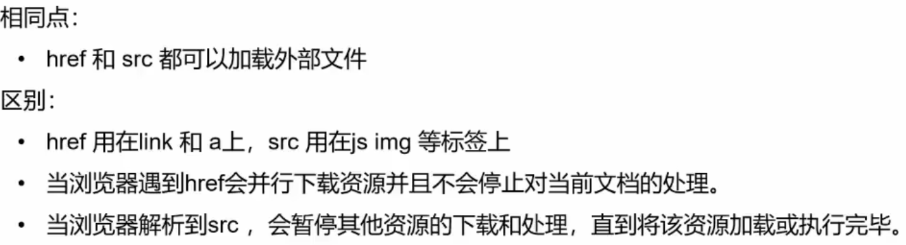

## label 标签的作用是什么

label 标签来定义表单控件的关系：当用户选择 label 标签时，浏览器会自动将焦点转到和 label 标签相关的表单控件上。

## HTML5 为什么只需要写`<! DOCTYPE HTML>`

HTML 4.01 中的 doctype 需要对 DTD 进行引用，因为 HTML 4.01 基于 SGML。而 HTML 5 不基于 SGML，因此不需要对 DTD 进行引用，但是需要 doctype 来规范浏览器的行为

其中，SGML 是标准通用标记语言, 简单的说，就是比 HTML，XML 更老的标准，HTML，XML 这两者都是由 SGML 发展而来的，而 HTML5 不是的

## 浏览器乱码

产生乱码的原因

- 网页源代码是`gbk`的编码，而内容中的中文字是`utf-8`编码的，这样浏览器打开即会出现`html`乱码
- `html`网页编码是`gbk`，而程序从数据库中调出呈现是`utf-8`编码的内容也会造成编码乱码
- 浏览器不能自动检测网页编码，造成网页乱码

解决办法

- 使用软件编辑 HTML 网页内容
- 如果网页设置编码是`gbk`，而数据库储存数据编码格式是`UTF-8`，此时需要程序查询数据库数据显示数据前进程序转码
- 如果浏览器浏览时候出现网页乱码，在浏览器中找到转换编码的菜单进行转换

## html 常见兼容性问题

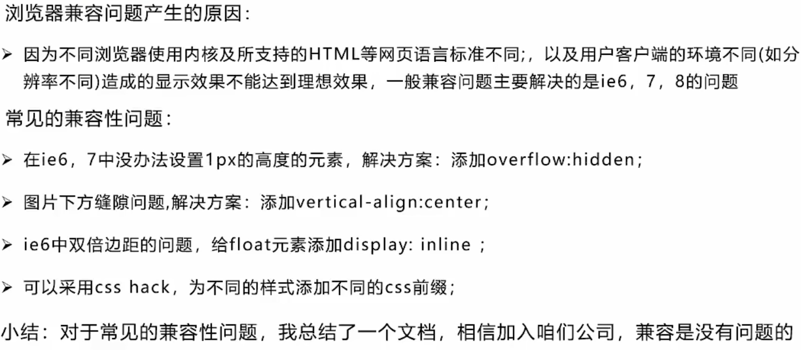

## 音视频标签的使用

**audio** 标签用来向页面中引入一个外部的音视频文件，音视频文件引入时，默认情况下不允许用户自己控制播放停止

```markdown
    controls 是否允许用户自己控制播放
    autoplay 音视频文件是否自动播放
    loop 音视频是否进行循环播放
```

**video**标签来向网页中引入一个视频，使用方法和 audio 基本上是一样的

## 说说你对 WEB 标准以及 W3C 的理解与认识

**web 标准**简单来说可以分为**结构、表现和行为**。其中结构主要是有 HTML 标签组成。或许通俗点说，在页面 body 里面我们写入的标签都是为了页面的结构。表现即指 css 样式表，通过 css 可以是页面的结构标签更具美感。

行为是指页面和用户具有一定的交互，同时页面结构或者表现发生变化，主要是由 js 组成。

web 标准一般是将该三部分独立分开，使其更具有模块化。但一般产生行为时，就会有结构或者表现的变化，也使这三者的界限并不那么清晰。

W3C 对 web 标准提出了规范化的要求，也就是在实际编程中的一些代码规范：

1. 对于结构要求：

   标签字母要小写

   标签要闭合

   标签不允许随意嵌套

1. 对于 css 和 js 来说

   尽量使用外链 css 样式表和 js 脚本

   样式尽量少用行间样式表，使结构与表现分离，标签的 id 和 class 等属性命名要做到见文知义，标签越少，加载越快，用户体验提高，代码维护简单，便于改版


## 为什么最好把 CSS 的 `<link>` 标签放在`<head></head>`之间

把 `<link>` 标签放在 `<head></head>` 之间是规范要求的内容。这种做法可以让页面逐步呈现，提高了用户体验。如果将样式表放在文档底部附近，会使许多浏览器不能逐步呈现页面

一些浏览器会阻止渲染，以避免在页面样式发生变化时，重新绘制页面中的元素。这种做法可以防止呈现给用户空白的页面或没有样式的内容

## 为什么最好把 JS 的 `<script>` 标签放在 `</body>` 之前

脚本在下载和执行期间会阻止 HTML 解析。把 `<script>` 标签放在底部，保证 HTML 首先完成解析，将页面尽早呈现给用户

# CSS

## 布局手段

~~~bash
布局手段
1. 盒子模型（纵向）
2. 浮动（横向）
3. 定位
~~~

## visibility

~~~bash
visibility用来设置一个元素的可见性，可选值：

visible 默认值 元素可见

hidden 元素是隐藏的在页面中不可见，但是依然占据页面的位置
~~~

## overflow

~~~html
<!DOCTYPE html>
<html lang="zh">
  <head>
    <meta charset="UTF-8" />
    <title>overflow</title>
    <style>
      /* 
        当子元素大小超过父元素内容区时，子元素会从父元素中溢出，可以通过overflow处理
        scroll生成双方向滚动条，通过滚动条来查看完整内容
        visible默认值 溢出内容直接在元素以外的位置显示
        hidden隐藏溢出的内容
        auto根据需要生成滚动
      */
      .box1 {
        width: 200px;
        height: 200px;
        overflow: auto;
        background-color: #bfa;
      }
      .box2 {
        width: 100px;
        height: 300px;
        background-color: tomato;
      }
    </style>
  </head>
  <body>
    <div class="box1">
      <div class="box2"></div>
    </div>
  </body>
</html>
~~~

## 选择器

`!important > 内联样式` > `ID选择器` > `类选择器` > `标签选择器 > 通配符 > 继承`

优先级是由 A、B、C、D 四个值来决定的，具体计算规则如下

- A = { 如果存在内联样式则为 1，否则为 0 }
- B = { ID 选择器出现的次数 }
- C = { 类选择器、属性选择器、伪类选择器出现的总次数 }
- D = { 标签选择器、伪元素选择器出现的总次数 }

```css
/*
  A=0   不存在内联样式
  B=0   不存在ID选择器
  C=1   有一个类选择器
  D=3   有三个标签选择器

  最终计算结果：{0,0,1,3}
*/
div ul li .red {
}
```

```css
/*
  A=0   不存在内联样式
  B=1   有一个ID选择器
  C=0   不存在类选择器
  D=0   不存在标签选择器

  最终计算结果：{0,1,0,0}
*/
#mydiv {
}
```

## 通过 CSS 的哪些方式可以实现隐藏页面上的元素

display: none 不占位置

visibility: hidden 占位置

opacity: 0 占位置

transform: scale(0,0)占位置

transform 不会影响布局，改了宽高会

## px em rem

px 绝对单位(一旦设置了，就无法因为适应页面大小而改变)；em 相对单位(相对父盒子的 font-size，如果父盒子没有，往上找)；rem 相对单位(相对 html 根字号)

## 居中

margin: 0 auto 盒子模型的等式：margin-left + 可见框宽度 + margin-right = 包含块的内容区宽度

~~~css
<div class="center">此盒子会居中</div>

.center { 
  height: 500px; 
  width: 500px; 
  background-color: pink; 
  margin: 0 auto;
}
~~~

转成行内块，给父盒子设置 text-align: center

```css
<div class="father">
  <div class="center">此盒子会居中</div>
</div>

.father { 
  text-align: center;
} 
.center { 
  width: 400px; 
  height: 400px; 
  background-color: pink; 
  display: inline-block;
}
```

flex

~~~css
<div class="father">
  <div class="center">我是内容盒子</div>
</div>

.father { 
  display: flex; 
  background-color: skyblue; 
  justify-content: center; 
  align-items: center;
} 
.center { 
  width:400px; 
  height: 400px; 
  background-color: pink;
}
~~~

定位。left + margin-left + 可见框宽度 + margin-right + right = 包含块的内容区宽度

top + margin-top + 可见框高度 + margin-bottom + bottom = 包含块的内容区高度

~~~css
<div class="father">
  <div class="center">我是内容盒子</div>
</div>

.father {
  background-color: skyblue; 
  position: relative; 
  height: 500px;
} 
.center { 
  width: 400px; 
  height: 400px;
  background-color: pink; 
  position: absolute; 
  left: 50%; 
  top: 50%; 
  transform: translate(-50%, -50%);
}
~~~

文字水平垂直居中

~~~css
<!DOCTYPE html>
<html lang="zh">
  <head>
    <meta charset="UTF-8" />
    <title>Title</title>
    <style>
      p {
        height: 50px;
        border: 1px #000 solid;
        /* 文字水平居中 */
        text-align: center;
        /* 将行高设置为和元素高度一样的值即可让元素垂直居中 */
        line-height: 50px;
      }
    </style>
  </head>
  <body>
    <p>今天天气真不错！</p>
  </body>
</html>
~~~

[【更多方式参考】实现水平居中垂直居中](https://www.cnblogs.com/chengxs/p/11231906.html)

## 定位

~~~bash
#position用来设置元素的定位方式，取值
1. static默认值，元素没有开启定位，不脱离文档流，top，right，bottom，left，z-index等属性不生效
2. relative相对定位，不脱离文档流。参照物：元素偏移前位置。相对定位会提升元素的层级
3. fixed固定定位，脱离文档流。参照物：浏览器窗口。固定定位也是一种绝对定位，它的大部分的特点和绝对定位是相同的。不同点在于固定定位总是参照于浏览器的窗口进行定位，一旦定位，不会随窗口进行滚动
4. 当绝对定位和固定定位参照物都是浏览器窗口时的区别： 当出现滚动条时，固定定位的元素不会跟随滚动条滚动，绝对定位会跟随滚动条滚动
5. sticky粘性定位，不脱离文档流。参照物：粘滞定位相对于离它最近的拥有滚动条祖先元素来定位的
~~~

~~~bash
absolute绝对定位，脱离文档流。
参照物：最近的一级带有定位的父级元素（static除外）进行位置移动，如果找不到，那么相对于浏览器窗口进行定位。

参照物权威：绝对定位是参照于它的包含块进行定位的
绝对定位元素的包含块是谁
绝对定位元素的包含块是离它最近的开启了定位的祖先元素
如果所有的祖先都没有开启定位，则它的包含块是初始包含块
初始包含块的大小和视口是相同
~~~

```html
<!DOCTYPE html>
<html lang="en">
  <head>
    <meta charset="UTF-8" />
    <meta http-equiv="X-UA-Compatible" content="IE=edge" />
    <meta name="viewport" content="width=device-width, initial-scale=1.0" />
    <title>Document</title>
    <style>
      body {
        height: 3000px;
      }
      .header {
        position: sticky;
        /* 设置盒子距离浏览器的顶部边缘，多少时开始吸顶 */
        top: 0;
      }
    </style>
  </head>
  <body>
    <div class="header">我是头部</div>
  </body>
</html>
```

## z-index

~~~bash
z-index元素的position属性需要是relative，absolute或是fixed
元素默认的z-index为0，可通过修改z-index来控制设置了postion值的元素的图层位置
z-index的小坑，如果父辈元素有定位，且配置了z-index，优先按照父辈元素的定位的z-index进行比较层级
~~~

## 浮动

~~~bash
浮动flot取值
1. none默认值，元素不浮动
2. left向左浮动
3. right向右浮动

浮动特点
1. 浮动元素不会超过它上边浮动的兄弟元素，最多一边齐
2. 浮动元素不会盖住文字，文字会环绕在浮动元素的周围
3. 设置浮动后，元素会脱离文档流，其后的元素会自动上移
4. 浮动后，之前的布局等式就失效了margin: 0 auto; 不可以用了
5. 如果一行之内无法容纳所有的浮动元素，则后边的元素会自动换到下一行

元素脱离文档流后的特点
块元素
1. 块元素不再独占一行，而是水平排列
行内元素
1. 设置浮动行内元素可以设置宽度和高度
总结：脱离文档流后，就不再需要区分行内和块
~~~

`容器不设高度且子元素浮动时，容器高度不能被内容撑开，此时，内容会溢出到容器外面而影响布局，需要清除浮动`

父元素添加`display:flow-root，开启BFC后，元素可以包含浮动的子元素（清除浮动）`

单伪元素双伪元素清除法：不仅可以解决浮动，还可以解决margin塌陷问题

~~~css
.clearfix::before,
.clearfix::after {
  content: "";
  display: table;
}
.clearfix::after {
  clear: both;
}
~~~

## BFC

[参考文章：深入理解 BFC](https://www.cnblogs.com/xiaohuochai/p/5248536.html)

`BFC块级格式化上下文，是一个独立的渲染区域，渲染区域中的元素布局不受外部影响`，可以将BFC理解为一个隐藏的属性

如何触发 BFC（由于BFC是通过一些样式间接开启的，所以都会有一些副作用）

- flot属性不为none
- position属性为absolute/fixed
- display属性为inline-block/flex/`flow-root副作用最小，可能会有兼容性`
- overfolw属性不为visible

开启BFC解决哪些问题

- `开启BFC后，子元素的垂直外边距不会传递给父元素，解决margin塌陷`

```css
<div class="father">
  <div class="son"></div>
</div>

.father {
  width: 400px;
  height: 400px;
  display: flow-root;
  background-color: red;
}

.son {
  width: 100px;
  height: 100px;
  margin-top: 10px;
  background-color: pink;
}
```

- `开启BFC后，元素不会被浮动元素所覆盖`

~~~css
.box1 {
  float: left;
  width: 200px;
  height: 200px;
  background-color: red;
}

.box2 {
  display: flow-root;
  width: 200px;
  height: 200px;
  background-color: pink;
}

<div class="box1"></div>
<div class="box2"></div>
~~~

## 精灵图

将一个页面涉及到的所有图片都包含到一张大图中去，然后利用 CSS 的 background-image，background-repeat，background-position 属性的组合进行背景定位。

`考察：性能优化的方案`

https://img.alicdn.com/tfs/TB1eiXTXlTH8KJjy0FiXXcRsXXa-24-595.png

优点：利用`CSS Sprites`能很好地减少网页的 http 请求，从而大大提高了页面的性能，这是`CSS Sprites`最大的优点

缺点：

- 任意一张小图的改动，都需要重新生成大图，并且用户端需要重新下载整张大图，这就降低了浏览器缓存的优势
- 随着 HTTP2 的逐渐普及，HTTP2 的多路复用机制可以解决请求多个小图片所创建多个 HTTP 请求的消耗，让 CSS Sprites 存在的价值降低了
- 图片放大会失真

目前其他主流的处理图片的方案：iconfont 字体图标，svg 矢量图...

## 媒体查询

媒体查询是 C3 加入的功能，它可以进行响应式适配。

什么是响应式适配？根据不同的屏幕尺寸，显示不同的效果（设置盒子样式）

```css
/* 在css样式表的定义中直接使用媒体查询 */
/* min-width（从小到大）max-width（从大到小）*/
.container {
  width: 600px;
  height: 200px;
  background-color: pink;
  margin: 0 auto;
}
@media screen and (max-width: 767px) {
  .container {
    width: 100%;
  }
}
@media screen and (min-width: 768px) and (max-width: 991px) {
  .container {
    width: 750px;
  }
}
@media screen and (min-width: 992px) and (max-width: 1199px) {
  .container {
    width: 980px;
  }
}
@media screen and (min-width: 1200px) {
  .container {
    width: 1170px;
  }
}
@media (width: 1200px) {
  .container {
    background-color: skyblue;
  }
}
```

[参考文章：深入理解 CSS 媒体查询](https://www.cnblogs.com/xiaohuochai/p/5848612.html)

## 盒模型

浏览器的渲染引擎在对网页文档进行布局时，会按照 `CSS 基础盒模型 （CSS Basic Box Model）标准`，将文档中的所有元素都表示为一个个矩形的盒子，再用 CSS 去决定这些盒子的大小尺寸、显示位置、以及其他属性（如颜色、背景、边框等）

在 C3 中，我们可以通过设置 box-sizing 的值来决定具体使用何种盒模型

- box-sizing：content-box 标准盒模型
- box-sizing：border-box 怪异盒模型

1. 标准盒模型的 width 和 height 属性范围只包含了 content


2. 怪异盒模型的 width 和 height 属性的范围包含了 border、padding 和 content


[参考文章：深入理解盒模型](https://www.cnblogs.com/xiaohuochai/p/5202597.html)

## 伪类 伪元素

1. 伪类（用来选择元素，伪类和类选择器权重一样）

2. 伪元素（伪元素创建元素，但是不在 DOM 树中，所以无法注册事件，不要通过 js 控制伪元素）

   通过::before、::after可以选中元素开始或结束的位置，从而为其添加内容

   ~~~css
   ::after {
     /* 别忘记了 */
     content: '',
   }
   ~~~

[参考文章：伪类与伪元素](http://www.alloyteam.com/2016/05/summary-of-pseudo-classes-and-pseudo-elements/)

## 谈谈你对 flex 的理解

思考：多个盒子横向排列使用什么属性？可以使用浮动，但是浮动的盒子脱标。


在真实的应用场景中，通常会遇到各种各样不同尺⼨和分辨率的设备，为了能在所有这些设备上正常的布局我们的应用界面，就需要响应式的界⾯设计方式来满⾜这种复杂的布局需求。

flex 弹性盒模型的优势在于开发⼈员只需要声明布局应该具有的⾏为，⽽不需要给出具体的实现⽅式，浏览器负责完成实际布局，当布局涉及到不定宽度，分布对⻬的场景时，就要优先考虑弹性盒布局。

flex 使用方式：父元素添加 display: flex;子元素可以自动的挤压后拉伸。

- 网页中，盒子之间有间距吗？有，在 flex 布局模型中，调节主轴或者侧轴来设置盒子之间的间距

  `justify-content`父元素添加，调节元素在主轴的对齐方式

```
flex-start: 弹性盒子元素将向起始位置对齐
flex-end: 弹性盒子元素将向结束位置对齐
center: 弹性盒子元素将向行中间位置对齐
space-around: 弹性盒子元素会平均地分布在行里
space-between: 第一个贴左边，最后一个贴右边，其他盒子均分，保证每个盒子之间的空隙是相等的
space-evenly: 弹性盒子沿主轴均匀排列,  弹性盒子与容器之间间距相等
```

`align-items`父元素添加，调节元素在侧轴的对齐方式

`align-self`（自己添加）控制某个弹性盒子在侧轴的对齐方式

```txt
flex-start：元素在侧轴的起始位置对齐。
flex-end：元素在侧轴的结束位置对齐。
center：元素在侧轴上居中对齐。
stretch：元素的高度会被拉伸到最大（不给高度时, 才拉伸）。
```

- flex 布局模型中，弹性盒子默认沿着哪个方向排列？水平方向。

  主轴默认是水平方向，侧轴默认是垂直方向

  flex-direction 调整主轴方向

```tex
row：主轴方向为水平向右
column：主轴方向为竖直向下
row-reverse：主轴方向为水平向左
column-reverse：主轴方向是竖直向上
```

- flex-wrap 父元素添加，弹性盒子多行排列效果

  

```txt
nowrap： 不换行（默认），如果宽度溢出，会压缩子盒子的宽度。
wrap： 当宽度不够的时候，会换行。
```

align-content 调整行对齐方式，取值与 justify-context 基本相同

```txt
flex-start：各行向侧轴的起始位置堆叠。
flex-end：各行向弹性盒容器的结束位置堆叠。
center：各行向弹性盒容器的中间位置堆叠。
space-around：各行在侧轴中平均分布。
space-between：第一行贴上边，最后一个行贴下边,其他行在弹性盒容器中平均分布。
stretch：拉伸，不设置高度的情况下。
```

- 使用 flex 属性修改弹性盒子伸缩比。子元素添加 flex:值。取值：整数。只占用父盒子剩余尺寸。

> 可参考 [flex 布局教程](http://www.ruanyifeng.com/blog/2015/07/flex-grammar.html)

## display

| 属性值       | 作用                                                         |
| ------------ | :----------------------------------------------------------- |
| none         | 隐藏元素                                                     |
| block        | 将元素设置为块元素                                           |
| inline       | 将元素设置为行内元素                                         |
| inline-block | 行内块元素，行内块兼具行内元素和块元素的特点：不独占一行，又可以设置宽高。`注意：行内块的特点和文本很像，所以布局时尽量少用，在一行时会有空白间隙` |
| list-item    | 像块类型元素一样显示，并添加样式列表标记                     |
| table        | 此元素会作为块级表格来显示                                   |
| inherit      | 规定应该从父元素继承 display 属性的值                        |

## link 和@import

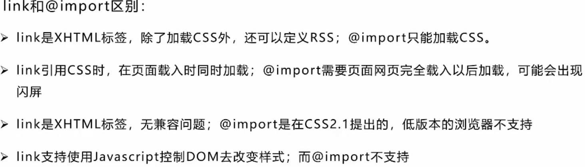

## transition 和 animation 的区别

**transition 是过度属性**，强调过度，它的实现需要触发一个事件（比如鼠标移动上去，焦点，点击等）才执行动画。它类似于 flash 的补间动画，设置一个开始关键帧，一个结束关键帧。

**animation 是动画属性**，它的实现不需要触发事件，设定好时间之后可以自己执行，且可以循环一个动画。它也类似于 flash 的补间动画，但是它可以设置多个关键帧（用@keyframe 定义）完成动画。

## 为什么有时候⽤**translate**来改变位置⽽不是定位

translate 是 transform 属性的⼀个值。改变 transform 或 opacity**不会触发浏览器重排**（reflow）或重绘（repaint），只会触发复合（compositions）。⽽改变**绝对定位会触发重排**，进⽽触发重绘和复合。

transform 使浏览器为元素创建⼀个 GPU 图层，但改变绝对定位会使⽤到 CPU。 因此**translate()更⾼效**，可以缩短平滑动画的绘制时间。 ⽽ translate 改变位置时，元素依然会占据其原始空间，绝对定位就不会发⽣这种情况。

## li 与 li 之间有看不见的空白间隔是什么原因引起的 如何解决

浏览器会把 inline 内联元素间的空白字符（空格、换行、Tab 等）渲染成一个空格。为了美观，通常是一个`<li>`放在一行，这导致`<li>`换行后产生换行字符，它变成一个空格，占用了一个字符的宽度。

解决办法：\*\*

（1）为`<li>`设置 float:left。缺点：有些容器是不能设置浮动，如左右切换的焦点图等。

（2）将所有`<li>`写在同一行。缺点：代码不美观。

（3）将`<ul>`内的字符尺寸直接设为 0，即 font-size:0。缺点：`<ul>`中的其他字符尺寸也被设为 0，需要额外重新设定其他字符尺寸，且在 Safari 浏览器依然会出现空白间隔。

（4）消除`<ul>`的字符间隔 letter-spacing:-8px。缺点：这也设置了`<li>`内的字符间隔，因此需要将`<li>`内的字符间隔设为默认 letter-spacing:normal。

## CSS3 中有哪些新特性

- 新增各种 CSS 选择器 （: not(.input)：所有 class 不是“input”的节点）
- 圆角 （border-radius:8px）
- 多列布局 （multi-column layout）
- 阴影和反射 （Shadoweflect）
- 文字特效 （text-shadow）
- 文字渲染 （Text-decoration）
- 线性渐变 （gradient）
- 旋转 （transform）
- 增加了旋转,缩放,定位,倾斜,动画,多背景

## 图片格式

1. jpg

   支持颜色丰富，不支持透明

   用来显示照片

2. gif

   支持的颜色少，支持简单透明，支持动图

   用来显示颜色单一的图片，或动图

3. png

   支持的颜色，支持透明

   用来显示颜色丰富的图片，支持透明效果

   在网页中使用的比较多

4. webp

   是谷歌专门为浏览器推出的一种格式

   兼具上述格式所有优点，部分浏览器不支持这种格式（越来越少了）

5. base64

   通过base64来对图片进行编码，编码后可以直接在网页引入图片

   通过base64对图片编码后，图片可以和网页一起加载，加快图片的加载速度

   可以使用base64来加载一些对速度要求比较高的图片，但是不要大量使用

6. svg

   是无损的矢量图。SVG 是矢量图意味着 SVG 图片由直线和曲线以及绘制它们的方法组成。当放大 SVG 图片时，看到的还是线和曲线，而不会出现像素点。SVG 图片在放大时，不会失真，所以它适合用来绘制 Logo、Icon 等。

## line-height

line-height 用来设置元素的行高

文字默认是在行高中垂直居中

行间距 = 行高 - 字体大小

行高可以设置一个数字，那么行高将会是字体大小对应的倍数

## CSS 优化和提高性能的方法有哪些

**加载性能：**

（1）css 压缩：将写好的 css 进行打包压缩，可以减小文件体积。

（2）css 单一样式：当需要下边距和左边距的时候，很多时候会选择使用 margin:top 0 bottom 0；但 margin-bottom:bottom;margin-left:left;执行效率会更高。

（3）减少使用@import，建议使用 link，因为后者在页面加载时一起加载，前者是等待页面加载完成之后再进行加载。

**选择器性能：**

（1）关键选择器（key selector）。选择器的最后面的部分为关键选择器（即用来匹配目标元素的部分）。CSS 选择符是从右到左进行匹配的。当使用后代选择器的时候，浏览器会遍历所有子元素来确定是否是指定的元素等等；

（2）如果规则拥有 ID 选择器作为其关键选择器，则不要为规则增加标签。过滤掉无关的规则（这样样式系统就不会浪费时间去匹配它们了）。

（3）避免使用通配规则，如\*{}计算次数惊人，只对需要用到的元素进行选择。

（4）尽量少的去对标签进行选择，而是用 class。

###### 最高不要超过三层

（5）尽量少的去使用后代选择器，降低选择器的权重值。后代选择器的开销是最高的，尽量将选择器的深度降到最低，最高不要超过三层，更多的使用类来关联每一个标签元素。

（6）了解哪些属性是可以通过继承而来的，然后避免对这些属性重复指定规则。

**渲染性能：**

（1）慎重使用高性能属性：浮动、定位。

（2）尽量减少页面重排、重绘。

（3）去除空规则：｛｝。空规则的产生原因一般来说是为了预留样式。去除这些空规则无疑能减少 css 文档体积。

（4）属性值为 0 时，不加单位。

（5）属性值为浮动小数 0.\*\*，可以省略小数点之前的 0。

（6）标准化各种浏览器前缀：带浏览器前缀的在前。标准属性在后。

（7）不使用@import 前缀，它会影响 css 的加载速度。

（8）选择器优化嵌套，尽量避免层级过深。

（9）css 雪碧图，同一页面相近部分的小图标，方便使用，减少页面的请求次数，但是同时图片本身会变大，使用时，优劣考虑清楚，再使用。

（10）正确使用 display 的属性，由于 display 的作用，某些样式组合会无效，徒增样式体积的同时也影响解析性能。

（11）不滥用 web 字体。对于中文网站来说 WebFonts 可能很陌生，国外却很流行。web fonts 通常体积庞大，而且一些浏览器在下载 web fonts 时会阻塞页面渲染损伤性能。

**可维护性、健壮性：**

（1）将具有相同属性的样式抽离出来，整合并通过 class 在页面中进行使用，提高 css 的可维护性。

（2）样式与内容分离：将 css 代码定义到外部 css 中。

## CSS 后处理器

**后处理器，** 如： `postCss`，通常是在完成的样式表中根据`css`规范处理`css`，让其更加有效。目前最常做的是给`css`属性添加浏览器私有前缀，实现跨浏览器兼容性的问题。

## 单行 多行文本溢出隐藏

单行文本溢出

```scss
// 单行文本溢出显示省略号
.ellipsis {
  // 规定段落中的文本不进行换行
  white-space: nowrap;
  // 溢出用省略号显示
  text-overflow: ellipsis;
  // 溢出隐藏
  overflow: hidden;
}
```

多行文本溢出

```scss
/* 两行文本溢出显示省略号 */
.ellipsis-2 {
  word-break: break-all;
  text-overflow: ellipsis; // 溢出用省略号显示
  display: -webkit-box; // 作为弹性伸缩盒子模型显示
  -webkit-box-orient: vertical; // 设置伸缩盒子的子元素排列方式：从上到下垂直排列
  -webkit-line-clamp: 2; // 显示的行数
  overflow: hidden; // 溢出隐藏
}
```

注意：由于上面的三个属性都是 C3 的属性，没有浏览器可以兼容，所以要在前面加一个`-webkit-` 来兼容一部分浏览器

## CSS 预处理器

~~~bash
#less定义变量
@fontColor:pink;
#less使用变量
.box {
	color:@fontColor;
}

#导入其它less文件
@import '文件路径';
@import '01.less';

#控制当前less文件导出css的路径，less文件第一行添加
// out: ./css/common.css
#禁止导出css，less文件第一行添加
// out:false

#less嵌套语法
#&不生成后代选择器，表示当前选择器
.father {
	color: red;
	&:hover {
		color: pink;
	}
}

.father {
	color: red;
}
.father:hover {
	color: pink;
}
#生成后代选择器
.father {
	color: red;
	.son {
		color: pink;
	}
}

.father {
	color: red;
}
.father .son {
	color: pink;
}

#less运算
.box1 {
	width: 100 + 50px;
	height: 100 * 50px
}
.box2 {
	width: (100 / 50px);
}
~~~

## 如何判断元素是否到达可视区域

以图片显示为例

内容达到显示区域的：`img.offsetTop < window.innerHeight + document.body.scrollTop`

## z-index 属性在什么情况下会失效

通常 z-index 的使用是在有两个重叠的标签，在一定的情况下控制其中一个在另一个的上方或者下方出现。z-index 值越大就越是在上层。z-index 元素的 position 属性需要是 relative，absolute 或是 fixed。

z-index 属性在下列情况下会失效：

- 父元素 position 为 relative 时，子元素的 z-index 失效。解决：父元素 position 改为 absolute 或 static；
- 元素没有设置 position 属性为非 static 属性。解决：设置该元素的 position 属性为 relative，absolute 或是 fixed 中的一种；
- 元素在设置 z-index 的同时还设置了 float 浮动。解决：float 去除，改为 display：inline-block；

## 两栏布局

一般两栏布局指的是**左边一栏宽度固定，右边一栏宽度自适应**，两栏布局的具体实现

- 利用浮动，将左边元素宽度设置为 200px，并且设置向左浮动。将右边元素的 margin-left 设置为 200px，宽度设置为 auto（默认为 auto，撑满整个父元素）。

```css
.outer {
  height: 100px;
}
.left {
  float: left;
  width: 200px;
  background: tomato;
}
.right {
  margin-left: 200px;
  width: auto;
  background: gold;
}
```

- 利用 flex 布局，将左边元素设置为固定宽度 200px，将右边的元素设置为 flex:1。

```css
.outer {
  display: flex;
  height: 100px;
}
.left {
  width: 200px;
  background: tomato;
}
.right {
  flex: 1;
  background: gold;
}
```

## 三栏布局

三栏布局一般指的是页面中一共有三栏，**左右两栏宽度固定，中间自适应的布局**，三栏布局的具体实现

- 利用**绝对定位**，左右两栏设置为绝对定位，中间设置对应方向大小的 margin 的值

```css
.outer {
  position: relative;
  height: 100px;
}

.left {
  position: absolute;
  width: 100px;
  height: 100px;
  background: tomato;
}

.right {
  position: absolute;
  top: 0;
  right: 0;
  width: 200px;
  height: 100px;
  background: gold;
}

.center {
  margin-left: 100px;
  margin-right: 200px;
  height: 100px;
  background: lightgreen;
}
```

- 利用 flex 布局，左右两栏设置固定大小，中间一栏设置为 flex:1

```css
.outer {
  display: flex;
  height: 100px;
}

.left {
  width: 100px;
  background: tomato;
}

.right {
  width: 100px;
  background: gold;
}

.center {
  flex: 1;
  background: lightgreen;
}
```

## 响应式设计的概念及基本原理

响应式网站设计`（Responsive Web design`）是一个网站能够兼容多个终端，而不是为每一个终端做一个特定的版本。

关于原理： 基本原理是通过媒体查询`（@media）`查询检测不同的设备屏幕尺寸做处理。 关于兼容： 页面头部必须有 mate 声明的`viewport`。

```ini
<meta name="’viewport’" content="”width=device-width," initial-scale="1." maximum-scale="1,user-scalable=no”"/>
```

## display、float、position 的优先级关系

（1）首先判断 display 属性是否为 none，如果为 none，则 position 和 float 属性的值不影响元素最后的表现。

（2）然后判断 position 的值是否为 absolute 或者 fixed，如果是，则 float 属性失效，并且 display 的值应该被设置为 table 或者 block，具体转换需要看初始转换值。

（3）如果 position 的值不为 absolute 或者 fixed，则判断 float 属性的值是否为 none，如果不是，则 display 的值则按上面的规则转换。注意，如果 position 的值为 relative 并且 float 属性的值存在，则 relative 相对于浮动后的最终位置定位。

（4）如果 float 的值为 none，则判断元素是否为根元素，如果是根元素则 display 属性按照上面的规则转换，如果不是，则保持指定的 display 属性值不变。

总的来说，可以把它看作是一个类似优先级的机制，"position:absolute"和"position:fixed"优先级最高，有它存在的时候，浮动不起作用，'display'的值也需要调整；其次，元素的'float'特性的值不是"none"的时候或者它是根元素的时候，调整'display'的值；最后，非根元素，并且非浮动元素，并且非绝对定位的元素，'display'特性值同设置值。

## 怎么实现一个三角形

宽高设为 0，给边框设置宽度，然后给一个边框设置颜色，其余边框设置透明

```css
div {
  width: 0;
  height: 0;
  border: 100px solid transparent;
  border-bottom-color: red;
}
```


## 实现一个扇形

用 CSS 实现扇形的思路和三角形基本一致，就是多了一个圆角的样式，实现一个 90° 的扇形

```css
div{
    border: 100px solid transparent;
    width: 0;
    heigt: 0;
    border-radius: 100px;
    border-top-color: red;
}
```


## 怎么画一条 0.5px 的线

采用 transform: scale()的方式，该方法用来定义元素的 2D 缩放转换

```css
transform: scale(0.5,0.5);
```

## 移动端有哪些常见的问题，都是怎么解决的

点击事件 300MS 延迟问题 解决方案：下载 fastclick 的包

**H5 页面窗口自动调整到设备宽度，并禁止用户缩放页面**

```ini
<meta name="viewport" content="width=device-width,initial-scale=1.0,minimum-scale=1.0,maximum-scale=1.0,user-scalable=no">
```

**忽略 Android 平台中对邮箱地址的识别**

```ini
<meta name="format-detection" content="email=no">
```

**当网站添加到主屏幕快速启动方式，可隐藏地址栏，仅针对 ios 的 safari**

```xml
<!-- ios7.0版本以后，safari上已看不到效果 -->

<meta name="apple-mobile-web-app-capable" content="yes">
```

## 如何定义使用 css 变量

定义全局变量

```css
:root {
  --borderColor: #ccc;
}
使用：
width:var(--borderColor);
```

定义某元素下的变量

```css
.look{
  --borderColor: #ccc;
}
```

定义媒体查询下的变量

```css
@media screen and (min-width: 1025px) {
    :root {
        --borderColor: #ccc;
　　 }
}
使用：
.has-border-table > tr > td {
  border-right: 1px solid var(--borderColor);
}
```

less 中定义变量

```less
定义：
@bg-color : #d9d9d9;
使用：
.has-border-table > tr > td {
  border-right: 1px solid var(@bg-color);
}
```

sass 中定义变量

```css
定义：
$bg-color : #d9d9d9;
使用：
.has-border-table > tr > td {
  border-right: 1px solid var($bg-color);
}
```

## CSS 怎么解决浏览器兼容问题

CSS3 属性针对不同浏览器内核兼容写法

-webkit针对 webkit 内核

-moz针对火狐内核

-ms针对 IE 内核

-o针对 opera 内核

## margin-top 的百分比相对谁

margin 的百分比是相对于父元素的宽度

## 列举 5 个以上的 H5 input 元素 type 属性值

| 值       | 描述                                                         |
| -------- | ------------------------------------------------------------ |
| text     | 默认。定义单行输入字段，用户可在其中输入文本。默认是 20 个字符 |
| password | 定义密码字段。字段中的字符会被遮蔽                           |
| radio    | 定义单选按钮                                                 |
| checkbox | 定义复选框                                                   |
| submit   | 定义提交按钮。提交按钮向服务器发送数据                       |
| button   | 定义可点击的按钮（大多与 JavaScript 使用来启动脚本）         |
| email    | 定义用于 e-mail 地址的文本字段                               |
| search   | 定义用于搜索的文本字段                                       |
| file     | 定义输入字段和 "浏览..." 按钮，供文件上传                    |
| hidden   | 定义隐藏输入字段                                             |
| image    | 定义图像作为提交按钮                                         |
| url      | 定义用于 URL 的文本字段                                      |
| number   | 定义带有 spinner 控件的数字字段                              |
| color    | 定义拾色器                                                   |
| date     | 定义日期字段（带有 calendar 控件）                           |
| month    | 定义日期字段的月（带有 calendar 控件）                       |
| time     | 定义日期字段的时、分、秒（带有 time 控件）                   |

## Bootstrap 栅格系统的工作原理

1、行（row）必须包含在 .container (固定宽度)或 .container-fluid (100%宽度)中，以便为其赋予合适的排列（aligment）和内补（padding）

2、通过行（row）在水平方向创建一组列（column）

3、自己内容应当放置于列（column）内，并且只有列可以作为行（row）的直接子元素

4、类似.row 和.col-xs-4 这种预定义的类，可以用来快速创建栅格布局。Bootstrap 源码 中定义的 mixin 也可以用来创建语义化布局

5、通过为列设置 padding 属性，从而创建列与列之间的间隔（gutter）。通过为.row 元 素设置负值 margin 从而抵消为.container 元素设置的 padding，也就间接为行（row） 所包含的列（column）抵消掉了 padding

6、栅格系统的列是通过指定 1 到 12 的值来表示其跨越范围。例如三个等宽的列可以使用 三个.col-xs-4 来创建

7、如果一行（row）中包含了的列（column）大于 12，多余的列所在的元素将作为一个 整体另起一行排列

8、栅格类适用于与屏幕宽度大于或等于分界点大小的设备，并且针对小屏幕覆盖栅格类

## 使用 CSS 怎么让 Chrome 支持小于 12px 的文字比如 10px

针对谷歌浏览器内核，加 webkit 前缀，用 transform:scale()这个属性进行缩放

```xml
  <style>
    p span {
      font-size: 12px;
      -webkit-transform: scale(0.83);
      display: block;
    }
  </style>
<body>
  <p>
    <span>使用 CSS 怎么让 Chrome 支持小于 12px 的文字</span>
  </p>
</body>
```

# JS

## 01. 解释下什么是变量声明提升

`变量声明之前即可被访问`，仅存在于 var 声明的变量。

JS 引擎在运行一份代码的时候，会按照下面的步骤进行工作

1. 首先，对代码进行预解析，并获取声明的所有变量

2. 然后，将这些变量的声明语句统一放到代码的最前面

3. 最后，开始一行一行运行代码

我们通过一段代码来解释这个运行过程

```js
console.log(a)

var a = 1

function b() {
  console.log(a)
}

b() // 1
```

上⾯这段代码的实际执⾏顺序为

1. JS 引擎将 `var a = 1` 分解为两个部分：变量声明语句 `var a = undefined` 和变量赋值语句 `a = 1`
2. JS 引擎将 `var a = undefined` 放到代码的最前面，而 `a = 1` 保留在原地

也就是说经过了转换，代码就变成了

```js
var a = undefined

console.log(a) // undefined

a = 1

function b() {
  console.log(a)
}

b() // 1
```

变量的这一转换过程，就被称为变量的声明提升。

而这是不规范，不合理的，我们用的 let/const 就没有这个变量提升的问题。

注意事项：

1. 变量提升是在当前作用域最前面
2. 同时存在函数和 var 时，先提升函数声明
3. 当遇到 return 以下代码不会执行，但是还是会进行预解析
4. let 声明的变量不会挂载到全局 window 上，var 会

```js
function b() {}
console.log(b)
var b = 2
// 以上代码被解析成
function b() {}
var b
console.log(b)
b = 2
```

```js
var foo = 1
function fn() {
  foo = 10
  return
  function foo() {}
}
fn()
console.log(foo)
// 以上代码被解析成
function fn() {
  function foo() {}
  foo = 10
  return
}
var foo
foo = 1
fn()
console.log(foo)
```

## 02. JS 的参数是以什么方式进行传递的

值类型（简单数据类型）： string ，number，boolean，undefined，null

值类型变量的数据直接存放在变量（栈空间）中


引用类型（复杂数据类型）：通过 new 关键字创建的对象（系统对象、自定义对象），如 Object、Array、Date 等

引用类型`变量（栈空间）里存放的是地址`，真正的对象实例存放在堆空间中


`基本数据类型：值传递`

```js
let a = 1

function test(x) {
  x = 10 // 并不会改变实参的值
  console.log(x)
}

test(a) // 10
console.log(a) // 1
```

`复杂类型：传递的是地址! (变量中存的就是地址)`


来看下面的代码：

```js
let a = {
  count: 1,
}

function test(x) {
  x.count = 10
  console.log(x)
}

test(a) // { count: 10 }
console.log(a) // { count: 10 }
```

从运行结果来看，函数内改变了参数对象内的 `count` 后，外部的实参对象 `a` 的内容也跟着改变了，所以传递的是地址。

思考题：

```js
let a = {
  count: 1,
}

function test(x) {
  x = { count: 20 }
  console.log(x)
}

test(a) // { count: 20 }
console.log(a) // { count: 1 }
```

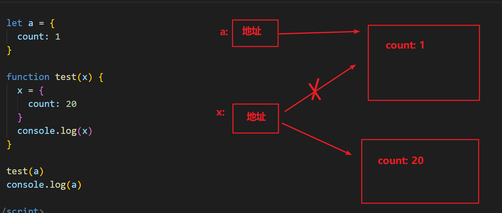

我们会发现外部的实参对象 `a` 并没有因为在函数内对形参的重新赋值而被改变！

因为当我们直接为这个形参变量重新赋值时，其实只是让形参变量指向了别的堆内存地址，而外部实参变量的指向还是不变的。

下图展示的是复杂类型参数传递后的状态：


下图展示的是重新为形参赋值后的状态：

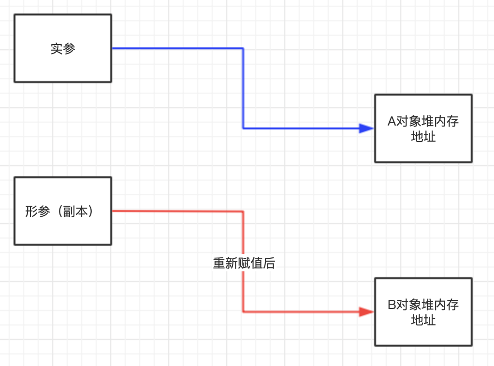

## 03. js 垃圾回收（GC）是怎么做的

JS 中内存的分配和回收都是自动完成的，`内存`在不使用的时候会被垃圾回收器自动回收。

正因为垃圾回收器的存在，许多人认为 JS 不用太关心内存管理的问题，

但如果不了解 JS 的内存管理机制，我们同样非常容易成内存泄漏（内存无法被回收）的情况。

不在用到的内存，没有及时释放，就叫做内存泄漏

### 内存的生命周期

JS 环境中分配的内存, 一般有如下生命周期：

1. 内存分配：当我们声明变量、函数、对象的时候，系统会自动为他们分配内存

2. 内存使用：即读写内存，也就是使用变量、函数等

3. 内存回收：使用完毕，由垃圾回收自动回收不再使用的内存

   全局变量一般不会回收（关闭页面回收），一般局部变量的的值，不用了，会被自动回收掉

内存分配：

```jsx
// 为变量分配内存
let i = 11
let s = "ifcode"

// 为对象分配内存
let person = {
  age: 22,
  name: "ifcode",
}

// 为函数分配内存
function sum(a, b) {
  return a + b
}
```

### 垃圾回收算法说明

所谓垃圾回收，核心思想就是如何判断内存是否已经不再会被使用了，如果是，就视为垃圾，释放掉

下面介绍两种常见的浏览器垃圾回收算法：引用计数 和 标记清除法

### 引用计数

IE 采用的引用计数算法，定义“内存不再使用”的标准很简单，就是看一个对象是否有指向它的引用。如果没有任何变量指向它了，说明该对象已经不再需要了。

```jsx
// 创建一个对象person, person指向一块内存空间, 该内存空间的引用数 +1
let person = {
  age: 22,
  name: "ifcode",
}

let p = person // 两个变量指向一块内存空间, 该内存空间的引用数为 2
person = 1 // 原来的person对象被赋值为1，对象内存空间的引用数-1,
// 但因为p指向原person对象，还剩一个对于对象空间的引用, 所以对象它不会被回收

p = null // 原person对象已经没有引用，会被回收
```

由上面可以看出，引用计数算法是个简单有效的算法。

**但它却存在一个致命的问题：循环引用。**

如果两个对象相互引用，尽管他们已不再使用，垃圾回收器不会进行回收，导致内存泄露。

```jsx
function cycle() {
  let o1 = {}
  let o2 = {}
  o1.a = o2
  o2.a = o1
  return "Cycle reference!"
}

cycle()
```


### 标记清除算法

现代的浏览器已经不再使用引用计数算法了。

现代浏览器通用的大多是基于标记清除算法的某些改进算法，总体思想都是一致的。

标记清除法：

- 标记清除算法将“不再使用的对象”定义为“无法达到的对象”

- 简单来说，就是从根部（在 JS 中就是全局对象）出发定时扫描内存中的对象

- 凡是能从根部到达的对象，都是还需要使用的。那些无法由根部出发触及到的对象被标记为不再使用，稍后进行回收

从这个概念可以看出，无法触及的对象包含了没有引用的对象这个概念（没有任何引用的对象也是无法触及的对象）

根据这个概念，上面的例子可以正确被垃圾回收处理了

参考文章：[JavaScript 内存管理](https://www.jianshu.com/p/84a8fd5fa0ee)

## 04. 谈谈你对 JavaScript 作用域链的理解

作用域（scope）规定了变量能被访问的“范围”，离开了这个“范围”变量便不能被访问。

作用域链本质上是底层变量的查找机制，在函数被执行时，会优先在当前函数作用域中查找变量，如果当前作用域查不到则会依次逐级查找父级作用域知道全局作用域。

JavaScript 在执⾏过程中会创建一个个的**可执⾏上下⽂**。 (每个函数执行都会创建这么一个可执行上下文)

每个可执⾏上下⽂的词法环境中包含了对外部词法环境的引⽤，可通过该引⽤来获取外部词法环境中的变量和声明等。

这些引⽤串联起来，⼀直指向全局的词法环境，形成一个链式结构，被称为作⽤域链。

简而言之：函数内部 可以访问到 函数外部作用域的变量，而外部函数还可以访问到全局作用域的变量，这样的变量作用域访问的链式结构，被称之为作用域链。

```js
let num = 1

function fn() {
  let a = 100
  function inner() {
    console.log(a)
    console.log(num)
  }
  inner()
}
fn()
```

下图为由多个可执行上下文组成的调用栈：

- 栈最底部为`全局可执行上下文`
- `全局可执行上下文` 之上有多个 `函数可执行上下文`
- 每个可执行上下文中包含了指向外部其他可执行上下文的引用，直到 `全局可执行上下文` 时它指向 `null`


js 全局有全局可执行上下文, 每个函数调用时, 有着函数的可执行上下文, 会入 js 调用栈

每个可执行上下文, 都有者对于外部上下文词法作用域的引用, 外部上下文也有着对于再外部的上下文词法作用域的引用

**=> 就形成了作用域链**

## 05. 谈谈你对闭包的理解

这个问题想考察的主要有两个方面：

- 对闭包的基本概念的理解
- 对闭包的作用的了解

**什么是闭包？**

MDN 的官方解释：

> 闭包是函数和声明该函数的词法环境的组合

更通俗一点的解释是：

> 内层函数, 引用外层函数上的变量, 就可以形成闭包

需求: 定义一个计数器方法, 每次执行一次函数, 就调用一次进行计数

```js
let count = 0
function fn() {
  count++
  console.log("fn函数被调用了" + count + "次")
}
fn()
```

这样不好! count 定义成了全局变量, 太容易被别人修改了, 我们可以利用闭包解决

闭包实例:

```jsx
function fn() {
  let count = 0

  function add() {
    count++
    console.log("fn函数被调用了" + count + "次")
  }

  return add
}
const addFn = fn()
addFn()
addFn()
addFn()
```

**闭包的主要作用是什么？**

在实际开发中，闭包最大的作用就是用来 **变量私有**。

下面再来看一个简单示例：

```js
function Person() {
  // 以 let 声明一个局部变量，而不是 this.name
  // this.name = 'zs'     =>  p.name
  let name = "hm_programmer" // 数据私有

  this.getName = function () {
    return name
  }

  this.setName = function (value) {
    name = value
  }
}

// new:
// 1. 创建一个新的对象
// 2. 让构造函数的this指向这个新对象
// 3. 执行构造函数
// 4. 返回实例
const p = new Person()
console.log(p.getName()) // hm_programmer

p.setName("Tom")
console.log(p.getName()) // Tom

p.name // 访问不到 name 变量：undefined
```

在此示例中，变量 `name` 只能通过 Person 的实例方法进行访问，外部不能直接通过实例进行访问，形成了一个私有变量。

## 06. 隐式类型转换

判断时，尽量不要用 `==` , 要用 `===`，两个等号判断，如果类型不同，默认会进行隐式类型转换再比较。


## 07. 谈谈你对原型链的理解

要讲清楚这个问题，主要着重这几个方面

- 什么是原型对象
- 构造函数，原型对象，实例对象的三角关系图
- 原型链如何形成


`原型对象`

js 规定，每一个构造函数都有一个 prototype 属性，指向另一个对象，这个对象称为原型对象。

基于构造函数创建出来的实例，都可以共享访问原型对象的属性。

例如我们的 `hasOwnProperty`, `toString` ⽅法等其实是 Obejct 原型对象的方法，它可以被任何对象当做⾃⼰的⽅法来使⽤。

`hasOwnProperty` 用于判断，某个属性，是不是自己的 (还是原型链上的)

来看一段代码：

```js
let person = {
  name: "Tom",
  age: 18,
  job: "student",
}

console.log(person.hasOwnProperty("name")) // true
console.log(person.hasOwnProperty("hasOwnProperty")) // false
console.log(Object.prototype.hasOwnProperty("hasOwnProperty")) // true
```

可以看到，`hasOwnProperty` 并不是 `person` 对象的属性，但是 `person` 却能调用它。

那么 `person` 对象是如何找到 Object 原型中的 `hasOwnProperty` 的呢？这就要靠原型链的能力了。

需求: 简单绘制原型三角关系图!

**原型链**

在 JavaScript 中，每个对象中都有一个 `__proto__` 属性，这个属性指向了当前对象的构造函数的原型。

对象可以通过自身的 `__proto__`属性与它的构造函数的原型对象连接起来，

而因为它的原型对象也有 `__proto__`，因此这样就串联形成一个链式结构，也就是我们称为的原型链。

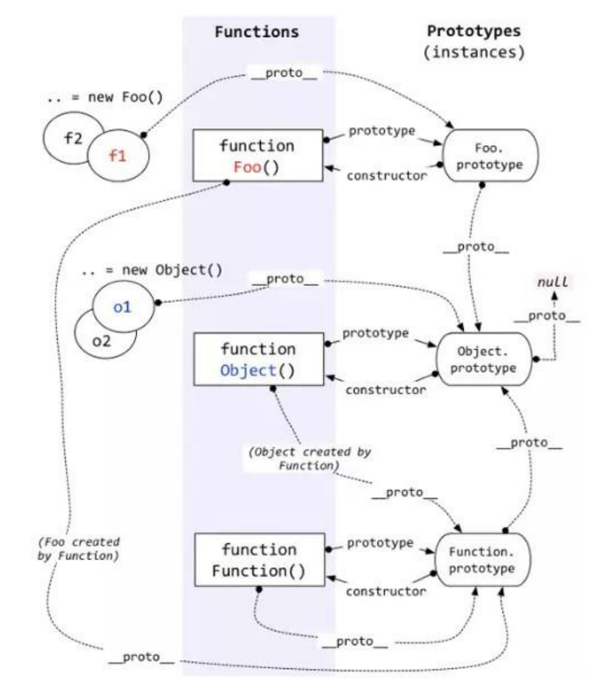

## 08. 谈谈对于继承的理解

**为什么要学习继承 ?**

写的构造函数, 定义了一个类型 (人类), 万一项目非常大, 又有了细化的多个类型 (老师, 工人, 学生)

学习继承, 可以让多个构造函数之间建立关联, 便于管理和复用

**什么是继承 ?**

继承: 从别人那里, 继承东西过来 (财产, 房产)

代码层面的继承: 继承一些属性构造的过程和方法

### 原型继承

原型继承: 通过改造原型链, 利用原型链的语法, 实现继承方法!

分析需求:

人类, 属性: name, age

学生, 属性: name, age, className

工人, 属性: name, age, companyName

无论学生, 还是工人, => 都是人类, 所以人类原型上有的方法, 他们都应该要有

```js
// 1. 定义Person构造函数
function Person(name, age) {
  this.name = name
  this.age = age
}
Person.prototype.say = function () {
  console.log("人类会说话")
}

// 2. 定义Student构造函数
function Student(name, age, className) {
  this.name = name
  this.age = age
  this.className = className
}
// 3. 原型继承: 利用原型链, 继承于父级构造函数, 继承原型上的方法
// 语法: 子构造函数.prototype = new 父构造函数()
Student.prototype = new Person()
Student.prototype.study = function () {
  console.log("学生在学习")
}

let stu = new Student("张三", 18, "80期")
stu.say()
console.log(stu)
```


### 组合继承

组合继承有时候也叫伪经典继承，指的是将原型链 和 借用构造函数 call 技术组合到一块，

从而发挥二者之长的一种继承模式，其背后的思路: **是使用原型链实现对原型属性和方法的继承 (主要是方法)，**

**而通过借用构造函数来实现对实例属性构造的继承**。这样既通过在原型上定义方法实现了函数复用，又能保证每个实例都有它的自己的属性。

```js
// 1. 定义Person构造函数
function Person(name, age) {
  this.name = name
  this.age = age
}
Person.prototype.say = function () {
  console.log("人类会说话")
}

// 2. 定义Student构造函数
function Student(name, age, className) {
  Person.call(this, name, age) // 实现构造属性的继承
  this.className = className
}

// 3. 原型继承: 利用原型链, 继承于父级构造函数, 继承原型上的方法
// 语法: 子构造函数.prototype = new 父构造函数()
Student.prototype = new Person()
Student.prototype.study = function () {
  console.log("学生在学习")
}

let stu = new Student("张三", 18, "80期")
stu.say()
console.log(stu)

// 方法通过 原型继承
// 属性通过 父构造函数的.call(this, name, age)
```

### 寄生组合继承

student 实例上有 name age, 而原型 `__proto__`上不需要再有这些属性, 所以利用 Object.create 改装下

Object.create(参数对象),

1. Object.create 会创建一个新对象,
2. 并且这个新对象的`__proto__` 会指向传入的参数对象

```js
// 1. 定义Person构造函数
function Person(name, age) {
  this.name = name
  this.age = age
}
Person.prototype.say = function () {
  console.log("人类会说话")
}

// 2. 定义Student构造函数
function Student(name, age, className) {
  Person.call(this, name, age)
  this.className = className
}

// 3. 原型继承: 利用原型链, 继承于父级构造函数, 继承原型上的方法
// 语法: 子构造函数.prototype = new 父构造函数()
Student.prototype = Object.create(Person.prototype)
Student.prototype.study = function () {
  console.log("学生在学习")
}

let stu = new Student("张三", 18, "80期")
stu.say()
console.log(stu)

// 总结:
// Object.create() 以参数的对象, 作为新建对象的__proto__属性的值, 返回新建的对象
```


### es6 - class 实现继承 extends

```jsx
// 继承关键字 => extends
class Person {
  constructor(name, age) {
    this.name = name
    this.age = age
  }
  jump() {
    console.log("会跳")
  }
}

class Teacher extends Person {
  constructor(name, age, lesson) {
    super(name, age) // extends 中, 必须调用 super(), 会触发执行父类的构造函数
    this.lesson = lesson
    console.log("构造函数执行了")
  }
  sayHello() {
    console.log("会打招呼")
  }
}

let teacher1 = new Teacher("zs", 18, "体育")
console.log(teacher1)
```

## 09. 如何判断是否是数组

方法一：使用 `toString` 方法

```js
function isArray(arg) {
  return Object.prototype.toString.call(arg) === "[object Array]"
}

let arr = [1, 2, 3]
isArray(arr) // true
```

方法二：使用 ES6 新增的 `Array.isArray` 方法

```js
let arr = [1, 2, 3]
Array.isArray(arr) // true
```

## 10. this

`普通函数`

默认绑定（指向 window 的情况，函数调用模式 fn()）

默认情况下，`this` 会被绑定到全局对象上，比如在浏览器环境中就为`window`对象，在 node.js 环境下为`global`对象。

```js
message = "Hello"

function test() {
  console.log(this.message)
}

test() // "Hello"
```

隐式绑定（谁调用，this 指向谁，方法调用模式 obj.fn()）

如果函数的调用是从对象上发起时，则该函数中的 `this` 会被自动隐式绑定为对象：

```js
function test() {
  console.log(this.message)
}

let obj = {
  message: "hello,world",
  test: test,
}

obj.test() // "hello,world"
```

显式绑定（又叫做硬绑定，上下文调用模式，想让 this 指向谁，this 就指向谁）

```js
function test() {
  console.log(this.message)
}

let obj1 = {
  message: "你好世界123",
}

test.bind(obj1)() // "你好世界123"
```

new 绑定（构造函数模式）

当使用 `new` 调用构造函数时，会创建一个新的对象并将该对象绑定到构造函数的 `this` 上：

```js
function Greeting(message) {
  this.message = message
}

var obj = new Greeting("hello,world")
obj.message // "hello,world"
```

案例 1：

```jsx
let obj = {
  a: {
    fn: function () {
      console.log(this)
    },
    b: 10,
  },
}
obj.a.fn()
let temp = obj.a.fn
temp() // window
```

案例 2：

```js
function Person(theName, theAge) {
  this.name = theName
  this.age = theAge
}
Person.prototype.sayHello = function () {
  // 定义函数
  console.log(this)
}

let per = new Person("小黑", 18)
per.sayHello()
```

`箭头函数`

- 箭头函数属于表达式函数，因此不存在函数提升

- 箭头函数只有一个参数时，可以省略圆括号

- 箭头函数函数体只有一行代码时可以省略花括号，并自动作为返回值被返回

- 加括号的函数体返回对象字面量表达式

  ```js
  const fn = uname => ({ uname: uname }) // 加括号的函数体返回对象字面量表达式
  ```

- 普通函数有 arguments 动态参数，箭头函数没有，但是箭头函数有剩余参数...args

  ```js
  const getSum = (...args) => {
    let sum = 0
    for (let i = 0; i < args.length; i++) {
      sum += args
    }
    return sum
  }

  console.log(getSum(1, 2, 3)) // 6
  ```

- 箭头函数没有自己的 this，箭头函数中的 this 指向自己的作用域链的上一层的 this。它总是指向最近的外层作用域中的 this 所指对象

  ```js
  const user = {
    name: "小明",
    sleep: function () {
      console.log(this) // 指向user
      const fn = () => {
        console.log(this) // 指向user
      }
      fn()
    },
  }
  user.sleep()
  ```

  ```js
  console.log(this) // window
  const sayHi = () => {
    console.log(this) // window
  }
  btn.addEventListener("click", () => {
    console.log(this) // window
  })
  ```

  ```js
  const user = {
    name: "小明",
    walk: () => {
      console.log(this) // window
    },
  }
  user.walk()
  ```

`改变this指向`

call（了解）：返回值就是函数的返回值，因为它就是调用函数

```js
const obj = {
  name: "德华",
}
function fn(x, y) {
  console.log(this) // this指向obj
  console.log(x + y)
}
fn.call(obj, 1, 2)
```

apply（了解）：返回值就是函数的返回值，因为它就是调用函数

```js
function fn(x, y) {
  return x + y
}
let res = fn.apply(null, [1, 2])
```

`bind`：返回由指定的 this 值和初始化参数改造的 原函数拷贝 （新函数）

```js
function sayHi() {
  console.log(this)
}
let user = {
  uname: "德华",
  age: 18,
}
let res = sayHi.bind(user)
res()
```

三者区别：

都可以改变函数内部 this 指向

call 和 apply 会调用函数，并且改变函数内部 this 指向

call 和 apply 传递的参数不一样，call 传递参数 aru1,aru2...。apply 必须传入数组形式[arg]

bind 不会调用函数，可以改变函数内部 this 指向

## 11. promise

为什么 js 是单线程？js 是运行在浏览器的脚本语言，目的是实现页面上的动态交互如果是多个线程，对某个元素进行操作，其中某个线程对该元素做了修改，另外的线程将该元素删除，这样浏览器无法确定到底采用哪个线程。

js 是`单线程执行`的编程语言。也就是说同一时间只能做一件事情。如果前一个任务非常耗时，则后续的任务就不得不一直等待，从而导致`程序假死`的问题。为了防止某个耗时任务导致程序假死，js 把任务分成了两类：

同步任务：在主线程上排队执行的任务

异步任务：异步（耗时）任务由 js 委托给宿主环境执行，当异步任务执行完成后，会通知 js 主线程`执行异步任务的回调函数`

- 异步任务有 setTimeout setInterval ajax fs.readFile 事件处理函数

- `一般异步任务都会用到回调函数`

  ```js
  // 回调函数：把一个函数当作参数传递，将来特定的时机调用
  setTimeout(() => {
    console.log("hello")
  }, 1000)
  ```

  `回调函数有什么问题？`

  回调函数可阅读性差，难以维护，多层回调函数相互嵌套就形成了`回调地狱`

  ```js
  setTimeout(() => {
    console.log("延时 1 秒后输出")
  
    setTimeout(() => {
      console.log("再延时 2秒后输出")
  
      setTimeout(() => {
        console.log("再延时 3秒后输出")
      }, 3000)
    }, 2000)
  }, 1000)
  ```

`promise设计之初就是用来解决回调地狱的`

promise 是个构造函数可以封装一个异步任务。那这个异步任务是执行成功还是执行失败？

```js
const p = new Promise((resolve, reject) => {
  // promise内部一般可以封装一个异步操作
  // resolve,reject是promise内部提供好的两个函数
  // 成功调用reslove,失败调用reject
})
```

`promie支持链式调用，从而解决回调地狱的问题。如果上一个 .then 中返回一个新的 promise 对象，则可以交给下一个 .then 继续处理。`

```js
new Promise((resolve, reject) => {
  setTimeout(() => {
    resolve("延时 1 秒后输出")
  }, 1000)
}).then(res => {
  console.log(res) // 延时 1 秒后输出

  return new Promise((resolve, reject) => {
    setTimeout(() => {
      resolve("再延时 2秒后输出")
    }, 2000)
  }).then(res => {
    console.log(res) // 再延时 2秒后输出

    return new Promise((resolve, reject) => {
      setTimeout(() => {
        resolve("再延时 3秒后输出")
      }, 3000)
    }).then(res => {
      console.log(res) // 再延时 3秒后输出
    })
  })
})
```

这样看起来似乎也并不友好，让我们进行优化下

```js
// 将创建 promise 对象的过程，封装到一个函数中，需要promise对象，调函数即可
function fn(msg, time) {
  return new Promise((resolve, reject) => {
    setTimeout(() => {
      resolve(msg)
    }, time)
  })
}

fn("延时 1 秒后输出", 1000)
  .then(res => {
    console.log(res) // 延时 1 秒后输出

    return fn("再延时 2秒后输出", 2000)
  })
  .then(res => {
    console.log(res) // 再延时 2秒后输出

    return fn("再延时 3秒后输出", 3000)
  })
  .then(res => {
    console.log(res) // 再延时 3秒后输出
  })
```

以上就解决了回调地狱的问题，那么再来看看在 ajax 中如何运用

```js
// promise是一个对象，来表示一个异步任务在执行完毕后，到底是成功还是失败
function ajax(url) {
  return new Promise((resolve, reject) => {
    const xhr = new XMLHttpRequest()
    xhr.open("GET", url)
    xhr.responseType = "json"
    xhr.onload = function () {
      if (this.status === 200) {
        resolve(this.response)
      } else {
        reject(new Error(this.statusText))
      }
    }
  })
}
ajax(url)
```


promise 有三种状态：`一旦promise状态发生变化，状态就会被凝固`


1. pending：默认状态，等待（进行中）
2. fulfilled：成功（已完成），调用了 resolve 函数，promsie 的状态就会被标记为成功
3. rejected：失败（拒绝），调用了 reject 函数，promise 的状态就会被标记为失败


## 12. async/await

async 用来简化 promise 异步操作。在 async/await 出现之前，只能通过链式调用处理异步操作。虽然解决了回调地狱的问题，但是链式调用代码冗余、阅读性差、不易理解。

1. 同步化代码的阅读体验（Promise 虽然摆脱了回调地狱，但 then 链式调⽤的阅读负担还是存在的）
2. 和同步代码更一致的错误处理方式（ async/await 可以⽤成熟的 try/catch 做处理，比 Promise 的错误捕获更简洁直观）
3. 调试时的阅读性，也相对更友好

```js
function fn(msg, time) {
  return new Promise((resolve, reject) => {
    setTimeout(function () {
      resolve(msg)
    }, time)
  })
}

// async用于修饰一个函数，表示一个函数是异步的
// async会⾃动将常规函数转换成Promise，返回值也是⼀个Promise对象
// 如果async函数内没有await，那么async没有意义，全是同步的内容，只有遇到了await开始往下，才是异步的开始

// await后面一般会跟一个promise对象，await会阻塞async函数的执行，直到等到promise成功的结果（只会等待成功的结果）
// 如果失败了会报错，需要使用try/catch捕获

// 在async函数中，第一个await之前的代码会同步执行，await之后的代码会异步执行
console.log("a")
async function demo() {
  console.log("b")

  let res1 = await fn("延时 1 秒后输出", 1000)
  console.log(res1) // 延时 1 秒后输出

  let res2 = await fn("再延时 2秒后输出", 2000)
  console.log(res2) // 再延时 2秒后输出

  let res3 = await fn("再延时 3秒后输出", 3000)
  console.log(res3) // 再延时 3秒后输出

  console.log("c")
}
demo()
console.log("d")
```

## 15. 深拷贝 浅拷贝（只针对引用类型）

开发中，我们经常需要复制一个对象，如果直接用复制会有下面问题：

引用类型，进行复制时，复制的是地址。

```js
const obj = {
  name: "德华",
  age: 18,
}
const obj2 = obj
obj2.name = "德芙"
console.log(obj)
// obj对象里的name也发生了变化
```


浅拷贝：`拷贝对象时，里面的属性值是简单数据类型直接拷贝值。属性值是引用数据类型拷贝的是地址。`

常见方法：

1. 拷贝对象：Object.assign() / 展开运算符{ ...obj }

2. 拷贝数组：Array.prototype.concat() / [ ...arr ]

```jsx
const obj = {
  uname: "德华",
}
const obj2 = { ...obj }
```

```js
const obj = {
  uname: "德华",
  age: 18,
  family: {
    sister: "德芙",
  },
}

const obj2 = {}
Object.assign(obj2, obj)
obj2.family.sister = "丝滑"
```

深拷贝：`拷贝的是对象，不是地址。`

常见方法：

1. 通过递归实现深拷贝（如果一函数在内部可以调用自己，那么这个函数就是递归函数。递归容易发生`栈溢出`，所以必须加退出条件 return）

   ```js
   let num = 1
   function fn() {
     console.log("我要打印6次")
     if (num >= 6) return
     num++
     fn() // 函数内部调用自己
   }
   fn()
   ```

2. lodash / cloneDeep

3. 通过 JSON.stringfy()实现

```jsx
let obj = {
  name: "zs",
  age: 18,
  car: {
    brand: "宝马",
    price: 100,
  },
}

let obj2 = JSON.parse(JSON.stringify(obj))
```

## 16. 事件循环

事件循环（EventLoop）：js 是单线程的，同步任务由 js 主线程按次序执行，遇到异步任务交给浏览器（宿主环境），浏览器帮你监听，如果满足条件（已完成的异步任务对应的回调函数，会被加入到任务队列中等待执行），先在任务队列里排队，等 js 主线程执行完，再把代执行的任务交给主线程。


JavaScript 把异步任务又做了进一步的划分，异步任务又分为两类，分别是：

1. 宏任务：script、ajax、setTimeout、setInterval、文件操作..

2. 微任务：Promise.then、.catch 和 .finallyprocess.nextTick

宏任务和微任务的执行顺序：每一个宏任务执行完之后，都会检查是否存在待执行的微任务，如果有，则执行完所有微任务之后，再继续执行下一个宏任务。


练习题：

```js
// 1 3 5 2 4
console.log(1)

setTimeout(function () {
  console.log(2)
}, 0)

console.log(3)

setTimeout(function () {
  console.log(4)
}, 1000)

console.log(5)
```

```js
let num = 10
setTimeout(function () {
  num = 100
}, 0)
console.log(num) // 10
```

```js
async function fn() {
  console.log("嘿嘿")
  // await右边的表达式会立即执行
  const res = await fn2() // fn2()是同步的内容，await等待fn2()的结果
  console.log(res) // 微任务
}
async function fn2() {
  console.log("gaga")
}
fn()
console.log(222)
// 嘿嘿 gaga 222 undefined
```

```js
// 1 3 4 5 1000 2
console.log(1)

setTimeout(function () {
  console.log(2)
}, 0)

// promise本身是一个同步代码，只有它后面调用的then方法里的回调函数才是微任务
const p = new Promise((resolve, reject) => {
  console.log(3)
  resolve(1000) // 成功后触发then方法
  console.log(4)
})

p.then(data => {
  console.log(data)
})

console.log(5)
```

```js
console.log(1)

setTimeout(function () {
  console.log(2)
  new Promise(function (resolve) {
    console.log(3)
    resolve()
  }).then(function () {
    console.log(4)
  })
})

new Promise(function (resolve) {
  console.log(5)
  resolve()
}).then(function () {
  console.log(6)
})

setTimeout(function () {
  console.log(7)
  new Promise(function (resolve) {
    console.log(8)
    resolve()
  }).then(function () {
    console.log(9)
  })
})

console.log(10)
```

# HTTP

## 01. HTTP 有哪些请求⽅法

## 02. HTTP 请求方法的具体作用（前 5 个）

|  方法   |                                                                                   功能                                                                                   |
| :-----: | :----------------------------------------------------------------------------------------------------------------------------------------------------------------------: |
|   GET   |                                                                             从服务器获取资源                                                                             |
|  POST   |                                                                             向服务器新增数据                                                                             |
|  HEAD   | 请求资源的头部信息，并且这些头部与 HTTP GET ⽅法请求时返回的⼀致。<br />该请求⽅法的⼀个使⽤场景是在下载⼀个⼤⽂件前先获取其⼤⼩再决定是否要下载，以此可以节约带宽资源。 |
|   PUT   |                                                       更新服务器上的数据，侧重于完整更新。例如：更新用户的完整信息                                                       |
| DELETE  |                                                                            删除服务器上的数据                                                                            |
| OPTIONS |                                                ⽤于获取⽬的资源所⽀持的通信选项 (跨域请求前，预检请求，判断目标是否安全)                                                 |
|  TRACE  |                                                    该方法会让服务器原样返回任意客户端请求的信息内容，用于诊断和判断。                                                    |
| CONNECT |             HTTP/1.1 协议中预留给能够将连接改为管道⽅式的代理服务器<br />(把服务器作为跳板，让服务器代替用户去访问其它网页，之后把数据原原本本的返回给用户)              |
|  PATCH  |                                                       更新服务器上的数据，侧重于部分更新。例如：只更新用户的手机号                                                       |

GET/DELETE 参数是在地址栏中传递的

PUT/PATCH/POST 参数是在请求体传递的

## 03. GET 和 POST 区别

数据传输方式：GET 在地址栏中传递。POST 在请求体中传递。

数据安全：GET 相对 POST 不安全，默认 http 是明文传输，可以破解，https 会对内容进行加密。

数据类型：GET 只允许 ASCII 字符。POST ⽆限制（文件、图片...）

功能特性：GET 安全且幂等（安全：只读特性，使⽤这个⽅法不会引起服务器状态变化。幂等：同⼀个请求⽅法执⾏多次和仅执⾏⼀次的效果完全相同）。POST ⾮安全、⾮幂等。

请求长度：浏览器由于对 url 长度的限制，所以会影响 get 请求发送数据时的长度

## 04. HTTP 请求报文

HTTP 请求报⽂的组成：请求⾏、请求头、(空⾏)、请求体。


`请求行`

包含了请求⽅法、URL、HTTP 协议版本，它们之间⽤空格进行分隔。例如：

```bash
GET http://www.abc.com/articles HTTP/1.1
```

`请求头`

注意：不同的数据对应不同的请求类型，axios 默认帮我们做了设置处理

| 属性值                               | 应用场景                                         |
| ------------------------------------ | ------------------------------------------------ |
| application/x -www -form -urlencoded | 表单中不包含文件上传的场景，适用于普通数据的提交 |
| multipart/form -data                 | 表单中包含上传文件的场景                         |
| application/json                     | 上传 json 格式数据                               |

请求头由键值对组成，每⾏⼀对，键值之间⽤英⽂冒号`:`进行分隔。例如：

```
Content-Type: application/json
Host: www.abc.com
User-Agent：产请求的浏览器类型
Accept：客户端可识别的内容类型列表
Host：请求的主机名，允许多个域名同处个IP地址，即虚拟主机
```

`请求体`

请求体中放置 POST、PUT、PATCH 等请求方法所需要携带的数据。

注意：在浏览器中，`GET 请求比较特殊，没有请求体。`在浏览器中，POST、PUT、PATCH、DELETE 请求有请求体。

## 05. HTTP 响应报文

HTTP 响应报⽂的组成：响应⾏、响应头、空⾏、响应体。


`响应行`

响应行由协议版本、状态码、状态码的原因短语 3 个内容组成，中间以空格分隔。例如：

```bash
HTTP/1.1 200 OK
```

`响应头`

响应头由键值对组成，每⾏⼀对，键值之间⽤英⽂冒号`:`进行分隔。例如：

```
Content-Length: 1024
Content-Type: application/json
```

`响应体`

服务器发送过来的数据

## 06. HTTP 响应状态码

`成功（2XX）`

| 状态码 | 原因短语        | 说明                                                                                                                   |
| ------ | --------------- | ---------------------------------------------------------------------------------------------------------------------- |
| `200`  | OK              | `请求成功`。表示从客户端发来的请求在服务器端被正确处理                                                                 |
| `201`  | Created         | 资源在服务器端已成功创建，通常是在 post 请求，或者某些 put 请求之后创建了内容                                          |
| 202    | Accepted        | 请求服务器已接受，但是尚未处理，不保证完成请求<br />适合异步任务或者说需要处理时间比较长的请求，避免 HTTP 连接一直占用 |
| 204    | No content      | 表示请求成功，但响应报⽂不含实体的主体部分                                                                             |
| 206    | Partial Content | 进⾏的是范围请求，表示服务器已经成功处理了部分 GET 请求<br />响应头中会包含获取的内容范围 (常用于分段下载)             |

`重定向（3XX）`

| 状态码 | 原因短语           | 说明                                                                                                                                                         |
| ------ | ------------------ | ------------------------------------------------------------------------------------------------------------------------------------------------------------ |
| 301    | Moved Permanently  | 永久性重定向，表示资源已被分配了新的 URL<br />比如，我们访问 **http**://www.baidu.com 会跳转到 **https**://www.baidu.com                                     |
| 302    | Found              | 临时性重定向，表示资源临时被分配了新的 URL，支持搜索引擎优化<br />首页，个人中心，遇到了需要登录才能操作的内容，重定向到登录页                               |
| 303    | See Other          | 对于 POST 请求，它表示请求已经被处理，客户端可以接着使用 GET 方法去请求 Location 里的 URI                                                                    |
| `304`  | Not Modified       | 资源在客户端被缓存，响应体中不包含任何资源内容！（协商缓存）                                                                                                 |
| 307    | Temporary Redirect | 对于 POST 请求，表示请求还没有被处理，客户端应该向 Location 里的 URI 重新发起 POST 请求。<br />不对请求做额外处理, 正常发送请求, 请求 location 中的 url 地址 |

因为 post 请求，是非幂等的，从 302 中，细化出了 303 和 307

简而言之：

- 301 302 307 都是重定向。比如访问的是http://www.baidu.com会重定向到https://www.baidu.com
- 304 协商缓存

`客户端错误（4XX）`

| 状态码 | 原因短语        | 说明                                                                  |
| ------ | --------------- | --------------------------------------------------------------------- |
| `400`  | Bad Request     | 客户端的请求方式、或请求参数有误导致的请求失败！`400不一定是后台错误` |
| `401`  | UnAuthorized    | 客户端的用户身份认证未通过，导致的此次请求失败！                      |
| 403    | Forbidden       | 表示对请求资源的访问被服务器拒绝                                      |
| `404`  | Not Found       | 客户端请求的资源地址错误（在服务器找不到），导致服务器无法找到资源！  |
| 408    | Request Timeout | 客户端请求超时                                                        |
| 409    | Confict         | 请求的资源可能引起冲突                                                |

`服务端错误（5XX）`

| 状态码 | 原因短语                   | 说明                                                                                                     |
| ------ | -------------------------- | -------------------------------------------------------------------------------------------------------- |
| 500    | Internal Sever Error       | 服务器内部错误，导致的本次请求失败！                                                                     |
| 501    | Not Implemented            | 请求超出服务器能⼒范围，例如服务器不⽀持当前请求所需要的某个功能，<br />或者请求是服务器不⽀持的某个⽅法 |
| 503    | Service Unavailable        | 表明服务器暂时处于超负载或正在停机维护，⽆法处理请求                                                     |
| 505    | Http Version Not Supported | 服务器不⽀持，或者拒绝⽀持在请求中使⽤的 HTTP 版本                                                       |

在状态行中所包含的状态码，叫做“响应状态码”。响应状态码只能表示这次请求的成功与否 (成功或失败)。

在响应体的数据中所包含的状态码，叫做“业务状态码”。业务状态码用来表示这次业务处理的成功与否。


## 07. HTTP1.1 的 keep-alive 是什么作用

HTTP1.0 默认关闭，需要手动开启。HTTP1.1 默认开启。

`作用：客户端到服务器端的连接持续有效(长连接)，当出现对服务器的后继请求时，避免了建立或者重新建立连接。`

使用方法：请求头中添加 Connection: keep-alive

优点：

- 较少的 CPU 和内存的占⽤（因为要打开的连接数变少了，复用了连接）

- 减少了后续请求的延迟（⽆需再进⾏握⼿）

缺点：

- 请求已经都结束了, 但是还一直连接着也不合适，本来可以释放的资源仍旧被占用

  如何解决？服务器设置过期时间或者请求次数，超过这个时间或者次数就断掉连接。

## 08. 为什么需要 HTTPS

`HTTP 协议是明文传输数据，不安全，HTTPS 在传输数据时，会对数据进行加密。`

## 09. HTTPS 是如何对数据进行加密的

目前常见的加密算法可以分成三类：`对称加密算法`，`非对称加密算法` 和 `Hash算法`

1. 对称加密算法: 相同密钥加密解密, 可逆的! 可以用于加密解密传输数据

   想使用对称加密算法, 一定要保证密钥不被泄漏 (且进行密钥的传输约定时, 一定要保证安全)

2. 非对称加密算法: 有两把钥匙, 公钥, 私钥, 可逆的, 可以用于 https 的初步交换密钥

3. Hash 算法: 不可逆的, 根据一段内容, 生成一段唯一标识, 一般用于验证数据是否被修改! (md5)

### 对称加密

`文件加密和解密使用相同的密钥（可逆的，可以用于加密解密传输数据）。`⽐如，两个人事先约定的暗号，就属于对称加密。


优点：简单，加密速度快，效率高，破译困难

缺点：在数据传送前，发送方和接收方必须商定好秘钥，然后双方保存好秘钥。如果一方的秘钥被泄露，那么加密信息也就不安全了。`最不安全的地方，就在于第一开始，互相约定密钥的时候!!! 传递密钥!`

使用场景：本地数据加密、https 通信、网络传输等

常见算法：AES、DES、3DES、DESX、Blowfish、IDEA、RC4、RC5、RC6。全球公开，通过了层层筛选，没有被破解

### ⾮对称加密

`通信的双方使用不同的秘钥进行加密解密，即秘钥对（私钥 + 公钥）`

特征：私钥可以解密公钥加密的内容，公钥可以解密私钥加密的内容


- 优点：非对称加密与对称加密相比其安全性更好

- 缺点：加密和解密花费时间长、速度慢，只适合对少量数据进行加密

使用场景：https 会话前期、CA 数字证书、信息加密、登录认证等

常见算法：RSA、ECC（移动设备用）、Diffie-Hellman、El Gamal、DSA（数字签名用）

### HTTPS 加密解决⽅案

结合了两种加密⽅式：

- 将 `对称加密的密钥(一串约定的字符串)` ⽤非对称加密的公钥, 进⾏加密并发送出去，接收⽅使⽤私钥解密得到 `对称加密密钥`

- 双⽅沟通时使⽤ `对称加密密钥` 进⾏

**可以看到，只有在发送秘钥阶段才使用非对称加密，而后续的通信都使用对称加密，这样解决了性能问题。**

HTTPS 目前所使用的 TLS 或 SSL 协议, 就是目前采用的加密通道的规范协议

它利用对称加密、(公私钥)非对称加密, 以及其密钥交换算法，可完成可信任的信息传输

1. 利用 非对称加密 加密传输 对称加密所约定的密钥 (保证了密钥传输的安全)
2. 后续, 利用对称加密, 有效便捷的进行数据传输!!

### 数字证书

为了安全性, 一般还需要签发数字证书!

客户端 和 服务器端要初步互通消息时, 客户端发送请求可以拿到公开的公钥信息

进而进行非对称加密, 使用公钥, 加密`对称加密密钥`, 传递给服务器, 后续通信都使用对称加密!


**问题是: 初步互通消息时, 如果请求拿到的公钥信息, 就是假的, 或者不安全的! 那么后续的所有操作, 都将是不安全的!**

如何保证公钥的安全性呢?? 说白了, 需要证明公钥是安全可靠的!!! 要证明网站是安全可靠的!!!

所以, 就需要有数字证书(CA 证书), 一般是 CA 机构(互联网的机构, 登记网站和公钥的)颁发的, 证明这个公钥是安全可靠的!

**CA 证书中心会对你网站的公钥, 网站的域名地址, 证书到期时间, 等一些相关信息一起加密签发数字证书, 保证你网站的安全性**


当公司申请了 CA 证书后, 就应该在响应时, 将数字证书一起发送给客户端


而客户端, 接收到消息后, 就可以查看证书 , 权威 CA 机构都可以

1. 如果正在访问的网站 和 证书记载的网址 不一致, 说明不安全, 可能被冒用, 浏览器就会发出警告!!!

2. 如果签发证书的机构, 不权威, 发出警告

   

3. 如果证书过期了, 浏览器也会发出警告

   因为一旦证书过期了, CA 机构, 不会继续实时检测网站的安全有效性!

### 数字签名

但这还是有问题：如果证书被篡改了怎么办?

这时就需要用⼀个技术：**数字签名**。 (根据证书内容, 生成的一个唯一标识)

数字签名就是先⽤ **CA ⾃带的 Hash 算法来计算出证书内容的⼀个摘要**，然后使⽤ CA 私钥进行加密，组成数字签名。

当别⼈把他的证书发过来时，**接收方⽤同样的算法再次⽣成摘要**，⽤ CA 公钥解密后得到 CA 生成的摘要，两者进行对⽐后,

就能确定中间是否被⼈篡改。这样就能最⼤程度的保证通信的安全了。

[博客参考](https://blog.csdn.net/u014044812/article/details/80723009)

---

简要小结:

1. 为什么需要 HTTPS ? 因为 HTTP 是明文传输数据的, 不安全, 而 HTTPS 是会对内容加密的

2. HTTPS 的加密策略是什么 ?

   先用 `非对称加密`, 传递对称加密的密钥 (保证了密钥传输的安全)

   后续 使用`对称加密`, 进行交流 (保证了传输数据安全)

3. 问题: 就算是第一次交流用非对称加密, 公钥也是要在网络中传输的!

   如何证明公钥是可靠的? 如何证明网站是可靠的 ? (CA 机构认证, 网站需要申请 **`数字证书`** )

   请求时, 网站就会将数字证书给到浏览器, 浏览器默认就会检测证书的可靠性!

   (1) 是否是权威机构发布的!

   (2) 看证书中记录的地址 和 当前访问的网站的地址, 是否一致, 只有一致, 才可靠!

   (3) 看证书是否过期

   ...

4. 如何保证证书不被篡改 => **`数字签名`**, 可以根据证书的所有的内容, 生成一个唯一标识!!! (`Hash加密算法`)

   一旦内容如果被修改了, 再次生成唯一标识时, 和之前生成的唯一标识就不一样! 检测是否被修改!

## 10. HTTP/2 和 HTTP1.x 比有什么优势和特点

**HTTP/2 的升级, 对于用户来说, 是跨时代的! 基于 HTTP/2, 用户访问网页的速度会非常快!!! (充分利用带宽)**

HTTP/2: 淘宝, 天猫, 京东等, 已做升级 ....

1. HTTP/2 采⽤`⼆进制格式`来传输数据，⽽⾮ HTTP 1.x 的⽂本格式，⼆进制协议`解析起来更⾼效`
2. HTTP/2 采用一些`头部压缩技术`，减少在请求和响应头中重复携带的数据，`降低网络负担`
3. HTTP/2 采⽤`服务器推送`方式，主动向客户端推送资源，提高页面加载效率
4. **HTTP/2 采⽤`多路复用机制`，减少需要创建的连接数量，降低资源占用和性能消耗**

下面是一些与之关联的技术知识。

**⼆进制格式分帧**

帧：HTTP/2 数据通信的最⼩单位消息，是指 HTTP/2 中逻辑上的 HTTP 消息（例如请求、响应等）。消息由⼀个或多个帧组成

流：存在于连接中的⼀个虚拟通道，它可以承载双向消息，且每个流都有唯⼀的整数 ID

**头部压缩**

在 HTTP1.x 中，请求和响应中会重复携带一些不常改变、冗⻓的头数据，给⽹络带来额外负担。

在 HTTP/2 中，客户端和服务端使⽤ **“⾸部表”** 来跟踪和存储之前发送过的键值对，

相同的数据不再随着每次请求和响应发送。⾸部表在连接存续期间始终存在，由客户端和服务器共同渐进更新。

每个新的⾸部键值对，要么被追加到当前表的末尾，要么替换表中已存在的键值对。

> 可以简单的理解为：只发送差异数据，⽽不是全部发送，从⽽减少头部的信息量

下图为首部表的更新示意图：


**服务器推送**

服务端可以在发送⻚⾯ HTML 内容时，再主动推送一些其它资源，⽽不⽤等到浏览器解析到相应的位置时发起请求后再作响应。

例如，服务端可以主动把 JS 和 CSS ⽂件推送给客户端，⽽不需要客户端解析 HTML 时再发送这些请求。

不过，服务端的主动推送行为，客户端有权利选择是否要接收。

如果服务端推送的资源已经被浏览器缓存过，浏览器可以通过发送 RST_STREAM 帧来拒收。

**多路复用**

在 HTTP 1.x 中如果想并发多个请求的话，必须使⽤多个 TCP 链接，但浏览器为了控制资源，

会对单个域名有 6-8 个 TCP 链接的数量限制。而在 HTTP/2 中：

- 同域名下的所有通信，都在单个连接上完成
- 单个连接可以承载任意数量的双向数据流
- 数据流以消息的形式发送，⽽消息⼜由⼀个或多个帧组成（多个帧可以乱序发送，因为可以根据帧⾸部的流标识来重新组装）


[参考文章：HTTP/2 特性及其在实际应用中的表现](https://zhuanlan.zhihu.com/p/30166894)

**小结:**

**HTTP1.X 同一时间, 只能并发建立 6-8 个 TCP 连接, 一个连接同时只能一个请求 (虽然可以 keep-alive 复用, 但也得一个个来)**

**(建立连接的成本比较高, 不让一次性建立太多连接)**

**而新版本 HTTP/2 建立一次连接, 就可以并发很多个请求!**

所以 HTTP/2 的升级, 大大提升了页面加载的效率!

## 11. http 缓存控制

### 基本认知

缓存包括：数据库缓存、服务器端缓存（代理服务器缓存、CDN 服务器缓存）、浏览器缓存

<span style="color:red">数据库缓存：前端发请求给后台，后台执行 sq 语句查询数据库，查询是需要时间的，所以后台会有数据库缓存，下次前台发送相同请求，直接从缓存中读取。</span>

浏览器缓存也包含很多内容： HTTP 缓存、本地缓存（indexDB、cookie、localstorage 等）

HTTP 缓存（强缓存，协商缓存）： (优化页面加载的效率，如果没有缓存策略，每次重新加载页面，会非常慢)

在具体了解 HTTP 缓存之前先来明确几个术语：

- 缓存命中率：从缓存中得到数据的请求数与所有请求数的比率。理想状态是越高越好。(所有的请求中，有多少从缓存中读的)

- 过期内容：超过设置的有效时间，被标记为“陈旧”的内容

- 验证：验证缓存中的过期内容是否仍然有效，验证通过的话刷新过期时间

- 失效：失效就是把内容从缓存中移除

**浏览器缓存主要是 HTTP 协议定义的缓存机制。**

浏览器缓存分为`强缓存 `和 `协商缓存`，浏览器加载一个页面的简单流程如下：

1. 浏览器先根据这个资源的 **http 头信息** 来 **判断是否命中强缓存**。

   如果命中则直接加载在缓存中的资源，并不会将请求发送到服务器。（强缓存）

2. 如果未命中强缓存，则浏览器会将资源加载请求发送到服务器。

   服务器来判断浏览器本地缓存是否失效。

   若可以使用，则服务器并不会返回资源信息，浏览器继续从缓存加载资源。（协商缓存）

3. 如果未命中协商缓存，则服务器会将完整的资源返回给浏览器，浏览器加载新资源，并更新缓存。（新的请求）

### 强缓存 (验证缓存是否过期)

<span style="color:red">前端发请求到后台，后台响应数据给前端，在数据中有保质期（在保质期之内都可以使用这个数据）</span>

<span style="color:red">判断缓存是否有效，就是判断资源是否过期，如果未过期，直接用缓存。命中强缓存时，浏览器并不会将请求发送给服务器。</span>

在 Chrome 的开发者工具中看到 http 的返回码是 200，但是在 Size 列会显示为(from cache)。


<span style="color:red">强缓存是利用 http 的返回的响应头中的 Expires 或者 Cache-Control (优先级更高) 两个字段来控制的，用来表示资源的缓存时间。</span>

Expires：指定一个具体时间(2020 年 12 月 12 日 17:00)，到了这个时间了，缓存过期了，在时间内，都是有效的，可以直接读

Cache-Control：指定一个过期时间 (3600s)，这个资源你加载到后，可以用 3600s

1. <span style="color:red">Expires（给的是服务器的时间）</span>

缓存过期时间，用来指定资源到期的时间，是服务器端的具体的时间点。也就是说，Expires=max-age + 请求时间，需要和 Last-modified 结合使用。但在上面我们提到过，cache-control 的优先级更高。

Expires 是服务器响应消息头字段，在响应 http 请求时告诉浏览器在过期时间前浏览器可以直接从浏览器缓存取数据，而无需再次请求。

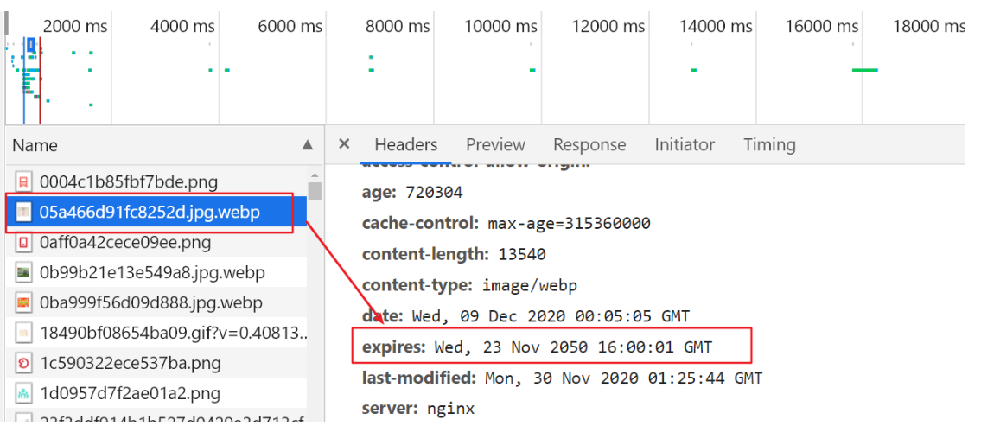

该字段会返回一个时间，比如 Expires: Wed, 23 Nov 2050 16:00:01 GMT 。这个时间代表着这个资源的失效时间，也就是说在 xx 年 xx 月 xx 日时间之前都是有效的，即命中缓存。

这种方式有一个明显的缺点，由于失效时间是一个`绝对时间`，所以当 **服务器与客户端时间偏差很大** 以后，就会导致缓存混乱。于是发展出了 Cache-Control。

2. Cache-Control

Cache-Control 是一个`相对时间`，例如 Cache-Control:max-age 3600，代表着资源的有效期是 3600 秒。

由于是相对时间，并且都是与客户端时间比较，所以服务器与客户端时间偏差也不会导致问题。

Cache-Control 与 Expires 可以在服务端配置同时启用或者启用任意一个，同时启用的时候 Cache-Control 优先级高。

Cache-Control 可以由多个字段组合而成，主要有以下几个取值：（以下几个术语不重要，了解即可）

- max-age 指定一个时间长度，在这个时间段内缓存是有效的，单位是 s。

例如设置 Cache-Control:max-age=31536000，也就是说缓存有效期为（31536000 / 24 / 60 / 60）天，

第一次访问这个资源的时候，服务器端也返回了 Expires 字段，并且过期时间是一年后。


在没有禁用缓存并且没有超过有效时间的情况下，再次访问这个资源就命中了缓存，不会向服务器请求资源而是直接从浏览器缓存中取。

- no-cache 强制所有缓存了该响应的用户，在使用已缓存的数据前，发送带验证的请求到服务器, 问服务器是否可以读缓存。

  不是字面意思上的不缓存。

- no-store 禁止缓存，每次请求都要向服务器重新获取数据。

<span style="color:red">注意：如果命中强缓存，在有效期内，使用了本地浏览器的缓存，请求该资源是不会向服务器发送请求的! (大大减轻了服务器压力)</span>

### 协商缓存 (强缓存未命中(过期) 发送请求进行协商)

看看过期时间，食品没过期，直接吃 (直接读缓存，不发请求) 命中强缓存!

食品过期时间过了，能不能吃呢？问问专家(服务器)，专家瞅了一眼，还能吃，不会死人，重新标了个过期时间(有科学依据)。

(响应 304，不返回内容) ，可以用 (协商缓存) 。

如果问过专家(服务器)，专家瞅了一眼，呀真不能用了，原来的不要了，我重新给你发一个 (响应 200，并返回内容)。

若未命中强缓存(强缓存过期了)，则浏览器会将请求发送至服务器。

服务器根据 http 头信息中的`Last-Modify/If-Modify-Since`或`Etag/If-None-Match`来判断是否命中协商缓存。

如果命中，则 http 返回码为 304 (你本地之前加载的资源是有效的)，浏览器从缓存中加载资源。

1. Last-Modify/If-Modify-Since

浏览器第一次请求一个资源的时候，服务器返回的 header 中会加上 Last-Modify

Last-modify 是一个时间标识该资源的**最后修改时间**


当浏览器再次请求该资源时(进行协商请求时)，发送的请求头中会包含 If-Modify-Since，**该值为缓存之前返回的 Last-Modify**。

服务器收到 If-Modify-Since 后，根据实际服务器的资源的最后修改时间, 进行判断是否命中缓存。


如果命中缓存，则返回 **http304**，并且不会返回资源内容，并且不会返回 Last-Modify。


由于对比的是**服务端的修改时间**，所以就算客户端与服务端时间差距, 也不会有问题。

**但是有时候通过最后修改时间来判断资源是否修改还是不太准确（资源变化了最后修改时间也可以一致）。**

比如：最后修改只能精确到秒级，一秒进行了多次修改，就不行了，**于是出现了 ETag/If-None-Match**

- ETag/If-None-Match

与 Last-Modify/If-Modify-Since (最后修改时间)不同的是，Etag/If-None-Match 返回的是一个校验码（ETag: entity tag）

ETag 可以保证每一个资源是唯一的，资源变化都会导致 ETag 变化。

ETag 值的变更则说明资源状态已经被修改。

服务器根据浏览器上发送的 If-None-Match 值来判断是否命中缓存。


ETag 生成靠以下几种因子

1. 文件的 i-node 编号，是 Linux/Unix 用来识别文件的编号。

2. 文件最后修改时间

3. 文件大小

   ...

**生成 Etag 的时候，可以使用其中一种或几种因子，使用抗碰撞散列函数来生成。生成一个标记文件的唯一值。**

- 既生 Last-Modified 何生 Etag

你可能会觉得使用 Last-Modified 已经足以让浏览器知道本地的缓存副本是否足够新，为什么还需要 Etag（实体标识）呢

Etag 的出现主要是为了解决几个 Last-Modified 比较难解决的问题：

1. Last-Modified 标注的最后修改只能精确到秒级

   如果某些文件在 1 秒钟以内，被修改多次的话，它将不能准确标注文件的修改时间

2. 有可能存在服务器没有准确获取文件修改时间，或者与代理服务器时间不一致等情形

Etag 是服务器自动生成或者由开发者生成的对应资源在服务器端的唯一标识符，能够更加**准确的控制缓存。** 不会仅仅只根据最后的修改时间判断是否进行使用缓存。Last-Modified 与 ETag 是可以一起使用的，服务器会优先验证 ETag，一致的情况下，才会继续比对 Last-Modified，最后才决定是否返回 304。

小结：

- 强缓存：检查过期时间，判断缓存是否失效，如果不失效，直接用，不发请求

  大大的减少了服务器的请求次数，在过期时间内，直接从客户端内存中读

- 协商缓存：强缓存命中失效了，超过过期时间了，拿着标识(最后的修改时间，唯一标识 etag)，去问服务器，是否真的过期了

  如果验证通过，服务器会直接响应 304，且不会返回资源

不太会变的资源 => 图片，非常的适合应用强缓存 (过期时间也可以设置的很长)

如果是一些很可能会变的资源，也希望能缓存 => 过期时间设置短一些，一旦过期，协商缓存

实际工作两者相互配合

### 整体请求缓存流程

浏览器第一次请求


浏览器第二次请求


<span style="color:red">简要小结：</span>

1. 为什么需要 HTTPS？

   因为 HTTP 协议是明文传输数据的，不安全。利用 HTTPS 协议可以更安全，在 HTTP 基础上进行数据加密。

2. HTTPS 是如何保证安全的？

   - 底层是对称加密和非对称加密的配合，实现加密数据传输
   - 使用非对称加密，加密对称加密的密钥，进行密钥的交换
   - 后续使用对称加密进行数据传输

3. 如何保证你访问的网站是安全的？或者说第一次请求某个网站拿到的公钥是安全的？（第一次进行非对称加密，后台后公开公钥，怎么证明第一次拿到的公钥是安全的）

   CA 证书 => 数字证书，由权威机构，申请统一发布的。

   证书中，就会包含公钥，网站信息，网站用途（比如我的网站是电商网站），证书过期时间...

   在浏览器第一次请求某个网站时，就会将证书响应，浏览器会自动存证书，并做证书校验

   证书校验：

   - 看证书是否过期
   - 看证书的网址和正在访问的网址是否匹配
   - 看发布证书的机构，是否权威
   - ...

4. 万一证书被篡改了怎么办？数字签名出来了

   会根据证书生成时的内容，生成一个唯一标识

   后续拿到证书时，只需要用相同的 hash 算法（不可逆的），生成一个唯一标识

   如果校验唯一标识，一致的，说明没有改过

5. 谈谈你对缓存的理解？

   前端需要关注的是，HTTP 缓存（强缓存，协商缓存相互配合实现缓存处理）

   - 强缓存：对缓存的资源，根据过期时间判断，如果未过期，直接用（不发请求），只有过期了，才会发请求。

   - 协商缓存：当强缓存未命中（资源过期了），会发请求（带上最后修改时间或者文件唯一标识 Etage），问后台，这个资源是否还能用。后台对比最后修改时间或者对比唯一标识，如果发现一致，这个资源还能用（不会返回资源）304。如果不一致，资源变化了，返回新资源 200。

# TCP

## 01. TCP 协议是什么

`TCP 是 HTTP 协议的一个底层协议，属于传输层的协议。它能使两台主机能够建立连接并交换数据。`

## 02. 一次完整的 HTTP 服务过程是什么

当我们在 web 浏览器的地址栏中输入：`www.baidu.com`，具体发生了什么

1. 对`www.baidu.com`这个网址（域名）进行 DNS 解析
2. 根据这个 IP，找到对应的服务器，然后发起 TCP 的三次握手
3. 建立 TCP 连接后，发起 HTTP 请求
4. 服务器响应 HTTP 请求，浏览器得到 html 代码
5. 浏览器解析 html 代码，并请求 html 代码中的资源（如 js、css、图片等）（先得到 html 代码，才能去找这些资源）
6. 浏览器将页面渲染呈现给用户
7. 服务过程完毕，关闭 TCP 连接，四次挥手

## 03. 什么是 DNS 解析

DNS（域名）解析：`将域名转换成 ip 地址（ip：计算机在网络中的唯一标识）`

DNS 是怎么找到域名的？假定请求的是 www.baidu.com

- 首先会搜索浏览器自身的 DNS 缓存（缓存时间比较短，大概只有 1 分钟，且只能容纳 1000 条缓存）

- 如果浏览器自身的缓存里面没有找到，那么浏览器会搜索系统自身的 DNS 缓存

- 如果还没有找到，那么尝试从 hosts 文件里面去找 (一个系统电脑的文件，可以编辑，可以存域名和 ip 的对应关系)

- 在前面三个过程都没获取到的情况下，就递归地去域名服务器去查找(就近查找)，域名和 IP 是映射关系，具体登记在哪里，看是如何申请的。具体过程如下：


DNS 优化两个方面：DNS 缓存、DNS 负载均衡 (准备多台 dns 服务器，进行 dns 解析)

## 04. TCP 三次握手

`连接的发起 + 双方的确认`


假设第一次发送的请求，因为网络延迟很慢才到达服务端，服务端看到后做出响应，但是浏览器已经关闭了连接，这个响应浏览器不会收到，但是服务器以为对方收到了，就会一直等待，这样服务器的性能就被浪费了。三次握手，就不会发生。

## 05. TCP 四次挥手

客气挽留，不能直接一次性断开连接，万一还有什么数据没有传完，造成数据的丢失!


A 发起断开连接的消息（浏览器和服务器都可以发起），B 会收到断开的需求，但是会要求等一等，确认数据是否传输完毕。B 确认完后，会告知 A，连接可以断开了。A 收到确认，告知 B，我要走了。B 还会在等一等，以防 A 还有事情。

# DOM

## 01. DOM 的事件流是什么

事件流⼜称为事件传播，是⻚⾯中接收事件的顺序。DOM2 级事件规定的事件流包括了 3 个阶段：

- 事件捕获阶段（capture phase）
- 处于⽬标阶段（target phase）
- 事件冒泡阶段（bubbling phase）

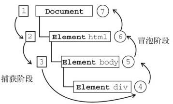

如上图所示，事件流的触发顺序是：

1. 事件捕获阶段，为截获事件提供了机会
2. 实际的⽬标元素接收到事件
3. 事件冒泡阶段，可在这个阶段对事件做出响应

- 事件冒泡

事件开始由最具体的元素（⽂档中嵌套层次最深的那个节点）接收到后，开始逐级向上传播到较为不具体的节点。

```html
<html>
  <head>
    <title>Document</title>
  </head>

  <body>
    <button>按钮</button>
  </body>
</html>
```

如果点击了上面页面代码中的 `<button>` 按钮，那么该 `click` 点击事件会沿着 DOM 树向上逐级传播，在途经的每个节点上都会发生，具体顺序如下：

1. button 元素
2. body 元素
3. html 元素
4. document 对象

- 事件捕获（Event Capturing）

事件开始由较为不具体的节点接收后，然后开始逐级向下传播到最具体的元素上。

事件捕获的最大作用在于：事件在到达预定⽬标之前就可以捕获到它。

如果仍以上面那段 HTML 代码为例，当点击按钮后，在事件捕获的过程中，document 对象会首先接收到这个 `click` 事件，然后再沿着 DOM 树依次向下，直到 `<button>`。具体顺序如下：

1. document 对象
2. html 元素
3. body 元素
4. button 元素

## 02. 说说什么是事件委托

事件委托，就是利用了事件冒泡的机制，在较上层位置的元素上添加一个事件监听函数，来管理该元素及其所有子孙元素上的某一类的所有事件。

```html
<ul id="list">
  <li>111</li>
  <li>222</li>
  <li>333</li>
  <li>444</li>
  <li>555</li>
</ul>

<script type="text/javascript">
  // ⽗元素
  var list = document.getElementById("list")

  // 为⽗元素绑定事件，委托管理它的所有⼦元素li的点击事件
  list.onclick = function (event) {
    var currentTarget = event.target // 触发事件的事件源
    // 为什么这样写？因为ul里可能不止嵌套li，虽然不合法。
    if (currentTarget.tagName.toLowerCase() === "li") {
      alert(currentTarget.innerText)
    }
  }
</script>
```

> 适用场景：在绑定大量事件的时候，可以选择事件委托

- 事件委托可以减少事件注册数量，节省内存占⽤！
- 当新增⼦元素时，⽆需再次做事件绑定，因此非常适合动态添加元素 (vue 解析模板时，会对新创建的元素，额外进行绑定的)

# 浏览器底层原理

## 01. 浏览器是如何解析 CSS 选择器的

<span style="color:red">浏览器解析选择器，是从右往左的解析的，从左往右还是从右往左，最终选中效果是一样的，区别在于性能！</span>

<span style="color:red">从左往右，找后代，其实是在进行所有后代子树的遍历，成本非常高</span>

<span style="color:red">从右往左，找祖辈，一共一个元素，就没有几个祖辈，效率很高</span>

在生成渲染树的过程中，渲染引擎会根据选择器提供的信息来遍历 DOM 树，找到对应的 DOM 节点后将样式规则附加到上面。

来看一段样式选择器代码、以及一段要应用样式的 HTML：

```css
.mod-nav h3 span {
  font-size: 16px;
}
```

```html
<div class="mod-nav">
  <header>
    <h3>
      <span>标题</span>
    </h3>
  </header>

  <div>
    <ul>
      <li><a href="#">项目一</a></li>
      <li><a href="#">项目一</a></li>
      <li><a href="#">项目一</a></li>
    </ul>
  </div>
</div>
```

为了更直观的观查，我们先将这棵 DOM 树先绘制成图


然后我们来对比一下两种顺序的匹配

- 从左往右

1. 遍历所有的元素，找有 .mod-nav 类的节点

2. 从 `.mod-nav` 开始遍历所有的⼦孙节点 `header`、`div` 、 `h3`、 `ul` ....

   遍历所有的后代元素后，知道了，整个子孙后代只有一个 h3

3. 找到 `h3` ，还要继续重新遍历 `h3` 的所有子孙节点，去找 `span`

**问题：会进行大量树形结构子孙节点的遍历，这是非常消耗成本的!**

**这在真实页面中⼀棵 DOM 树的节点成百上千的情况下，这种遍历方式的效率会非常的低，根本不适合采用。**

- 从右往左

1. 先找到所有的 `span` 节点，然后基于每⼀个 `span` 再向上查找 `h3`

2. 由 `h3` 再向上查找 `.mod-nav` 的节点

3. 最后触及根元素 `html` 结束该分⽀遍历

从右向左的匹配规则，只有第一次会遍历所有元素找节点，而剩下的就是在看父辈祖辈是否满足选择器的条件，匹配效率大大提升!

因此，浏览器遵循 “从右往左” 的规则来解析 CSS 选择器！

## 02. 浏览器是如何进行界面渲染的

<span style="color:red">解析 HTML 结构，生成 DOM 树；同时会解析 CSS 样式，生成样式规则；将 DOM 树和样式规则 rules 相结合，生成渲染树 render；基于渲染树进行布局（重排）；进行绘制（重绘）</span>

不同的渲染引擎的具体做法稍有差异，但是大体流程都是差不多的，下面以 chrome 渲染引擎的渲染流程来说明


上图展示的流程是：

1. 获取 HTML ⽂件并进⾏解析，生成一棵 DOM 树（DOM Tree）

2. 解析 HTML 的同时也会解析 CSS，⽣成样式规则（Style Rules）

3. 根据 DOM 树和样式规则，生成一棵渲染树（Render Tree）

4. 进行布局（Layout）(重排)，即为每个节点分配⼀个在屏幕上应显示的确切坐标位置

5. 进⾏绘制（Paint）(重绘)，遍历渲染树节点，调⽤ GPU(图形处理器) 将元素呈现出来

## 03. 重绘(repaint)和重排(回流 reflow)是什么

- 重排（对布局重新计算排布，更新布局）

  何时会触发重排？布局发生改变

  重排是指部分或整个渲染树需要重新分析，并且节点的尺⼨需要重新计算。

  表现为 <span style="color:red">重新⽣成布局，重新排列元素</span>

- 重绘（对界面，重新渲染绘制）

  何时会触发重绘？改变了不影响布局的样式，触发重绘；布局更新后，触发重绘。

- 两者的关系

  <span style="color:red">重绘不⼀定会出现重排，重排必定会触发重绘。</span>

  每个页面至少需要一次回流+重绘。(初始化渲染)

  重排和重绘的代价都很⾼昂，频繁重排重绘，会破坏⽤户体验、让界面显示变迟缓。

  我们需要尽可能避免频繁触发重排和重绘，尤其是重排

## 04. 何时会触发重排

1、添加或者删除可见的 DOM 元素

2、元素位置改变

3、元素尺寸改变——边距、填充、边框、宽度和高度

4、内容改变——比如文本改变或者图片大小改变而引起的计算值宽度和高度改变

5、页面渲染初始化

6、浏览器窗口尺寸改变——resize 事件发生时

## 05. 浏览器对重绘重排的优化

思考下述代码的重绘重排过程！

```javascript
let s = document.body.style
s.padding = "2px" // 重排 + 重绘
s.border = "1px solid red" // 再一次 重排 + 重绘
s.color = "blue" // 再一次重绘
s.backgroundColor = "#ccc" // 再一次 重绘
s.fontSize = "14px" // 再一次 重排 + 重绘
document.body.appendChild(document.createTextNode("abc!")) // 添加node，再一次 重排 + 重绘
```

- 聪明的浏览器

从上个实例代码中可以看到几行简单的 JS 代码就引起了 4 次重排、6 次重绘。

而且我们也知道重排的花销也不小，如果每句 JS 操作都去重排重绘的话，浏览器可能就会受不了！

所以浏览器会优化这些操作，**浏览器会维护 1 个队列，把所有会引起重排、重绘的操作放入这个队列**，

**等队列中的操作到了一定的数量或者到了一定的时间间隔，浏览器就会 flush(刷新)队列，进行一个`批处理`。**

这样就会让多次的重排、重绘变成了一次重排重绘。

虽然有了浏览器的优化，但有时候我们写的一些代码可能会强制浏览器提前 flush 队列，这样浏览器的优化可能起不到作用了。

比如当你请求向浏览器获取一些样式信息的时候(保证获取结果的准确性)，就会让浏览器 flush 队列

1. offsetTop，offsetLeft，offsetWidth，offsetHeight
2. scrollTop，Left，Width，Height
3. clientTop，Left，Width，Height
4. ...

```html
<!DOCTYPE html>
<html lang="en">
  <head>
    <meta charset="UTF-8" />
    <meta http-equiv="X-UA-Compatible" content="IE=edge" />
    <meta name="viewport" content="width=device-width, initial-scale=1.0" />
    <title>Document</title>
    <style>
      div {
        width: 200px;
        height: 200px;
        background-color: pink;
        transition: all 1s;
      }
    </style>
  </head>
  <body>
    <div id="box"></div>

    <script>
      // 页面效果是什么？
      // 1. 直接显示一个400 * 400的盒子
      // 2. 一个动画，从200 * 200过渡到400 * 400
      const div = document.getElementById("box")
      // 浏览器做了优化，对所有进行了重绘和重排的操作，进行了一次批处理
      // 这里先做了渲染，再接着往下执行代码
      // console.log(div.offsetWidth) // 为了保证计算值的获取准确性，这里会提前刷新浏览器队列
      div.style.width = "400px"
      div.style.height = "400px"
    </script>
  </body>
</html>
```

## 06. 重绘重排角度 我们应该如何优化页面渲染性能

<span style="color:red">优化页面渲染性能的角度：尽可能减少重绘和重排的次数</span>

主要有几大方式来避免：

- 集中修改样式 (这样可以尽可能利用浏览器的优化机制, 一次重排重绘就完成渲染)

- 尽量避免在遍历循环中，进行元素 offsetTop 等样式值的获取操作，会强制浏览器刷新队列，进行渲染

- 利用 transform 实现动画变化效果，去代替 left top 的变换 (轮播图等)

  transform 变换, 只是视觉效果! 不会影响到其他盒子，只触发了自己的重绘

- 使用文档碎片（DocumentFragment）可以用于批量处理，创建元素，正常用的不多，框架可能会用到

文档碎片的理解：

**documentFragment**是一个保存多个元素的容器对象（保存在内存）当更新其中的一个或者多个元素时，页面不会更新。

当 documentFragment 容器中保存的所有元素操作完毕了, 只有将其插入到页面中才会更新页面。

```html
<ul id="box"></ul>

<script>
  let ul = document.getElementById("box")
  for (let i = 0; i < 20; i++) {
    let li = document.createElement("li")
    li.innerHTML = "index: " + i
    ul.appendChild(li)
  }

  // let ul = document.getElementById("box")
  // 文档碎片
  // let fragment = document.createDocumentFragment()
  // for (let i = 0; i < 20; i++) {
  //     let li = document.createElement("li")
  //     li.innerHTML = "index: " + i
  //     fragment.appendChild(li)
  // }
  // ul.appendChild(fragment)
</script>
```

vue 底层渲染更新，就用了 document.createDocumentFragment

## 07. 前端如何实现即时通讯

`HTTP协议只能做到客户端请求服务器，服务器做出响应，做不到让服务器主动给客户端推送消息！`

`即时通信需求：服务器数据一有更新，希望推送给到浏览器`

1. 短轮询（历史方案，开个定时器，每隔一段时间发请求，实时性不强）

短轮询就是客户端定时发送请求，获取服务器上的最新数据。不是真正的即时通讯，但一定程度上可以模拟即时通讯的效果。

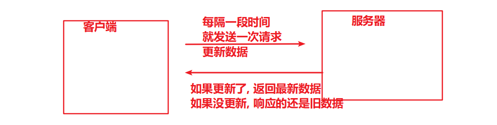

优缺点：

- 优点：浏览器兼容性好，实现简单 setInterval
- 缺点：实时性不高，资源消耗高，存在较多无用请求，影响性能

2. Comet - ajax 长轮询（历史方案，发送一个请求，服务器只要数据不更新，就一直阻塞，服务器压力过大）

短轮询的实时性，着实太差，所以 Comet 技术方案应运而生，用以实现即时通讯

- 浏览器发出 XMLHttpRequest 请求，服务器端接收到请求后，会阻塞请求直到有数据或者超时才返回

- 浏览器 JS 在处理返回信息(有数据或者超时) 后再次发出请求。服务器收到请求后，会再次阻塞到有数据或者超时


优缺点：

- 优点：浏览器兼容性好，**即时性好**，**不存在⽆⽤请求**

- 缺点：**服务器压力较大**（维护⻓连接会消耗较多服务器资源）

3. SSE（利用了 http 协议，流数据的传输，并不是严格意义的双向通信，无法复用连接）

服务端推送事件（Server-Sent Event）它是⼀种基于 HTTP 协议，允许服务端向客户端推送新数据的 HTML5 技术

问题：HTTP 协议 不是 无法做到服务器主动向客户端推送消息么？

这些 SSE 采用了一些小技巧！详细见 [参考文章：SSE 教程](https://www.ruanyifeng.com/blog/2017/05/server-sent_events.html)


优缺点：

- 优点：基于 HTTP，无需太多改造就能使⽤；相比 WebSocket 要简单一些
- 缺点：基于⽂本传输，效率没有 WebSocket ⾼；基于 HTTP 协议，不是严格的双向通信

4. WebSocket

这是基于 TCP 协议的全新、独⽴的协议，作⽤是在服务器和客户端之间建⽴实时的双向通信。

WebSocket 协议与 HTTP 协议保持兼容，但它不会融⼊ HTTP 协议，仅作为 HTML 5 的⼀部分。

优缺点：

- 优点：真正意义上的双向实时通信，性能好、延迟低

- 缺点：由于是独⽴于 HTTP 的协议，因此要使用的话需要对项⽬作改造

  使⽤复杂度会⾼一些，通常需要引⼊成熟的库 (如: Socket-io )并且⽆法兼容低版本的浏览器

# 前端工程化

## 01. Babel 的原理是什么

Babel 的主要工作是对代码进行转译。(解决兼容, 解析执行一部分代码)

```jsx
let a = 1 + 1    =>  var a = 2
```

转译分为三阶段：

- 解析（Parse），将代码解析⽣成抽象语法树 AST，也就是词法分析与语法分析的过程

- 转换（Transform），对语法树进⾏变换方面的⼀系列操作。通过 babel-traverse，进⾏遍历并作添加、更新、删除等操作

- ⽣成（Generate），通过 babel-generator 将变换后的 AST 转换为 JS 代码

转译流程示意图：


我们可以通过 [AST Explorer 工具](https://astexplorer.net/) 来查看 Babel 具体生成的 AST 节点。

## 02. 如何编写一个 Babel 插件(了解)

Babel 插件的主要工作阶段是在 Babel 将代码解析成抽象语法树 AST 之后，

插件们对抽象语法树 AST 进行各种操作后，再由 Babel 输出最终的代码。

要编写一个 Babel 插件模块，则需要为模块代码导出一个函数，且该函数返回一个对象，对象内应包含有 `visitor` 属性：

```js
module.exports = function (babel) {
  return {
    visitor: {},
  }
}
```

`visitor` 是针对各类 抽象语法树节点作处理的地⽅。

我们可以通过 [AST Explorer 工具](https://astexplorer.net/) 来查看 Babel 具体生成的 AST 节点。

**示例**

我们来编写一个插件，其功能是能自动将源码中的数字字面量数学运算进行预计算处理，简化代码。例如：

```js
// 原来的代码
const result = 1 + 2

// 处理后的代码
const result = 3 // 这样优化以后，在实际运行时可以减少一次加法操作
```

我们可以先通过 AST Explorer 来获取 JSON 格式的 AST 结构：

```json
{
  "type": "Program",
  "start": 0,
  "end": 20,
  "body": [
    {
      "type": "VariableDeclaration",
      "start": 0,
      "end": 20,
      "declarations": [
        {
          "type": "VariableDeclarator",
          "start": 6,
          "end": 20,
          "id": {
            "type": "Identifier",
            "start": 6,
            "end": 12,
            "name": "result"
          },
          "init": {
            "type": "BinaryExpression",
            "start": 15,
            "end": 20,
            "left": {
              "type": "Literal",
              "start": 15,
              "end": 16,
              "value": 1,
              "raw": "1"
            },
            "operator": "+",
            "right": {
              "type": "Literal",
              "start": 19,
              "end": 20,
              "value": 2,
              "raw": "2"
            }
          }
        }
      ],
      "kind": "const"
    }
  ],
  "sourceType": "module"
}
```

从以上 AST 结构可以知道，`1 + 2` 是一个 `BinaryExpression` (二进制表达式)类型的节点，

那么在我们编写的插件代码中的 `visitor` 里就可以这样进行处理：

1 装包

```txt
yarn add babel-types babel-core
```

2 新建 `index.js`, 贴入下面到的代码

```js
const t = require("babel-types")

const visitor = {
  BinaryExpression(path) {
    const node = path.node

    let result

    // 判断表达式两边，是否都是数字
    if (t.isNumericLiteral(node.left) && t.isNumericLiteral(node.right)) {
      // 根据不同的操作符作运算
      switch (node.operator) {
        case "+":
          result = node.left.value + node.right.value
          break
        case "-":
          result = node.left.value - node.right.value
          break
        case "*":
          result = node.left.value * node.right.value
          break
        case "/":
          result = node.left.value / node.right.value
          break
        default:
          break
      }
    }

    // 如果上⾯的运算有结果的话
    if (result !== undefined) {
      // 把表达式节点替换成number字⾯量
      path.replaceWith(t.numericLiteral(result))
    }
  },
}

module.exports = function (babel) {
  return {
    visitor,
  }
}
```

这个插件的基本功能就完成了，新建 test.js 来运行试试：

```js
const babel = require("babel-core")

const result = babel.transform("const result = 1 + 2", {
  plugins: [require("./index")],
})

console.log(result.code) // 结果：const result = 3
```

转换结果符合预期。

不过这个插件还不能完全正确的工作，在转换如 `const result = 1 + 2 + 3 + 4 + 5;` 这样的代码时，

结果为 `const result = 3 + 3 + 4 + 5;`，也就是只转换了代码中的第一段表达式计算。

如果用 AST Explorer 查看 AST 结构的话，会发现原来这个运算由层层嵌套的 `BinaryExpression` 组成：

> BinaryExpression( BinaryExpression( BinaryExpression( BinaryExpression(1 + 2) + 3 ) + 4 ) + 5 )

因此我们得改造一下之前的代码逻辑，进行遍历操作：

```js
// 如果上⾯的运算有结果的话
if (result !== undefined) {
  // 把表达式节点替换成number字⾯量
  path.replaceWith(t.numericLiteral(result))

  // 向上遍历⽗级节点
  let parentPath = path.parentPath
  parentPath && visitor.BinaryExpression.call(this, parentPath)
}
```

这样就能正确工作了。

[参考文档：Babel 插件手册](https://github.com/jamiebuilds/babel-handbook/blob/master/translations/zh-Hans/plugin-handbook.md#builders)

## 03. 你们公司的 Git 工作流是什么样的

每个公司采用的 Git 工作流都可能会有差别，有的比较规范，有的比较随意。

在这里介绍一个名为 GitFlow 的 git 标准化操作流程。

在 GitFlow 标准下，我们的 git 仓库需要包含以下几个关键分支：

- master：主分支

- develop：主开发分⽀。包含确定即将发布的代码

- feature：新功能分⽀。⼀个新功能对应⼀个分⽀

- release：发布分⽀。发布时⽤的分⽀，⼀般测试阶段发现的 bug 在这个分⽀进⾏修复

- hotfix：热补丁分支。用于修改在线上版本中发现的严重紧急 bug

**GitFlow 的主要优点**

- 支持并⾏开发

因为每个新功能都会建⽴⼀个新的 feature 分⽀，从⽽和其他已经完成的功能隔离开，

且当只有在新功能完成开发的情况下，其对应的 feature 分⽀才会被合并到主开发分⽀（develop 分支）。

另外，如果你正在开发某个功能的同时⼜有⼀个新功能需要开始开发，那么你只需把当前 feature 的代码提交后，

切回 develop 分支, 新建另外⼀个 feature 分⽀即可开发新功能了。

你也可以随时切回之前的其他 feature 分⽀继续完成该功能的开发。

- 协作开发

因为每个 feature 分⽀上改动的代码都只对该 feature 对应的功能生效，

所以不同 feature 分支上的代码在开发时不会互相影响，大家可以相安无事的开发自己负责的功能。

同时我们可以根据分支的名称，很容易知道每个⼈都在做什么功能。

- ⽀持紧急修复

hotfix 分⽀是从某个已经发布的仓库版本基础上创建出来，用于紧急修复 Bug。

该紧急修复只影响这个已经发布的仓库版本，⽽不会影响你正在开发的其他新 feature 。

**注意点**

1. feature 分⽀都是从 develop 分⽀上创建的，开发完成后再合并到 develop 分⽀上，等待发布

2. 当需要发布时，我们要从 develop 分⽀上创建⼀个 release 分⽀，然后该 release 分⽀会发布到测试环境进⾏测试。

   如果发现问题的话，就会直接在该分⽀上进⾏修复。

   所有问题修复之前，会不停重复 `发布` > `测试` > `修复` > `重新发布` > `重新测试` 流程。

   发布结束，该 release 分⽀会被合并到 develop 以及 master 分⽀，从⽽保证不会有代码丢失

3. master 分⽀只跟踪已经发布的代码，合并到 master 上的 commit 只能来⾃ release 分⽀和 hotfix 分⽀

4. hotfix 分⽀的作⽤是紧急修复⼀些 Bug，它们都是从 master 分⽀上的某个版本建⽴，

   修复结束后再被合并到 develop 和 master 分⽀上


## 04. Git 的 rebase 和 merge 的区别是什么

`git rebase` 和 `git merge` 两个命令都⽤于从⼀个分⽀获取内容并合并到当前分⽀。

以一个 `feature/todo` 分⽀合并到 `master`主分⽀为例，我们来看一下分别⽤ `rebase` 和 `merge` 会有什么不同。

**使用 Merge**


`merge` 会⾃动创建⼀个新的 `commit`， 如果合并时遇到冲突的话，只需要修改后重新 `commit`。

- 优点：能记录真实的 `commit` 情况，包括每个分⽀的详情

- 缺点：由于每次 `merge` 会⾃动产⽣⼀个 `merge commit`，

  因此在使⽤⼀些可视化的 git 工具时会看到这些自动产生的 `commit`，

  这些 `commit` 对于程序员来说没有什么特别的意义，多了反而会影响阅读

**使用 Rebase**

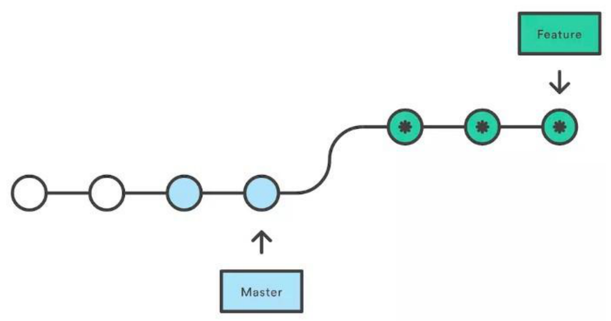

`rebase` 会合并之前的 `commit` 历史。

- 优点：可以得到更简洁的提交历史，去掉了 `merge commit`

- 缺点：因为合并而产生的代码问题，就不容易定位，因为会重写提交历史信息

**建议**

- 当需要保留详细的合并信息，建议使⽤ `git merge`, 尤其是要合并到 master 上

- 当发现⾃⼰修改某个功能时提交比较频繁，并觉得过多的合并记录信息对自己来说没有必要，那么可尝试使用 `git rebase`

## 05. Git 的 reset 回退 和 revert 撤销

在利用 git 实现多人合作程序开发的过程中，我们有时会出现 **错误提交** 的情况，

此时我们希望能撤销提交操作, 或者想要回退到某个版本

reset => 回退到某个版本 `git reset --hard 版本号`

revert => 撤销某个版本内容的内容修改 `git revert -n 版本号`

博客参考: https://blog.csdn.net/yxlshk/article/details/79944535

如果 git reset 后, 版本回退了, 无法直接 push 到远程仓库(因为远程仓库版本更加新) => git push -f 覆盖推送即可

效果: 将远程仓库的版本, 也进行了回退

# Vue

## 01. MVVM（设计模式）

MVVM 是一种双向数据绑定的模式，通过 ViewModel 建立起 Model 数据层和 View 视图层的连接。数据变化，视图自动更新。视图变化，数据自动更新。

```vue
<templete>
  这里是view视图
</templete>

ViewModel就是vue的核心，底层做好了监听，所以可以双向数据绑定

<script>
export default {
  这里是model数据,
}
</script>
```

## 02. MVVM 的优缺点（不重要）

- 优点

1. 实现了视图（View）和模型（Model）的分离，降低代码耦合、提⾼视图或逻辑的复⽤性
2. 能⾃动更新 DOM，利⽤双向绑定，数据更新后视图⾃动更新，让开发者从繁琐的⼿动操作 DOM 中解放出来

- 缺点

1. Bug 难被调试：因为使⽤了双向绑定的模式，当我们看到界⾯发生异常了，有可能是 View 的代码产生的 Bug，也有可能是 Model 代码的问题。数据绑定使得⼀个位置的 Bug 被快速传递到别的位置，要定位原始出问题的地⽅就变得不那么容易了

   可采用的调试方案：

   注释掉一段代码，确定代码的位置

   debugger 打断点或者 console 进行调试

2. 在⼀个⼤的模块中 Model 也会很⼤，虽然使⽤上来说⽅便，但如果⻓期不释放内存，会造成更多的内存消耗，占用的是浏览器的内存

## 03. 生命周期

组件实例从创建到销毁的整个过程就是生命周期。

开始创建（空实例） -> 初始化数据 -> 编译模板 -> 挂载 DOM -> 渲染、更新数据、重新渲染 -> 卸载。

这⼀系列过程我们称之为 Vue 的⽣命周期。


| 生命周期      | 执行时机                                                                                                                                                                                                                |
| ------------- | ----------------------------------------------------------------------------------------------------------------------------------------------------------------------------------------------------------------------- |
| beforeCreate  | data 数据初始化之前，组件还没有数据，访问不到 data、watch 等                                                                                                                                                            |
| created       | data 数据初始化之后，可以获取到组件数据，可以访问 data、watch 等，但是 DOM 还没渲染。                                                                                                                                   |
| beforeMount   | DOM 渲染之前，DOM 还没渲染，相关的 render 函数首次被调用，实例已完成以下配置：编译模板，把 data 里的数据和模板生成 html。此时还没有挂载 html 到页面上。在这之前，包括这，都无法获取 DOM，想要获取 DOM 使用 nextTick()。 |
| mounted       | DOM 渲染之后，可以操作 DOM 了                                                                                                                                                                                           |
| beforeUpdate  | 响应式数据更新时调用，此时虽然响应式数据更新了，但是对应的真实 DOM 还没有被渲染。                                                                                                                                       |
| updated       | 数据更改导致虚拟 DOM 重新渲染和打补丁之后调用。此时 DOM 已经根据响应式数据的变化更新了。                                                                                                                                |
| activited     | 组件被激活时调用。用 keep-alive 包裹的组件在切换时不会销毁，而是缓存到内存中，切换时不会再次执行 created。                                                                                                              |
| deactivated   | 组件被停用时调⽤。                                                                                                                                                                                                      |
| beforeDestory | 组件实例销毁前调用。这一步，实例仍然完全可用，`this` 仍能获取到实例。                                                                                                                                                   |
| destoryed     | 组件实例销毁后调用。调用后，Vue 实例指示的所有东西都会解绑定，所有的事件监听器会被移除，所有的子实例也会被销毁。 (定时器、webscoket...跟 vue 没有太大关联的资源，需要手动释放)                                          |


## 04. 网络请求应该放在哪个生命周期中发起

在 created 里 data 才生成，而请求返回的数据需要挂载到 data 上，所以要在 created 里发请求。

但是 created 这时候 DOM 还没初始化，mounted 里 DOM 才初始化，如果我们的请求不需要依赖/借助 DOM，这时候请求可以放在 created，反之则可以放在 mounted 里。

## 05. 组件之间如何进行通信

1. 父子通信 props。props[验证](https://cn.vuejs.org/v2/guide/components-props.html#Prop-%E9%AA%8C%E8%AF%81)

   ```js
   <jack :money="count" :obj="myobj"></jack>
   ```

   ```jsx
   export default {
     // props: ['money']
     props: {
       money: {
         type: Number,
         default: 1,
       },
       obj: {
         type: Object,
         // 工厂函数可以创建对象
         default: () => {
           return {
             name: "zs",
             age: 18,
           }
         },
       },
     },
   }
   ```

2. 子父通信$emit

   ```js
   <jack @add-action="fatherFn"></jack>
   ```

   ```jsx
   this.$emit('add-action', 参数1, 参数2, ...)
   ```

3. ref，通过添加 ref 和 $refs 配合，也可以很方便的获取子组件，访问调用子组件的属性或方法

   ```js
   // 父组件中
   <template>
     <div class="hello_world">
       <com-a ref="coma"></com-a> // this.$refs.coma.count = 200
       <com-b ref="comb"></com-b> // this.$refs.comb.addFn()
     </div>
   </template>
   ```

4. provide inject

   父组件

   ```jsx
   export default {
     provide() {
       return {
         value: this.value, // 共享给子孙组件的数据
       }
     },
     data() {
       return {
         value: "父组件的数据",
         money: 100,
       }
     },
   }
   ```

   子孙组件

   ```jsx
   export default {
     inject: ['value'],
     props: {
         ...
     }
   }
   ```

## 06. computed 和 watch 的区别

computed 有缓存，只有当它依赖的属性值发生了改变，才会重新计算。watch 没有缓存。

## 07. vue 双向绑定原理是什么（如何理解 vue 响应式系统）

通过 Object.defineProperty()来劫持各个属性的 setter/getter（访问和设置），通过观察者模式，完成数据驱动视图的更新

## 08. 观察者模式

观察者模式：当对象间存在 **一对多** 关系时，则使用观察者模式（Observer Pattern）

比如，当一个对象或者数据被修改时，则会自动通知依赖它的对象。

**意图：**定义对象间的一种 `一对多的依赖关系`，当一个对象的状态发生改变时，所有依赖于它的对象都得到通知并被自动更新。

拍卖会的时候，大家相互叫价，拍卖师(Dep) 会观察 最高标价(利用 Object.defineProperty 监听)，

一旦最高价变化了, 然后通知给其它竞价者(watcher 观察者 - 订阅者, 订阅了价格的变化)，这就是一个观察者模式

下图为 Vue 框架在数据初始化中使用观察者模式的示意图：


Dep 要进行 **依赖收集**，并通过一个 subs 数组, 记录观察者 Watcher,

Watcher 分为 **渲染 watcher、计算属性 watcher、侦听器 watcher** 三种

收集依赖: 简单点说就是谁借了我的钱，我就把那个人 **记下来** ，以后我的钱少了 我就通知他们说我没钱了

```jsx
<div>
  <p>{{ msg }}</p>   // Watcher1(渲染), 依赖于msg
</div>

<div>
  <h1>{{ car }}</h1>   // Watcher2(渲染),  依赖于car
</div>

<div>
  <h1>{{ myMsg }}</h1>   // Watcher3(渲染), 依赖于myMsg
</div>

computed: {
  myMsg () {
    console.log('计算属性重新计算了')
    return this.msg + '20'  // Watcher4(计算属性中), 依赖于msg, msg变了重新计算
  }
}

watch: {
  msg (newValue) {
    console.log('新的msg', newValue) // Watcher5(侦听器), 将来msg变化, 这边要执行这个函数
  }
}

------------------------------------------------------------------

// 收集依赖 (dep结构有点类似于二维数组, (Map结构))   arr.type="msgDep"
dep: [
  msgDep: [Watcher5(侦听器), Watcher4(计算属性中), Watcher1(渲染)],
  carDep: [Watcher2(渲染)],
  myMsgDep: [Watcher3(渲染)]
]


// Watcher
{
  callback: Function, (数据变化后, 需要执行的回调)
  isRenderWatcher: Boolean, (是否是render的watcher, 是否要触发视图的更新, 往后放, 最后统一虚拟dom对比, 统一更新)
  ...
}
```

比如: 假定数据 money 变了, 那么没有任何与 money 相关的观察者, 就不需要进行任何更新操作, 也不需要执行任何的监视函数

然而: 假定数据 msg 变了, 就会通知到相关的 Watcher, 且优先通知侦听器 Watcher 和计算属性 Watcher, 后进行统一的渲染更新

1. 通知侦听器 Watcher, 立刻执行配置的函数, console.log('新的 msg', newValue)
2. 通知计算属性 Watcher, 计算属性依赖的值变了, 需要重新计算
   且更新后, myMsg 变化了, 需要进行进行视图的渲染 (render) (--- 要更新, 等着---)
3. 通过到 watcher1, 渲染 Watcher (---要更新---)
4. 最后统一进行, 新旧虚拟 dom 的对比, 完成视图的更新

**当数据状态发生改变时，会被 Object.defineProperty 监听劫持到, 会通知到 Dep, 并根据收集的依赖关系,**

**让订阅者 Watcher 进行数据更新（update）操作 , 派发更新**

总结概述: vue 采用的是观察者模式, 是一种`一对多`的关系, 一上来 vue 在解析渲染时, 会进行依赖收集, 会将渲染 watcher、计算属性 watcher、侦听器 watcher, 都收集到对应的 dep 中, 将来 Object.defineProperty 监听到数据变化, 就根据依赖关系, 派发更新

## 09. Vue 中的 key 到底有什么用

`key` 是为 Vue 中的虚拟 DOM 节点（vNode）标记唯⼀性的 id。

### key 的作用

作用: 给虚拟 dom 添加标识, **(优化复用对比策略, 优化渲染性能)**

主要考察:

1. vue 的更新机制 (差异化更新) 对比新旧虚拟 dom, 找出不同的部分, 进行更新视图

   为什么对比虚拟 dom, 而不对比真实的 dom ? 真实的 dom 太复杂, 对比起来性能太差

2. 虚拟 dom: 使用 js 对象的方式, 模拟真实的 dom 结构 { type: 'div', className: 'box' , children: [] }

   属性的量大大的减少了, 没有真实 dom 的那么多无效的属性, 对比起来性能高很多

3. diff 算法: 默认的对比(diff) 机制, 同层兄弟元素, 是按照下标进行对比的, 但是加了 key, **就相当于给虚拟 dom 加了个标识**

   对比策略, 就是对相同 key 的元素进行对比了, 在列表 v-for 中, key 的使用尤为常见, 可以用于优化渲染性能


### 9.2 key 的常见应用场景

key 的常见应用场景 => v-for, v-for 遍历的列表中的项的顺序, 非常的容易改变

1 往后面加, 默认的对比策略, 按照下标, 没有任何问题

```jsx
// 旧
<ul>
  <li>张三</li>
  <li>李四</li>
</ul>

// 新
<ul>
  <li>张三</li>
  <li>李四</li>
  <li>王五</li>
</ul>
```

2 往前面加, 由于下标变了, 如果按照之前的下标对比, 元素是混乱的, 策略: 加上 key

一旦加上了 key, 就是按照 key 进行新旧 dom 的对比了

```jsx
// 旧
<ul>
  <li key="17">张三</li>
  <li key="31">李四</li>
</ul>

// 新  [ { id: 17, name: '张三' }, ... ]
<ul>
  <li key="52">王五</li>
  <li key="17">张三</li>
  <li key="31">李四</li>
</ul>
```

**总结: key 就是给 虚拟 dom 添加了一个 标识, 优化了对比策略!!!**

## 10. Vue 跳转路由时的传参方式 (query 和 params 的区别)

1. 通过 query 传参

```jsx
this.$router.push("/login?username=pp&age=18&desc=xx")

this.$router.push({
  path: "/login",
  query: {
    username: "pp",
    age: 18,
    desc: "xxx",
  },
})

this.$router.push({
  name: "login",
  query: {
    username: "pp",
    age: 18,
    desc: "xxx",
  },
})
```

**获取: this.$route.query.username**

2. 通过 params 传参, 必须通过命名路由的方式传递!

```jsx
this.$router.push({
  name: "login",
  params: {
    username: "pp",
    age: 18,
  },
})
```

**获取: this.$route.params.username**

**区别:**

1. params 传参, 必须要用命名路由的方式传值

2. params 传参, 不会显示在地址栏中, 刷新会丢失

   可以配合 localStorage 使用

   (1) A 跳转路由到 B, 通过 params 传值

   (2) B 页面中, 立刻通过 this.$route.params 获取参数

   (获取参数的逻辑, 优先从$route 中拿, 如果拿不到(说明刷新了), 从本地取即可)

   (3) 拿到参数后, 立刻存到本地 (保证刷新丢失后, 还能从本地拿)

   (4) 实现功能...

B 页面的逻辑

```jsx
created () {
    let username = this.$route.params.username
    if (username) {
        // 刚跳过来, 有参数, 立刻存起来
        localStorage.setItem('myParams', JSON.stringify(this.$route.params))
    } else {
        // 没有, 说明用户刷新了, 丢失了params, username参数, 本地拿
        username = JSON.parse(localStorage.getItem('myParams')).username
    }
}
```

## 11. SEO

1. `SSR 服务器渲染`

   优势：更好的 SEO，搜索引擎爬虫抓取工具可以直接查看完全渲染的页面

   缺点：服务器 nodejs 环境的要求，且对原代码的改造成本高! `nuxt.js` (坑比较多，做好踩坑的准备)

2. 静态化 (适合用来做博客、介绍性官网)。Nuxt.js 可以进行 generate 静态化打包

   缺点：动态路由会被忽略 `/users/:id`

   优势：

   - 编译打包时，就会帮你处理，纯静态文件，访问速度超快
   - 对比 SSR，不涉及到服务器负载方面问题
   - 静态网页不宜遭到黑客攻击，安全性更高

3. `预渲染 prerender-spa-plugin (插件)`

   如果你只是对少数页面需要做 SEO 处理（例如 / 首页， /about 关于等页面）

   预渲染是一个非常好的方式，预渲染会在构建时，简单的针对特定路由，生成静态 HTML 文件 (打包时可以帮你解析静态化)

   优势：设置预渲染简单，对代码的改动小

   缺点：只适合于做少数页面进行 SEO 的情况，如果页面几百上千，就不推荐了 (会打包很慢)

4. 使用 Phantomjs `针对爬虫` 做处理（我项目都写完了，你在给我说做 SEO 优化？合理吗？很不合理。）

   Phantomjs 是一个基于 webkit 内核的无头浏览器，没有 UI 界面，就是一个浏览器，其内的点击、翻页等人为相关操作需要程序设计实现。这种解决方案其实是一种旁路机制，原理就是通过 Nginx 配置， 判断访问的来源 UA 是否是爬虫访问，如果是则将搜索引擎的爬虫请求转发到一个 node server，再通过 PhantomJS 来解析完整的 HTML，返回给爬虫

   

   优势：

   - 完全不用改动项目代码，按原本的 SPA 开发即可，对比开发 SSR 成本小太多了
   - 对已用 SPA 开发完成的项目，这是不二之选

   不足：

   - 部署需要 node 服务器支持

   - 爬虫访问比网页访问要慢一些，因为定时要定时资源加载完成才返回给爬虫(不影响用户的访问)

   - 如果被恶意模拟百度爬虫大量循环爬取，会造成服务器负载方面问题

     解决方法是判断访问的 IP，是否是百度官方爬虫的 IP

小结：

- 如果构建大型网站，如商城类 => SSR 服务器渲染

- 如果只是正常公司官网，博客网站等 => 预渲染/静态化/Phantomjs 都比较方便
- 如果是已用 SPA 开发完成的项目进行 SEO 优化，而且部署环境支持 node 服务器，使用 Phantomjs

博客参考： [SEO 优化方案](https://www.jb51.net/article/164285.htm)

## 12. 权限处理

现在权限相关管理系统用的框架都是 element 提供的[vue-element-admin](https://panjiachen.github.io/vue-element-admin-site/zh/)模板框架比较常见。

权限控制常见分为三大块

- **菜单权限控制**
- **按钮权限控制**
- 请求 url 权限控制。

**权限管理在后端中主要体现在对接口访问权限的控制，在前端中主要体现在对菜单访问权限的控制。**

1. 按钮权限控制比较容易，主要采取的方式是从后端返回按钮的权限标识，然后在前端进行显隐操作 v-if / disabled。

2. url 权限控制，主要是后端代码来控制，前端只需要规范好格式即可。

3. 剩下的菜单权限控制，是相对复杂一些的

   (1) **需要在路由设计时, 就拆分成静态路由和动态路由**

   静态路由: 所有用户都能访问到的路由, 不会动态变化的 (登录页, 首页, 404, ...)

   动态路由: 动态控制的路由, 只有用户有这个权限, 才将这个路由添加给你 (审批页, 社保页, 权限管理页...)

   (2) 用户登录进入首页时, 需要立刻发送请求, 获取个人信息 (包含权限的标识)

   

   (3) **利用权限信息的标识, 筛选出合适的动态路由**, 通过路由的 **addRoutes 方法**, 动态添加路由即可!

   (4) router.options.routes (拿的是默认配置的项, 拿不到动态新增的) 不是响应式的!

   为了能正确的显示菜单, 为了能够将来正确的获取到用户路由, 我们需要用**vuex 管理 routes 路由数组**

   (5) 利用 vuex 中的 routes, 动态渲染菜单

## 13. 项目支付功能

支付宝方式：点击支付宝支付，调用后台接口(携带订单号)，后台返回一个 form 表单(HTML 字符串结构)

提交 form 就可以调用支付宝支付

```jsx
//  alipayWap: 后台接口返回的form 片段
<div v-html="alipayWap" ref="alipayWap"></div>

methods: {
  toAlipay () {
  this.$axios.get('xxx').then (res = > {
    this.alipayWap = res
       // 等待dom更新, 等页面中有这个form表单了
    this.$nextTick(() => {
       this.$refs.alipayWap.children[0].submit()
     })
   })
  }
}
```


微信支付：需要自己根据后台返回的 url 生成二维码页面，如图所示


博客参考 1: https://blog.csdn.net/qq_36710522/article/details/90480914

博客参考 2: https://blog.csdn.net/zyg1515330502/article/details/94737044

## 14. 如何处理项目(首屏)加载过慢的问题

SPA 单页面应用：所有的功能，都在一个页面中，单页面跳转就是切换组件，仅刷新局部资源，公共资源（js、html、css 等）仅需要加载一次。

加载过慢主要原因：一次性加载了过多的资源，一次性加载了过大的资源

- 加载过多：路由懒加载，访问到路由，再加载该路由相关的组件内容
- 加载过大：图片压缩、文件压缩合并处理、开启 gzip 压缩等

比如：

1. 配置异步组件，路由懒加载

   ```js
   const login = () => import("../pages/login.vue")
   ```

2. 图片压缩：使用 webp 格式的图片，提升首页加载的速度

3. CDN 加速：配置 CDN 加速（公司的地址和用户使用的地方太远了），加快资源的加载效率 (花钱)

4. 开启 gzip 压缩 (一般默认服务器开启的，如果没开，确实可能会很慢，可以让后台开一下)

   浏览器请求服务器，原本是服务器有什么图片就给我们什么图片，比如 jpg/png，但是这样文件会比较大，所以服务器可以将文件进行 gzip 压缩，发送给浏览器，浏览器看到这样压缩过的资源会自动解压，不需要我们做什么东西。

5. 使用 v-if 代替 v-show

6. ...


博客: https://www.cnblogs.com/xidian-Jingbin/p/10643391.html

## 15. 你在项目中遇到过什么技术难题

`考察解决问题的能力！`

话术：前端要学的东西确实很多，但是并不夸张，肯多花点时间沉淀一般都会有解决方案。

一般遇到难题 (这些前端所谓的难题，一般都是一些没有做过，没有尝试过得一些业务)，我们要时刻保持独立思考，**知道自己要做什么业务**，**由此决定要学什么知识**，然后**实现业务**，举一反三，总结归纳！

比如：如果之前没有做过国际化，换肤，没有做过支付，权限控制，没有做过即时通信 websocket，excel 导入导出，就会觉得很难，但其实真正上手花时间去学着做了，也都能逐步思考解决相关页面。

有时候, `复杂的或者困难的`，并不是技术层面的，而是`业务需求方面`的，需要进行大量树形结构的处理，展示列表式数据时，展示图表数据时，筛选条件关联条件多了，`组件与组件的联动关系`的控制也比较麻烦，将联动的条件，存 vuex，然后进行分模块管理也是比较合适的选择，还有后台给的数据非常的难搞，需要进行大量的遍历处理。前一家公司给的数据都是处理好的。


## 16. 发布订阅模式（自定义事件）

```html
<!DOCTYPE html>
<html lang="en">
  <head>
    <meta charset="UTF-8" />
    <meta http-equiv="X-UA-Compatible" content="IE=edge" />
    <meta name="viewport" content="width=device-width, initial-scale=1.0" />
    <title>Document</title>
  </head>
  <body>
    <button id="btn">点击我</button>

    <script>
      const btn = document.querySelector("#btn")

      // btn.onclick = function () {
      //   console.log("btn被点击了")
      // }
      // btn.onclick = function () {
      //   console.log("btn又被点击了吗")
      // }
      // 以上实现并不能完成两个回调函数都执行，是一个一对一的实现

      // 优化：从一对一变成一对多
      btn.addEventListener("click", function () {
        console.log("btn被点击了")
      })
      btn.addEventListener("click", function () {
        console.log("btn又被点击了吗")
      })

      // 发布订阅模式（自定义事件）
      // 这种模式下可以实现同一个事件对应多个回调函数，实现了一对多，这种优化，就是发布订阅模式

      // 浏览器的实现原理：
      // 浏览器实现了一个方法，叫做addEventListener
      // 这个方法接收两个参数，参数一：事件类型。参数二：会回调函数
      // 为了实现一对多架构，内部大概是这样的。{ click: ['回调函数1', '回调函数2'] }
      // 当鼠标点击时，通过事件类型click去数据结构中找到存放了所有相关的回调函数的数组然后遍历，都执行一遍，从而实现了一对多

      // 实现一个自己的自定义事件
      const map = {}
      function collect(eventName, fn) {
        if (!map[eventName]) map[eventName] = []
        map[eventName].push(fn)
      }
      collect("click", function () {
        console.log("收集成功了click")
      })
      console.log(map)
    </script>
  </body>
</html>
```

## 17. 什么是组件

组件就是一个可以复用的普通 js 对象

# Vue3

### vue3 的优点

从使用语法上，比较大的区别就是多了组合式 API，可以更好的组织逻辑。新增了 Suspense Teleport 组件，v-model 语法糖更新，去除 filter .sync 功能。

从框架本身看，首次渲染更快（proxy 代理），diff 算法更快（静态标记），打包体积更小（tree-shaking），更好的支持 TS，放弃 IE 浏览器。

### 响应式系统

提供 reactive 和 ref 实现响应式数据。

reactive 是使用 proxy 实现数据劫持，不用遍历属性，支持删除属性和添加属性。vue2 是单独额外处理的，vue2 是使用 Object.defineProperty。

ref 如果是对象使用 proxy 实现数据劫持，如果是简单数据使用 obj 的 getter setter 代理 value 属性的写法实现的。

其他发布订阅，观察者模式基本一样。

### Vue2 的数据劫持

```html
<!DOCTYPE html>
<html lang="en">
  <head>
    <meta charset="UTF-8" />
    <meta http-equiv="X-UA-Compatible" content="IE=edge" />
    <meta name="viewport" content="width=device-width, initial-scale=1.0" />
    <title>数据劫持-vue2</title>
  </head>
  <body>
    <div id="app"></div>

    <script>
      const target = {
        name: "jack",
        age: 18,
      }

      const vm = {}
      Object.keys(target).forEach(key => {
        // 代理对象，原对象的key，get和set函数，这是ES5提供的函数
        Object.defineProperty(vm, key, {
          get() {
            return target[key]
          },
          set(v) {
            target[key] = v
            // 模拟更新效果
            render()
          },
        })
      })

      const render = () => {
        document.querySelector("#app").innerHTML = `我是 ${vm.name} 今年 ${vm.age} 岁`
      }
      render()
    </script>
  </body>
</html>
```

### Vue3 的数据劫持

```html
<!DOCTYPE html>
<html lang="en">
  <head>
    <meta charset="UTF-8" />
    <meta http-equiv="X-UA-Compatible" content="IE=edge" />
    <meta name="viewport" content="width=device-width, initial-scale=1.0" />
    <title>数据劫持-vue3</title>
  </head>
  <body>
    <div id="app"></div>

    <script>
      const data = {
        name: "jack",
        age: 18,
        get fullName() {
          return this.name + "Ma"
        },
      }

      const proxy = new Proxy(data, {
        get(target, key, receiver) {
          console.log("get")
          // return target[key]
          return Reflect.get(target, key, receiver)
        },
        set(target, key, value, receiver) {
          // target[key] = value
          Reflect.set(target, key, value, receiver)
          render()
          return true
        },
      })

      console.log(proxy)

      const render = () => {
        document.querySelector("#app").innerHTML = `我是 ${proxy.name} 今年 ${proxy.age} 岁`
      }
      render()
    </script>
  </body>
</html>
```

### vite 构建工具优势

先启动开发服务器（启动快），使用 ES Module 加载资源（热更新快），开发体验好。由于只支持 ES6 模块化，commonJs 的代码需要改造，从 webpack（vue-cli） 迁移到 vite（create-vue） 还是有一些困难，建议新项目采用 vite。

### 组件如何才能支持 v-model 指令

Vue2 `:value @input` === v-model `:show update:show ` === .sync

Vue3 `:show @update:show` === v-model:show `:modelValue @update:modeValue` ===v-model

### 路由传参

- 路由
  - 路径 ===> 组件 `{path: '/user', component: User}`
  - 只有路径是 `/user` 才能来到 `User` 组件
  - 如果要传参？
    - `/user?id=100` 或者 `{path:'/user', query: {id: 100}}`
  - 如果取参数？`route.query`
- 动态路由
  - 当你不同的路径，想指向同一个组件的时候使用：`/user/100` `/user/200`
  - 路径 ===> 组件 `{path: '/user/:id', component: User, name: 'user'}`
  - 如果要传参？
    - `/user/100` 或者 `{name:'user', params: {id: 100}}`
  - 如果取参数？`route.params`

上面两种即是标准的路由写法和传参写法，其他的写法都不规范。如：

- 如何实现地址栏看不见的传参？
- vue2（vue-router@3）写法
  - `{path: '/user', component: User, name: 'user'}` 路由规则
  - `{name:'user', params: {id: 100}}` 跳转路由传参 ID
  - 这种写法地址栏不出现 id，地址是`/user` params 上的 id 值没有在地址上，刷新后消失。

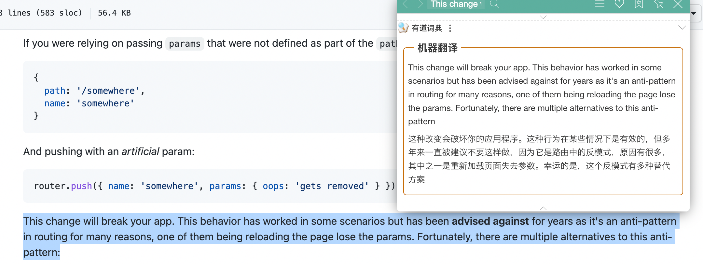

vue3(vue-router@4)默认不支持了，代替方案：pinia

# TS

### 枚举类型编译结果

- 枚举是 TS 为数不多的非 JavaScript 类型级扩展(不仅仅是类型)的特性之一
- 因为：其他类型仅仅被当做类型，而枚举不仅用作类型，还提供值(枚举成员都是有值的)
- 也就是说，其他的类型会在编译为 JS 代码时自动移除。但是，**枚举类型会被编译为 JS 代码**

```ts
enum Direction {
  Up = 'UP',
  Down = 'DOWN',
  Left = 'LEFT',
  Right = 'RIGHT'
}


// 会被编译为以下 JS 代码：
var Direction;


(function (Direction) {
  Direction['Up'] = 'UP'
  Direction['Down'] = 'DOWN'
  Direction['Left'] = 'LEFT'
  Direction['Right'] = 'RIGHT'
})(Direction || Direction = {})
```

- 说明：枚举与前面讲到的字面量类型+联合类型组合的功能类似，都用来表示一组明确的可选值列表
- 一般情况下，**推荐使用字面量类型+联合类型组合的方式**，因为相比枚举，这种方式更加直观、简洁、高效

### type 和 interface 区别

- 类型别名和接口非常相似，在许多情况下，可以在它们之间`自由选择`。
- 接口的几乎所有特性都以类型的形式可用，关键的区别在于不能重新打开类型以添加新属性，而接口总是`可扩展`的。

| interface      | type                     |
| -------------- | ------------------------ |
| 不支持简单类型 | 支持：对象类型，其他类型 |
| 复用：可以继承 | 复用：交叉类型           |

不同的点：

- type 不可重复定义

typescript

```
type Person = {
  name: string;
};
// 标识符“Person”重复  Error
type Person = {
  age: number;
};
```

- interface 重复定义会合并

typescript

```
interface Person {
  name: string;
}
interface Person {
  age: number;
}
// 类型会合并，注意：属性类型和方法类型不能重复定义
const p: Person = {
  name: 'jack',
  age: 18,
};
```

使用场景：扩展第三方库的接口类型

```ts
import "vue-router"

declare module "vue-router" {
  // 扩展 元信息类型
  interface RouteMeta {
    // 标题
    title?: string
  }
}
```

```ts
import NavBar from "./NavBar.vue"
declare module "vue" {
  interface GlobalComponents {
    VanNavBar: typeof NavBar
  }
}
```

### ts 为你的项目能带来什么

- 良好的拼写检查和提示
  - 不同的数据有不同的方法
  - 响应式数据有提示
- 方便快捷的代码重构
  - 修改数据的类型，名称

```sh
pnpm type-check
```

可检查出所有有问题的文件，会有类型报错。

### Vue3 组合式 API 如何添加类型

回顾：

- defineProps 建议开启 响应式语法糖 vite.config.ts

```ts
const { money, car = "xxx" } = defineProps<{
  money: number
  car?: string
}>()
```

- defineEmits

```ts
const emit = defineEmits<{
  (e: "changeChannel", id: number): void
}>()
```

- ref

```ts
const count = ref(0)
const list = ref<TodoItem[]>([])
```

- reactive

```ts
const book = reactive({ title: "xxx" })

// 推导不正确，需要加类型，变量后类型注解
const book: { title: string; year?: number } = reactive({ title: "xxx" })
```

- computed

```ts
const double = computed(() => count.value * 2)

const money = computed<string>(() => (count.value * 2).toFixed(2))
```

# 优医问诊

极速问诊+问诊室+问诊记录，三个模块的功能一定要自己描述出来。

- 开发团队 7 人，2 人后台，2 人前端，1 个产品，1 设计，1 测试。
  - 一个前端负责医生端和后台管理，你负责患者端。
- 患者 H5 端开发 3 个月，开发和测试。
- 上线，后台配置好了 gitlab 流水线，推 dev 分支是测试，推 master 分支是上线，回退版本是重新执行流水线。

### pnpm 是什么

- 一个磁盘利用率更高的包管理器

### 你使用什么创建的项目

- 使用基于 vite 的 create-vue 脚手架

### 你如何实现主题定制

- css 变量，修改 vant 的主题 css 变量

### 状态持久化怎么实现的

- 使用 pinia 的持久化插件，原理就是：同步到本地的 localStorage，也可以指定存储方式

### 移动端适配怎么实现

- 使用 postcss 插件 px-to-viewport 实现，原理是把 px 单位转换成 vw 单位

### 请求工具函数是什么

- 基于 axios 二次封装的请求函数，方便使用和复用。

### 你如何实现响应数据类型

- 通过 axios.request<type1,type2>() type1 没有改 resd 的时候时间 type2 改了响应数据的时候使用

### 你项目中封装过哪些组件

- 自定义的通用业务组件，单选按钮组，svg 图标组件

- 业务组件封装，支付抽屉

- 基于 vant 二次封装的组件，更多操作组件，通用导航

### 如何给全局组件添加类型

- `GlobalComponents` 给全局组件加类型

### 测试接口的工具使用什么

- Apifox 提供测试接口功能，需要登录的接口可以配置 token

### 如何真机调试

- 在同一个局域网，通过 IP 访问，使用 eruda 插件可以再手上看控制台，审查元素。

# HTTP

## 01. GET 和 POST 的请求的区别

## \*02. POST 和 PUT 请求的区别

PUT 请求是向服务器端发送数据，从而修改数据的内容，但是不会增加数据的种类等，也就是说无论进行多少次 PUT 操作，其结果并没有不同（可以理解为时**更新数据**）

POST 请求是向服务器端发送数据，该请求会改变数据的种类等资源，它会创建新的内容（可以理解为是**创建数据**）

### 为什么 post 请求会发送两次请求

- 1.第一次请求为`options`预检请求，状态码为:204
  - 作用
    - 作用 1: 询问服务器是否支持修改的请求头，如果服务器支持，则在第二次中发送真正的请求
    - 作用 2: 检测服务器是否为同源请求，是否支持跨域
- 2.第二次为真正的`post`请求

## 3. 常见的 HTTP 请求头和响应头

### HTTP Request Header

- Accept 浏览器能够处理的内容类型
- Accept-Charset 浏览器能够显示的字符集
- Accept-Encoding 浏览器能够处理的压缩编码
- Accept-Language 浏览器当前设置的语言
- Connection 浏览器与服务器之间连接的类型
- Cookie 当前页面设置的任何 Cookie
- Host 发出请求的页面所在的域
- Referer 发出请求的页面的 URL
- User-Agent 浏览器的用户代理字符串

### HTTP Responses Header

- Date 表示消息发送的时间，时间的描述格式由 rfc822 定义
- server 服务器名称
- Connection 浏览器与服务器之间连接的类型
- Cache-Control 控制 HTTP 缓存
- content-type 表示后面的文档属于什么 MIME 类型

### Content-Type

**常见的 Content-Type 属性值有以下四种**

`application/x-www-form-urlencoded`：浏览器的原生 form 表单，如果不设置 enctype 属性，那么最终就会以 application/x-www-form-urlencoded 方式提交数据。该种方式提交的数据放在 body 里面，数据按照 key1=val1&key2=val2 的方式进行编码，key 和 val 都进行了 URL 转码

`multipart/form-data`：该种方式也是一个常见的 POST 提交方式，通常表单上传文件时使用该种方式

`application/json`：服务器消息主体是序列化后的 JSON 字符串

`text/xml`：该种方式主要用来提交 XML 格式的数据

## 4. HTTP 状态码 304 是多好还是少好

**为什么会有 304**

服务器为了提高网站访问速度，对之前访问的部分页面指定缓存机制，当客户端在此对这些页面进行请求，服务器会根据缓存内容判断页面与之前是否相同，若相同便直接返回 304，此时客户端调用缓存内容，不必进行二次下载。

状态码 304 不应该认为是一种错误，而是对客户端**有缓存情况下**服务端的一种响应。

搜索引擎蜘蛛会更加青睐内容源更新频繁的网站。通过特定时间内对网站抓取返回的状态码来调节对该网站的抓取频次。若网站在一定时间内一直处于 304 的状态，那么蜘蛛可能会降低对网站的抓取次数。相反，若网站变化的频率非常之快，每次抓取都能获取新内容，那么日积月累，的回访率也会提高。

**产生较多 304 状态码的原因：**

- 页面更新周期长或不更新
- 纯静态页面或强制生成静态 html

**304 状态码出现过多会造成以下问题：**

- 网站快照停止；
- 收录减少；
- 权重下降。

## 05. 常见的 HTTP 请求方法（前五个）

## 6. 说说 Ajax 组成部分

Ajax(阿贾克斯)：全称 `Asynchronous Javascript And XML(异步的js与xml)`

- 说人话： **用 js 发送异步的网络请求**
- A : Asynchronous 异步
- J：Javascript
- A ：And
- X : XML 与 XMLHttpRequest
  - XML ： 解决跨平台数据传输。
    - 在 JSON 没有出来以前, 网络传输主要以 XML 格式数据为主。 后来 JSON 问世，逐渐取代 XML。 但是由于 ajax 技术出来的比 json 早，因此 xml 这个称呼一直保留至今

## 7. 请介绍一下 XMLHTTPRequest 对象

**Ajax 的核心是 XMLHTTPRequest**。它是一种支持异步请求的技术。 XMLHTTPRequest 使您可以使用 JavaScript 向服务器提出请求并处理响应，而不阻塞用户。可以在页面加载以后进行页面的局部更新

**使用方法**

**1.实例化 ajax 对象**

**2. open()** ：创建 HTTP 请求 第一个参数是指定提交方式(post、get) 第二个参数是指定要提交的地址是哪 第三个参数是指定是异步还是同步(true 表示异步，false 表示同步) 第四和第五参数在 HTTP 认证的时候会用到。是可选的

**3.设置请求头**

**setRequestHeader**(Stringheader,Stringvalue) **（使用 post 方式才会使用到，get 方法并不需要调用该方法）**

**4.发送请求**

**send(content)** ：发送请求给服务器 如果是 get 方式，并不需要填写参数，或填写 null 如果是 post 方式，把要提交的参数写上去

**5. 注册回调函数**

```javascript
/* 1.ajax： 在页面不刷新的情况下向服务器请求数据
           2.XMLHttpRequest ： http请求对象，负责实现ajax技术（小黄人）
                （1）创建XMLHttpRequest对象
                        * 小黄人，相当于黄袍加身的跑腿外卖小哥哥
                （2）设置请求
                        * 告诉小黄人服务器地址
                （3）发送请求
                        * 小黄人出发去指定地址取外卖（数据）
                            * 2G网速：走路去的
                            * 3G网速：骑膜拜去的
                            * WIFI : 骑电动车去的
                            * 4G   ： 骑小牛牌电动车去的
                （4）注册回调函数
                        * 小黄人把取回的外卖送到你家门口
        
         */
//(1).实例化ajax对象
let xhr = new XMLHttpRequest()
//(2).设置请求方法和地址
xhr.open("post", "http://www.liulongbin.top:3009/api/login")
//(3).设置请求头（post请求才需要设置）
xhr.setRequestHeader("Content-type", "application/x-www-form-urlencoded")
//(4).发送请求 ： 参数格式  'key=value'
xhr.send("username=admin&password=123456")
//(5).注册回调函数
// xhr.onload = function() {};
xhr.onreadystatechange = function () {
  //onreadystatechange会触发多次，一般需要判断xhr.readState == 4 才获取响应数据
  if (xhr.readyState == 4) {
    console.log(xhr.responseText)
  }
}
```

### onreadstatechange 事件

```javascript
*/ 1. onload事件 ：  接收服务器响应的数（一次请求，只会执行一次）
  */      2. onreadystatechang事件 : 作用与onload事件一致（一次请求，会执行多次）
  */          面试点： XMLHttpRequest对象的状态码 （xhr.readyState）
   */             0: 请求未建立  (创建了xhr对象，但是还没调用open)
   */             1: 服务器连接已建立
   */             2. 请求已接收  (send之后,服务器已经接收了请求)
   */             3. 请求处理中
   */             4. 请求已完成，且响应已就绪 （ 4状态码等同于onload事件 ）


      //(1).实例化ajax对象
      let xhr = new XMLHttpRequest()
      console.log(xhr.readyState) //0
      //(2).设置请求方法和地址
      xhr.open("post", "http://www.liulongbin.top:3009/api/login")
        console.log(xhr.readyState) //1
      //(3).设置请求头（post请求才需要设置）
      xhr.setRequestHeader("Content-type", "application/x-www-form-urlencoded")
      console.log(xhr.readyState) //1
      //(4).发送请求 ： 参数格式  'key=value'
      xhr.send("username=admin&password=123456")
        console.log(xhr.readyState) //1
      //(5).注册回调函数
      //a. onload 是新式浏览器才支持的
      //b. 如果要兼容更早的浏览器，可以使用 onreadystatechange
      //c. onreadystatechange触发时机 ： xhr.readState状态变化
      // xhr.onload = function() {};

      xhr.onreadystatechange = function() {
        console.log(xhr.readyState) //2,3,4
        //onreadystatechange会触发多次，一般需要判断xhr.readState == 4 才获取响应数据
        if (xhr.readyState == 4) {
          console.log(xhr.responseText)
        }
      }

```

### 如何上传文件（上传图片）

```javascript
/*文件上传思路总结 
      1. 给file表单注册onchange事件 
        * 当用户选择图片之后执行
      2. 获取用户选择的图片 
        * this.files[0]
      3. 创建FormData对象 
        * 只有FormData才可以上传文件
      4. 将图片添加到FormData对象中 
        * fd.append('参数名', this.files[0])
      5. 发送ajax请求
        * 文件上传请求方法一定是post, 且请求参数为 FormData对象
      */

//1. file类型表单自带一个选择文件点击按钮，当用户选择文件之后就会触发onchange事件
document.querySelector("#iptFile").onchange = function () {
  //this : file表单
  //(1)获取用户选择的文件
  let file = this.files[0]
  // 非空判断，如果内容为undefined，给出提示
  if (file == undefined) {
    return alert("请选择上传文件！")
  }
  //(2)创建FormData对象， 只有FormData对象才可以上传文件
  let fd = new FormData()
  //(3)添加文件
  fd.append("avatar", file)
  //(4)发送ajax请求, 参数为 FormData对象
  axios({
    method: "POST",
    url: "http://www.liulongbin.top:3009/api/upload/avatar",
    data: fd,
  }).then(({ data: res }) => {
    console.log(res)
    if (res.code != 200) {
      return alert(res.message)
    }
    // 成功后提示，修改图片路径
    alert("恭喜您，上传头像成功！")
    document.querySelector("img").src = `http://www.liulongbin.top:3009${res.url}`
  })
}
```

### 如何自定义上传文件按钮

```javascript
/*自定义文件上传按钮思路
      (1)隐藏file表单
      (2)给自定义按钮添加一个点击事件
      (3)点击按钮的时候，触发 file表单的点击 
       */
document.querySelector("#btnChoose").onclick = function () {
  /* 
        dom对象.onclick()  :  只能触发你自己注册的onclick事件，没注册触发不了
        dom对象.click() : 模拟鼠标点击。 触发注册的onclick事件 + 默认点击事件
        */
  document.querySelector("#iptFile").click()
}
```

### ajax 请求如何取消

**1. 原生 xhr 取消请求**

```ini
var xhr = new XMLHttpRequest();
xhr.abort();
```

**2.axios 取消请求**

**1.使用 CancelToken.source 工厂方法创建 cancel token**

```php
const CancelToken = axios.CancelToken;
const source = CancelToken.source();
axios.get('/user/123', {
    cancelToken: source.token
}).catch(function(thrown) {
    if (axios.isCancel(thrown)) {
        console.log('Request canceled', thrown.message);
    } else {
    // 处理错误
    }
});

axios.post('/user/123', {
    name: '小明'
}, {
    cancelToken: source.token
})

// 取消请求（message 参数是可选的）
source.cancel('canceled by the user.');

```

**2.传递一个 executor 函数到 CancelToken 的构造函数来创建 cancel token**

```ini
const CancelToken = axios.CancelToken;
let cancel;

axios.get('/user/12345', {
  cancelToken: new CancelToken(function executor(c) {
    // executor 函数接收一个 cancel 函数作为参数
    cancel = c;
  })
});

// cancel the request
cancel();

```

### 取消 ajax 请求有什么意义

**取消 ajax 请求的意义**

1. 已发出的请求可能仍然会到达后端
2. 取消后续的回调处理，避免多余的回调处理，以及特殊情况，先发出的后返回，导致回调中的数据错误覆盖
3. 取消 loading 效果，以及该请求的其他交互效果，特别是在单页应用中，A 页面跳转到 B 页面之后，A 页面的请求应该取消，否则回调中的一些处理可能影响 B 页面
4. 超时处理，错误处理等都省去了，节约资源

## 8. OPTIONS 请求方法及使用场景

OPTIONS 是除了 GET 和 POST 之外的其中一种 HTTP 请求方法。(浏览器自动执行)

OPTIONS 方法是用于请求获得由`Request-URI`标识的资源在请求/响应的通信过程中可以使用的功能选项。通过这个方法，客户端可以**在采取具体资源请求之前，决定对该资源采取何种必要措施，或者了解服务器的性能**。该请求方法的响应不能缓存。

OPTIONS 请求方法的**主要用途**有两个：

- 获取服务器支持的所有 HTTP 请求方法；
- 用来检查访问权限。例如：在进行 CORS 跨域资源共享时，对于复杂请求，就是使用 OPTIONS 方法发送**嗅探**请求，以判断是否有对指定资源的访问权限。

## 9. HTTP 1.0 和 HTTP 1.1 之间有哪些区别

- **连接方面**，http1.0 默认使用非持久连接，而 http1.1 默认使用持久连接。http1.1 通过使用持久连接来使多个 http 请求复用同一个 TCP 连接，以此来避免使用非持久连接时每次需要建立连接的时延。
- **资源请求方面**，在 http1.0 中，存在一些浪费带宽的现象，例如客户端只是需要某个对象的一部分，而服务器却将整个对象送过来了，并且不支持断点续传功能，http1.1 则在请求头引入了 range 头域，它允许只请求资源的某个部分，即返回码是 206（Partial Content），这样就方便了开发者自由的选择以便于充分利用带宽和连接。
- **缓存方面**，在 http1.0 中主要使用 header 里的 If-Modified-Since、Expires 来做为缓存判断的标准，http1.1 则引入了更多的缓存控制策略，例如 Etag、If-Unmodified-Since、If-Match、If-None-Match 等更多可供选择的缓存头来控制缓存策略。
- **http1.1** 中**新增了 host 字段**，用来指定服务器的域名。http1.0 中认为每台服务器都绑定一个唯一的 IP 地址，因此，请求消息中的 URL 并没有传递主机名（hostname）。但随着虚拟主机技术的发展，在一台物理服务器上可以存在多个虚拟主机，并且它们共享一个 IP 地址。因此有了 host 字段，这样就可以将请求发往到同一台服务器上的不同网站。
- http1.1 相对于 http1.0 还新增了很多**请求方法**，如 PUT、HEAD、OPTIONS 等。

## \*10. HTTP1.1 和 HTTP2.0 的区别

<span style="color:red">HTTP1 同一时间只能并发建立 6-8 个 TCP 连接，一个连接同时只能一个请求，虽然可以 keep-alive 复用，但也得一个一个来。新版本 HTTP2 建立一次连接，就可以并发很多请求。HTTP2 对于用户来说，用户访问网页的速度会更快</span>

- **二进制协议**：HTTP/2 是一个二进制协议。在 HTTP/1.1 版中，报文的头信息必须是文本（ASCII 编码），数据体可以是文本，也可以是二进制。HTTP/2 则是一个彻底的二进制协议，头信息和数据体都是二进制，并且统称为"帧"，可以分为头信息帧和数据帧。 帧的概念是它实现多路复用的基础。
- **多路复用：** HTTP/2 实现了多路复用，HTTP/2 仍然复用 TCP 连接，但是在一个连接里，客户端和服务器都可以同时发送多个请求或回应，而且不用按照顺序一一发送，这样就避免了"队头堵塞"【1】的问题。
- **数据流：** HTTP/2 使用了数据流的概念，因为 HTTP/2 的数据包是不按顺序发送的，同一个连接里面连续的数据包，可能属于不同的请求。因此，必须要对数据包做标记，指出它属于哪个请求。HTTP/2 将每个请求或回应的所有数据包，称为一个数据流。每个数据流都有一个独一无二的编号。数据包发送时，都必须标记数据流 ID ，用来区分它属于哪个数据流。
- **头信息压缩：** HTTP/2 实现了头信息压缩，由于 HTTP 1.1 协议不带状态，每次请求都必须附上所有信息。所以，请求的很多字段都是重复的，比如 Cookie 和 User Agent ，一模一样的内容，每次请求都必须附带，这会浪费很多带宽，也影响速度。HTTP/2 对这一点做了优化，引入了头信息压缩机制。一方面，头信息使用 gzip 或 compress 压缩后再发送；另一方面，客户端和服务器同时维护一张头信息表，所有字段都会存入这个表，生成一个索引号，以后就不发送同样字段了，只发送索引号，这样就能提高速度了。
- **服务器推送：** HTTP/2 允许服务器未经请求，主动向客户端发送资源，这叫做服务器推送。使用服务器推送提前给客户端推送必要的资源，这样就可以相对减少一些延迟时间。这里需要注意的是 http2 下服务器主动推送的是静态资源，和 WebSocket 以及使用 SSE 等方式向客户端发送即时数据的推送是不同的。

## 11. **什么是队头堵塞**

队头阻塞是由 HTTP 基本的“请求 - 应答”模型所导致的。HTTP 规定报文必须是“一发一收”，这就形成了一个先进先出的“串行”队列。队列里的请求是没有优先级的，只有入队的先后顺序，排在最前面的请求会被最优先处理。如果队首的请求因为处理的太慢耽误了时间，那么队列里后面的所有请求也不得不跟着一起等待，结果就是其他的请求承担了不应有的时间成本，造成了队头堵塞的现象。

### 队头阻塞的解决方案

（1）并发连接：对于一个域名允许分配多个长连接，那么相当于增加了任务队列，不至于一个队伍的任务阻塞其它所有任务。 （2）域名分片：将域名分出很多二级域名，它们都指向同样的一台服务器，能够并发的长连接数变多，解决了队头阻塞的问题。

## \*12. HTTP 和 HTTPS 协议的区别

HTTP 和 HTTPS 协议的主要区别如下：

- HTTPS 协议需要 CA 证书，费用较高；而 HTTP 协议不需要；
- HTTP 协议是超文本传输协议，信息是明文传输的，HTTPS 则是具有安全性的 SSL 加密传输协议；
- 使用不同的连接方式，端口也不同，HTTP 协议端口是 80，HTTPS 协议端口是 443；
- HTTP 协议连接很简单，是无状态的；HTTPS 协议是有 SSL 和 HTTP 协议构建的可进行加密传输、身份认证的网络协议，比 HTTP 更加安全。

## 13. GET 方法 URL 长度限制的原因

实际上 HTTP 协议规范并没有对 get 方法请求的 url 长度进行限制，这个限制是特定的**浏览器**及**服务器**对它的限制。 IE 对 URL 长度的限制是**2083**字节(2K+35)。由于 IE 浏览器对 URL 长度的允许值是**最小的**，所以开发过程中，只要 URL 不超过 2083 字节，那么在所有浏览器中工作都不会有问题

```sql
GET的长度值 = URL（2083）- （你的Domain+Path）-2（2是get请求中?=两个字符的长度）
```

下面看一下主流浏览器对 get 方法中 url 的长度限制范围

- Microsoft Internet Explorer (Browser)：IE 浏览器对 URL 的最大限制为**2083**个字符，如果超过这个数字，提交按钮没有任何反应。
- Firefox (Browser)：对于 Firefox 浏览器 URL 的长度限制为 **65,536** 个字符
- Safari (Browser)：URL 最大长度限制为 **80,000** 个字符
- Opera (Browser)：URL 最大长度限制为 **190,000** 个字符
- Google (chrome)：URL 最大长度限制为 **8182** 个字符

主流的服务器对 get 方法中 url 的长度限制范围

- Apache (Server)：能接受最大 url 长度为**8192**个字符
- Microsoft Internet Information Server(IIS)：能接受最大 url 的长度为**16384**个字符

根据上面的数据，可以知道，get 方法中的 URL 长度最长不超过 2083 个字符，这样所有的浏览器和服务器都可能正常工作

## 14.一个页面从输入 URL 到页面加载显示完成，这个过程中都发生了什么

（1）**解析 URL：** **首先会对 URL 进行解析，分析所需要使用的传输协议和请求的资源的路径**。如果输入的 URL 中的协议或者主机名不合法，将会把地址栏中输入的内容传递给搜索引擎。如果没有问题，浏览器会检查 URL 中是否出现了非法字符，如果存在非法字符，则对非法字符进行转义后再进行下一过程。

（2）**缓存判断：** **浏览器会判断所请求的资源是否在缓存里**，如果请求的资源在缓存里并且没有失效，那么就直接使用，否则向服务器发起新的请求。

（3）**DNS 解析：** 下一步首先需要获取的是输入的 URL 中的域名的 IP 地址，首先会**判断本地是否有该域名的 IP 地址的缓存**，如果有则使用，**如果没有则向本地 DNS 服务器发起请求**。**本地 DNS 服务器也会先检查是否存在缓存**，如果**没有就会先向根域名服务器发起请求**，获得负责的顶级域名服务器的地址后，**再向顶级域名服务器请求**，然后获得负责的权威域名服务器的地址后，**再向权威域名服务器发起请求**，**最终获得域名的 IP 地址后，本地 DNS 服务器再将这个 IP 地址返回给请求的用户**。用户向本地 DNS 服务器发起请求属于递归请求，本地 DNS 服务器向各级域名服务器发起请求属于迭代请求。

（4）**获取 MAC 地址（选说）** 当浏览器得到 IP 地址后，**数据传输还需要知道目的主机 MAC 地址**，因为应用层下发数据给传输层，TCP 协议会指定源端口号和目的端口号，然后下发给网络层。网络层会将本机地址作为源地址，获取的 IP 地址作为目的地址。然后将下发给数据链路层，数据链路层的发送需要加入通信双方的 MAC 地址，本机的 MAC 地址作为源 MAC 地址，目的 MAC 地址需要分情况处理。通过将 IP 地址与本机的子网掩码相与，可以判断是否与请求主机在同一个子网里，如果在同一个子网里，可以使用 APR 协议获取到目的主机的 MAC 地址，如果不在一个子网里，那么请求应该转发给网关，由它代为转发，此时同样可以通过 ARP 协议来获取网关的 MAC 地址，此时目的主机的 MAC 地址应该为网关的地址。

（5）**TCP 三次握手：** ，**确认客户端与服务器的接收与发送能力**，下面是 TCP 建立连接的三次握手的过程，首先客户端向服务器发送一个 SYN 连接请求报文段和一个随机序号，服务端接收到请求后向服务器端发送一个 SYN ACK 报文段，确认连接请求，并且也向客户端发送一个随机序号。客户端接收服务器的确认应答后，进入连接建立的状态，同时向服务器也发送一个 ACK 确认报文段，服务器端接收到确认后，也进入连接建立状态，此时双方的连接就建立起来了。

（6）**HTTPS 握手（选说）：** **如果使用的是 HTTPS 协议，在通信前还存在 TLS 的一个四次握手的过程**。首先由客户端向服务器端发送使用的协议的版本号、一个随机数和可以使用的加密方法。服务器端收到后，确认加密的方法，也向客户端发送一个随机数和自己的数字证书。客户端收到后，首先检查数字证书是否有效，如果有效，则再生成一个随机数，并使用证书中的公钥对随机数加密，然后发送给服务器端，并且还会提供一个前面所有内容的 hash 值供服务器端检验。服务器端接收后，使用自己的私钥对数据解密，同时向客户端发送一个前面所有内容的 hash 值供客户端检验。这个时候双方都有了三个随机数，按照之前所约定的加密方法，使用这三个随机数生成一把秘钥，以后双方通信前，就使用这个秘钥对数据进行加密后再传输。

（7）**发送 HTTP 请求**

**服务器处理请求,返回 HTTP 报文**(响应)(文件)

（8）**页面渲染：** 浏览器首先会根据 html 文件(响应) **建 DOM 树**，根据解析到的 css 文件构**建 CSSOM 树**，如果遇到 script 标签，则判端是否含有 defer 或者 async 属性，要不然 script 的加载和执行会造成页面的渲染的阻塞。**当 DOM 树和 CSSOM 树建立好后，根据它们来构建渲染树**。渲染树构建好后，会根据渲染树来进行布局。布局完成后，最后使用浏览器的 UI 接口对页面进行绘制。这个时候整个页面就显示出来了。

（9）**TCP 四次挥手：** **最后一步是 TCP 断开连接的四次挥手过程**。若客户端认为数据发送完成，则它需要向服务端发送连接释放请求。服务端收到连接释放请求后，会告诉应用层要释放 TCP 链接。然后会发送 ACK 包，并进入 CLOSE_WAIT 状态，此时表明客户端到服务端的连接已经释放，不再接收客户端发的数据了。但是因为 TCP 连接是双向的，所以服务端仍旧可以发送数据给客户端。服务端如果此时还有没发完的数据会继续发送，完毕后会向客户端发送连接释放请求，然后服务端便进入 LAST-ACK 状态。客户端收到释放请求后，向服务端发送确认应答，此时客户端进入 TIME-WAIT 状态。该状态会持续 2MSL（最大段生存期，指报文段在网络中生存的时间，超时会被抛弃） 时间，若该时间段内没有服务端的重发请求的话，就进入 CLOSED 状态。当服务端收到确认应答后，也便进入 CLOSED 状态。

## 15.页面有多张图片，HTTP 是怎样的加载表现

在`HTTP 1`下，浏览器对一个域名下最大 TCP 连接数为 6，所以会请求多次。可以用**多域名部署**解决。这样可以提高同时请求的数目，加快页面图片的获取速度。

在`HTTP 2`下，可以一瞬间加载出来很多资源，因为，HTTP2 支持多路复用，可以在一个 TCP 连接中发送多个 HTTP 请求。

## 16. HTTP2 的头部压缩算法是怎样的

HTTP2 的头部压缩是 HPACK 算法。在客户端和服务器两端建立“字典”，用索引号表示重复的字符串，采用哈夫曼编码来压缩整数和字符串，可以达到 50%~90%的高压缩率。

具体来说:

- 在客户端和服务器端使用“首部表”来跟踪和存储之前发送的键值对，对于相同的数据，不再通过每次请求和响应发送；
- 首部表在 HTTP/2 的连接存续期内始终存在，由客户端和服务器共同渐进地更新；
- 每个新的首部键值对要么被追加到当前表的末尾，要么替换表中之前的值。

## \*17. 请求报文

## \*18. 响应报文

## 19. HTTP 协议的优点和缺点

HTTP 是超文本传输协议，它定义了客户端和服务器之间交换报文的格式和方式，默认使用 80 端口。它使用 TCP 作为传输层协议，保证了数据传输的可靠性。

HTTP 协议具有以下**优点**：

- 支持客户端/服务器模式
- **简单快速**：客户向服务器请求服务时，只需传送请求方法和路径。由于 HTTP 协议简单，使得 HTTP 服务器的程序规模小，因而通信速度很快。
- **无连接**：无连接就是限制每次连接只处理一个请求。服务器处理完客户的请求，并收到客户的应答后，即断开连接，采用这种方式可以节省传输时间。
- **无状态**：HTTP 协议是无状态协议，这里的状态是指通信过程的上下文信息。缺少状态意味着如果后续处理需要前面的信息，则它必须重传，这样可能会导致每次连接传送的数据量增大。另一方面，在服务器不需要先前信息时它的应答就比较快。
- **灵活**：HTTP 允许传输任意类型的数据对象。正在传输的类型由 Content-Type 加以标记。

HTTP 协议具有以下**缺点**：

- **无状态：** HTTP 是一个无状态的协议，HTTP 服务器不会保存关于客户的任何信息。
- **明文传输：** 协议中的报文使用的是文本形式，这就直接暴露给外界，不安全。
- **不安全**

（1）通信使用明文（不加密），内容可能会被窃听； （2）不验证通信方的身份，因此有可能遭遇伪装； （3）无法证明报文的完整性，所以有可能已遭篡改；

## 20. 说一下 HTTP 3.0

HTTP3.0，也称作 HTTP over QUIC。HTTP3.0 的核心是 QUIC(读音 quick)协议，由 Google 在 2015 年提出的 SPDY v3 演化而来的新协议，传统的 HTTP 协议是基于传输层 TCP 的协议，而 QUIC 是基于传输层 UDP 上的协议，可以定义成:HTTP3.0 基于 UDP 的安全可靠的 HTTP2.0 协议。

## 21. HTTP 的两种连接模式

HTTP 协议是基于 TCP/IP，并且使用了**请求-应答**的通信模式。

**HTTP 协议有两种连接模式，一种是持续连接，一种非持续连接**。 （1）非持续连接指的是服务器必须为每一个请求的对象建立和维护一个全新的连接。 （2）持续连接下，TCP 连接默认不关闭，可以被多个请求复用。采用持续连接的好处是可以避免每次建立 TCP 连接三次握手时所花费的时间。

## 22. URL 有哪些组成部分

以下面的 URL 为例www.aspxfans.com:8080/news/index?ID=246188#name

从上面的 URL 可以看出，一个完整的 URL 包括以下几部分：

- **协议部分**：该 URL 的协议部分为“http：”，这代表网页使用的是 HTTP 协议。在 Internet 中可以使用多种协议，如 HTTP，FTP 等等本例中使用的是 HTTP 协议。在"HTTP"后面的“//”为分隔符；
- **域名部分**：该 URL 的域名部分为www.aspxfans.com。一个URL中，也可以使用IP地址作为域名使用
- **端口部分**：跟在域名后面的是端口，域名和端口之间使用“:”作为分隔符。端口不是一个 URL 必须的部分，如果省略端口部分，将采用默认端口（HTTP 协议默认端口是 80，HTTPS 协议默认端口是 443）；
- **虚拟目录部分**：从域名后的第一个“/”开始到最后一个“/”为止，是虚拟目录部分。虚拟目录也不是一个 URL 必须的部分。本例中的虚拟目录是“/news/”；
- **文件名部分**：从域名后的最后一个“/”开始到“？”为止，是文件名部分，如果没有“?”,则是从域名后的最后一个“/”开始到“#”为止，是文件部分，如果没有“？”和“#”，那么从域名后的最后一个“/”开始到结束，都是文件名部分。本例中的文件名是“index.asp”。文件名部分也不是一个 URL 必须的部分，如果省略该部分，则使用默认的文件名；
- **锚部分**：从“#”开始到最后，都是锚部分。本例中的锚部分是“name”。锚部分也不是一个 URL 必须的部分；
- **参数部分**：从“？”开始到“#”为止之间的部分为参数部分，又称搜索部分、查询部分。本例中的参数部分为“boardID=5&ID=24618&page=1”。参数可以允许有多个参数，参数与参数之间用“&”作为分隔符。

## 23.与缓存相关的 HTTP 请求头有哪些

强缓存：

- Expires
- Cache-Control

协商缓存：

- Etag、If-None-Match
- Last-Modified、If-Modified-Since

## \*24. 强缓存和协商缓存

**强缓存：** 不会向服务器发送请求，直接从缓存中读取资源，在 chrome 控制台的 Network 选项中可以看到该请求返回 200 的状态码，并且 size 显示 from disk cache 或 from memory cache 两种（灰色表示缓存）

**协商缓存：** 向服务器发送请求，服务器会根据这个请求的 request header 的一些参数来判断是否命中协商缓存，如果命中，则返回 304 状态码并带上新的 response header 通知浏览器从缓存中读取资源；

> 共同点：都是从客户端缓存中读取资源； 区别是强缓存不会发请求，协商缓存会发请求。

## 25. HTTP 的 keep-alive 有什么作用

## 26. OSI 的七层模型是什么

ISO 于 1978 年开发的一套标准架构 ISO 模型，被引用来说明数据通信协议的结构和功能。

OSI 在功能上可以划分为两组：

网络群组：物理层、数据链路层、网络层

使用者群组：传输层、会话层、表示层、应用层

| `OSI`七层网络模型 | `TCP/IP`四层概念模型 | 对应网络协议                                                                                                                                                |
| ----------------- | -------------------- | ----------------------------------------------------------------------------------------------------------------------------------------------------------- |
| 7：应用层         | 应用层               | `HTTP`、`RTSP` `TFTP（简单文本传输协议）、`FTP`、` NFS`（数域筛法，数据加密）、`WAIS`（广域信息查询系统）                                                   |
| 6：表示层         | 应用层               | `Telnet`（internet 远程登陆服务的标准协议）、`Rlogin`、`SNMP`（网络管理协议）、Gopher                                                                       |
| 5：会话层         | 应用层               | `SMTP`（简单邮件传输协议）、`DNS`（域名系统）                                                                                                               |
| 4：传输层         | 传输层               | `TCP`（传输控制协议）、`UDP`（用户数据报协议））                                                                                                            |
| 3：网络层         | 网际层               | `ARP`（地域解析协议）、`RARP`、`AKP`、`UUCP`（Unix to Unix copy）                                                                                           |
| 2：数据链路层     | 数据链路层           | `FDDI`（光纤分布式数据接口）、`Ethernet、Arpanet、PDN`（公用数据网）、`SLIP`（串行线路网际协议）`PPP`（点对点协议，通过拨号或专线方建立点对点连接发送数据） |
| 1：物理层         | 物理层               | `SMTP`（简单邮件传输协议）、`DNS`（域名系统）                                                                                                               |

其中高层（7、6、5、4 层）定义了应用程序的功能，下面三层（3、2、1 层）主要面向通过网络的端到端的数据流

# HTTPS

## \*01. 什么是 HTTPS 协议

`超文本传输安全协议`（Hypertext Transfer Protocol Secure，简称：HTTPS）是一种通过计算机网络进行安全通信的传输协议。**HTTPS 经由 HTTP 进行通信，利用 SSL（早期）/TLS（现在）来加密数据包。** HTTPS 的主要目的是提供对网站服务器的身份认证，保护交换数据的隐私与完整性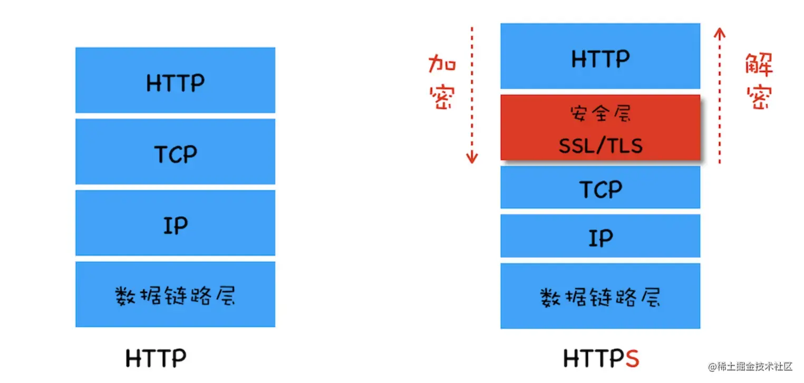 HTTP 协议采用**明文传输**信息，存在**信息窃听**、**信息篡改**和**信息劫持**的风险，而协议 TLS/SSL 具有**身份验证**、**信息加密**和**完整性校验**的功能，可以避免此类问题发生

安全层的主要职责就是**对发起的 HTTP 请求的数据进行加密操作** 和 **对接收到的 HTTP 的内容进行解密操作**

## \*02. TLS/SSL 的工作原理

**TLS**全称**安全传输层协议**（Transport Layer Security）及其前身**安全套接层**（Secure Sockets Layer，缩写作**SSL**） 是介于 TCP 和 HTTP 之间的一层安全协议，不影响原有的 TCP 协议和 HTTP 协议，所以使用 HTTPS 基本上不需要对 HTTP 页面进行太多的改造

TLS/SSL 的功能实现主要依赖三类基本算法：**散列函数 hash**、**对称加密**、**非对称加密**。这三类算法的作用如下

- 散列算法用来验证信息的完整性
- 对称加密算法采用协商的秘钥对数据加密
- 非对称加密实现身份认证和秘钥协商


## 5. HTTPS 通信（握手）过程

HTTPS 的通信过程如下：

1. 客户端向服务器发起请求，请求中包含使用的协议版本号、生成的一个随机数、以及客户端支持的加密方法。
2. 服务器端接收到请求后，确认双方使用的加密方法、并给出服务器的证书、以及一个服务器生成的随机数。
3. 客户端确认服务器证书有效后，生成一个新的随机数，并使用数字证书中的公钥，加密这个随机数，然后发给服 务器。并且还会提供一个前面所有内容的 hash 的值，用来供服务器检验。
4. 服务器使用自己的私钥，来解密客户端发送过来的随机数。并提供前面所有内容的 hash 值来供客户端检验。
5. 客户端和服务器端根据约定的加密方法使用前面的三个随机数，生成对话秘钥，以后的对话过程都使用这个秘钥来加密信息。

## 6. HTTPS 的优缺点

HTTPS 的**优点**如下：

- 使用 HTTPS 协议可以认证用户和服务器，确保数据发送到正确的客户端和服务器；
- 使用 HTTPS 协议可以进行加密传输、身份认证，通信更加安全，防止数据在传输过程中被窃取、修改，确保数据安全性；
- HTTPS 是现行架构下最安全的解决方案，虽然不是绝对的安全，但是大幅增加了中间人攻击的成本；

HTTPS 的**缺点**如下：

- HTTPS 需要做服务器和客户端双方的加密个解密处理，耗费更多服务器资源，过程复杂；
- HTTPS 协议握手阶段比较费时，增加页面的加载时间；
- SSL 证书是收费的，功能越强大的证书费用越高；
- HTTPS 连接服务器端资源占用高很多，支持访客稍多的网站需要投入更大的成本；
- SSL 证书需要绑定 IP，不能再同一个 IP 上绑定多个域名。

## \*09. 同样是重定向 307 303 302 的区别

**302**是 http1.0 的协议状态码，在 http1.1 版本的时候为了细化 302 状态码⼜出来了两个 303 和 307

**303**明确表示客户端应当采⽤ GET ⽅法获取资源，他会把 POST 请求变为 GET 请求进⾏重定向

**307**会遵照浏览器标准，不会从 POST 变为 GET

## 16. TCP 粘包是怎么回事，如何处理

默认情况下, TCP 连接会启⽤**延迟传送算法** (Nagle 算法), 在数据发送之前缓存他们. 如果短时间有多个数据发送, 会缓冲到⼀起作⼀次发送 (缓冲⼤⼩⻅ socket.bufferSize ), 这样可以减少 IO 消耗提⾼性能.

如果是传输⽂件的话, 那么根本不⽤处理粘包的问题, 来⼀个包拼⼀个包就好了。但是如果是多条消息, 或者是别的⽤途的数据那么就需要处理粘包.

⽽对于处理粘包的问题, 常⻅的解决⽅案有:

**多次发送之前间隔⼀个等待时间**：只需要等上⼀段时间再进⾏下⼀次 send 就好, 适⽤于交互频率特别低的场景. 缺点也很明显, 对于⽐较频繁的场景⽽⾔传输效率实在太低，不过⼏乎不⽤做什么处理.

**关闭 Nagle 算法**：关闭 Nagle 算法, 在 Node.js 中你可以通过 socket.setNoDelay() ⽅法来关闭 Nagle 算法, 让每⼀次 send 都不缓冲直接发送。该⽅法⽐较适⽤于每次发送的数据都⽐较⼤ (但不是⽂件那么⼤), 并且频率不是特别⾼的场景。如果是每次发送的数据量⽐较⼩, 并且频率特别⾼的, 关闭 Nagle 纯属⾃废武功。另外, 该⽅法不适⽤于⽹络较差的情况, 因为 Nagle 算法是在服务端进⾏的包合并情况, 但是如果短时间内客户端的⽹络情况不好, 或者应⽤层由于某些原因不能及时将 TCP 的数据 recv, 就会造成多个包在客户端缓冲从⽽粘包的情况。 (如果是在稳定的机房内部通信那么这个概率是⽐较⼩可以选择忽略的)

**进⾏封包/拆包：** 封包/拆包是⽬前业内常⻅的解决⽅案了。即给每个数据包在发送之前, 于其前/后放⼀些有特征的数据, 然后收到数据的时 候根据特征数据分割出来各个数据包。

## 17. token 是什么

1. token 也可以称做**令牌**，一般由 `uid+time+sign(签名)+[固定参数]` 组成

   ```makefile
   uid: 用户唯一身份标识
   time: 当前时间的时间戳
   sign: 签名, 使用 hash/encrypt 压缩成定长的十六进制字符串，以防止第三方恶意拼接
   固定参数(可选): 将一些常用的固定参数加入到 token 中是为了避免重复查库
   ```

2. token 在客户端一般存放于 localStorage，cookie，或 sessionStorage 中。在服务器一般存于数据库中

3. token 的认证流程

   ```css
   用户登录，成功后服务器返回Token给客户端。
   客户端收到数据后保存在客户端
   客户端再次访问服务器，将token放入headers中 或者每次的请求参数中
   服务器端采用filter过滤器校验。校验成功则返回请求数据，校验失败则返回错误码
   ```

4. token 可以抵抗 csrf，cookie+session 不行

5. session 是有状态的，一般存于服务器内存或硬盘中，当服务器采用分布式或集群时，session 就会面对负载均衡问题。负载均衡多服务器的情况，不好确认当前用户是否登录，因为多服务器不共享 session

6. 客户端登陆传递信息给服务端，服务端收到后把用户信息加密（token）传给客户端，客户端将 token 存放于 localStroage 等容器中。客户端每次访问都传递 token，服务端解密 token，就知道这个用户是谁了。通过 cpu 加解密，服务端就不需要存储 session 占用存储空间，就很好的解决负载均衡多服务器的问题了。这个方法叫做 JWT(Json Web Token)

## 18. token 是怎么加密的

1. 需要一个 secret（随机数）
2. 后端利用 secret 和加密算法(如：HMAC-SHA256)对 payload(如账号密码)生成一个字符串(token)，返回前端
3. 前端每次 request 在 header 中带上 token
4. 后端用同样的算法解密

## 19. cookie 和 token 都放在 header 中，为什么会劫持 cookie，不会劫持 token

- cookie：登陆后后端生成一个 sessionid 放在 cookie 中返回给客户端，并且服务端一直记录着这个 sessionid，客户端以后每次请求都会带上这个 sessionid，服务端通过这个 sessionid 来验证身份之类的操作。所以别人拿到了 cookie 就相当于拿到了 sessionid，就可以完全替代你。同时浏览器会自动携带 cookie。
- token：同样是登录后服务端返回一个 token，客户端保存起来，在以后 http 请求里手动的加入到请求头里，服务端根据 token 进行身份的校验。浏览器不会自动携带 token，所以不会劫持 token。

## <span style="color:red">20. token 过期后，页面如何实现无感刷新</span>

**什么是无感刷新**

后台返回的 token 是有时效性的，时间到了，你在交互后台的时候，后台会判断你的 token 是否过期（安全需要），如果过期了就会逼迫你重新登陆！

**token 无感刷新其本质是为了优化用户体验,当 token 过期时不需要用户跳回登录页重新登录,而是当 token 失效时,进行拦截,发送刷新 token 的 ajax,获取最新的 token 进行覆盖,让用户感受不到 token 已经过期**

**实现无感刷新**

1、后端返回过期时间，前端判断 token 过期时间,去调用刷新 token 接口。

缺点：需要后端额外提供一个 Token 过期时间的字段；使用了本地时间判断，若本地时间篡改，特别是本地时间比服务器时间慢时，拦截会失败。

2、写个定时器，定时刷新 Token 接口。缺点：浪费资源,消耗性能,不建议采用。

<span style="color:red">**3**、在响应拦截器中拦截，判断 Token 返回过期后，调用刷新 token 接口</span>

## 21. 介绍下 304 过程

- a. 浏览器请求资源时首先命中资源的 Expires 和 Cache-Control，Expires 受限于本地时间，如果修改了本地时间，可能会造成缓存失效，可以通过 Cache-control: max-age 指定最大生命周期，状态仍然返回 200，但不会请求数据，在浏览器中能明显看到 from cache 字样。
- b. 强缓存失效，进入协商缓存阶段，首先验证 ETagETag 可以保证每一个资源是唯一的，资源变化都会导致 ETag 变化。服务器根据客户端上送的 If-None-Match 值来判断是否命中缓存。
- c. 协商缓存 Last-Modify/If-Modify-Since 阶段，客户端第一次请求资源时，服务服返回的 header 中会加上 Last-Modify，Last-modify 是一个时间标识该资源的最后修改时间。再次请求该资源时，request 的请求头中会包含 If-Modify-Since，该值为缓存之前返回的 Last-Modify。服务器收到 If-Modify-Since 后，根据资源的最后修改时间判断是否命中缓存

## 22. token 和 cookie 的区别

1. HTTP 协议是无状态的，主要是为了让 HTTP 协议尽可能简单，使得它能够处理大量事务。HTTP/1.1 引入 Cookie 来保存状态信息。

   Cookie 是服务器发送到用户浏览器并保存在本地的一小块数据，它会在浏览器之后向同一服务器再次发起请求时被携带上，用于告知服务端两个请求是否来自同一浏览器。由于之后每次请求都会需要携带 Cookie 数据，因此会带来额外的性能开销（尤其是在移动环境下）。

   Cookie 曾一度用于客户端数据的存储，因为当时并没有其它合适的存储办法而作为唯一的存储手段，但现在随着现代浏览器开始支持各种各样的存储方式，Cookie 渐渐被淘汰。新的浏览器 API 已经允许开发者直接将数据存储到本地，如使用 Web storage API（本地存储和会话存储）或 IndexedDB。

2. Token 是服务端生成的一串字符串，以作客户端进行请求的一个令牌，当第一次登录后，服务器生成一个 Token 便将此 Token 返回给客户端，以后客户端只需带上这个 Token 前来请求数据即可，无需再次带上用户名和密码。

区别：

- token 和 cookie 一样都是首次登陆时，由服务器下发，都是当交互时进行验证的功能，作用都是为无状态的 HTTP 提供的持久机制。
- token 存在哪儿都行，localstorage 或者 cookie。
- 对于 token 而言，服务器不需要去查看你是谁，不需要保存你的会话。当用户 logout 的时候 cookie 和服务器的 session 都会注销；但是当 logout 时候 token 只是注销浏览器信息，不查库。
- token 优势在于，token 由于服务器端不存储会话，所以可扩展性强，token 还可用于 APP 中。

# 浏览器安全

## <span style="color:red">1. 有哪些可能引起前端安全的问题</span>

- <span style="color:red">**跨站脚本** (Cross-Site Scripting, XSS): ⼀种代码注⼊⽅式, 为了与 CSS 区分所以被称作 XSS。早期常⻅于⽹络论坛, 起因是⽹站没有对⽤户的输⼊进⾏严格的限制, 使得攻击者可以将脚本上传到帖⼦让其他⼈浏览到有恶意脚本的⻚⾯, 其注⼊⽅式很简单包括但不限于 JavaScript / CSS / Flash 等；</span>
- **iframe 的滥⽤**: iframe 中的内容是由第三⽅来提供的，默认情况下他们不受控制，他们可以在 iframe 中运⾏ JavaScirpt 脚本、Flash 插件、弹出对话框等等，这可能会破坏前端⽤户体验；
- **跨站点请求伪造**（Cross-Site Request Forgeries，CSRF）: 指攻击者通过设置好的陷阱，强制对已完成认证的⽤户进⾏⾮预期的个⼈信息或设定信息等某些状态更新，属于被动攻击
- **恶意第三⽅库**: ⽆论是后端服务器应⽤还是前端应⽤开发，绝⼤多数时候都是在借助开发框架和各种类库进⾏快速开发，⼀旦第三⽅库被植⼊恶意代码很容易引起安全问题。

## 2. 网络劫持有哪几种，如何防范

⽹络劫持分为两种:

（1）**DNS 劫持**: (输⼊京东被强制跳转到淘宝这就属于 dns 劫持)

- DNS 强制解析: 通过修改运营商的本地 DNS 记录，来引导⽤户流量到缓存服务器
- 302 跳转的⽅式: 通过监控⽹络出⼝的流量，分析判断哪些内容是可以进⾏劫持处理的,再对劫持的内存发起 302 跳转的回复，引导⽤户获取内容

（2）**HTTP 劫持**: (访问⾕歌但是⼀直有贪玩蓝⽉的⼴告),由于 http 明⽂传输,运营商会修改你的 http 响应内容(即加⼴告)

DNS 劫持由于涉嫌违法，已经被监管起来，现在很少会有 DNS 劫持，⽽ http 劫持依然⾮常盛⾏，最有效的办法就是全站 HTTPS，将 HTTP 加密，这使得运营商⽆法获取明⽂，就⽆法劫持你的响应内容。

## <span style="color:red">3. 进程与线程的概念</span>

从本质上说，进程和线程都是 CPU 工作时间片的一个描述：

- 进程描述了 CPU 在运行指令及加载和保存上下文所需的时间，放在应用上来说就代表了一个程序。
- 线程是进程中的更小单位，描述了执行一段指令所需的时间。

**进程是资源分配的最小单位，线程是 CPU 调度的最小单位。**

## 4. 进程和线程的区别

- 进程可以看做独立应用，线程不能
- **资源**：进程是 cpu 资源分配的最小单位（是能拥有资源和独立运行的最小单位）；线程是 cpu 调度的最小单位（线程是建立在进程的基础上的一次程序运行单位，一个进程中可以有多个线程）。
- **通信方面**：线程间可以通过直接共享同一进程中的资源，而进程通信需要借助 进程间通信。
- **调度**：进程切换比线程切换的开销要大。线程是 CPU 调度的基本单位，线程的切换不会引起进程切换，但某个进程中的线程切换到另一个进程中的线程时，会引起进程切换。
- **系统开销**：由于创建或撤销进程时，系统都要为之分配或回收资源，如内存、I/O 等，其开销远大于创建或撤销线程时的开销。同理，在进行进程切换时，涉及当前执行进程 CPU 环境还有各种各样状态的保存及新调度进程状态的设置，而线程切换时只需保存和设置少量寄存器内容，开销较小。

## 5. 如何实现浏览器内多个标签页之间的通信

实现多个标签页之间的通信，本质上都是通过中介者模式来实现的。因为标签页之间没有办法直接通信，因此我们可以找一个中介者，让标签页和中介者进行通信，然后让这个中介者来进行消息的转发。通信方法如下：

- **使用 websocket 协议**，因为 websocket 协议可以实现服务器推送，所以服务器就可以用来当做这个中介者。标签页通过向服务器发送数据，然后由服务器向其他标签页推送转发。
- **使用 ShareWorker 的方式**，shareWorker 会在页面存在的生命周期内创建一个唯一的线程，并且开启多个页面也只会使用同一个线程。这个时候共享线程就可以充当中介者的角色。标签页间通过共享一个线程，然后通过这个共享的线程来实现数据的交换。
- **使用 localStorage 的方式**，我们可以在一个标签页对 localStorage 的变化事件进行监听，然后当另一个标签页修改数据的时候，我们就可以通过这个监听事件来获取到数据。这个时候 localStorage 对象就是充当的中介者的角色。
- **使用 postMessage 方法**，如果我们能够获得对应标签页的引用，就可以使用 postMessage 方法，进行通信。

## 6. 为什么需要浏览器缓存

对于浏览器的缓存，主要针对的是前端的静态资源，在发起请求之后，拉取相应的静态资源，并保存在本地。如果服务器的静态资源没有更新，那么在下次请求的时候，就直接从本地读取即可，如果服务器的静态资源已经更新，那么我们再次请求的时候，就到服务器拉取新的资源，并保存在本地。这样就大大的减少了请求的次数，提高了网站的性能。这就要用到浏览器的缓存策略了。

所谓的**浏览器缓存**指的是浏览器将用户请求过的静态资源，存储到电脑本地磁盘中，当浏览器再次访问时，就可以直接从本地加载，不需要再去服务端请求了。

### 浏览器缓存的优点

使用浏览器缓存，有以下优点：

- 减少了服务器的负担，提高了网站的性能
- 加快了客户端网页的加载速度
- 减少了多余网络数据传输

## 7. 点击刷新按钮或者按 F5、按 Ctrl+F5 （强制刷新）、地址栏回车有什么区别

- **点击刷新按钮或者按 F5：** 浏览器直接对本地的缓存文件过期，但是会带上 If-Modifed-Since，If-None-Match，这就意味着服务器会对文件检查新鲜度，返回结果可能是 304，也有可能是 200。
- **用户按 Ctrl+F5（强制刷新）：** 浏览器不仅会对本地文件过期，而且不会带上 If-Modifed-Since，If-None-Match，相当于之前从来没有请求过，返回结果是 200。
- **地址栏回车**： 浏览器发起请求，按照正常流程，本地检查是否过期，然后服务器检查新鲜度，最后返回内容。

## 8. 浏览器渲染过程中遇到 JS 文件如何处理

JavaScript 的加载、解析与执行会阻塞文档的解析，也就是说，在构建 DOM 时，HTML 解析器若遇到了 JavaScript，那么它会暂停文档的解析，将控制权移交给 JavaScript 引擎，等 JavaScript 引擎运行完毕，浏览器再从中断的地方恢复继续解析文档。

也就是说，如果想要首屏渲染的越快，就越不应该在首屏就加载 JS 文件，这也是都建议将 script 标签放在 body 标签底部的原因。当然在当下，并不是说 script 标签必须放在底部，因为你可以给 script 标签添加 `defer` 或者 `async` 属性。

## 9. 什么是文档的预解析

Webkit 和 Firefox 都做了这个优化，当执行 JavaScript 脚本时，另一个线程解析剩下的文档，并加载后面需要通过网络加载的资源。这种方式可以使资源并行加载从而使整体速度更快。需要注意的是，预解析并不改变 DOM 树，它将这个工作留给主解析过程，自己只解析外部资源的引用，比如外部脚本、样式表及图片。

## 10. CSS 如何阻塞文档解析

理论上，既然样式表不改变 DOM 树，也就没有必要停下文档的解析等待它们。然而，存在一个问题，JavaScript 脚本执行时可能在文档的解析过程中请求样式信息，如果样式还没有加载和解析，脚本将得到错误的值，显然这将会导致很多问题。

所以**如果浏览器尚未完成 CSSOM 的下载和构建，而我们却想在此时运行脚本，那么浏览器将延迟 JavaScript 脚本执行和文档的解析，直至其完成 CSSOM 的下载和构建。** 也就是说，在这种情况下，浏览器会先下载和构建 CSSOM，然后再执行 JavaScript，最后再继续文档的解析。

## <span style="color:red">\*11. 浏览器本地存储的方式</span>

### cookie

Cookie 是最早被提出来的本地存储方式，在此之前，服务端是无法判断网络中的两个请求是否是同一用户发起的，为解决这个问题，Cookie 就出现了。**Cookie 的大小只有 4kb**，它是一种纯文本文件，**每次发起 HTTP 请求都会携带 Cookie。**

**Cookie 的特性：**

- Cookie 一旦创建成功，名称就无法修改
- Cookie 是无法跨域名的，也就是说 a 域名和 b 域名下的 cookie 是无法共享的，这也是由 Cookie 的隐私安全性决定的，这样就能够阻止非法获取其他网站的 Cookie
- 每个域名下 Cookie 的数量不能超过 20 个，每个 Cookie 的大小不能超过 4kb
- 有安全问题，如果 Cookie 被拦截了，那就可获得 session 的所有信息，即使加密也于事无补，无需知道 cookie 的意义，只要转发 cookie 就能达到目的
- Cookie 在请求一个新的页面的时候都会被发送过去

**如果需要域名之间跨域共享 Cookie，有两种方法：**

1. 使用 Nginx 反向代理
2. 在一个站点登陆之后，往其他网站写 Cookie。服务端的 Session 存储到一个节点，Cookie 存储 sessionId

### localStorage

LocalStorage 是 HTML5 新引入的特性，由于有的时候我们存储的信息较大，Cookie 就不能满足我们的需求，这时候 LocalStorage 就派上用场了。

**LocalStorage 的优点：**

- 在大小方面，LocalStorage 的大小一般为 5MB，可以储存更多的信息
- LocalStorage 是持久储存，并不会随着页面的关闭而消失，除非主动清理，不然会永久存在
- 仅储存在本地，不像 Cookie 那样每次 HTTP 请求都会被携带

**LocalStorage 的缺点：**

- 存在浏览器兼容问题，IE8 以下版本的浏览器不支持
- 如果浏览器设置为隐私模式，那我们将无法读取到 LocalStorage
- LocalStorage 受到同源策略的限制，即端口、协议、主机地址有任何一个不相同，都不会访问

### sessionStorage

SessionStorage 和 LocalStorage 都是在 HTML5 才提出来的存储方案，SessionStorage 主要用于临时保存同一窗口(或标签页)的数据，刷新页面时不会删除，关闭窗口或标签页之后将会删除这些数据。

**SessionStorage 与 LocalStorage 对比：**

- SessionStorage 和 LocalStorage 都在**本地进行数据存储**；
- SessionStorage 也有同源策略的限制，但是 SessionStorage 有一条更加严格的限制，SessionStorage**只有在同一浏览器的同一窗口下才能够共享**；
- LocalStorage 和 SessionStorage**都不能被爬虫爬取**；

## \*12. cookie localStorage sessionStorage 区别

## <span style="color:red">13.什么是同源策略，什么是跨域</span>

**同源策略：protocol（协议）、domain（域名）、port（端口）三者必须一致。**

**同源政策主要限制了三个方面：**

- 当前域下的 js 脚本不能够访问其他域下的 cookie、localStorage 和 indexDB。
- 当前域下的 js 脚本不能够操作访问操作其他域下的 DOM。
- 当前域下 ajax 无法发送跨域请求。

同源政策的目的主要是为了保证用户的信息安全，它只是对 js 脚本的一种限制，并不是对浏览器的限制，对于一般的 img、或者 script 脚本请求都不会有跨域的限制，这是因为这些操作都不会通过响应结果来进行可能出现安全问题的操作。

**什么是跨域**

指的是浏览器不能执行其他网站的脚本，它是由浏览器的同源策略造成的,是浏览器对 javascript 施加的安全限制，防止他人恶意攻击网站

**跨域问题其实就是浏览器的同源策略造成的。**

## <span style="color:red">14. 如何解决跨越问题</span>

### <span style="color:red">**CORS**</span>

CORS 需要浏览器和服务器同时支持，整个 CORS 过程都是浏览器完成的，无需用户参与。因此实现**CORS 的关键就是服务器，只要服务器实现了 CORS 请求**，就可以跨源通信了。

### <span style="color:red">**JSONP**</span>

**jsonp**的原理就是利用`<script>`标签没有跨域限制，通过`<script>`标签 src 属性，发送带有 callback 参数的 GET 请求，服务端将接口返回数据拼凑到 callback 函数中，返回给浏览器，浏览器解析执行，从而前端拿到 callback 函数返回的数据

**优点**

- 实现简单
- 兼容性好, 可用于解决主流浏览器的跨域数据访问的问题。

**缺点**

- 只支持 GET 请求 ( 因为
- 存在被 XSS 攻击的可能, 缺乏安全性保证
- 需要服务端配合改造

### **postMessage**

postMessage 是 HTML5 XMLHttpRequest Level 2 中的 API，且是为数不多可以跨域操作的 window 属性之一，它可用于解决以下方面的问题：

- 页面和其打开的新窗口的数据传递
- 多窗口之间消息传递
- 页面与嵌套的 iframe 消息传递
- 上面三个场景的跨域数据传递

用法：postMessage(data,origin)方法接受两个参数：

- **data**： html5 规范支持任意基本类型或可复制的对象，但部分浏览器只支持字符串，所以传参时最好用 JSON.stringify()序列化。
- **origin**： 协议+主机+端口号，也可以设置为"\*"，表示可以传递给任意窗口，如果要指定和当前窗口同源的话设置为"/"。

###

### **Node 中间件代理(proxy 正向代理)(两次跨域)**

实现原理：**同源策略是浏览器需要遵循的标准，而如果是服务器向服务器请求就无需遵循同源策略。** 代理服务器，需要做以下几个步骤：

- 接受客户端请求 。
- 将请求 转发给服务器。
- 拿到服务器 响应 数据。

### **nginx 反向代理**

实现原理类似于 Node 中间件代理，需要你搭建一个中转 nginx 服务器，用于转发请求。

使用 nginx 反向代理实现跨域，是最简单的跨域方式。只需要修改 nginx 的配置即可解决跨域问题，支持所有浏览器，支持 session，不需要修改任何代码，并且不会影响服务器性能。

实现思路：通过 nginx 配置一个代理服务器（域名与 domain1 相同，端口不同）做跳板机，反向代理访问 domain2 接口，并且可以顺便修改 cookie 中 domain 信息，方便当前域 cookie 写入，实现跨域登录。

es6 中 proxy.代理（vue 中配置 tar）

## 15. 正向代理和反向代理的区别

- **正向代理：**

客户端想获得一个服务器的数据，但是因为种种原因无法直接获取。于是客户端设置了一个代理服务器，并且指定目标服务器，之后代理服务器向目标服务器转交请求并将获得的内容发送给客户端。这样本质上起到了对真实服务器隐藏真实客户端的目的。实现正向代理需要修改客户端，比如修改浏览器配置。

- **反向代理：**

服务器为了能够将工作负载分不到多个服务器来提高网站性能 (负载均衡)等目的，当其受到请求后，会首先根据转发规则来确定请求应该被转发到哪个服务器上，然后将请求转发到对应的真实服务器上。这样本质上起到了对客户端隐藏真实服务器的作用。 一般使用反向代理后，需要通过修改 DNS 让域名解析到代理服务器 IP，这时浏览器无法察觉到真正服务器的存在，当然也就不需要修改配置了。

： 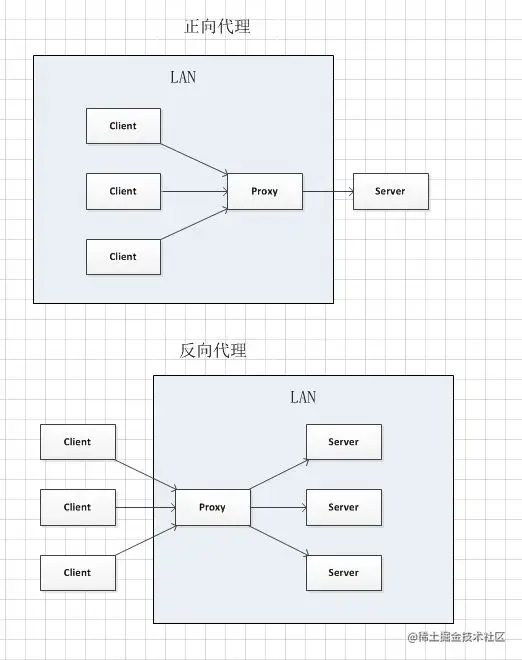

## 16. 前端安全了解吗，说一下 XSS 和 CSRF，以及怎么规避

**XSS**：`跨域脚本攻击`

<span style="color:red">XSS 攻击指的是跨站脚本攻击，是一种代码注入攻击。攻击者通过在网站注入恶意脚本，使之在用户的浏览器上运行，从而盗取用户的信息如 cookie 等。</span>span>

XSS 的本质是因为网站没有对恶意代码进行过滤，与正常的代码混合在一起了，浏览器没有办法分辨哪些脚本是可信的，从而导致了恶意代码的执行。

攻击者可以通过这种攻击方式可以进行以下操作：

- 获取页面的数据，如 DOM、cookie、localStorage；
- DOS 攻击，发送合理请求，占用服务器资源，从而使用户无法访问服务器；
- 破坏页面结构；
- 流量劫持（将链接指向某网站）；

**防御方法**

可以从浏览器的执行来进行预防，一种是使用纯前端的方式，不用服务器端拼接后返回（不使用服务端渲染）。另一种是对需要插入到 HTML 中的代码做好充分的转义。对于 DOM 型的攻击，主要是前端脚本的不可靠而造成的，对于数据获取渲染和字符串拼接的时候应该对可能出现的恶意代码情况进行判断。

<span style="color:red">(背标题)**CSRF**：`跨站请求伪造`</span>

CSRF 攻击指的是**跨站请求伪造攻击**，攻击者诱导用户进入一个第三方网站，然后该网站向被攻击网站发送跨站请求。如果用户在被攻击网站中保存了登录状态，那么攻击者就可以利用这个登录状态，绕过后台的用户验证，冒充用户向服务器执行一些操作。

CSRF 攻击的**本质是利用 cookie 会在同源请求中携带发送给服务器的特点，以此来实现用户的冒充。**

**CSRF 攻击可以使用以下方法来防护：**

- **进行同源检测**，服务器根据 http 请求头中 origin 或者 referer 信息来判断请求是否为允许访问的站点，从而对请求进行过滤。
- **使用 CSRF Token 进行验证**，服务器向用户返回一个随机数 Token ，当网站再次发起请求时，在请求参数中加入服务器端返回的 token ，然后服务器对这个 token 进行验证。
- **对 Cookie 进行双重验证**，服务器在用户访问网站页面时，向请求域名注入一个 Cookie，内容为随机字符串，然后当用户再次向服务器发送请求的时候，从 cookie 中取出这个字符串，添加到 URL 参数中，然后服务器通过对 cookie 中的数据和参数中的数据进行比较，来进行验证。
- **在设置 cookie 属性的时候设置 Samesite ，限制 cookie 不能作为被第三方使用**，从而可以避免被攻击者利用。Samesite 一共有两种模式，一种是严格模式，在严格模式下 cookie 在任何情况下都不可能作为第三方 Cookie 使用，在宽松模式下，cookie 可以被请求是 GET 请求，且会发生页面跳转的请求所使用。

### 什么是中间人攻击？

中间⼈ (Man-in-the-middle attack, MITM) 是指攻击者与通讯的两端分别创建独⽴的联系, 并交换其所收到的数据, 使通讯的两端认为他们正在通过⼀个私密的连接与对⽅直接对话, 但事实上整个会话都被攻击者完全控制。在中间⼈攻击中，攻击者可以拦截通讯双⽅的通话并插⼊新的内容。

攻击过程如下:

- 客户端发送请求到服务端，请求被中间⼈截获
- 服务器向客户端发送公钥
- 中间⼈截获公钥，保留在⾃⼰⼿上。然后⾃⼰⽣成⼀个**伪造的**公钥，发给客户端
- 客户端收到伪造的公钥后，⽣成加密 hash 值发给服务器
- 中间⼈获得加密 hash 值，⽤⾃⼰的私钥解密获得真秘钥,同时⽣成假的加密 hash 值，发给服务器
- 服务器⽤私钥解密获得假密钥,然后加密数据传输给客户端

## <span style="color:red">17. 浏览器是如何进行界面渲染的？浏览器的渲染机制</span>

不同的渲染引擎的具体做法稍有差异，但是大体流程都是差不多的，下面以 chrome 渲染引擎 的 渲染流程来说明：

1. 获取 HTML ⽂件并进⾏解析，生成一棵 DOM 树（DOM Tree）
2. 解析 HTML 的同时也会解析 CSS，⽣成样式规则（Style Rules）
3. 根据 DOM 树和样式规则，生成一棵渲染树（Render Tree）
4. 进行布局（Layout）(重排)，即为每个节点分配⼀个在屏幕上应显示的确切坐标位置
5. 进⾏绘制（Paint）(重绘)，遍历渲染树节点，调⽤ GPU(图形处理器) 将元素呈现出来

## <span style="color:red">(背)18. 前端如何实现即时通讯？websocket</span>

```
严格意义上: HTTP协议只能做到客户端请求服务器, 服务器做出响应, 做不到让服务器主动给客户端推送消息!
```

**那么如果服务器数据更新了, 想要即时通知到客户端怎么办呢 ? (即时通信需求)**

<span style="color:red">(背)即时通信需求: 服务器数据一有更新, 希望推送给到浏览器</span>

提问的回答重心:

1. 即时通信有哪些方案?
2. 为什么使用了其中某一个方案! websocket

基于 Web 的前端，存在以下几种可实现即时通讯的方式：

- 短轮询 (历史方案)

  开个定时器, 每隔一段时间发请求 (实时性不强，影响性能)

- Comet - ajax 长轮询(历史方案)

  发送一个请求, 服务器只要数据不更新, 就一直阻塞 (服务器压力过大)

- SSE

  (利用了 http 协议, 流数据的传输, 并不是严格意义的双向通信, 无法复用连接)

- WebSocket (主流)

  性能和效率都高!

## 19. 说一下 websocket

<span style="color:red">(背)**websocket 是一种网络通信协议**，HTTP 协议无法实现服务器主动向客户端发起消息，websocket 连接允许客户端和服务器之间进行全双工通信，以便任一方都可以通过建立的连接将数据推送到另一端。websocket 只需要建立一次连接，就可以一直保持连接状态</span>

## 19.2 什么是轮询

**轮询：隔一段时间进行一次查询或者询问**

轮询分为长轮询和短轮询，长轮询是基于短轮询的一个优化结果。

**短轮询：**

通过客户端定期轮询来询问服务端是否有新的信息产生，如果有则返回，没有就不响应， 缺点：也是显而易见，轮询间隔大了则信息不够实时，轮询间隔过小又会消耗过多的流量，增加服务器的负担。

**长轮询：**

是需要服务端进行更改来进行支持，客户端向服务端发送请求时，如果此时服务端没有新的信息产生，并不立刻返回，而是`Hold`住一段时间等有新的信息或者超时再返回，客户端收到服务器的应答后继续轮询。可以看到长轮询比短轮询可以减少大量无用的请求，并且客户端接收取新消息也会实时不少。减少`http`请求对性能的优化是很有利的，所以他是短轮询上的一个优化 缺点：终归来讲还是一个`http`请求，只是进行了变化而已，而且如果客户端不请求，服务端有数据的话，也会一直累积在那，不能实现实时的双向通信

此时的`webSocket`也就**应需而生**了

## <span style="color:red">(背)20. 前端怎么做 SEO 优化</span>

**什么是 SEO**

<span style="color:red">(背)SEO(Search Engine Optimization)，即搜索引擎优化。</span>SEO 是随着搜索引擎的出现而来的，两者是相互促进，互利共生的关系。SEO 的存在就是为了提升网页在搜索引擎自然搜索结果中的收录数量以及排序位置而做的优化行为。而优化的目的就是为了提升网站在搜索引擎中的权重，增加对搜索引擎的友好度，使得用户在访问网站时能排在前面。

**为什么要做 SEO**

提高网站的权重，增强搜索引擎友好度，以达到提高排名，增加流量，改善（潜在）用户体验，促进销售的作用。

<span style="color:red">(背)**前端怎么做 SEO 优化**</span>

1. 网站结构布局优化: 尽量简单
   - 控制首页链接数量
   - 网页层级不要太深
   - 控制页面大小, 减少 HTTP 请求, 提高网站的加载速度
   - <span style="color:red">(背)尽量使用语义化标签</span>
   - <span style="color:red">(背)利用浏览器缓存</span>

# JS

## 1. js 有哪些数据类型

JavaScript 共有八种数据类型

基本数据类型： Undefined、Null、Boolean、Number、String、Symbol、BigInt

引用数据类型：Object Function Array

其中 Symbol 和 BigInt 是 ES6 中新增的数据类型：

- Symbol 代表创建后独一无二且不可变的数据类型，它主要是为了解决可能出现的全局变量冲突的问题。

  Symbol 不可以使用 new 关键字调用

  ```js
  const res = Symbol() // Symbol()
  ```

- BigInt 是一种数字类型的数据，它可以表示任意精度格式的整数，使用 BigInt 可以安全地存储和操作大整数，即使这个数已经超出了 Number 能够表示的安全整数范围。

## 2. 说说你对栈区和堆区的理解

**在操作系统中，内存被分为栈区和堆区**

- 栈区内存由编译器自动分配释放，存放函数的参数值，局部变量的值等。其操作方式类似于数据结构中的栈。
- 堆区内存一般由开发着分配释放，若开发者不释放，程序结束时可能由垃圾回收机制回收。

**在数据结构中**

- 在数据结构中，栈中数据的存取方式为先进后出。
- 堆是一个优先队列，是按优先级来进行排序的，优先级可以按照大小来规定。

**数据的储存方式**

- 原始数据类型直接存储在栈（stack）中的简单数据段，占据空间小、大小固定，属于被频繁使用数据，所以放入栈中存储
- 引用数据类型存储在堆（heap）中的对象，占据空间大、大小不固定。如果存储在栈中，将会影响程序运行的性能；引用数据类型在栈中存储了指针，该指针指向堆中该实体的起始地址。当解释器寻找引用值时，会首先检索其在栈中的地址，取得地址后从堆中获得实体

## 3. 数据类型检测的方式有哪些

判断数据类型的方法一般可以通过：**typeof**、**instanceof**、**constructor**、**toString**四种常用方法

| 不同类型的优缺点 | typeof                                                        | instanceof                          | constructor                                    | Object.prototype.toString.call        |
| ---------------- | ------------------------------------------------------------- | ----------------------------------- | ---------------------------------------------- | ------------------------------------- |
| 优点             | 使用简单                                                      | 能检测出`引用类型`                  | 基本能检测所有的类型（除了 null 和 undefined） | 检测出所有的类型                      |
| 缺点             | 只能检测出除 null 外的基本数据类型和引用数据类型中的 function | 不能检测出基本类型，且不能跨 iframe | constructor 易被修改，也不能跨 iframe          | IE6 下，undefined 和 null 均为 Object |

## \*04. 判断数组的方式有哪些

通过 Object.prototype.toString.call()做判断

通过 ES6 的 Array.isArray()做判断

```js
Array.isArray([]) // true
Array.isArray("a") // false
```

## 5. null 和 undefined 区别

- 首先 Undefined 和 Null 都是基本数据类型，这两个基本数据类型分别都只有一个值，就是 undefined 和 null
- undefined 代表的含义是**未定义**，null 代表的含义是**空对象**。一般变量声明了但还没有定义的时候会返回 undefined，null 主要用于赋值给一些可能会返回对象的变量，作为初始化
- undefined 在 JavaScript 中不是一个保留字，这意味着可以使用 undefined 来作为一个变量名，但是这样的做法是非常危险的，它会影响对 undefined 值的判断。我们可以通过一些方法获得安全的 undefined 值，比如说 void 0
- 当对这两种类型使用 typeof 进行判断时，Null 类型化会返回 “object”，这是一个历史遗留的问题。当使用双等号对两种类型的值进行比较时会返回 true，使用三个等号时会返回 false

## 6. typeof null 的结果是什么 为什么

typeof null 的结果是 Object

在 JavaScript 第一个版本中，所有值都存储在 32 位的单元中，每个单元包含一个小的 **类型标签(1-3 bits)** 以及当前要存储值的真实数据。类型标签存储在每个单元的低位中，共有五种数据类型

```php
000: object   - 当前存储的数据指向一个对象。
  1: int      - 当前存储的数据是一个 31 位的有符号整数。
010: double   - 当前存储的数据指向一个双精度的浮点数。
100: string   - 当前存储的数据指向一个字符串。
110: boolean  - 当前存储的数据是布尔值。
复制代码
```

如果最低位是 1，则类型标签标志位的长度只有一位；如果最低位是 0，则类型标签标志位的长度占三位，为存储其他四种数据类型提供了额外两个 bit 的长度

有两种特殊数据类型：

- undefined 的值是 (-2)30(一个超出整数范围的数字)
- null 的值是机器码 NULL 指针(null 指针的值全是 0)

那也就是说 null 的类型标签也是 000，和 Object 的类型标签一样，所以会被判定为 Object

## 7. 为什么 0.1+0.2 ! == 0.3，如何让其相等 (精度丢失)

计算机是通过二进制的方式存储数据的，所以计算机计算 0.1+0.2 的时候，实际上是计算的两个数的二进制的和。

在 Js 中只有一种数字类型：Number，它的实现遵循 IEEE 754 标准，使用 64 位固定长度来表示，也就是标准的 double 双精度浮点数。在二进制科学表示法中，双精度浮点数的小数部分最多只能保留 52 位，再加上前面的 1，其实就是保留 53 位有效数字，剩余的需要舍去，遵从“0 舍 1 入”的原则。

根据这个原则，0.1 和 0.2 的二进制数相加，再转化为十进制数就是：`0.30000000000000004`。所以不相等

解决方法就是设置一个误差范围，通常称为“机器精度”。对 JavaScript 来说，这个值通常为 2-52，在 ES6 中，提供了`Number.EPSILON`属性，而它的值就是 2-52，只要判断`0.1+0.2-0.3`是否小于`Number.EPSILON`，如果小于，就可以判断为 0.1+0.2 ===0.3

```javascript
// Math.abs()函数返回一个数字的绝对值

function numberepsilon(arg1, arg2) {
  return Math.abs(arg1 - arg2) < Number.EPSILON
}

console.log(numberepsilon(0.1 + 0.2, 0.3)) // true
```

## 8. 如何获取安全的 undefined 值

因为 undefined 是一个标识符，所以可以被当作变量来使用和赋值，但是这样会影响 undefined 的正常判断。表达式 void \_\_\_ 没有返回值，因此返回结果是 undefined。void 并不改变表达式的结果，只是让表达式不返回值。因此可以用 void 0 来获得 undefined

## 9. typeof NaN 的结果是什么

NaN 指不是一个数字（not a number），NaN 是一个警戒值（sentinel value，有特殊用途的常规值），用于指出数字类型中的错误情况，即执行数学运算没有成功，这是失败后返回的结果

```csharp
typeof NaN // 'number'
```

NaN 是一个特殊值，它和自身不相等，是唯一一个非自反的值。所谓的非自反就是说，NaN 与谁都不相等，包括它本身，但在 NaN ！= NaN 下会返回 true

## 10. isNaN 和 Number.isNaN 函数的区别

- 函数 isNaN 接收参数后，会尝试将这个参数转换为数值，任何不能被转换为数值的的值都会返回 true，因此非数字值传入也会返回 true ，会影响 NaN 的判断
- 函数 Number.isNaN 会首先判断传入参数是否为数字，如果是数字再继续判断是否为 NaN ，不会进行数据类型的转换，这种方法对于 NaN 的判断更为准确

## 11. == 操作符的强制类型转换规则是什么

对于 `==` 来说，如果对比双方的类型**不一样**，就会进行**类型转换**。假如对比 `x` 和 `y` 是否相同，就会进行如下判断流程：

1. 首先会判断两者类型是否**相同，** 相同的话就比较两者的大小；
2. 类型不相同的话，就会进行类型转换；
3. 会先判断是否在对比 `null` 和 `undefined`，是的话就会返回 `true`
4. 判断两者类型是否为 `string` 和 `number`，是的话就会将字符串转换为 `number`

```ini
1 == '1'
      ↓
1 ==  1
复制代码
```

1. 判断其中一方是否为 `boolean`，是的话就会把 `boolean` 转为 `number` 再进行判断

```ini
'1' == true
        ↓
'1' ==  1
        ↓
 1  ==  1
复制代码
```

1. 判断其中一方是否为 `object` 且另一方为 `string`、`number` 或者 `symbol`，是的话就会把 `object` 转为原始类型再进行判断

```ini
'1' == { name: 'js' }        ↓'1' == '[object Object]'
复制代码
```

其流程图如下：


## 12. 其他值类型转成字符串的转换规则

- Null 和 Undefined 类型 ，null 转换为 "null"，undefined 转换为 "undefined"，
- Boolean 类型，true 转换为 "true"，false 转换为 "false"。
- Number 类型的值直接转换，不过那些极小和极大的数字会使用指数形式。
- Symbol 类型的值直接转换，但是只允许显式强制类型转换，使用隐式强制类型转换会产生错误。
- 对普通对象来说，除非自行定义 toString() 方法，否则会调用 toString()（Object.prototype.toString()）来返回内部属性 [[Class]] 的值，如"[object Object]"。如果对象有自己的 toString() 方法，字符串化时就会调用该方法并使用其返回值。

## 13. 其他值类型转成数字的转换规则

- Undefined 类型的值转换为 NaN。
- Null 类型的值转换为 0。
- Boolean 类型的值，true 转换为 1，false 转换为 0。
- String 类型的值转换如同使用 Number() 函数进行转换，如果包含非数字值则转换为 NaN，空字符串为 0。
- Symbol 类型的值不能转换为数字，会报错。
- 对象（包括数组）会首先被转换为相应的基本类型值，如果返回的是非数字的基本类型值，则再遵循以上规则将其强制转换为数字。

为了将值转换为相应的基本类型值， 隐式转换会首先检查该值是否有 valueOf()方法。如果有并且返回基本类型值，就使用该值进行强制类型转换。如果没有就使用 toString() 的返回值（如果存在）来进行强制类型转换。

如果 valueOf() 和 toString() 均不返回基本类型值，会产生 TypeError 错误。

## 14. 其他值类型转成布尔类型的转换规则

以下这些是假值： undefined 、 null 、 false 、 +0、-0 和 NaN 、 ""

假值的布尔强制类型转换结果为 false。从逻辑上说，假值列表以外的都应该是真值。

## 15. ||和&&操作符的返回值

|| 和 && 首先会对第一个操作数执行条件判断，如果其不是布尔值就先强制转换为布尔类型，然后再执行条件判断。

- 对于 || 来说，如果条件判断结果为 true 就返回第一个操作数的值，如果为 false 就返回第二个操作数的值。
- && 则相反，如果条件判断结果为 true 就返回第二个操作数的值，如果为 false 就返回第一个操作数的值。

|| 和 && 返回它们其中一个操作数的值，而非条件判断的结果

## 16. Object.is() 与比较操作符 “===”、“==” 的区别

- 使用双等号（==）进行相等判断时，如果两边的类型不一致，则会进行强制类型转化后再进行比较。
- 使用三等号（===）进行相等判断时，如果两边的类型不一致时，不会做强制类型准换，直接返回 false。
- 使用 Object.is 来进行相等判断时，一般情况下和三等号的判断相同，它处理了一些特殊的情况，比如 -0 和 +0 不再相等，两个 NaN 是相等的。

## 17. 什么是 JavaScript 中的包装类型

在 JavaScript 中，基本类型是没有属性和方法的，但是为了便于操作基本类型的值，在调用基本类型的属性或方法时 JavaScript 会在后台隐式地将基本类型的值转换为对象。如：

```ini
const a = "abc";
a.length; // 3
复制代码
```

在访问`'abc'.length`时，JavaScript 将`'abc'`在后台转换成`String('abc')`，然后再访问其`length`属性。

## \*18. js 中隐式转换规则

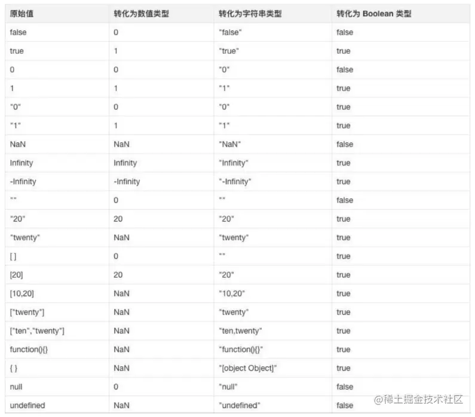

坑：判断时，尽量不要用==，要用===( 两个等号判断，如果类型不同，默认会进行隐式类型转换再比较)

## \*19. 说说你对 this 的理解

## 20. 如何判断 this 的指向

- 第一种是**函数调用模式**，当一个函数不是一个对象的属性时，直接作为函数来调用时，this 指向全局对象。
- 第二种是**方法调用模式**，如果一个函数作为一个对象的方法来调用时，this 指向这个对象。
- 第三种是**构造器调用模式**，如果一个函数用 new 调用时，函数执行前会新创建一个对象，this 指向这个新创建的对象。
- 第四种是 **apply 、 call 和 bind 调用模式**，这三个方法都可以显示的指定调用函数的 this 指向。其中 apply 方法接收两个参数：一个是 this 绑定的对象，一个是参数数组。call 方法接收的参数，第一个是 this 绑定的对象，后面的其余参数是传入函数执行的参数。也就是说，在使用 call() 方法时，传递给函数的参数必须逐个列举出来。bind 方法通过传入一个对象，返回一个 this 绑定了传入对象的新函数。这个函数的 this 指向除了使用 new 时会被改变，其他情况下都不会改变。

#### **this 绑定的优先级**

new 绑定优先级 > 显示绑定优先级 > 隐式绑定优先级 > 默认绑定优先级

## 21. Map 和 Object 的区别

|          | Map                                                                        | Object                                                                      |
| -------- | -------------------------------------------------------------------------- | --------------------------------------------------------------------------- |
| 意外的键 | Map 默认情况不包含任何键，只包含显式插入的键。                             | Object 有一个原型, 原型链上的键名有可能和自己在对象上的设置的键名产生冲突。 |
| 键的类型 | Map 的键可以是任意值，包括函数、对象或任意基本类型。                       | Object 的键必须是 String 或是 Symbol。                                      |
| 键的顺序 | Map 中的 key 是有序的。因此，当迭代的时候， Map 对象以插入的顺序返回键值。 | Object 的键是无序的                                                         |
| Size     | Map 的键值对个数可以轻易地通过 size 属性获取                               | Object 的键值对个数只能手动计算                                             |
| 迭代     | Map 是 iterable 的，所以可以直接被迭代。                                   | 迭代 Object 需要以某种方式获取它的键然后才能迭代。                          |
| 性能     | 在频繁增删键值对的场景下表现更好。                                         | 在频繁添加和删除键值对的场景下未作出优化。                                  |

## 22. 说说你对 JSON 的理解

JSON 是一种基于文本的轻量级的数据交换格式。它可以被任何的编程语言读取和作为数据格式来传递。

在项目开发中，使用 JSON 作为前后端数据交换的方式。在前端通过将一个符合 JSON 格式的数据结构序列化为 JSON 字符串，然后将它传递到后端，后端通过 JSON 格式的字符串解析后生成对应的数据结构，以此来实现前后端数据的一个传递。

因为 JSON 的语法是基于 js 的，因此很容易将 JSON 和 js 中的对象弄混，但是应该注意的是 JSON 和 js 中的对象不是一回事，JSON 中对象格式更加严格，比如说在 JSON 中属性值不能为函数，不能出现 NaN 这样的属性值等，因此大多数的 js 对象是不符合 JSON 对象的格式的。

在 js 中提供了两个函数来实现 js 数据结构和 JSON 格式的转换处理，

- **JSON.stringify** 函数，通过传入一个符合 JSON 格式的数据结构，将其转换为一个 JSON 字符串。如果传入的数据结构不符合 JSON 格式，那么在序列化的时候会对这些值进行对应的特殊处理，使其符合规范。在前端向后端发送数据时，可以调用这个函数将数据对象转化为 JSON 格式的字符串。
- **JSON.parse()** 函数，这个函数用来将 JSON 格式的字符串转换为一个 js 数据结构，如果传入的字符串不是标准的 JSON 格式的字符串的话，将会抛出错误。当从后端接收到 JSON 格式的字符串时，可以通过这个方法来将其解析为一个 js 数据结构，以此来进行数据的访问。

## 23. String 和 JSON.stringify 的区别

```javascript
console.log(String("abc")) // abc
console.log(JSON.stringify("abc")) // "abc"

console.log(String({ key: "value" })) // [object Object]
console.log(JSON.stringify({ key: "value" })) // {"key":"value"}

console.log(String([1, 2, 3])) // 1,2,3
console.log(JSON.stringify([1, 2, 3])) // [1,2,3]

const obj = {
  title: "devpoint",
  toString() {
    return "obj"
  },
}
console.log(String(obj)) // obj
console.log(JSON.stringify(obj)) // {"title":"devpoint"}
复制代码
```

- 当需要将一个数组和一个普通对象转换为字符串时，经常使用`JSON.stringify`。
- 如果需要对象的`toString`方法被重写，则需要使用 String()。
- 在其他情况下，使用`String()`将变量转换为字符串。

## \*24. 伪数组(类数组)

https://www.jianshu.com/p/8e1660a2162c

## 25. Unicode、UTF-8、UTF-16、UTF-32 的区别

- `Unicode` 是编码字符集（字符集），而`UTF-8`、`UTF-16`、`UTF-32`是字符集编码（编码规则）；
- `UTF-16` 使用变长码元序列的编码方式，相较于定长码元序列的`UTF-32`算法更复杂，甚至比同样是变长码元序列的`UTF-8`也更为复杂，因为其引入了独特的**代理对**这样的代理机制；
- `UTF-8`需要判断每个字节中的开头标志信息，所以如果某个字节在传送过程中出错了，就会导致后面的字节也会解析出错；而`UTF-16`不会判断开头标志，即使错也只会错一个字符，所以容错能力教强；
- 如果字符内容全部英文或英文与其他文字混合，但英文占绝大部分，那么用`UTF-8`就比`UTF-16`节省了很多空间；而如果字符内容全部是中文这样类似的字符或者混合字符中中文占绝大多数，那么`UTF-16`就占优势了，可以节省很多空间；

### 26. 常见的位运算符有哪些 其计算规则是什么

现代计算机中数据都是以二进制的形式存储的，即 0、1 两种状态，计算机对二进制数据进行的运算加减乘除等都是叫位运算，即将符号位共同参与运算的运算。

常见的位运算有以下几种：

| 运算符 | 描述 | 运算规则                                                   |     |
| ------ | ---- | ---------------------------------------------------------- | --- |
| `&`    | 与   | 两个位都为 1 时，结果才为 1                                |     |
| `      | 或   | 两个位都为 0 时，结果才为 0                                |     |
| `^`    | 异或 | 两个位相同为 0，相异为 1                                   |     |
| `~`    | 取反 | 0 变 1，1 变 0                                             |     |
| `<<`   | 左移 | 各二进制位全部左移若干位，高位丢弃，低位补 0               |     |
| `>>`   | 右移 | 各二进制位全部右移若干位，正数左补 0，负数左补 1，右边丢弃 |     |

### 27. 为什么函数的 arguments 参数是类数组而不是数组 如何遍历类数组

`arguments`是一个对象，它的属性是从 0 开始依次递增的数字，还有`callee`和`length`等属性，与数组相似；但是它却没有数组常见的方法属性，如`forEach`, `reduce`等，所以叫它们类数组。

要遍历类数组，有三个方法：

（1）将数组的方法应用到类数组上，这时候就可以使用`call`和`apply`方法，如：

```javascript
function foo() {
  Array.prototype.forEach.call(arguments, a => console.log(a))
}
```

（2）使用 Array.from 方法将类数组转化成数组：‌

```javascript
function foo() {
  const arrArgs = Array.from(arguments)
  arrArgs.forEach(a => console.log(a))
}
```

（3）使用展开运算符将类数组转化成数组

```javascript
function foo() {
  const arrArgs = [...arguments]
  arrArgs.forEach(a => console.log(a))
}
```

## 28. escape encodeURI encodeURIComponent 的区别

- encodeURI 是对整个 URI 进行转义，将 URI 中的非法字符转换为合法字符，所以对于一些在 URI 中有特殊意义的字符不会进行转义。
- encodeURIComponent 是对 URI 的组成部分进行转义，所以一些特殊字符也会得到转义。
- escape 和 encodeURI 的作用相同，不过它们对于 unicode 编码为 0xff 之外字符的时候会有区别，escape 是直接在字符的 unicode 编码前加上 %u，而 encodeURI 首先会将字符转换为 UTF-8 的格式，再在每个字节前加上 %。

## 29. 什么是尾调用 使用尾调用有什么好处

尾调用指的是函数的最后一步调用另一个函数。代码执行是基于执行栈的，所以当在一个函数里调用另一个函数时，会保留当前的执行上下文，然后再新建另外一个执行上下文加入栈中。使用尾调用的话，因为已经是函数的最后一步，所以这时可以不必再保留当前的执行上下文，从而节省了内存，这就是尾调用优化。

**但是 ES6 的尾调用优化只在严格模式下开启，正常模式是无效的。**

## 30. use strict 是什么 它有什么用

use strict 是一种 ECMAscript5 添加的（严格模式）运行模式，这种模式使得 Javascript 在更严格的条件下运行。设立严格模式的目的如下

- 消除 Javascript 语法的不合理、不严谨之处，减少怪异行为
- 消除代码运行的不安全之处，保证代码运行的安全
- 提高编译器效率，增加运行速度
- 为未来新版本的 Javascript 做好铺垫

区别

- 禁止使用 with 语句
- 禁止 this 关键字指向全局对象
- 对象不能有重名的属性

## 31. 如何判断一个对象是否属于某个类

- 第一种方式，使用 instanceof 运算符来判断构造函数的 prototype 属性是否出现在对象的原型链中的任何位置。
- 第二种方式，通过对象的 constructor 属性来判断，对象的 constructor 属性指向该对象的构造函数，但是这种方式不是很安全，因为 constructor 属性可以被改写。
- 第三种方式，如果需要判断的是某个内置的引用类型的话，可以使用 Object.prototype.toString() 方法来打印对象的[[Class]] 属性来进行判断。

## 32. 强类型语言和弱类型语言的区别

- **强类型语言**：强类型语言也称为强类型定义语言，是一种总是强制类型定义的语言，要求变量的使用要严格符合定义，所有变量都必须先定义后使用。Java 和 C++等语言都是强制类型定义的，也就是说，一旦一个变量被指定了某个数据类型，如果不经过强制转换，那么它就永远是这个数据类型了。例如你有一个整数，如果不显式地进行转换，你不能将其视为一个字符串。
- **弱类型语言**：弱类型语言也称为弱类型定义语言，与强类型定义相反。JavaScript 语言就属于弱类型语言。简单理解就是一种变量类型可以被忽略的语言。比如 JavaScript 是弱类型定义的，在 JavaScript 中就可以将字符串'12'和整数 3 进行连接得到字符串'123'，在相加的时候会进行强制类型转换。

两者对比：强类型语言在速度上可能略逊色于弱类型语言，但是强类型语言带来的严谨性可以有效地帮助避免许多错误。

## 33. 解释性语言和编译型语言的区别

（1）解释型语言 使用专门的解释器对源程序逐行解释成特定平台的机器码并立即执行。是代码在执行时才被解释器一行行动态翻译和执行，而不是在执行之前就完成翻译。解释型语言不需要事先编译，其直接将源代码解释成机器码并立即执行，所以只要某一平台提供了相应的解释器即可运行该程序。其特点总结如下

- 解释型语言每次运行都需要将源代码解释称机器码并执行，效率较低；
- 只要平台提供相应的解释器，就可以运行源代码，所以可以方便源程序移植；
- JavaScript、Python 等属于解释型语言。

（2）编译型语言 使用专门的编译器，针对特定的平台，将高级语言源代码一次性的编译成可被该平台硬件执行的机器码，并包装成该平台所能识别的可执行性程序的格式。在编译型语言写的程序执行之前，需要一个专门的编译过程，把源代码编译成机器语言的文件，如 exe 格式的文件，以后要再运行时，直接使用编译结果即可，如直接运行 exe 文件。因为只需编译一次，以后运行时不需要编译，所以编译型语言执行效率高。其特点总结如下：

- 一次性的编译成平台相关的机器语言文件，运行时脱离开发环境，运行效率高；
- 与特定平台相关，一般无法移植到其他平台；
- C、C++等属于编译型语言。

**两者主要区别在于：** 后者源程序编译后即可在该平台运行，前者是在运行期间才编译。所以后者运行速度快，前者跨平台性好。

## 34. for...in 和 for...of 的区别

for…of 是 ES6 新增的遍历方式，允许遍历一个含有 iterator 接口的数据结构（数组、对象等）并且返回各项的值，和 ES3 中的 for…in 的区别如下

- for…of 遍历获取的是对象的键值，for…in 获取的是对象的键名；
- for… in 会遍历对象的整个原型链，性能非常差不推荐使用，而 for … of 只遍历当前对象不会遍历原型链；
- 对于数组的遍历，for…in 会返回数组中所有可枚举的属性(包括原型链上可枚举的属性)，for…of 只返回数组的下标对应的属性值；

**总结：** for...in 循环主要是为了遍历对象而生，不适用于遍历数组；for...of 循环可以用来遍历数组、类数组对象，字符串、Set、Map 以及 Generator 对象。

## 35. ajax axios fetch 的区别

**（1）AJAX** Ajax 即“AsynchronousJavascriptAndXML”（异步 JavaScript 和 XML），是指一种创建交互式网页应用的网页开发技术。它是一种在无需重新加载整个网页的情况下，能够更新部分网页的技术。通过在后台与服务器进行少量数据交换，Ajax 可以使网页实现异步更新。这意味着可以在不重新加载整个网页的情况下，对网页的某部分进行更新。传统的网页（不使用 Ajax）如果需要更新内容，必须重载整个网页页面。其缺点如下：

- 本身是针对 MVC 编程，不符合前端 MVVM 的浪潮
- 基于原生 XHR 开发，XHR 本身的架构不清晰
- 不符合关注分离（Separation of Concerns）的原则
- 配置和调用方式非常混乱，而且基于事件的异步模型不友好。

**（2）Fetch** fetch 号称是 AJAX 的替代品，是在 ES6 出现的，使用了 ES6 中的 promise 对象。Fetch 是基于 promise 设计的。Fetch 的代码结构比起 ajax 简单多。**fetch 不是 ajax 的进一步封装，而是原生 js，没有使用 XMLHttpRequest 对象**。

fetch 的优点：

- 语法简洁，更加语义化
- 基于标准 Promise 实现，支持 async/await
- 更加底层，提供的 API 丰富（request, response）
- 脱离了 XHR，是 ES 规范里新的实现方式

fetch 的缺点：

- fetch 只对网络请求报错，对 400，500 都当做成功的请求，服务器返回 400，500 错误码时并不会 reject，只有网络错误这些导致请求不能完成时，fetch 才会被 reject。
- fetch 默认不会带 cookie，需要添加配置项： fetch(url, {credentials: 'include'})
- fetch 不支持 abort，不支持超时控制，使用 setTimeout 及 Promise.reject 的实现的超时控制并不能阻止请求过程继续在后台运行，造成了流量的浪费
- fetch 没有办法原生监测请求的进度，而 XHR 可以

**（3）Axios** Axios 是一种基于 Promise 封装的 HTTP 客户端，其特点如下：

- 浏览器端发起 XMLHttpRequests 请求
- node 端发起 http 请求
- 支持 Promise API
- 监听请求和返回
- 对请求和返回进行转化
- 取消请求
- 自动转换 json 数据
- 客户端支持抵御 XSRF 攻击

## 36. 数组的遍历方法有哪些

| **方法**                  | **是否改变原数组** | **特点**                                                                                                                         |
| ------------------------- | ------------------ | -------------------------------------------------------------------------------------------------------------------------------- |
| forEach()                 | 否                 | 数组方法，不改变原数组的长度，没有返回值                                                                                         |
| map()                     | 否                 | 数组方法，不改变原数组的长度，有返回值，可链式调用                                                                               |
| filter()                  | 否                 | 数组方法，过滤数组，返回包含符合条件的元素的数组，可链式调用                                                                     |
| for...of                  | 否                 | for...of 遍历具有 Iterator 迭代器的对象的属性，返回的是数组的元素、对象的属性值，不能遍历普通的 obj 对象，将异步循环变成同步循环 |
| every() 和 some()         | 否                 | 数组方法，some()只要有一个是 true，便返回 true；而 every()只要有一个是 false，便返回 false.                                      |
| find() 和 findIndex()     | 否                 | 数组方法，find()返回的是第一个符合条件的值；findIndex()返回的是第一个返回条件的值的索引值                                        |
| reduce() 和 reduceRight() | 否                 | 数组方法，reduce()对数组正序操作；reduceRight()对数组逆序操作                                                                    |

## 37. forEach 和 map 方法有什么区别

这方法都是用来遍历数组的，两者区别如下：

- forEach()方法会针对每一个元素执行提供的函数，如果遍历的元素是引用数据类型，则可以改变指针指向的堆内存里的值，该方法没有返回值；
- map()方法返回一个新数组，新数组中的值为原数组调用函数处理之后的值，如果遍历的元素是引用数据类型，则可以改变指针指向的堆内存里的值

## 38. 说说你对浅拷贝和深拷贝的理解

**浅拷贝**

- 浅拷贝，指的是创建新的数据，这个数据有着原始数据属性值的一份精确拷贝
- 如果属性是基本类型，拷贝的就是基本类型的值。如果属性是引用类型，拷贝的就是内存地址
- 即浅拷贝是拷贝一层，深层次的引用类型则共享内存地址

常见的浅拷贝：

- Object.assign
- Object.create
- slice
- concat()
- 展开运算符

**深拷贝**

深拷贝开辟一个新的栈，两个对象属完成相同，但是对应两个不同的地址，修改一个对象的属性，不会改变另一个对象的属性

常见的深拷贝方式有：

- \_.cloneDeep()
- jQuery.extend()
- JSON.stringify()
- 手写循环递归

## 39. JSON.stringify 深拷贝的缺点

- 如果 obj 里面有时间对象，则 JSON.stringify 后再 JSON.parse 的结果，时间将只是字符串的形式，而不是对象的形式
- 如果 obj 里面有 RegExp，则打印出来是空对象
- 如果对象中有函数或者 undefined，则会直接被丢掉
- 如果 json 里有对象是由构造函数生成的，则会丢掉对象的 constructon

## 40. 知道 lodash 吗 它有哪些常见的 API

Lodash 是一个一致性、模块化、高性能的 JavaScript 实用工具库

- \_.cloneDeep 深度拷贝
- \_.reject 根据条件去除某个元素
- \_.drop(array, [n=1] ) 作用：将 `array` 中的前 `n` 个元素去掉，然后返回剩余的部分

## 41. LHS 和 RHS 查询

`LHS (Left-hand Side)` 和 `RHS (Right-hand Side)` ，是在代码执行阶段 JS 引擎操作变量的两种方式，二者区别就是对变量的查询目的是 **变量赋值** 还是 **查询** 。

**LHS** 可以理解为变量在赋值操作符`(=)`的左侧，例如 `a = 1`，当前引擎对变量 `a` 查找的目的是**变量赋值**。这种情况下，引擎不关心变量 `a` 原始值是什么，只管将值 `1` 赋给 `a` 变量。

**RHS** 可以理解为变量在赋值操作符`(=)`的右侧，例如：`console.log(a)`，其中引擎对变量`a`的查找目的就是 **查询**，它需要找到变量 `a` 对应的实际值是什么，然后才能将它打印出来。

## 42. includes 比 indexOf 好在哪

includes 可以检测`NaN`，indexOf 不能检测`NaN`，includes 内部使用了`Number.isNaN`对`NaN`进行了匹配

## 43. AMD 和 CMD 的区别

| 模块化 | 代表应用   | 特点                                                                 |
| ------ | ---------- | -------------------------------------------------------------------- |
| AMD    | require.js | 1、AMD 的 api 默认一个当多个用 2、依赖前置，异步执行                 |
| CMD    | sea.js     | 1、CMD 的 api 严格区分，推崇职责单一 2、依赖就近，按需加载，同步执行 |

## 44. (a == 1 && a == 2 && a == 3) 有可能是 true 吗

**方案一：重写 toString()或 valueOf()**

```css
let a = {
    i: 1,
    toString: function () {
        return a.i++;
    }
}
console.log(a == 1 && a == 2 && a == 3); // true
复制代码
```

**方案二：数组**

数组的 toString 接口默认调用数组的 join 方法，重写 join 方法。定义 a 为数字，每次比较时就会调用 toString()方法，我们把数组的 shift 方法覆盖 toString 即可：

```ini
let a = [1,2,3];
a.toString = a.shift;
console.log(a == 1 && a == 2 && a == 3); // true
复制代码
```

当然把 toString 改为 valueOf 也是一样效果：

```ini
let a = [1,2,3];
a. valueOf  = a.shift;
console.log(a == 1 && a == 2 && a == 3); // true
复制代码
```

**方案三：使用 Object.defineProperty()**

Object.defineProperty()用于定义对象中的属性，接收三个参数：object 对象、对象中的属性，属性描述符。属性描述符中 get:访问该属性时自动调用。

```javascript
var _a = 1
Object.defineProperty(this, "a", {
  get: function () {
    return _a++
  },
})
console.log(a === 1 && a === 2 && a === 3) //true
```

## 45. JS 中的 MUL 函数

MUL 表示数的简单乘法。在这种技术中，将一个值作为参数传递给一个函数，而该函数将返回另一个函数，将第二个值传递给该函数，然后重复继续。例如:x*y*z 可以表示为

```javascript
const mul = x => y => z => x * y * z

console.log(mul(1)(2)(3)) // 6
```

## 46. 深度遍历广度遍历的区别

对于算法来说 无非就是时间换空间 空间换时间

- 1、深度优先不需要记住所有的节点, 所以占用空间小, 而广度优先需要先记录所有的节点占用空间大
- 2、深度优先有回溯的操作(没有路走了需要回头)所以相对而言时间会长一点
- 3、深度优先采用的是**堆栈**的形式, 即先进后出
- 4、广度优先则采用的是**队列**的形式, 即先进先出

## 47. JS 中的设计模式有哪些

#### **单例模式**

保证一个类仅有一个实例，并提供一个访问它的全局访问点。实现的方法为先判断实例存在与否，如果存在则直接返回，如果不存在就创建了再返回，这就确保了一个类只有一个实例对象。

#### **策略模式**

定义一系列的算法，把他们一个个封装起来，并且使他们可以相互替换。

#### **代理模式**

为一个对象提供一个代用品或占位符，以便控制对它的访问。

#### **中介者模式**

通过一个中介者对象，其他所有的相关对象都通过该中介者对象来通信，而不是相互引用，当其中的一个对象发生改变时，只需要通知中介者对象即可。通过中介者模式可以解除对象与对象之间的紧耦合关系。

#### **装饰者模式**

在不改变对象自身的基础上，在程序运行期间给对象动态地添加方法

## 48. forEach 如何跳出循环

forEach 是不能通过`break`或者`return`来实现跳出循环的，为什么呢？实现过 forEach 的同学应该都知道，forEach 的的回调函数形成了一个作用域，在里面使用`return`并不会跳出，只会被当做`continue`

可以利用`try catch`

```javascript
function getItemById(arr, id) {
  var item = null
  try {
    arr.forEach(function (curItem, i) {
      if (curItem.id == id) {
        item = curItem
        throw Error()
      }
    })
  } catch (e) {}
  return item
}
```

## 49. JS 中如何将页面重定向到另一个页面

1、使用 location.href：window.location.href ="url"

2、使用 location.replace： window.location.replace("url")

## 50. 移动端如何实现上拉加载 下拉刷新

**上拉加载**

上拉加载的本质是页面触底，或者快要触底时的动作

判断页面触底我们需要先了解一下下面几个属性

- `scrollTop`滚动视窗的高度距离`window`顶部的距离，它会随着往上滚动而不断增加，初始值是 0，它是一个变化的值
- `clientHeight`它是一个定值，表示屏幕可视区域的高度
- `scrollHeight`页面不能滚动时也是存在的，此时 scrollHeight 等于 clientHeight。scrollHeight 表示`body`所有元素的总长度(包括 body 元素自身的 padding)

综上我们得出一个触底公式

```
scrollTop + clientHeight >= scrollHeight
```

**下拉刷新**

下拉刷新的本质是页面本身置于顶部时，用户下拉时需要触发的动作

关于下拉刷新的原生实现，主要分成三步

- 监听原生`touchstart`事件，记录其初始位置的值，`e.touches[0].pageY`
- 监听原生`touchmove`事件，记录并计算当前滑动的位置值与初始位置值的差值，大于`0`表示向下拉动，并借助 CSS3 的`translateY`属性使元素跟随手势向下滑动对应的差值，同时也应设置一个允许滑动的最大值
- 监听原生`touchend`事件，若此时元素滑动达到最大值，则触发`callback`，同时将`translateY`重设为`0`，元素回到初始位置

## 51. JS 中的数组和函数在内存中是如何存储的

JavaScript 中的数组存储大致需要分为两种情况

- 同种类型数据的数组分配连续的内存空间
- 存在非同种类型数据的数组使用哈希映射分配内存空间

> 温馨提示：可以想象一下连续的内存空间只需要根据索引（指针）直接计算存储位置即可。如果是哈希映射那么首先需要计算索引值，然后如果索引值有冲突的场景下还需要进行二次查找（需要知道哈希的存储方式）

# 函数与函数式编程

### 3.1 什么是函数式编程

函数式编程是一种"编程范式"（programming paradigm），一种编写程序的方法论

主要的编程范式有三种：命令式编程，声明式编程和函数式编程

相比命令式编程，函数式编程更加强调程序执行的结果而非执行的过程，倡导利用若干简单的执行单元让计算结果不断渐进，逐层推导复杂的运算，而非设计一个复杂的执行过程

### 3.2 函数式编程的优缺点

**优点**

- 更好的管理状态：因为它的宗旨是无状态，或者说更少的状态，能最大化的减少这些未知、优化代码、减少出错情况
- 更简单的复用：固定输入->固定输出，没有其他外部变量影响，并且无副作用。这样代码复用时，完全不需要考虑它的内部实现和外部影响
- 更优雅的组合：往大的说，网页是由各个组件组成的。往小的说，一个函数也可能是由多个小函数组成的。更强的复用性，带来更强大的组合性
- 隐性好处。减少代码量，提高维护性

**缺点**

- 性能：函数式编程相对于指令式编程，性能绝对是一个短板，因为它往往会对一个方法进行过度包装，从而产生上下文切换的性能开销
- 资源占用：在 JS 中为了实现对象状态的不可变，往往会创建新的对象，因此，它对垃圾回收所产生的压力远远超过其他编程方式
- 递归陷阱：在函数式编程中，为了实现迭代，通常会采用递归操作

### 3.3 什么是纯函数，它有什么优点

纯函数是对给定的输入返还相同输出的函数，并且要求你所有的数据都是不可变的，即纯函数=无状态+数据不可变

特性：

- 函数内部传入指定的值，就会返回确定唯一的值
- 不会造成超出作用域的变化，例如修改全局变量或引用传递的参数

优势：

- 使用纯函数，我们可以产生可测试的代码
- 不依赖外部环境计算，不会产生副作用，提高函数的复用性
- 可读性更强 ，函数不管是否是纯函数 都会有一个语义化的名称，更便于阅读
- 可以组装成复杂任务的可能性。符合模块化概念及单一职责原则

### 3.4 什么是组合函数 (compose)

在函数式编程中，有一个很重要的概念就是函数组合，实际上就是把处理的函数数据像管道一样连接起来，然后让数据穿过管道连接起来，得到最终的结果。

组合函数，其实大致思想就是将 多个函数组合成一个函数，c(b(a(a(1)))) 这种写法简写为 compose(c, b, a, a)(x) 。但是注意这里如果一个函数都没有传入，那就是传入的是什么就返回什么，并且函数的执行顺序是和传入的顺序相反的。

```ini
var compose = (...funcs) => {
  // funcs(数组)：记录的是所有的函数
  // 这里其实也是利用了柯里化的思想，函数执行，生成一个闭包，预先把一些信息存储，供下级上下文使用
  return (x) => {
    var len = funcs.length;
    // 如果没有函数执行，直接返回结果
    if (len === 0) return x;
    if (len === 1) funcs[0](x);
    return funcs.reduceRight((res, func) => {
      return func(res);
    }, x);
  };
};
var resFn = compose(c, b, a, a);
resFn(1)
```

组合函数的思想，在很多框架中也被使用，例如：redux，实现效果来说是其实和上面的代码等价。

### 3.5 什么是惰性函数

惰性载入表示函数执行的分支只会在函数第一次掉用的时候执行，在第一次调用过程中，该函数会被覆盖为另一个按照合适方式执行的函数，这样任何对原函数的调用就不用再经过执行的分支了

**惰性函数相当于有记忆的功能一样，当它已经判断了一遍的话，第二遍就不会再判断了。**

比如现在要求写一个 test 函数，这个函数返回首次调用时的 new Date().getTime()，注意是首次，而且不允许有全局变量的污染

```javascript
//一般会这样实现
var test = (function () {
  var t = null
  return function () {
    if (t) {
      return t
    }
    t = new Date().getTime()
    return t
  }
})()
// 用惰性函数实现
var test = function () {
  var t = new Date().getTime()
  test = function () {
    return t
  }
  return test()
}
console.log(test())
console.log(test())
console.log(test())
复制代码
```

### 3.6 什么是高阶函数

高阶函数是指使用其他函数作为参数、或者返回一个函数作为结果的函数。

### 3.7 说说你对函数柯里化的理解

柯里化（Currying）是把接受多个参数的函数变换成接受一个单一参数（最初函数的第一个参数）的函数，并且返回接受余下的参数且返回结果的新函数的技术。

函数柯里化的好处：

（1）参数复用：需要输入多个参数，最终只需输入一个，其余通过 arguments 来获取

（2）提前确认：避免重复去判断某一条件是否符合，不符合则 return 不再继续执行下面的操作

（3）延迟运行：避免重复的去执行程序，等真正需要结果的时候再执行

### 3.8 什么是箭头函数，有什么特征

使用 "箭头" ( => ) 来定义函数. 箭头函数相当于匿名函数, 并且简化了函数定义

**箭头函数的特征:**

- 箭头函数没有 this, this 指向定义箭头函数所处的外部环境
- 箭头函数的 this 永远不会变，call、apply、bind 也无法改变
- 箭头函数只能声明成**匿名函数**，但可以通过表达式的方式让箭头函数具名
- 箭头函数没有原型 prototype
- 箭头函数不能当做一个构造函数 因为 this 的指向问题
- 箭头函数没有 arguments 在箭头函数内部访问这个变量访问的是外部环境的 arguments, 可以使用 ...代替

### 3.9 说说你对递归函数的理解

如果一个函数在内部调用自身本身，这个函数就是递归函数

其核心思想是把一个大型复杂的问题层层转化为一个与原问题相似的规模较小的问题来求解

一般来说，递归需要有边界条件、递归前进阶段和递归返回阶段。当边界条件不满足时，递归前进；当边界条件满足时，递归返回

**优点**：结构清晰、可读性强

**缺点**：效率低、调用栈可能会溢出，其实每一次函数调用会在内存栈中分配空间，而每个进程的栈的容量是有限的，当调用的层次太多时，就会超出栈的容量，从而导致栈溢出。

### 3.10 什么是尾递归

尾递归，即在函数尾位置调用自身（或是一个尾调用本身的其他函数等等）。

在递归调用的过程当中系统为每一层的返回点、局部量等开辟了栈来存储，递归次数过多容易造成栈溢出

这时候，我们就可以使用尾递归，即一个函数中所有递归形式的调用都出现在函数的末尾，对于尾递归来说，由于只存在一个调用记录，所以永远不会发生"栈溢出"错误

### 3.11 函数传参，传递复杂数据类型和简单数据类型有什么区别

传递复杂数据类型传递的是引用的地址，修改会改变

简单数据类型传递的是具体的值，不会相互影响

```ini
/* let a = 8
    function fn(a) {
      a = 9
    }
    fn(a)
    console.log(a) // 8 */

    let a = { age: 8 }
    function fn(a) {
      a.age = 9
    }
    fn(a)
    console.log(a.age) // 9
复制代码
```

### 3.12 函数声明与函数表达式的区别

**函数声明：** funtion 开头，有函数提升

**函数表达式**: 不是 funtion 开头，没有函数提升

### 3.13 什么是函数缓存，如何实现？

**概念**

函数缓存，就是将函数运算过的结果进行缓存

本质上就是用空间（缓存存储）换时间（计算过程）

常用于缓存数据计算结果和缓存对象

**如何实现**

实现函数缓存主要依靠闭包、柯里化、高阶函数

**应用场景**

- 对于昂贵的函数调用，执行复杂计算的函数
- 对于具有有限且高度重复输入范围的函数
- 对于具有重复输入值的递归函数
- 对于纯函数，即每次使用特定输入调用时返回相同输出的函数

### 3.14 call、apply、bind 三者的异同

**共同点** :

- 都可以改变 this 指向;
- 三者第一个参数都是`this`要指向的对象，如果如果没有这个参数或参数为`undefined`或`null`，则默认指向全局`window`

**不同点**:

- call 和 apply 会调用函数, 并且改变函数内部 this 指向.
- call 和 apply 传递的参数不一样,call 传递参数使用逗号隔开,apply 使用数组传递，且`apply`和`call`是一次性传入参数，而`bind`可以分为多次传入
- `bind`是返回绑定 this 之后的函数

**应用场景**

1. call 经常做继承.
2. apply 经常跟数组有关系. 比如借助于数学对象实现数组最大值最小值
3. bind 不调用函数,但是还想改变 this 指向. 比如改变定时器内部的 this 指向

# 原型与继承

## 2 说说你对工厂模式的理解

工厂模式是用来创建对象的一种最常用的设计模式，不暴露创建对象的具体逻辑，而是将将逻辑封装在一个函数中，那么这个函数就可以被视为一个工厂

其就像工厂一样重复的产生类似的产品，工厂模式只需要我们传入正确的参数，就能生产类似的产品

## 3 创建对象有哪几种方式

1. 字面量的形式直接创建对象
2. 函数方法
   1. **工厂模式**，工厂模式的主要工作原理是用函数来封装创建对象的细节，从而通过调用函数来达到复用的目的。
   2. **构造函数模式**
   3. **原型模式**
   4. **构造函数模式+原型模式**，这是创建自定义类型的最常见方式。
   5. **动态原型模式**
   6. **寄生构造函数模式**
3. class 创建

## 4 JS 宿主对象和原生对象的区别

```
原生对象
```

“`独立于宿主环境的 ECMAScript 实现提供的对象`”

包含：Object、Function、Array、String、Boolean、Number、Date、RegExp、Error、EvalError、RangeError、ReferenceError、SyntaxError、TypeError、URIError

```
内置对象
```

开发者不必明确实例化内置对象，它已被内部实例化了

同样是“独立于宿主环境”。而 ECMA-262 只定义了两个内置对象，即 Global 和 Math

```
宿主对象
```

BOM 和 DOM 都是宿主对象。因为其对于不同的“宿主”环境所展示的内容不同。其实说白了就是，ECMAScript 官方未定义的对象都属于宿主对象，因为其未定义的对象大多数是自己通过 ECMAScript 程序创建的对象

## 5 JavaScript 内置的常用对象有哪些 并列举该对象常用的方法

**Number 数值对象，数值常用方法**

- Number.toFixed( ) 采用定点计数法格式化数字
- Number.toString( ) 将—个数字转换成字符串
- Number.valueOf( ) 返回原始数值

**String 字符串对象，字符串常用方法**

- Length 获取字符串的长度
- split()将一个字符串切割数组
- concat() 连接字符串
- indexOf()返回一个子字符串在原始字符串中的索引值。如果没有找到，则返回固定值 -1
- lastIndexOf() 从后向前检索一个字符串
- slice() 抽取一个子串

**Boolean 布尔对象，布尔常用方法**

- Boolean.toString() 将布尔值转换成字符串
- Boolean.valueOf() Boolean 对象的原始值的布尔值

**Array 数组对象，数组常用方法**

- join() 将一个数组转成字符串。返回一个字符串
- reverse() 将数组中各元素颠倒顺序
- delete 运算符只能删除数组元素的值，而所占空间还在，总长度没变(arr.length)
- shift()删除数组中第一个元素，返回删除的那个值，并将长度减 1
- pop()删除数组中最后一个元素，返回删除的那个值，并将长度减 1
- unshift() 往数组前面添加一个或多个数组元素，长度会改变
- push() 往数组结尾添加一个或多个数组元素，长度会改变
- concat() 连接数组
- slice() 切割数组，返回数组的一部分
- splice()插入、删除或替换数组的元素
- toLocaleString() 把数组转换成局部字符串
- toString()将数组转换成一个字符串
- forEach()遍历所有元素
- every()判断所有元素是否都符合条件
- sort()对数组元素进行排序
- map()对元素重新组装，生成新数组
- filter()过滤符合条件的元素
- find() 查找 返回满足提供的测试函数的第一个元素的值。否则返回 undefined。
- some() 判断是否有一个满足条件 ，返回布尔值
- fill() 填充数组
- flat() 数组扁平化

**Function 函数对象，函数常用方法**

- Function.arguments 传递给函数的参数
- Function.apply() 将函数作为一个对象的方法调用
- Function.call() 将函数作为对象的方法调用
- Function.caller 调用当前函数的函数
- Function.length 已声明的参数的个数
- Function.prototype 对象类的原型
- Function.toString() 把函数转换成字符串

**Object 基础对象，对象常用方法**

- Object 含有所有 JavaScript 对象的特性的超类
- Object.constructor 对象的构造函数
- Object.hasOwnProperty( ) 检查属性是否被继承
- Object.isPrototypeOf( ) 一个对象是否是另一个对象的原型
- Object.propertyIsEnumerable( ) 是否可以通过 for/in 循环看到属性
- Object.toLocaleString( ) 返回对象的本地字符串表示
- Object.toString( ) 定义一个对象的字符串表示
- Object.valueOf( ) 指定对象的原始值

**Date 日期时间对象，日期常用方法**

- Date.getFullYear() 返回 Date 对象的年份字段
- Date.getMonth() 返回 Date 对象的月份字段
- Date.getDate() 返回一个月中的某一天
- Date.getDay() 返回一周中的某一天
- Date.getHours() 返回 Date 对象的小时字段
- Date.getMinutes() 返回 Date 对象的分钟字段
- Date.getSeconds() 返回 Date 对象的秒字段
- Date.getMilliseconds() 返回 Date 对象的毫秒字段
- Date.getTime() 返回 Date 对象的毫秒表示

**Math 数学对象，数学常用方法**

- Math 对象是一个`静态对象`
- Math.PI 圆周率
- Math.abs() 绝对值
- Math.ceil() 向上取整(整数加 1，小数去掉)
- Math.floor() 向下取整(直接去掉小数)
- Math.round() 四舍五入
- Math.pow(x，y) 求 x 的 y 次方
- Math.sqrt() 求平方根

**RegExp 正则表达式对象，正则常用方法**

- RegExp.exec() 检索字符串中指定的值。返回找到的值，并确定其位置。
- RegExp.test( ) 检索字符串中指定的值。返回 true 或 false。
- RegExp.toString( ) 把正则表达式转换成字符串
- RegExp.globa 判断是否设置了 "g" 修饰符
- RegExp.ignoreCase 判断是否设置了 "i" 修饰符
- RegExp.lastIndex 用于规定下次匹配的起始位置
- RegExp.source 返回正则表达式的匹配模式

**Error 异常对象**

- Error.message 设置或返回一个错误信息(字符串)
- Error.name 设置或返回一个错误名
- Error.toString( ) 把 Err

# DOM

## 1 说一下 DOM 事件流

⼜称为事件传播，是⻚⾯中接收事件的顺序。DOM2 级事件规定的事件流包括了 3 个阶段

- 事件捕获阶段（capture phase）
- 处于⽬标阶段（target phase）
- 事件冒泡阶段（bubbling phase）

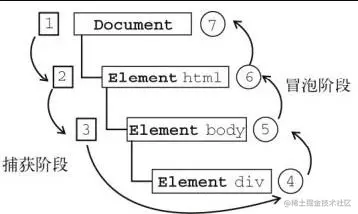

如上图所示，事件流的触发顺序是

1. 事件捕获阶段，为截获事件提供了机会
2. 实际的⽬标元素接收到事件
3. 事件冒泡阶段，可在这个阶段对事件做出响应

## 2 什么是事件冒泡（Event Bubbling）

事件开始由最具体的元素（⽂档中嵌套层次最深的那个节点）接收到后，开始逐级向上传播到较为不具体的节点

```xml
<html>

  <head>
    <title>Document</title>
  </head>

  <body>
    <button>按钮</button>
  </body>

</html>
```

如果点击了上面页面代码中的 `<button>` 按钮，那么该 `click` 点击事件会沿着 DOM 树向上逐级传播，在途经的每个节点上都会发生，具体顺序如下

1. button 元素
2. body 元素
3. html 元素
4. document 对象

## 3 什么是事件捕获（Event Capturing）

事件开始由较为不具体的节点接收后，然后开始逐级向下传播到最具体的元素上

事件捕获的最大作用在于：事件在到达预定⽬标之前就可以捕获到它

如果仍以上面那段 HTML 代码为例，当点击按钮后，在事件捕获的过程中，document 对象会首先接收到这个 `click` 事件，然后再沿着 DOM 树依次向下，直到 `<button>`。具体顺序如下

1. document 对象
2. html 元素
3. body 元素
4. button 元素

## 4 什么是事件委托

给父元素注册事件，当我们触发子元素的时候，会冒泡到父元素身上，从而触发父元素的事

适用场景：在绑定大量事件的时候，可以选择事件委托

优点

- 减少注册次数，可以提高程序性能

## 5 什么是 DOM

DOM 是文档对象模型

DOM 是浏览器提供的一套专门用来 操作网页内容(标签) 的功能

## 6 DOM 的常用操作

### 创建节点 createElement

创建新元素，接受一个参数，即要创建元素的标签名

```ini
const divEl = document.createElement("div")
```

创建一个文本节点 createTextNode

```ini
const textEl = document.createTextNode("content")
```

创建一个文档碎片 createDocumentFragment

它表示一种轻量级的文档，主要是用来存储临时节点，然后把文档碎片的内容一次性添加到`DOM`中

```ini
const fragment = document.createDocumentFragment()
```

当请求把一个`DocumentFragment` 节点插入文档树时，插入的不是 `DocumentFragment`自身，而是它的所有子孙节点

创建属性节点 createAttribute

可以是自定义属性

```ini
const dataAttribute = document.createAttribute('custom')
consle.log(dataAttribute)
```

### 获取节点 querySelector/querySelectorAll

querySelector

传入任何有效的`css` 选择器，即可选中单个 `DOM`元素（首个）

```dart
document.querySelector('.element')
document.querySelector('#element')
document.querySelector('div')
document.querySelector('[name="username"]')
document.querySelector('div + p > span')
```

如果页面上没有指定的元素时，返回 `null`

querySelectorAll

返回一个包含节点子树内所有与之相匹配的`Element`节点列表，如果没有相匹配的，则返回一个空节点列表

```ini
const notLive = document.querySelectorAll("p")
```

需要注意的是，该方法返回的是一个 `NodeList`的静态实例，它是一个静态的“快照”，而非“实时”的查询

关于获取`DOM`元素的方法还有如下，就不一一述说

```javascript
document.getElementById('id属性值') 返回拥有指定id的对象的引用
document.getElementsByClassName('class属性值') 返回拥有指定class的对象集合
document.getElementsByTagName('标签名') 返回拥有指定标签名的对象集合
document.getElementsByName('name属性值') 返回拥有指定名称的对象结合
document/element.querySelector('CSS选择器') 仅返回第一个匹配的元素
document/element.querySelectorAll('CSS选择器') 返回所有匹配的元素
document.documentElement 获取页面中的HTML标签
document.body 获取页面中的BODY标签
document.all[''] 获取页面中的所有元素节点的对象集合型
```

### 更新节点

**innerHTML**

不但可以修改一个`DOM`节点的文本内容，还可以直接通过`HTML`片段修改`DOM`节点内部的子树

```css
// 获取<p id="p">...</p >
var p = document.getElementById('p');
// 设置文本为abc:
p.innerHTML = 'ABC'; // <p id="p">ABC</p >
// 设置HTML:
p.innerHTML = 'ABC <span style="color:red">RED</span> XYZ';
// <p>...</p >的内部结构已修改
```

**innerText、textContent**

自动对字符串进行`HTML`编码，保证无法设置任何`HTML`标签

```ini
// 获取<p id="p-id">...</p >
var p = document.getElementById('p-id');
// 设置文本:
p.innerText = '<script>alert("Hi")</script>';
// HTML被自动编码，无法设置一个<script>节点:
// <p id="p-id">&lt;script&gt;alert("Hi")&lt;/script&gt;</p >
```

两者的区别在于读取属性时，`innerText`不返回隐藏元素的文本，而`textContent`返回所有文本

**style**

`DOM`节点的`style`属性对应所有的`CSS`，可以直接获取或设置。遇到`-`需要转化为驼峰命名

```ini
// 获取<p id="p-id">...</p >
const p = document.getElementById('p-id');
// 设置CSS:
p.style.color = '#ff0000';
p.style.fontSize = '20px'; // 驼峰命名
p.style.paddingTop = '2em';
```

### (4)添加节点

**innerHTML**

如果这个 DOM 节点是空的，例如，`<div></div>`，那么，直接使用`innerHTML = '<span>child</span>'`就可以修改`DOM`节点的内容，相当于添加了新的`DOM`节点

如果这个 DOM 节点不是空的，那就不能这么做，因为`innerHTML`会直接替换掉原来的所有子节点

**appendChild**

把一个子节点添加到父节点的最后一个子节点

如果是获取`DOM`元素后再进行添加操作，这个`js`节点是已经存在当前文档树中，因此这个节点首先会从原先的位置删除，再插入到新的位置

如果动态添加新的节点，则先创建一个新的节点，然后插入到指定的位置

**insertBefore**

把子节点插入到指定的位置，使用方法如下：

```scss
parentElement.insertBefore(newElement, referenceElement)
复制代码
```

子节点会插入到`referenceElement`之前

**setAttribute**

添加一个属性节点，如果元素中已有该属性改变属性值

```javascript
const div = document.getElementById("id")
div.setAttribute("class", "white") //第一个参数属性名，第二个参数属性值。
复制代码
```

### 删除节点

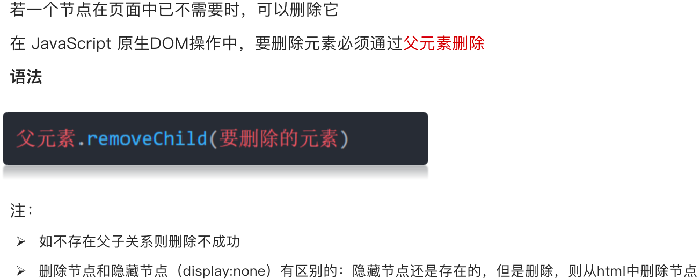

## 7 什么是 DOM 树

将 HTML 文档以树状结构直观的表现出来，我们称之为文档树或 DOM 树

DOM 树直接体现了标签与标签之间的关系

## 8 什么是 DOM 对象 什么是 document 对象

DOM 对象是浏览器根据 html 标签生成的 Js 对象

docement 对象是 DOM 里提供的一个对象，它提供的属性和方法都是用来访问和操作网页内容的

## 9 L0 和 L2 注册事件的区别

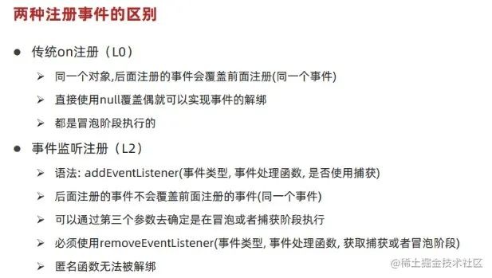

## 10 怎么解绑事件

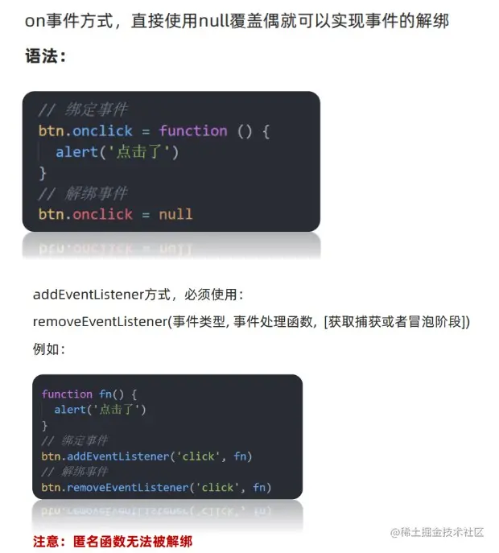

## 7.11 addEventListener 的第三个参数有什么用

addEventListener 有三个参数

```vbnet
element.addEventListener(event, function, useCapture)
```

| 参数       | 描述                                                                                                                                                                                                                                                                            |
| ---------- | ------------------------------------------------------------------------------------------------------------------------------------------------------------------------------------------------------------------------------------------------------------------------------- |
| event      | 必须。字符串，指定事件名。 **注意:** 不要使用 "on" 前缀。 例如，使用 "click" ,而不是使用 "onclick"。 **提示：** 所有 HTML DOM 事件，可以查看我们完整的 [HTML DOM Event 对象参考手册](https://link.juejin.cn/?target=http%3A%2F%2Fwww.runoob.com%2Fjsref%2Fdom-obj-event.html)。 |
| function   | 必须。指定要事件触发时执行的函数。 当事件对象会作为第一个参数传入函数。 事件对象的类型取决于特定的事件。例如， "click" 事件属于 MouseEvent(鼠标事件) 对象。                                                                                                                     |
| useCapture | 可选。布尔值，指定事件是否在捕获或冒泡阶段执行。 可能值:true - 事件句柄在捕获阶段执行（即在事件捕获阶段调用处理函数）false- false- 默认。事件句柄在冒泡阶段执行（即表示在事件冒泡的阶段调用事件处理函数）                                                                       |

## 12 常用 DOM 事件

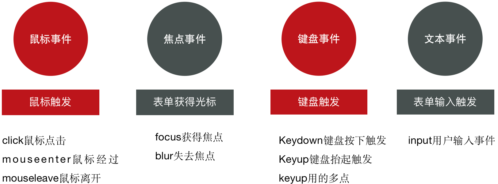

补充

页面事件

- scroll ： 页面滚动
- resize：页面大小变化

- 鼠标事件
  - 鼠标单击 click
  - 鼠标双击 dblclick
  - 鼠标移入/移出
    - mouseover/mouseout : 支持冒泡
    - mouseenter/mouseleave： 不支持冒泡（推荐）
  - 鼠标移动 mousemove
  - 鼠标按下 mousedown
  - 鼠标松开 mouseup

## 13 怎么阻止事件冒泡、阻止默认事件

**阻止事件冒泡**

e.stopPropagation\*\*()

**阻止默认事件,3 种方式**

```csharp
e.preventDefault();//谷歌及IE8以上
window.event.returnValue = false; //IE8及以下
return false; //无兼容问题（但不能用于节点直接onclick绑定函数）
复制代码
```

## 7.14 DOM 的类型有哪几种？

12 种

```scss
元素节点            　　Node.ELEMENT_NODE(1)
属性节点            　　Node.ATTRIBUTE_NODE(2)
文本节点            　　Node.TEXT_NODE(3)
CDATA节点             Node.CDATA_SECTION_NODE(4)
实体引用名称节点    　　 Node.ENTRY_REFERENCE_NODE(5)
实体名称节点        　　Node.ENTITY_NODE(6)
处理指令节点        　　Node.PROCESSING_INSTRUCTION_NODE(7)
注释节点            　 Node.COMMENT_NODE(8)
文档节点            　 Node.DOCUMENT_NODE(9)
文档类型节点        　　Node.DOCUMENT_TYPE_NODE(10)
文档片段节点        　　Node.DOCUMENT_FRAGMENT_NODE(11)
DTD声明节点            Node.NOTATION_NODE(12)
复制代码
```

## 7.15 DOM 种获取坐标的属性有哪些，它们有什么不同？

| 属性    | 说明                                                                                | 兼容性              |
| ------- | ----------------------------------------------------------------------------------- | ------------------- |
| offsetX | 以当前的目标元素左上角为原点，定位 x 轴坐标                                         | 除 Mozilla 外都兼容 |
| offsetY | 以当前的目标元素左上角为原点，定位 y 轴坐标                                         | 除 Mozilla 外都兼容 |
| clientX | 以浏览器可视窗口左上角为原点，定位 x 轴坐标                                         | 都兼容              |
| clientY | 以浏览器可视窗口左上角为原点，定位 y 轴坐标                                         | 都兼容              |
| pageX   | 以 doument 对象左上角为原点，定位 x 轴坐标                                          | 除 IE 外都兼容      |
| pageY   | 以 doument 对象左上角为原点，定位 y 轴坐标                                          | 除 IE 外都兼容      |
| screenX | 以计算机屏幕左上顶角为原点，定位 x 轴坐标(多屏幕会影响)                             | 全兼容              |
| screenY | 以计算机屏幕左上顶角为原点，定位 y 轴坐标                                           | 全兼容              |
| layerX  | 最近的绝对定位的父元素（如果没有，则为 document 对象）左上顶角为元素，定位 x 轴坐标 | Mozilla 和 Safari   |
| layerY  | 最近的绝对定位的父元素（如果没有，则为 document 对象）左上顶角为元素，定位 y 轴坐标 | Mozilla 和 Safari   |

## 7.16 DOM 种元素视图尺寸的属性有哪些？

| 属性         | 说明                                                              |
| ------------ | ----------------------------------------------------------------- |
| offsetLeft   | 获取当前元素到定位父节点的 left 方向的距离                        |
| offsetTop    | 获取当前元素到定位父节点的 top 方向的距离                         |
| offsetWidth  | 获取当前元素 width + 左右 padding + 左右 border-width             |
| offsetHeight | 获取当前元素 height + 上下 padding + 上下 border-width            |
| clientWidth  | 获取当前元素 width + 左右 padding                                 |
| clientHeight | 获取当前元素 height + 上下 padding                                |
| scrollWidth  | 当前元素内容真实的宽度，内容不超出盒子宽度时为盒子的 clientWidth  |
| scrollHeight | 当前元素内容真实的高度，内容不超出盒子高度时为盒子的 clientHeight |

## 17 如何判断元素是否在可视区域

### getBoundingClientRect

```
Element.getBoundingClientRect()
方法返回元素的大小及其相对于视口的位置。返回的是一个对象，对象里有这8个属性：left，right，top，bottom，width，height，x，y
```

## 18 IntersectionObserver

`IntersectionObserver`**接口** 提供了一种异步观察目标元素与其祖先元素或顶级文档视窗([viewport](https://link.juejin.cn/?target=https%3A%2F%2Fdeveloper.mozilla.org%2Fzh-CN%2Fdocs%2FGlossary%2FViewport))交叉状态的方法。祖先元素与视窗([viewport](https://link.juejin.cn/?target=https%3A%2F%2Fdeveloper.mozilla.org%2Fzh-CN%2Fdocs%2FGlossary%2FViewport))被称为**根(root)**

通俗点说就是：`IntersectionObserver`是用来监听**某个元素与视口**的`交叉状态`的。

## 19 如何遍历输出页面中的所有元素

使用`createNodeIterator`对页面中所有元素进行遍历输出

```ini
const body = document.getElementsByTagName('body')[0]
const it = document.createNodeIterator(body)
let root = it.nextNode()
while(root) {
  console.log(root)
  root = it.nextNode()
}
```

## 20 什么是 BOM 对象

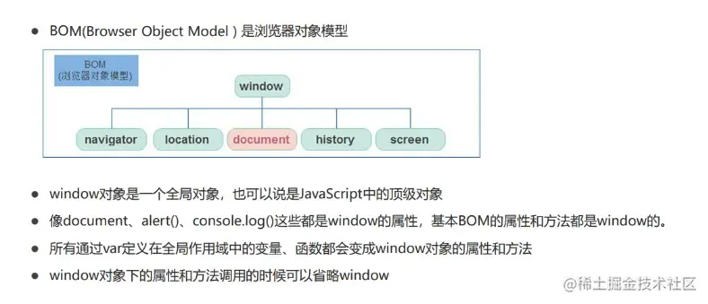

### location 对象的常用方法

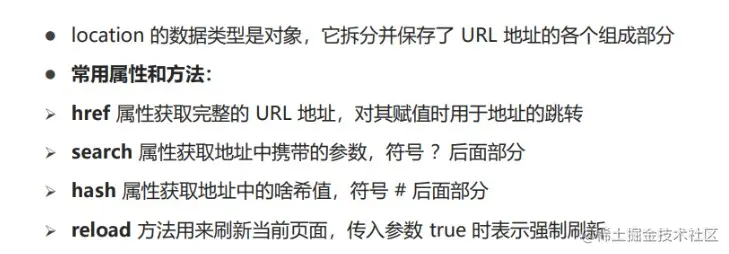

### navigator 对象 (获取浏览器平台和版本数据)

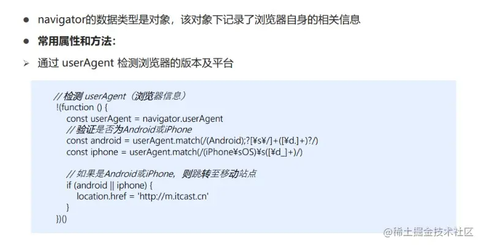

### histroy 对象 （管理浏览器历史记录）

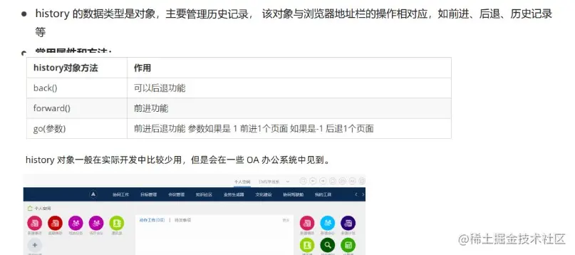

# 其他类型问题补充

## 简单说说你对观察者模式的理解

观察者模式定义了对象间的一种一对多的依赖关系，当一个对象的状态发生改变时，所有依赖于它的对象都将得到通知，并自动更新

观察者模式属于行为型模式，行为型模式关注的是对象之间的通讯，观察者模式就是观察者和被观察者之间的通讯

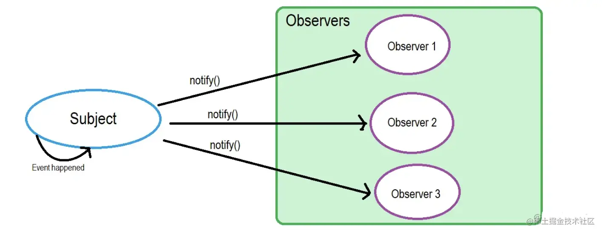

例如生活中，我们可以用报纸期刊的订阅来形象的说明，当你订阅了一份报纸，每天都会有一份最新的报纸送到你手上，有多少人订阅报纸，报社就会发多少份报纸

报社和订报纸的客户就形成了一对多的依赖关系

## 简单说说你对发布订阅模式的理解

发布-订阅是一种消息范式，消息的发送者（称为发布者）不会将消息直接发送给特定的接收者（称为订阅者）。而是将发布的消息分为不同的类别，无需了解哪些订阅者（如果有的话）可能存在

同样的，订阅者可以表达对一个或多个类别的兴趣，只接收感兴趣的消息，无需了解哪些发布者存在

## 观察者模式与发布订阅的区别

- 在观察者模式中，观察者是知道 Subject 的，Subject 一直保持对观察者进行记录。然而，在发布订阅模式中，发布者和订阅者不知道对方的存在。它们只有通过消息代理进行通信。
- 在发布订阅模式中，组件是松散耦合的，正好和观察者模式相反。
- 观察者模式大多数时候是同步的，比如当事件触发，Subject 就会去调用观察者的方法。而发布-订阅模式大多数时候是异步的（使用消息队列）

## 说说你对正则表达式的理解

正则表达式是一种用来匹配字符串的强有力的武器

它的设计思想是用一种描述性的语言定义一个规则，凡是符合规则的字符串，我们就认为它“匹配”了，否则，该字符串就是不合法的

在 `JavaScript`中，正则表达式也是对象，构建正则表达式有两种方式

1. 字面量创建，其由包含在斜杠之间的模式组成

```ini
const re = /\d+/g
```

1. 调用`RegExp`对象的构造函数

```ini
const re = new RegExp("\d+","g")

const rul = "\d+"
const re1 = new RegExp(rul,"g")
```

使用构建函数创建，第一个参数可以是一个变量，遇到特殊字符``需要使用`\`进行转义

## 如何判断当前的 Js 代码是否在浏览器环境中运行

如果 Javascript 在浏览器环境中运行，则会有一个全局对象：`window`。因此，可以通过以下方式判断环境：

```javascript
typeof window.self ！== "undefined"
// 在web worker或者sevice worker下是无法获取到windows全局变量， 所以需要通过self变量判断
```

# 手写代码

## 1. 手写 Object.create

思路：将传入的对象作为原型

```javascript
function create(obj) {
  function F() {}
  F.prototype = obj
  return new F()
}
```

## 2. 手写 instanceof

instanceof 运算符用于判断构造函数的 prototype 属性是否出现在对象的原型链中的任何位置。

实现步骤：

1. 首先获取类型的原型
2. 然后获得对象的原型
3. 然后一直循环判断对象的原型是否等于类型的原型，直到对象原型为 `null`，因为原型链最终为 `null`

```javascript
function myInstanceof(left, right) {
  let proto = Object.getPrototypeOf(left), // 获取对象的原型
    prototype = right.prototype // 获取构造函数的 prototype 对象

  // 判断构造函数的 prototype 对象是否在对象的原型链上
  while (true) {
    if (!proto) return false
    if (proto === prototype) return true

    proto = Object.getPrototypeOf(proto)
  }
}
```

## 3. 手写 new

（1）首先创建了一个新的空对象

（2）设置原型，将对象的原型设置为函数的 prototype 对象。

（3）让函数的 this 指向这个对象，执行构造函数的代码（为这个新对象添加属性）

（4）判断函数的返回值类型，如果是值类型，返回创建的对象。如果是引用类型，就返回这个引用类型的对象。

```javascript
function myNew(fn, ...args) {
  // 判断参数是否是一个函数
  if (typeof fn !== "function") {
    return console.error("type error")
  }
  // 创建一个对象，并将对象的原型绑定到构造函数的原型上
  const obj = Object.create(fn.prototype)
  const value = fn.apply(obj, args) // 调用构造函数，并且this绑定到obj上
  // 如果构造函数有返回值，并且返回的是对象，就返回value ;否则返回obj
  return value instanceof Object ? value : obj
}
```

## 4. 手写 promise(简易版)

```javascript
class MyPromise {
  constructor(fn) {
    // 存储 reslove 回调函数列表
    this.callbacks = []
    const resolve = value => {
      this.data = value // 返回值给后面的 .then
      while (this.callbacks.length) {
        let cb = this.callbacks.shift()
        cb(value)
      }
    }
    fn(resolve)
  }
  then(onResolvedCallback) {
    return new MyPromise(resolve => {
      this.callbacks.push(() => {
        const res = onResolvedCallback(this.data)
        if (res instanceof MyPromise) {
          res.then(resolve)
        } else {
          resolve(res)
        }
      })
    })
  }
}
// 这是测试案例
new MyPromise(resolve => {
  setTimeout(() => {
    resolve(1)
  }, 1000)
})
  .then(res => {
    console.log(res)
    return new MyPromise(resolve => {
      setTimeout(() => {
        resolve(2)
      }, 1000)
    })
  })
  .then(res => {
    console.log(res)
  })
```

### 4.2 Promise.all

```javascript
MyPromise.all = function (promisesList) {
  return new MyPromise((resolve, reject) => {
    if (!Array.isArray(promiselList) return reject(new Error('必须是数组'))
    if (!promisesList.length) return resolve([])
    let arr = [], count = 0
    // 直接循环同时执行传进来的promise
    for (let i = 0, len = promisesList.length; i < len; i++) {
      // 因为有可能是 promise 有可能不是，所以用resolve()不管是不是都会自动转成promise
      Promise.resolve(promise).then(result => {
          // 由到promise在初始化的时候就执行了，.then只是拿结果而已，所以执行完成的顺序有可能和传进来的数组不一样
          // 也就是说直接push到arr的话，顺序有可能会出错
          count++
          arr[i] = result
          // 不能用arr.length===len，是因为数组的特性
          // arr=[]; arr[3]='xx'; console.log(arr.length) 这打印出来会是4 而不是1
          if(count === len) resolve(arr)
      }).catch(err => reject(err))
    }
  })
}
```

### 4.3 Promise.race

传参和上面的 all 一模一样，传入一个 Promise 实例集合的数组，然后全部同时执行，谁先快先执行完就返回谁，只返回一个结果

```javascript
MyPromise.race = function (promisesList) {
  return new MyPromise((resolve, reject) => {
    // 直接循环同时执行传进来的promise
    for (const promise of promisesList) {
      // 直接返回出去了，所以只有一个，就看哪个快
      promise.then(resolve, reject)
    }
  })
}
```

## 5. 防抖和节流

函数防抖是指在事件被触发 n 秒后再执行回调，如果在这 n 秒内事件又被触发，则重新计时。这可以使用在一些点击请求的事件上，避免因为用户的多次点击向后端发送多次请求。

函数节流是指规定一个单位时间，在这个单位时间内，只能有一次触发事件的回调函数执行，如果在同一个单位时间内某事件被触发多次，只有一次能生效。节流可以使用在 scroll 函数的事件监听上，通过事件节流来降低事件调用的频率。

```javascript
// //防抖
function debounce(fn, date) {
  let timer //声明接收定时器的变量
  return function (...arg) {
    // 获取参数
    timer && clearTimeout(timer) // 清空定时器
    timer = setTimeout(() => {
      //  生成新的定时器
      //因为箭头函数里的this指向上层作用域的this,所以这里可以直接用this，不需要声明其他的变量来接收
      fn.apply(this, arg) // fn()
    }, date)
  }
}
//--------------------------------
// 节流
function debounce(fn, data) {
  let timer = +new Date() // 声明初始时间
  return function (...arg) {
    // 获取参数
    let newTimer = +new Date() // 获取触发事件的时间
    if (newTimer - timer >= data) {
      // 时间判断,是否满足条件
      fn.apply(this, arg) // 调用需要执行的函数,修改this值,并且传入参数
      timer = +new Date() // 重置初始时间
    }
  }
}
```

## 6. 手写 call 函数

**call 函数的实现步骤：**

1. 判断调用对象是否为函数，即使我们是定义在函数的原型上的，但是可能出现使用 call 等方式调用的情况。
2. 判断传入上下文对象是否存在，如果不存在，则设置为 window 。
3. 处理传入的参数，截取第一个参数后的所有参数。
4. 将函数作为上下文对象的一个属性。
5. 使用上下文对象来调用这个方法，并保存返回结果。
6. 删除刚才新增的属性。
7. 返回结果。

```javascript
// call函数实现
Function.prototype.myCall = function (context) {
  // 判断调用对象
  if (typeof this !== "function") {
    console.error("type error")
  }
  // 获取参数
  let args = [...arguments].slice(1),
    result = null
  // 判断 context 是否传入，如果未传入则设置为 window
  context = context || window
  // 将调用函数设为对象的方法
  context.fn = this
  // 调用函数
  result = context.fn(...args)
  // 将属性删除
  delete context.fn
  return result
}
```

## 7. 手写 apply 函数

**apply 函数的实现步骤：**

1. 判断调用对象是否为函数，即使我们是定义在函数的原型上的，但是可能出现使用 call 等方式调用的情况。
2. 判断传入上下文对象是否存在，如果不存在，则设置为 window 。
3. 将函数作为上下文对象的一个属性。
4. 判断参数值是否传入
5. 使用上下文对象来调用这个方法，并保存返回结果。
6. 删除刚才新增的属性
7. 返回结果

```javascript
// apply 函数实现
Function.prototype.myApply = function (context) {
  // 判断调用对象是否为函数
  if (typeof this !== "function") {
    throw new TypeError("Error")
  }
  let result = null
  // 判断 context 是否存在，如果未传入则为 window
  context = context || window
  // 将函数设为对象的方法
  context.fn = this
  // 调用方法
  if (arguments[1]) {
    result = context.fn(...arguments[1])
  } else {
    result = context.fn()
  }
  // 将属性删除
  delete context.fn
  return result
}
```

## 8. 手写 bind 函数

**bind 函数的实现步骤：**

1. 判断调用对象是否为函数，即使我们是定义在函数的原型上的，但是可能出现使用 call 等方式调用的情况。
2. 保存当前函数的引用，获取其余传入参数值。
3. 创建一个函数返回
4. 函数内部使用 apply 来绑定函数调用，需要判断函数作为构造函数的情况，这个时候需要传入当前函数的 this 给 apply 调用，其余情况都传入指定的上下文对象。

```javascript
// bind 函数实现
Function.prototype.myBind = function (context) {
  // 判断调用对象是否为函数
  if (typeof this !== "function") {
    throw new TypeError("Error")
  }
  // 获取参数
  var args = [...arguments].slice(1),
    fn = this
  return function Fn() {
    // 根据调用方式，传入不同绑定值
    return fn.apply(this instanceof Fn ? this : context, args.concat(...arguments))
  }
}
```

## 9. 函数柯里化的实现

函数柯里化指的是一种将使用多个参数的一个函数转换成一系列使用一个参数的函数的技术。

```php
function curry(fn, ...args) {
  return fn.length <= args.length ? fn(...args) : curry.bind(null, fn, ...args);
}
```

## 10. 手写 AJAX 请求

**创建 AJAX 请求的步骤：**

- 创建一个 XMLHttpRequest 对象。
- 在这个对象上**使用 open 方法创建一个 HTTP 请求**，open 方法所需要的参数是请求的方法、请求的地址、是否异步和用户的认证信息。
- 在发起请求前，可以为这个对象**添加一些信息和监听函数**。比如说可以通过 setRequestHeader 方法来为请求添加头信息。还可以为这个对象添加一个状态监听函数。一个 XMLHttpRequest 对象一共有 5 个状态，当它的状态变化时会触发 onreadystatechange 事件，可以通过设置监听函数，来处理请求成功后的结果。当对象的 readyState 变为 4 的时候，代表服务器返回的数据接收完成，这个时候可以通过判断请求的状态，如果状态是 2xx 或者 304 的话则代表返回正常。这个时候就可以通过 response 中的数据来对页面进行更新了。
- 当对象的属性和监听函数设置完成后，最后调**用 sent 方法来向服务器发起请求**，可以传入参数作为发送的数据体。

```javascript
const SERVER_URL = "/server"
let xhr = new XMLHttpRequest()
// 创建 Http 请求
xhr.open("GET", SERVER_URL, true)
// 设置状态监听函数
xhr.onreadystatechange = function () {
  if (this.readyState !== 4) return
  // 当请求成功时
  if (this.status === 200) {
    handle(this.response)
  } else {
    console.error(this.statusText)
  }
}
// 设置请求失败时的监听函数
xhr.onerror = function () {
  console.error(this.statusText)
}
// 设置请求头信息
xhr.responseType = "json"
xhr.setRequestHeader("Accept", "application/json")
// 发送 Http 请求
xhr.send(null)
```

## 11. 使用 Promise 封装 AJAX 请求

```javascript
// promise 封装实现：
function getJSON(url) {
  // 创建一个 promise 对象
  let promise = new Promise(function (resolve, reject) {
    let xhr = new XMLHttpRequest()
    // 新建一个 http 请求
    xhr.open("GET", url, true)
    // 设置状态的监听函数
    xhr.onreadystatechange = function () {
      if (this.readyState !== 4) return
      // 当请求成功或失败时，改变 promise 的状态
      if (this.status === 200) {
        resolve(this.response)
      } else {
        reject(new Error(this.statusText))
      }
    }
    // 设置错误监听函数
    xhr.onerror = function () {
      reject(new Error(this.statusText))
    }
    // 设置响应的数据类型
    xhr.responseType = "json"
    // 设置请求头信息
    xhr.setRequestHeader("Accept", "application/json")
    // 发送 http 请求
    xhr.send(null)
  })
  return promise
}
```

## 12. 手写深拷贝

```javascript
function fn(obj) {
  // 判断数据是否是复杂类型
  if (obj instanceof Object) {
    //判断数据是否是数组
    if (Array.isArray(obj)) {
      //声明一个空数组来接收拷贝后的数据
      let result = []
      obj.forEach(item => {
        // 需要递归深层遍历，否则复制的是地址
        result.push(fn(item))
      })
      // 返回输出这个数组,数组拷贝完成
      return result
    } else {
      //如果是对象,就声明一个空对象来接收拷贝后的数据
      let result = {}
      for (let k in obj) {
        // 使用递归深层遍历
        result[k] = fn(obj[k])
      }
      // 返回输出这个对象,对象拷贝完成
      return result
    }
  }
  // 简单数据类型则直接返回输出
  return obj
}
```

## 13. 手写打乱数组顺序的方法

主要的实现思路就是：

- 取出数组的第一个元素，随机产生一个索引值，将该第一个元素和这个索引对应的元素进行交换。
- 第二次取出数据数组第二个元素，随机产生一个除了索引为 1 的之外的索引值，并将第二个元素与该索引值对应的元素进行交换
- 按照上面的规律执行，直到遍历完成

```ini
let arr = [1,2,3,4,5,6,7,8,9,10];
for (let i = 0; i < arr.length; i++) {
  const randomIndex = Math.round(Math.random() * (arr.length - 1 - i)) + i;
  [arr[i], arr[randomIndex]] = [arr[randomIndex], arr[i]];
}
console.log(arr)

复制代码
```

## 14. 实现数组扁平化

通过循环递归的方式，一项一项地去遍历，如果每一项还是一个数组，那么就继续往下遍历，利用递归程序的方法，来实现数组的每一项的连接：

```ini
let arr = [1, [2, [3, 4, 5]]];
function flatten(arr) {
  let result = [];

  for(let i = 0; i < arr.length; i++) {
    if(Array.isArray(arr[i])) {
      result = result.concat(flatten(arr[i]));
    } else {
      result.push(arr[i]);
    }
  }
  return result;
}
flatten(arr);  //  [1, 2, 3, 4，5]
复制代码
```

## 15. 实现数组的 flat 方法

```javascript
function _flat(arr, depth) {
  if (!Array.isArray(arr) || depth <= 0) {
    return arr
  }
  return arr.reduce((prev, cur) => {
    if (Array.isArray(cur)) {
      return prev.concat(_flat(cur, depth - 1))
    } else {
      return prev.concat(cur)
    }
  }, [])
}
复制代码
```

## 16. 实现数组的 push 方法

```ini
let arr = [];
Array.prototype.push = function() {
    for( let i = 0 ; i < arguments.length ; i++){
        this[this.length] = arguments[i] ;
    }
    return this.length;
}

复制代码
```

## 17. 实现数组的 filter 方法

```javascript
Array.prototype._filter = function (fn) {
  if (typeof fn !== "function") {
    throw Error("参数必须是一个函数")
  }
  const res = []
  for (let i = 0, len = this.length; i < len; i++) {
    fn(this[i]) && res.push(this[i])
  }
  return res
}
```

## 18. 实现数组的 map 方法

```javascript
Array.prototype._map = function (fn) {
  if (typeof fn !== "function") {
    throw Error("参数必须是一个函数")
  }
  const res = []
  for (let i = 0, len = this.length; i < len; i++) {
    res.push(fn(this[i]))
  }
  return res
}
```

## 19. 实现 add(1)(2)(3)(4)

可以实现任意数量数字相加，但是需要用+号隐式转换

```scss
 function fn() {
      let result = [];
      function add(...args) {
        // ...args剩余参数,可以获取到传进来的参数
        result = [...result, ...args]
        return add;
      };
      // 创建一个取代 valueOf 方法的函数,覆盖自定义对象的 valueOf 方法
      add.toString = () => result.reduce((sum, k) => sum + k, 0);
      return add;
    };
let add = fn()
   console.log(+add(1)(2)(3)(4)) // --->10
    // let add2 = fn();
    console.log(+add2(1, 2, 3)(4)) // --->10
```

参数固定的情况下，不需要用+号，可以根据参数长度来判断返回值

```scss
    function currying(fn, length) {
      length = length || fn.length; // 第一次调用,给length赋值fn的长度,后面每次重复调用,length的长度都会减去参数的长度
      return function (...args) {
        return args.length >= length // 当前传递进来的参数的长度与length长度进行比较
          ? fn.apply(this, args) // 把最后一组实参传给为赋值的形参,此时所有形参都已赋值,并调用fn函数
          : currying(fn.bind(this, ...args), length - args.length)
        // 每一次调用fn.bind,都会把当前的args里的实参依次传给fn的形参,length的长度减去参数的长度
        // 相当于fn.bind(this, 1).bind(this, 2, 3),bind的连续调用,来填充fn的参数
        // 直到某一次调用,fn的形参即将全部都被赋值时,条件成立,会执行fn.apply,把最后的参数传递过去,并且调用fn
      }
    }
    function fn(a, b, c, d) {
      return a + b + c + d
    }
    const add = currying(fn)
    add(4)(3)(1)(2) //10
    add(1, 3)(4)(2) //10
    add(1)(3, 4, 2) //10
```

## 20. 用 Promise 实现图片的异步加载

```javascript
let imageAsync = url => {
  return new Promise((resolve, reject) => {
    let img = new Image()
    img.src = url
    img.οnlοad = () => {
      console.log(`图片请求成功，此处进行通用操作`)
      resolve(image)
    }
    img.οnerrοr = err => {
      console.log(`失败，此处进行失败的通用操作`)
      reject(err)
    }
  })
}

imageAsync("url")
  .then(() => {
    console.log("加载成功")
  })
  .catch(error => {
    console.log("加载失败")
  })
```

## 21. 手写发布-订阅模式

```typescript
class EventCenter{
  // 1. 定义事件容器，用来装事件数组
    let handlers = {}

  // 2. 添加事件方法，参数：事件名 事件方法
  addEventListener(type, handler) {
    // 创建新数组容器
    if (!this.handlers[type]) {
      this.handlers[type] = []
    }
    // 存入事件
    this.handlers[type].push(handler)
  }

  // 3. 触发事件，参数：事件名 事件参数
  dispatchEvent(type, params) {
    // 若没有注册该事件则抛出错误
    if (!this.handlers[type]) {
      return new Error('该事件未注册')
    }
    // 触发事件
    this.handlers[type].forEach(handler => {
      handler(...params)
    })
  }

  // 4. 事件移除，参数：事件名 要删除事件，若无第二个参数则删除该事件的订阅和发布
  removeEventListener(type, handler) {
    if (!this.handlers[type]) {
      return new Error('事件无效')
    }
    if (!handler) {
      // 移除事件
      delete this.handlers[type]
    } else {
      const index = this.handlers[type].findIndex(el => el === handler)
      if (index === -1) {
        return new Error('无该绑定事件')
      }
      // 移除事件
      this.handlers[type].splice(index, 1)
      if (this.handlers[type].length === 0) {
        delete this.handlers[type]
      }
    }
  }
}
```

## 22. Object.defineProperty(简易版)

```javascript
//  Vue2的响应式原理，结合了Object.defineProperty的数据劫持，以及发布订阅者模式
//  Vue2的数据劫持，就是通过递归遍历data里的数据，用Object.defineProperty给每一个属性添加getter和setter,
//  并且把data里的属性挂载到vue实例中，修改vue实例上的属性时，就会触发对应的setter函数，向Dep订阅器发布更新消息，
//  对应的Watcher订阅者会收到通知，调用自身的回调函数，让编译器去更新视图。
const obj = {
  name: "刘逍",
  age: 20,
}
const p = {}
for (let key in obj) {
  Object.defineProperty(p, key, {
    get() {
      console.log(`有人读取p里的${key}属性`)
      return obj[key]
    },
    set(val) {
      console.log(`有人修改了p里的${key}属性,值为${val},需要去更新视图`)
      obj[key] = val
    },
  })
}
```

## 23. Proxy 数据劫持(简易版)

```javascript
// Vue3的数据劫持通过Proxy函数对代理对象的属性进行劫持，通过Reflect对象里的方法对代理对象的属性进行修改，
// Proxy代理对象不需要遍历，配置项里的回调函数可以通过参数拿到修改属性的键和值
// 这里用到了Reflect对象里的三个方法，get，set和deleteProperty，方法需要的参数与配置项中回调函数的参数相同。
// Reflect里的方法与Proxy里的方法是一一对应的，只要是Proxy对象的方法，就能在Reflect对象上找到对应的方法。
const obj = {
  name: "刘逍",
  age: 20,
}
const p = new Proxy(obj, {
  // 读取属性的时候会调用getter
  get(target, propName) {
    //第一个参数为代理的源对象,等同于上面的Obj参数。第二个参数为读取的那个属性值
    console.log(`有人读取p对象里的${propName}属性`)
    return Reflect.get(target, propName)
  },
  // 添加和修改属性的时候会调用setter
  set(target, propName, value) {
    //参数等同于get，第三个参数为修改后的属性值
    console.log(`有人修改了p对象里的${propName}属性,值为${value},需要去修改视图`)
    Reflect.set(target, propName, value)
  },
  // 删除属性时，调用deleteProperty
  deleteProperty(target, propName) {
    // 参数等同于get
    console.log(`有人删除了p对象里的${propName}属性，需要去修改视图`)
    return Reflect.deleteProperty(target, propName)
  },
})
```

## 24. 实现路由(简易版)

```kotlin
// hash路由
class Route{
  constructor(){
    // 路由存储对象
    this.routes = {}
    // 当前hash
    this.currentHash = ''
    // 绑定this，避免监听时this指向改变
    this.freshRoute = this.freshRoute.bind(this)
    // 监听
    window.addEventListener('load', this.freshRoute, false)
    window.addEventListener('hashchange', this.freshRoute, false)
  }
  // 存储
  storeRoute (path, cb) {
    this.routes[path] = cb || function () {}
  }
  // 更新
  freshRoute () {
    this.currentHash = location.hash.slice(1) || '/'
    this.routes[this.currentHash]()
  }
}
```

## 25. 使用 setTimeout 实现 setInterval

实现思路是使用递归函数，不断地去执行 setTimeout 从而达到 setInterval 的效果

```scss
function mySetInterval(fn, timeout) {
  // 控制器，控制定时器是否继续执行
  var timer = {
    flag: true
  };
  // 设置递归函数，模拟定时器执行。
  function interval() {
    if (timer.flag) {
      fn();
      setTimeout(interval, timeout);
    }
  }
  // 启动定时器
  setTimeout(interval, timeout);
  // 返回控制器
  return timer;
}
```

## 26. 使用 setInterval 实现 setTimeout

```scss
function mySetInterval(fn, t) {
  const timer = setInterval(() => {
    clearInterval(timer)
    fn()
  }, t)
}

mySetInterval(() => {
  console.log('hoho');
}, 1000)
```

## 27. 实现 jsonp

```scss
// 动态的加载js文件
function addScript(src) {
  const script = document.createElement('script')
  script.src = src
  script.type = "text/javascript"
  document.body.appendChild(script)
}
addScript("http://xxx.xxx.com/xxx.js?callback=handleRes")
// 设置一个全局的callback函数来接收回调结果
function handleRes(res) {
  console.log(res)
}
// 接口返回的数据格式
handleRes({a: 1, b: 2})
```

## 28. 提取出 url 里的参数并转成对象

```javascript
function getUrlParams(url) {
  let reg = /([^?&=]+)=([^?&=]+)/g
  let obj = {}
  url.replace(reg, function () {
    obj[arguments[1]] = arguments[2]
  })
  // 或者
  const search = window.location.search
  search.replace(/([^&=?]+)=([^&]+)/g, (m, $1, $2) => {
    obj[$1] = decodeURIComponent($2)
  })

  return obj
}
let url = "https://www.junjin.cn?a=1&b=2"
console.log(getUrlParams(url)) // { a: 1, b: 2 }
```

## 29. 请写至少三种数组去重的方法（原生 js）

```javascript
//利用filter
function unique(arr) {
  return arr.filter(function (item, index, arr) {
    //当前元素，在原始数组中的第一个索引==当前索引值，否则返回当前元素
    return arr.indexOf(item, 0) === index
  })
}
var arr = [
  1,
  1,
  "true",
  "true",
  true,
  true,
  15,
  15,
  false,
  false,
  undefined,
  undefined,
  null,
  null,
  NaN,
  NaN,
  "NaN",
  0,
  0,
  "a",
  "a",
  {},
  {},
]
console.log(unique(arr))
复制代码
//利用ES6 Set去重（ES6中最常用）
function unique(arr) {
  return Array.from(new Set(arr))
}
var arr = [
  1,
  1,
  "true",
  "true",
  true,
  true,
  15,
  15,
  false,
  false,
  undefined,
  undefined,
  null,
  null,
  NaN,
  NaN,
  "NaN",
  0,
  0,
  "a",
  "a",
  {},
  {},
]
console.log(unique(arr))
//[1, "true", true, 15, false, undefined, null, NaN, "NaN", 0, "a", {}, {}]
复制代码
//利用for嵌套for，然后splice去重（ES5中最常用）
function unique(arr) {
  for (var i = 0; i < arr.length; i++) {
    for (var j = i + 1; j < arr.length; j++) {
      if (arr[i] == arr[j]) {
        //第一个等同于第二个，splice方法删除第二个
        arr.splice(j, 1)
        j--
      }
    }
  }
  return arr
}
var arr = [
  1,
  1,
  "true",
  "true",
  true,
  true,
  15,
  15,
  false,
  false,
  undefined,
  undefined,
  null,
  null,
  NaN,
  NaN,
  "NaN",
  0,
  0,
  "a",
  "a",
  {},
  {},
]
console.log(unique(arr))
//[1, "true", 15, false, undefined, NaN, NaN, "NaN", "a", {…}, {…}]
//NaN和{}没有去重，两个null直接消失了
复制代码
```

# 算法基础

## 时间&空间复杂度

- 复杂度是数量级（方便记忆、推广），不是具体数字
- 常见复杂度大小比较：O(n^2) > O(nlogn) > O(n) > O(logn) > O(1)

### 时间复杂度

常见时间复杂度对应关系

- O(n^2)：2 层循环（嵌套循环）
- O(nlogn)：快速排序（循环 + 二分）
- O(n)：1 层循环
- O(logn)：二分

### 空间复杂度

常见空间复杂度对应关系

- O(n)：传入一个数组，处理过程生成一个新的数组大小与传入数组一致

## 八大数据结构

### 栈

`栈`是一个`后进先出`的数据结构。`JavaScript`中没有`栈`，但是可以用`Array`实现`栈`的所有功能

```arduino
// 数组实现栈数据结构
const stack = []

// 入栈
stack.push(0)
stack.push(1)
stack.push(2)

// 出栈
const popVal = stack.pop() // popVal 为 2
```

**使用场景**

- 场景一：十进制转二进制
- 场景二：有效括号
- 场景三：函数调用堆栈

### 队列

`队列`是一个`先进先出`的数据结构。`JavaScript`中没有`队列`，但是可以用`Array`实现`队列`的所有功能

```arduino
// 数组实现队列数据结构
const queue = []

// 入队
stack.push(0)
stack.push(1)
stack.push(2)

// 出队
const shiftVal = stack.shift() // shiftVal 为 0
```

**使用场景**

- 场景一：日常测核酸排队
- 场景二：JS 异步中的任务队列
- 场景三：计算最近请求次数

### 链表

`链表`是多个元素组成的列表，元素存储不连续，用`next`指针连在一起。`JavaScript`中没有`链表`，但是可以用`Object`模拟`链表`。

**使用场景**

- 场景一：JS 中的原型链
- 场景二：使用链表指针获取 JSON 的节点值

### 集合

`集合`是一个`无序且唯一`的数据结构。`ES6`中有集合：`Set`，集合常用操作：去重、判断某元素是否在集合中、求交集

```dart
// 去重
const arr = [1, 1, 2, 2]
const arr2 = [...new Set(arr)]

// 判断元素是否在集合中
const set = new Set(arr)
const has = set.has(3) // false

// 求交集
const set2 = new Set([2, 3])
const set3 = new Set([...set].filter(item => set2.has(item)))
```

**使用场景**

- 场景一：求交集、差集

### 字典(哈希)

`字典`也是一种存储`唯一值`的数据结构，但它以`键值对`的形式存储。`ES6`中的字典名为`Map`

```c
// 字典
const map = new Map()

// 增
map.set('key1', 'value1')
map.set('key2', 'value2')
map.set('key3', 'value3')

// 删
map.delete('key3')
// map.clear()

// 改
map.set('key2', 'value222')

// 查
map.get('key2')
```

**使用场景**

- 场景：leetcode 刷题

### 树

`树`是一种`分层`的数据模型。前端常见的树包括：DOM、树、级联选择、树形控件……。`JavaScript`中没有`树`，但是可以通过`Object`和`Array`构建`树`。树的常用操作：深度/广度优先遍历、先中后序遍历

**使用场景**

- 场景一：DOM 树
- 场景二：级联选择器

### 图

`图`是网络结构的抽象模型，是一组由边连接的节点。图可以表示任何二元关系，比如道路、航班。JS 中没有图，但是可以用`Object`和`Array`构建`图`。图的表示法：邻接矩阵、邻接表、关联矩阵

**使用场景**

- 场景一：道路
- 场景二：航班

### 堆

`堆`是一种特殊的完全二叉树。所有的节点都大于等于（最大堆）或小于等于（最小堆）它的子节点。由于`堆`的特殊结构，我们可以用`数组`表示`堆`

**使用场景**

- 场景：leetcode 刷题

## 排序方法

### 冒泡排序

比较两个记录键值的大小，如果这两个记录键值的大小出现逆序，则交换这两个记录

**每遍历一个元素，都会把之前的所有相邻的元素都两两比较一遍，即便是已经排序好的元素**

```ini
//[1,3,4,2]->[1,3,2,4]->[1,2,3,4]->[1,2,3,4]

let n = 0
function bubbleSort(arr){
    for(let i = 1;i < arr.length;i++){
        for(let j = i;j > 0;j--){
            n++ // 1+2+3+...+arr.length-1
            if(arr[j] < arr[j-1]){
                [arr[j],arr[j-1]] = [arr[j-1],arr[j]];
            }
        }
    }
    return arr;
}
```

### 插入排序

第 i（i 大于等于 1）个记录进行插入操作时，R1、 R2，...，是排好序的有序数列，取出第 i 个元素，在序列中找到一个合适的位置并将她插入到该位置上即可

**相当于把当前遍历的元素取出，在序列中找到一个合适的位置将它插入。它的第二层循环不必遍历当前元素之前的所有元素，因为当前元素之前的序列是排序好的，碰到第一个小于当前元素的值，就可以停止继续向前查找了，然后把当前元素插入当前位置即可**

```ini
function insertSort(arr){
    for(let i = 1;i < arr.length;i++){
        let j = i-1;
        if(arr[i]<arr[j]){
            let temp = arr[i];
            while(j >= 0 && temp < arr[j]){
                arr[j+1] = arr[j];
                j--;
            }
            arr[j+1] = temp;
        }
    }
    return arr;
}

//[1,3,4,2] ->[1,3,4,4]->[1,3,3,4]->[1,2,3,4]
//i=3 temp=2 j=2 arr[j]=4 arr[3]=4 [1,3,4,4]； j=1 arr[2]=3 [1,3,3,4]； j=0  [1,2,3,4]
```

### 希尔排序

算法先将要排序的一组数按某个增量 d（n/2,n 为要排序数的个数）分成若干组，每组中记录的下标相差 d.对每组中全部元素进行直接插入排序，然后再用一个较小的增量（d/2）对它进行分组，在每组中再进行直接插入排序。当增量减到 1 时，进行直接插入排序后，排序完成。

```ini
function hillSort(arr){
    let len = arr.length;
    for(let gap = parseInt(len / 2);gap >= 1;gap = parseInt(gap / 2)){
        for(let i = gap;i < len;i++){
            if(arr[i] < arr[i-gap]){
                let temp = arr[i];
                let j = i - gap;
                while(j >= 0 && arr[j] > temp){
                    arr[j+gap] = arr[j];
                    j -= gap;
                }
                arr[j+gap] = temp;
            }
        }
    }
    return arr;
}
```

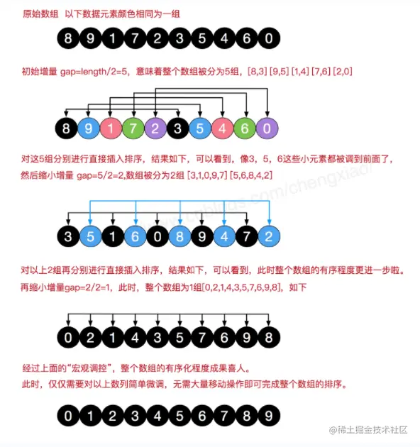

### 选择排序

在第 i 次选择操作中，通过 n-i 次键值间比较，从 n-i+1 个记录中选出键值最小的记录，并和第 i（1 小于等于 1 小于等于 n-1）个记录交换

**每一次遍历，都把当前元素与剩下元素里的最小值交换位置**

```ini
//[4,1,3,2]->[1,4,3,2]->[1,2,4,3]->[1,2,3,4]

function selectSort(arr){
    for(let i = 0;i < arr.length;i++){
        let min = Math.min(...arr.slice(i));
        let index
        for (let j = i; j < arr.length; j++) {
          if (arr[j] === min) {
            index = j
            break
          }
        }
        [arr[i],arr[index]] = [arr[index],arr[i]];
    }
    return arr;
}
```

### 快排

在 n 个记录中取某一个记录的键值为标准，通常取第一个记录键值为基准，通过一趟排序将待排的记录分为小于或等于这个键值的两个独立的部分，这是一部分的记录键值均比另一部分记录的键值小，然后，对这两部分记录继续分别进行快速排序，以达到整个序列有序

**取当前排序数组的第一个值作为基准值 keys，通过一次遍历把数组分为 right 大于基准值和 left 小于等于基准值的两部分，然后对两个部分重复以上步骤排序，最后 return 的时候按照[left,keys,right]的顺序返回**

```scss
function quickSort(arr){
    if(arr.length <= 1) return arr;
    let right = [],left = [],keys = arr.shift();
    for(let value of arr){
        if(value > keys){
            right.push(value)
        }else{
            left.push(value);
        }
    }
    return quickSort(left).concat(keys,quickSort(right));
}

//[4,1,3,2]-->quickSort([1,3,2]).concat(4,quickSort([]))
//         -->quickSort([]).concant(1,quickSort([3,2])).concat(4,quickSort([]))
//         -->quickSort([]).concant(1,quickSort([2]).concant(3)).concat(4,quickSort([]))
//         -->[1,2,3,4]
//keys=4 R[] L[1,3,2]
-------quickSort(left)
//keys=1 R[3,2] L[]
//keys=3 R[] L[2]
//quickSort(left)=[1,2,3]
```

### 各排序算法的稳定性，时间复杂度，空间复杂度

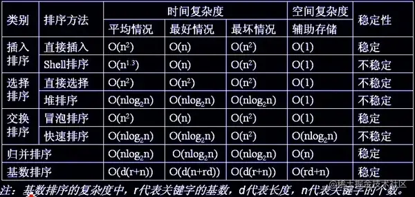

每个语言的排序内部实现都是不同的。

对于 JS 来说，数组长度大于 10 会采用快排，否则使用插入排序。选择插入排序是因为虽然时间复杂度很差，但是在数据 量很小的情况下和 O(N \* logN) 相差无几，然而插入排序需要的常数时间很小，所以相对别的排序来说更快

## JS 尾递归优化斐波拉契数列

正常的斐波拉契数列 js 实现方式

```scss
const Fibonacci = (n) => {
    if (n <= 1) return 1
    return  Fibonacci(n - 1) + Fibonacci(n - 2)
}
Fibonacci(10) // 89
Fibonacci(40) // 165580141 计算缓慢有延迟了
Fibonacci(100) // 栈溢出，无法得到结果复制代码
```

使用尾递归优化该方法

```scss
const Fibonacci = (n, sum1 = 1, sum2 = 1) => {
     if (n <= 1) return sum2
     return Fibonacci(n - 1, sum2, sum1 + sum2)
}
Fibonacci(10) // 89
Fibonacci(100) // 573147844013817200000 速度依旧很快
Fibonacci(1000) // 7.0330367711422765e+208 还是没有压力复制代码
```

尾递归优化可以在数量较大的计算中，可以起到很好的作用

# Vue

## 1. vue 的基本原理

当你把一个普通的 js 对象传入 Vue 实例作为 data 选项，Vue 将遍历此对象所有的属性(property)，并使用 object.defineProperty 把这些属性全部转为 getter/setter。

当一个 Vue 实例创建时，Vue 会遍历 data 中的属性，用 **Object.defineProperty**（vue3.0 使用 proxy ）将它们转为 getter/setter，并且在内部追踪相关依赖，在属性被访问和修改时通知变化。 每个组件实例都有相应的 **watcher 程序实例**，它会在组件渲染的过程中把属性记录为依赖，之后当依赖项的 setter 被调用时，会通知 watcher 重新计算，从而致使它关联的组件得以更新。

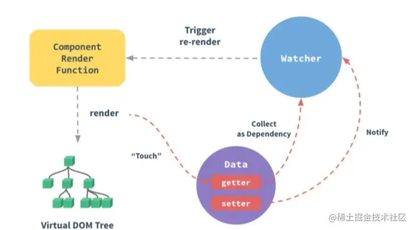

### Vue 的优点

- 轻量级框架：只关注视图层，是一个构建数据的视图集合，大小只有几十 `kb`
- 简单易学：国人开发，中文文档，不存在语言障碍 ，易于理解和学习
- 双向数据绑定：保留了 `angular` 的特点，在数据操作方面更为简单
- 组件化：保留了 `react` 的优点，实现了 `html` 的封装和重用，在构建单页面应用方面有着独特的优势
- 视图，数据，结构分离：使数据的更改更为简单，不需要进行逻辑代码的修改，只需要操作数据就能完成相关操作
- 虚拟 DOM：`dom` 操作是非常耗费性能的，不再使用原生的 `dom` 操作节点，极大解放 `dom` 操作，但具体操作的还是 `dom` 不过是换了另一种方式
- 运行速度更快：相比较于 `react` 而言，同样是操作虚拟 `dom`，就性能而言， `vue` 存在很大的优势

## 2. Vue 响应式的原理

### 什么是数据劫持

通过 Object.defineProperty 对 data 对象的每一个属性进行监听，给每一个属性设置 get/set，实现响应式。

怎么对每一个属性进行监听？封装一个函数完事。

### 发布者模式 / 订阅者模式

在软件架构中，**发布订阅**是一种消息范式，消息的发送者（称为发布者）不会将消息直接发送给特定的接收者（称为订阅者）。而是将发布的消息分为不同的类别，无需了解哪些订阅者（如果有的话）可能存在。同样的，订阅者可以表达对一个或多个类别的兴趣，只接收感兴趣的消息，无需了解哪些发布者（如果有的话）存在。

这里很明显了，区别就在于，不同于观察者和被观察者，**发布者和订阅者是互相不知道对方的存在的，发布者只需要把消息发送到订阅器里面，订阅者只管接受自己需要订阅的内容**

### 响应式原理

Vue 响应式的原理就是采用**数据劫持**结合**发布者-订阅者模式**的方式，通过**Object.defineProperty()** 来劫持各个属性的 setter，getter，在数据变动时发布消息给订阅者，触发相应的监听回调。主要分为以下几个步骤：

**Observe**(被劫持的数据对象) **Compile**(vue 的编译器) **Wather**(订阅者) **Dep**(用于收集 Watcher 订阅者们)

1.需要给**Observe**的数据对象进行递归遍历，包括子属性对象的属性，都加上**setter**和**getter**这样的属性，给这个对象的某个值赋值，就会触发**setter**，那么就能监听到了数据变化。

2.**Compile**解析模板指令，将模板中的变量替换成数据，然后初始化渲染页面视图，并将每个指令对应的节点绑定更新函数，添加监听数据的订阅者，一旦数据有变动，收到通知，更新视图

3.**Watcher**订阅者是**Observer**和**Compile**之间通信的桥梁，主要做的事情是: ① 在自身实例化时往属性订阅器(**Dep**)里面添加自己 ② 自身必须有一个**update**()方法 ③ 待属性变动**dep.notice()** 通知时，能调用自身的**update()** 方法，并触发**Compile**中绑定的回调，则功成身退。

4.MVVM 作为数据绑定的入口，整合**Observer**、**Compile**和**Watcher**三者，通过**Observer**来监听自己的**model**数据变化，通过**Compile**来解析编译模板指令，最终利用**Watcher**搭起**Observer**和**Compile**之间的通信桥梁，达到数据变化 -> 视图更新；视图交互变化(input) -> 数据 model 变更的双向绑定效果。

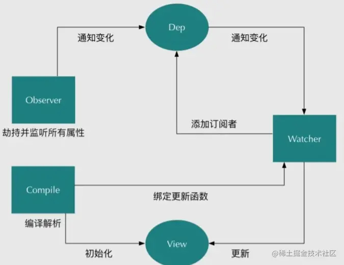

## 3. Object.defineProperty 的使用方式 有什么缺点

在对一些属性进行操作时，使用这种方法无法拦截，比如**通过下标方式修改数组**数据或者**给对象新增属性**，这都不能触发组件的重新渲染，因为 Object.defineProperty 不能拦截到这些操作。更精确的来说，对于数组而言，大部分操作都是拦截不到的，只是 Vue 内部通过重写函数的方式解决了这个问题。

在 Vue3.0 中已经不使用这种方式了，而是通过使用 Proxy 对对象进行代理，从而实现数据劫持。使用 Proxy 的好处是它可以完美的监听到任何方式的数据改变，唯一的缺点是兼容性的问题，因为 Proxy 是 ES6 的语法

## 07. Vue的内置组件

### **component**

渲染一个“元组件”为动态组件。依 is 的值，来决定哪个组件被渲染

在一个多标签的界面中使用 is attribute 来切换不同的组件：tap 栏切换

### **transition**

用于在 Vue 插入、更新或者移除 DOM 时， 提供多种不同方式的应用过渡、动画效果。

### **transition-group**

`<transition-group>` 用于给列表统一设置过渡动画。

### **keep-alive**

- 主要用于保留组件状态或避免组件重新渲染。
- **include** 属性用于指定哪些组件会被缓存，具有多种设置方式。
- **exclude** 属性用于指定哪些组件不会被缓存。
- **max** 属性用于设置最大缓存个数。

### slot

## 8. v-if v-show v-html 的原理

`v-if`会调用 addIfCondition 方法，生成 vnode 的时候会忽略对应节点，render 的时候就不会渲染

`v-show`会生成 vnode，render 的时候也会渲染成真实节点，只是在 render 过程中会在节点的属性中修改 show 属性值，也就是常说的 display

`v-html`会先移除节点下的所有节点，调用 html 方法，通过 addProp 添加 innerHTML 属性，归根结底还是设置 innerHTML 为 v-html 的值

## $$$ 9. v-show 和 v-if 的区别

## 10. 为什么避免 v-for 和 v-if 在一起使用

Vue 处理指令时，v-for 比 v-if 具有更高的`优先级`，虽然用起来也没报错好使，但是性能不高，如果你有 5 个元素被 v-for 循环，v-if 也会分别执行 5 次

## 11. v-for 循环为什么一定要绑定 key

> 提升 vue 渲染性能

- 1.vue 在渲染的时候,会 先把 新 DOM 与 旧 DOM 进行对比， 如果 dom 结构一致，则 vue 会复用旧的 dom。 （此时可能造成数据渲染异常）
- 2.使用 key 可以给 dom 添加一个标识符，让 vue 强制更新 dom

比如有一个列表 li1 到 li4，我们需要在中间插入一个 li3，`li1` 和 `li2` 不会重新渲染，而 `li3、li4、li5` 都会重新渲染

因为在不使用 `key` 或者列表的 `index` 作为 `key` 的时候，每个元素对应的位置关系都是 index，直接导致我们插入的元素到后面的全部元素，对应的位置关系都发生了变更，所以全部都会执行更新操作, 这是不可取的

而在使用唯一 `key` 的情况下，每个元素对应的位置关系就是 `key`，来看一下使用唯一 `key` 值的情况下

这样如图中的 `li3` 和 `li4` 就不会重新渲染，因为元素内容没发生改变，对应的位置关系也没有发生改变。

这也是为什么 v-for 必须要写 key，而且不建议开发中使用数组的 index 作为 key 的原因

总结一下：

- key 的作用主要是为了更高效的更新虚拟 DOM，因为它可以非常精确的找到相同节点，因此 patch 过程会非常高效
- Vue 在 patch 过程中会判断两个节点是不是相同节点时，key 是一个必要条件。比如渲染列表时，如果不写 key，Vue 在比较的时候，就可能会导致频繁更新元素，使整个 patch 过程比较低效，影响性能
- 应该避免使用数组下标作为 key，因为 key 值不是唯一的话可能会导致上面图中表示的 bug，使 Vue 无法区分它他，还有比如在使用相同标签元素过渡切换的时候，就会导致只替换其内部属性而不会触发过渡效果
- 从源码里可以知道，Vue 判断两个节点是否相同时主要判断两者的元素类型和 key 等，如果不设置 key，就可能永远认为这两个是相同节点，只能去做更新操作，就造成大量不必要的 DOM 更新操作，明显是不可取的

### 11.2 为什么不建议用 index 索引作为 key?

使用 index 作为 key 和没写基本上没区别，因为不管数组的顺序怎么颠倒，index 都是 0, 1, 2...这样排列，导致 Vue 会复用错误的旧子节点，做很多额外的工作。

## $$$ 12. v-model

## $$$ 13. v-model 可以被用在自定义组件上吗 如果可以 如何使用

## $$$ 14. v-model 和.sync 的对比

## 18. 什么是插件

**插件通常用来为 `Vue` 添加全局功能**。插件的功能范围没有严格的限制——一般有下面几种：

- 添加全局方法或者属性。如: `vue-custom-element`
- 添加全局资源：指令/过滤器/过渡等。如 `vue-touch`
- 添加全局公共组件 Vue.component()
- 添加全局公共指令 Vue.directive()
- 通过全局混入来添加一些组件选项。如`vue-router`
- 添加 `Vue` 实例方法，通过把它们添加到 `Vue.prototype` 上实现。
- 一个库，提供自己的 `API`，同时提供上面提到的一个或多个功能。如`vue-router`

### 18.2 Vue2 和 Vue3 怎么注册全局组件

Vue2 使用 `Vue.component('组件名'，组件对象)`

Vue3 使用

```scss
const app = createApp(App)
app.component('组件名'，组件对象)
复制代码
```

### 18.3 Vue2、Vue3 怎么封装自定义插件并使用/ Vue.use() （install）

**Vue2**

在 compoents.index.js 里，定义一个函数或对象，在里面可以使用 Vue.compoent 全局注册组件，并暴露出去

在 main.js 里使用 Vue.use( )，参数类型必须是 object 或 Function

**Vue3**

在 compoents.index.ts 里，定义一个函数或对象，在里面可以使用 app.compoent 全局注册组件，并暴露出去

在 main.ts 里使用 app.use( )，参数类型必须是 object 或 Function

---

如果是 Function 那么这个函数就被当做 install 方法

如果是 object 则需要定义一个 install 方法

## 21. 生命周期

**第一阶段：创建前 / 后**

**beforeCreate（创建前）** ：数据观测和初始化事件还未开始，此时 data 的响应式追踪、event/watcher 都还没有被设置，也就是说不能访问到 data、computed、watch、methods 上的方法和数据。

**created（创建后）** ：实例创建完成，实例上配置的 options 包括 data、computed、watch、methods 等都配置完成，但是此时渲染得节点还未挂载到 DOM，所以不能访问到 `$el` 属性。

**beforeMount（挂载前）** ：在挂载开始之前被调用，相关的 render 函数首次被调用。实例已完成以下的配置：编译模板，把 data 里面的数据和模板生成 html。此时还没有挂载 html 到页面上。

**mounted（挂载后）** ：在 el 被新创建的 vm.$el 替换，并挂载到实例上去之后调用。实例已完成以下的配置：用上面编译好的 html 内容替换 el 属性指向的 DOM 对象。完成模板中的 html 渲染到 html 页面中。此过程中进行 ajax 交互。

**另外三个生命周期函数不常用**

另外还有 `keep-alive` 独有的生命周期，分别为 `activated` 和 `deactivated` 。用 `keep-alive` 包裹的组件在切换时不会进行销毁，而是缓存到内存中并执行 `deactivated` 钩子函数，命中缓存渲染后会执行 `activated` 钩子函数。

`errorCapured`钩子，当捕获一个来自子孙组件的错误时被调用。此钩子会收到三个参数：错误对象、发生错误的组件实例以及一个包含错误来源信息的字符串。此钩子可以返回 `false` 以阻止该错误继续向上传播。

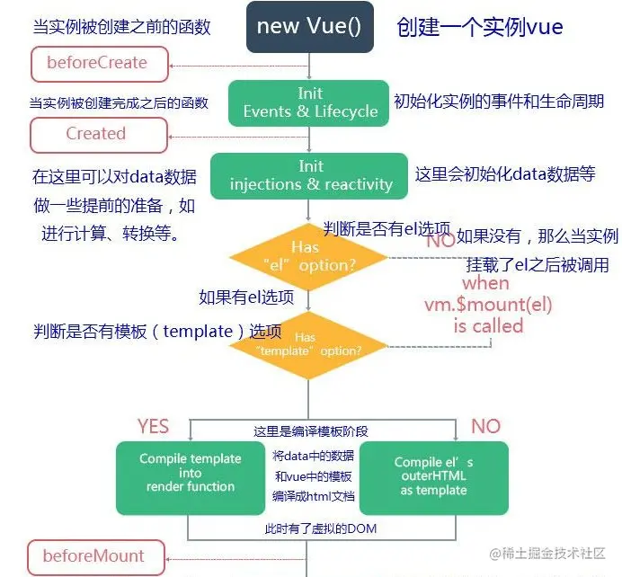

## 22. 组件缓存 keep-alive

**组件缓存**

组件的缓存可以在进行动态组件切换的时候对组件内部数据进行缓存,而不是走销毁流程

使用场景: 多表单切换,对表单内数据进行保存

**keep-alive**

包裹动态组件时，会缓存不活动的组件实例，而不是销毁它们。

是一个抽象组件：它自身不会渲染一个 DOM 元素，也不会出现在父组件链中。 当组件在`<keep-alive>`内被切换，它的`activated`和 `deactivated`这两个生命周期钩子函数将会被对应执行 。

### keep-alive 的参数(include,exclude)

- include(包含): 名称匹配的组件会被缓存-->include 的值为组件的 name。
- exclude(排除): 任何名称匹配的组件都不会被缓存。
- max - 数量 决定最多可以缓存多少组件。

### **keep-alive 的使用**

1. 搭配`<component></component>`使用
2. 搭配路由使用 ( 需配置路由 meta 信息的`keepAlive`属性 )
3. 清除缓存组件
   - 在组件跳转之前使用后置路由守卫判断组件是否缓存
   - ( beforeRouteLeave( to, from, next ){ from.meta.keepAlive = false }

### **keep-alive 的两个钩子函数**

| activated                            | deactivated                      |
| ------------------------------------ | -------------------------------- |
| 在 `keep-alive` 组件激活时调用       | 在`keep-alive` 组件停用时调用    |
| 该钩子函数在服务器端渲染期间不被调用 | 该钩子在服务器端渲染期间不被调用 |

使用`keep-alive`会将数据保留在内存中，如果要在每次进入页面的时候获取最新的数据，需要在 `activated`阶段获取数据，承担原来`created`钩子函数中获取数据的任务。

**注意：** 只有组件被`keep-alive`包裹时，这两个生命周期函数才会被调用，如果作为正常组件使用，是不会被调用的

使用 exclude 排除之后，就算被包裹在 keep-alive 中，这两个钩子函数依然不会被调用！在服务端渲染时，此钩子函数也不会被调用。

设置了缓存的组件钩子调用情况：

第一次进入：beforeRouterEnter ->created->…->activated->…->deactivated> beforeRouteLeave

后续进入时：beforeRouterEnter ->activated->deactivated> beforeRouteLeave

### **keep-alive 主要流程**

1. 判断组件 name ，不在 include 或者在 exclude 中，直接返回 vnode，说明该组件不被缓存。
2. 获取组件实例 key ，如果有获取实例的 key，否则重新生成。
3. key 生成规则，cid +"∶∶"+ tag ，仅靠 cid 是不够的，因为相同的构造函数可以注册为不同的本地组件。
4. 如果缓存对象内存在，则直接从缓存对象中获取组件实例给 vnode ，不存在则添加到缓存对象中。 5.最大缓存数量，当缓存组件数量超过 max 值时，清除 keys 数组内第一个组件。

### **keep-alive 的实现**

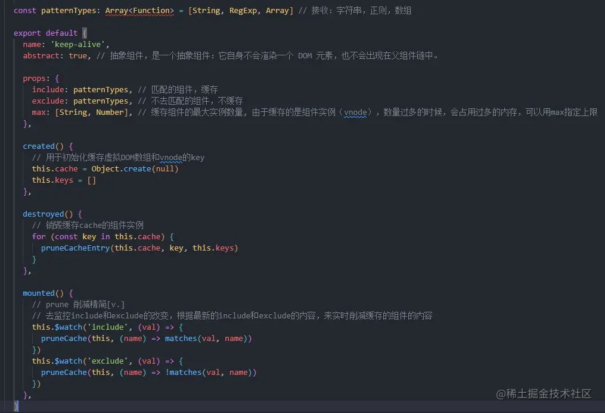

## $$$ 23. 过滤器

## $$$ 24. 插槽

## 25. Vue 为什么采用异步渲染呢

`Vue` 是组件级更新，如果不采用异步更新，那么每次更新数据都会对当前组件进行重新渲染，所以为了性能，`Vue` 会在本轮数据更新后，在异步更新视图。核心思想`nextTick` 。

`dep.notify（）` 通知 watcher 进行更新，`subs[i].update` 依次调用 watcher 的`update` ，`queueWatcher` 将 watcher 去重放入队列， nextTick（`flushSchedulerQueue` ）在下一 tick 中刷新 watcher 队列（异步）。

## 25. $nextTick 原理及作用

其实一句话就可以把`$nextTick`这个东西讲明白：就是你放在`$nextTick`当中的操作不会立即执行，而是等数据更新、DOM 更新完成之后再执行，这样我们拿到的肯定就是最新的了。

Vue 的响应式并不是只数据发生变化之后，DOM 就立刻发生变化，而是按照一定的策略进行 DOM 的更新。

DOM 更新有两种选择，一个是在本次事件循环的最后进行一次 DOM 更新，另一种是把 DOM 更新放在下一轮的事件循环当中。Vue 优先选择第一种，只有当环境不支持的时候才触发第二种机制。

虽然性能上提高了很多，但这个时候问题就出现了。我已经把数据改掉了，但是它的更新异步的，而我在获取的时候，它还没有来得及改，这个时候就需要用到 nextTick

**原理：**

**Vue 的 nextTick 其本质是对 JavaScript 执行原理 `EventLoop` 的一种应用。**

- Vue2 刚开始的时候, $nextTick 是宏任务(setTimeout)，但是宏任务的性能太差。
- 后来改成了微任务 Mutation Observer，但是还是有一些问题：
  - 速度太快了，在一些特殊场景下，DOM 还没更新就去获取了
  - 兼容性不好，很多浏览器不支持
- 后来又更新成了微宏并行阶段：先判断是否支持 Mutation Observer，如果支持就使用，否则使用宏任务
- Vue2.5 版本之后，修复了微任务的那些问题，目前最新的$nextTick 采用的是纯微任务。

由于 Vue 的 DOM 操作是异步的，所以，在上面的情况中，就要将 DOM2 获取数据的操作写在`$nextTick`中。

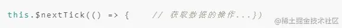

所以，在以下情况下，会用到 nextTick：

- **在数据变化后执行的某个操作，而这个操作需要使用随数据变化而变化的 DOM 结构的时候，这个操作就需要方法在`nextTick()`的回调函数中。**
- **在 vue 生命周期中，如果在 created()钩子进行 DOM 操作，也一定要放在`nextTick()`的回调函数中。**

因为在 created()钩子函数中，页面的 DOM 还未渲染，这时候也没办法操作 DOM，所以，此时如果想要操作 DOM，必须将操作的代码放在`nextTick()`的回调函数中。

## 26. 描述下 Vue2 的自定义指令

在 Vue2.0 中，代码复用和抽象的主要形式是组件。然而，有的情况下，你仍然需要对普通 DOM 元素进行底层操作，这时候就会用到自定义指令。 一般需要对 DOM 元素进行底层操作时使用，尽量只用来操作 DOM 展示，不修改内部的值。当使用自定义指令直接修改 value 值时绑定 v-model 的值也不会同步更新；如必须修改可以在自定义指令中使用 keydown 事件，在 vue 组件中使用 change 事件，回调中修改 vue 数据;

**（1）自定义指令基本内容**

- 全局定义：`Vue.directive("focus",{})`

- 局部定义：`directives:{focus:{}}`

- 钩子函数：指令定义对象提供钩子函数

  1. ```bash
     bind：只调用一次，指令第一次绑定到元素时调用。在这里可以进行一次性的初始化设置。
     复制代码
     ```

  2. ```
     inSerted：被绑定元素插入父节点时调用（仅保证父节点存在，但不一定已被插入文档中）。
     复制代码
     ```

  3. ```sql
     update：所在组件的VNode更新时调用，但是可能发生在其子VNode更新之前调用。指令的值可能发生了改变，也可能没有。但是可以通过比较更新前后的值来忽略不必要的模板更新。
     复制代码
     ```

  4. ```
     ComponentUpdate：指令所在组件的 VNode及其子VNode全部更新后调用。
     复制代码
     ```

  5. ```
     unbind：只调用一次，指令与元素解绑时调用。
     复制代码
     ```

- 钩子函数的参数 ：

  1. el：指令所绑定的元素，可以用来直接操作 DOM
  2. bing： 一个对象，包含以下属性：
     - name: 指令名，不包括 v- 前缀。
     - value: 指令的绑定值， 例如： v-my-directive="1 + 1", value 的值是 2。
     - oldValue: 指令绑定的前一个值，仅在 update 和 componentUpdated 钩子中可用。无论值是否改变都可用。
     - expression: 绑定值的表达式或变量名。 例如 v-my-directive="1 + 1", expression 的值是 "1 + 1"。
     - arg: 传给指令的参数。例如 v-my-directive:foo， arg 的值是 "foo"。
     - modifiers: 一个包含修饰符的对象。 例如： v-my-directive.foo.bar, 修饰符对象 modifiers 的值是 { foo: true, bar: true }。
  3. vnode： 编译生成的虚拟节点
  4. oldVnode：上一个虚拟节点（更新钩子函数中才有用）

**（2）使用场景**

- 普通 DOM 元素进行底层操作的时候，可以使用自定义指令
- 自定义指令是用来操作 DOM 的。尽管 Vue 推崇数据驱动视图的理念，但并非所有情况都适合数据驱动。自定义指令就是一种有效的补充和扩展，不仅可用于定义任何的 DOM 操作，并且是可复用的。

**（3）使用案例**

初级应用：

- 鼠标聚焦
- 下拉菜单
- 相对时间转换
- 滚动动画

高级应用：

- 自定义指令实现图片懒加载
- 自定义指令集成第三方插件

## 27. 简述 mixin、extends 的覆盖逻辑

**（1）mixin 和 extends** mixin 和 extends 均是用于合并、拓展组件的，两者均通过 mergeOptions 方法实现合并。

- mixins 接收一个混入对象的数组，其中混入对象可以像正常的实例对象一样包含实例选项，这些选项会被合并到最终的选项中。Mixin 钩子按照传入顺序依次调用，并在调用组件自身的钩子之前被调用。
- extends 主要是为了便于扩展单文件组件，接收一个对象或构造函数。

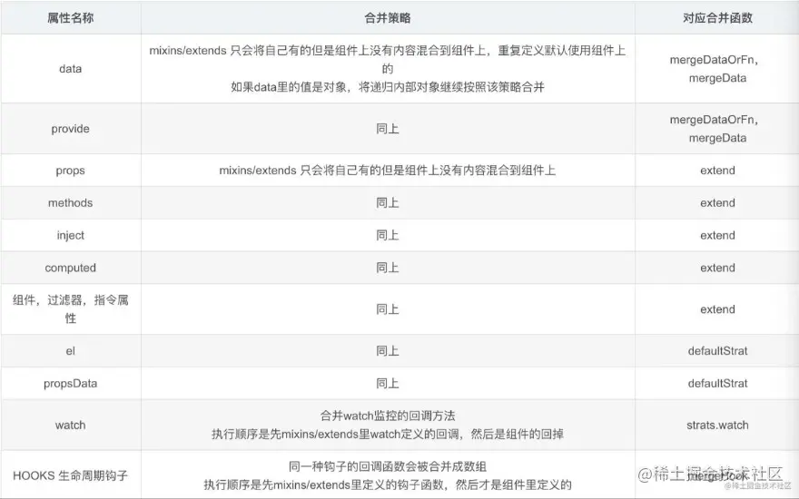

**（2）mergeOptions 的执行过程**

- 规范化选项（normalizeProps、normalizelnject、normalizeDirectives)
- 对未合并的选项，进行判断

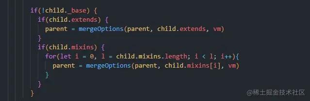

- 合并处理。根据一个通用 Vue 实例所包含的选项进行分类逐一判断合并，如 props、data、 methods、watch、computed、生命周期等，将合并结果存储在新定义的 options 对象里。
- 返回合并结果 options。

### extend 有什么作用

这个 API 很少用到，作用是扩展组件生成一个构造器，通常会与 `$mount` 一起使用。

### 什么是 mixin ？

Mixin 使我们能够为 Vue 组件编写可插拔和可重用的功能。

如果希望在多个组件之间重用一组组件选项，例如生命周期 hook、 方法等，则可以将其编写为 mixin，并在组件中简单的引用它。

然后将 mixin 的内容合并到组件中。如果你要在 mixin 中定义生命周期 hook，那么它在执行时将优化于组件自已的 hook。

### mixin 和 mixins 区别

`mixin` 用于全局混入，会影响到每个组件实例，通常插件都是这样做初始化的。

虽然文档不建议在应用中直接使用 `mixin`，但是如果不滥用的话也是很有帮助的，比如可以全局混入封装好的 `ajax` 或者一些工具函数等等。

`mixins` 应该是最常使用的扩展组件的方式了。如果多个组件中有相同的业务逻辑，就可以将这些逻辑剥离出来，通过 `mixins` 混入代码，比如上拉下拉加载数据这种逻辑等等。 另外需要注意的是 `mixins` 混入的钩子函数会先于组件内的钩子函数执行，并且在遇到同名选项的时候也会有选择性的进行合并。

## $$$ 28. data 为什么是一个函数而不是对象

对象是引用数据类型，复用组件时，由于数据都指向同一个 data，当在一个组件中修改 data 时，其它复用组件中的 data 会同时被修改。

使用函数返回对象，每次返回的都是一个新对象，则不会出现这个问题。

## 29. 动态给 vue 的 data 添加一个新的属性时会发生什么 怎样解决

1. `vue2`是用过`Object.defineProperty`实现数据响应式
2. 当我们访问定义的属性或者修改属性值的时候都能够触发`setter`与`getter`
3. 但是我们为`obj`添加新属性的时候，却无法触发事件属性的拦截
4. 原因是一开始`obj`的要定义的属性被设成了响应式数据，而`新增的属性`并没有通过`Object.defineProperty`设置成响应式数据

**解决方案:**

1. Vue.set()
   - 通过`Vue.set`向响应式对象中添加一个`property`，并确保这个新 `property`同样是响应式的，且触发视图更新
2. Object.assign()
   - 直接使用`Object.assign()`添加到对象的新属性不会触发更新
   - 应创建一个新的对象，合并原对象和混入对象的属性
3. $forceUpdate
   - 如果你发现你自己需要在 `Vue`中做一次强制更新，99.9% 的情况，是你在某个地方做错了事
   - `$forceUpdate`迫使`Vue` 实例重新渲染
   - PS：仅仅影响实例本身和插入插槽内容的子组件，而不是所有子组件。

总结

- 如果为对象添加**少量**的新属性，可以直接采用`Vue.set()`
- 如果需要为新对象添加**大量**的新属性，则通过`Object.assign()`创建新对象
- 如果你实在不知道怎么操作时，可采取`$forceUpdate()`进行强制刷新 (不建议)

PS：`vue3`是用过`proxy`实现数据响应式的，直接动态添加新属性仍可以实现数据响应式

## $$$ 30. data 中某一个属性的值发生改变后 视图会立即同步执行重新渲染吗

**不会立即同步执行重新渲染**。Vue 实现响应式并不是数据发生变化之后 DOM 立即变化，而是按一定的策略进行 DOM 的更新。Vue 在更新 DOM 时是`异步`执行的。只要侦听到数据变化， Vue 将开启一个队列，并缓冲在同一事件循环中发生的所有数据变更。

如果同一个 watcher 被多次触发，只会被推入到队列中一次。这种在缓冲时去除重复数据对于避免不必要的计算和 DOM 操作是非常重要的。然后，在下一个的事件循环 tick 中，Vue 刷新队列并执行实际（已去重的）工作。

vue 在检测到你的数据发生变化时，将开启一个异步更新队列，通过 diff 算法找出实际需要更新的 dom 元素，需要等队列中所有数据变化完成之后，才统一进行实际 dom 更新。

## 31. vue2 中如何监听对象或者数组某个属性的变化

当在项目中直接设置数组的某一项的值，或者直接设置对象的某个属性值，这个时候，你会发现页面并没有更新。这是因为 Object.defineProperty()限制，监听不到变化。

解决方式：

- this.$set(你要改变的数组/对象，你要改变的位置/key，你要改成什么 value)

```kotlin
this.$set(this.arr, 0, "OBKoro1"); // 改变数组
this.$set(this.obj, "c", "OBKoro1"); // 改变对象
```

- 调用以下几个数组的方法

```scss
splice()、push()、pop()、shift()、unshift()、sort()、reverse()
```

vue 源码里缓存了 array 的原型链，然后重写了这几个方法，触发这几个方法的时候会 observer 数据，意思是使用这些方法不用我们再进行额外的操作，视图自动进行更新。 推荐使用 splice 方法会比较好自定义，因为 splice 可以在数组的任何位置进行删除/添加操作。

###### vm.`$set` 的实现原理是

- 如果目标是数组，直接使用数组的 splice 方法触发相应式
- 如果目标是对象，会先判读属性是否存在、对象是否是响应式，最终如果要对属性进行响应式处理，则是通过调用 defineReactive 方法进行响应式处理（ defineReactive 方法就是 Vue 在初始化对象时，给对象属性采用 Object.defineProperty 动态添加 getter 和 setter 的功能所调用的方法）

## **32. assets 和 static 的区别**

- **相同点：** `assets` 和 `static` 两个都是存放静态资源文件。项目中所需要的资源文件图片，字体图标，样式文件等都可以放在这两个文件下，这是相同点
- **不相同点：** `assets` 中存放的静态资源文件在项目打包时，也就是运行 `npm run build` 时会将 `assets` 中放置的静态资源文件进行打包上传，所谓打包简单点可以理解为压缩体积，代码格式化。而压缩后的静态资源文件最终也都会放置在 `static` 文件中跟着 `index.html` 一同上传至服务器。`static` 中放置的静态资源文件就不会要走打包压缩格式化等流程，而是直接进入打包好的目录，直接上传至服务器。因为避免了压缩直接进行上传，在打包时会提高一定的效率，但是 `static` 中的资源文件由于没有进行压缩等操作，所以文件的体积也就相对于 `assets` 中打包后的文件提交较大点。在服务器中就会占据更大的空间。
- **建议：** 将项目中 `template`需要的样式文件 js 文件等都可以放置在 `assets` 中，走打包这一流程。减少体积。而项目中引入的第三方的资源文件如`iconfoont.css` 等文件可以放置在 `static` 中，因为这些引入的第三方文件已经经过处理，不再需要处理，直接上传。

## 34. Vue 的 template 模版编译原理

vue 中的模板 template 无法被浏览器解析并渲染，因为这不属于浏览器的标准，不是正确的 HTML 语法，所有需要将 template 转化成一个 JavaScript 函数，这样浏览器就可以执行这一个函数并渲染出对应的 HTML 元素，就可以让视图跑起来了，这一个转化的过程，就成为模板编译。模板编译又分三个阶段，解析 parse，优化 optimize，生成 generate，最终生成可执行函数 render。

- **解析阶段**：使用大量的正则表达式对 template 字符串进行解析，将标签、指令、属性等转化为抽象语法树 AST。
- **优化阶段**：遍历 AST，找到其中的一些静态节点并进行标记，方便在页面重渲染的时候进行 diff 比较时，直接跳过这一些静态节点，优化 runtime 的性能。
- **生成阶段**：将最终的 AST 转化为 render 函数字符串。

## 35. template 和 jsx 的有什么分别？

对于 runtime 来说，只需要保证组件存在 render 函数即可，而有了预编译之后，只需要保证构建过程中生成 render 函数就可以。在 webpack 中，使用`vue-loader`编译.vue 文件，内部依赖的`vue-template-compiler`模块，在 webpack 构建过程中，将 template 预编译成 render 函数。与 react 类似，在添加了 jsx 的语法糖解析器`babel-plugin-transform-vue-jsx`之后，就可以直接手写 render 函数。

所以，**template 和 jsx 的都是 render 的一种表现形式**，不同的是：JSX 相对于 template 而言，具有更高的灵活性，在复杂的组件中，更具有优势，而 template 虽然显得有些呆滞。但是 template 在代码结构上更符合视图与逻辑分离的习惯，更简单、更直观、更好维护。

## 35.2 讲讲什么是 JSX ？

jsx 是 JavaScript 的一种语法扩展，它跟模板语言很接近，但是它充分具备 JavaScript 的能力 当 Facebook 第一次发布 React 时，他们还引入了一种新的 JS 方言 JSX，将原始 HTML 模板嵌入到 JS 代码中。JSX 代码本身不能被浏览器读取，必须使用 Babel 和 webpack 等工具将其转换为传统的 JS。 JSX 中的标签可以是单标签，也可以是双标签，但必须保证标签是闭合的。

## 36. 对 SSR 的理解

SSR 也就是服务端渲染，也就是将 Vue 在客户端把标签渲染成 HTML 的工作放在服务端完成，然后再把 html 直接返回给客户端

**SSR 的优势**：

- 更好的 SEO
- 首屏加载速度更快

**SSR 的缺点**：

- 开发条件会受到限制，服务器端渲染只支持 beforeCreate 和 created 两个钩子；
- 当需要一些外部扩展库时需要特殊处理，服务端渲染应用程序也需要处于 Node.js 的运行环境；
- 更多的服务端负载。

## 37. vue 初始化页面闪动问题

使用 vue 开发时，在 vue 初始化之前，由于 div 是不归 vue 管的，所以我们写的代码在还没有解析的情况下会容易出现花屏现象，看到类似于{{message}}的字样，虽然一般情况下这个时间很短暂，但是还是有必要让解决这个问题的。

首先：在 css 里加上以下代码：


如果没有彻底解决问题，则在根元素加上`style="display: none;" :style="{display: 'block'}"`

## $$$ 38. 虚拟 DOM

## $$$ 39. Diff 算法

## $$$ 40. SPA 单页面应用

## $$$ 41. 使用异步组件有什么好处

所谓的异步组件就是通过 import 或者 require 导入的 vue 组件

vue 开发过程中，我们会做出特别多的组件，包括 login,header,footer,main 等等，会使页面打开很慢

可以避免页面一加载时就去加载全部的组件，从而导致页面访问时间变长的问题。使用异步加载组件后，只有当需要某个组件时才会去加载需要的组件。

## 42.https://www.jianshu.com/p/16081205159c

# 路由

## 对前端路由的理解

在前端技术早期，一个 url 对应一个页面，如果要从 A 页面切换到 B 页面，那么必然伴随着页面的刷新。这个体验并不好，不过在最初也是无奈之举，用户只有在刷新页面的情况下，才可以重新去请求数据。

后来，改变发生了，Ajax 出现了，它允许人们在不刷新页面的情况下发起请求；与之共生的，还有“不刷新页面即可更新页面内容”这种需求。在这样的背景下，出现了 **SPA（单页面应用**）。

SPA 极大地提升了用户体验，它允许页面在不刷新的情况下更新页面内容，使内容的切换更加流畅。但是在 SPA 诞生之初，人们并没有考虑到“定位”这个问题——在内容切换前后，页面的 URL 都是一样的，这就带来了两个问题

- SPA 其实并不知道当前的页面“进展到了哪一步”。可能在一个站点下经过了反复的“前进”才终于唤出了某一块内容，但是此时只要刷新一下页面，一切就会被清零，必须重复之前的操作、才可以重新对内容进行定位——SPA 并不会“记住”你的操作
- 由于有且仅有一个 URL 给页面做映射，这对 SEO 也不够友好，搜索引擎无法收集全面的信息

**为了解决这个问题，前端路由出现了**。

前端路由可以帮助我们在仅有一个页面的情况下，“记住”用户当前走到了哪一步——为 SPA 中的各个视图匹配一个唯一标识。这意味着用户前进、后退触发的新内容，都会映射到不同的 URL 上去。此时即便他刷新页面，因为当前的 URL 可以标识出他所处的位置，因此内容也不会丢失。

那么如何实现这个目的呢？首先要解决两个问题

- 当用户刷新页面时，浏览器会默认根据当前 URL 对资源进行重新定位（发送请求）。这个动作对 SPA 是不必要的，因为我们的 SPA 作为单页面，无论如何也只会有一个资源与之对应。此时若走正常的请求-刷新流程，反而会使用户的前进后退操作无法被记录。
- 单页面应用对服务端来说，就是一个 URL、一套资源，那么如何做到用“不同的 URL”来映射不同的视图内容呢？

从这两个问题来看，服务端已经完全救不了这个场景了。所以要靠咱们前端自力更生，不然怎么叫“前端路由”呢？作为前端，可以提供这样的解决思路

- 拦截用户的刷新操作，避免服务端盲目响应、返回不符合预期的资源内容。把刷新这个动作完全放到前端逻辑里消化掉。
- 感知 URL 的变化。这里不是说要改造 URL、凭空制造出 N 个 URL 来。而是说 URL 还是那个 URL，只不过我们可以给它做一些微小的处理——这些处理并不会影响 URL 本身的性质，不会影响服务器对它的识别，只有我们前端感知的到。一旦我们感知到了，我们就根据这些变化、用 JS 去给它生成不同的内容。

## 路由跳转和 location.href 有什么区别

- 使用 `location.href= /url`来跳转，简单方便，但是刷新了页面
- 使用 `history.pushState( /url )` ，无刷新页面，静态跳转
- 引进 router ，然后使用 `router.push( /url )` 来跳转，使用了`diff`算法，实现了按需加载，减少了 dom 的消耗。其实使用 router 跳转和使用 `history.pushState()` 没什么差别的，因为 vue-router 就是用了 `history.pushState()` ，尤其是在 history 模式下

## 如何获取页面的 hash 变化

**（1）监听$route 的变化**

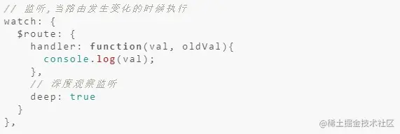

**（2）window.location.hash 读取#值**

window.location.hash 的值可读可写，读取来判断状态是否改变，写入时可以在不重载网页的前提下，添加一条历史访问记录

# Vuex

## 1. 什么是 Vuex 谈谈你对它的理解

1. 首先 vuex 的出现是为了解决 web 组件化开发的过程中，各组件之间传值的复杂和混乱的问题
2. 将我们在多个组件中需要共享的数据放到 state 中
3. 要获取或格式化数据需要使用 getters
4. 改变 state 中的数据，可以使用 mutation，但是只能包含同步的操作，在具体组件里面调用的方式`this.$store.commit('xxxx')`
5. Action 也是改变 state 中的数据，不过是提交的 mutation，并且可以包含异步操作，在组件中的调用方式`this.$store.dispatch('xxx')`

**Vuex**是一个专为 Vue.js 应用程序开发的状态管理模式。它采用集中式存储管理应用的所有组件的状态，并以相应的规则保证状态以一种可预测的方式发生变化。Vuex 也集成到 Vue 的官方调试工具 devtools extension，提供了诸如零配置的 time-travel 调试、状态快照导入导出等高级调试功能

## 2. Vuex 各模块在核心流程中的主要功能

`Vue Components`∶ Vue 组件。HTML 页面上，负责接收用户操作等交互行为，执行 dispatch 方法触发对应 action 进行回应。

`dispatch`∶ 操作行为触发方法，是唯一能执行 action 的方法。

`actions`∶ 操作行为处理模块。负责处理 Vue Components 接收到的所有交互行为。包含同步/异步操作，支持多个同名方法，按照注册的顺序依次触发。向后台 API 请求的操作就在这个模块中进行，包括触发其他 action 以及提交 mutation 的操作。该模块提供了 Promise 的封装，以支持 action 的链式触发。

`commit`∶ 状态改变提交操作方法。对 mutation 进行提交，是唯一能执行 mutation 的方法。

`mutations`∶ 状态改变操作方法。是 Vuex 修改 state 的唯一推荐方法，其他修改方式在严格模式下将会报错。该方法只能进行同步操作，且方法名只能全局唯一。操作之中会有一些 hook 暴露出来，以进行 state 的监控等。

`state`∶ 页面状态管理容器对象。集中存储 Vuecomponents 中 data 对象的零散数据，全局唯一，以进行统一的状态管理。页面显示所需的数据从该对象中进行读取，利用 Vue 的细粒度数据响应机制来进行高效的状态更新

`getters`∶ state 对象读取方法。图中没有单独列出该模块，应该被包含在了 render 中，Vue Components 通过该方法读取全局 state 对象

## 2.1 简述 Vuex 的数据传输流程

当组件进行数据修改的时候我们需要调**用 dispatch 来触发 actions 里面的方法**。actions 里面的每个方法中都会有一个 commit 方法，当方法执行的时候会通过**commit 来触发 mutations 里面的方法进行数据的修改**。mutations 里面的每个函数都会有一个 state 参数，这样就可以在**mutations 里面进行 state 的数据修改**，当数据修改完毕后，会传导给页面。页面的数据也会发生改变

## 3. vuex 中有几个核心属性 分别是什么

一共有 5 个核心属性，分别是:

- `state`唯一数据源，Vue 实例中的 data 遵循相同的规则
- `mutation`更改 Vuex 的 store 中的状态的唯一方法是提交 mutation，非常类似于事件，通过 store.commit 方法触发
- `action`类似于 mutation，不同在于 action 提交的是 mutation，而不是直接变更状态，action 可以包含任意异步操作
- `module` 由于使用单一状态树，应用的所有状态会集中到一个比较大的对象。当应用变得非常复杂时，store 对象就有可能变得相当臃肿。为了解决以上问题，Vuex 允许我们将 store 分割成模块（module）。

```css
const moduleA = {
  state: () => ({ ... }),
  mutations: { ... },
  actions: { ... },
  getters: { ... }
}

const moduleB = {
  state: () => ({ ... }),
  mutations: { ... },
  actions: { ... }
}

const store = new Vuex.Store({
  modules: {
    a: moduleA,
    b: moduleB
  }
})

store.state.a // -> moduleA 的状态
store.state.b // -> moduleB 的状态
```

- `getters` 可以认为是 store 的计算属性，就像计算属性一样，getter 的返回值会根据它的依赖被缓存起来，且只有当它的依赖值发生了改变才会被重新计算。Getter 会暴露为 store.getters 对象，你可以以属性的形式访问这些值

```php
const store = new Vuex.Store({
  state: {
    todos: [
      { id: 1, text: '...', done: true },
      { id: 2, text: '...', done: false }
    ]
  },
  getters: {
    doneTodos: state => {
      return state.todos.filter(todo => todo.done)
    }
  }
})

store.getters.doneTodos // -> [{ id: 1, text: '...', done: true }]
```

## 4. Vuex 中 action 和 mutation 的区别

`mutation`中的操作是一系列的同步函数，用于修改 state 中的变量的的状态。当使用 vuex 时需要通过 commit 来提交需要操作的内容。mutation 非常类似于事件：每个 mutation 都有一个字符串的 事件类型 (type) 和 一个 回调函数 (handler)。这个回调函数就是实际进行状态更改的地方，并且它会**接受 state 作为第一个参数**

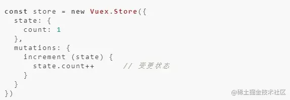

当触发一个类型为 increment 的 mutation 时，需要调用此函数

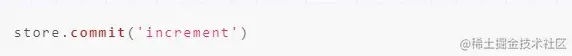

而`action`类似于 mutation，不同点在于

- action 可以包含任意异步操作
- action 提交的是 mutation，而不是直接变更状态

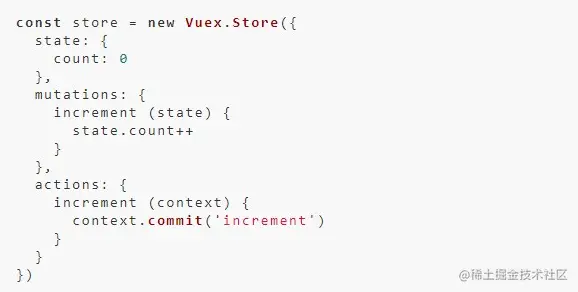

`action`函数接受一个与 store 实例具有相同方法和属性的 context 对象，因此你可以调用 context.commit 提交一个 mutation，或者通过 context.state 和 context.getters 来获取 state 和 getters。 所以，两者的不同点如下

- mutation 专注于修改 State，理论上是修改 State 的唯一途径；action 用来处理业务代码、异步请求
- mutation：必须同步执行；action ：可以异步，但不能直接操作 State
- 在视图更新时，先触发 actions，actions 再触发 mutation
- mutation 的参数是 state，它包含 store 中的数据；store 的参数是 context，它是 state 的父级，包含 state、getters

## 5. vuex 的 getter 的作用

`getter`有点类似 Vue.js 的**计算属性**，当我们需要从 store 的 state 中派生出一些状态，那么我们就需要使用 getter，getter 会接收 state 作为第 一个参数，而且 getter 的返回值会根据它的依赖被缓存起来，只有 getter 中的依赖值（state 中的某个需要派生状态的值）发生改变的时候才会被重新计算。

## 6. Vuex 和 localStorage 的区别

**（1）** **最重要的区别**

- vuex 存储在**内存**中
- localstorage 则以**文件**的方式存储在**本地**，只能存储字符串类型的数据，存储对象需要 JSON 的 stringify 和 parse 方法进行处理。 读取内存比读取硬盘速度要快

**（2）应用场景**

- Vuex 是一个专为 Vue.js 应用程序开发的状态管理模式。它采用集中式存储管理应用的所有组件的状态，并以相应的规则保证状态以一种可预测的方式发生变化。vuex 用于组件之间的传值。
- localstorage 是本地存储，是将数据存储到浏览器的方法，**一般是在跨页面传递数据时使用 。**
- Vuex 能做到数据的响应式，localstorage 不能

**（3）永久性**

**刷新页面时 vuex 存储的值会丢失，localstorage 不会。**

**注意：** 对于不变的数据确实可以用 localstorage 可以代替 vuex，但是当两个组件共用一个数据源（对象或数组）时，如果其中一个组件改变了该数据源，希望另一个组件响应该变化时，localstorage 无法做到，原因就是上面的最重要的区别。

## 7. Vuex 页面刷新时丢失怎么处理

用 sessionstorage 或者 localstorage 存储数据

存储： sessionStorage.setItem( '名', JSON.stringify(值) ) 使用： sessionStorage.getItem('名') 得到的值为字符串类型，用 JSON.parse()去引号

## 8. Vuex 和单纯的全局对象有什么区别

- Vuex 的状态存储是**响应式**的。当 Vue 组件从 store 中读取状态的时候，若 store 中的状态发生变化，那么相应的组件也会相应地得到高效更新。
- 不能直接改变 store 中的状态。改变 store 中的状态的唯一途径就是显式地提交 (commit) mutation。这样可以方便地跟踪每一个状态的变化，从而能够实现一些工具帮助更好地了解我们的应用。

## 9. react 的 Redux 和 Vuex 有什么区别 它们的共同思想

**（1）Redux 和 Vuex 区别**

- Vuex 改进了 Redux 中的 Action 和 Reducer 函数，以 mutations 变化函数取代 Reducer，无需 switch，只需在对应的 mutation 函数里改变 state 值即可
- Vuex 由于 Vue 自动重新渲染的特性，无需订阅重新渲染函数，只要生成新的 State 即可
- Vuex 数据流的顺序是 ∶View 调用 store.commit 提交对应的请求到 Store 中对应的 mutation 函数->store 改变（vue 检测到数据变化自动渲染）

通俗点理解就是，vuex 弱化 dispatch，通过 commit 进行 store 状态的一次更变;取消了 action 概念，不必传入特定的 action 形式进行指定变更;弱化 reducer，基于 commit 参数直接对数据进行转变，使得框架更加简易;

**（2）共同思想**

- 单—的数据源
- 变化可以预测

本质上：redux 与 vuex 都是对 mvvm 思想的服务，将数据从视图中抽离的一种方案; 形式上：vuex 借鉴了 redux，将 store 作为全局的数据中心，进行 mode 管理;

## 10. 为什么要用 Vuex 或者 Redu

由于传参的方法对于多层嵌套的组件将会非常繁琐，并且对于兄弟组件间的状态传递无能为力。我们经常会采用父子组件直接引用或者通过事件来变更和同步状态的多份拷贝。以上的这些模式非常脆弱，通常会导致代码无法维护。

所以需要把组件的**共享**状态抽取出来，以一个全局单例模式管理。在这种模式下，组件树构成了一个巨大的"视图"，不管在树的哪个位置，任何组件都能获取状态或者触发行为。

另外，通过定义和隔离状态管理中的各种概念并强制遵守一定的规则，代码将会变得更结构化且易维护。

## 11. 为什么 Vuex 的 mutation 中不能做异步操作

- Vuex 中所有的状态更新的唯一途径都是 mutation，异步操作通过 Action 来提交 mutation 实现，这样可以方便地跟踪每一个状态的变化，从而能够实现一些工具帮助更好地了解我们的应用。
- 每个 mutation 执行完成后都会对应到一个新的状态变更，这样 devtools 就可以打个快照存下来，然后就可以实现 time-travel 了。如果 mutation 支持异步操作，就没有办法知道状态是何时更新的，无法很好的进行状态的追踪，给调试带来困难。

## 12. Vuex 的严格模式是什么 有什么作用 如何开启

在严格模式下，无论何时发生了状态变更且不是由 mutation 函数引起的，将会抛出错误。这能保证所有的状态变更都能被调试工具跟踪到。

在 Vuex.Store 构造器选项中开启,如下

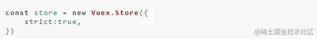

## 13. 如何在组件中批量使用 Vuex 的 getter 属性

使用`mapGetters`辅助函数, 利用对象展开运算符将 getter 混入 computed 对象中

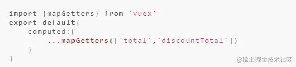

## 14. 如何在组件中重复使用 Vuex 的 mutation

使用`mapMutations`辅助函数,在组件中这么使用

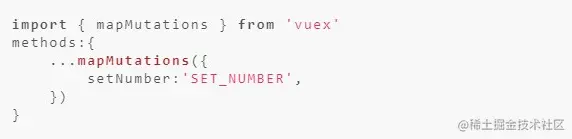

然后调用`this.setNumber(10)`相当调用`this.$store.commit('SET_NUMBER',10)`

## 15. Vuex 的辅助函数怎么用

比如当一个组件需要获取多个状态时候，将这些状态都声明为计算属性会有些重复和冗余。为了解决这个问题，我们可以使用 `mapState`辅助函数帮助我们生成计算属性，让你少按几次键。

### mapState

```javascript
import { mapState } from "vuex"

export default {
  // ...
  computed: {
    ...mapState({
      // 箭头函数可使代码更简练
      count: state => state.count,
      // 传字符串参数 'count' 等同于 `state => state.count`
      countAlias: "count",

      // 为了能够使用 `this` 获取局部状态，必须使用常规函数
      countPlusLocalState(state) {
        return state.count + this.localCount
      },
    }),
  },
}
```

定义的属性名与 state 中的名称相同时，可以传入一个数组

```scss
//定义state
const state={
    count:1,
}

//在组件中使用辅助函数
computed:{
    ...mapState(['count'])
}
```

### mapGetters

```perl
computed:{
    ...mapGetters({
      // 把 `this.doneCount` 映射为 `this.$store.getters.doneTodosCount`
      doneCount: 'doneTodosCount'
    })
}
```

当属性名与 getters 中定义的相同时，可以传入一个数组

总结：

- mapState 与 mapGetters 都用 computed 来进行映射
- 在组件中映射完成后，通过 this.映射属性名进行使用

### mapMutations

```css
methods: {
  ...mapMutations({
        add: "increment" // 将 `this.add()` 映射为 `this.$store.commit( increment )`
    });
}
```

当属性名与 mapMutatios 中定义的相同时，可以传入一个数组

```perl
methods:{
    ...mapMutations([
        'increment', // 将 `this.increment()` 映射为 `this.$store.commit('increment')`

        // `mapMutations` 也支持载荷：
        'incrementBy' // 将 `this.incrementBy(amount)` 映射为 `this.$store.commit('incrementBy', amount)`
    ]),
}
```

### mapActions

```css
mathods: {
  ...mapActions({
        add: "increment" // 将 `this.add()` 映射为 `this.$store.dispatch( increment )`
    });
}
```

当属性名与 mapActios 中定义的相同时，可以传入一个数组

```perl
methods:{
    ...mapActions([
        'increment', // 将 `this.increment()` 映射为 `this.$store.dispatch('increment')`
        // `mapActions` 也支持载荷：
        'incrementBy' // 将 `this.incrementBy(amount)` 映射为 `this.$store.dispatch('incrementBy', amount)`
    ]),
}
```

总结

- mapMutations 与 mapActios 都在 methods 中进行映射
- 映射之后变成一个方法

# Vue2

## 1.怎样理解 Vue 的单向数据流

所有的 prop 都使得其父子 prop 之间形成了一个**单向下行绑定**：父级 prop 的更新会向下流动到子组件中，但是反过来则不行。这样会防止从子组件意外改变父级组件的状态，从而导致你的应用的数据流向难以理解。

额外的，每次父级组件发生更新时，子组件中所有的 prop 都将会刷新为最新的值。这意味着你不应该在一个子组件内部改变 prop。如果你这样做了，Vue 会在浏览器的控制台中发出警告。子组件想修改时，只能通过 $emit 派发一个自定义事件，父组件接收到后，由父组件修改。

有两种常见的试图改变一个 prop 的情形

- **这个 prop 用来传递一个初始值；这个子组件接下来希望将其作为一个本地的 prop 数据来使用。** 在这种情况下，最好定义一个本地的 data 属性并将这个 prop 用作其初始值

```kotlin
props: ['initialCounter'],
data: function () {
  return {
    counter: this.initialCounter
  }
}
```

- **这个 prop 以一种原始的值传入且需要进行转换。** 在这种情况下，最好使用这个 prop 的值来定义一个计算属性

```javascript
props: ['size'],
computed: {
  normalizedSize: function () {
    return this.size.trim().toLowerCase()
  }
}
```

## 2.在什么阶段才能访问操作 DOM

在钩子函数 mounted 被调用前，Vue 已经将编译好的模板挂载到页面上，所以在 mounted 中可以访问操作 DOM

## 3. 父组件可以监听到子组件的生命周期吗

比如有父组件 Parent 和子组件 Child，如果父组件监听到子组件挂载 mounted 就做一些逻辑处理，可以通过以下写法实现

```typescript
// Parent.vue
<Child @mounted="doSomething"/>

// Child.vue
mounted() {
  this.$emit("mounted");
}
```

以上需要手动通过 $emit 触发父组件的事件，更简单的方式可以在父组件引用子组件时通过 @hook 来监听即可，如下所示

```typescript
//  Parent.vue
<Child @hook:mounted="doSomething" ></Child>

doSomething() {
   console.log('父组件监听到 mounted 钩子函数 ...');
},

//  Child.vue
mounted(){
   console.log('子组件触发 mounted 钩子函数 ...');
},

// 以上输出顺序为：
// 子组件触发 mounted 钩子函数 ...
// 父组件监听到 mounted 钩子函数 ...
```

当然 @hook 方法不仅仅是可以监听 mounted，其它的生命周期事件，例如：created，updated 等都可以监听

## 4.Vue 怎么用 vm.$set()解决对象新增属性不能响应的问题

```kotlin
export function set (target: Array<any> | Object, key: any, val: any): any {
  // target 为数组
  if (Array.isArray(target) && isValidArrayIndex(key)) {
    // 修改数组的长度, 避免索引>数组长度导致splcie()执行有误
    target.length = Math.max(target.length, key)
    // 利用数组的splice变异方法触发响应式
    target.splice(key, 1, val)
    return val
  }
  // key 已经存在，直接修改属性值
  if (key in target && !(key in Object.prototype)) {
    target[key] = val
    return val
  }
  const ob = (target: any).__ob__
  // target 本身就不是响应式数据, 直接赋值
  if (!ob) {
    target[key] = val
    return val
  }
  // 对属性进行响应式处理
  defineReactive(ob.value, key, val)
  ob.dep.notify()
  return val
}
```

我们阅读以上源码可知，vm.$set 的实现原理是

- 如果目标是数组，直接使用数组的 splice 方法触发相应式
- 如果目标是对象，会先判读属性是否存在、对象是否是响应式，最终如果要对属性进行响应式处理，则是通过调用 defineReactive 方法进行响应式处理（ defineReactive 方法就是 Vue 在初始化对象时，给对象属性采用 Object.defineProperty 动态添加 getter 和 setter 的功能所调用的方法）

## 5. 请说下封装 vue 组件的过程

> 有复用的地方就有封装（js 如此，vue 也是如此）

- 1.先分析需求：确定业务需求，把页面中可以复用的结构，样式以及功能
  - 找出业务需求中存在复用的地方
- 2.具体步骤：Vue.component 或者在 new Vue 配置项 components 中, 定义组件名, 可以在 props 中接受给组件传的参数和值，子组件修改好数据后，想把数据传递给父组件。可以采用$emit 方法

## 6. 讲一下组件的命名规范

- 给组件命名有两种方式(在 Vue.Component/components 时)，一种是使用链式命名"my-component"，一种是使用大驼峰命名"MyComponent"
- 因为要遵循 W3C 规范中的自定义组件名 (字母全小写且必须包含一个连字符)，避免和当前以及未来的 HTML 元素相冲突

## 7.scoped 作用与原理

- 作用：组件 css 作用域，避免`子组件`内部的 css 样式被`父组件`覆盖
  - 默认情况下，如果子组件和父组件 css 选择器权重相同，优先加载父组件 css 样式
- 原理：给元素添加一个自定义属性 v-data-xxxxx
  - `一针见血答案`： 通过属性选择题来提高 css 权重值

## 8. 第一次加载页面会触发哪几个钩子函数

四个钩子

- beforeCreate
- created
- beforeMount
- mounted

## 9. Vue 中如何扩展一个组件

1. 常见的组件扩展方法有：mixins，slots，extends 等
2. 混入 mixins 是分发 Vue 组件中可复用功能的非常灵活的方式。混入对象可以包含任意组件选项。当组件使用混入对象时，所有混入对象的选项将被混入该组件本身的选项。

```scss
// 复用代码：它是一个配置对象，选项和组件里面一样
const mymixin = {
   methods: {
      dosomething(){}
   }
}
// 全局混入：将混入对象传入
Vue.mixin(mymixin)

// 局部混入：做数组项设置到mixins选项，仅作用于当前组件
const Comp = {
   mixins: [mymixin]
}

复制代码
```

1. 插槽主要用于 vue 组件中的内容分发，也可以用于组件扩展。如果要精确分发到不同位置可以使用具名插槽，如果要使用子组件中的数据可以使用作用域插槽。
2. 组件选项中还有一个不太常用的选项 extends，也可以起到扩展组件的目的
3. 混入的数据和方法**不能明确判断来源**且可能和当前组件内变量**产生命名冲突**，vue3 中引入的 composition api，可以很好解决这些问题，利用独立出来的响应式模块可以很方便的编写独立逻辑并提供响应式的数据，然后在 setup 选项中组合使用，增强代码的可读性和维护性

## 10. 如果让你从零开始写一个 vue 路由，说说你的思路

一个 SPA 应用的路由需要解决的问题是**页面跳转内容改变同时不刷新**，同时路由还需要以插件形式存在，所以：

1. 首先我会定义一个`createRouter`函数，返回路由器实例，实例内部做几件事：
   - 保存用户传入的配置项
   - 监听 hash 或者 popstate 事件
   - 回调里根据 path 匹配对应路由
2. 将 router 定义成一个 Vue 插件，即实现 install 方法，内部做两件事：
   - 实现两个全局组件：router-link 和 router-view，分别实现页面跳转和内容显示
   - 定义两个全局变量：route 和*r**o**u**t**e*和 router，组件内可以访问当前路由和路由器实例

## 11. 从 0 到 1 自己构架一个 vue 项目，说说有哪些步骤、哪些重要插件、目录结构你会怎么组织

1. 从 0 创建一个项目我大致会做以下事情：项目构建、引入必要插件、代码规范、提交规范、常用库和组件
2. 目前 vue3 项目我会用 vite 或者 create-vue 创建项目
3. 接下来引入必要插件：路由插件 vue-router、状态管理 vuex/pinia、ui 库我比较喜欢 element-plus 和 antd-vue、http 工具我会选 axios
4. 其他比较常用的库有 vueuse，nprogress，图标可以使用 vite-svg-loader
5. 下面是代码规范：结合 prettier 和 eslint 即可
6. 最后是提交规范，可以使用 husky，lint-staged，commitlint

---

- 目录结构我有如下习惯： `.vscode`：用来放项目中的 vscode 配置

  `plugins`：用来放 vite 插件的 plugin 配置

  `public`：用来放一些诸如 页头 icon 之类的公共文件，会被打包到 dist 根目录下

  `src`：用来放项目代码文件

  `api`：用来放 http 的一些接口配置

  `assets`：用来放一些 CSS 之类的静态资源

  `components`：用来放项目通用组件

  `layout`：用来放项目的布局

  `router`：用来放项目的路由配置

  `store`：用来放状态管理 Pinia 的配置

  `utils`：用来放项目中的工具方法类

  `views`：用来放项目的页面文件

## 12. 实际工作中，你总结的 vue 最佳实践有哪些？

### 编码风格方面：

- 命名组件时使用“多词”风格避免和 HTML 元素冲突
- 使用“细节化”方式定义属性而不是只有一个属性名
- 属性名声明时使用“驼峰命名”，模板或 jsx 中使用“肉串命名”
- 使用 v-for 时务必加上 key，且不要跟 v-if 写在一起

### 性能方面：

- 路由懒加载减少应用尺寸
- 利用 SSR 减少首屏加载时间
- 利用 v-once 渲染那些不需要更新的内容
- 一些长列表可以利用虚拟滚动技术避免内存过度占用
- 对于深层嵌套对象的大数组可以使用 shallowRef 或 shallowReactive 降低开销
- 避免不必要的组件抽象

### 安全：

- 不使用不可信模板，例如使用用户输入拼接模板：`template: <div> + userProvidedString + </div>`
- 小心使用 v-html，:url，:style 等，避免 html、url、样式等注入

## 13. 说说从 template 到 render 处理过程(compiler 的工作原理)

1. Vue 中有个独特的编译器模块，称为“compiler”，它的主要作用是将用户编写的 template 编译为 js 中可执行的 render 函数。
2. 之所以需要这个编译过程是为了便于前端程序员能高效的编写视图模板。相比而言，我们还是更愿意用 HTML 来编写视图，直观且高效。手写 render 函数不仅效率底下，而且失去了编译期的优化能力。
3. 在 Vue 中编译器会先对 template 进行解析，这一步称为 parse，结束之后会得到一个 JS 对象，我们成为抽象语法树 AST，然后是对 AST 进行深加工的转换过程，这一步成为 transform，最后将前面得到的 AST 生成为 JS 代码，也就是 render 函数。

## 14. Vue 实例挂载的过程中发生了什么?

1. 挂载过程指的是 app.mount()过程，这个过程中整体上做了两件事：**初始化**和**建立更新机制**
2. 初始化会创建组件实例、初始化组件状态，创建各种响应式数据
3. 建立更新机制这一步会立即执行一次组件更新函数，这会首次执行组件渲染函数并执行 patch 将前面获得 vnode 转换为 dom；同时首次执行渲染函数会创建它内部响应式数据之间和组件更新函数之间的依赖关系，这使得以后数据变化时会执行对应的更新函数。

## 15. 组件中的 name 属性有什么用？

1. 项目使用 keep-alive 时，可搭配组件 name 进行缓存过滤
2. DOM 做递归组件时需要调用自身 name
3. Vue-devtools 调试工具里显示的组见名称是由 Vue 中组件 name 决定的
4. 动态切换组件

## 16 . 怎么在组件中监听路由参数的变化？

有两种方法可以监听路由参数的变化，但是只能用在包含的组件内。

**1. 侦听器** watch:{'this.$route'，(to,from){ //在此处监听 }, },

**2. 前置路由守卫** beforeRouteUpdate(to,from,next){ //这里监听 },

## 17. beforeDestroy 钩子的作用

如果页面上有很多定时器，可以在 data 选项中创建一个对象 timer，给每个定时器取个名字一一映射在对象 timer 中，在 beforeDestroy 构造函数中循环遍历所有定时器 ，一次性取消

```scss
for(let k in this.timer){
    clearInterval(k)
    }；
复制代码
```

如果页面只有单个定时器，可以这么做。

```javascript
const timer = setInterval(() => {}, 500)
this.$once("hook:beforeDestroy", () => {
  clearInterval(timer)
})
复制代码
```

## 18. 说说在 vue 中踩过的坑

**1.** 给对象添加属性或者数组通过下标修改值的时候，直接通过给 data 里面的对象添加属性然后赋值，新添加的属性不是响应式的。

**原因：** Object.definepropety 方法拦截不到这些操作，

【解决办法】通过 Vue.set(对象，属性，值)这种方式就可以达到，对象新添加的属性是响应式的。数组也可以用 splice()方法修改值

**2.** 在 created 操作 dom 的时候，是报错的，获取不到 dom，这个时候实例 Vue 实例没有挂载 【解决办法】通过：Vue.nextTick(回调函数进行获取) ， 或者在 mounted 钩子里获取 dom

**3.** 父组件调用子组件的方法，发送请求，修改子组件数据 ，子组件的视图没有更新。

**原因**：由于 Vue 的 DOM 操作是异步的，修改数据的时候子组件的 DOM 还没生成，this.$refs 获取不到。

【解决办法】通过：Vue.nextTick() , 在 nextTick 里面去发送请求修改数据。

## 19. is 这个特性你用过吗？是怎么用的？

**is 的作用**

**解决 html 模板的限制**

比如 ul 里面嵌套 li 的写法是 html 语法的固定写法，如果想在 ul 里面嵌套自己的组件，但是 html 在渲染 dom 的时候，组件对 ul 来说并不是有效的 dom。

解决办法

```xml
<ul>
  <li is='my-component'></li>
</ul>
复制代码
```

**动态组件(组件切换)**

componentName 可以是在本页面已经注册的局部组件名和全局组件名, 也可以是一个组件的选项对象。当控制 componentName 改变时就可以动态切换选择组件。

```ruby
<component :is="componentName"></component>
复制代码
```

## 21. 后端接口还没有开发好 怎么使用 mock 数据

Mock: 模拟数据，拦截请求

```javascript
// mock/index.js
Mock.mock('/api/users', 'get', (req, res) => {
  // 通过 req 拿到前端的信息
  // 根据此信息返回对应的数据（Mock 的数据）
  res.send({ mock 的数据 })
})
// main.js
import './mock'
```

## 22. vue 动画怎么实现

在 vue 中，显示隐藏，创建移除，一个元素或者一个组件的时候，可以通过 transition 实现动画

- 进入（显示，创建）
- - v-enter-from 进入前
  - v-enter-active 进入中
  - v-enter-to 进入后
- 离开（隐藏，移除）
- - v-leave-from 进入前
  - v-leave-active 进入中
  - v-leave-to 进入后

两个步骤

1. 给要加动画的盒子，包裹一个 transition 标签
2. 在动画类名中写样式

多个 transition 使用不同动画，可以添加 nam 属性，name 属性的值替换 v 即可

## 23. Vue 初始化过程中 new Vue(options)都做了什么

- 处理组件配置项；初始化根组件时进行了选项合并操作，将全局配置合并到根组件的局部配置上；初始化每个子组件时做了一些性能优化，将组件配置对象上的一些深层次属性放到 vm.$options 选项中，以提高代码的执行效率
- 初始化组件实例的关系属性，比如 parent、parent、children、r o o t 、 root、root、refs 等 处理自定义事件
- 调用 beforeCreate 钩子函数
- 初始化组件的 inject 配置项，得到 ret[key] = val 形式的配置对象，然后对该配置对象进行响应式处理，并代理每个 key 到 vm 实例上
- 数据响应式，处理 props、methods、data、computed、watch 等选项
- 解析组件配置项上的 provide 对象，将其挂载到 vm.\_provided 属性上 调用 created 钩子函数
- 如果发现配置项上有 el 选项，则自动调用 mount 方法，也就是说有了 el 选项，就不需要再手动调用 mount 方法，也就是说有了 el 选项，就不需要再手动调用 mount 方法，反之，没提供 el 选项则必须调用 $mount

## 24. vue 中 data 的属性可以和 methods 中方法同名吗 为什么

可以同名，methods 的方法名会被 data 的属性覆盖；调试台也会出现报错信息，但是不影响执行

## 25. 什么是函数式组件

函数式组件，我们可以理解为没有内部状态，没有生命周期钩子函数，没有`this`(不需要实例化的组件)。

**为什么使用函数式组件**

1. 最主要最关键的原因是函数式组件不需要实例化，无状态，没有生命周期，所以渲染性能要好于普通组件
2. 函数式组件结构比较简单，代码结构更清晰

**函数式组件与普通组件的区别**

函数式组件需要在声明组件是指定 functional

函数式组件不需要实例化，所以没有`this，`this`通过`render 函数的第二个参数来代替

函数式组件没有生命周期钩子函数，不能使用计算属性，watch 等等

函数式组件不能通过$emit 对外暴露事件，调用事件只能通过`context.listeners.click`的方式调用外部传入的事件

因为函数式组件是没有实例化的，所以在外部通过`ref`去引用组件时，实际引用的是`HTMLElement`

函数式组件的`props`可以不用显示声明，所以没有在`props`里面声明的属性都会被自动隐式解析为`prop`。而普通组件所有未声明的属性都被解析到`$attrs`里面，并自动挂载到组件根元素上面(可以通过`inheritAttrs`属性禁止)

## 26. Vue2 怎么内部监听生命周期钩子(hook)

在`Vue`组件中，可以用过`$on，$once`去监听所有的生命周期钩子函数，如监听组件的`updated`钩子函数可以写成 `this.$on('hook:updated', () => {})`

# Vue3

## 1. vue2 和 vue3 的区别

1. 监测机制的改变

   - vue3 中使用了 ES6 的 `Proxy`API 对数据代理，监测的是整个对象，而不再是某个属性
   - 消除了 Vue 2 当中基于 Object.defineProperty 的实现所存在的很多限制
   - vue3 可以监测到对象属性的添加和删除，可以监听数组的变化
   - vue3 支持 Map、Set、WeakMap 和 WeakSet

2. `Vue3支持碎片(Fragments)`

   - Vue2 在组件中只有一个根节点
   - Vue3 在组件可以拥有多个根节点

3. API 模式不同

   - Vue2 与 Vue3 `最大的`区别：Vue2 使用`选项式`API（Options API）对比 Vue3`组合式`API（Composition API）

4. 建立数据的方式不同

   - Vue2：这里把数据放入 data 属性中
   - Vue3：需要使用一个新的 setup()方法，此方法在组件初始化构造的时候触发
   - 使用以下三步来建立响应式数据
     - 从 vue`引入ref或reactive`
     - 简单数据类型使用`ref()`方法处理，复杂类型数据用`reactive()`处理
     - 使用`setup()`方法来`返回`我们的响应性数据，从而我们的`template`可以`获取`这些响应性数据

5. 生命周期钩子不同 `Lifecyle Hooks`

   - setup()：开始创建组件之前，在 beforeCreate 和 created 之前执行。创建的是 data 和 method
   - onBeforeMount()：组件挂载到节点上之前执行的函数
   - onMounted()：组件挂载完成后执行的函数
   - onBeforeUpdate()：组件更新之前执行的函数
   - onUpdated()：组件更新完成之后执行的函数
   - onBeforeUnmount()：组件卸载之前执行的函数
   - onUnmounted()：组件卸载完成后执行的函数

   若组件被`<keep-alive>`包含，则多出下面两个钩子函

   - onActivated()： 被包含在中的组件，会多出两个生命周期钩子函数。被激活时执行
   - onDeactivated()： 比如从 A 组件，切换到 B 组件，A 组件消失时执行

6. `父子传参不同`，子组件通过`defineProps()`进行接收，并且接收这个函数的返回值进行数据操作

**总结： vue3 性能更高, 体积更小, 更利于复用, 代码维护更方便**

## 2. defineProperty 和 proxy 的区别

Vue 在实例初始化时遍历 data 中的所有属性，并使用 `Object.defineProperty` 把这些属性全部转为 getter/setter。并 劫持各个属性 getter 和 setter，在数据变化时发布消息给订阅者，触发相应的监听回调，而这之间存在几个问题

- 初始化时需要遍历对象所有 key，如果对象层次较深，性能不好
- 通知更新过程需要维护大量 dep 实例和 watcher 实例，额外占用内存较多
- Object.defineProperty 无法监听到数组元素的变化，只能通过劫持重写数方法
- 动态新增，删除对象属性无法拦截，只能用特定 set/delete API 代替
- 不支持 Map、Set 等数据结构

Vue3 使用 Proxy 来监控数据的变化。Proxy 是 ES6 中提供的功能，其作用为：用于定义基本操作的自定义行为（如属性查找，赋值，枚举，函数调用等）。相对于`Object.defineProperty()`，其有以下特点：

1. **Proxy 直接代理整个对象而非对象属性**，这样只需做一层代理就可以监听同级结构下的所有属性变化，包括新增属性和删除属性。
2. 它的处理方式是在 getter 中去递归响应式，这样的好处是真正访问到的内部属性才会变成响应式，简单的可以说是按需实现响应式，减少性能消耗。
3. Proxy 可以监听数组的变化。

## 3. Vue3 Diff 算法和 Vue2 的区别

我们知道在数据变更触发页面重新渲染，会生成虚拟 DOM 并进行 patch 过程，这一过程在 Vue3 中的优化有如下

**编译阶段的优化：**

- 事件缓存：将事件缓存(如: @click)，可以理解为变成静态的了
- 静态提升：第一次创建静态节点时保存，后续直接复用
- 添加静态标记：给节点添加静态标记，以优化 Diff 过程

由于编译阶段的优化，除了能更快的生成虚拟 DOM 以外，还使得 Diff 时可以跳过"永远不会变化的节点"，

**Diff 优化如下**

- Vue2 是全量 Diff，Vue3 是静态标记 + 非全量 Diff
- 使用最长递增子序列优化了对比流程

根据尤大公布的数据就是 Vue3 `update` 性能提升了 `1.3~2 倍`

## 4. composition API 与 options API 的区别

1. vue2 采用的就是 optionsAPI

   (1) 优点：`易于学习和使用`, 每个代码有着明确的位置 (例如：数据放 data 中，方法放 methods 中)

   (2) 缺点: 相似的逻辑，不容易复用，在大项目中尤为明显

   (3) 虽然 optionsAPI 可以通过 mixins 提取相同的逻辑, 但是也并不是特别好维护

2. vue3 新增的就是 compositionAPI

   (1) compositionAPI 是基于 **逻辑功能** 组织代码的，一个功能 api 相关放到一起

   (2) 即使项目大了，功能多了，也能快速定位功能相关的 api

   (3) 大大的提升了 `代码可读性` 和 `可维护性`

3. vue3 推荐使用 composition API，也保留了 options API

   即就算不用 composition API，用 vue2 的写法也完全兼容!!

## 5. Composition API 与 React Hook 很像 区别是什么

从 React Hook 的实现角度看，React Hook 是根据 useState 调用的顺序来确定下一次重渲染时的 state 是来源于哪个 useState，所以出现了以下限制

- 不能在循环、条件、嵌套函数中调用 Hook
- 必须确保总是在你的 React 函数的顶层调用 Hook
- useEffect、useMemo 等函数必须手动确定依赖关系

而 Composition API 是基于 Vue 的响应式系统实现的，与 React Hook 的相比

- 声明在 setup 函数内，一次组件实例化只调用一次 setup，而 React Hook 每次重渲染都需要调用 Hook，使得 React 的 GC 比 Vue 更有压力，性能也相对于 Vue 来说也较慢
- Compositon API 的调用不需要顾虑调用顺序，也可以在循环、条件、嵌套函数中使用
- 响应式系统自动实现了依赖收集，进而组件的部分的性能优化由 Vue 内部自己完成，而 React Hook 需要手动传入依赖，而且必须必须保证依赖的顺序，让 useEffect、useMemo 等函数正确的捕获依赖变量，否则会由于依赖不正确使得组件性能下降

虽然 Compositon API 看起来比 React Hook 好用，但是其设计思想也是借鉴 React Hook 的

## 6. setup 函数

setup()函数是 vue3 中，专门为组件提供的新属性。它为我们使用 vue3 的 Composition API 新特性提供了统一的入口, setup 函数会在 beforeCreate、created 之前执行，vue3 也是取消了这两个钩子，统一用 setup 代替，该函数相当于一个生命周期函数，vue 中过去的 data，methods，watch 等全部都用对应的新增 api 写在 setup()函数中

```
setup()接收两个参数props和context。它里面不能使用this，而是通过context对象来代替当前执行上下文绑定的对象，context对象有四个属性：attrs、slots、emit、expose
```

里面通过 ref 和 reactive 代替以前 data 语法，return 出去的内容，可以在模板直接使用，包括变量和方法

```vue
<template>
  <div class="container">
    <h1 @click="say()">{{ msg }}</h1>
  </div>
</template>

<script>
export default {
  setup(props, context) {
    console.log("setup执行了")
    console.log(this) // undefined
    // 定义数据和函数
    const msg = "hi vue3"
    const say = () => {
      console.log(msg)
    }
    // Attribute (非响应式对象，等同于 $attrs)
    context.attrs
    // 插槽 (非响应式对象，等同于 $slots)
    context.slots
    // 触发事件 (方法，等同于 $emit)
    context.emit
    // 暴露公共 property (函数)
    context.expose

    return { msg, say }
  },
  beforeCreate() {
    console.log("beforeCreate执行了")
    console.log(this)
  },
}
</script>
```

## 7. setup 语法糖（script setup 语法）

script setup 是在单文件组件 (SFC) 中使用组合式 API 的编译时语法糖。相比于普通的 script 语法更加简洁

要使用这个语法，需要将 setup attribute 添加到<script>代码块上

格式

```xml
<script setup>
console.log('hello script setup')
</script>
```

顶层的绑定会自动暴露给模板，所以定义的变量，函数和 import 导入的内容都可以直接在模板中直接使用

```xml
<template>
  <div>
    <h3>根组件</h3>
    <div>点击次数：{{ count }}</div>
    <button @click="add">点击修改</button>
  </div>
</template>

<script setup>
import { ref } from 'vue'

const count = ref(0)
const add = () => {
  count.value++
}
</script>
```

使用 setup 语法糖时，不用写 export default {}，子组件只需要 import 就直接使用，不需要像以前一样在 components 里注册，属性和方法也不用 return

并且里面不需要用 async 就可以直接使用 await，因为这样默认会把组件的 setup 变为 async setup

用语法糖时，props、attrs、slots、emit、expose 的获取方式也不一样了

3.0~3.2 版本变成了通过 import 引入的 API：defineProps、defineEmit、useContext(在 3.2 版本已废弃)，useContext 的属性 { emit, attrs, slots, expose }

3.2+版本不需要引入，而直接调用：defineProps、defineEmits、defineExpose、useSlots、useAttrs

## 8. reactive shallowReactive 函数

> reactive

reactive() 函数接收一个普通对象，返回一个响应式的数据对象，相当于 Vue 2.x 中的 Vue.observable() API，响应式转换是“深层”的——它**影响所有嵌套属性**。基于 proxy 来实现，想要使用创建的响应式数据也很简单，创建出来之后，在 setup 中 return 出去，直接在 template 中调用即可

> shallowReactive

创建一个响应式代理，它跟踪其自身属性的响应性 shallowReactive 生成非递归响应数据，只监听第一层数据的变化，但不执行嵌套对象的深层响应式转换 (暴露原始值)

## 9. ref shallowRef isRef toRefs 函数

> ref

ref() 函数用来根据给定的值创建一个响应式的数据对象，ref() 函数调用的返回值是一个对象，这个对象上只包含一个 value 属性, 只在 setup 函数内部访问 ref 函数需要加.value，其用途创建独立的原始值

reactive 将解包所有深层的 refs，同时维持 ref 的响应性。当将 ref 分配给 reactive property 时，ref 将被自动解包

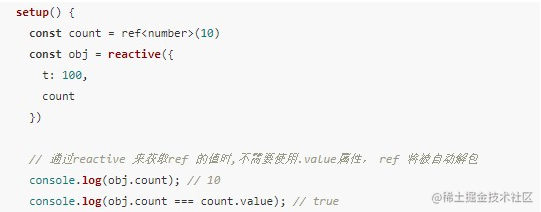

> shallowRef

ref() 的浅层作用形式。shallowRef()常常用于对大型数据结构的性能优化或是与外部的状态管理系统集成

> isRef

isRef() 用来判断某个值是否为 `ref()` 创建出来的对象

> toRefs

使用场景：如果对一个响应数据, 进行解构 或者 展开, 会丢失他的响应式特性

原因: vue3 底层是对 对象 进行监听劫持

作用：对一个响应式对象的所有内部属性，都做响应式处理

1. reactive/ref 的响应式功能是赋值给对象的，如果给对象解构或者展开，会让数据丢失响应式的能力
2. 使用 toRefs 可以保证该对象展开的每个属性都是响应式的

## 10. readonly isReadonly shallowReadonly 函数

**readonly**

传入`ref`或 `reactive`对象,并返回一个原始对象的只读代理,对象内部任何嵌套的属性也都是只读的、 并且是递归只读。

**isReadonly**

检查对象是否是由 `readonly` 创建的只读对象

**shallowReadonly**

`shallowReadonly` 作用只处理对象最外层属性的响应式（浅响应式）的只读，但不执行嵌套对象的深度只读转换 (暴露原始值)

### `readonly`和`const`有什么区别

- `const`是赋值保护，使用`const`定义的变量，该变量不能重新赋值。但如果`const`赋值的是对象，那么对象里面的东西是可以改的。原因是`const`定义的变量不能改说的是，对象对应的那个地址不能改变
- 而`readonly`是属性保护，不能给属性重新赋值

## 11. computed watch 函数

**computed**

该函数用来创造计算属性，和过去一样，它返回的值是一个 ref 对象。 里面可以传方法，或者一个对象，对象中包含`set()`、`get()`方法

**watch**

watch 函数用来侦听特定的数据源，并在回调函数中执行副作用。默认情况是懒执行的，也就是说仅在侦听的源数据变更时才执行回调

```scss
// 监听单个ref
const money = ref(100)
watch(money, (value, oldValue) => {
  console.log(value)
})

// 监听多个ref
const money = ref(100)
const count = ref(0)
watch([money, count], (value) => {
  console.log(value)
})

// 监听ref复杂数据
const user = ref({
  name: 'zs',
  age: 18,
})
watch(
  user,
  (value) => {
    console.log('user变化了', value)
  },
  {
    // 深度监听，，，当ref的值是一个复杂数据类型，需要深度监听
    deep: true,
    immediate: true
  }
)

// 监听对象的某个属性的变化
const user = ref({
  name: 'zs',
  age: 18,
})
watch(
  () => user.value.name,
  (value) => {
    console.log(value)
  }
)
```

## 11. watch 和 watchEffect 的区别

watch 作用是对传入的某个或多个值的变化进行监听；触发时会返回新值和老值；也就是说第一次不会执行，只有变化时才会重新执行

watchEffect 是传入一个函数，会立即执行，所以**默认第一次也会执行一次**；不需要传入监听内容，会**自动收集函数内的数据源作为依赖**，在依赖变化的时候又会重新执行该函数，如果没有依赖就不会执行；而且不会返回变化前后的新值和老值

共同点是 `watch` 和 `watchEffect` 会共享以下四种行为

- 停止监听：组件卸载时都会自动停止监听
- 清除副作用：onInvalidate 会作为回调的第三个参数传入
- 副作用刷新时机：响应式系统会缓存副作用函数，并异步刷新，避免同一个 tick 中多个状态改变导致的重复调用
- 监听器调试：开发模式下可以用 onTrack 和 onTrigger 进行调试

## 12. Vue3 的生命周期

基本上就是在 Vue2 生命周期钩子函数名基础上加了 `on`；beforeDestory 和 destoryed 更名为 onBeforeUnmount 和 onUnmounted；然后用 setup 代替了两个钩子函数 beforeCreate 和 created；新增了两个开发环境用于调试的钩子

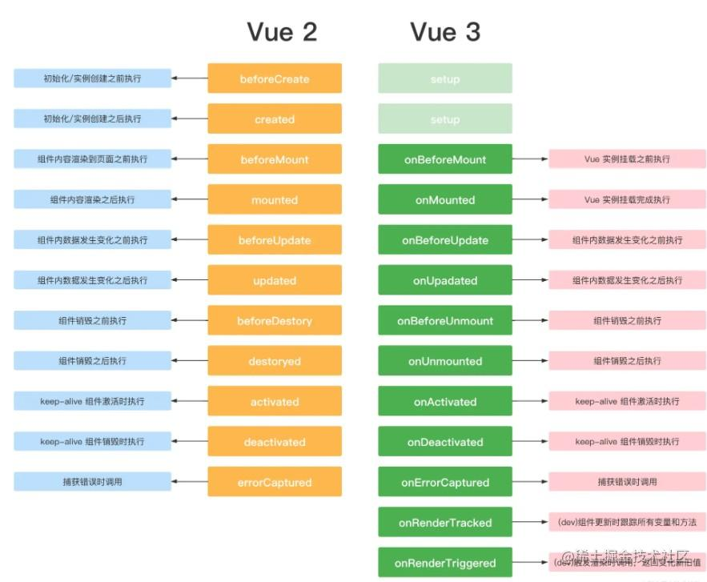

## 13. setup 语法下怎么设置 name 属性

安装插件

yarn add vite-plugin-vue-setup-extend -D

配置 vite.config.ts

```javascript
import vueSetupExtend from "vite-plugin-vue-setup-extend"

export default defineConfig({
  plugins: [vue(), vueSetupExtend()],
})
```

在标签中使用

```xml
<script setup name="MyCom">
  // 必须在script标签里面写一点类容，这个插件才会生效，哪怕是注释
</script>
```

## 14. Vue3 怎么让全局组件有提示

vue3 中如果注册的是局部组件，那么 props 是有类型提示的，但是如果注册的是全局组件，props 就没有类型提示了

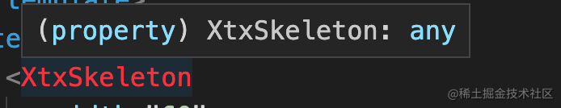

解决办法

```typescript
// 在src目录下新建一个文件global.d.ts
import XtxSkeleton from "@/components/XtxSkeleton/XtxSkeleton.vue"
// 参考
declare module "vue" {
  export interface GlobalComponents {
    XtxSkeleton: typeof XtxSkeleton
  }
}
export {}
```

## 15. Vue3 怎么注册全局自定义指令

```javascript
app.directive('lazy'，{  // app.directive('指令名‘，配置对象)
    mounted(el){
        .......
    }
})
```

## 16. Vite 和 Webpack 的区别

- 都是现代化打包工具
- 启动方式不一样。vite 在启动的时候不需要打包，所以不用分析模块与模块之间的依赖关系，不用进行编译。这种方式就类似于我们在使用某个 UI 框架的时候，可以对其进行按需加载。同样的，vite 也是这种机制，当浏览器请求某个模块时，再根据需要对模块内容进行编译。按需动态编译可以缩减编译时间，当项目越复杂，模块越多的情况下，vite 明显优于 webpack
- 热更新方面，效率更高。当改动了某个模块的时候，也只用让浏览器重新请求该模块，不需要像 webpack 那样将模块以及模块依赖的模块全部编译一次

缺点

- vite 相关生态没有 webpack 完善，vite 可以作为开发的辅助

## 17. pinia 的好处

## 18. Vue3 的 v-model 语法

# TS

## 1. TypeScript 是什么

## 2. TypeScript 与 JavaScript 的区别

## 3. TypeScript 的类型

## 4. TS 中的 class 类的关键字

## 5. 类型推断 类型断言 非空断言

## 6. 泛型

## 7. TS 内置的常用工具类型

## 8. Vue3 中父子传值 用 TS 怎么写 怎么设置默认值

## 9. TS 怎么给引入的第三方库设置类型声明文件

## 10. 说说你对 TypeScript 装饰器的理解

装饰器是一种特殊类型的声明，它能够被附加到类声明，方法， 访问符，属性或参数上

是一种在不改变原类和使用继承的情况下，动态地扩展对象功能

同样的，本质也不是什么高大上的结构，就是一个普通的函数，`@expression` 的形式其实是`Object.defineProperty`的语法糖

`expression`求值后必须也是一个函数，它会在运行时被调用，被装饰的声明信息做为参数传入

## 11. 说说对 TypeScript 中命名空间与模块的理解

###### 模块

`TypeScript` 与`ECMAScript` 2015 一样，任何包含顶级 `import` 或者 `export` 的文件都被当成一个模块

相反地，如果一个文件不带有顶级的`import`或者`export`声明，那么它的内容被视为全局可见的

###### 命名空间

命名空间一个最明确的目的就是解决重名问题

命名空间定义了标识符的可见范围，一个标识符可在多个名字空间中定义，它在不同名字空间中的含义是互不相干的

这样，在一个新的名字空间中可定义任何标识符，它们不会与任何已有的标识符发生冲突，因为已有的定义都处于其他名字空间中

## 12. TS 怎么自定义类型声明文件

# Node

## 1. Node 是什么

node 是 js 的运行环境，node 可以让前端去创建服务器，服务器一般由后端去写，但是 node 学习成本低（因为 node 走的 js），适合前端，localhost:8080 就是由 node 做支持。

怎么理解 localhost:8080？

项目里的各个组件已经做好了关联，但是需要一个平台去呈现，当打开 localhost:8080 之后就会去走入口文件，这里的入口文件相当于 index.html

## 2. Node 解决了哪些问题

Node 在处理高并发，I/O 密集场景有明显的性能优势

- 高并发，是指在同一时间并发访问服务器
- I/O 密集指的是文件操作、网络操作、数据库相对的有 CPU 密集。CPU 密集指的是逻辑处理运算、压缩、解压、加密、解密

> Web 主要场景就是接收客户端的请求读取静态资源和渲染界面,所以 Node 非常适合 Web 应用的开发

## 3. Node 的应用场景

一般来说，node 主要应用于以下几个方面

- 自动化构建等工具
- 中间层
- 小项目

第一点对于前端同学来说应该是重中之重了，什么工程化、自动构建工具就是用 node 写出来的，它是前端的一大分水岭之一

## 4. 请介绍一下 Node 事件循环的流程

- 在进程启动时，Node 便会创建一个类似于 while(true)的循环，每执行一次循环体的过程我们成为 Tick
- 每个 Tick 的过程就是查看是否有事件待处理。如果有就取出事件及其相关的回调函数。然后进入下一个循环，如果不再有事件处理，就退出进程

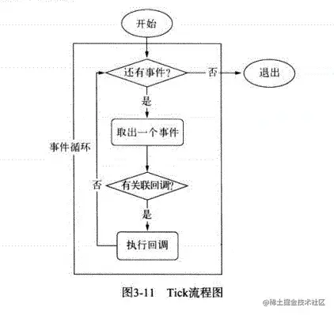

### 4.2 浏览器和 Node.js 中的事件循环机制有什么区别

Node.js 中宏任务分成了几种类型，并且放在了不同的 task queue(事件队列)里。不同的 task queue 在执行顺序上也有区别，微任务放在了每个 task queue 的末尾

- `setTimeout/setInterval` 属于 timers 类型
- `setImmediate` 属于 check 类型
- socket 的 close 事件属于 close callbacks 类型
- 其他 MacroTask 都属于 poll 类型
- `process.nextTick` 本质上属于 MicroTask，但是它先于所有其他 MicroTask 执行
- 所有 MicroTask 的执行时机在不同类型的 MacroTask 切换后
- idle/prepare 仅供内部调用，我们可以忽略
- pending callbacks 不太常见，我们也可以忽略

## 5. 在每个 tick 的过程中 如何判断是否有事件需要处理呢

- 每个事件循环中有一个或者多个观察者，而判断是否有事件需要处理的过程就是向这些观察者询问是否有要处理的事件
- 在 Node 中，事件主要来源于网络请求、文件的 I/O 等，这些事件对应的观察者有文件 I/O 观察者，网络 I/O 的观察者
- 事件循环是一个典型的生产者/消费者模型。异步 I/O，网络请求等则是事件的生产者，源源不断为 Node 提供不同类型的事件，这些事件被传递到对应的观察者那里，事件循环则从观察者那里取出事件并处理
- 在 windows 下，这个循环基于 IOCP 创建，在 nix 下则基于多线程创建

## 6. 请描述一下整个异步 I/O 的流程

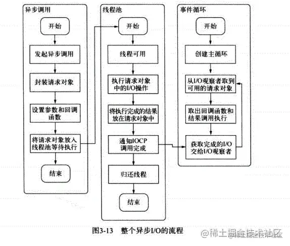

## 7. Express

### 7.1 Express 框架介绍

1.Express 是 NodeJS 开发中一个非常重量级的第三方框架，它对于 NodeJS 服务端就相当于 Jquery 对于 HTML 客户端

- 如果连 Express 都不会用，基本上都不好意思跟别人说你会 NodeJS

  2.Express 官网是这样介绍自己的：基于 Node.js 平台，快速、开放、极简的 web 开发框架

- Express 一个非常重要的亮点就是它没有改变 nodejs 已有的特性，而是在它的基础上进行了拓展

  - 也就是说，使用 Express 你既可以使用 nodejs 原生的任何 API，也能使用 Express 的 API

### 7.2 Express 三大核心功能

- 托管静态资源
  - 第二天讲的 nodejs 实现静态服务器功能在 express 中只需要一行代码
- 路由
  - express 自带路由功能，让 Node 服务端开发变得极其简单
  - express 支持链式语法，可以让代码看起来更加简洁
- 中间件
  - Express 最为核心的技术和思想，万物皆中间件
    - 中间件虽然理解起来有点困难，但是使用起来非常方便，类似于`bootstrap插件`

## 08. 模块化

### 什么是模块化 模块化有什么好处

- 什么叫模块化

  `一个js文件`可以`引入另一个js文件中的数据`, 这种开发方式就叫做模块化开发

- 模块化开发好处
  - 将功能分离出来

    一个 js 文件只负责处理一个功能，这样做的好处是业务逻辑清晰，便于维护

  - 按需导入

    用到哪一个功能，就导入哪一个 js 文件，模块化开发是`渐进式框架`的共同特征

  - 避免变量污染

    一个 js 文件(模块)，都是一个独立的作用域，互不干扰，不用考虑变量名冲突问题

### 模块化语法规范

任何一个语法，都需要遵循一定的规范。不同的平台需要遵循的规范不同。一般情况下，模块化语法规范主要有三种

- CommonJS 规范：nodejs 默认支持的

  文档：[javascript.ruanyifeng.com/nodejs/modu…](https://link.juejin.cn/?target=http%3A%2F%2Fjavascript.ruanyifeng.com%2Fnodejs%2Fmodule.html%23toc1)

- ES6 规范：前端的 ES6 语法支持的规范

  文档：[es6.ruanyifeng.com/#docs/modul…](https://link.juejin.cn/?target=https%3A%2F%2Fes6.ruanyifeng.com%2F%23docs%2Fmodule)

- CMD 和 AMD 模块化规范：ES6 语法之前的模块化语法规范，现在已经几乎不用了

### CommonJS 语法

- CommonJS 规范只有两句话

  - 模块必须要使用 `require()` 导入
  - 模块必须要使用 `module.exports` 导出

- exports 与 module.exports 区别
  - 如果分不清两者区别，就使用 `module.exports`
  - exports 不能去修改堆地址，只能往堆地址里面加数据
    - 错误写法：exports = { name:'张三' }

      这样写是修改堆地址

    - 正确写法：exports.name = '张三'

      这样写没有修改堆地址，而是往堆地址中加数据

### 模块缓存机制

- 当一个模块第一次加载时，nodejs 会执行里面的 js 代码，并且导出模块
- nodejs 会将导出的模块放入缓存中
- 当重复导入一个模块的时候，nodejs 会先从缓存中读取模块，如果缓存中有，就从缓存读取，缓存没有重复步骤 1

### node 三种模块及 require 加载原理

- 第一种： 核心模块、内置模块

  nodejs 作者写的，这些模块 js 文件会随着安装 nodejs 的时候一起安装，因此我们可以直接使用，而无需下载

  例如： fs 、path、http 都是核心模块

- 第二种：第三方模块

  npm 官网上面的模块，这些都是大佬写的模块。需要下载后使用

  例如： express、cors、bod-parser

- 第三种：自定义模块

  我们自己写的 js 文件

- require('文件路径')加载原理

  1. 自定义模块：必须要写文件路径， `require()`会得到这个模块里面的 `module.exports` 对象

  2. 第三方模块 ：写模块名，nodejs 会自动从你的 node_module 文件夹里面去找这个模块的名字，然后执行模块里面的`index.js`代码，得到里面的`module.exports。`

     如果当前目录没有 module.exports 就会从上级目录找，以此类推。一直找到你的磁盘根目录。 还找不到就会报错提示 模块不存在（有点类似于变量作用域就近原则）

  3. 核心模块：写模块名，nodejs 会自动从你的 node 安装包路径里面去找

### require 和 import 的区别

1. 导入`require` 导出 `exports/module.exports` 是 `CommonJS` 的标准，通常适用范围如 `Node.js`
2. import/export 是 ES6 的标准，通常适用范围如 React
3. `require` 是**赋值过程**并且是**运行时才执行**，也就是**同步加载**
4. `require` 可以理解为一个全局方法，因为它是一个方法所以意味着可以在任何地方执行
5. `import` 是**解构过程**并且是**编译时执行**，理解为**异步加载**
6. `import` 会提升到整个模块的头部，具有置顶性，但是建议写在文件的顶部

## 9. 说说前端渲染和后端渲染 以及他们的优缺点

**前端渲染**

指的是后端返回 JSON 数据，前端利用预先写的 html 模板，循环读取 JSON 数据，拼接字符串（ES6 的模板字符串特性大大减少了拼接字符串的的成本），并插入页面

**后端渲染**

前端请求，后端用后台模板引擎直接生成 html，前端接收到数据之后，直接插入页面

**区别**

|              | 前端渲染                                                                                                 | 后端渲染                               |
| ------------ | -------------------------------------------------------------------------------------------------------- | -------------------------------------- |
| 页面呈现速度 | 主要受限于带宽和客户端机器的好坏，优化的好，可以逐步动态展开内容，感觉上会更快一点                       | 快，受限于用户的带宽                   |
| 流量消耗     | 多一点点（一个前端框架大概 50KB）                                                                        | 少一点点（可以省去前端框架部分的代码） |
| 可维护性     | 好，前后端分离，各施其职，代码一目明了                                                                   | 差（前后端东西放一起，不利于维护）     |
| SEO 友好度   | 差，大量使用 Ajax，多数浏览器不能抓取 Ajax 数据                                                          | 好                                     |
| 编码效率     | 高，前后端各自只做自己擅长的东西，后端最后只输出接口，不用管页面呈现，只要前后端人员能力不错，效率不会低 | 低（这个跟不同的团队不同，可能不对）   |

# 性能优化

## 1. 什么是 CND

### 1.1 CDN 的概念

CDN（Content Delivery Network，**内容分发网络**）**是指一种通过互联网互相连接的电脑网络系统**，利用最靠近每位用户的服务器，更快、更可靠地将音乐、图片、视频、应用程序及其他文件发送给用户，来提供高性能、可扩展性及低成本的网络内容传递给用户。

### 1.2 CDN 的作用

CDN 一般会用来托管 Web 资源（包括文本、图片和脚本等），可供下载的资源（媒体文件、软件、文档等），应用程序（门户网站等）。**使用 CDN 来加速这些资源的访问。**

### 1.3 CDN 的使用场景

**使用第三方的 CDN 服务：** 如果想要开源一些项目，可以使用第三方的 CDN 服务

**使用 CDN 进行静态资源的缓存：** 将自己网站的静态资源放在 CDN 上，比如 js、css、图片等。可以将整个项目放在 CDN 上，完成一键部署。

**直播传送：** 直播本质上是使用流媒体进行传送，CDN 也是支持流媒体传送的，所以直播完全可以使用 CDN 来提高访问速度。CDN 在处理流媒体的时候与处理普通静态文件有所不同，普通文件如果在边缘节点没有找到的话，就会去上一层接着寻找，但是流媒体本身数据量就非常大，如果使用回源的方式，必然会带来性能问题，所以流媒体一般采用的都是主动推送的方式来进行。

## 2. 什么是懒加载(图片)

### 2.1 懒加载的概念

懒加载也叫做延迟加载、按需加载，指的是在长网页中延迟加载图片数据，是一种较好的网页性能优化的方式。在比较长的网页或应用中，如果图片很多，所有的图片都被加载出来，而用户只能看到可视窗口的那一部分图片数据，这样就浪费了性能。

如果使用图片的懒加载就可以解决以上问题。在滚动屏幕之前，可视化区域之外的图片不会进行加载，在滚动屏幕时才加载。这样使得网页的加载速度更快，减少了服务器的负载。懒加载适用于图片较多，页面列表较长（长列表）的场景中。

### 2.2 懒加载的特点

**减少无用资源的加载**：使用懒加载明显减少了服务器的压力和流量，同时也减小了浏览器的负担。

**提升用户体验**: 如果同时加载较多图片，可能需要等待的时间较长，这样影响了用户体验，而使用懒加载就能大大的提高用户体验。

**防止加载过多图片而影响其他资源文件的加载** ：会影响网站应用的正常使用。

### 2.3 懒加载的实现原理

图片的加载是由`src`引起的，当对`src`赋值时，浏览器就会请求图片资源。根据这个原理，我们使用 HTML5 的`data-xxx`属性来储存图片的路径，在需要加载图片的时候，将`data-xxx`中图片的路径赋值给`src`，这样就实现了图片的按需加载，即懒加载。

注意：`data-xxx` 中的`xxx`可以自定义，这里我们使用`data-src`来定义。

懒加载的实现重点在于确定用户需要加载哪张图片，在浏览器中，可视区域内的资源就是用户需要的资源。所以当图片出现在可视区域时，获取图片的真实地址并赋值给图片即可。

#### 2.31 Vue3 实现图片懒加载

导入 vueuse 插件，使用 vueuse 封装的 useIntersectionObserver 监听对应的 DOM 元素，通过里面的 isIntersecting 属性的布尔值判断来设置 img 的 src

可以封装一个 v-lazy 的自定义指令来控制 img 的 src

```javascript
app.directive("lazy", {
  mounted: (el: HTMLImageElement, { value }) => {
    // el:选中的元素,value:传过来的属性,这里是图片地址
    const { stop } = useIntersectionObserver(el, ([{ isIntersecting }]) => {
      if (isIntersecting) {
        // 判断元素是否在可视区域
        // 满足条件就停止监听
        stop()
        // 给el元素设置src属性
        el.src = value
        el.onerror = () => {
          // 如果图片加载失败就显示默认图片
          el.src = defaultImg // 默认图片需要导入进来,不能直接写路径
        }
      }
    })
  },
})
复制代码
```

#### 2.32 列表数据懒加载 (利用 hooks 抽取)

在 hooks 里封装通用的数据懒加载 api

```javascript
export function useLazyData(callBack: () => void) {
  // 通过 ref 获得组件实例
  const target = ref(null)
  const { stop } = useIntersectionObserver(
    // target这个参数是观察的目标dom容器，必须是dom容器，而且是vue3.0方式绑定的dom对象
    target,
    // isIntersecting 是否进入可视区域，true是进入 false是移出
    // observerElement 被观察的dom
    ([{ isIntersecting }]) => {
      // 在此处可根据isIntersecting来判断，然后做业务
      if (isIntersecting) {
        stop()
        callBack()
      }
    }
  )
  return target // 将响应对象作为返回值传递
}
```

在组件中使用

```javascript
import useStore from "@/store"
import { useLazyData } from "@/utils/hooks"
const { home } = useStore()
const target = useLazyData(() => home.getHotList())
```

### 2.4 懒加载与预加载的区别

这两种方式都是提高网页性能的方式，两者主要区别是一个是提前加载，一个是迟缓甚至不加载。懒加载对服务器前端有一定的缓解压力作用，预加载则会增加服务器前端压力。

- **懒加载也叫延迟加载，指的是在长网页中延迟加载图片的时机，当用户需要访问时，再去加载**，这样可以提高网站的首屏加载速度，提升用户的体验，并且可以减少服务器的压力。它适用于图片很多，页面很长的电商网站的场景。
- **预加载指的是将所需的资源提前请求加载到本地，这样后面在需要用到时就直接从缓存取资源。** 通过预加载能够减少用户的等待时间，提高用户的体验。我了解的预加载的最常用的方式是使用 js 中的 image 对象，通过为 image 对象来设置 scr 属性，来实现图片的预加载。

## 3. 什么是回流(重排)与重绘

### 3.1 什么是回流(重排)，哪些操作会导致回流

当渲染树中部分或者全部元素的尺寸、结构或者属性发生变化时，浏览器会重新渲染部分或者全部文档的过程就称为**回流**。

下面这些操作会导致回流：

- 页面的首次渲染
- 浏览器的窗口大小发生变化
- 元素的内容发生变化
- 元素的尺寸或者位置发生变化
- 元素的字体大小发生变化
- 激活 CSS 伪类
- 查询某些属性或者调用某些方法
- 添加或者删除可见的 DOM 元素

在触发回流（重排）的时候，由于浏览器渲染页面是基于流式布局的，所以当触发回流时，会导致周围的 DOM 元素重新排列，它的影响范围有两种：

- 全局范围：从根节点开始，对整个渲染树进行重新布局
- 局部范围：对渲染树的某部分或者一个渲染对象进行重新布局

### 3.2 什么是重绘，哪些操作会导致重绘

当页面中某些元素的样式发生变化，但是不会影响其在文档流中的位置时，浏览器就会对元素进行重新绘制，这个过程就是**重绘**。

下面这些操作会导致回流：

- color、background 相关属性：background-color、background-image 等
- outline 相关属性：outline-color、outline-width 、text-decoration
- border-radius、visibility、box-shadow

注意： **当触发回流时，一定会触发重绘，但是重绘不一定会引发回流。**

### 3.3 如何避免回流与重绘

**减少回流与重绘的措施：**

- 操作 DOM 时，尽量在低层级的 DOM 节点进行操作
- 不要使用`table`布局， 一个小的改动可能会使整个`table`进行重新布局
- 使用 CSS 的表达式
- 不要频繁操作元素的样式，对于静态页面，可以修改类名，而不是样式。
- 使用 absolute 或者 fixed，使元素脱离文档流，这样他们发生变化就不会影响其他元素
- 避免频繁操作 DOM，可以创建一个文档片段`documentFragment`，在它上面应用所有 DOM 操作，最后再把它添加到文档中
- 将元素先设置`display: none`，操作结束后再把它显示出来。因为在 display 属性为 none 的元素上进行的 DOM 操作不会引发回流和重绘。
- 将 DOM 的多个读操作（或者写操作）放在一起，而不是读写操作穿插着写。这得益于**浏览器的渲染队列机制**。

#### 3.4 浏览器的渲染队列

浏览器针对页面的回流与重绘，进行了自身的优化——**渲染队列**

**浏览器会将所有的回流、重绘的操作放在一个队列中，当队列中的操作到了一定的数量或者到了一定的时间间隔，浏览器就会对队列进行批处理。这样就会让多次的回流、重绘变成一次回流重绘。**

### 3.5 如何优化动画

对于如何优化动画，我们知道，一般情况下，动画需要频繁的操作 DOM，就就会导致页面的性能问题，我们可以将动画的`position`属性设置为`absolute`或者`fixed`，将动画脱离文档流，这样他的回流就不会影响到页面了。

### 3.6 documentFragment (文档碎片)是什么 用它跟直接操作 DOM 的区别是什么

当我们把一个 DocumentFragment 节点插入文档树时，插入的不是 DocumentFragment 自身，而是它的所有子孙节点。在频繁的 DOM 操作时，我们就可以将 DOM 元素插入 DocumentFragment，之后一次性的将所有的子孙节点插入文档中。DocumentFragment 不是真实 DOM 树的一部分，它的变化**不会触发 DOM 树的重新渲染**，这样就**大大提高了页面的性能**。

##### 假如有 10000 个元素需要添加到页面上，你觉得怎么操作性能最好（考察`文档碎片`）

```ini
<script>
     /* console.time('耗时')
    for (let i = 1; i <= 1000; i++) {
      document.body.innerHTML = document.body.innerHTML + `<div>${i}</div>`
    }
    console.timeEnd('耗时') // 1586.053955078125 ms */

    /* console.time('耗时')
    let str = ''
    for (let i = 1; i <= 1000; i++) {
      str += `<div>${i}</div>`
    }
    document.body.innerHTML = str
    console.timeEnd('耗时') // 2.5810546875 ms */

    /* console.time('耗时')
    const arr = []
    for (let i = 1; i <= 1000; i++) {
      arr.push(`<div>${i}</div>`)
    }
    document.body.innerHTML = arr.join('')
    console.timeEnd('耗时') // 2.883056640625 ms */

    /* console.time('耗时')
    for (let i = 1; i <= 1000; i++) {
      const oDiv = document.createElement('div')
      // 更灵活
      oDiv.innerHTML = i
      oDiv.onclick = function () { }
      oDiv.style.backgroundColor = 'red'
      document.body.appendChild(oDiv)
    }
    console.timeEnd('耗时') // 7.409912109375 ms */

    console.time('耗时')
    // 篮子，“文档碎片”
    const oFrag = document.createDocumentFragment()
    for (let i = 1; i <= 1000; i++) {
      const oDiv = document.createElement('div')
      oDiv.innerHTML = i
      oFrag.appendChild(oDiv)
    }
    document.body.appendChild(oFrag)
    console.timeEnd('耗时') // 13.442138671875 ms
</script>
复制代码
```

## 4. 什么是节流与防抖

### 4.1 对节流与防抖的理解

- 函数防抖是指**事件被触发 n 秒后再执行回调，如果在这 n 秒内事件又被触发，则重新计时。** 这可以使用在一些点击请求的事件上，避免因为用户的多次点击向后端发送多次请求。
- 函数节流是指规定一个单位时间，**在这个单位时间内，只能有一次触发事件的回调函数执行**，如果在同一个单位时间内某事件被触发多次，只有一次能生效。节流可以使用在 scroll 函数的事件监听上，通过事件节流来降低事件调用的频率。

### 4.2 适用场景

**防抖函数的应用场景**

- 按钮提交场景：防⽌多次提交按钮，**只执⾏最后提交的⼀次**
- 服务端验证场景：表单验证需要服务端配合，只执⾏⼀段连续的输⼊事件的最后⼀次，还有搜索联想词功能类似⽣存环境请⽤ lodash.debounce

**节流函数的适⽤场景：**

- 拖拽场景：**固定时间内只执⾏⼀次**，防⽌超⾼频次触发位置变动
- 缩放场景：监控浏览器 resize
- 动画场景：避免短时间内多次触发动画引起性能问题

### 4.3 代码实现

```javascript
// //防抖
function debounce(fn, date) {
  let timer //声明接收定时器的变量
  return function (...arg) {
    // 获取参数
    timer && clearTimeout(timer) // 清空定时器
    timer = setTimeout(() => {
      //  生成新的定时器
      //因为箭头函数里的this指向上层作用域的this,所以这里可以直接用this，不需要声明其他的变量来接收
      fn.apply(this, arg) // fn()
    }, date)
  }
}
//--------------------------------
// 节流
function debounce(fn, data) {
  let timer = +new Date() // 声明初始时间
  return function (...arg) {
    // 获取参数
    let newTimer = +new Date() // 获取触发事件的时间
    if (newTimer - timer >= data) {
      // 时间判断,是否满足条件
      fn.apply(this, arg) // 调用需要执行的函数,修改this值,并且传入参数
      timer = +new Date() // 重置初始时间
    }
  }
}
// --------------------------------
box.addEventListener(
  "click",
  debounce(function (e) {
    if (e.target.tagName === "BUTTON") {
      console.log(111)
    }
  }, 2000)
)
```

## 5. 如何对项目中的图片进行优

1. 不用图片。很多时候会使用到很多修饰类图片，其实这类修饰图片完全可以用 CSS 去代替。
2. 对于移动端来说，屏幕宽度就那么点，完全没有必要去加载原图浪费带宽。一般图片都用 CDN 加载，可以计算出适配屏幕的宽度，然后去请求相应裁剪好的图片。
3. 小图使用 base64 格式
4. 将多个图标文件整合到一张图片中（雪碧图）
5. 选择正确的图片格式：
   - 对于能够显示 WebP 格式的浏览器尽量使用 WebP 格式。因为 WebP 格式具有更好的图像数据压缩算法，能带来更小的图片体积，而且拥有肉眼识别无差异的图像质量，缺点就是兼容性并不好
   - 小图使用 PNG，其实对于大部分图标这类图片，完全可以使用 SVG 代替
   - 照片使用 JPEG

# Webpack 优化

### 7.1 如何提⾼**webpack**的打包速度

**（1）优化 Loader**

对于 Loader 来说，影响打包效率首当其冲必属 Babel 了。因为 Babel 会将代码转为字符串生成 AST，然后对 AST 继续进行转变最后再生成新的代码，项目越大，**转换代码越多，效率就越低**。

**（2）HappyPack**

受限于 Node 是单线程运行的，所以 Webpack 在打包的过程中也是单线程的，特别是在执行 Loader 的时候，长时间编译的任务很多，这样就会导致等待的情况。

**HappyPack 可以将 Loader 的同步执行转换为并行的**，这样就能充分利用系统资源来加快打包效率了

**（3）DllPlugin**

**DllPlugin 可以将特定的类库提前打包然后引入**。这种方式可以极大的减少打包类库的次数，只有当类库更新版本才有需要重新打包，并且也实现了将公共代码抽离成单独文件的优化方案。

**（4）代码压缩**

在 Webpack3 中，一般使用 `UglifyJS` 来压缩代码，但是这个是单线程运行的，为了加快效率，可以使用 `webpack-parallel-uglify-plugin` 来并行运行 `UglifyJS`，从而提高效率。

在 Webpack4 中，不需要以上这些操作了，只需要**将 `mode` 设置为 `production`** 就可以默认开启以上功能。代码压缩也是我们必做的性能优化方案，当然我们不止可以压缩 JS 代码，还可以压缩 HTML、CSS 代码，并且在压缩 JS 代码的过程中，我们还可以通过配置实现比如删除 `console.log` 这类代码的功能。

### 7.2 如何减少 Webpack 打包**体积**

**（1）按需加载**

在开发 SPA 项目的时候，项目中都会存在很多路由页面。如果将这些页面全部打包进一个 JS 文件的话，虽然将多个请求合并了，但是同样也加载了很多并不需要的代码，耗费了更长的时间。那么为了首页能更快地呈现给用户，希望首页能加载的文件体积越小越好，**这时候就可以使用按需加载，将每个路由页面单独打包为一个文件**。当然不仅仅路由可以按需加载，对于 `loadash` 这种大型类库同样可以使用这个功能。

**（2）Scope Hoisting**

**Scope Hoisting 会分析出模块之间的依赖关系，尽可能的把打包出来的模块合并到一个函数中去。**

**（3）Tree Shaking**

**Tree Shaking 可以实现删除项目中未被引用的代码**。可以通过在启动 webpack 时追加参数 --optimize-minimize 来实现

### 7.3 如何⽤**webpack**来优化前端性能

⽤ webpack 优化前端性能是指优化 webpack 的输出结果，让打包的最终结果在浏览器运⾏快速⾼效。

- **压缩代码**：删除多余的代码、注释、简化代码的写法等等⽅式。可以利⽤ webpack 的 UglifyJsPlugin 和 ParallelUglifyPlugin 来压缩 JS ⽂件， 利⽤ cssnano （css-loader?minimize）来压缩 css
- **利⽤ CDN 加速**: 在构建过程中，将引⽤的静态资源路径修改为 CDN 上对应的路径。可以利⽤ webpack 对于 output 参数和各 loader 的 publicPath 参数来修改资源路径
- **Tree Shaking**: 将代码中永远不会⾛到的⽚段删除掉。可以通过在启动 webpack 时追加参数 --optimize-minimize 来实现
- **Code Splitting (自动):** 将代码按路由维度或者组件分块(chunk),这样做到按需加载,同时可以充分利⽤浏览器缓存
- **提取公共第三⽅库**: SplitChunksPlugin 插件来进⾏公共模块抽取,利⽤浏览器缓存可以⻓期缓存这些⽆需频繁变动的公共代码

### 7.4 如何提⾼**webpack**的构建速度

- 多⼊⼝情况下，使⽤ CommonsChunkPlugin 来提取公共代码
- 通过 **externals** 配置来提取常⽤库
- 利⽤ DllPlugin 和 DllReferencePlugin 预编译资源模块 通过 DllPlugin 来对那些我们引⽤但是绝对不会修改的 npm 包来进⾏预编译，再通过 DllReferencePlugin 将预编译的模块加载进来。
- 使⽤ Happypack 实现多线程加速编译
- 使⽤ webpack-uglify-parallel 来提升 uglifyPlugin 的压缩速度。 原理上 webpack-uglify-parallel 采⽤了多核并⾏压缩来提升压缩速度
- 使⽤ Tree-shaking 和 Scope Hoisting 来剔除多余代码

### 7.5 什么是长缓存 在 Webpack 中如何做到长缓存优化

1、什么是长缓存

浏览器在用户访问页面的时候，为了加快加载速度，会对用户访问的静态资源进行存储，但是每一次代码升级或者更新，都需要浏览器去下载新的代码，最方便的更新方式就是引入新的文件名称，只下载新的代码块，不加载旧的代码块，这就是长缓存。

2、具体实现

在 Webpack 中，可以在 output 给出输出的文件制定 chunkhash，并且分离经常更新的代码和框架代码，通 NameModulesPlugin 或者 HashedModulesPlugin 使再次打包文件名不变

### 7.6 怎么实现 Webpack 的按需加载

在 Webpack 中，import 不仅仅是 ES6module 的模块导入方式，还是一个类似 require 的函数，我们可以通过 import('module')的方式引入一个模块，import()返回的是一个 Promise 对象；使用 import（）方式就可以实现 Webpack 的按需加载

### 7.7 什么是神奇注释

在 import（）里可以添加一些注释，如定义该 chunk 的名称，要过滤的文件，指定引入的文件等等，这类带有特殊功能的注释被称为神器注释。

## 8. 什么是虚拟列表

`虚拟列表`其实是按需显示的一种实现，即**只对`可见区域`进行渲染，对`非可见区域`中的数据不渲染或部分渲染的技术，从而达到极高的渲染性能。**

假设有 1 万条记录需要同时渲染，我们屏幕的`可见区域`的高度为`500px`,而列表项的高度为`50px`，则此时我们在屏幕中最多只能看到 10 个列表项，那么在首次渲染的时候，我们只需加载 10 条即可。

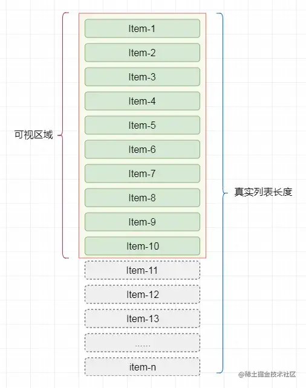

### 虚拟列表如何实现

虚拟列表的实现，实际上就是在首屏加载的时候，只加载`可视区域`内需要的列表项，当滚动发生时，动态通过计算获得`可视区域`内的列表项，并将`非可视区域`内存在的列表项删除。

- 计算当前`可视区域`起始数据索引(`startIndex`)
- 计算当前`可视区域`结束数据索引(`endIndex`)
- 计算当前`可视区域的`数据，并渲染到页面中
- 计算`startIndex`对应的数据在整个列表中的偏移位置`startOffset`并设置到列表上


由于只是对`可视区域`内的列表项进行渲染，所以为了保持列表容器的高度并可正常的触发滚动，将 Html 结构设计成如下结构：

```xml
<div class="infinite-list-container">
    <div class="infinite-list-phantom"></div>
    <div class="infinite-list">
      <!-- item-1 -->
      <!-- item-2 -->
      <!-- ...... -->
      <!-- item-n -->
    </div>
</div>
```

- `infinite-list-container` 为`可视区域`的容器
- `infinite-list-phantom` 为容器内的占位，高度为总列表高度，用于形成滚动条
- `infinite-list` 为列表项的`渲染区域`

接着，监听`infinite-list-container`的`scroll`事件，获取滚动位置`scrollTop`

- 假定`可视区域`高度固定，称之为`screenHeight`
- 假定`列表每项`高度固定，称之为`itemSize`
- 假定`列表数据`称之为`listData`
- 假定`当前滚动位置`称之为`scrollTop`

则可推算出：

- 列表总高度`listHeight` = listData.length \* itemSize
- 可显示的列表项数`visibleCount` = Math.ceil(screenHeight / itemSize)
- 数据的起始索引`startIndex` = Math.floor(scrollTop / itemSize)
- 数据的结束索引`endIndex` = startIndex + visibleCount
- 列表显示数据为`visibleData` = listData.slice(startIndex,endIndex)

当滚动后，由于`渲染区域`相对于`可视区域`已经发生了偏移，此时我需要获取一个偏移量`startOffset`，通过样式控制将`渲染区域`偏移至`可视区域`中。

- 偏移量`startOffset` = scrollTop - (scrollTop % itemSize); 用来做 transform 的数据

### 监听 scoll 事件的优化

我们使用`监听scroll事件`的方式来触发可视区域中数据的更新，当滚动发生后，scroll 事件会频繁触发，很多时候会造成`重复计算`的问题，从性能上来说无疑存在浪费的情况。

可以使用`IntersectionObserver`替换监听 scroll 事件，`IntersectionObserver`可以监听目标元素是否出现在可视区域内，在监听的回调事件中执行可视区域数据的更新，并且`IntersectionObserver`的监听回调是异步触发，不随着目标元素的滚动而触发，性能消耗极低。

## 9. 前端工程化

#### Babel 的原理是什么

**Babel 的主要工作是对代码进行转译。** (解决兼容, 解析执行一部分代码)

```css
let a = 1 + 1    =>  var a = 2
复制代码
```

转译分为三阶段：

- 解析（Parse），将代码解析⽣成抽象语法树 AST，也就是词法分析与语法分析的过程
- 转换（Transform），对语法树进⾏变换方面的⼀系列操作。通过 babel-traverse，进⾏遍历并作添加、更新、删除等操作
- ⽣成（Generate），通过 babel-generator 将变换后的 AST 转换为 JS 代码

我们可以通过 AST Explorer 工具来查看 Babel 具体生成的 AST 节点。

## 10. 什么是单点登录

单点登录（Single Sign On），简称为 SSO，是目前比较流行的企业业务整合的解决方案之一

SSO 的定义是在多个应用系统中，用户只需要登录一次就可以访问所有相互信任的应用系统

SSO 一般都需要一个独立的认证中心（passport），子系统的登录均得通过`passport`，子系统本身将不参与登录操作

当一个系统成功登录以后，`passport`将会颁发一个令牌给各个子系统，子系统可以拿着令牌会获取各自的受保护资源，为了减少频繁认证，各个子系统在被`passport`授权以后，会建立一个局部会话，在一定时间内可以无需再次向`passport`发起认证

## 11. 大文件上传如何做分片上传、断点继传

### 分片上传

分片上传，就是将所要上传的文件，按照一定的大小，将整个文件分隔成多个数据块（Part）来进行分片上传

如下图


上传完之后再由服务端对所有上传的文件进行汇总整合成原始的文件

大致流程如下：

1. 将需要上传的文件按照一定的分割规则，分割成相同大小的数据块；
2. 初始化一个分片上传任务，返回本次分片上传唯一标识；
3. 然后借助 http 的可并发性，同时上传多个切片
4. 发送完成后，服务端根据判断数据上传是否完整，如果完整，则进行数据块合成得到原始文件

### 断点续传

断点续传指的是在下载或上传时，将下载或上传任务人为的划分为几个部分

每一个部分采用一个线程进行上传或下载，如果碰到网络故障，可以从已经上传或下载的部分开始继续上传下载未完成的部分，而没有必要从头开始上传下载。用户可以节省时间，提高速度

一般实现方式有两种：

- 服务器端返回，告知从哪开始
- 浏览器端自行处理

上传过程中将文件在服务器写为临时文件，等全部写完了（文件上传完），将此临时文件重命名为正式文件即可

如果中途上传中断过，下次上传的时候根据当前临时文件大小，作为在客户端读取文件的偏移量，从此位置继续读取文件数据块，上传到服务器从此偏移量继续写入文件即可

**使用场景**

- 大文件加速上传：当文件大小超过预期大小时，使用分片上传可实现并行上传多个 Part， 以加快上传速度
- 网络环境较差：建议使用分片上传。当出现上传失败的时候，仅需重传失败的 Part
- 流式上传：可以在需要上传的文件大小还不确定的情况下开始上传。这种场景在视频监控等行业应用中比较常见

## 12. npm run dev 的时候 webpack 做了什么事情

执行**npm run dev**时候最先执行的**build/dev-server.js**文件，该文件主要完成下面几件事情：

1、检查 node 和 npm 的**版本**、引入相关**插件**和**配置**

2、webpack 对源码进行**编译打包**并返回 compiler 对象

3、**创建 express 服务器**

4、**配置开发中间件**（webpack-dev-middleware）和**热重载中间件**（webpack-hot-middleware）

5、**挂载代理服务和中间件**

6、配置静态资源

7、启动服务器监听特定端口（8080）

8、自动打开浏览器并打开特定网址（localhost:8080）

# 小程序

## 1.请谈谈微信小程序主要目录和文件的作用

- **project.config.json**：项目配置文件，用的最多的就是配置是否开启 https 校验
- **App.js**：设置一些全局的基础数据等
- **App.json**：底部 tab，标题栏和路由等设置
- **App.wxss**：公共样式，引入 iconfont 等
- **pages**：里面包含一个个具体的页面
- **index.json**：配置当前页面标题和引入组件
- **index.wxml**：页面结构
- **index.wxss**：页面样式表
- **index.js**：页面的逻辑，请求和数据处理

## 2.请谈谈 wxml 与标准的 html 的异同

- 都是用来描述页面的结构
- 都由标签，属性等构成
- 标签名字不一样，且小程序标签更少，单一标签更多
- 多了一些 wx:if 这样的属性以及{{}} 这样的表达式
- WXML 仅能在微信小程序开发者工具中预览，而 HTML 可以在浏览器内预览
- 组件封装不同，WXML 对组件进行了重新封装
- 小程序运行在 JS Core 内，没有 DOM 树和 windiw 对象，小程序中无法使用 window 对象和 document 对象。

## 3.请谈谈 WXSS 和 CSS 的异同？

都是用来描述页面的样子

- WXSS 具有 CSS 大部分的特性，也做了一些扩充和修改
- WXSS 新增了尺寸单位，WXSS 在底层支持新的尺寸单位 rpx
- WXSS 仅支持部分 CSS 选择器
- WXSS 提供全局样式与局部样式

## 4.你是怎么封装微信小程序的数据请求的？

1. 在根目录下创建 util 目录及 api.js 文件和 apiConfig.js 文件
2. 在 apiConfig.js 封装基础的 get，post 和 put，upload 等请求方法，设置请求体，带上 token 和异常处理等
3. 在 api 中引入 apiConfig.js 封装好的请求方法.根据页面数据请求的 urls，设置对应的方法并导出
4. 在具体的页面中导入或将所有的接口放在统一的 js 文件中并导出
5. 在 app.js 中创建封装请求数据的方法
6. 在子页面中调用封装的请求数据

## 5.小程序页面之间有哪些（传值）传递数据的方法？

1. 页面跳转或重定向时，使用 url 带参数传递数据
2. 使用组件模板 template 传递参数
3. 使用缓存传递参数
4. 使用数据库传递参数
5. 给 html 元素添加 data-\*属性来传递值，然后通过 e.currentTarget.dataset 或 onload 的 param 参数获取（data- 名称不能有大写字母，不可以存放对象）
6. 设置 id 的方法标识来传值，通过 e.currentTarget.id 获取设置的 id 值，然后通过设置全局对象的方式来传递数据
7. 在 navigator 中添加参数数值

## 6.请谈谈小程序的双向绑定和 vue 的异同？

大体相同，但小程序之间 this.data 的属性是不可以同步到视图的，必须调用 this.setData()方法

## 7.请谈谈小程序的生命周期函数

- onLoad()页面加载时触发，只会调用一次，可获取当前页面路径中的参数
- onShow()页面显示/切入前台时候触发，一般用来发送数据请求
- onReady()页面初次渲染完成时触发，只会调用一次，代表页面已可和视图层进行交互
- onHide()页面隐藏/切入后台时触发，如底部 tab 切换到其他页面或小程序切入后台等
- onUnload()页面卸载时触发，如 redirectTO 或 navigateBack 到其他页面时

## 8.简述微信小程序原理

小程序本质就是一个**单页面应用**，所有的页面渲染和事件处理，都在一个页面内进行，但又可以通过微信客户端调用原生的各种接口；它的架构，是数据驱动的架构模式，它的 UI 和数据是分离的，所有的页面更新，都需要通过对数据的更改来实现； 它从技术讲和现有的前端开发差不多，采用**JavaScript、WXML、WXSS**三种技术进行开发；

功能可分为**webview**和**APPService**两个部分：

webview 主要用来展示 UI，appservice 用来处理业务逻辑，数据及接口调用，它们在两个进程中进行，通过系统层 JSBridge 实现通信，实现 UI 的渲染，事件处理； appService 有来处理业务逻辑、数据及接口调用；

两个部分在两个进程中运行，通过系统层 JSBridge 实现通信，实现 UI 的渲染、事件的处理等。 javaScript 的代码是运行在微信 App 中的，因此一些 h5 技术的应用需要微信 APP 提供对应的 API 支持 wxml 微信自己基于 xml 语法开发的，因此在开发时只能使用微信提供的现有标签，html 的标签是无法使用的 wxss 具有 css 的大部分特性，但并不是所有都支持，没有详细文档（wxss 的图片引入需要使用外链地址，没有 body，样式可以使用 import 导入）

## 9.请谈谈原生开发小程序，wepy，mpvue 的对比？

个人认为，如果是新项目，且没有旧的 h5 项目迁移，则考虑用小程序原生开发，好处是相比于第三方框架，坑少。 而如果有 老的 h5 项目是 vue 开发 或者 也有 h5 项目也需要小程序开发，则比较适合 wepy 或者 mpvue 来做迁移或者开发，近期看 wepy 几乎不更新了，所以推荐美团的 mpvue。 而如果如果团队前端强大，自己做一套框架也没问题。

## 10.简单描述下微信小程序的 相关文件类型

1. wxml 模板文件，是框架设计的一套标签预言，结合基础组件，事件系统，可以构建出页面的结构 wxss 样式文件，是一套样式语言，用于描述 WXML 的组件样式 js 脚本逻辑文件。逻辑处理网络请求 json 配置文件，小程序设置，如页面注册，页面标题及 tabBar
2. app.json 是整个小程序的全局配置，包括：
   - pages:所有页面路径
   - 网络设置（网络超时事件）
   - 页面表现（页面注册）
   - window：（背景色，导航样式，默认标题）
   - 底部 tab 等
3. app.js 监听并处理小程序的生命周期函数，声明全局变量
4. app.wxss 全局配置的样式文件

## 11.那些方法来提高微信小程序的应用速度？

- 提高页面的加载速度
- 用户行为预测
- 减少默认的 data 的大小
- 组件化方案

## 12.分析微信小程序的优劣势？

**优势：**

- 容易上手，基础组件库比较全，基本不需要考虑兼容问题
- 开发文档比较完善，开发社区比较活跃，支持插件式开发
- 良好的用户体验，无需下载，通过搜索和扫一扫就可以打开，打开速度快，安卓上可以添加到桌面，与原生 APP 差不多
- 开发成本比 APP 要低
- 为用户提供良好的保障（小程序发布，严格是审查流程）

**劣势：**

- 限制较多，页面大小不能超过 1M，不能打开超过 5 个层级的页面
- 样式单一，部分组件已经是成型的，样式不可修改，例如：幻灯片，导航
- 推广面窄，不能分享朋友圈，只能通过分享给朋友，附加小程序推广
- 依托与微信，无法开发后台管理功能
- 后台调试麻烦，因为 api 接口必须 https 请求且公网地址
- 真机测试，个别安卓和苹果表现迥异，例如安卓的定位功能加载很慢

## 13.微信小程序和 H5 的区别？

- 运行环境不同（小程序在微信运行，h5 在浏览器运行）
- 开发成本不同（h5 需要兼容不同的浏览器）
- 获取系统权限不同（系统级权限可以和小程序无缝衔接）
- 应用在生成环境的运行速度流程（h5 需不断对项目优化来提高用户体验）

## 14.怎么解决微信小程序的异步请求问题？

**在回调函数中调用下一个组件的函数**

```javascript
*/app.js*/

success:function(info){

  that.apirtnCallback(info)

}
*/index.js*/

onLoad:function(){

    app.apirtnCallback = res =>{

        console.log(res)

    }

}
复制代码
```

## 15.小程序关联微信公众号如何确定用户的唯一性？

使用 wx.getUserlnfo 方法 withCredentials 为 true 时，可获取 encryptedData，里面有 union_id，后端需要进行对称解密

## 16.使用 webview 直接加载要注意那些事项？

- 必须要在小程序后台使用管理员添加业务域名
- h5 页面跳转至小程序的脚步必须是 1.3.1 以上
- 微信分享只可以是小程序的主名称，如要自定义分享内容，需小程序版本在 1.7.1 以上
- h5 的支付不可以是微信公众号的 appid，必须是小程序的 appid，而且用户的 openid 也必须是用户和小程序的

## 17.小程序调用后台接口遇到那些问题？

- 数据的大小限制，超过范围会直接导致整个小程序崩溃，除非重启小程序

- 小程序不可以直接渲染文章内容这类型的 html 文本，显示需要借助插件

  注：插件渲染会导致页面加载变慢，建议在后台对文章内容的 html 进行过滤，后台直接处理批量替换 p 标签 div 标签为 view 标签，然后其他的标签让插件来做

## 18.微信小程序如何实现下拉刷新？

用 view 代替 scroll-view，设置 onPullDownRefresh 函数实现

## 19.webview 中的页面怎么跳转回小程序?

```php
wx.miniProgram.navigateTo({
    url:'pages/login/login'+'$params'
})
//跳转到小程序导航页面
wx.miniProgram.switchTab({
    url:'/pages/index/index'
})
复制代码
```

## 20.bindtap 和 catchtap 的区别？

bind 事件绑定不会阻止冒泡事件向上冒泡 catch 事件绑定可以阻止冒泡事件向上冒泡

## 21.简述 wx.navigateTo(),wx.redirectTo(),wx.switchTab(),wx.navigateBack(),wx.reLaunch()的区别？

- wx.navigateTo()：保留当前页面，跳转到应用内的某个页面。但是不能跳到 tabbar 页面
- wx.redirectTo()：关闭当前页面，跳转到应用内的某个页面。但是不能跳转 tabbar 页面
- wx.switchTab()：跳转到 tabBar 页面，并关闭其他所有非 tabBar 页面
- wx.navigateBack()关闭当前页面，返回上一页面或多级页面。可通过 getCurrentPages() 获取当前的页面栈，决定需要返回几层
- wx.reLaunch()：关闭所有页面，打开到应用内的某个页面

## 22.小程序和 Vue 写法的区别？

1. 遍历的时候：小程序 wx:for="list", 而 Vue 是 v-for="item in list"

1. 调用 data 模型（赋值）的时候：

   小程序：this.data.item // 调用，this.setDate({item:1})//赋值

   Vue：this.item //调用，this.item=1 //赋值

## 23.小程序与原生 App 那个好？

各有各自的优点，都又有缺点

**小程序的优点：**

- 基于微信平台开发，享受微信自带的流量，这个优点最大

- 无需安装，只要打开微信就能用，不占手机内存，体验好

- 开发周期段，一般最多一个月就可以上线完成

- 开发所需的资金少，所需资金是开发原生 APP 的一半不到

- 小程序名称是唯一的，在微信的搜索里权重很高

- 容易上手，只要之前有 HTML+CSS+JS 基础知识，写小程序基本没有大问题

- 基本不需要考虑兼容性问题，只要微信可以正常运行的机器，就可以运行小程序

- 发布，审核高效，基本上午发布审核，下午就审核通过，升级简单，支持灰度发布

- 开发文档完善，社区活跃

- 支持插件式开发，一些基本功能可以开发成插件，供多个小程序使用

  **缺点：**

- 局限性很强（比如页面大小不能超过 1M，不能打开超过 5 个层级的页面，样式单一，小程序的部分组件已经是成型的了，样式不能修改，比如幻灯片，导航）只能依赖于微信依托与微信，无法开发后台管理功能

- 不利于推广，推广面窄，不能分享朋友圈，只能分享给朋友，附近小程序推广，其中附加小程序也收到微信限制

- 后台调试麻烦，因为 API 接口必须 https 请求，且公网地址，也就是说后台代码必须发布到远程服务器上；当然我们可以修改 host 进行 dns 映射把远程服务器转到本地，或者开启 tomcat 远程调试；不管怎么说终归调试比较麻烦

- 前台测试有诸多坑，最头疼莫过于模拟器与真机显示不一致

- js 引用只能使用绝对路径，不能操作 DOM

**原生 App 优点：**

- 原生的相应速度快

- 对于有无网络操作时，譬如离线操作基本选用原生开发

- 需要调用系统硬件的功能（摄像头，拨号，短信蓝牙..）

- 在无网络或者弱网情况下体验好

  **原生 App 缺点：**

- 开发周期长，开发成本高，需要下载

## 24.小程序的发布流程（开发流程）

1. 注册微信小程序账号
2. 获取微信小程序的 AppID
3. 下载微信小程序开发者工具
4. 创建 demo 项目
5. 去微信公众号配置域名
6. 手机浏览
7. 代码上传
8. 提交审核
9. 小程序发布

## 25.webview 中的页面怎么跳回小程序中？

```javascript
// 首先，需要在你的html页面中引用一个js文件
;<script type="text/javascript" src="https://res.wx.qq.com/open/js/jweixin-1.3.0.js"></script>
//然后为你的按钮标签注册一个点击事件
$(".kaiqi").click(function () {
  wx.miniProgram.redirectTo({ url: "/pages/indexTwo/indexTwo" })
})
// 这里的redirectTo跟小程序的wx.redirectTo()跳转页面是一样的，会关闭当前跳转到页面，换成navigateTo，跳转页面就不会关闭当前页面
复制代码
```

## 26.小程序授权登录流程

授权，微信登录获取 code，微信登录，获取 iv , encryptedData 传到服务器后台，如果没有注册就需要注册。

## 27.小程序支付如何实现？

```javascript
//1.小程序注册，要以公司的身份去注册一个小程序，才有微信支付权限
//2.绑定商户号
//3.在小程序填写合法域
//4.调用wx.login()获取appid
//5.调用 wx.requestPayment({
    'timeStamp': '',//时间戳从1970年1月1日00:00:00至今的秒数,即当前的时间
    'nonceStr': '',//随机字符串，长度为32个字符以下。
    'package': '',//统一下单接口返回的 prepay_id 参数值，提交格式如：prepay_id=*
    'signType': 'MD5',//签名类型，默认为MD5，支持HMAC-SHA256和MD5。注意此处需与统一下单的签名类型一致
    'paySign': '',//签名,具体签名方案参见微信公众号支付帮助文档;
    'success':function(res){},//成功回调
    'fail':function(res){},//失败
    'complete':function(res){}//接口调用结束的回调函数（调用成功、失败都会执行）
})
```

## 28.小程序还有那些功能？

客服功能，录音，视频，音频，地图，定位，拍照，动画，canvas

## 29. 小程序的常见问题：

- rpx：小程序的尺寸单位，规定屏幕为 750rpx，可适配不同分辨率屏幕 本地资源无法通过 wxss 获取：background-image：可以使用网络图片，或者 base64，或者使用标签

- wx.navigateTo 无法打开页面：一个应用同时只能打开 5 个页面，请避免多层级的交互方式，或使用 wx.redirectTo

- tabBar 设置不显示：

  1.tabBar 的数量少于 2 项或超过 5 项都不会显示。

  2.tabBar 写法错误导致不会显示。

  3.tabBar 没有写 pagePath 字段（程序启动后显示的第一个页面）

## 30. 什么是 uni-app

`uni-app` 是一个使用 Vue.js (opens new window)开发所有前端应用的框架，开发者编写一套代码，可发布到 iOS、Android、Web（响应式）、以及各种小程序（微信/支付宝/百度/头条/飞书/QQ/快手/钉钉/淘宝）、快应用等多个平台。

# Git

## Git 和 SVN 有什么区别

- git 是分布式版本控制，svn 是集中式版本控制（核心区别）
- git 相对于 svn 的优势就是不需要网络即可版本控制
- git 把内容按数据方式存储，而 svn 是按文件
- git 可以是公用的，可以分享，svn 基本是公司内部才能访问，网外不方便访问
- git 不依赖中央服务器，即使服务器有问题也不受影响，svn 依赖服务器，一旦服务器有问题就会受影响
- git 没有一个全局的版本号，svn 有

## git fetch、git merge、git pull 的区别

## Git 的 rebase 和 merge 的区别是什么

