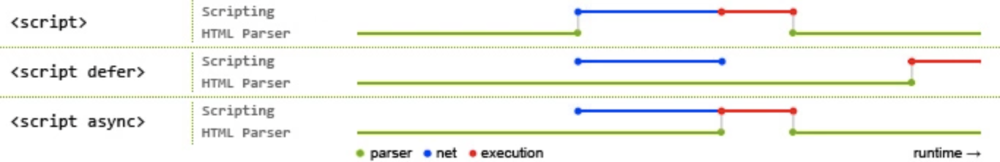

## HTML 文件中的 DOCTYPE 是什么作用

HTML 超文本标记语言：有对应的语法标准。

```html
// DOCTYPE即Document Type，文档类型标准，表示当前网页时遵循HTML5规范，浏览器就会按照这个规范解析页面
<!DOCTYPE html>
// html根标签，一个网页只有一个根标签，其它标签都应该在根标签的内部。lang="en"什么网页，中文或者英文等。
<html lang="en">
  // 网页的头部，可以设置网页的各种数据，head中的内容不会直接在网页中显示
  <head>
    // 字符集，主要用来避免乱码问题
    <meta charset="UTF-8" />
    <meta http-equiv="X-UA-Compatible" content="IE=edge" />
    <meta name="viewport" content="width=device-width, initial-scale=1.0" />
    // 网页标题
    <title>Document</title>
  </head>
  // 网页中所有可见的内容，都应该写在body里
  <body></body>
</html>
```

DOCTYPE 需要放置在 HTML 文件的`<html>`标签之前

```html
<!DOCTYPE html>
<html>
  ...
</html>
(目前主流)
```

```html
<!DOCTYPE html PUBLIC "-//W3C//DTD HTML 4.01//EN" "http://www.w3.org/TR/html4/strict.dtd">
<html>
  ...
</html>
(早期)
```

## HTML4 XML XHTML 之间有什么区别

`都属于标记语言。HTML4语法松散，不规范；XML语法太严格；XHTML过渡版本；HTML5目前主流。`

## 前缀为`data-`开头的元素属性是什么

`为HTML元素（标签）添加额外数据信息的方式，被称为自定义属性。`现在都是框架了，用的不多。

我们可以直接在元素标签上声明这样的数据属性：

```html
<div id="mydiv" data-message="Hello,world" data-num="123"></div>
```

使用 JavaScript 来操作元素的数据属性：

```js
let mydiv = document.getElementById("mydiv")

// 读取
console.log(mydiv.dataset.message)

// 写入
mydiv.dataset.foo = "bar!!!"
```

## 谈谈你对 HTML 语义化的理解

`有利于 SEO（搜索引擎优化），对人，对机器可阅读性好。`

- `<p>` 段落
- `<article>` 正⽂内容
- `<button> `按钮
- `<header>` 头部

## HTML5 对比 HTML4 有哪些不同之处

考察点：是否了解 html5 新特性

`语法更标准，新增一些标签`

`语义化header main（main一个页面最好只有一个） footer aside nav section`

`功能性video canvas`

`新增一些input的type属性值date(日历) email(自带表单校验) url(自带表单校验)`

`新增一些全域属性hidden draggable(可拖拽) contenteditable(内容可编辑)`

`新增localStorage sessionStorage`

## meta 标签有哪些常用用法

`<meta>`标签的具体功能一般由 name/http-equiv 和 content 两部分属性来定义。

- 如果设置 name 属性，则它描述的是网页文档的信息（例如：作者、⽇期和时间、⽹⻚描述、 关键词）
- 如果设置 http-equiv 属性，则它描述的相当于是 HTTP 响应头信息（例如：网页内容信息，网页缓存等）

1. 设置网页关键词 (SEO)

```html
<meta name="keywords" content="电商,好货,便宜" />
```

2. 设置网页视口（viewport）控制视⼝的⼤⼩、缩放和⽐例等 (移动端开发)

```html
<meta name="viewport" content="width=device-width, initial-scale=1, maximum-scale=1" />
```

3. 设置 http 响应头：Content-Type 网页内容类型 (字符集)

```html
<meta http-equiv="content-type" content="text/html;charset=utf-8" />

<!-- 设置字符集可简写为 -->
<meta charset="utf-8" />
```

## img 标签的 srcset 的作用是什么

`响应式页面中经常用到根据屏幕尺寸设置不同的图片，这时就需要img标签的srcset属性。通过img的srcset可以定义一组额外的图片集合，让浏览器根据不同的屏幕选取合适的图片来显示`

考察点：处理响应式图片的方式(css 媒体查询换的是背景图片，而不是 img 标签的 src)

开发者和设计师们竞相寻求 处理响应式图片 的方法。这的确是一个[棘手的问题](https://css-tricks.com/responsive-images-hard/) ，因为我们对同一个网站在众多设备宽度下，使用同一图像源。你愿意在一个大显示屏上显示模糊地、马赛克状的图像？你愿意在你的手机上加载一个巨大的（虽然更漂亮的）图像？这个问题令人左右为难。 [博客链接](https://www.jiangweishan.com/article/response-srcset-sizes.html)

其实通过使用 img 标签的 srcset 属性，可定义一组额外的图片集合，让浏览器根据不同的屏幕状况选取合适的图片来显示。

如果你的响应式需求比较简单，只需要针对屏幕的不同 dpr （device pixel ratio 设备像素比）来决定图片的显示的话，dpr 设备像素比，越高，能够显示的越清晰 (dpr: 2, dpr: 3)

那么就只要这么写：

```html

```

对于可变宽度的图像，我们使用`srcset`搭配`w`描述符以及`sizes`属性 。

- `w`描述符告诉浏览器列表中的每个图象的宽度

- `sizes`属性需要至少包含两个值，是由逗号分隔的列表

根据最新规范，如果`srcset`中任何图像使用了`w`描述符，那么必须要设置`sizes`属性。

`sizes`属性有两个值：

1. 第一个是媒体查询条件

2. 第二个是图片对应的尺寸值

   在特定媒体条件下，此值决定了图片的宽度

   需要注意是，源图尺寸值不能使用百分比，如果要用 100%, `vw`是唯一可用的 CSS 单位

```html

```

为 img 定义以上属性后，浏览器的工作流程如下：

1. 检查设备的实际宽度
2. 检查 img 标签的 sizes 属性中定义的媒体查询条件列表，并计算哪个条件最先匹配到
3. 得到图片此时的响应式宽度
4. 加载 srcset 中最接近, 最适合媒体查询匹配到的宽度的图片

注意：测试时，清除缓存测试，因为一旦加载了高清图，就不会也没有必要，回过去再用小图替换了，且我们无法确定究竟显示哪张图像，因为每个浏览器根据我们提供的信息挑选适当图像的算法是有差异的。

srcset 和 size 列表是对浏览器的一个建议，而非指令。由浏览器根据其能力、网络等因素来决定

## 响应式图片处理优化 Picture 标签

`考察点：响应式图片处理`

`<picture>`可放置零个或多个`<source>`标签、以及一个``标签，为不同的屏幕设备和场景显示不同的图片。

浏览器的工作流程如下：

- 浏览器会先根据当前的情况，去匹配和使用`<source>`提供的图片

- 如果未匹配到合适的`<source>`，就使用``标签提供的图片

```html
<picture>
  <source srcset="640.png" media="(min-width: 640px)" />
  <source srcset="480.png" media="(min-width: 480px)" />
  
</picture>
```

## defer async

共同点：都是异步执行的，不会阻塞页面的加载，与页面加载同时进行

不同点：

脚本加载完成之后，async会立刻执行，不能保证加载顺序，适合不依赖其它js文件

脚本加载完成之后，defer不会立刻执行，等前面的 defer 脚本执行，等 dom 的加载



## 前端做本地数据存储的方式有哪些


`localStorage：5M，用户不删除，一直都在。`

`sessionStorage：5M，关闭浏览器，自动销毁。`

`cookie：4k，可以设置过期时间。缺点：太小，操作不方便，可以使用js-cookie插件。`

`indexDB：存储大量数据>=250M（无上限），异步操作，性能好。`

## 以上几种前端存储的区别是什么

|    方式名称    | 标准说明     |                                                                                         功能说明                                                                                         |
| :------------: | ------------ | :--------------------------------------------------------------------------------------------------------------------------------------------------------------------------------------: |
|    Cookies     | HTML5 前加入 |    会为每个请求自动携带所有的 Cookies 数据，比较方便，但是也是缺点，浪费流量。每个 domain(站点)限制存储 20 个 cookie。容量只有 4K。浏览器 API 比较原始，需要自行封装操作 (js-cookie)     |
|  localStorage  | HTML5 加入   |                                                                  兼容 IE8+，操作方便。永久存储，除非手动删除。容量为 5M                                                                  |
| sessionStorage | HTML5 加入   |                        功能基本与 localStorage 相似，但当前页面关闭后即被自动清理。与 Cookies、localStorage 不同点是不能在所有同源窗口间共享，属于会话级别的存储                         |
|    Web SQL     | 非标准功能   |                                 2010 年已被废弃，但一些主流浏览器中都有相关的实现。类似于 SQLite 数据库，是一种真正意义上的关系型数据库，⽤ SQL 进⾏操作                                 |
|   IndexedDB    | HTML5 加入   | 是一种 NoSQL 数据库，⽤键值对进⾏储存，可进⾏快速读取操作。适合复杂 Web 存储场景，⽤ JS 操作⽅便 (前端大量存数据的场景较少，如果有，可以用) 。存储空间容量，大于等于 250MB，甚至没有上限 |

## src 和 href 的区别

1. 当浏览器遇到 href 会并行下载资源(同时也是为什么建议使用 link 方式加载 CSS，而不是使用 @import 方式)
2. 当浏览器解析到 src ，会暂停其他资源的下载和处理，直到将该资源加载或执行完毕。(这也是 script 标签为什么放在底部而不是头部的原因)

## HTML5 为什么只需要写`<! DOCTYPE HTML>`

HTML 4.01 中的 doctype 需要对 DTD 进行引用，因为 HTML 4.01 基于 SGML。而 HTML 5 不基于 SGML，因此不需要对 DTD 进行引用，但是需要 doctype 来规范浏览器的行为

其中，SGML 是标准通用标记语言, 简单的说，就是比 HTML，XML 更老的标准，HTML，XML 这两者都是由 SGML 发展而来的，而 HTML5 不是的

## 浏览器乱码

产生乱码的原因

- 网页源代码是`gbk`的编码，而内容中的中文字是`utf-8`编码的，这样浏览器打开即会出现`html`乱码
- `html`网页编码是`gbk`，而程序从数据库中调出呈现是`utf-8`编码的内容也会造成编码乱码
- 浏览器不能自动检测网页编码，造成网页乱码

解决办法

- 使用软件编辑 HTML 网页内容
- 如果网页设置编码是`gbk`，而数据库储存数据编码格式是`UTF-8`，此时需要程序查询数据库数据显示数据前进程序转码
- 如果浏览器浏览时候出现网页乱码，在浏览器中找到转换编码的菜单进行转换

## html 常见兼容性问题


## web 标准 W3C

**web 标准**简单来说可以分为**结构、表现和行为**。其中结构主要是有 HTML 标签组成。或许通俗点说，在页面 body 里面我们写入的标签都是为了页面的结构。表现即指 css 样式表，通过 css 可以是页面的结构标签更具美感。

行为是指页面和用户具有一定的交互，同时页面结构或者表现发生变化，主要是由 js 组成。

web 标准一般是将该三部分独立分开，使其更具有模块化。但一般产生行为时，就会有结构或者表现的变化，也使这三者的界限并不那么清晰。

W3C 对 web 标准提出了规范化的要求，也就是在实际编程中的一些代码规范：

1. 对于结构要求：

   标签字母要小写

   标签要闭合

   标签不允许随意嵌套

1. 对于 css 和 js 来说

   尽量使用外链 css 样式表和 js 脚本

   样式尽量少用行间样式表，使结构与表现分离，标签的 id 和 class 等属性命名要做到见文知义，标签越少，加载越快，用户体验提高，代码维护简单，便于改版

## 为什么把 CSS 的 link 标签放在 head 之间

把 link 标签放在 head 之间是规范要求的内容。这种做法可以让页面逐步呈现，提高了用户体验。如果将样式表放在文档底部附近，会使许多浏览器不能逐步呈现页面

一些浏览器会阻止渲染，以避免在页面样式发生变化时，重新绘制页面中的元素。这种做法可以防止呈现给用户空白的页面或没有样式的内容

## 样式补充

```bash
<!DOCTYPE html>
<html lang="zh">
  <head>
    <meta charset="UTF-8" />
    <title>样式</title>
    <style>
      .box1 {
        width: 200px;
        height: 200px;
        background-color: #bfa;
        /* border: 10px red solid; */
        /* outline轮廓线，和边框非常像，但是outline不会影响到元素可见框的大小 */
      }
      .box1:hover {
        outline: 10px red dashed;
      }

      .box2 {
        width: 200px;
        height: 200px;
        background-color: deepskyblue;

        /* 上右下左圆角的半径 */
        border-top-left-radius: 50px;
        border-top-right-radius: 60px;
        border-bottom-right-radius: 70px;
        border-bottom-left-radius: 100px;
        /* border-radius 同时指定四个圆角的半径 */
        border-radius: 50%;
        /* 左上、右上、右下、左下 */
        border-radius: 10px 40px 80px 100px;

        /*
          box-shadow 可以用来为元素指定阴影
          box-shadow: x轴偏移量 y轴偏移量 模糊半径 扩散半径 阴影的颜色;
          可以设置一个inset来表示内部阴影
        */

        box-shadow: 20px 20px 20px 10px rgba(0, 0, 0, 0.5);
      }
    </style>
  </head>
  <body>
    <div class="box1"></div>
    <div class="box2"></div>
  </body>
</html>
```

## 盒子模型

```bash
<style>
  .box1 {
    width: 800px;
    height: 500px;
    border: 10px tomato solid;
  }

  .box2 {
    width: auto;
    margin-left: auto;
    margin-right: auto;
    height: 200px;
    margin-top: auto;
    margin-bottom: auto;
    background-color: yellowgreen;
   }
</style>

子元素会在父元素内容区中排列
在文档流中，块元素的水平排列，必须要遵循如下一个等式：
  子元素可见框宽度 + 子元素的水平外边距 = 包含块内容区的宽度
    200 + 600 = 800
    margin-left + 可见框 + margin-right = 包含块内容区的宽度
    100 + 200 + 100 = 800  右外边距会自动修正为500
    500 + 500 + 100 = 800  右外边距会自动修正为-200
    100 + auto + 100 = 800 宽度为auto，会自动设置为600
    auto + 200 + auto = 800
    auto + auto + 200 = 800
    - 当所有的属性值中没有auto，此时浏览器会自动调整右外边距以使等式强制满足
    - 当只有一个属性值设置为auto，则浏览器会自动调整该值以使等式满足
    - 当左右外边距为auto，而width有值时，则左右外边距会设置为相等的值，以使等式满足
    - 当外边距和width同时设置为auto，则设置auto的外边距就是0
在文档流中，块元素的垂直排列，不需要遵循等式！

<div class="box1">
  <div class="box2"></div>
</div>
```

## 包含块

```bash
<!DOCTYPE html>
<html lang="zh">
  <head>
    <meta charset="UTF-8" />
    <title>包含块</title>
  </head>
  <body>
    <!-- 包含块（containing block）在文档流中，包含块就是离当前元素最近的祖先块元素 -->

    <div class="box1">
      <div class="box2">
        <div class="box3"></div>
      </div>
    </div>

    <div class="box4">
      <span>
        <div class="box5"></div>
      </span>
    </div>
  </body>
</html>
```

## css 书写路径

```bash
内部样式表
- 可以通过style标签来创建一个内部样式表
- 将样式编写到style标签中，降低了代码的耦合，使代码易维护
- 内部样式表只能在当前页面中生效，无法在不同的页面中进行复用

通过外部样式表，将结构和表现完全分离，使代码易于维护
同时代码可以在不同的页面之间进行复用
并且外部文件可以利用到浏览器的缓存机制，加快用户的访问速度
```

## 路径

```bash
1.绝对路径
https://img0.baidu.com/it/u=3288444602,3967521966&fm=253&fmt=auto&app=120&f=JPEG?w=665&h=500

2.相对路径
相对路径，用来引入我们自己项目内的图片
相对路径需要使用 ./开头 或 ../开头
./表示当前目录，./可以省略
../表示当前目录的上一级目录，几个../就表示上几级
```

## 块 行内块 文档流

```bash
在html中，元素可以被分为块元素和行内元素
#块元素（block）
块元素会独占页面的一行自上向下垂直排列
块元素用来对网页进行布局，将一个页面分成一块一块的
最常用的块元素：div

#行内元素（inline）
行内元素只会占自身的大小，自左向右水平排列
行内元素一般用来放置文字
最常用的行内元素：span

#替换元素
img iframe

#元素的嵌套规则
块元素中可以放置块元素，也可以放置行内元素
行内元素中尽量不要放置块元素
a元素中可以放置除它自身外的任何元素
p元素中不能放置块元素
浏览器在渲染页面时，会自动修复html中的语法错误

#文档流是网页中的位置，我们所创建的元素默认都存在于文档流中
- 文档流中的元素，必须要遵循文档流的规则在页面中排列
- 块元素
- 块元素在文档流中自上向下垂直排列
- 块元素的默认宽度会将父元素撑满（默认值为auto）
- 块元素的默认高度被内容撑开

- 行内元素
- 行内元素在文档流中会自左向右水平排列，如果一行不足以容纳所有元素，则会另起一行继续自左向右水平排列
- 行内元素的默认宽度和高度都被内容撑开
```

## 超链接

```bash
a
使用a标签来定义一个超链接
通过超链接可以跳转到其他的页面
属性
href：指定要跳转到位置
target：指定页面打开的位置
可选值
_blank在新的标签页打开链接
_self默认值，在当前页面打开链接

内部跳转的超链接，通过修改href属性可以使超链接在页面内部进行跳转
#id表示跳转到页面的指定位置
#表示跳转到页面的顶部
<a href="#p3">去p3</a>
<p id="p3"></p>
```

## 布局手段

```bash
布局手段
1. 盒子模型（纵向）
2. 浮动（横向）
3. 定位
4.flex弹性布局（纵向 + 横向）
```

## visibility

```bash
visibility用来设置一个元素的可见性，可选值
visible默认值 元素可见
hidden元素是隐藏的在页面中不可见，但是依然占据页面的位置
```

## overflow

```html
<!DOCTYPE html>
<html lang="zh">
  <head>
    <meta charset="UTF-8" />
    <title>overflow</title>
    <style>
      /* 
        当子元素大小超过父元素内容区时，子元素会从父元素中溢出，可以通过overflow处理
        scroll生成双方向滚动条，通过滚动条来查看完整内容
        visible默认值 溢出内容直接在元素以外的位置显示
        hidden隐藏溢出的内容
        auto根据需要生成滚动
      */
      .box1 {
        width: 200px;
        height: 200px;
        overflow: auto;
        background-color: #bfa;
      }
      .box2 {
        width: 100px;
        height: 300px;
        background-color: tomato;
      }
    </style>
  </head>
  <body>
    <div class="box1">
      <div class="box2"></div>
    </div>
  </body>
</html>
```

## 选择器

1. 并集选择器

作用：同时选中多个选择器对应的元素

语法：选择器 1,选择器 2,选择器 3,...选择器 n{}

2. 复合选择器

- 子选择器

  作用：选中指定元素的子元素

  语法：父元素 > 子元素{}

  示例：.box1 > span{}

- 后代选择器

  作用：选中指定元素的后代元素

  语法：祖先 后代{}

  示例：div span{}

  - 兄弟选择器
    作用：选中指定的兄弟元素
    语法 1：兄 + 弟 {}
    示例：h1 + p{}选中紧随其后的一个兄弟
    语法 2：兄 ~ 弟 {}
    示例：h1 ~ p{}选中后边的所有兄弟元素

3. 属性选择器

```html
<!DOCTYPE html>
<html lang="zh">
  <head>
    <meta charset="UTF-8" />
    <title>属性选择器</title>
    <style>
      /*       
        属性选择器
         - 用来根据元素的属性来选中元素
         - 语法：
           [属性名] 选中具有该属性的元素
           [属性名=属性值] 选中指定属性值的元素
           [属性名^=属性值] 选中属性值以指定内容开头的元素
           [属性名$=属性值] 选中属性值以指定内容结尾的元素
           [属性名*=属性值] 选中属性值包含指定内容的元素
       */

      /* [title]{
            color:orange;
        }  */

      /* [title="hello"] {
        color: red;
      } */

      /* [title^="he"] {
        color: red;
      } */

      /* [title$="lo"] {
        color: red;
      } */

      /* [title*="a"] {
        color: red;
      } */

      /* 
      选中title属性等于hello的div
      可以将多个选择器连着一起写，这样则要求元素必须同时满足多个选择器
      交集选择器
        - 作用：选中同时符合多个选择器元素
        - 语法：选择器1选择器2选择器3 {}
        - 例子：div[title="hello"] {}
               div.box {} 
      */
      div[title="hello"] {
        color: red;
      }
    </style>
  </head>
  <body>
    <h1 title="hello">落霞与孤鹜齐飞</h1>
    <p title="abcllo">秋水共长天一色</p>
    <p title="helloabc">先天下之忧而忧，后天下之乐而乐</p>
    <div title="hello">大金链子小金表，一天三顿小烧烤</div>
    <div>大金链子小金表，一天三顿小烧烤</div>
  </body>
</html>
```

`!important > 内联样式` > `ID选择器` > `类选择器` > `标签选择器 > 通配符 > 继承`

优先级是由 A、B、C、D 四个值来决定的，具体计算规则如下

- A = { 如果存在内联样式则为 1，否则为 0 }
- B = { ID 选择器出现的次数 }
- C = { 类选择器、属性选择器、伪类选择器出现的总次数 }
- D = { 标签选择器、伪元素选择器出现的总次数 }

```css
/*
  A=0   不存在内联样式
  B=0   不存在ID选择器
  C=1   有一个类选择器
  D=3   有三个标签选择器

  最终计算结果：{0,0,1,3}
*/
div ul li .red {
}
```

```css
/*
  A=0   不存在内联样式
  B=1   有一个ID选择器
  C=0   不存在类选择器
  D=0   不存在标签选择器

  最终计算结果：{0,1,0,0}
*/
#mydiv {
}
```

## 通过 CSS 的哪些方式可以实现隐藏页面上的元素

display: none 不占位置

visibility: hidden 占位置

opacity: 0 占位置

transform: scale(0,0)占位置

transform 不会影响布局，改了宽高会

## 单位

px 绝对单位：一旦设置了，就无法因为适应页面大小而改变

em 相对单位：1em = 1font-size 相对于当前元素的 font-size，如果当前元素没有会看父级元素有没有，如果父级元素有，先`继承`下来，再设置，如果父级元素没有，则找根的 font-size

百分比%：设置后元素的属性会根据父元素指定属性的百分比计算

rem：1rem = 1 根元素的 font-size（html 根元素）

## 居中

margin: 0 auto 盒子模型的等式：margin-left + 可见框宽度 + margin-right = 包含块的内容区宽度

```css
<div class="center" > 此盒子会居中</div > .center {
  height: 500px;
  width: 500px;
  background-color: pink;
  margin: 0 auto;
}
```

转成行内块，给父盒子设置 text-align: center

```css
<div class="father" > <div class="center" > 此盒子会居中</div > </div > .father {
  text-align: center;
}
.center {
  width: 400px;
  height: 400px;
  background-color: pink;
  display: inline-block;
}
```

flex

```css
<div class="father" > <div class="center" > 我是内容盒子</div > </div > .father {
  display: flex;
  background-color: skyblue;
  justify-content: center;
  align-items: center;
}
.center {
  width: 400px;
  height: 400px;
  background-color: pink;
}
```

定位。left + margin-left + 可见框宽度 + margin-right + right = 包含块的内容区宽度

top + margin-top + 可见框高度 + margin-bottom + bottom = 包含块的内容区高度

```css
<div class="father" > <div class="center" > 我是内容盒子</div > </div > .father {
  background-color: skyblue;
  position: relative;
  height: 500px;
}
.center {
  width: 400px;
  height: 400px;
  background-color: pink;
  position: absolute;
  left: 50%;
  top: 50%;
  transform: translate(-50%, -50%);
}
```

文字水平垂直居中

```css
<!DOCTYPE html>
<html lang="zh">
  <head>
    <meta charset="UTF-8" />
    <title>Title</title>
    <style>
      p {
        height: 50px;
        border: 1px #000 solid;
        /* 文字水平居中 */
        text-align: center;
        /* 将行高设置为和元素高度一样的值即可让元素垂直居中 */
        line-height: 50px;
      }
    </style>
  </head>
  <body>
    <p>今天天气真不错！</p>
  </body>
</html>
```

[【更多方式参考】实现水平居中垂直居中](https://www.cnblogs.com/chengxs/p/11231906.html)

## 定位

```bash
#position用来设置元素的定位方式，取值
1. static默认值，元素没有开启定位，不脱离文档流，top，right，bottom，left，z-index等属性不生效
2. relative相对定位，不脱离文档流。参照物：元素偏移前位置。相对定位会提升元素的层级
3. fixed固定定位，脱离文档流。参照物：浏览器窗口。固定定位也是一种绝对定位，它的大部分的特点和绝对定位是相同的。不同点在于固定定位总是参照于浏览器的窗口进行定位，一旦定位，不会随窗口进行滚动
4. 当绝对定位和固定定位参照物都是浏览器窗口时的区别： 当出现滚动条时，固定定位的元素不会跟随滚动条滚动，绝对定位会跟随滚动条滚动
5. sticky粘性定位，不脱离文档流。参照物：粘滞定位相对于离它最近的拥有滚动条祖先元素来定位的
```

```bash
absolute绝对定位，脱离文档流。
参照物：最近的一级带有定位的父级元素（static除外）进行位置移动，如果找不到，那么相对于浏览器窗口进行定位。

参照物权威：绝对定位是参照于它的包含块进行定位的
绝对定位元素的包含块是谁
绝对定位元素的包含块是离它最近的开启了定位的祖先元素
如果所有的祖先都没有开启定位，则它的包含块是初始包含块
初始包含块的大小和视口是相同
```

```html
<!DOCTYPE html>
<html lang="en">
  <head>
    <meta charset="UTF-8" />
    <meta http-equiv="X-UA-Compatible" content="IE=edge" />
    <meta name="viewport" content="width=device-width, initial-scale=1.0" />
    <title>Document</title>
    <style>
      body {
        height: 3000px;
      }
      .header {
        position: sticky;
        /* 设置盒子距离浏览器的顶部边缘，多少时开始吸顶 */
        top: 0;
      }
    </style>
  </head>
  <body>
    <div class="header">我是头部</div>
  </body>
</html>
```

## z-index

```bash
z-index元素的position属性需要是relative，absolute或是fixed
元素默认的z-index为0，可通过修改z-index来控制设置了postion值的元素的图层位置
z-index的小坑，如果父辈元素有定位，且配置了z-index，优先按照父辈元素的定位的z-index进行比较层级
```

## 浮动

```bash
浮动flot取值
1. none默认值，元素不浮动
2. left向左浮动
3. right向右浮动

浮动特点
1. 浮动元素不会超过它上边浮动的兄弟元素，最多一边齐
2. 浮动元素不会盖住文字，文字会环绕在浮动元素的周围
3. 设置浮动后，元素会脱离文档流，其后的元素会自动上移
4. 浮动后，之前的布局等式就失效了margin: 0 auto; 不可以用了
5. 如果一行之内无法容纳所有的浮动元素，则后边的元素会自动换到下一行

元素脱离文档流后的特点
块元素
1. 块元素不再独占一行，而是水平排列
行内元素
1. 设置浮动行内元素可以设置宽度和高度
总结：脱离文档流后，就不再需要区分行内和块
```

`容器不设高度且子元素浮动时，容器高度不能被内容撑开，此时，内容会溢出到容器外面而影响布局，需要清除浮动`

父元素添加`display:flow-root，开启BFC后，元素可以包含浮动的子元素（清除浮动）`

单伪元素双伪元素清除法：不仅可以解决浮动，还可以解决 margin 塌陷问题

```css
.clearfix::before,
.clearfix::after {
  content: "";
  display: table;
}
.clearfix::after {
  clear: both;
}
```

## BFC

[参考文章：深入理解 BFC](https://www.cnblogs.com/xiaohuochai/p/5248536.html)

`BFC块级格式化上下文，是一个独立的渲染区域，渲染区域中的元素布局不受外部影响`，可以将 BFC 理解为一个隐藏的属性

如何触发 BFC（由于 BFC 是通过一些样式间接开启的，所以都会有一些副作用）

- flot 属性不为 none
- position 属性为 absolute/fixed
- display 属性为 inline-block/flex/`flow-root副作用最小，可能会有兼容性`
- overfolw 属性不为 visible

开启 BFC 解决哪些问题

- `开启BFC后，子元素的垂直外边距不会传递给父元素，解决margin塌陷`

```css
<div class="father" > <div class="son" > </div > </div > .father {
  width: 400px;
  height: 400px;
  display: flow-root;
  background-color: red;
}

.son {
  width: 100px;
  height: 100px;
  margin-top: 10px;
  background-color: pink;
}
```

- `开启BFC后，元素不会被浮动元素所覆盖`

```css
.box1 {
  float: left;
  width: 200px;
  height: 200px;
  background-color: red;
}

.box2 {
  display: flow-root;
  width: 200px;
  height: 200px;
  background-color: pink;
}

<div class="box1"></div>
<div class="box2"></div>
```

## 精灵图

<!--
        在网页中，经常能够看到一些小图标，可以使用图片来表示这些图标
        但是图片存在着一些不足：
            1. 不便于缩放
            2. 颜色无法改变

​        如果这些小图标，可以任意缩放，同时又可以任意的修改颜色，那就好了！
​        在网页中文字可以任意缩放和改变颜色！（文字是矢量图）
​        如果我们的小图标能够像文字一样，那就好了！

​        图标字体（iconfont）
​        - 所谓的图标字体，指将小图标制作为字体文件
​        - 可以使用一些第三方的库https://fontawesome.com/
​        - 使用步骤：
​            1. 下载
​            2. 解压缩
​            3. 复制css和webfonts目录到项目下
​            4. 在页面中引入all.css
​            5. 在页面中添加标签
​        -->

将一个页面涉及到的所有图片都包含到一张大图中去，然后利用 CSS 的 background-image，background-repeat，background-position 属性的组合进行背景定位。

## 媒体查询

媒体查询是 C3 加入的功能，它可以进行响应式适配。

什么是响应式适配？根据不同的屏幕尺寸，显示不同的效果（设置盒子样式）

```css
/* 在css样式表的定义中直接使用媒体查询 */
/* min-width（从小到大）max-width（从大到小）*/
.container {
  width: 600px;
  height: 200px;
  background-color: pink;
  margin: 0 auto;
}
@media screen and (max-width: 767px) {
  .container {
    width: 100%;
  }
}
@media screen and (min-width: 768px) and (max-width: 991px) {
  .container {
    width: 750px;
  }
}
@media screen and (min-width: 992px) and (max-width: 1199px) {
  .container {
    width: 980px;
  }
}
@media screen and (min-width: 1200px) {
  .container {
    width: 1170px;
  }
}
@media (width: 1200px) {
  .container {
    background-color: skyblue;
  }
}
```

[参考文章：深入理解 CSS 媒体查询](https://www.cnblogs.com/xiaohuochai/p/5848612.html)

## 盒模型

浏览器的渲染引擎在对网页文档进行布局时，会按照 `CSS 基础盒模型 （CSS Basic Box Model）标准`，将文档中的所有元素都表示为一个个矩形的盒子，再用 CSS 去决定这些盒子的大小尺寸、显示位置、以及其他属性（如颜色、背景、边框等）

在 C3 中，我们可以通过设置 box-sizing 的值来决定具体使用何种盒模型

- box-sizing：content-box 标准盒模型
- box-sizing：border-box 怪异盒模型

1. 标准盒模型的 width 和 height 属性范围只包含了 content


2. 怪异盒模型的 width 和 height 属性的范围包含了 border、padding 和 content


[参考文章：深入理解盒模型](https://www.cnblogs.com/xiaohuochai/p/5202597.html)

## 伪类 伪元素

1. 伪类（用来选择元素，伪类和类选择器权重一样）

2. 伪元素（伪元素创建元素，但是不在 DOM 树中，所以无法注册事件，不要通过 js 控制伪元素）

   通过::before、::after 可以选中元素开始或结束的位置，从而为其添加内容

   ```css
   ::after {
     /* 别忘记了 */
     content: "";
   }
   ```

[参考文章：伪类与伪元素](http://www.alloyteam.com/2016/05/summary-of-pseudo-classes-and-pseudo-elements/)

## flex

```bash
弹性盒模型是C3中新添加的布局方式，通过它可以更加方便完成我们对网页的布局
要使用弹性盒模型必须先将父元素设置为弹性容器
display:flex 块级弹性容器
display:inline-flex 行内弹性容器

弹性子元素（弹性项）
- 弹性容器的子元素都会自动变成弹性子元素
- 弹性子元素都会沿着弹性容器的主轴排列
- 主轴就是弹性子元素排列方向
- 侧轴是与主轴垂直方向的轴
```

`flex-direction调整主轴方向，父元素添加`

```bash
row：主轴方向为水平向右
column：主轴方向为竖直向下
row-reverse：主轴方向为水平向左
column-reverse：主轴方向是竖直向上
```

`flex-wrap父元素添加，弹性盒子多行排列效果`

```bash
nowrap： 不换行（默认），如果宽度溢出，会压缩子盒子的宽度
wrap： 当宽度不够的时候，会换行
```

`justify-content父元素添加，调节元素在主轴的对齐方式`

```bash
flex-start: 弹性盒子元素将向起始位置对齐
flex-end: 弹性盒子元素将向结束位置对齐
center: 弹性盒子元素将向行中间位置对齐
space-around: 弹性盒子元素会平均地分布在行里
space-between: 第一个贴左边，最后一个贴右边，其他盒子均分，保证每个盒子之间的空隙是相等的
space-evenly: 弹性盒子沿主轴均匀排列,  弹性盒子与容器之间间距相等
```

`align-items父元素添加，调节元素在侧轴的对齐方式`

`align-self自己添加，控制某个弹性盒子在侧轴的对齐方式`

```txt
flex-start：元素在侧轴的起始位置对齐
flex-end：元素在侧轴的结束位置对齐
center：元素在侧轴上居中对齐
stretch：元素的高度会被拉伸到最大（不给高度时, 才拉伸）
```

`align-content 调整行对齐方式，取值与 justify-context 基本相同`

```txt
flex-start：各行向侧轴的起始位置堆叠
flex-end：各行向弹性盒容器的结束位置堆叠
center：各行向弹性盒容器的中间位置堆叠
space-around：各行在侧轴中平均分布
space-between：第一行贴上边，最后一个行贴下边,其他行在弹性盒容器中平均分布
stretch：拉伸，不设置高度的情况下
```

`使用 flex 属性修改弹性盒子伸缩比。子元素添加 flex:值。取值：整数。只占用父盒子剩余尺寸。`

[flex 布局教程](http://www.ruanyifeng.com/blog/2015/07/flex-grammar.html)

## display

| 属性值       | 作用                                                                                                                                               |
| ------------ | :------------------------------------------------------------------------------------------------------------------------------------------------- |
| none         | 隐藏元素                                                                                                                                           |
| block        | 将元素设置为块元素                                                                                                                                 |
| inline       | 将元素设置为行内元素                                                                                                                               |
| inline-block | 行内块元素，行内块兼具行内元素和块元素的特点：不独占一行，又可以设置宽高。`注意：行内块的特点和文本很像，所以布局时尽量少用，在一行时会有空白间隙` |
| list-item    | 像块类型元素一样显示，并添加样式列表标记                                                                                                           |
| table        | 此元素会作为块级表格来显示                                                                                                                         |
| inherit      | 规定应该从父元素继承 display 属性的值                                                                                                              |

## link 和@import

link 引入 css 时，在页面载入时同时加载；@import 需要页面完全载入以后在加载

## transition 和 animation 的区别

transition 的实现需要触发一个事件，才执行动画，比如鼠标点击等。

animation 的实现不需要触发事件，设定好时间就可以自己执行。

## li 与 li 之间有看不见的空白间隔

浏览器会把 inline 内联元素间的空白字符（空格、换行、Tab 等）渲染成一个空格。为了美观，通常是一个 li 放在一行，这导致 li 换行后产生换行字符，它变成一个空格，占用了一个字符的宽度

解决办法

为 li 设置 float:left 缺点：有些容器是不能设置浮动，如左右切换的焦点图等

将所有 li 写在同一行 缺点：代码不美观

将 ul 内的字符尺寸直接设为 0，即 font-size:0。缺点：ul 中的其他字符尺寸也被设为 0，需要额外重新设定其他字符尺寸，且在 Safari 浏览器依然会出现空白间隔

消除 ul 的字符间隔 letter-spacing:-8px 缺点：这也设置了 li 内的字符间隔，因此需要将 li 内的字符间隔设为默认 letter-spacing:normal

## 图片格式

1. jpg

   支持颜色丰富，不支持透明

   用来显示照片

2. gif

   支持的颜色少，支持简单透明，支持动图

   用来显示颜色单一的图片，或动图

3. png

   支持的颜色，支持透明

   用来显示颜色丰富的图片，支持透明效果

   在网页中使用的比较多

4. webp

   是谷歌专门为浏览器推出的一种格式

   兼具上述格式所有优点，部分浏览器不支持这种格式（越来越少了）

5. base64

   通过 base64 来对图片进行编码，编码后可以直接在网页引入图片

   通过 base64 对图片编码后，图片可以和网页一起加载，加快图片的加载速度

   可以使用 base64 来加载一些对速度要求比较高的图片，但是不要大量使用

6. svg

   是无损的矢量图。SVG 是矢量图意味着 SVG 图片由直线和曲线以及绘制它们的方法组成。当放大 SVG 图片时，看到的还是线和曲线，而不会出现像素点。SVG 图片在放大时，不会失真，所以它适合用来绘制 Logo、Icon 等

## line-height

line-height 用来设置元素的行高

文字默认是在行高中垂直居中

行间距 = 行高 - 字体大小

行高可以设置一个数字，那么行高将会是字体大小对应的倍数

## css 如何优化提高性能

css 压缩：将写好的 css 进行打包压缩，可以减小文件体积

减少使用@import，建议使用 link，因为后者在页面加载时一起加载，前者是等待页面加载完成之后再进行加载

关键选择器，选择器最后面的部分为关键选择器（即用来匹配目标元素的部分）css 选择符是从右到左进行匹配的。当使用后代选择器的时候，浏览器会遍历所有子元素来确定是否是指定的元素等等。尽量少的去使用后代选择器，降低选择器的权重值。后代选择器的开销是最高的，尽量将选择器的深度降到最低，最高不要超过三层，更多的使用类来关联每一个标签元素

了解哪些属性是可以通过继承而来的，然后避免对这些属性重复指定规则

css 雪碧图，同一页面相近部分的小图标，方便使用，减少页面的请求次数，但是同时图片本身会变大，使用时，优劣考虑清楚，再使用。

正确使用 display 的属性，由于 display 的作用，某些样式组合会无效，徒增样式体积的同时也影响解析性能。

将具有相同属性的样式抽离出来，整合并通过 class 在页面中进行使用，提高 css 的可维护性。

样式与内容分离：将 css 代码定义到外部 css 中。

## 单行 多行文本溢出隐藏

单行文本溢出

```scss
// 单行文本溢出显示省略号
.ellipsis {
  // 规定段落中的文本不进行换行
  white-space: nowrap;
  // 溢出用省略号显示
  text-overflow: ellipsis;
  // 溢出隐藏
  overflow: hidden;
}
```

多行文本溢出

```scss
/* 两行文本溢出显示省略号 */
.ellipsis-2 {
  word-break: break-all;
  text-overflow: ellipsis; // 溢出用省略号显示
  display: -webkit-box; // 作为弹性伸缩盒子模型显示
  -webkit-box-orient: vertical; // 设置伸缩盒子的子元素排列方式：从上到下垂直排列
  -webkit-line-clamp: 2; // 显示的行数
  overflow: hidden; // 溢出隐藏
}
```

注意：由于上面的三个属性都是 C3 的属性，没有浏览器可以兼容，所以要在前面加一个`-webkit-` 来兼容一部分浏览器

## less

```bash
#less定义变量
@fontColor:pink;
#less使用变量
.box {
	color:@fontColor;
}

#导入其它less文件
@import '文件路径';
@import '01.less';

#控制当前less文件导出css的路径，less文件第一行添加
// out: ./css/common.css
#禁止导出css，less文件第一行添加
// out:false

#less嵌套语法
#&不生成后代选择器，表示当前选择器
.father {
	color: red;
	&:hover {
		color: pink;
	}
}

.father {
	color: red;
}
.father:hover {
	color: pink;
}
#生成后代选择器
.father {
	color: red;
	.son {
		color: pink;
	}
}

.father {
	color: red;
}
.father .son {
	color: pink;
}

#less运算
.box1 {
	width: 100 + 50px;
	height: 100 * 50px
}
.box2 {
	width: (100 / 50px);
}
```

## 元素是否在可视区

以图片显示为例，内容达到显示区域的：`img.offsetTop < window.innerHeight + document.body.scrollTop`

## 两栏布局

左边宽度固定，右边宽度自适应

方式一：使用浮动

```css
<!DOCTYPE html>
<html lang="en">
  <head>
    <meta charset="UTF-8" />
    <meta http-equiv="X-UA-Compatible" content="IE=edge" />
    <meta name="viewport" content="width=device-width, initial-scale=1.0" />
    <title>Document</title>
    <style>
      .left {
        float: left;
        width: 200px;
        background: tomato;
      }
      .right {
        display: flow-root;
        background: gold;
      }
    </style>
  </head>
  <body>
    <div class="outer">
      <div class="left">11</div>
      <div class="right">22</div>
    </div>
  </body>
</html>
```

方式二：利用 flex 布局，将左边元素设置为固定宽度 200px，将右边的元素设置为 flex:1

```css
<!DOCTYPE html>
<html lang="en">
  <head>
    <meta charset="UTF-8" />
    <meta http-equiv="X-UA-Compatible" content="IE=edge" />
    <meta name="viewport" content="width=device-width, initial-scale=1.0" />
    <title>Document</title>
    <style>
      .outer {
        display: flex;
      }
      .left {
        width: 200px;
        background: tomato;
      }
      .right {
        flex: 1;
        background: gold;
      }
    </style>
  </head>
  <body>
    <div class="outer">
      <div class="left">11</div>
      <div class="right">22</div>
    </div>
  </body>
</html>
```

## 三栏布局

左右两栏宽度固定，中间自适应的布局

方式一：利用绝对定位，左右两栏设置为绝对定位，中间设置对应方向大小的 margin 的值

```css
<!DOCTYPE html>
<html lang="en">
  <head>
    <meta charset="UTF-8" />
    <meta http-equiv="X-UA-Compatible" content="IE=edge" />
    <meta name="viewport" content="width=device-width, initial-scale=1.0" />
    <title>Document</title>
    <style>
      .outer {
        position: relative;
      }

      .left {
        position: absolute;
        top: 0;
        left: 0;
        width: 100px;
        height: 100px;
        background: tomato;
      }

      .right {
        position: absolute;
        top: 0;
        right: 0;
        width: 200px;
        height: 100px;
        background: gold;
      }

      .center {
        margin-left: 100px;
        margin-right: 200px;
        height: 100px;
        background: lightgreen;
      }
    </style>
  </head>
  <body>
    <div class="outer">
      <div class="left">1</div>
      <div class="center">2</div>
      <div class="right">3</div>
    </div>
  </body>
</html>
```

方式二：利用 flex 布局，左右两栏设置固定大小，中间一栏设置为 flex:1

```css
<!DOCTYPE html>
<html lang="en">
  <head>
    <meta charset="UTF-8" />
    <meta http-equiv="X-UA-Compatible" content="IE=edge" />
    <meta name="viewport" content="width=device-width, initial-scale=1.0" />
    <title>Document</title>
    <style>
      .outer {
        display: flex;
      }

      .left {
        width: 100px;
        background: tomato;
      }

      .right {
        width: 100px;
        background: gold;
      }

      .center {
        flex: 1;
        background: lightgreen;
      }
    </style>
  </head>
  <body>
    <div class="outer">
      <div class="left">1</div>
      <div class="center">2</div>
      <div class="right">3</div>
    </div>
  </body>
</html>
```

## 响应式

原理是通过媒体查询`（@media）`查询检测不同的设备屏幕尺寸做处理。

兼容：页面头部必须有 mate 声明的`viewport`

```ini
<meta name="’viewport’" content="”width=device-width," initial-scale="1." maximum-scale="1,user-scalable=no”"/>
```

## 实现一个三角形

```css
div {
  width: 0;
  height: 0;
  border: 10px solid transparent;
  border-bottom-color: red;
}
```

## 实现一个扇形

```css
div {
  width: 0;
  height: 0;
  border: 10px solid transparent;
  border-radius: 10px;
  border-top-color: red;
}
```

## 画一条 0.5px 的线

```css
transform: scale(0.5, 0.5);
```

## 移动端有哪些常见的问题

点击事件 300MS 延迟问题 解决方案：下载 fastclick 的包

H5 页面窗口自动调整到设备宽度，并禁止用户缩放页面

```ini
<meta name="viewport" content="width=device-width,initial-scale=1.0,minimum-scale=1.0,maximum-scale=1.0,user-scalable=no">
```

忽略 Android 平台中对邮箱地址的识别

```ini
<meta name="format-detection" content="email=no">
```

当网站添加到主屏幕快速启动方式，可隐藏地址栏，仅针对 ios 的 safari

```xml
<!-- ios7.0版本以后，safari上已看不到效果 -->
<meta name="apple-mobile-web-app-capable" content="yes">
```

## css 变量

```css
定义全局变量
:root {
  --borderColor: #ccc;
}

使用变量
width:var(--borderColor);
```

## css 怎么解决浏览器兼容问题

c3 属性针对不同浏览器内核兼容写法

-webkit-针对 webkit 内核

-moz-针对火狐内核

-ms-针对 IE 内核

-o-针对 opera 内核

手动写上述还是比较麻烦的，在工程化项目中可以使用 css 后处理器，如 postcss，通常是在完成的样式表中根据`css`规范处理`css`，让其更加有效。目前最常做的是给`css`属性添加浏览器私有前缀，实现跨浏览器兼容性的问题。

## 文本

```bash
text-align文本的水平对齐方式
  left默认值 左对齐
  center居中对齐
  right右对齐
  justify两端对齐
  网页中，图片、行内块、都可以使用文本对齐的方式

text-indent首行缩进
  可以设置负值
  正值文字向右移动
  负值文字向左移动，可以利用负值隐藏网页中的一些文字

text-decoration文本修饰
  none 默认值 没有修饰
  underline 下划线
  overline 上划线
  line-through 中间穿过

在网页中，每个文字被显示时都会有一个文本框与之对应
 当我们设置元素的font-size时，实际上就是在设置文本框的大小
 在文本框存在一个位置叫做基线（baseline）

文字的垂直对齐
 默认每个文字和父元素在垂直方向都是沿着基线对齐的

vertical-align设置元素垂直对齐的方式，可选值
baseline 默认值 子元素和父元素的基线对齐
top 子元素文本框的顶部和父元素文本框的顶部对齐
bottom 子元素文本框的底部和父元素文本框的底部对齐
middle 将元素的中线和父元素基线高度 + x高度一半的位置对齐
开发中经常通过vertical-align来消除图片下边的空白

font-size 字体的大小
font-weight 字重，可选值
normal 默认值 正常的粗细
bold 加粗
lighter 细的
font-style 字体的样式，可选值
normal 默认值 正常的
italic 斜体
font-family 字体族 指定使用什么字体，字体的分类
serif 衬线字体
sans-serif 非衬线字体
monospace 等宽字体
-当我们将字体设置为上述类型时，浏览器会自动选择相应的字体来显示，这三个字体一般不会单独用，一般放在最后

font简写属性，语法：font: 任意 font-size/line-height font-family
```

## iframe

```html
<!DOCTYPE html>
<html lang="zh">
  <head>
    <meta charset="UTF-8" />
    <title>Title</title>
  </head>
  <body>
    <!-- iframe内联框架，用来向一个网页中引入另一个网页。属性：src来指定要引入的网页的路径 -->
    <iframe name="hello" src="https://lilichao.com" width="600" height="600"></iframe>
    <iframe src="./04_超链接.html" width="600" height="600"></iframe>
    <iframe src="./02_图片标签.html"></iframe>
  </body>
</html>
```

## 外边距

由于我们的浏览器默认是按照自左向右，自上向下的顺序来排列元素的

所以当我们设置上和左外边距时，是改变元素自身的位置

但是设置下和右时，'会改变其他元素的位置'

可以将 margin 的值设置为 auto，设置 auto 后，元素的外边距由浏览器自动计算

- 当我们将 margin-left 或 margin-right 中的一个设置为 auto 时，则浏览器会自动使其尽量的大

- 如果将 margin-left 和 margin-right 同时设置为 auto，则浏览器会使元素左右的外边距相同

也就是元素会在其父元素中水平居中，通过将一个块元素的左右外边距设置为 auto，以使其在父元素中水平居中

- 默认情况下，垂直外边距设置为 auto 时，浏览器会自动取 0 为外边距，为什么会这样？

行内元素的盒子模型

span {
/\*
内容区 width height - 行内元素的大小被内容撑开，无法通过 width 和 height 来设置行内元素宽度高度
内边距 padding - 行内元素可以设置内边距，但是垂直方向的内边距不会影响布局
边框 border - 行内元素可以设置边框，但是垂直方向的边框不会影响页面的布局
外边距 margin

- 行内元素可以设置水平方向的外边距，垂直方向的外边距看不到，设置了没用

## 背景相关

```css
background-color背景颜色
background-image背景图片
background-repeat背景平铺
- 可选值
  repeat默认值
  repeat-x水平方向平铺
  repeat-y垂直方向平铺
  no-repeat不平铺
  space背景图片充满元素，无法完整充满使用空白隔开
  round背景图片自动缩放以充满元素
background-position背景图片位置
background-position: 水平偏移量 垂直偏移量
- 可选值
  top bottom left right center
    - 可以从上述关键字中任选两个来设置一个背景图片的位置
    - 如果只传了一个关键字，则第二个默认就是center
/* 简写属性，可以同时设置所有的背景相关的样式 */
background: #bfa url("./images/4.png") no-repeat 400px 400px;
```
