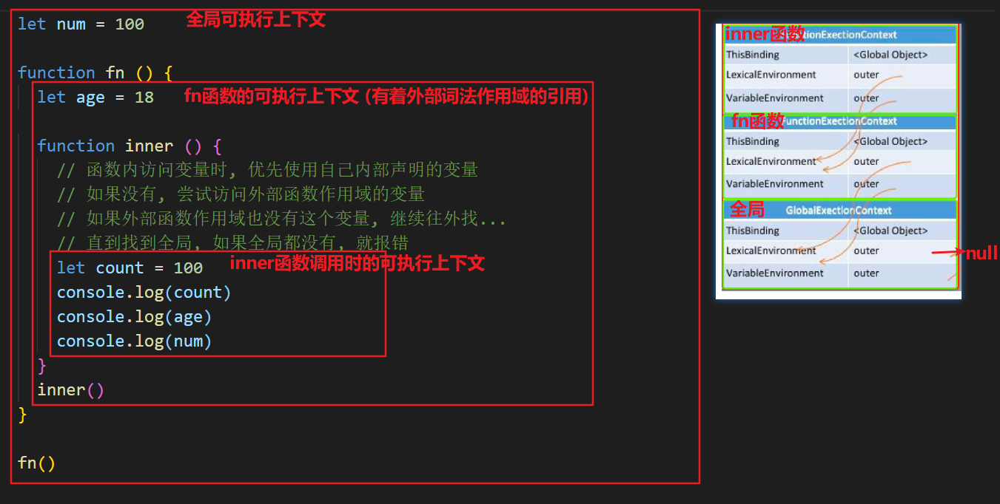

## JS 组成部分

ECMAScript：js 的核心内容，描述了语言的基础语法，比如 let const 数据类型等

文档对象模型 DOM：使用 JavaScript 去操作页面文档

浏览器对象模型 BOM：使用 JavaScript 去操作浏览器

什么是 DOM？文档对象模型，用来操作网页文档，开发网页特效和实现用户交互

## JS 内置对象

## 对象

对象的 key 都是字符串类型

```js
let a = {}
let b = {
  key: "a",
}
let c = {
  key: "c",
}
a[b] = "123"
a[c] = "456"
console.log(a[b]) // 456
```

对象参数传递方式`复杂类型：传递的是地址! (变量中存的就是地址)`。

```js
// 对象是通过new操作符构建出来的，每次new都是一个新对象，所以不相等
const arr1 = [1, 2, 3]
const arr2 = [1, 2, 3]
console.log(arr1 === arr2) // false

// 对象是引用数据类型，赋值的是地址，所以相等
const arr3 = [1, 2, 3]
const arr4 = arr3
console.log(arr3 === arr4) // true
```

## 垃圾回收机制

JS 中内存的分配和回收都是自动完成的，`内存`在不使用的时候会被垃圾回收器自动回收。

正因为垃圾回收器的存在，许多人认为 JS 不用太关心内存管理的问题，

但如果不了解 JS 的内存管理机制，我们同样非常容易成内存泄漏（内存无法被回收）的情况。

不在用到的内存，没有及时释放，就叫做内存泄漏

### 内存的生命周期

JS 环境中分配的内存, 一般有如下生命周期：

1. 内存分配：当我们声明变量、函数、对象的时候，系统会自动为他们分配内存

2. 内存使用：即读写内存，也就是使用变量、函数等

3. 内存回收：使用完毕，由垃圾回收自动回收不再使用的内存

   全局变量一般不会回收（关闭页面回收），一般局部变量的的值，不用了，会被自动回收掉

内存分配：

```jsx
// 为变量分配内存
let i = 11
let s = "ifcode"

// 为对象分配内存
let person = {
  age: 22,
  name: "ifcode",
}

// 为函数分配内存
function sum(a, b) {
  return a + b
}
```

### 垃圾回收算法说明

所谓垃圾回收，核心思想就是如何判断内存是否已经不再会被使用了，如果是，就视为垃圾，释放掉

下面介绍两种常见的浏览器垃圾回收算法：引用计数 和 标记清除法

### 引用计数

IE 采用的引用计数算法，定义“内存不再使用”的标准很简单，就是看一个对象是否有指向它的引用。如果没有任何变量指向它了，说明该对象已经不再需要了。

```jsx
// 创建一个对象person, person指向一块内存空间, 该内存空间的引用数 +1
let person = {
  age: 22,
  name: "ifcode",
}

let p = person // 两个变量指向一块内存空间, 该内存空间的引用数为 2
person = 1 // 原来的person对象被赋值为1，对象内存空间的引用数-1,
// 但因为p指向原person对象，还剩一个对于对象空间的引用, 所以对象它不会被回收

p = null // 原person对象已经没有引用，会被回收
```

由上面可以看出，引用计数算法是个简单有效的算法。

**但它却存在一个致命的问题：循环引用。**

如果两个对象相互引用，尽管他们已不再使用，垃圾回收器不会进行回收，导致内存泄露。

```jsx
function cycle() {
  let o1 = {}
  let o2 = {}
  o1.a = o2
  o2.a = o1
  return "Cycle reference!"
}

cycle()
```


### 标记清除算法

现代的浏览器已经不再使用引用计数算法了。

现代浏览器通用的大多是基于标记清除算法的某些改进算法，总体思想都是一致的。

标记清除法：

- 标记清除算法将“不再使用的对象”定义为“无法达到的对象”

- 简单来说，就是从根部（在 JS 中就是全局对象）出发定时扫描内存中的对象

- 凡是能从根部到达的对象，都是还需要使用的。那些无法由根部出发触及到的对象被标记为不再使用，稍后进行回收

从这个概念可以看出，无法触及的对象包含了没有引用的对象这个概念（没有任何引用的对象也是无法触及的对象）

根据这个概念，上面的例子可以正确被垃圾回收处理了

参考文章：[JavaScript 内存管理](https://www.jianshu.com/p/84a8fd5fa0ee)

## 变量提升

js 引擎运行时，首先，对代码进行`预解析`，获取声明的所有变量。然后，将这些变量的声明语句统一放到代码的最前面。最后，开始一行一行运行代码。

```js
console.log(a)
var a = 1
function b() {
  console.log(a)
}
b()

// 上面代码经过转换变成了
var a = undefined
console.log(a)
a = 1
function b() {
  console.log(a)
}
b()
```

`变量声明之前即可被访问`

注意事项：

1. 变量提升是在当前作用域最前面
2. `同时存在函数和 var 时，先提升函数声明`
3. let 声明的变量不会挂载到全局 window 上，var 会
4. 当遇到 return 以下代码不会执行，但是还是会进行预解析

## 作用域

在`JS`中，一个变量的定义与调用都是在一个固定的范围内，这个范围我们称为作用域

作用域可以分为全局作用域，局部作用域：函数作用域和块级作用域

作用域链本质上是底层变量的查找机制，在函数被执行时，会优先在当前函数作用域中查找变量，如果当前作用域查不到则会依次逐级查找父级作用域直到全局作用域


JavaScript 在执⾏过程中会创建一个个的**可执⾏上下⽂**。 (每个函数执行都会创建这么一个可执行上下文)

每个可执⾏上下⽂的词法环境中包含了对外部词法环境的引⽤，可通过该引⽤来获取外部词法环境中的变量和声明等。

这些引⽤串联起来，⼀直指向全局的词法环境，形成一个链式结构，被称为作⽤域链。

简而言之：函数内部 可以访问到 函数外部作用域的变量，而外部函数还可以访问到全局作用域的变量，这样的变量作用域访问的链式结构，被称之为作用域链。

```js
let num = 1

function fn() {
  let a = 100
  function inner() {
    console.log(a)
    console.log(num)
  }
  inner()
}
fn()
```

下图为由多个可执行上下文组成的调用栈：

- 栈最底部为`全局可执行上下文`
- `全局可执行上下文` 之上有多个 `函数可执行上下文`
- 每个可执行上下文中包含了指向外部其他可执行上下文的引用，直到 `全局可执行上下文` 时它指向 `null`




js 全局有全局可执行上下文, 每个函数调用时, 有着函数的可执行上下文, 会入 js 调用栈

每个可执行上下文, 都有者对于外部上下文词法作用域的引用, 外部上下文也有着对于再外部的上下文词法作用域的引用

**=> 就形成了作用域链**

## 闭包

MDN 解释：闭包是函数和声明该函数的词法环境的组合

更通俗一点的解释是：`内层函数，引用外层函数上的变量，就可以形成闭包`

需求：定义一个计数器方法，每次执行一次函数，就调用一次进行计数

```js
let count = 0
function fn() {
  count++
  console.log("fn函数被调用了" + count + "次")
}
fn()
```

这样不好，count 定义成了全局变量，太容易被别人修改了，我们可以利用闭包解决

```jsx
function fn() {
  let count = 0

  function add() {
    count++
    console.log("fn函数被调用了" + count + "次")
  }

  return add
}
const addFn = fn()
addFn()
addFn()
```

`闭包的主要作用是变量私有，但是会造成内存泄漏`

## 隐式类型转换

判断时，尽量不要用 `==` , 要用 `===`，两个等号判断，如果类型不同，默认会进行隐式类型转换再比较。


## 谈谈对于继承的理解

**为什么要学习继承 ?**

写的构造函数, 定义了一个类型 (人类), 万一项目非常大, 又有了细化的多个类型 (老师, 工人, 学生)

学习继承, 可以让多个构造函数之间建立关联, 便于管理和复用

**什么是继承 ?**

继承: 从别人那里, 继承东西过来 (财产, 房产)

代码层面的继承: 继承一些属性构造的过程和方法

### 原型继承

原型继承: 通过改造原型链, 利用原型链的语法, 实现继承方法!

分析需求:

人类, 属性: name, age

学生, 属性: name, age, className

工人, 属性: name, age, companyName

无论学生, 还是工人, => 都是人类, 所以人类原型上有的方法, 他们都应该要有

```js
// 1. 定义Person构造函数
function Person(name, age) {
  this.name = name
  this.age = age
}
Person.prototype.say = function () {
  console.log("人类会说话")
}

// 2. 定义Student构造函数
function Student(name, age, className) {
  this.name = name
  this.age = age
  this.className = className
}
// 3. 原型继承: 利用原型链, 继承于父级构造函数, 继承原型上的方法
// 语法: 子构造函数.prototype = new 父构造函数()
Student.prototype = new Person()
Student.prototype.study = function () {
  console.log("学生在学习")
}

let stu = new Student("张三", 18, "80期")
stu.say()
console.log(stu)
```


### 组合继承

组合继承有时候也叫伪经典继承，指的是将原型链 和 借用构造函数 call 技术组合到一块，

从而发挥二者之长的一种继承模式，其背后的思路: **是使用原型链实现对原型属性和方法的继承 (主要是方法)，**

**而通过借用构造函数来实现对实例属性构造的继承**。这样既通过在原型上定义方法实现了函数复用，又能保证每个实例都有它的自己的属性。

```js
// 1. 定义Person构造函数
function Person(name, age) {
  this.name = name
  this.age = age
}
Person.prototype.say = function () {
  console.log("人类会说话")
}

// 2. 定义Student构造函数
function Student(name, age, className) {
  Person.call(this, name, age) // 实现构造属性的继承
  this.className = className
}

// 3. 原型继承: 利用原型链, 继承于父级构造函数, 继承原型上的方法
// 语法: 子构造函数.prototype = new 父构造函数()
Student.prototype = new Person()
Student.prototype.study = function () {
  console.log("学生在学习")
}

let stu = new Student("张三", 18, "80期")
stu.say()
console.log(stu)

// 方法通过 原型继承
// 属性通过 父构造函数的.call(this, name, age)
```

### 寄生组合继承

student 实例上有 name age, 而原型 `__proto__`上不需要再有这些属性, 所以利用 Object.create 改装下

Object.create(参数对象),

1. Object.create 会创建一个新对象,
2. 并且这个新对象的`__proto__` 会指向传入的参数对象

```js
// 1. 定义Person构造函数
function Person(name, age) {
  this.name = name
  this.age = age
}
Person.prototype.say = function () {
  console.log("人类会说话")
}

// 2. 定义Student构造函数
function Student(name, age, className) {
  Person.call(this, name, age)
  this.className = className
}

// 3. 原型继承: 利用原型链, 继承于父级构造函数, 继承原型上的方法
// 语法: 子构造函数.prototype = new 父构造函数()
Student.prototype = Object.create(Person.prototype)
Student.prototype.study = function () {
  console.log("学生在学习")
}

let stu = new Student("张三", 18, "80期")
stu.say()
console.log(stu)

// 总结:
// Object.create() 以参数的对象, 作为新建对象的__proto__属性的值, 返回新建的对象
```


### es6 - class 实现继承 extends

```jsx
// 继承关键字 => extends
class Person {
  constructor(name, age) {
    this.name = name
    this.age = age
  }
  jump() {
    console.log("会跳")
  }
}

class Teacher extends Person {
  constructor(name, age, lesson) {
    super(name, age) // extends 中, 必须调用 super(), 会触发执行父类的构造函数
    this.lesson = lesson
    console.log("构造函数执行了")
  }
  sayHello() {
    console.log("会打招呼")
  }
}

let teacher1 = new Teacher("zs", 18, "体育")
console.log(teacher1)
```

## this

### 普通函数

默认情况下，`this` 会被绑定到全局对象上，比如在浏览器环境中就为`window`对象，在 node.js 环境下为`global`对象

```js
message = "Hello"
function test() {
  console.log(this.message)
}
test() // "Hello"
```

如果函数的调用是从对象上发起时，则该函数中的 `this` 会被自动隐式绑定为对象

```js
let obj = {
  message: "hello,world",
  test: function () {
    console.log(this.message)
  },
}
obj.test() // "hello,world"
```

### 构造函数

当使用 `new` 调用构造函数时，会创建一个新的对象并将该对象绑定到构造函数的 `this` 上

```js
function Greeting(message) {
  this.message = message
}

var obj = new Greeting("hello,world")
obj.message // "hello,world"
```

### 案例

```jsx
let obj = {
  a: {
    fn: function () {
      console.log(this)
    },
    b: 10,
  },
}
obj.a.fn() // 指向a对象
let temp = obj.a.fn
temp() // window
```

### 箭头函数

- 加括号的函数体返回对象字面量表达式

- 箭头函数属于表达式函数，因此不存在函数提升

- 箭头函数函数体只有一行代码时可以省略花括号，并自动作为返回值被返回

  ```js
  const fn = uname => ({ uname: uname }) // 加括号的函数体返回对象字面量表达式
  ```

- 普通函数有 arguments 动态参数，箭头函数没有，但是箭头函数有剩余参数...args

  ```js
  const getSum = (...args) => {
    let sum = 0
    for (let i = 0; i < args.length; i++) {
      sum += args
    }
    return sum
  }

  console.log(getSum(1, 2, 3)) // 6
  ```

- 箭头函数没有自己的 this，箭头函数中的 this 指向自己的作用域链的上一层的 this。它总是指向最近的外层作用域中的 this 所指对象

  ```js
  const user = {
    name: "小明",
    sleep: function () {
      console.log(this) // 指向user
      const fn = () => {
        console.log(this) // 指向user
      }
      fn()
    },
  }
  user.sleep()
  ```

  ```js
  console.log(this) // window
  const sayHi = () => {
    console.log(this) // window
  }
  btn.addEventListener("click", () => {
    console.log(this) // window
  })
  ```

  ```js
  const user = {
    name: "小明",
    walk: () => {
      console.log(this) // window
    },
  }
  user.walk()
  ```

`改变this指向`

call（了解）：返回值就是函数的返回值，因为它就是调用函数

```js
const obj = {
  name: "德华",
}
function fn(x, y) {
  console.log(this) // this指向obj
  console.log(x + y)
}
fn.call(obj, 1, 2)
```

apply（了解）：返回值就是函数的返回值，因为它就是调用函数

```js
function fn(x, y) {
  return x + y
}
let res = fn.apply(null, [1, 2])
```

`bind`：返回由指定的 this 值和初始化参数改造的 原函数拷贝 （新函数）

```js
function sayHi() {
  console.log(this)
}
let user = {
  uname: "德华",
  age: 18,
}
let res = sayHi.bind(user)
res()
```

三者区别：

都可以改变函数内部 this 指向

call 和 apply 会调用函数，并且改变函数内部 this 指向

call 和 apply 传递的参数不一样，call 传递参数 aru1,aru2...。apply 必须传入数组形式[arg]

bind 不会调用函数，可以改变函数内部 this 指向

## promise

为什么 js 是单线程？js 是运行在浏览器的脚本语言，目的是实现页面上的动态交互如果是多个线程，对某个元素进行操作，其中某个线程对该元素做了修改，另外的线程将该元素删除，这样浏览器无法确定到底采用哪个线程。

js 是`单线程执行`的编程语言。也就是说同一时间只能做一件事情。如果前一个任务非常耗时，则后续的任务就不得不一直等待，从而导致`程序假死`的问题。为了防止某个耗时任务导致程序假死，js 把任务分成了两类：

同步任务：在主线程上排队执行的任务

异步任务：异步（耗时）任务由 js 委托给宿主环境执行，当异步任务执行完成后，会通知 js 主线程`执行异步任务的回调函数`

- 异步任务有 setTimeout setInterval ajax fs.readFile 事件处理函数

- `一般异步任务都会用到回调函数`

  ```js
  // 回调函数：把一个函数当作参数传递，将来特定的时机调用
  setTimeout(() => {
    console.log("hello")
  }, 1000)
  ```

  `回调函数有什么问题？`

  回调函数可阅读性差，难以维护，多层回调函数相互嵌套就形成了`回调地狱`

  ```js
  setTimeout(() => {
    console.log("延时 1 秒后输出")

    setTimeout(() => {
      console.log("再延时 2秒后输出")

      setTimeout(() => {
        console.log("再延时 3秒后输出")
      }, 3000)
    }, 2000)
  }, 1000)
  ```

`promise设计之初就是用来解决回调地狱的`

promise 是个构造函数可以封装一个异步任务。那这个异步任务是执行成功还是执行失败？

```js
const p = new Promise((resolve, reject) => {
  // promise内部一般可以封装一个异步操作
  // resolve,reject是promise内部提供好的两个函数
  // 成功调用reslove,失败调用reject
})
```

`promie支持链式调用，从而解决回调地狱的问题。如果上一个 .then 中返回一个新的 promise 对象，则可以交给下一个 .then 继续处理。`

```js
new Promise((resolve, reject) => {
  setTimeout(() => {
    resolve("延时 1 秒后输出")
  }, 1000)
}).then(res => {
  console.log(res) // 延时 1 秒后输出

  return new Promise((resolve, reject) => {
    setTimeout(() => {
      resolve("再延时 2秒后输出")
    }, 2000)
  }).then(res => {
    console.log(res) // 再延时 2秒后输出

    return new Promise((resolve, reject) => {
      setTimeout(() => {
        resolve("再延时 3秒后输出")
      }, 3000)
    }).then(res => {
      console.log(res) // 再延时 3秒后输出
    })
  })
})
```

这样看起来似乎也并不友好，让我们进行优化下

```js
// 将创建 promise 对象的过程，封装到一个函数中，需要promise对象，调函数即可
function fn(msg, time) {
  return new Promise((resolve, reject) => {
    setTimeout(() => {
      resolve(msg)
    }, time)
  })
}

fn("延时 1 秒后输出", 1000)
  .then(res => {
    console.log(res) // 延时 1 秒后输出

    return fn("再延时 2秒后输出", 2000)
  })
  .then(res => {
    console.log(res) // 再延时 2秒后输出

    return fn("再延时 3秒后输出", 3000)
  })
  .then(res => {
    console.log(res) // 再延时 3秒后输出
  })
```

以上就解决了回调地狱的问题，那么再来看看在 ajax 中如何运用

```js
// promise是一个对象，来表示一个异步任务在执行完毕后，到底是成功还是失败
function ajax(url) {
  return new Promise((resolve, reject) => {
    const xhr = new XMLHttpRequest()
    xhr.open("GET", url)
    xhr.responseType = "json"
    xhr.onload = function () {
      if (this.status === 200) {
        resolve(this.response)
      } else {
        reject(new Error(this.statusText))
      }
    }
  })
}
ajax(url)
```


promise 有三种状态：`一旦promise状态发生变化，状态就会被凝固`


1. pending：默认状态，等待（进行中）
2. fulfilled：成功（已完成），调用了 resolve 函数，promsie 的状态就会被标记为成功
3. rejected：失败（拒绝），调用了 reject 函数，promise 的状态就会被标记为失败


## async/await

async 用来简化 promise 异步操作。在 async/await 出现之前，只能通过链式调用处理异步操作。虽然解决了回调地狱的问题，但是链式调用代码冗余、阅读性差、不易理解。

1. 同步化代码的阅读体验（Promise 虽然摆脱了回调地狱，但 then 链式调⽤的阅读负担还是存在的）
2. 和同步代码更一致的错误处理方式（ async/await 可以⽤成熟的 try/catch 做处理，比 Promise 的错误捕获更简洁直观）
3. 调试时的阅读性，也相对更友好

```js
function fn(msg, time) {
  return new Promise((resolve, reject) => {
    setTimeout(function () {
      resolve(msg)
    }, time)
  })
}

// async用于修饰一个函数，表示一个函数是异步的
// async会⾃动将常规函数转换成Promise，返回值也是⼀个Promise对象
// 如果async函数内没有await，那么async没有意义，全是同步的内容，只有遇到了await开始往下，才是异步的开始

// await后面一般会跟一个promise对象，await会阻塞async函数的执行，直到等到promise成功的结果（只会等待成功的结果）
// 如果失败了会报错，需要使用try/catch捕获

// 在async函数中，第一个await之前的代码会同步执行，await之后的代码会异步执行
console.log("a")
async function demo() {
  console.log("b")

  let res1 = await fn("延时 1 秒后输出", 1000)
  console.log(res1) // 延时 1 秒后输出

  let res2 = await fn("再延时 2秒后输出", 2000)
  console.log(res2) // 再延时 2秒后输出

  let res3 = await fn("再延时 3秒后输出", 3000)
  console.log(res3) // 再延时 3秒后输出

  console.log("c")
}
demo()
console.log("d")
```

## 深拷贝 浅拷贝（只针对引用类型）

开发中，我们经常需要复制一个对象，如果直接用复制会有下面问题：

引用类型，进行复制时，复制的是地址。

```js
const obj = {
  name: "德华",
  age: 18,
}
const obj2 = obj
obj2.name = "德芙"
console.log(obj)
// obj对象里的name也发生了变化
```


浅拷贝：`拷贝对象时，里面的属性值是简单数据类型直接拷贝值。属性值是引用数据类型拷贝的是地址。`

常见方法：

1. 拷贝对象：Object.assign() / 展开运算符{ ...obj }

2. 拷贝数组：Array.prototype.concat() / [ ...arr ]

```jsx
const obj = {
  uname: "德华",
}
const obj2 = { ...obj }
```

```js
const obj = {
  uname: "德华",
  age: 18,
  family: {
    sister: "德芙",
  },
}

const obj2 = {}
Object.assign(obj2, obj)
obj2.family.sister = "丝滑"
```

深拷贝：`拷贝的是对象，不是地址。`

常见方法：

1. 通过递归实现深拷贝（如果一函数在内部可以调用自己，那么这个函数就是递归函数。递归容易发生`栈溢出`，所以必须加退出条件 return）

   ```js
   let num = 1
   function fn() {
     console.log("我要打印6次")
     if (num >= 6) return
     num++
     fn() // 函数内部调用自己
   }
   fn()
   ```

2. lodash / cloneDeep

3. 通过 JSON.stringfy()实现

```jsx
let obj = {
  name: "zs",
  age: 18,
  car: {
    brand: "宝马",
    price: 100,
  },
}

let obj2 = JSON.parse(JSON.stringify(obj))
```

## \*数据类型

基本数据类型 Undefined Null Boolean Number String Symbol BigInt

引用数据类型 Object

## 参数传递方式

栈：优点访问速度快，基本数据类型存放到栈里面，变量的数据直接存放在栈空间中

 

堆：优点存储容量大，引用数据类型存放到堆里面，栈空间里存放的是地址，真正数据存放在堆空间中

 

## null 和 undefined 区别

作者先设计的是 null，但是 null 会被隐式转换成 0，很不容易发现错误。于是设计了 undefined。

`null表示"赋值了"，但是内容为空。`典型用法是：

（1） 作为对象原型链的终点。

`undefined表示"没有赋值，不存在"。`典型用法是：

（1）变量被声明了，但没有赋值时，就等于 undefined。

（2) 调用函数时，应该提供的参数没有提供，该参数等于 undefined。

（3）对象没有赋值的属性，该属性的值为 undefined。

（4）函数没有返回值时，默认返回 undefined。

## == 和 ===

==比较的是值，通过 valueOf 进行隐式转换，通常由 JS 在后台自动调用，并不显式地出现在代码中

===除了比较值，还比较类型

## 数据类型检测的方式有哪些

```js
typeof：检测基本数据类型，只能检测出除了 null 外的基本数据类型和引用数据类型中的 function
typeof [] // 'object'

instanceof：检测引用数据类型
[] instanceof Array // true
'a' instanceof String // false

constructor：两种都可以检测，onstructor易被修改，如果声明了一个构造函数，并把它的原型指向了Array，就检测不出来了
[].constructor === Array // true
'a'.cnstructor === String // true

Object.prototype.toString.call：检测出所有的类型
Object.prototype.toString.call(0) // '[object Number]'
```

## 伪数组

有长度，有索引，但是没有 pop() push() 等数组方法的数组

https://www.jianshu.com/p/8e1660a2162c

## 判断是否是数组

使用 ES6 新增的 `Array.isArray` 方法

```js
let arr = [1, 2, 3]
Array.isArray(arr) // true
```

## slice splice

mdn 文档

## 数组去重

方式一

```js
const arr = [1, 2, 3, 1, 2, 3]
function repeat(arr) {
  // return Array.from(new Set(arr))
  return [...new Set(arr)]
}
const res = repeat(arr)
console.log(res)
```

方式二

```js
const arr = [10, 20, 30, 10, 20, 30]
function repeat(arr) {
  let newArr = []
  for (let i = 0; i < arr.length; i++) {
    if (newArr.indexOf(arr[i]) === -1) {
      newArr.push(arr[i])
    }
  }
  return newArr
}
const res = repeat(arr)
console.log(res)
```

## 多维数组求最大值

```js
<script>
  const arr = [
    [1, 2, 3],
    [4, 5, 6],
    [7, 8, 9],
  ]
  function max(arr) {
    const newArr = []
    arr.forEach((item, i) => {
      newArr.push(Math.max(...item))
    })
    return newArr
  }
  const res = max(arr)
  console.log(res)
</script>
```

## 给字符串新增方法实现功能

```js
<script>
  String.prototype.addPrefix = function (str) {
    return str + this
  }
  const res = "world".addPrefix("hello")
  console.log(res)
</script>
```

## 统计字符串出现最多的次数

```js
<script>
  const str = "aaabbbcccc"
  let obj = {}
  for (let i = 0; i < str.length; i++) {
    if (obj[str[i]]) obj[str[i]]++
    else obj[str[i]] = 1
  }
  // 求出最大值
  let max = 0
  for (let k in obj) {
    if (max < obj[k]) max = obj[k]
  }
  // 拿最大值去对比
  for (let k in obj) {
    if (obj[k] === max) {
      console.log("最多的字符是" + k)
      console.log("出现的次数是" + max)
    }
  }
</script>
```

## 事件循环


事件循环（EventLoop）：js 是单线程的，同步任务由 js 主线程按次序执行，遇到异步任务交给浏览器（宿主环境），浏览器帮你监听，如果满足条件（已完成的异步任务对应的回调函数，会被加入到任务队列中等待执行），先在任务队列里排队，等 js 主线程执行完，再把代执行的任务交给主线程。

JS 把异步任务又做了进一步的划分，异步任务又分为两类，分别是：

1. 宏任务：script、ajax、setTimeout、setInterval、文件操作

2. 微任务：Promise.then、.catch 和 .finallyprocess.nextTick

宏任务和微任务的执行顺序：每一个宏任务执行完之后，都会检查是否存在待执行的微任务，如果有，则执行完所有微任务之后，再继续执行下一个宏任务。

# 11

## typeof null 的结果是什么 为什么

typeof null 的结果是 Object

在 JavaScript 第一个版本中，所有值都存储在 32 位的单元中，每个单元包含一个小的 **类型标签(1-3 bits)** 以及当前要存储值的真实数据。类型标签存储在每个单元的低位中，共有五种数据类型

```php
000: object   - 当前存储的数据指向一个对象。
  1: int      - 当前存储的数据是一个 31 位的有符号整数。
010: double   - 当前存储的数据指向一个双精度的浮点数。
100: string   - 当前存储的数据指向一个字符串。
110: boolean  - 当前存储的数据是布尔值。
复制代码
```

如果最低位是 1，则类型标签标志位的长度只有一位；如果最低位是 0，则类型标签标志位的长度占三位，为存储其他四种数据类型提供了额外两个 bit 的长度

有两种特殊数据类型：

- undefined 的值是 (-2)30(一个超出整数范围的数字)
- null 的值是机器码 NULL 指针(null 指针的值全是 0)

那也就是说 null 的类型标签也是 000，和 Object 的类型标签一样，所以会被判定为 Object

## 为什么 0.1+0.2 ! == 0.3，如何让其相等 (精度丢失)

计算机是通过二进制的方式存储数据的，所以计算机计算 0.1+0.2 的时候，实际上是计算的两个数的二进制的和。

在 Js 中只有一种数字类型：Number，它的实现遵循 IEEE 754 标准，使用 64 位固定长度来表示，也就是标准的 double 双精度浮点数。在二进制科学表示法中，双精度浮点数的小数部分最多只能保留 52 位，再加上前面的 1，其实就是保留 53 位有效数字，剩余的需要舍去，遵从“0 舍 1 入”的原则。

根据这个原则，0.1 和 0.2 的二进制数相加，再转化为十进制数就是：`0.30000000000000004`。所以不相等

解决方法就是设置一个误差范围，通常称为“机器精度”。对 JavaScript 来说，这个值通常为 2-52，在 ES6 中，提供了`Number.EPSILON`属性，而它的值就是 2-52，只要判断`0.1+0.2-0.3`是否小于`Number.EPSILON`，如果小于，就可以判断为 0.1+0.2 ===0.3

```javascript
// Math.abs()函数返回一个数字的绝对值

function numberepsilon(arg1, arg2) {
  return Math.abs(arg1 - arg2) < Number.EPSILON
}

console.log(numberepsilon(0.1 + 0.2, 0.3)) // true
```

## 如何获取安全的 undefined 值

因为 undefined 是一个标识符，所以可以被当作变量来使用和赋值，但是这样会影响 undefined 的正常判断。表达式 void \_\_\_ 没有返回值，因此返回结果是 undefined。void 并不改变表达式的结果，只是让表达式不返回值。因此可以用 void 0 来获得 undefined

## typeof NaN 的结果是什么

NaN 指不是一个数字（not a number），NaN 是一个警戒值（sentinel value，有特殊用途的常规值），用于指出数字类型中的错误情况，即执行数学运算没有成功，这是失败后返回的结果

```csharp
typeof NaN // 'number'
```

NaN 是一个特殊值，它和自身不相等，是唯一一个非自反的值。所谓的非自反就是说，NaN 与谁都不相等，包括它本身，但在 NaN ！= NaN 下会返回 true

## isNaN 和 Number.isNaN 函数的区别

- 函数 isNaN 接收参数后，会尝试将这个参数转换为数值，任何不能被转换为数值的的值都会返回 true，因此非数字值传入也会返回 true ，会影响 NaN 的判断
- 函数 Number.isNaN 会首先判断传入参数是否为数字，如果是数字再继续判断是否为 NaN ，不会进行数据类型的转换，这种方法对于 NaN 的判断更为准确

- 。。

## ||和&&操作符的返回值

|| 和 && 首先会对第一个操作数执行条件判断，如果其不是布尔值就先强制转换为布尔类型，然后再执行条件判断。

- 对于 || 来说，如果条件判断结果为 true 就返回第一个操作数的值，如果为 false 就返回第二个操作数的值。
- && 则相反，如果条件判断结果为 true 就返回第二个操作数的值，如果为 false 就返回第一个操作数的值。

|| 和 && 返回它们其中一个操作数的值，而非条件判断的结果

## Object.is() 与比较操作符 “===”、“==” 的区别

- 使用双等号（==）进行相等判断时，如果两边的类型不一致，则会进行强制类型转化后再进行比较。
- 使用三等号（===）进行相等判断时，如果两边的类型不一致时，不会做强制类型准换，直接返回 false。
- 使用 Object.is 来进行相等判断时，一般情况下和三等号的判断相同，它处理了一些特殊的情况，比如 -0 和 +0 不再相等，两个 NaN 是相等的。

## 什么是 JavaScript 中的包装类型

在 JavaScript 中，基本类型是没有属性和方法的，但是为了便于操作基本类型的值，在调用基本类型的属性或方法时 JavaScript 会在后台隐式地将基本类型的值转换为对象。如：

```ini
const a = "abc";
a.length; // 3
复制代码
```

在访问`'abc'.length`时，JavaScript 将`'abc'`在后台转换成`String('abc')`，然后再访问其`length`属性。

坑：判断时，尽量不要用==，要用===( 两个等号判断，如果类型不同，默认会进行隐式类型转换再比较)

## Map 和 Object 的区别

|          | Map                                                                        | Object                                                                      |
| -------- | -------------------------------------------------------------------------- | --------------------------------------------------------------------------- |
| 意外的键 | Map 默认情况不包含任何键，只包含显式插入的键。                             | Object 有一个原型, 原型链上的键名有可能和自己在对象上的设置的键名产生冲突。 |
| 键的类型 | Map 的键可以是任意值，包括函数、对象或任意基本类型。                       | Object 的键必须是 String 或是 Symbol。                                      |
| 键的顺序 | Map 中的 key 是有序的。因此，当迭代的时候， Map 对象以插入的顺序返回键值。 | Object 的键是无序的                                                         |
| Size     | Map 的键值对个数可以轻易地通过 size 属性获取                               | Object 的键值对个数只能手动计算                                             |
| 迭代     | Map 是 iterable 的，所以可以直接被迭代。                                   | 迭代 Object 需要以某种方式获取它的键然后才能迭代。                          |
| 性能     | 在频繁增删键值对的场景下表现更好。                                         | 在频繁添加和删除键值对的场景下未作出优化。                                  |

## 说说你对 JSON 的理解

JSON 是一种基于文本的轻量级的数据交换格式。它可以被任何的编程语言读取和作为数据格式来传递。

在项目开发中，使用 JSON 作为前后端数据交换的方式。在前端通过将一个符合 JSON 格式的数据结构序列化为 JSON 字符串，然后将它传递到后端，后端通过 JSON 格式的字符串解析后生成对应的数据结构，以此来实现前后端数据的一个传递。

因为 JSON 的语法是基于 js 的，因此很容易将 JSON 和 js 中的对象弄混，但是应该注意的是 JSON 和 js 中的对象不是一回事，JSON 中对象格式更加严格，比如说在 JSON 中属性值不能为函数，不能出现 NaN 这样的属性值等，因此大多数的 js 对象是不符合 JSON 对象的格式的。

在 js 中提供了两个函数来实现 js 数据结构和 JSON 格式的转换处理，

- **JSON.stringify** 函数，通过传入一个符合 JSON 格式的数据结构，将其转换为一个 JSON 字符串。如果传入的数据结构不符合 JSON 格式，那么在序列化的时候会对这些值进行对应的特殊处理，使其符合规范。在前端向后端发送数据时，可以调用这个函数将数据对象转化为 JSON 格式的字符串。
- **JSON.parse()** 函数，这个函数用来将 JSON 格式的字符串转换为一个 js 数据结构，如果传入的字符串不是标准的 JSON 格式的字符串的话，将会抛出错误。当从后端接收到 JSON 格式的字符串时，可以通过这个方法来将其解析为一个 js 数据结构，以此来进行数据的访问。

## String 和 JSON.stringify 的区别

```javascript
console.log(String("abc")) // abc
console.log(JSON.stringify("abc")) // "abc"

console.log(String({ key: "value" })) // [object Object]
console.log(JSON.stringify({ key: "value" })) // {"key":"value"}

console.log(String([1, 2, 3])) // 1,2,3
console.log(JSON.stringify([1, 2, 3])) // [1,2,3]

const obj = {
  title: "devpoint",
  toString() {
    return "obj"
  },
}
console.log(String(obj)) // obj
console.log(JSON.stringify(obj)) // {"title":"devpoint"}
复制代码
```

- 当需要将一个数组和一个普通对象转换为字符串时，经常使用`JSON.stringify`。
- 如果需要对象的`toString`方法被重写，则需要使用 String()。
- 在其他情况下，使用`String()`将变量转换为字符串。

## Unicode、UTF-8、UTF-16、UTF-32 的区别

- `Unicode` 是编码字符集（字符集），而`UTF-8`、`UTF-16`、`UTF-32`是字符集编码（编码规则）；
- `UTF-16` 使用变长码元序列的编码方式，相较于定长码元序列的`UTF-32`算法更复杂，甚至比同样是变长码元序列的`UTF-8`也更为复杂，因为其引入了独特的**代理对**这样的代理机制；
- `UTF-8`需要判断每个字节中的开头标志信息，所以如果某个字节在传送过程中出错了，就会导致后面的字节也会解析出错；而`UTF-16`不会判断开头标志，即使错也只会错一个字符，所以容错能力教强；
- 如果字符内容全部英文或英文与其他文字混合，但英文占绝大部分，那么用`UTF-8`就比`UTF-16`节省了很多空间；而如果字符内容全部是中文这样类似的字符或者混合字符中中文占绝大多数，那么`UTF-16`就占优势了，可以节省很多空间；

## 常见的位运算符有哪些 其计算规则是什么

现代计算机中数据都是以二进制的形式存储的，即 0、1 两种状态，计算机对二进制数据进行的运算加减乘除等都是叫位运算，即将符号位共同参与运算的运算。

常见的位运算有以下几种：

| 运算符 | 描述 | 运算规则                                                   |     |
| ------ | ---- | ---------------------------------------------------------- | --- |
| `&`    | 与   | 两个位都为 1 时，结果才为 1                                |     |
| `      | 或   | 两个位都为 0 时，结果才为 0                                |     |
| `^`    | 异或 | 两个位相同为 0，相异为 1                                   |     |
| `~`    | 取反 | 0 变 1，1 变 0                                             |     |
| `<<`   | 左移 | 各二进制位全部左移若干位，高位丢弃，低位补 0               |     |
| `>>`   | 右移 | 各二进制位全部右移若干位，正数左补 0，负数左补 1，右边丢弃 |     |

## 为什么函数的 arguments 参数是类数组而不是数组 如何遍历类数组

`arguments`是一个对象，它的属性是从 0 开始依次递增的数字，还有`callee`和`length`等属性，与数组相似；但是它却没有数组常见的方法属性，如`forEach`, `reduce`等，所以叫它们类数组。

要遍历类数组，有三个方法：

（1）将数组的方法应用到类数组上，这时候就可以使用`call`和`apply`方法，如：

```javascript
function foo() {
  Array.prototype.forEach.call(arguments, a => console.log(a))
}
```

（2）使用 Array.from 方法将类数组转化成数组：‌

```javascript
function foo() {
  const arrArgs = Array.from(arguments)
  arrArgs.forEach(a => console.log(a))
}
```

（3）使用展开运算符将类数组转化成数组

```javascript
function foo() {
  const arrArgs = [...arguments]
  arrArgs.forEach(a => console.log(a))
}
```

## escape encodeURI encodeURIComponent 的区别

- encodeURI 是对整个 URI 进行转义，将 URI 中的非法字符转换为合法字符，所以对于一些在 URI 中有特殊意义的字符不会进行转义。
- encodeURIComponent 是对 URI 的组成部分进行转义，所以一些特殊字符也会得到转义。
- escape 和 encodeURI 的作用相同，不过它们对于 unicode 编码为 0xff 之外字符的时候会有区别，escape 是直接在字符的 unicode 编码前加上 %u，而 encodeURI 首先会将字符转换为 UTF-8 的格式，再在每个字节前加上 %。

## 什么是尾调用 使用尾调用有什么好处

尾调用指的是函数的最后一步调用另一个函数。代码执行是基于执行栈的，所以当在一个函数里调用另一个函数时，会保留当前的执行上下文，然后再新建另外一个执行上下文加入栈中。使用尾调用的话，因为已经是函数的最后一步，所以这时可以不必再保留当前的执行上下文，从而节省了内存，这就是尾调用优化。

**但是 ES6 的尾调用优化只在严格模式下开启，正常模式是无效的。**

## use strict 是什么 它有什么用

use strict 是一种 ECMAscript5 添加的（严格模式）运行模式，这种模式使得 Javascript 在更严格的条件下运行。设立严格模式的目的如下

- 消除 Javascript 语法的不合理、不严谨之处，减少怪异行为
- 消除代码运行的不安全之处，保证代码运行的安全
- 提高编译器效率，增加运行速度
- 为未来新版本的 Javascript 做好铺垫

区别

- 禁止使用 with 语句
- 禁止 this 关键字指向全局对象
- 对象不能有重名的属性

## 如何判断一个对象是否属于某个类

- 第一种方式，使用 instanceof 运算符来判断构造函数的 prototype 属性是否出现在对象的原型链中的任何位置。
- 第二种方式，通过对象的 constructor 属性来判断，对象的 constructor 属性指向该对象的构造函数，但是这种方式不是很安全，因为 constructor 属性可以被改写。
- 第三种方式，如果需要判断的是某个内置的引用类型的话，可以使用 Object.prototype.toString() 方法来打印对象的[[Class]] 属性来进行判断。

## 强类型语言和弱类型语言的区别

- **强类型语言**：强类型语言也称为强类型定义语言，是一种总是强制类型定义的语言，要求变量的使用要严格符合定义，所有变量都必须先定义后使用。Java 和 C++等语言都是强制类型定义的，也就是说，一旦一个变量被指定了某个数据类型，如果不经过强制转换，那么它就永远是这个数据类型了。例如你有一个整数，如果不显式地进行转换，你不能将其视为一个字符串。
- **弱类型语言**：弱类型语言也称为弱类型定义语言，与强类型定义相反。JavaScript 语言就属于弱类型语言。简单理解就是一种变量类型可以被忽略的语言。比如 JavaScript 是弱类型定义的，在 JavaScript 中就可以将字符串'12'和整数 3 进行连接得到字符串'123'，在相加的时候会进行强制类型转换。

两者对比：强类型语言在速度上可能略逊色于弱类型语言，但是强类型语言带来的严谨性可以有效地帮助避免许多错误。

## 解释性语言和编译型语言的区别

（1）解释型语言 使用专门的解释器对源程序逐行解释成特定平台的机器码并立即执行。是代码在执行时才被解释器一行行动态翻译和执行，而不是在执行之前就完成翻译。解释型语言不需要事先编译，其直接将源代码解释成机器码并立即执行，所以只要某一平台提供了相应的解释器即可运行该程序。其特点总结如下

- 解释型语言每次运行都需要将源代码解释称机器码并执行，效率较低；
- 只要平台提供相应的解释器，就可以运行源代码，所以可以方便源程序移植；
- JavaScript、Python 等属于解释型语言。

（2）编译型语言 使用专门的编译器，针对特定的平台，将高级语言源代码一次性的编译成可被该平台硬件执行的机器码，并包装成该平台所能识别的可执行性程序的格式。在编译型语言写的程序执行之前，需要一个专门的编译过程，把源代码编译成机器语言的文件，如 exe 格式的文件，以后要再运行时，直接使用编译结果即可，如直接运行 exe 文件。因为只需编译一次，以后运行时不需要编译，所以编译型语言执行效率高。其特点总结如下：

- 一次性的编译成平台相关的机器语言文件，运行时脱离开发环境，运行效率高；
- 与特定平台相关，一般无法移植到其他平台；
- C、C++等属于编译型语言。

**两者主要区别在于：** 后者源程序编译后即可在该平台运行，前者是在运行期间才编译。所以后者运行速度快，前者跨平台性好。

## for...in 和 for...of 的区别

## ajax axios fetch 的区别

**（1）AJAX** Ajax 即“AsynchronousJavascriptAndXML”（异步 JavaScript 和 XML），是指一种创建交互式网页应用的网页开发技术。它是一种在无需重新加载整个网页的情况下，能够更新部分网页的技术。通过在后台与服务器进行少量数据交换，Ajax 可以使网页实现异步更新。这意味着可以在不重新加载整个网页的情况下，对网页的某部分进行更新。传统的网页（不使用 Ajax）如果需要更新内容，必须重载整个网页页面。其缺点如下：

- 本身是针对 MVC 编程，不符合前端 MVVM 的浪潮
- 基于原生 XHR 开发，XHR 本身的架构不清晰
- 不符合关注分离（Separation of Concerns）的原则
- 配置和调用方式非常混乱，而且基于事件的异步模型不友好。

**（2）Fetch** fetch 号称是 AJAX 的替代品，是在 ES6 出现的，使用了 ES6 中的 promise 对象。Fetch 是基于 promise 设计的。Fetch 的代码结构比起 ajax 简单多。**fetch 不是 ajax 的进一步封装，而是原生 js，没有使用 XMLHttpRequest 对象**。

fetch 的优点：

- 语法简洁，更加语义化
- 基于标准 Promise 实现，支持 async/await
- 更加底层，提供的 API 丰富（request, response）
- 脱离了 XHR，是 ES 规范里新的实现方式

fetch 的缺点：

- fetch 只对网络请求报错，对 400，500 都当做成功的请求，服务器返回 400，500 错误码时并不会 reject，只有网络错误这些导致请求不能完成时，fetch 才会被 reject。
- fetch 默认不会带 cookie，需要添加配置项： fetch(url, {credentials: 'include'})
- fetch 不支持 abort，不支持超时控制，使用 setTimeout 及 Promise.reject 的实现的超时控制并不能阻止请求过程继续在后台运行，造成了流量的浪费
- fetch 没有办法原生监测请求的进度，而 XHR 可以

**（3）Axios** Axios 是一种基于 Promise 封装的 HTTP 客户端，其特点如下：

- 浏览器端发起 XMLHttpRequests 请求
- node 端发起 http 请求
- 支持 Promise API
- 监听请求和返回
- 对请求和返回进行转化
- 取消请求
- 自动转换 json 数据
- 客户端支持抵御 XSRF 攻击

## 说说你对浅拷贝和深拷贝的理解

**浅拷贝**

- 浅拷贝，指的是创建新的数据，这个数据有着原始数据属性值的一份精确拷贝
- 如果属性是基本类型，拷贝的就是基本类型的值。如果属性是引用类型，拷贝的就是内存地址
- 即浅拷贝是拷贝一层，深层次的引用类型则共享内存地址

常见的浅拷贝：

- Object.assign
- Object.create
- slice
- concat()
- 展开运算符

**深拷贝**

深拷贝开辟一个新的栈，两个对象属完成相同，但是对应两个不同的地址，修改一个对象的属性，不会改变另一个对象的属性

常见的深拷贝方式有：

- \_.cloneDeep()
- jQuery.extend()
- JSON.stringify()
- 手写循环递归

## JSON.stringify 深拷贝的缺点

- 如果 obj 里面有时间对象，则 JSON.stringify 后再 JSON.parse 的结果，时间将只是字符串的形式，而不是对象的形式
- 如果 obj 里面有 RegExp，则打印出来是空对象
- 如果对象中有函数或者 undefined，则会直接被丢掉
- 如果 json 里有对象是由构造函数生成的，则会丢掉对象的 constructon

## 知道 lodash 吗 它有哪些常见的 API

Lodash 是一个一致性、模块化、高性能的 JavaScript 实用工具库

- \_.cloneDeep 深度拷贝
- \_.reject 根据条件去除某个元素
- \_.drop(array, [n=1] ) 作用：将 `array` 中的前 `n` 个元素去掉，然后返回剩余的部分

## LHS 和 RHS 查询

`LHS (Left-hand Side)` 和 `RHS (Right-hand Side)` ，是在代码执行阶段 JS 引擎操作变量的两种方式，二者区别就是对变量的查询目的是 **变量赋值** 还是 **查询** 。

**LHS** 可以理解为变量在赋值操作符`(=)`的左侧，例如 `a = 1`，当前引擎对变量 `a` 查找的目的是**变量赋值**。这种情况下，引擎不关心变量 `a` 原始值是什么，只管将值 `1` 赋给 `a` 变量。

**RHS** 可以理解为变量在赋值操作符`(=)`的右侧，例如：`console.log(a)`，其中引擎对变量`a`的查找目的就是 **查询**，它需要找到变量 `a` 对应的实际值是什么，然后才能将它打印出来。

## includes 比 indexOf 好在哪

includes 可以检测`NaN`，indexOf 不能检测`NaN`，includes 内部使用了`Number.isNaN`对`NaN`进行了匹配

## (a == 1 && a == 2 && a == 3) 有可能是 true 吗

**方案一：重写 toString()或 valueOf()**

```css
let a = {
    i: 1,
    toString: function () {
        return a.i++;
    }
}
console.log(a == 1 && a == 2 && a == 3); // true
复制代码
```

**方案二：数组**

数组的 toString 接口默认调用数组的 join 方法，重写 join 方法。定义 a 为数字，每次比较时就会调用 toString()方法，我们把数组的 shift 方法覆盖 toString 即可：

```ini
let a = [1,2,3];
a.toString = a.shift;
console.log(a == 1 && a == 2 && a == 3); // true
复制代码
```

当然把 toString 改为 valueOf 也是一样效果：

```ini
let a = [1,2,3];
a. valueOf  = a.shift;
console.log(a == 1 && a == 2 && a == 3); // true
复制代码
```

**方案三：使用 Object.defineProperty()**

Object.defineProperty()用于定义对象中的属性，接收三个参数：object 对象、对象中的属性，属性描述符。属性描述符中 get:访问该属性时自动调用。

```javascript
var _a = 1
Object.defineProperty(this, "a", {
  get: function () {
    return _a++
  },
})
console.log(a === 1 && a === 2 && a === 3) //true
```

## JS 中的 MUL 函数

MUL 表示数的简单乘法。在这种技术中，将一个值作为参数传递给一个函数，而该函数将返回另一个函数，将第二个值传递给该函数，然后重复继续。例如:x*y*z 可以表示为

```javascript
const mul = x => y => z => x * y * z

console.log(mul(1)(2)(3)) // 6
```

## 深度遍历广度遍历的区别

对于算法来说 无非就是时间换空间 空间换时间

- 1、深度优先不需要记住所有的节点, 所以占用空间小, 而广度优先需要先记录所有的节点占用空间大
- 2、深度优先有回溯的操作(没有路走了需要回头)所以相对而言时间会长一点
- 3、深度优先采用的是**堆栈**的形式, 即先进后出
- 4、广度优先则采用的是**队列**的形式, 即先进先出

## JS 中的设计模式有哪些

#### **单例模式**

保证一个类仅有一个实例，并提供一个访问它的全局访问点。实现的方法为先判断实例存在与否，如果存在则直接返回，如果不存在就创建了再返回，这就确保了一个类只有一个实例对象。

#### **策略模式**

定义一系列的算法，把他们一个个封装起来，并且使他们可以相互替换。

#### **代理模式**

为一个对象提供一个代用品或占位符，以便控制对它的访问。

#### **中介者模式**

通过一个中介者对象，其他所有的相关对象都通过该中介者对象来通信，而不是相互引用，当其中的一个对象发生改变时，只需要通知中介者对象即可。通过中介者模式可以解除对象与对象之间的紧耦合关系。

#### **装饰者模式**

在不改变对象自身的基础上，在程序运行期间给对象动态地添加方法

## forEach 如何跳出循环

forEach 是不能通过`break`或者`return`来实现跳出循环的，为什么呢？实现过 forEach 的同学应该都知道，forEach 的的回调函数形成了一个作用域，在里面使用`return`并不会跳出，只会被当做`continue`

可以利用`try catch`

```javascript
function getItemById(arr, id) {
  var item = null
  try {
    arr.forEach(function (curItem, i) {
      if (curItem.id == id) {
        item = curItem
        throw Error()
      }
    })
  } catch (e) {}
  return item
}
```

## JS 中如何将页面重定向到另一个页面

1、使用 location.href：window.location.href ="url"

2、使用 location.replace： window.location.replace("url")

## 移动端如何实现上拉加载 下拉刷新

**上拉加载**

上拉加载的本质是页面触底，或者快要触底时的动作

判断页面触底我们需要先了解一下下面几个属性

- `scrollTop`滚动视窗的高度距离`window`顶部的距离，它会随着往上滚动而不断增加，初始值是 0，它是一个变化的值
- `clientHeight`它是一个定值，表示屏幕可视区域的高度
- `scrollHeight`页面不能滚动时也是存在的，此时 scrollHeight 等于 clientHeight。scrollHeight 表示`body`所有元素的总长度(包括 body 元素自身的 padding)

综上我们得出一个触底公式

```
scrollTop + clientHeight >= scrollHeight
```

**下拉刷新**

下拉刷新的本质是页面本身置于顶部时，用户下拉时需要触发的动作

关于下拉刷新的原生实现，主要分成三步

- 监听原生`touchstart`事件，记录其初始位置的值，`e.touches[0].pageY`
- 监听原生`touchmove`事件，记录并计算当前滑动的位置值与初始位置值的差值，大于`0`表示向下拉动，并借助 CSS3 的`translateY`属性使元素跟随手势向下滑动对应的差值，同时也应设置一个允许滑动的最大值
- 监听原生`touchend`事件，若此时元素滑动达到最大值，则触发`callback`，同时将`translateY`重设为`0`，元素回到初始位置

## JS 中的数组和函数在内存中是如何存储的

JavaScript 中的数组存储大致需要分为两种情况

- 同种类型数据的数组分配连续的内存空间
- 存在非同种类型数据的数组使用哈希映射分配内存空间

> 温馨提示：可以想象一下连续的内存空间只需要根据索引（指针）直接计算存储位置即可。如果是哈希映射那么首先需要计算索引值，然后如果索引值有冲突的场景下还需要进行二次查找（需要知道哈希的存储方式）

## 什么是函数式编程

函数式编程是一种"编程范式"（programming paradigm），一种编写程序的方法论

主要的编程范式有三种：命令式编程，声明式编程和函数式编程

相比命令式编程，函数式编程更加强调程序执行的结果而非执行的过程，倡导利用若干简单的执行单元让计算结果不断渐进，逐层推导复杂的运算，而非设计一个复杂的执行过程

## 函数式编程的优缺点

**优点**

- 更好的管理状态：因为它的宗旨是无状态，或者说更少的状态，能最大化的减少这些未知、优化代码、减少出错情况
- 更简单的复用：固定输入->固定输出，没有其他外部变量影响，并且无副作用。这样代码复用时，完全不需要考虑它的内部实现和外部影响
- 更优雅的组合：往大的说，网页是由各个组件组成的。往小的说，一个函数也可能是由多个小函数组成的。更强的复用性，带来更强大的组合性
- 隐性好处。减少代码量，提高维护性

**缺点**

- 性能：函数式编程相对于指令式编程，性能绝对是一个短板，因为它往往会对一个方法进行过度包装，从而产生上下文切换的性能开销
- 资源占用：在 JS 中为了实现对象状态的不可变，往往会创建新的对象，因此，它对垃圾回收所产生的压力远远超过其他编程方式
- 递归陷阱：在函数式编程中，为了实现迭代，通常会采用递归操作

## 什么是纯函数，它有什么优点

纯函数是对给定的输入返还相同输出的函数，并且要求你所有的数据都是不可变的，即纯函数=无状态+数据不可变

特性：

- 函数内部传入指定的值，就会返回确定唯一的值
- 不会造成超出作用域的变化，例如修改全局变量或引用传递的参数

优势：

- 使用纯函数，我们可以产生可测试的代码
- 不依赖外部环境计算，不会产生副作用，提高函数的复用性
- 可读性更强 ，函数不管是否是纯函数 都会有一个语义化的名称，更便于阅读
- 可以组装成复杂任务的可能性。符合模块化概念及单一职责原则

## 什么是组合函数 (compose)

在函数式编程中，有一个很重要的概念就是函数组合，实际上就是把处理的函数数据像管道一样连接起来，然后让数据穿过管道连接起来，得到最终的结果。

组合函数，其实大致思想就是将 多个函数组合成一个函数，c(b(a(a(1)))) 这种写法简写为 compose(c, b, a, a)(x) 。但是注意这里如果一个函数都没有传入，那就是传入的是什么就返回什么，并且函数的执行顺序是和传入的顺序相反的。

```ini
var compose = (...funcs) => {
  // funcs(数组)：记录的是所有的函数
  // 这里其实也是利用了柯里化的思想，函数执行，生成一个闭包，预先把一些信息存储，供下级上下文使用
  return (x) => {
    var len = funcs.length;
    // 如果没有函数执行，直接返回结果
    if (len === 0) return x;
    if (len === 1) funcs[0](x);
    return funcs.reduceRight((res, func) => {
      return func(res);
    }, x);
  };
};
var resFn = compose(c, b, a, a);
resFn(1)
```

组合函数的思想，在很多框架中也被使用，例如：redux，实现效果来说是其实和上面的代码等价。

## 什么是惰性函数

惰性载入表示函数执行的分支只会在函数第一次掉用的时候执行，在第一次调用过程中，该函数会被覆盖为另一个按照合适方式执行的函数，这样任何对原函数的调用就不用再经过执行的分支了

**惰性函数相当于有记忆的功能一样，当它已经判断了一遍的话，第二遍就不会再判断了。**

比如现在要求写一个 test 函数，这个函数返回首次调用时的 new Date().getTime()，注意是首次，而且不允许有全局变量的污染

```javascript
//一般会这样实现
var test = (function () {
  var t = null
  return function () {
    if (t) {
      return t
    }
    t = new Date().getTime()
    return t
  }
})()
// 用惰性函数实现
var test = function () {
  var t = new Date().getTime()
  test = function () {
    return t
  }
  return test()
}
console.log(test())
console.log(test())
console.log(test())
复制代码
```

## 什么是高阶函数

高阶函数是指使用其他函数作为参数、或者返回一个函数作为结果的函数。

## 说说你对函数柯里化的理解

柯里化（Currying）是把接受多个参数的函数变换成接受一个单一参数（最初函数的第一个参数）的函数，并且返回接受余下的参数且返回结果的新函数的技术。

函数柯里化的好处：

（1）参数复用：需要输入多个参数，最终只需输入一个，其余通过 arguments 来获取

（2）提前确认：避免重复去判断某一条件是否符合，不符合则 return 不再继续执行下面的操作

（3）延迟运行：避免重复的去执行程序，等真正需要结果的时候再执行

## 说说你对递归函数的理解

如果一个函数在内部调用自身本身，这个函数就是递归函数

其核心思想是把一个大型复杂的问题层层转化为一个与原问题相似的规模较小的问题来求解

一般来说，递归需要有边界条件、递归前进阶段和递归返回阶段。当边界条件不满足时，递归前进；当边界条件满足时，递归返回

**优点**：结构清晰、可读性强

**缺点**：效率低、调用栈可能会溢出，其实每一次函数调用会在内存栈中分配空间，而每个进程的栈的容量是有限的，当调用的层次太多时，就会超出栈的容量，从而导致栈溢出。

## 什么是尾递归

尾递归，即在函数尾位置调用自身（或是一个尾调用本身的其他函数等等）。

在递归调用的过程当中系统为每一层的返回点、局部量等开辟了栈来存储，递归次数过多容易造成栈溢出

这时候，我们就可以使用尾递归，即一个函数中所有递归形式的调用都出现在函数的末尾，对于尾递归来说，由于只存在一个调用记录，所以永远不会发生"栈溢出"错误

## 什么是函数缓存，如何实现

**概念**

函数缓存，就是将函数运算过的结果进行缓存

本质上就是用空间（缓存存储）换时间（计算过程）

常用于缓存数据计算结果和缓存对象

**如何实现**

实现函数缓存主要依靠闭包、柯里化、高阶函数

**应用场景**

- 对于昂贵的函数调用，执行复杂计算的函数
- 对于具有有限且高度重复输入范围的函数
- 对于具有重复输入值的递归函数
- 对于纯函数，即每次使用特定输入调用时返回相同输出的函数

## 事件流

事件流⼜称为事件传播，是⻚⾯中接收事件的顺序。DOM2 级事件规定的事件流包括了 3 个阶段：

- 事件捕获阶段
- 处于⽬标阶段
- 事件冒泡阶段

 

事件冒泡：当一个元素触发事件后，会依次向上调用所有父级元素的 同名事件

如果点击了页面代码中的 `<button>` 按钮，那么该 `click` 点击事件会沿着 DOM 树向上逐级传播，在途经的每个节点上都会发生，具体顺序如下：

1. button 元素
2. body 元素
3. html 元素
4. document 对象

因为默认就有冒泡阶段的存在，所以容易导致事件影响到父级元素 ，若想把事件就限制在当前元素内，就需要阻止事件冒泡。

`e.stopPropagation()`

```html
<html>
  <head>
    <title>Document</title>
  </head>

  <body>
    <button>按钮</button>
  </body>
</html>
```

事件捕获：当一个元素的事件被触发时，会从 DOM 的根元素开始依次调用同名事件 (从外到里)

事件捕获的最大作用在于：事件在到达预定⽬标之前就可以捕获到它

如果仍以上面那段 HTML 代码为例，当点击按钮后，在事件捕获的过程中，document 对象会首先接收到这个 `click` 事件，然后再沿着 DOM 树依次向下，直到 `<button>`。具体顺序如下：

1. document 对象
2. html 元素
3. body 元素
4. button 元素

## 事件委托

`事件委托其实是利用事件冒泡的特点，给父元素注册事件，当我们触发子元素的时候，会冒泡到父元素身上，从而触发父元素的事件`

```html
<ul id="list">
  <li>111</li>
  <li>222</li>
  <li>333</li>
  <li>444</li>
  <li>555</li>
</ul>

<script type="text/javascript">
  // ⽗元素
  var list = document.getElementById("list")

  // 为⽗元素绑定事件，委托管理它的所有⼦元素li的点击事件
  list.onclick = function (event) {
    var currentTarget = event.target // 触发事件的事件源
    // 为什么这样写？因为ul里可能不止嵌套li，虽然不合法。
    if (currentTarget.tagName.toLowerCase() === "li") {
      alert(currentTarget.innerText)
    }
  }
</script>
```

适用场景：在绑定大量事件的时候，可以选择事件委托，可以减少事件注册数量，节省内存占⽤
