# 1. 课程安排

> 目前咱们已经学习了 html css js
>
> 也学会了使用一些 js 插件，并且具备了可以从后台接口**获取数据**的能力
>

那接下来几天**框架前置课**的学习， 我们可以为后面**Vue 课程的学习**打下一个良好的基础。

## 阶段说明, 总共 3 天:

- nodejs 基础+核心模块
- npm ( 包管理工具) + es6 模块化
- yarn (包管理工具) + webpack ​

# 2. 学习目标

- 了解 nodejs 的基本介绍 + 能够安装 nodejs 环境 + 能够掌握 nodejs 的基本使用步骤
- 掌握 npm ( 包管理工具 ) 和 es6 模块化
- 了解前端构建工具 - webpack

# 3. nodejs 基本介绍

## 3.1 为什么要学习 nodejs?

① 为什么要学习服务端的开发？

1. 通过学习 Node.js 开发理解**服务器开发**、**Web 请求和响应过程**、**了解服务器端如何与客户端配合**

2. 作为前端开发工程师（FE - front-end engineer）需要具备一定的服务端开发能力

3. 全栈工程师的必经之路

② 服务器端开发语言有很多，为什么要选择 nodejs ?

1. 降低编程语言切换的成本(nodejs 实质上用的还是 javascript)
2. NodeJS 是前端项目的基础设施，不仅仅是做服务端开发，前端项目中用到的大量工具都是基于 Node 的, 比如: webpack ...
3. nodejs 在处理高并发上有得天独厚的优势，大型项目经常会用 Node 做`web服务器上层的中间件`, `web服务器上层网关`...
4. **对于前端工程师，面试时可能对于 nodejs 有一定的要求**

**问题小结：**

1. 现阶段为什么要学习 nodejs 开发?
2. 服务器开发有很多，为什么要选择 nodejs 呢?

## 3.2 浏览器与 javaScript

> 思考问题：为什么浏览器能够执行 js 代码?

### js 的组成部分

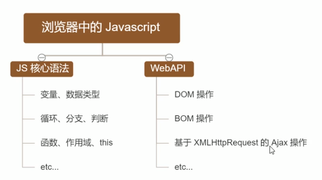

### 浏览器的组成部分

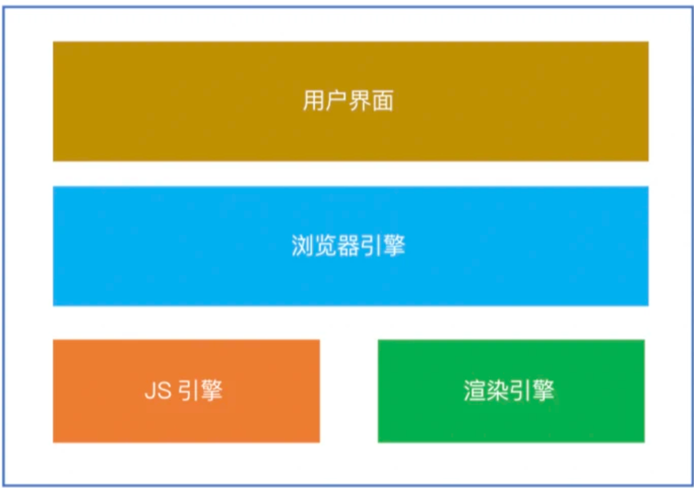

**浏览器引擎**：

- 负责在用户界面和渲染引擎之间传送指令
- 在客户端本地缓存中读写数据
- 是浏览器中各个部分之间相互通信的核心

**渲染引擎**：负责解析 html 和 css

**js 引擎**：负责解析 javascript 代码

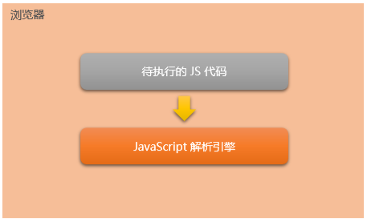

不同的浏览器使用不同的**JavaScript 引擎**：

- Chrome 浏览器 => V8
- Firefox 浏览器 => OdinMonkey（奥丁猴）
- Safri 浏览器 => JSCore
- IE 浏览器 => Chakra（查克拉）
- 其中，Chrome 浏览器的 V8 解析引擎性能最好！

不同的浏览器使用不同的**渲染引擎**：

- Chrome 浏览器 => webkit, blink
- Firefox 浏览器 => Gecko
- Safri 浏览器 => webkit
- IE 浏览器 => Trident

> 联想记忆: JS 引擎 类比 车的发动机；渲染引擎 类比 车的车载系统

### 为什么 JS 可以操作"网页内容"和"浏览器功能"?

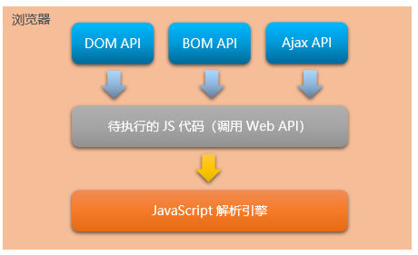

每个浏览器都内置了 DOM、BOM 这样的 API

因此，浏览器中的 JavaScript 才可以调用它们。

**浏览器中的 JavaScript 运行环境**

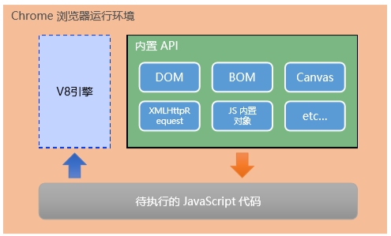

总结：

- 运行环境指的是代码正常运行所需的必要环境。
- 浏览器是 javascript 的运行环境。

> 思考: 是不是只要一个软件的运行环境中有 JS 引擎, 就可以执行 JS 代码?

## 3.3 nodejs 简介

### 什么是 nodejs?

Node.js® is a JavaScript runtime built on Chrome's V8 JavaScript engine.

Node.js 是一个基于 Chrome V8 引擎的 JavaScript 运行环境。

通俗的理解：Node.js 为 JavaScript 代码的正常运行，提供的必要的环境。

Node.js 的官网地址： https://nodejs.org/zh-cn/

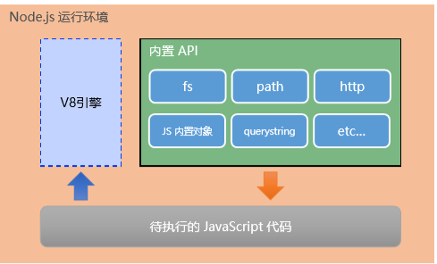

注意：

① 浏览器是 JavaScript 的前端运行环境。

② Node.js 是 JavaScript 的后端运行环境。

③ Node.js 中无法调用 DOM 和 BOM 等 浏览器内置 API。

### nodejs 与浏览器的区别?

相同点：nodejs 与浏览器都是 javascript 的运行环境，都能够解析 js 程序。

不同点：nodejs 无法使用 DOM 和 BOM 的操作，浏览器无法执行 nodejs 中的文件操作等功能

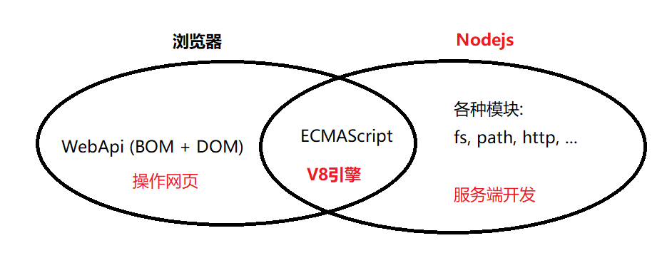

**问题小结：**

1. 在浏览器端，可以使用 javascript 操作文件么？

2. 在 nodejs 端，可以使用 BOM 和 DOM 的方法么？

3. 我们学习 nodejs，学习什么内容？

### Node.js 可以做什么?

Node.js 作为一个 JavaScript 的运行环境，仅仅提供了基础的功能和 API。

然而，基于 Node.js 提供的这些基础能，很多强大的工具和框架如雨后春笋，层出不穷。

所以学会了 Node.js ，可以让前端程序员胜任更多的工作和岗位：

① 基于 Express/Koa/Egg 等框架（http://www.expressjs.com.cn/），可以快速构建Web 应用

② 基于 Electron 框架（https://electronjs.org/），可以构建跨平台的桌面应用

③ 基于 restify 框架（http://restify.com/），可以快速构建API 接口项目

④ 读写和操作数据库、创建实用的命令行工具辅助前端开发、etc…

总之：

Node.js 是大前端时代的“**大宝剑**”，有了 Node.js 这个超级 **buff** 的加持，前端程序员的行业竞争力会越来越强！

### Node.js 怎么学?

浏览器中的 JavaScript 学习路径：
JavaScript 基础语法 + 浏览器内置 API（DOM + BOM） + 第三方库（Echarts、AntD 等）

Node.js 的学习路径：
JavaScript 基础语法 + **Node.js 内置 API 模块（fs、path、http 等）**+ 第三方框架（Express、Electron 等）

# 4. nodejs 环境的安装

如果希望通过 Node.js 来运行 Javascript 代码，则必须在计算机上安装 Node.js 环境才行。

安装包可以从 Node.js 的官网首页直接下载，进入到 Node.js 的官网首页（https://nodejs.org/zh-cn/），点 击绿色的按钮，下载所需的版本后，双击直接安装即可。

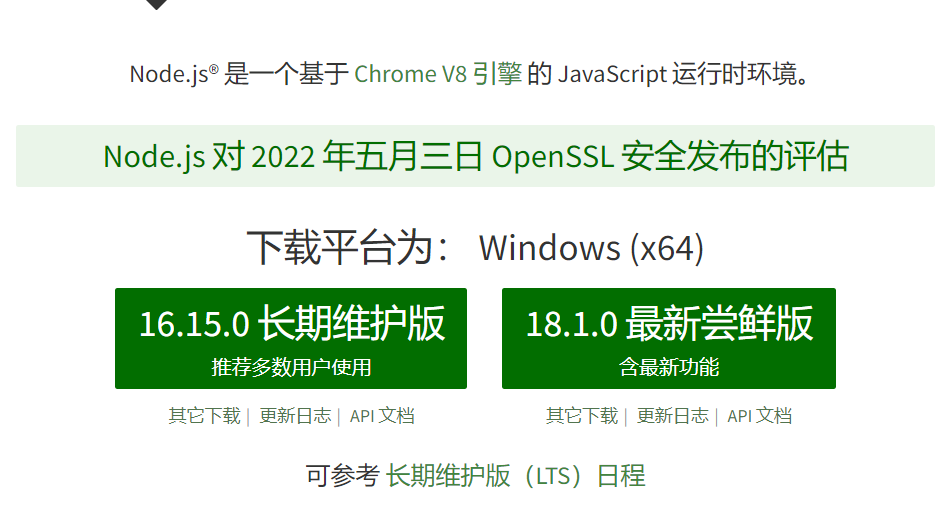

## 4.1 版本说明

- LTS 为长期稳定版，对于追求稳定性的企业级项目来说，推荐安装 LTS 版本的 Node.js。
- Current 为新特性尝鲜版，对于热衷于尝试新特性的用户来说，推荐安装 Current 版本的 Node.js。但是，Current 版本 中可能存在隐藏的 Bug 或安全性漏洞，因此不推荐在企业级项目中使用 Current 版本的 Node.js。

## 4.2 安装 nodejs

### windows 安装步骤

打开终端测试

使用快捷键（Windows 徽标键+ R）打开运行面板，输入 cmd 后直接回车，即可打开终端。

### mac 安装步骤

1. 选择安装包

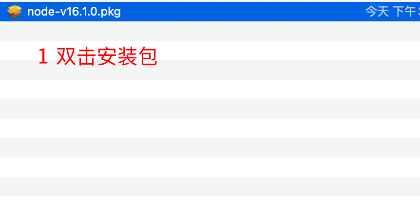

2. 如图

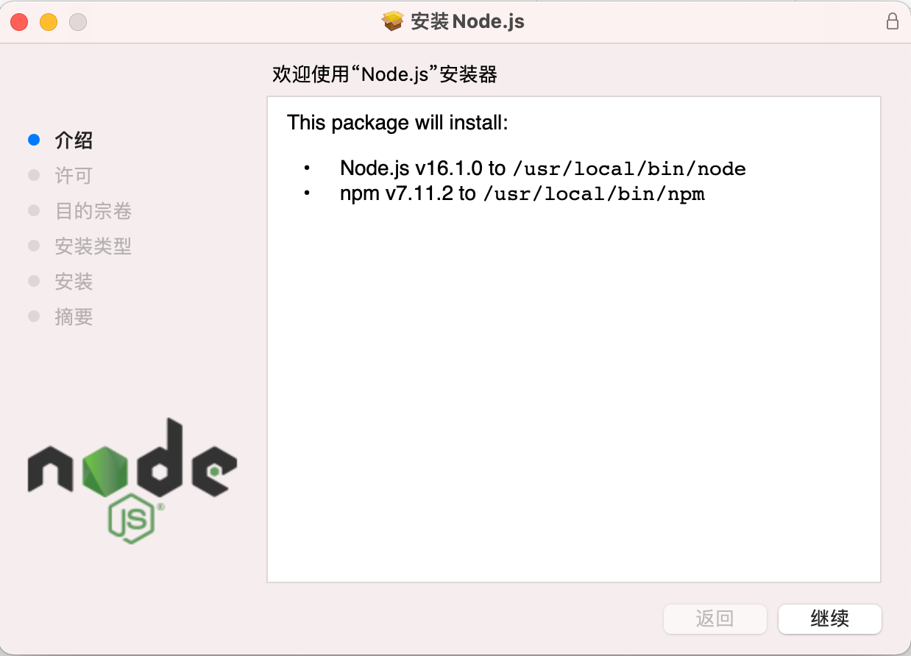

3. 点击继续

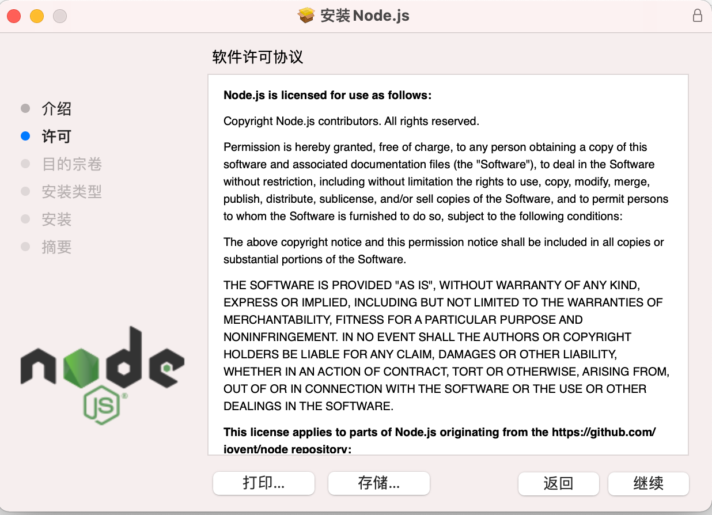

4. 点击继续

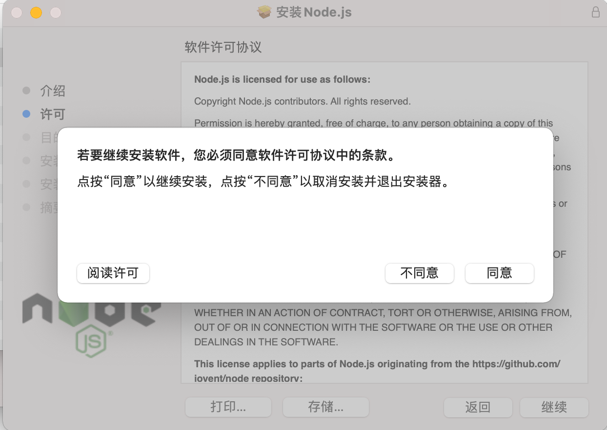

5. 点击同意

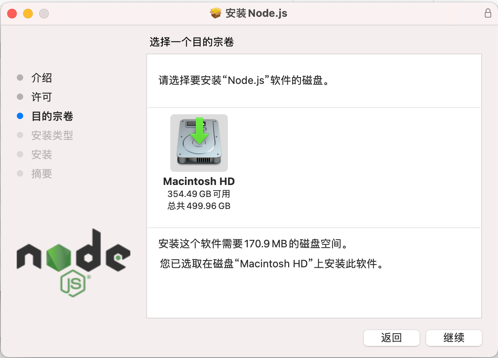

6. 点击继续

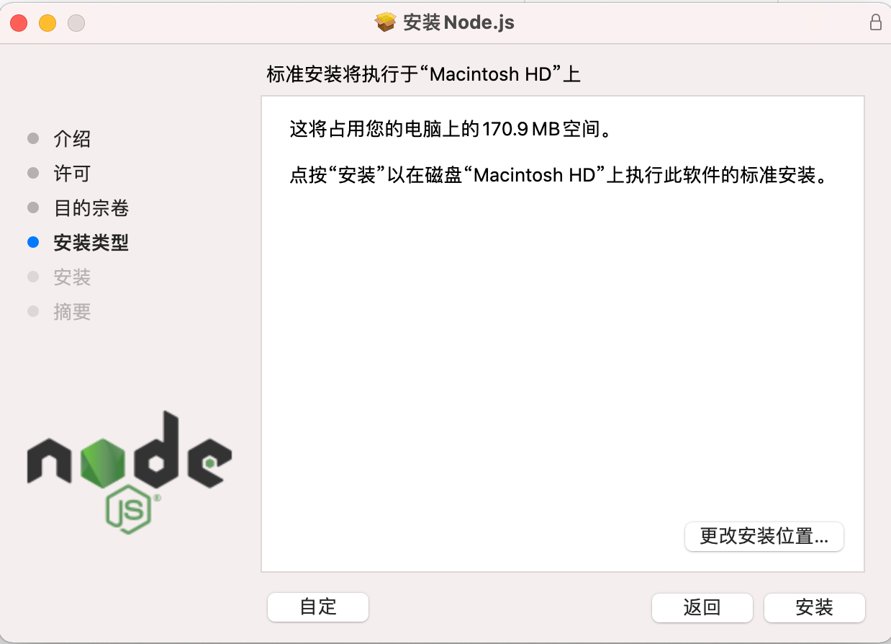

7. 点击安装

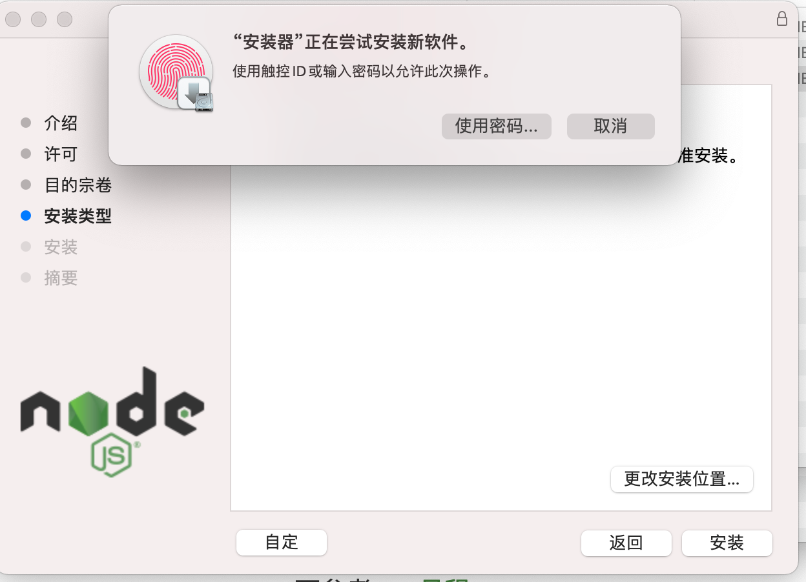

8. 使用指纹或者输入密码进行安装

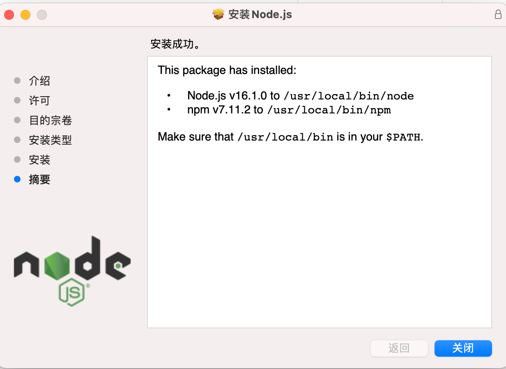

能够看到如图，说明安装成功了。

9. 打开终端测试 node 是否安装成功

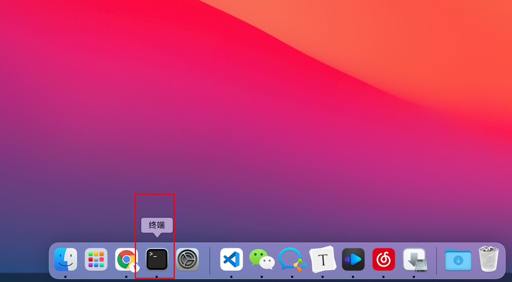

10. 输入`node -v`查看 node 安装的版本

    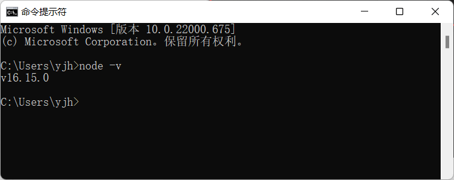

> 测试是否安装成功

打开终端，在终端输入命令 node –v 后，按下回车键，即可查看已安装的 Node.js 的版本号。

## 4.3 终端的使用

终端（英文：Terminal）是专门为开发人员设计的，用 于实现人机交互的一种方式。

nodejs 和普通的程序运行不一样，需要在终端中使用 node 命令来使用。

windows 终端和 mac 电脑的终端打开方式稍微有些不同。

### windows 打开终端的方式

1. window + R: cmd powershell 默认在 C 盘的用户目录打开
2. 在任意的文件夹下，按住 shift 键，使用鼠标右键 （好处：可以在任意的文件夹下打开命令窗口）

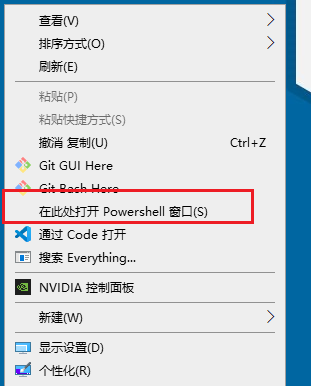

3. 使用 vscode 集成的终端，在 js 文件或者在文件夹上右键

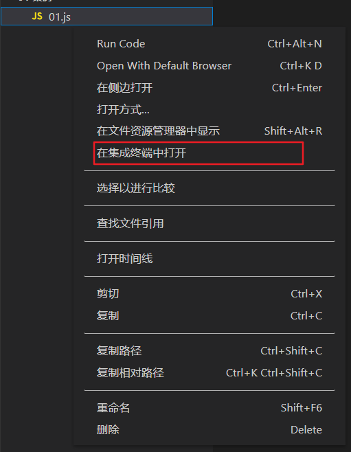

`shift + Escape`

### mac 打开终端的方式

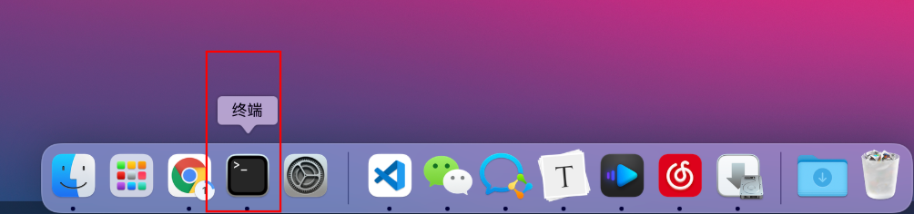

2. 在文件夹上右键，可以打开当前文件夹的终端

3. 在 vscode 中使用

## 4.4 终端常见操作

终端命令

- ls =》 list 查看 ，查看当前文件夹下所有的目录列表
- cd =》 切换到某个文件夹下， change directory
- cd ../ =》退回上级文件夹
- clear 清屏
- esc 清除当前这一行

常用快捷键

在 Windows 的命令行中，我们可以通过如下快捷键，来提高命令行的操作效率：
① 使用 ↑ 键，可以快速定位到上一次执行的命令
② 使用 tab 键，能够快速补全路径
③ 使用 esc 键，能够快速清空当前已输入的命令

# 5. nodejs 基本使用

在 Node.js 中需要通过终端才能执行 JavaScript 代码

① 打开终端

② 输入 node 要执行的 js 文件的路径，即可通过 Node.js，来执行存放于.js 文件中的代码

- 创建 js 文件 `helloNode.js`

- 写 nodejs 的内容：`console.log('hello nodejs')`

- 打开终端

- 执行命令：`node helloNode.js`

> 注意：在 nodejs 中是无法使用 DOM 和 BOM 的内容的，因此`document, window`等内容是无法使用的。
