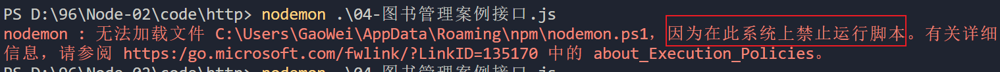
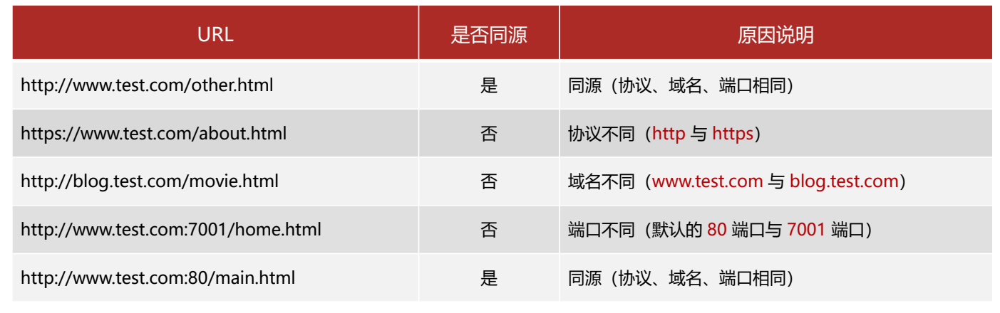
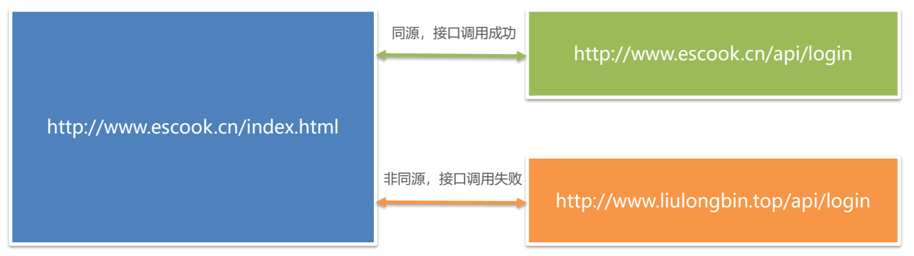
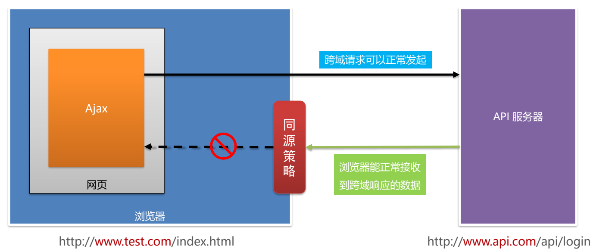
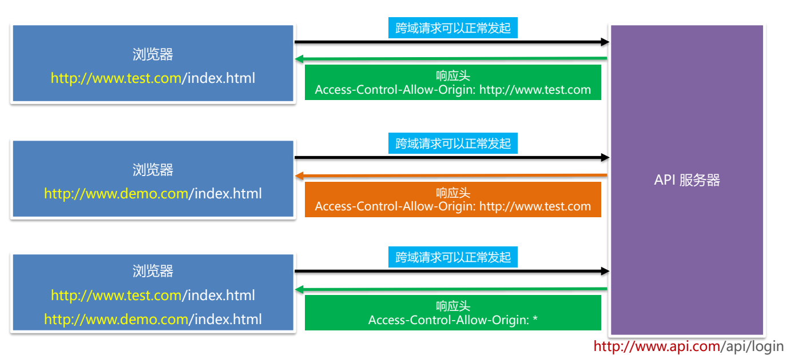

# 1. 模块化

`问题: 当一个文件的js代码越来越多的时候,会出现什么问题?`

## 1.1 什么是模块化

> 一个模块其实指的就是一个独立的 js 文件

**模块化**是指解决一个复杂问题时，自顶向下逐层把系统划分成若干模块的过程。 对于整个系统来说，模块是可组合、分解和更换的单元。

### 编程中的模块化

编程领域中的模块化，就是**遵守固定的规则**，把一个大文件拆成独立并互相依赖的多个小模块。

把代码进行模块化拆分的好处:

- 提高了代码的复用性
- 提高了代码的可维护性
- 可以实现按需加载

## 1.2 模块化规范

**模块化规范**就是对代码进行模块化的拆分与组合时，需要遵守的那些规则。

例如:

- 使用什么样的语法格式来引用模块 比如: require('fs')
- 在模块中使用什么样的语法格式向外暴露成员 (目前没有学习，马上学习)

**模块化规范的好处**:

1. 大家都遵守同样的模块化规范写代码，降低了沟通的成本
2. 极大方便了各个模块之间的相互调用， 利人利己

> **我们自己写模块，也要遵守模块化的标准**。

## 1.3 了解 CommonJS 规范

> 早期, js 没有模块化规范, js 越来越火, 想要用 js 开发大型项目, 必须要有模块化的规范。
>
> 民间出现了大量的 js 的模块化规范
>
> --------最终演变成----------
>
> 浏览器端的模块化规范
>
> 服务端的模块化规范

模块化规范的种类：

- AMD 浏览器端（国外 - 代表：requirejs）
- CMD 浏览器端（国内 - 代表：seajs）
- CommonJS 服务器端 (代表: nodejs)
- ES6 大一统, 将来浏览器和服务器端统一的模块化语法标准

Node.js 遵循了 CommonJS 模块化规范，CommonJS 规定了模块的特性和各模块之间如何相互依赖。

## 1.4 Node.js 中模块的分类

Node.js 中根据模块来源的不同，将模块分为了 3 大类，分别是:

- 内置模块(内置模块是由 Node.js 官方提供的，例如 fs、path、http 等)

- 自定义模块(用户创建的每个 `.js` 文件，都是自定义模块)

- 第三方模块(由第三方开发出来的模块，并非官方提供的内置模块，也不是用户创建的自定义模块，使用前需要先下载)

## 1.5 加载模块

```js
// 加载核心模块
const fs = require("fs")

// 加载第三方模块
const express = require("express")

// 加载自定义模块
const custom = require("./custom")
```

**注意事项**：

- 无论是什么模块，我们都要使用 `require()` 去加载，然后才能使用。
- 加载自定义的模块，需要加 `./` ，而且可以省略后缀 `.js`

## 1.6 自定义模块的实现（重点）

### Node.js 中的模块作用域

在 Node.js 中，用户创建的每个 `.js` 文件都是自定义模块。 在自定义模块中定义的变量、方法等成员，只能在当前模块内被访问，这种模块级别的访问限制，叫做**模块作用域**。

> 模块作用域的好处是避免了全局变量污染。

由于模块具有一个模块级别的作用域，则另一个 JS 文件就无法使用当前模块定义的内容，如下图所示。


CommonJS 规定:

1. 每个模块内部，`module` 变量代表当前模块。

2. module 变量是一个对象，它的 `exports` 属性(即 module.exports)是对外的接口。

3. 加载某个模块，其实是加载该模块的 `module.exports` 属性。require() 方法用于加载模块。

### 导出导入模块

为了能正常使用加载的模块中的成员，CommonJS 给出了标准，即

- 一个模块需要使用 `module.exports` 导出需要共享的内容。
- 使用模块的 JS 文件需要使用 `require()` 导入模块。


> 模块导出的是什么，另一个使用模块的 JS 文件得到的就是什么。

## 1.7 require()加载模块的机制

加载自定义模块和其他模块的机制有相同之处，也有不同之处，所以这里分开来看。

### 加载自定义模块

1. 首次加载成功，会缓存模块
2. 下次从缓存中加载，速度更快
3. 加载自定义模块必须加 `./` ，如果是其他路径，对应变化，否则会把它当做核心模块或者第三方模块
4. 加载自定义模块的时候，如果是 `require('./abc')`
   1. 优先加载相同名字的文件，加载一个叫做 abc 的文件
   2. 自动补 `.js` 后缀，然后加载 `abc.js` 文件
   3. 自动补 `.json` 后缀，然后加载 `abc.json` 文件
   4. 自动补 `.node` 后缀，然后加载 `abc.node` 文件
   5. 以上文件都没有，则报错 `Cannot find module './abc'`

### 加载核心模块和第三方模块

1. 首次加载成功，会缓存模块

2. 下次从缓存中加载，速度更快

3. 加载模块一定`不能`加 `./` ，否则会把它当做自定义模块

4. 加载模块的时候，如果是 `require('haha')`

   1. 优先加载核心模块

   2. 去查找并加载第三方模块，查找第三方模块的路径可以通过 `module.paths` 查看

      [

      'C:\\Users\\yjh\\Desktop\\99-框架前置课\\day2\\04-案例\\01-模块化\\03-自定义模块加载细节\\node_modules',
      'C:\\Users\\yjh\\Desktop\\99-框架前置课\\day2\\04-案例\\01-模块化\\node_modules',
      'C:\\Users\\yjh\\Desktop\\99-框架前置课\\day2\\04-案例\\node_modules',
      'C:\\Users\\yjh\\Desktop\\99-框架前置课\\day2\\node_modules',
      'C:\\Users\\yjh\\Desktop\\99-框架前置课\\node_modules',
      'C:\\Users\\yjh\\Desktop\\node_modules',
      'C:\\Users\\yjh\\node_modules',
      'C:\\Users\\node_modules',
      'C:\\node_modules'

      ]

   3. 加载第三方模块会从当前目录开始寻找 node_modules 文件夹， 如果找到进入 node_modules 文件夹寻找对应的模块。如果没找到，进入上一级目录继续寻找 node_modules，一直到根目录。如果一直没有找到，提示未找到模块。

# 2. npm 初步使用

## 2.1 介绍

npm（node package manager）node 包管理器。

包是什么？包就是模块。

npm 这个工具，在安装 node 的时候，就已经安装到你的计算机中了。

命令行中执行： `npm -v` ，如果看到版本号，说明安装成功了。

npm 中文网: https://www.npmjs.com.cn/

## 2.2 作用

npm 的作用是：管理 node 模块的工具。

- 下载并安装第三方的模块
- 卸载第三方模块
- ....

第三方模块：

- 非内置模块，安装完 node，还不能使用的模块，需要从网上下载安装，才能使用的模块
- 第三方模块是个人、公司、组织编写的模块，发布到网上，供我们使用

> npm 就是一个管理（下载安装、卸载...）第三方模块的工具

## 2.3 初始化

使用 npm 工具之前，必须先初始化。

```bash
npm init -y
# 或
npm init
# 然后一路回车
```

初始化之后，会在项目目录中生成 package.json 的文件。

## 2.4 什么第三方模块

非 node 自带的模块。

是别人写的模块，然后发布到 npm 网站，我们可以使用 npm 工具来下载安装别人写的模块。

第三方模块，都是在 node 核心模块的基础之上，封装了一下，实现了很多非常方便快速简洁的方法。

目前，npm 网站收录了超过 150 万个第三方模块。

## 2.5 安装卸载项目模块

下载安装第三方模块

```bash
npm install 模块名
npm i 模块名
```

卸载模块

```bash
npm uninstall 模块名
npm un 模块名
```

## 2.6 关于项目模块的说明

- 下载安装的模块，存放在当前文件夹的 `node_modules` 文件夹中，同时还会生成一个记录下载的文件 `package-lock.json`
- 下载的模块，在哪里可以使用
  - 在当前文件夹
  - 在当前文件夹的子文件夹
  - 在当前文件夹的子文件夹的子文件夹
  - ......
- 怎样使用第三方模块
  - 和使用内置模块一样，需要使用 `require` 加载模块
  - 调用模块提供的方法完成工作（一般好的模块都会用使用文档的）

## 2.7 演示下载安装第三方模块

这里演示一个处理时间日期的模块 -- moment

http://momentjs.cn/

下载安装 moment 模块

```bash
npm init -y
npm i moment
```

演示使用 moment 模块处理时间

```js
// 加载模块
const moment = require("moment")

console.log(moment().format("YYYY-MM-DD hh:mm:ss"))
// 官网：http://momentjs.cn
```

## 2.8 dependencies 说明

1、作用：保存依赖包的记录。

2、以后如果看到我们项目中 没有 node_modules 目录， 但是有 package.json。说明我们项目是完整的。执行 npm i 会找 package.json 里面的 dependencies， 并且安装里面的所有依赖包

3、执行 npm i 命令 要在 package.json 同级目录。

## 2.9 全局模块

- 全局安装的模块，不能通过 `require()` 加载使用。

- 全局安装的模块，一般都是命令或者工具。

- 安装方法，在安装模块的命令后面，加 `-g`

  ```bash
  npm i 模块名 -g
  # 或
  npm i -g 模块名
  ```

- 查看全局安装的模块

  ```bash
  npm list -g --depth 0
  ```

- 卸载方法（也是多一个 `-g`）

  ```bash
  npm un 模块名 -g
  ```

- 全局安装的模块，在系统盘（C 盘）

  - 通过命令 `npm root -g` 可以查看全局安装路径

> mac 安装过程可能出现权限问题，可以使用 sudo npm i xxx -g

## 2.10 全局安装 nodemon 模块

- 安装命令

  ```bash
  npm i nodemon -g
  ```

- nodemon 的作用：

- 代替 node 命令，启动服务的，当更改代码之后，nodemon 会自动帮我们重启服务。

- 运行 nodemon，如果报错如下：



- 解决办法是：
  - `管理员`方式，打开命令行窗口
  - 执行 `set-ExecutionPolicy RemoteSigned;`
  - 在出现的选项中，输入 `A`，回车。即可

## 2.11 本地安装和全局安装区别

有两种方式用来安装 npm 包：本地安装和全局安装。选用哪种方式来安装，取决于你如何使用这个包。

1. 本地安装

- 说明 : 想把我们用的包,安装到当前本地项目中使用
- 比如 : npm i jquery , npm i moment
- 要求 : 执行的安装命令(npm i moment) 位置,必须在当前项目下执行
- 包位置 : 本地安装的包 => 当前项目下的 node_modules
- 使用包 : `const moment = require('moment')  , const $ = require('jquery')`

2. 全局安装

- 说明 : 想把一个包/库,当成一个`工具`来使用, 就采用全局安装

- 比如 : `npm i  -g live-server `

- 要求 : 可以在任意地方, 都可以执行命令

- 包位置 : `C:\Users\用户名\AppData\Roaming\npm`

- 使用包 : 在`终端命令行`里使用, 不能在代码里

## 2.12 更改镜像源

镜像源，就是下载安装第三方模块的网站。

我们下载的第三方模块都是从国外的 npm 主站下载的，速度比较慢。

淘宝在国内对 npm 上的第三方模块做了一个备份，也就是说，我们可以从国内下载第三方模块。

除了淘宝之外，还有很多其他镜像源。

简单的更改镜像源方法：

- 全局安装 nrm 的模块
  - nrm 用于管理镜像源
- 使用 nrm
  - `nrm ls` 通过这个命令，可以查看可用的镜像源
  - `nrm use taobao` ，切换下载模块的网站为淘宝

https://www.jianshu.com/p/90893d947432

# 3. 同源&跨域

## 3.1 什么是同源?

同源指的是两个 URL 地址具有相同的协议地址、主机名、端口号。

例如，下表给出了相对于 http://www.test.com/index.html 页面的 5 个同源检测结果：



## 3.2 什么是同源策略?

同源策略（英文全称 Same origin policy）是浏览器提供的一个安全功能。
浏览器的同源策略规定：不允许非同源的 URL 之间进行资源的交互。



> 请大家思考：如果没有浏览器，还会有同源策略吗？
> A. 有
> B. 没有

## 3.3 什么是跨域?

同源指的是两个 URL 的协议、主机名、端口号完全一致，反之，则是跨域。

出现跨域的根本原因：浏览器的同源策略不允许非同源的 URL 之间进行资源的交互。例如：

- 网页：http://www.test.com/index.html
- 接口：http://www.api.com/userlist
- 受到同源策略的限制，上面的网页请求下面的接口会失败！

### 3.3.1 浏览器对跨域请求的拦截过程?

浏览器允许发起跨域请求。但跨域请求回来的数据，会被浏览器拦截，无法被页面获取到！示意图如下：



### 3.3.2 突破浏览器跨域限制的两种方案?

代理服务器 和 CORS 是实现跨域数据请求的两种技术方案。

> 注意：
>
> 1. 代理服务器跨域在后面 vue 课程中会讲到
>
> 2. CORS 是跨域的主流技术解决方案

#### CORS 的概念

1. CORS 是解决跨域数据请求的终极解决方案，全称是 Cross-origin resource sharing。

2. CORS 技术需要浏览器和服务器同时支持，二者缺一不可：

- 浏览器要支持 CORS 功能（主流的浏览器全部支持，IE 不能低于 IE10）
- 服务器要开启 CORS 功能（需要后端开发者为接口开启 CORS 功能）

> 请大家思考：实现 CORS 的关键，是在客户端还是在服务器端？
>
> 答案：服务器端。
> 原因：如果服务器端没有开启 CORS 功能，则客户端无法访问那些跨域的接口！

#### CORS 的原理

服务器端通过 Access-Control-Allow-Origin 响应头，来告诉浏览器当前的 API 接口是否允许跨域请求。



#### CORS 的两个主要优势

1. CORS 是真正的 Ajax 请求，支持 GET、POST、DELETE、PUT、PATCH 等这些常见的 Ajax 请求方式
2. 只需要后端开启 CORS 功能即可，前端的代码无须做任何改动

> 注意：
>
> 我们之前做过的案例中，所有调用的接口均已在服务器端开启了 CORS 功能！
> 例如：聊天机器人案例、新闻列表案例、用户登录案例
