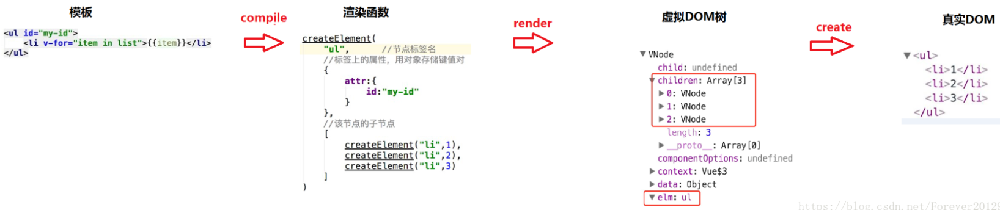

## 插件

## 修饰符

https://cn.vuejs.org/guide/essentials/event-handling.html#event-modifiers

## scoped

## 组件通信

## 组件的命名规范

一种是使用链式命名"my-component"，一种是使用大驼峰命名"MyComponent"

## v-show 和 v-if 的区别

https://cn.vuejs.org/guide/essentials/conditional.html#v-if-vs-v-show

## 为什么避免 v-for 和 v-if 在一起使用

https://cn.vuejs.org/guide/essentials/list.html#v-for-with-v-if

## 单向数据流

在 vue 中需要遵循单向数据流原则 1. 父组件的数据发生了改变，子组件会自动跟着变 2. 子组件不能直接修改父组件传递过来的 props props 是只读的

## nextTick

vue 数据更新后，dom 不会立刻发生变化。nextTick 会等组件的 dom 更新后，再执行 callback 回调函数

```vue
<template>
  <div>
    <!-- 自动获取焦点 -->
    <input ref="inp" type="text" v-if="isShowInput" />
    <button @click="fn" v-else>点此搜索</button>
  </div>
</template>

<script>
export default {
  data() {
    return {
      isShowInput: false,
    }
  },
  methods: {
    fn() {
      this.isShowInput = true
      this.$nextTick(() => {
        this.$refs.inp.focus()
      })
    },
  },
}
</script>
```

## data 为什么是一个函数而不是对象

对象是引用数据类型，复用组件时，由于数据都指向同一个 data，当在一个组件中修改 data 时，其它复用组件中的 data 会同时被修改。使用函数返回对象，每次返回的都是一个新对象，则不会出现这个问题。

## MVVM

MVVM 是一种双向数据绑定的模式，通过 ViewModel 建立起 Model 数据层和 View 视图层的连接。数据变化，视图自动更新。视图变化，数据自动更新。

```vue
<templete>
  这里是view视图
</templete>

ViewModel就是vue的核心，底层做好了监听，所以可以双向数据绑定

<script>
export default {
  这里是model数据,
}
</script>
```

## 响应式

```html
<!DOCTYPE html>
<html lang="en">
  <head>
    <meta charset="UTF-8" />
    <meta http-equiv="X-UA-Compatible" content="IE=edge" />
    <meta name="viewport" content="width=device-width, initial-scale=1.0" />
    <title>Document</title>
  </head>
  <body>
    <div id="app">
      <!--  
        现存架构的问题：
        name发生变化后，我需要做的是更新两个p标签，而现在不管我更新了哪个数据，所有的标签都重新操作赋值了，无法做到精准更新
        解决问题的思路：
        1.数据发生变化后最关键的代码是什么
          node.innerHTML = data[nodeValue]
        2.设计一个存储结构，每一个响应式数据可能被多个标签绑定，是一个'一对多'的关系
          {
            name: [() => {node.innerHTML = data[name]}, name: [() => {node.innerHTML = data[name]}, ...]
          }
        3.这种结构就是发布订阅（自定义事件）模式
          优化的思路：
          先前的写法：不管是哪个数据发生变化，都是粗暴的执行一下compile函数
          现在的写法：在compile函数初次执行时，收集更新函数，然后在数据变化时，通过属性名找到与之绑定在一起的所有更新函数进行触发
       -->
      <input type="text" v-model="age" />
      <p v-text="name"></p>
      <p v-text="name"></p>
      <p v-text="sex"></p>
    </div>

    <script>
      // 开发vue项目时，都是提前把数据放在data里，如何把data里的数据变成响应式（get/set形式）
      // 响应式？数据发生变化，可以立刻知道，并做一些想做的事。比如：操作dom、发送ajax请求...
      // 如何实现？vue2通过Object.defineProperty对象属性拦截，vue3通过Proxy对象整体代理
      let data = {
        name: "德华",
        sex: "男",
        age: 18,
      }

      Object.keys(data).forEach(key => {
        observe(data, key, data[key])
      })

      const Dep = {
        map: {},
        collect(eventName, fn) {
          if (!this.map[eventName]) this.map[eventName] = []
          this.map[eventName].push(fn)
        },
        trigger(eventName) {
          this.map[eventName].forEach(fn => fn())
        },
      }

      // observe函数调用完毕，本来内部所有的变量会被回收，但是内部有其它函数使用了当前变量，则形成了闭包，不会被回收
      // 由于闭包的特性，每一个传入下来的value都会常驻内存，目的是为了set/get可以联动
      function observe(data, key, value) {
        Object.defineProperty(data, key, {
          // 当我们访问属性时，会自动调用此方法，并且返回值就是访问的属性值
          get() {
            return value
          },
          // 当我们设置属性时，会自动调用此方法，并且设置的值会被当作实参传入进来
          set(newValue) {
            if (newValue === value) return
            value = newValue
            // 触发
            Dep.trigger(key)
          },
        })
      }

      // 数据变化，反应到视图
      // 通过模版编译找到标记v-xxx的元素，然后把对应的数据通过操作domapi放上去
      function compile() {
        const app = document.querySelector("#app")
        const childNodes = app.childNodes
        childNodes.forEach(node => {
          // 这里拿的是标签节点
          if (node.nodeType === 1) {
            const attrs = node.attributes
            Array.from(attrs).forEach(attr => {
              const nodeValue = attr.nodeValue
              const nodeName = attr.nodeName
              // 数据 -> 视图
              if (nodeName === "v-text") {
                node.innerHTML = data[nodeValue]
                // 收集更新函数，把node.innerHTML = data[nodeValue]这个收集起来
                Dep.collect(nodeValue, () => {
                  node.innerHTML = data[nodeValue]
                })
              }

              // 数据 -> 视图
              if (nodeName === "v-model") {
                node.value = data[nodeValue]
                // 收集更新函数
                Dep.collect(nodeValue, () => {
                  node.value = data[nodeValue]
                })
                // 视图 -> 数据
                // 本质：事件监听，在回调函数中拿到input中输入的最新值，然后赋值给绑定的属性
                node.addEventListener("input", function (e) {
                  let newValue = e.target.value
                  data[nodeValue] = newValue
                })
              }
            })
          }
        })
      }
      compile()
    </script>
  </body>
</html>
```

## 发布订阅（自定义事件）模式

```html
<!DOCTYPE html>
<html lang="en">
  <head>
    <meta charset="UTF-8" />
    <meta http-equiv="X-UA-Compatible" content="IE=edge" />
    <meta name="viewport" content="width=device-width, initial-scale=1.0" />
    <title>Document</title>
  </head>
  <body>
    <button id="btn">点击我</button>

    <script>
      const btn = document.querySelector("#btn")

      // 以下操作不能让两个回调函数都执行，是一对一的关系
      // btn.onclick = function () {
      //   console.log("btn被点击了")
      // }
      // btn.onclick = function () {
      //   console.log("btn又被点击了吗")
      // }

      // 优化：从一对一变成一对多，这种优化就是发布订阅模式
      // 这种模式下可以实现同一个事件对应多个回调函数
      // btn.addEventListener("click", function () {
      //   console.log("btn被点击了")
      // })
      // btn.addEventListener("click", function () {
      //   console.log("btn又被点击了吗")
      // })

      // 浏览器事件模型的实现原理：
      // 浏览器实现了一个方法，叫做addEventListener
      // 这个方法接收两个参数，参数一：事件类型。参数二：回调函数
      // 为了实现一对多，内部大概是这样的。{ click: ['回调函数1', '回调函数2'] }
      // 当鼠标点击时，通过事件类型去数据结构中找到存放所有相关的回调函数的数组然后遍历，都执行一遍，从而实现了一对多

      // 自己实现一个发布订阅模式
      const Dep = {
        map: {},
        // 收集
        collect(eventName, fn) {
          if (!this.map[eventName]) this.map[eventName] = []
          this.map[eventName].push(fn)
        },
        // 触发
        trigger(eventName) {
          this.map[eventName].forEach(fn => fn())
        },
      }
      Dep.collect("ck", () => {
        console.log("收集成功")
      })
      Dep.trigger("ck")
    </script>
  </body>
</html>
```

## 生命周期

组件实例从创建到销毁的整个过程就是生命周期

开始创建（空实例） -> 初始化数据 -> 编译模板 -> 挂载 DOM -> 渲染、更新数据、重新渲染 -> 卸载


## 网络请求在哪个生命周期

如果请求在 methods 中封装好了，在 beforeCreate 调用时，beforeCreate 阶段是拿不到 methods 里的方法的，会报错，所以不可以在 beforeCreate 里

如果我们的业务是父组件引入了子组件，并且优先加载子组件的数据，那么父组件的请求最好放在 mounted 里。如果没有依赖关系，放在 created 或者 mounted 里都可以

## 父组件引入子组件，生命周期执行顺序

```bash
先执行父：beforeCreate created beforeMount
在执行子：beforeCreate created beforeMount mounted
在执行父：mounted
```

## keep-alive

如果使用了 keep-alive 组件，当前的组件会额外增加两个生命周期 activated deactivated，第一次进入当前组件时会执行五个生命周期 beforeCreate created beforeMount mounted activated，下次再次进入这个组件时，只会执行 activated 这一个生命周期。

## 使用异步组件有什么好处

所谓的异步组件就是通过 import 或者 require 导入的 vue 组件

vue 开发过程中，我们会做出特别多的组件，包括 login header footer main 等等，会使页面打开很慢

可以避免页面一加载时就去加载全部的组件，从而导致页面访问时间变长的问题。使用异步加载组件后，只有当需要某个组件时才会去加载需要的组件

## 什么是组件

组件就是一个可以复用的普通 js 对象

## Vue 中的 key 作用

v-for 数组变化（增加一项/删除一项）会更新页面，内存中创建虚拟 dom，快速比较新旧变化，给真实 dom 打补丁。

什么是虚拟 DOM？用普通的 js 对象来描述 DOM 对象。

为什么使用虚拟 DOM？因为真实 DOM 对象中的成员非常多，创建 DOM 对象的成本非常高。

key 就是给 虚拟 dom 添加了一个 标识, 优化了对比策略，提升性能

vue 对比新旧虚拟 dom，找出不同的部分，进行更新视图

虚拟 dom 的思想：先控制数据再到视图，数据状态是通过 diff 比对，它会比对新旧虚拟 dom 节点，然后找出两者不同，再把不同的节点再发生渲染操作

## 如何处理项目(首屏)加载过慢的问题

SPA 单页面应用：所有的功能，都在一个页面中，单页面跳转就是切换组件，仅刷新局部资源，公共资源（js、html、css 等）仅需要加载一次。

加载过慢主要原因：一次性加载了过多的资源，一次性加载了过大的资源

- 加载过多：路由懒加载，访问到路由，再加载该路由相关的组件内容
- 加载过大：图片压缩、文件压缩合并处理、开启 gzip 压缩等

比如：

1. 配置异步组件，路由懒加载。const login = () => import("../pages/login.vue")

2. 图片压缩：使用 webp 格式的图片，提升首页加载的速度
3. CDN 加速：配置 CDN 加速（公司的地址和用户使用的地方太远了），加快资源的加载效率 (花钱)
4. 开启 gzip 压缩 (一般默认服务器开启的，如果没开，确实可能会很慢，可以让后台开一下)

5. 使用 v-if 代替 v-show


https://www.cnblogs.com/xidian-Jingbin/p/10643391.html

## Vue 为什么采用异步渲染呢

`Vue` 是组件级更新，如果不采用异步更新，那么每次更新数据都会对当前组件进行重新渲染，所以为了性能，`Vue` 会在本轮数据更新后，在异步更新视图。核心思想`nextTick`

## 数组更新有时 v-for 不渲染

```vue
<template>
  <div>
    <ul>
      <li v-for="(val, index) in arr" :key="index">
        {{ val }}
      </li>
    </ul>
    <button @click="revBtn">数组翻转</button>
    <button @click="sliceBtn">截取前3个</button>
    <button @click="updateBtn">更新第一个元素值</button>
  </div>
</template>

<script>
export default {
  data() {
    return {
      arr: [5, 3, 9, 2, 1],
    }
  },
  methods: {
    revBtn() {
      // 1. 数组翻转可以让v-for更新
      this.arr.reverse()
    },
    sliceBtn() {
      // 数组slice方法不会造成v-for更新
      // slice不会改变原始数组
      // this.arr.slice(0, 3)
      // 解决办法：覆盖原始数组
      let newArr = this.arr.slice(0, 3)
      this.arr = newArr
    },
    updateBtn() {
      // this.arr[0] = 1000
      // 更新某个值时, v-for监测不到
      // 解决办法：this.$set()
      // 参数1: 更新目标结构。参数2: 更新位置。参数3: 更新值
      this.$set(this.arr, 0, 1000)
    },
  },
}
</script>
```

如果需要请使用 this.$set()或者覆盖整个数组

## 动态给 vue 的 data 添加一个新的属性时会发生什么

1. `vue2`是通过`Object.defineProperty`实现数据响应式
2. 当我们访问定义的属性或者修改属性值的时候都能够触发`setter`与`getter`
3. 但是我们为`obj`添加新属性的时候，却无法触发事件属性的拦截
4. 原因是一开始`obj`的要定义的属性被设成了响应式数据，而`新增的属性`并没有通过`Object.defineProperty`设置成响应式数据

解决方案：

Vue.set()

- 通过`Vue.set`向响应式对象中添加一个`property`，并确保这个新 `property`同样是响应式的，且触发视图更新

## data 中某一个属性的值发生改变后 视图会立即同步执行重新渲染吗

**不会立即同步执行重新渲染**。Vue 实现响应式并不是数据发生变化之后 DOM 立即变化，而是按一定的策略进行 DOM 的更新。Vue 在更新 DOM 时是`异步`执行的。只要侦听到数据变化， Vue 将开启一个队列，并缓冲在同一事件循环中发生的所有数据变更。

如果同一个 watcher 被多次触发，只会被推入到队列中一次。这种在缓冲时去除重复数据对于避免不必要的计算和 DOM 操作是非常重要的。然后，在下一个的事件循环 tick 中，Vue 刷新队列并执行实际（已去重的）工作。

vue 在检测到你的数据发生变化时，将开启一个异步更新队列，通过 diff 算法找出实际需要更新的 dom 元素，需要等队列中所有数据变化完成之后，才统一进行实际 dom 更新。

## assets 和 static

- **相同点：** `assets` 和 `static` 两个都是存放静态资源文件。项目中所需要的资源文件图片，字体图标，样式文件等都可以放在这两个文件下，这是相同点
- **不相同点：** `assets` 中存放的静态资源文件在项目打包时，也就是运行 `npm run build` 时会将 `assets` 中放置的静态资源文件进行打包上传，所谓打包简单点可以理解为压缩体积，代码格式化。而压缩后的静态资源文件最终也都会放置在 `static` 文件中跟着 `index.html` 一同上传至服务器。`static` 中放置的静态资源文件就不会要走打包压缩格式化等流程，而是直接进入打包好的目录，直接上传至服务器。因为避免了压缩直接进行上传，在打包时会提高一定的效率，但是 `static` 中的资源文件由于没有进行压缩等操作，所以文件的体积也就相对于 `assets` 中打包后的文件提交较大点。在服务器中就会占据更大的空间。
- **建议：** 将项目中 `template`需要的样式文件 js 文件等都可以放置在 `assets` 中，走打包这一流程。减少体积。而项目中引入的第三方的资源文件如`iconfoont.css` 等文件可以放置在 `static` 中，因为这些引入的第三方文件已经经过处理，不再需要处理，直接上传。

## template 模版编译原理

模版编译：template无法被浏览器解析渲染，不是html语法，需要将template转成js函数，这样浏览器可以执行js函数，渲染出对应的html元素



## 函数式组件

# 性能优化

加载优化

```bash
1.看下可不可以减少http请求
2.link标签css的引入，一般放在head中
3.script标签位置，放在body底部或者使用defer/async
```

图片优化（浏览器第一次请求会发网络，下次请求会走缓存）

- 使用精灵/雪碧图：多个小图标，包含到一张大图里，可以减少http请求。缺点：图片放大会失真。目前其他主流处理图片的方案：iconfont字体图标，svg矢量图（将用到的svg图，收集到svg精灵图中）
- 如果浏览器兼容尽量使用webp格式的图片
- 图片懒加载/按需加载。图片的加载是由src引起的，当对src赋值时，浏览器就会请求图片资源
- 图片gzip压缩（一般默认服务器开启的，如果没开，确实可能会很慢，可以让后台开一下）

首屏优化

```bash
1.后台一次性给我1000条数据，我该怎么办？首先1000条数据不可能一次性全部加载，我可以等用户触底的时候再去加载，分页
```


## CND

### CDN 的概念

CDN（Content Delivery Network，**内容分发网络**）**是指一种通过互联网互相连接的电脑网络系统**，利用最靠近每位用户的服务器，更快、更可靠地将音乐、图片、视频、应用程序及其他文件发送给用户，来提供高性能、可扩展性及低成本的网络内容传递给用户。

### CDN 的作用

CDN 一般会用来托管 Web 资源（包括文本、图片和脚本等），可供下载的资源（媒体文件、软件、文档等），应用程序（门户网站等）。**使用 CDN 来加速这些资源的访问。**

### CDN 的使用场景

**使用第三方的 CDN 服务：** 如果想要开源一些项目，可以使用第三方的 CDN 服务

**使用 CDN 进行静态资源的缓存：** 将自己网站的静态资源放在 CDN 上，比如 js、css、图片等。可以将整个项目放在 CDN 上，完成一键部署。

**直播传送：** 直播本质上是使用流媒体进行传送，CDN 也是支持流媒体传送的，所以直播完全可以使用 CDN 来提高访问速度。CDN 在处理流媒体的时候与处理普通静态文件有所不同，普通文件如果在边缘节点没有找到的话，就会去上一层接着寻找，但是流媒体本身数据量就非常大，如果使用回源的方式，必然会带来性能问题，所以流媒体一般采用的都是主动推送的方式来进行。

## 什么是懒加载(图片)

### 懒加载的概念

懒加载也叫做延迟加载、按需加载，指的是在长网页中延迟加载图片数据，是一种较好的网页性能优化的方式。在比较长的网页或应用中，如果图片很多，所有的图片都被加载出来，而用户只能看到可视窗口的那一部分图片数据，这样就浪费了性能。

如果使用图片的懒加载就可以解决以上问题。在滚动屏幕之前，可视化区域之外的图片不会进行加载，在滚动屏幕时才加载。这样使得网页的加载速度更快，减少了服务器的负载。懒加载适用于图片较多，页面列表较长（长列表）的场景中。

### 懒加载的特点

**减少无用资源的加载**：使用懒加载明显减少了服务器的压力和流量，同时也减小了浏览器的负担。

**提升用户体验**: 如果同时加载较多图片，可能需要等待的时间较长，这样影响了用户体验，而使用懒加载就能大大的提高用户体验。

**防止加载过多图片而影响其他资源文件的加载** ：会影响网站应用的正常使用。

### 懒加载的实现原理

图片的加载是由`src`引起的，当对`src`赋值时，浏览器就会请求图片资源。根据这个原理，我们使用 HTML5 的`data-xxx`属性来储存图片的路径，在需要加载图片的时候，将`data-xxx`中图片的路径赋值给`src`，这样就实现了图片的按需加载，即懒加载。

注意：`data-xxx` 中的`xxx`可以自定义，这里我们使用`data-src`来定义。

懒加载的实现重点在于确定用户需要加载哪张图片，在浏览器中，可视区域内的资源就是用户需要的资源。所以当图片出现在可视区域时，获取图片的真实地址并赋值给图片即可。

#### Vue3 实现图片懒加载

导入 vueuse 插件，使用 vueuse 封装的 useIntersectionObserver 监听对应的 DOM 元素，通过里面的 isIntersecting 属性的布尔值判断来设置 img 的 src

可以封装一个 v-lazy 的自定义指令来控制 img 的 src

```javascript
app.directive("lazy", {
  mounted: (el: HTMLImageElement, { value }) => {
    // el:选中的元素,value:传过来的属性,这里是图片地址
    const { stop } = useIntersectionObserver(el, ([{ isIntersecting }]) => {
      if (isIntersecting) {
        // 判断元素是否在可视区域
        // 满足条件就停止监听
        stop()
        // 给el元素设置src属性
        el.src = value
        el.onerror = () => {
          // 如果图片加载失败就显示默认图片
          el.src = defaultImg // 默认图片需要导入进来,不能直接写路径
        }
      }
    })
  },
})
复制代码
```

#### 列表数据懒加载 (利用 hooks 抽取)

在 hooks 里封装通用的数据懒加载 api

```javascript
export function useLazyData(callBack: () => void) {
  // 通过 ref 获得组件实例
  const target = ref(null)
  const { stop } = useIntersectionObserver(
    // target这个参数是观察的目标dom容器，必须是dom容器，而且是vue3.0方式绑定的dom对象
    target,
    // isIntersecting 是否进入可视区域，true是进入 false是移出
    // observerElement 被观察的dom
    ([{ isIntersecting }]) => {
      // 在此处可根据isIntersecting来判断，然后做业务
      if (isIntersecting) {
        stop()
        callBack()
      }
    }
  )
  return target // 将响应对象作为返回值传递
}
```

在组件中使用

```javascript
import useStore from "@/store"
import { useLazyData } from "@/utils/hooks"
const { home } = useStore()
const target = useLazyData(() => home.getHotList())
```

### 懒加载与预加载的区别

这两种方式都是提高网页性能的方式，两者主要区别是一个是提前加载，一个是迟缓甚至不加载。懒加载对服务器前端有一定的缓解压力作用，预加载则会增加服务器前端压力。

- **懒加载也叫延迟加载，指的是在长网页中延迟加载图片的时机，当用户需要访问时，再去加载**，这样可以提高网站的首屏加载速度，提升用户的体验，并且可以减少服务器的压力。它适用于图片很多，页面很长的电商网站的场景。
- **预加载指的是将所需的资源提前请求加载到本地，这样后面在需要用到时就直接从缓存取资源。** 通过预加载能够减少用户的等待时间，提高用户的体验。我了解的预加载的最常用的方式是使用 js 中的 image 对象，通过为 image 对象来设置 scr 属性，来实现图片的预加载。

## 什么是回流(重排)与重绘

### 什么是回流(重排)，哪些操作会导致回流

当渲染树中部分或者全部元素的尺寸、结构或者属性发生变化时，浏览器会重新渲染部分或者全部文档的过程就称为**回流**。

下面这些操作会导致回流：

- 页面的首次渲染
- 浏览器的窗口大小发生变化
- 元素的内容发生变化
- 元素的尺寸或者位置发生变化
- 元素的字体大小发生变化
- 激活 CSS 伪类
- 查询某些属性或者调用某些方法
- 添加或者删除可见的 DOM 元素

在触发回流（重排）的时候，由于浏览器渲染页面是基于流式布局的，所以当触发回流时，会导致周围的 DOM 元素重新排列，它的影响范围有两种：

- 全局范围：从根节点开始，对整个渲染树进行重新布局
- 局部范围：对渲染树的某部分或者一个渲染对象进行重新布局

### 什么是重绘，哪些操作会导致重绘

当页面中某些元素的样式发生变化，但是不会影响其在文档流中的位置时，浏览器就会对元素进行重新绘制，这个过程就是**重绘**。

下面这些操作会导致回流：

- color、background 相关属性：background-color、background-image 等
- outline 相关属性：outline-color、outline-width 、text-decoration
- border-radius、visibility、box-shadow

注意： **当触发回流时，一定会触发重绘，但是重绘不一定会引发回流。**

### 如何避免回流与重绘

**减少回流与重绘的措施：**

- 操作 DOM 时，尽量在低层级的 DOM 节点进行操作
- 不要使用`table`布局， 一个小的改动可能会使整个`table`进行重新布局
- 使用 CSS 的表达式
- 不要频繁操作元素的样式，对于静态页面，可以修改类名，而不是样式。
- 使用 absolute 或者 fixed，使元素脱离文档流，这样他们发生变化就不会影响其他元素
- 避免频繁操作 DOM，可以创建一个文档片段`documentFragment`，在它上面应用所有 DOM 操作，最后再把它添加到文档中
- 将元素先设置`display: none`，操作结束后再把它显示出来。因为在 display 属性为 none 的元素上进行的 DOM 操作不会引发回流和重绘。
- 将 DOM 的多个读操作（或者写操作）放在一起，而不是读写操作穿插着写。这得益于**浏览器的渲染队列机制**。

#### 浏览器的渲染队列

浏览器针对页面的回流与重绘，进行了自身的优化——**渲染队列**

**浏览器会将所有的回流、重绘的操作放在一个队列中，当队列中的操作到了一定的数量或者到了一定的时间间隔，浏览器就会对队列进行批处理。这样就会让多次的回流、重绘变成一次回流重绘。**

### 如何优化动画

对于如何优化动画，我们知道，一般情况下，动画需要频繁的操作 DOM，就就会导致页面的性能问题，我们可以将动画的`position`属性设置为`absolute`或者`fixed`，将动画脱离文档流，这样他的回流就不会影响到页面了。

### documentFragment (文档碎片)是什么 用它跟直接操作 DOM 的区别是什么

当我们把一个 DocumentFragment 节点插入文档树时，插入的不是 DocumentFragment 自身，而是它的所有子孙节点。在频繁的 DOM 操作时，我们就可以将 DOM 元素插入 DocumentFragment，之后一次性的将所有的子孙节点插入文档中。DocumentFragment 不是真实 DOM 树的一部分，它的变化**不会触发 DOM 树的重新渲染**，这样就**大大提高了页面的性能**。

##### 假如有 10000 个元素需要添加到页面上，你觉得怎么操作性能最好（考察`文档碎片`）

```ini
<script>
     /* console.time('耗时')
    for (let i = 1; i <= 1000; i++) {
      document.body.innerHTML = document.body.innerHTML + `<div>${i}</div>`
    }
    console.timeEnd('耗时') // 1586.053955078125 ms */

    /* console.time('耗时')
    let str = ''
    for (let i = 1; i <= 1000; i++) {
      str += `<div>${i}</div>`
    }
    document.body.innerHTML = str
    console.timeEnd('耗时') // 2.5810546875 ms */

    /* console.time('耗时')
    const arr = []
    for (let i = 1; i <= 1000; i++) {
      arr.push(`<div>${i}</div>`)
    }
    document.body.innerHTML = arr.join('')
    console.timeEnd('耗时') // 2.883056640625 ms */

    /* console.time('耗时')
    for (let i = 1; i <= 1000; i++) {
      const oDiv = document.createElement('div')
      // 更灵活
      oDiv.innerHTML = i
      oDiv.onclick = function () { }
      oDiv.style.backgroundColor = 'red'
      document.body.appendChild(oDiv)
    }
    console.timeEnd('耗时') // 7.409912109375 ms */

    console.time('耗时')
    // 篮子，“文档碎片”
    const oFrag = document.createDocumentFragment()
    for (let i = 1; i <= 1000; i++) {
      const oDiv = document.createElement('div')
      oDiv.innerHTML = i
      oFrag.appendChild(oDiv)
    }
    document.body.appendChild(oFrag)
    console.timeEnd('耗时') // 13.442138671875 ms
</script>
复制代码
```

## 节流与防抖

### 对节流与防抖的理解

- 函数防抖是指**事件被触发 n 秒后再执行回调，如果在这 n 秒内事件又被触发，则重新计时。** 这可以使用在一些点击请求的事件上，避免因为用户的多次点击向后端发送多次请求。
- 函数节流是指规定一个单位时间，**在这个单位时间内，只能有一次触发事件的回调函数执行**，如果在同一个单位时间内某事件被触发多次，只有一次能生效。节流可以使用在 scroll 函数的事件监听上，通过事件节流来降低事件调用的频率。

### 适用场景

**防抖函数的应用场景**

- 按钮提交场景：防⽌多次提交按钮，**只执⾏最后提交的⼀次**
- 服务端验证场景：表单验证需要服务端配合，只执⾏⼀段连续的输⼊事件的最后⼀次，还有搜索联想词功能类似⽣存环境请⽤ lodash.debounce

**节流函数的适⽤场景：**

- 拖拽场景：**固定时间内只执⾏⼀次**，防⽌超⾼频次触发位置变动
- 缩放场景：监控浏览器 resize
- 动画场景：避免短时间内多次触发动画引起性能问题

### 代码实现

```javascript
// //防抖
function debounce(fn, date) {
  let timer //声明接收定时器的变量
  return function (...arg) {
    // 获取参数
    timer && clearTimeout(timer) // 清空定时器
    timer = setTimeout(() => {
      //  生成新的定时器
      //因为箭头函数里的this指向上层作用域的this,所以这里可以直接用this，不需要声明其他的变量来接收
      fn.apply(this, arg) // fn()
    }, date)
  }
}
//--------------------------------
// 节流
function debounce(fn, data) {
  let timer = +new Date() // 声明初始时间
  return function (...arg) {
    // 获取参数
    let newTimer = +new Date() // 获取触发事件的时间
    if (newTimer - timer >= data) {
      // 时间判断,是否满足条件
      fn.apply(this, arg) // 调用需要执行的函数,修改this值,并且传入参数
      timer = +new Date() // 重置初始时间
    }
  }
}
// --------------------------------
box.addEventListener(
  "click",
  debounce(function (e) {
    if (e.target.tagName === "BUTTON") {
      console.log(111)
    }
  }, 2000)
)
```
