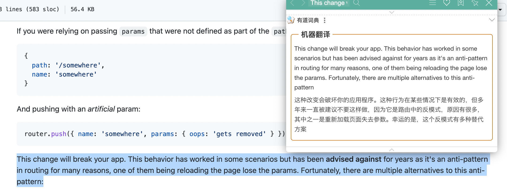

## MVVM

MVVM 是一种双向数据绑定的模式，通过 ViewModel 建立起 Model 数据层和 View 视图层的连接。数据变化，视图自动更新。视图变化，数据自动更新。

```vue
<templete>
  这里是view视图
</templete>

ViewModel就是vue的核心，底层做好了监听，所以可以双向数据绑定

<script>
export default {
  这里是model数据,
}
</script>
```

## 响应式

```html
<!DOCTYPE html>
<html lang="en">
  <head>
    <meta charset="UTF-8" />
    <meta http-equiv="X-UA-Compatible" content="IE=edge" />
    <meta name="viewport" content="width=device-width, initial-scale=1.0" />
    <title>Document</title>
  </head>
  <body>
    <div id="app">
      <!--  
        现存架构的问题：
        name发生变化后，我需要做的是更新两个p标签，而现在不管我更新了哪个数据，所有的标签都重新操作赋值了，无法做到精准更新
        解决问题的思路：
        1.数据发生变化后最关键的代码是什么
          node.innerHTML = data[nodeValue]
        2.设计一个存储结构，每一个响应式数据可能被多个标签绑定，是一个'一对多'的关系
          {
            name: [() => {node.innerHTML = data[name]}, name: [() => {node.innerHTML = data[name]}, ...]
          }
        3.这种结构就是发布订阅（自定义事件）模式
          优化的思路：
          先前的写法：不管是哪个数据发生变化，都是粗暴的执行一下compile函数
          现在的写法：在compile函数初次执行时，收集更新函数，然后在数据变化时，通过属性名找到与之绑定在一起的所有更新函数进行触发
       -->
      <input type="text" v-model="age" />
      <p v-text="name"></p>
      <p v-text="name"></p>
      <p v-text="sex"></p>
    </div>

    <script>
      // 开发vue项目时，都是提前把数据放在data里，如何把data里的数据变成响应式（get/set形式）
      // 响应式？数据发生变化，可以立刻知道，并做一些想做的事。比如：操作dom、发送ajax请求...
      // 如何实现？vue2通过Object.defineProperty对象属性拦截，vue3通过Proxy对象整体代理
      let data = {
        name: "德华",
        sex: "男",
        age: 18,
      }

      Object.keys(data).forEach(key => {
        observe(data, key, data[key])
      })

      const Dep = {
        map: {},
        collect(eventName, fn) {
          if (!this.map[eventName]) this.map[eventName] = []
          this.map[eventName].push(fn)
        },
        trigger(eventName) {
          this.map[eventName].forEach(fn => fn())
        },
      }

      // observe函数调用完毕，本来内部所有的变量会被回收，但是内部有其它函数使用了当前变量，则形成了闭包，不会被回收
      // 由于闭包的特性，每一个传入下来的value都会常驻内存，目的是为了set/get可以联动
      function observe(data, key, value) {
        Object.defineProperty(data, key, {
          // 当我们访问属性时，会自动调用此方法，并且返回值就是访问的属性值
          get() {
            return value
          },
          // 当我们设置属性时，会自动调用此方法，并且设置的值会被当作实参传入进来
          set(newValue) {
            if (newValue === value) return
            value = newValue
            // 触发
            Dep.trigger(key)
          },
        })
      }

      // 数据变化，反应到视图
      // 通过模版编译找到标记v-xxx的元素，然后把对应的数据通过操作domapi放上去
      function compile() {
        const app = document.querySelector("#app")
        const childNodes = app.childNodes
        childNodes.forEach(node => {
          // 这里拿的是标签节点
          if (node.nodeType === 1) {
            const attrs = node.attributes
            Array.from(attrs).forEach(attr => {
              const nodeValue = attr.nodeValue
              const nodeName = attr.nodeName
              // 数据 -> 视图
              if (nodeName === "v-text") {
                node.innerHTML = data[nodeValue]
                // 收集更新函数，把node.innerHTML = data[nodeValue]这个收集起来
                Dep.collect(nodeValue, () => {
                  node.innerHTML = data[nodeValue]
                })
              }

              // 数据 -> 视图
              if (nodeName === "v-model") {
                node.value = data[nodeValue]
                // 收集更新函数
                Dep.collect(nodeValue, () => {
                  node.value = data[nodeValue]
                })
                // 视图 -> 数据
                // 本质：事件监听，在回调函数中拿到input中输入的最新值，然后赋值给绑定的属性
                node.addEventListener("input", function (e) {
                  let newValue = e.target.value
                  data[nodeValue] = newValue
                })
              }
            })
          }
        })
      }
      compile()
    </script>
  </body>
</html>
```

## 发布订阅（自定义事件）模式

```html
<!DOCTYPE html>
<html lang="en">
  <head>
    <meta charset="UTF-8" />
    <meta http-equiv="X-UA-Compatible" content="IE=edge" />
    <meta name="viewport" content="width=device-width, initial-scale=1.0" />
    <title>Document</title>
  </head>
  <body>
    <button id="btn">点击我</button>

    <script>
      const btn = document.querySelector("#btn")

      // 以下操作不能让两个回调函数都执行，是一对一的关系
      // btn.onclick = function () {
      //   console.log("btn被点击了")
      // }
      // btn.onclick = function () {
      //   console.log("btn又被点击了吗")
      // }

      // 优化：从一对一变成一对多，这种优化就是发布订阅模式
      // 这种模式下可以实现同一个事件对应多个回调函数
      // btn.addEventListener("click", function () {
      //   console.log("btn被点击了")
      // })
      // btn.addEventListener("click", function () {
      //   console.log("btn又被点击了吗")
      // })

      // 浏览器事件模型的实现原理：
      // 浏览器实现了一个方法，叫做addEventListener
      // 这个方法接收两个参数，参数一：事件类型。参数二：回调函数
      // 为了实现一对多，内部大概是这样的。{ click: ['回调函数1', '回调函数2'] }
      // 当鼠标点击时，通过事件类型去数据结构中找到存放所有相关的回调函数的数组然后遍历，都执行一遍，从而实现了一对多

      // 自己实现一个发布订阅模式
      const Dep = {
        map: {},
        // 收集
        collect(eventName, fn) {
          if (!this.map[eventName]) this.map[eventName] = []
          this.map[eventName].push(fn)
        },
        // 触发
        trigger(eventName) {
          this.map[eventName].forEach(fn => fn())
        },
      }
      Dep.collect("ck", () => {
        console.log("收集成功")
      })
      Dep.trigger("ck")
    </script>
  </body>
</html>
```

## 生命周期

组件实例从创建到销毁的整个过程就是生命周期

开始创建（空实例） -> 初始化数据 -> 编译模板 -> 挂载 DOM -> 渲染、更新数据、重新渲染 -> 卸载


## 网络请求在哪个生命周期

如果请求在 methods 中封装好了，在 beforeCreate 调用时，beforeCreate 阶段是拿不到 methods 里的方法的，会报错，所以不可以在 beforeCreate 里

如果我们的业务是父组件引入了子组件，并且优先加载子组件的数据，那么父组件的请求最好放在 mounted 里。如果没有依赖关系，放在 created 或者 mounted 里都可以

## 父组件引入子组件，生命周期执行顺序

```bash
先执行父：beforeCreate created beforeMount
在执行子：beforeCreate created beforeMount mounted
在执行父：mounted
```

## keep-alive

如果使用了 keep-alive 组件，当前的组件会额外增加两个生命周期 activated deactivated，第一次进入当前组件时会执行五个生命周期 beforeCreate created beforeMount mounted activated，下次再次进入这个组件时，只会执行 activated 这一个生命周期。

## 组件通信

父子通信

```js
<jack :money="count" :obj="myobj"></jack>
```

```jsx
export default {
  // props: ['money']
  props: {
    money: {
      type: Number,
      default: 1,
    },
    obj: {
      type: Object,
      // 工厂函数可以创建对象
      default: () => {
        return {
          name: "zs",
          age: 18,
        }
      },
    },
  },
}
```

子父通信$emit

```js
<jack @add-action="fatherFn"></jack>
```

```jsx
this.$emit('add-action', 参数1, 参数2, ...)
```

ref，通过添加 ref 和 $refs 配合，也可以很方便的获取子组件，访问调用子组件的属性或方法

```js
// 父组件中
<templete>
  <div class="hello_world">
    <com-a ref="coma"></com-a> // this.$refs.coma.count = 200
    <com-b ref="comb"></com-b> // this.$refs.comb.addFn()
  </div>
</templete>
```

provide inject

父组件

```jsx
export default {
  provide() {
    return {
      value: this.value, // 共享给子孙组件的数据
    }
  },
  data() {
    return {
      value: "父组件的数据",
      money: 100,
    }
  },
}
```

子孙组件

```jsx
export default {
  inject: ['value'],
  props: {
      ...
  }
}
```

## Vue 中的 key 作用

key 就是给 虚拟 dom 添加了一个 标识, 优化了对比策略，提升性能

vue对比新旧虚拟dom，找出不同的部分，进行更新视图

diff算法：默认按照索引进行对比

往后面加，默认的对比策略，按照下标，没有任何问题

往前面加，由于下标变了，如果按照之前的下标对比，元素是混乱的

```jsx
// 旧
<ul>
  <li>张三</li>
  <li>李四</li>
</ul>

// 新
<ul>
  <li>张三</li>
  <li>李四</li>
  <li>王五</li>
</ul>
```

策略: 加上 key，一旦加上了 key，就是按照 key 进行新旧 dom 的对比了

```jsx
// 旧
<ul>
  <li key="17">张三</li>
  <li key="31">李四</li>
</ul>

// 新
<ul>
  <li key="52">王五</li>
  <li key="17">张三</li>
  <li key="31">李四</li>
</ul>
```

## 权限处理

现在权限相关管理系统用的框架都是 element 提供的[vue-element-admin](https://panjiachen.github.io/vue-element-admin-site/zh/)模板框架比较常见。

权限控制常见分为三大块

- **菜单权限控制**
- **按钮权限控制**
- 请求 url 权限控制

**权限管理在后端中主要体现在对接口访问权限的控制，在前端中主要体现在对菜单访问权限的控制。**

1. 按钮权限控制比较容易，主要采取的方式是从后端返回按钮的权限标识，然后在前端进行显隐操作 v-if / disabled。

2. url 权限控制，主要是后端代码来控制，前端只需要规范好格式即可。

3. 剩下的菜单权限控制，是相对复杂一些的

   (1) **需要在路由设计时, 就拆分成静态路由和动态路由**

   静态路由: 所有用户都能访问到的路由, 不会动态变化的 (登录页, 首页, 404, ...)

   动态路由: 动态控制的路由, 只有用户有这个权限, 才将这个路由添加给你 (审批页, 社保页, 权限管理页...)

   (2) 用户登录进入首页时, 需要立刻发送请求, 获取个人信息 (包含权限的标识)

   

   (3) **利用权限信息的标识, 筛选出合适的动态路由**, 通过路由的 **addRoutes 方法**, 动态添加路由即可!

   (4) router.options.routes (拿的是默认配置的项, 拿不到动态新增的) 不是响应式的!

   为了能正确的显示菜单, 为了能够将来正确的获取到用户路由, 我们需要用**vuex 管理 routes 路由数组**

   (5) 利用 vuex 中的 routes, 动态渲染菜单

## 如何处理项目(首屏)加载过慢的问题

SPA 单页面应用：所有的功能，都在一个页面中，单页面跳转就是切换组件，仅刷新局部资源，公共资源（js、html、css 等）仅需要加载一次。

加载过慢主要原因：一次性加载了过多的资源，一次性加载了过大的资源

- 加载过多：路由懒加载，访问到路由，再加载该路由相关的组件内容
- 加载过大：图片压缩、文件压缩合并处理、开启 gzip 压缩等

比如：

1. 配置异步组件，路由懒加载

   ```js
   const login = () => import("../pages/login.vue")
   ```

2. 图片压缩：使用 webp 格式的图片，提升首页加载的速度

3. CDN 加速：配置 CDN 加速（公司的地址和用户使用的地方太远了），加快资源的加载效率 (花钱)

4. 开启 gzip 压缩 (一般默认服务器开启的，如果没开，确实可能会很慢，可以让后台开一下)

   浏览器请求服务器，原本是服务器有什么图片就给我们什么图片，比如 jpg/png，但是这样文件会比较大，所以服务器可以将文件进行 gzip 压缩，发送给浏览器，浏览器看到这样压缩过的资源会自动解压，不需要我们做什么东西。

5. 使用 v-if 代替 v-show

6. ...


博客: https://www.cnblogs.com/xidian-Jingbin/p/10643391.html

## 什么是组件

组件就是一个可以复用的普通 js 对象


## 组件的命名规范

一种是使用链式命名"my-component"，一种是使用大驼峰命名"MyComponent"

## v-show和v-if的区别

https://cn.vuejs.org/guide/essentials/conditional.html#v-if-vs-v-show

## 为什么避免 v-for 和 v-if 在一起使用

https://cn.vuejs.org/guide/essentials/list.html#v-for-with-v-if

## 什么是插件

**插件通常用来为 `Vue` 添加全局功能**。插件的功能范围没有严格的限制——一般有下面几种：

- 添加全局方法或者属性。如: `vue-custom-element`
- 添加全局资源：指令/过滤器/过渡等。如 `vue-touch`
- 添加全局公共组件 Vue.component()
- 添加全局公共指令 Vue.directive()
- 通过全局混入来添加一些组件选项。如`vue-router`
- 添加 `Vue` 实例方法，通过把它们添加到 `Vue.prototype` 上实现。
- 一个库，提供自己的 `API`，同时提供上面提到的一个或多个功能。如`vue-router`

### Vue2 和 Vue3 怎么注册全局组件

Vue2 使用 `Vue.component('组件名'，组件对象)`

Vue3 使用

```scss
const app = createApp(App)
app.component('组件名'，组件对象)
复制代码
```

### Vue2、Vue3 怎么封装自定义插件并使用/ Vue.use() （install）

**Vue2**

在 compoents.index.js 里，定义一个函数或对象，在里面可以使用 Vue.compoent 全局注册组件，并暴露出去

在 main.js 里使用 Vue.use( )，参数类型必须是 object 或 Function

**Vue3**

在 compoents.index.ts 里，定义一个函数或对象，在里面可以使用 app.compoent 全局注册组件，并暴露出去

在 main.ts 里使用 app.use( )，参数类型必须是 object 或 Function

---

如果是 Function 那么这个函数就被当做 install 方法

如果是 object 则需要定义一个 install 方法

## Vue 为什么采用异步渲染呢

`Vue` 是组件级更新，如果不采用异步更新，那么每次更新数据都会对当前组件进行重新渲染，所以为了性能，`Vue` 会在本轮数据更新后，在异步更新视图。核心思想`nextTick` 。

`dep.notify（）` 通知 watcher 进行更新，`subs[i].update` 依次调用 watcher 的`update` ，`queueWatcher` 将 watcher 去重放入队列， nextTick（`flushSchedulerQueue` ）在下一 tick 中刷新 watcher 队列（异步）。

## nextTick

vue 数据更新后，dom 不会立刻发生变化。nextTick 会等组件的 dom 更新后，再执行 callback 回调函数

```vue
<template>
  <div>
    <!-- 自动获取焦点 -->
    <input ref="inp" type="text" v-if="isShowInput" />
    <button @click="fn" v-else>点此搜索</button>
  </div>
</template>

<script>
export default {
  data() {
    return {
      isShowInput: false,
    }
  },
  methods: {
    fn() {
      this.isShowInput = true
      this.$nextTick(() => {
        this.$refs.inp.focus()
      })
    },
  },
}
</script>
```

## data 为什么是一个函数而不是对象

对象是引用数据类型，复用组件时，由于数据都指向同一个 data，当在一个组件中修改 data 时，其它复用组件中的 data 会同时被修改。

使用函数返回对象，每次返回的都是一个新对象，则不会出现这个问题。

## 数组更新有时v-for不渲染

~~~vue
<template>
  <div>
    <ul>
      <li v-for="(val, index) in arr" :key="index">
        {{ val }}
      </li>
    </ul>
    <button @click="revBtn">数组翻转</button>
    <button @click="sliceBtn">截取前3个</button>
    <button @click="updateBtn">更新第一个元素值</button>
  </div>
</template>

<script>
export default {
  data(){
    return {
      arr: [5, 3, 9, 2, 1]
    }
  },
  methods: {
    revBtn(){
      // 1. 数组翻转可以让v-for更新
      this.arr.reverse()
    },
    sliceBtn(){
      // 数组slice方法不会造成v-for更新
      // slice不会改变原始数组
      // this.arr.slice(0, 3)
      // 解决办法：覆盖原始数组
      let newArr = this.arr.slice(0, 3)
      this.arr = newArr
    },
    updateBtn(){
      // this.arr[0] = 1000
      // 更新某个值时, v-for监测不到
      // 解决办法：this.$set()
      // 参数1: 更新目标结构。参数2: 更新位置。参数3: 更新值
      this.$set(this.arr, 0, 1000)
    }
  }
}
</script>
~~~

如果需要请使用this.$set()或者覆盖整个数组

## 动态给 vue 的 data 添加一个新的属性时会发生什么

1. `vue2`是通过`Object.defineProperty`实现数据响应式
2. 当我们访问定义的属性或者修改属性值的时候都能够触发`setter`与`getter`
3. 但是我们为`obj`添加新属性的时候，却无法触发事件属性的拦截
4. 原因是一开始`obj`的要定义的属性被设成了响应式数据，而`新增的属性`并没有通过`Object.defineProperty`设置成响应式数据

解决方案：

Vue.set()

- 通过`Vue.set`向响应式对象中添加一个`property`，并确保这个新 `property`同样是响应式的，且触发视图更新

## data 中某一个属性的值发生改变后 视图会立即同步执行重新渲染吗

**不会立即同步执行重新渲染**。Vue 实现响应式并不是数据发生变化之后 DOM 立即变化，而是按一定的策略进行 DOM 的更新。Vue 在更新 DOM 时是`异步`执行的。只要侦听到数据变化， Vue 将开启一个队列，并缓冲在同一事件循环中发生的所有数据变更。

如果同一个 watcher 被多次触发，只会被推入到队列中一次。这种在缓冲时去除重复数据对于避免不必要的计算和 DOM 操作是非常重要的。然后，在下一个的事件循环 tick 中，Vue 刷新队列并执行实际（已去重的）工作。

vue 在检测到你的数据发生变化时，将开启一个异步更新队列，通过 diff 算法找出实际需要更新的 dom 元素，需要等队列中所有数据变化完成之后，才统一进行实际 dom 更新。

## assets 和 static

- **相同点：** `assets` 和 `static` 两个都是存放静态资源文件。项目中所需要的资源文件图片，字体图标，样式文件等都可以放在这两个文件下，这是相同点
- **不相同点：** `assets` 中存放的静态资源文件在项目打包时，也就是运行 `npm run build` 时会将 `assets` 中放置的静态资源文件进行打包上传，所谓打包简单点可以理解为压缩体积，代码格式化。而压缩后的静态资源文件最终也都会放置在 `static` 文件中跟着 `index.html` 一同上传至服务器。`static` 中放置的静态资源文件就不会要走打包压缩格式化等流程，而是直接进入打包好的目录，直接上传至服务器。因为避免了压缩直接进行上传，在打包时会提高一定的效率，但是 `static` 中的资源文件由于没有进行压缩等操作，所以文件的体积也就相对于 `assets` 中打包后的文件提交较大点。在服务器中就会占据更大的空间。
- **建议：** 将项目中 `template`需要的样式文件 js 文件等都可以放置在 `assets` 中，走打包这一流程。减少体积。而项目中引入的第三方的资源文件如`iconfoont.css` 等文件可以放置在 `static` 中，因为这些引入的第三方文件已经经过处理，不再需要处理，直接上传。

## Vue 的 template 模版编译原理

vue 中的模板 template 无法被浏览器解析并渲染，因为这不属于浏览器的标准，不是正确的 HTML 语法，所有需要将 template 转化成一个 JavaScript 函数，这样浏览器就可以执行这一个函数并渲染出对应的 HTML 元素，就可以让视图跑起来了，这一个转化的过程，就成为模板编译。模板编译又分三个阶段，解析 parse，优化 optimize，生成 generate，最终生成可执行函数 render。

- **解析阶段**：使用大量的正则表达式对 template 字符串进行解析，将标签、指令、属性等转化为抽象语法树 AST。
- **优化阶段**：遍历 AST，找到其中的一些静态节点并进行标记，方便在页面重渲染的时候进行 diff 比较时，直接跳过这一些静态节点，优化 runtime 的性能。
- **生成阶段**：将最终的 AST 转化为 render 函数字符串。

## 使用异步组件有什么好处

所谓的异步组件就是通过 import 或者 require 导入的 vue 组件

vue 开发过程中，我们会做出特别多的组件，包括 login,header,footer,main 等等，会使页面打开很慢

可以避免页面一加载时就去加载全部的组件，从而导致页面访问时间变长的问题。使用异步加载组件后，只有当需要某个组件时才会去加载需要的组件。

## https://www.jianshu.com/p/16081205159c

## 单向数据流

在 vue 中需要遵循单向数据流原则 1. 父组件的数据发生了改变，子组件会自动跟着变 2. 子组件不能直接修改父组件传递过来的 props props 是只读的

## scoped

- 作用：组件 css 作用域，避免`子组件`内部的 css 样式被`父组件`覆盖
  - 默认情况下，如果子组件和父组件 css 选择器权重相同，优先加载父组件 css 样式
- 原理：给元素添加一个自定义属性 v-data-xxxxx
  - `一针见血答案`： 通过属性选择题来提高 css 权重值

## 说说从 template 到 render 处理过程(compiler 的工作原理)

1. Vue 中有个独特的编译器模块，称为“compiler”，它的主要作用是将用户编写的 template 编译为 js 中可执行的 render 函数。
2. 之所以需要这个编译过程是为了便于前端程序员能高效的编写视图模板。相比而言，我们还是更愿意用 HTML 来编写视图，直观且高效。手写 render 函数不仅效率底下，而且失去了编译期的优化能力。
3. 在 Vue 中编译器会先对 template 进行解析，这一步称为 parse，结束之后会得到一个 JS 对象，我们成为抽象语法树 AST，然后是对 AST 进行深加工的转换过程，这一步成为 transform，最后将前面得到的 AST 生成为 JS 代码，也就是 render 函数。

## Vue 实例挂载的过程中发生了什么

1. 挂载过程指的是 app.mount()过程，这个过程中整体上做了两件事：**初始化**和**建立更新机制**
2. 初始化会创建组件实例、初始化组件状态，创建各种响应式数据
3. 建立更新机制这一步会立即执行一次组件更新函数，这会首次执行组件渲染函数并执行 patch 将前面获得 vnode 转换为 dom；同时首次执行渲染函数会创建它内部响应式数据之间和组件更新函数之间的依赖关系，这使得以后数据变化时会执行对应的更新函数。

## Vue 初始化过程中 new Vue(options)都做了什么

- 处理组件配置项；初始化根组件时进行了选项合并操作，将全局配置合并到根组件的局部配置上；初始化每个子组件时做了一些性能优化，将组件配置对象上的一些深层次属性放到 vm.$options 选项中，以提高代码的执行效率
- 初始化组件实例的关系属性，比如 parent、parent、children、r o o t 、 root、root、refs 等 处理自定义事件
- 调用 beforeCreate 钩子函数
- 初始化组件的 inject 配置项，得到 ret[key] = val 形式的配置对象，然后对该配置对象进行响应式处理，并代理每个 key 到 vm 实例上
- 数据响应式，处理 props、methods、data、computed、watch 等选项
- 解析组件配置项上的 provide 对象，将其挂载到 vm.\_provided 属性上 调用 created 钩子函数
- 如果发现配置项上有 el 选项，则自动调用 mount 方法，也就是说有了 el 选项，就不需要再手动调用 mount 方法，也就是说有了 el 选项，就不需要再手动调用 mount 方法，反之，没提供 el 选项则必须调用 $mount

## 函数式组件

## Vue2兼容IE哪个版本以上

不支持ie8及以下，部分兼容ie9 ，完全兼容10以上， 因为vue的响应式原理是基于es5的Object.defineProperty()，而这个方法不支持ie8及以下

## Vue常用修饰符有哪些

https://cn.vuejs.org/guide/essentials/event-handling.html#event-modifiers

## Vue2 怎么内部监听生命周期钩子


## 


## vue3 的优点

从使用语法上，比较大的区别就是多了组合式 API，可以更好的组织逻辑。新增了 Suspense Teleport 组件，v-model 语法糖更新，去除 filter .sync 功能。

从框架本身看，首次渲染更快（proxy 代理），diff 算法更快（静态标记），打包体积更小（tree-shaking），更好的支持 TS，放弃 IE 浏览器。

### 响应式系统

提供 reactive 和 ref 实现响应式数据。

reactive 是使用 proxy 实现数据劫持，不用遍历属性，支持删除属性和添加属性。vue2 是单独额外处理的，vue2 是使用 Object.defineProperty。

ref 如果是对象使用 proxy 实现数据劫持，如果是简单数据使用 obj 的 getter setter 代理 value 属性的写法实现的。

其他发布订阅，观察者模式基本一样。

### Vue2 的数据劫持

```html
<!DOCTYPE html>
<html lang="en">
  <head>
    <meta charset="UTF-8" />
    <meta http-equiv="X-UA-Compatible" content="IE=edge" />
    <meta name="viewport" content="width=device-width, initial-scale=1.0" />
    <title>数据劫持-vue2</title>
  </head>
  <body>
    <div id="app"></div>

    <script>
      const target = {
        name: "jack",
        age: 18,
      }

      const vm = {}
      Object.keys(target).forEach(key => {
        // 代理对象，原对象的key，get和set函数，这是ES5提供的函数
        Object.defineProperty(vm, key, {
          get() {
            return target[key]
          },
          set(v) {
            target[key] = v
            // 模拟更新效果
            render()
          },
        })
      })

      const render = () => {
        document.querySelector("#app").innerHTML = `我是 ${vm.name} 今年 ${vm.age} 岁`
      }
      render()
    </script>
  </body>
</html>
```

### Vue3 的数据劫持

```html
<!DOCTYPE html>
<html lang="en">
  <head>
    <meta charset="UTF-8" />
    <meta http-equiv="X-UA-Compatible" content="IE=edge" />
    <meta name="viewport" content="width=device-width, initial-scale=1.0" />
    <title>数据劫持-vue3</title>
  </head>
  <body>
    <div id="app"></div>

    <script>
      const data = {
        name: "jack",
        age: 18,
        get fullName() {
          return this.name + "Ma"
        },
      }

      const proxy = new Proxy(data, {
        get(target, key, receiver) {
          console.log("get")
          // return target[key]
          return Reflect.get(target, key, receiver)
        },
        set(target, key, value, receiver) {
          // target[key] = value
          Reflect.set(target, key, value, receiver)
          render()
          return true
        },
      })

      console.log(proxy)

      const render = () => {
        document.querySelector("#app").innerHTML = `我是 ${proxy.name} 今年 ${proxy.age} 岁`
      }
      render()
    </script>
  </body>
</html>
```

### vite 构建工具优势

先启动开发服务器（启动快），使用 ES Module 加载资源（热更新快），开发体验好。由于只支持 ES6 模块化，commonJs 的代码需要改造，从 webpack（vue-cli） 迁移到 vite（create-vue） 还是有一些困难，建议新项目采用 vite。

### 组件如何才能支持 v-model 指令

Vue2 `:value @input` === v-model `:show update:show ` === .sync

Vue3 `:show @update:show` === v-model:show `:modelValue @update:modeValue` ===v-model

### 路由传参

- 路由
  - 路径 ===> 组件 `{path: '/user', component: User}`
  - 只有路径是 `/user` 才能来到 `User` 组件
  - 如果要传参？
    - `/user?id=100` 或者 `{path:'/user', query: {id: 100}}`
  - 如果取参数？`route.query`
- 动态路由
  - 当你不同的路径，想指向同一个组件的时候使用：`/user/100` `/user/200`
  - 路径 ===> 组件 `{path: '/user/:id', component: User, name: 'user'}`
  - 如果要传参？
    - `/user/100` 或者 `{name:'user', params: {id: 100}}`
  - 如果取参数？`route.params`

上面两种即是标准的路由写法和传参写法，其他的写法都不规范。如：

- 如何实现地址栏看不见的传参？
- vue2（vue-router@3）写法
  - `{path: '/user', component: User, name: 'user'}` 路由规则
  - `{name:'user', params: {id: 100}}` 跳转路由传参 ID
  - 这种写法地址栏不出现 id，地址是`/user` params 上的 id 值没有在地址上，刷新后消失。



vue3(vue-router@4)默认不支持了，代替方案：pinia

## 虚拟DOM

什么是虚拟DOM？用普通的js对象来描述DOM对象。

为什么使用虚拟DOM？因为真实DOM对象中的成员非常多，创建DOM对象的成本非常高。

