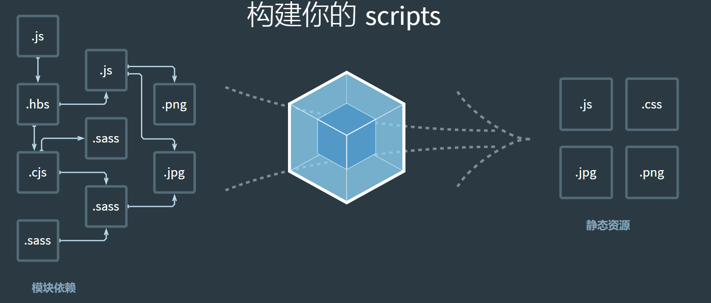
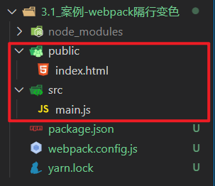
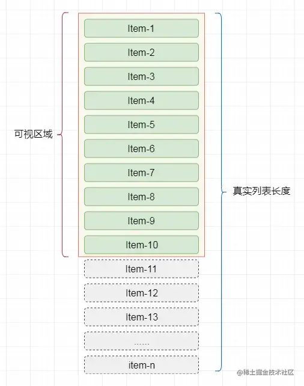
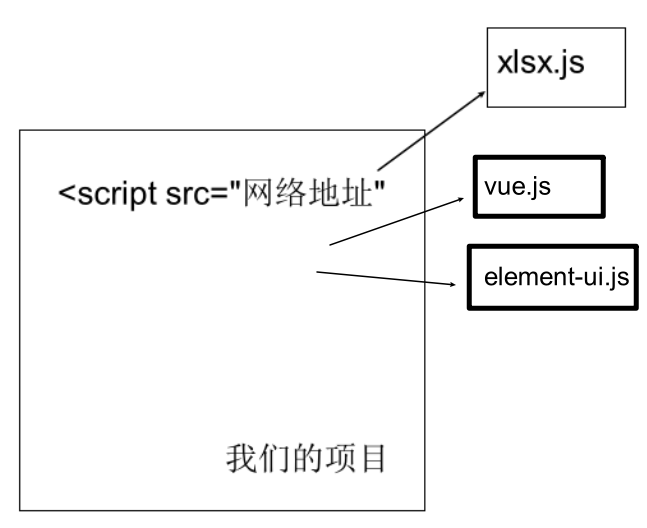

## commonJS 规范

```js
// 导出 module.exports = {}
// 导入 const 变量 = require("模块标识")
```

## ES6 规范

```js
// 导出 export 或者 export default {}
// 导入 import 变量名 from '模块标识'
```

## 服务器

```bash
服务器是一台性能高，24小时可以开机的电脑

服务器可以提供服务(例如: 文件存储，网页浏览，资源返回)

在电脑里安装node后，可以编写代码用node启动一个web服务，来读取本地html文件，返回给浏览器查看
```

## package.json

```bash
npm下载的包和对应版本号, 都会记录到下载包时终端所在文件夹下的package.json文件里
```

## dependencies devDependencies

```bash
dependencies生产环境

devDependencies开发环境
```

## base64 字符串

```bash
通过base64对图片进行编码，编码后可以直接在网页引入图片，这样图片就可以和网页一起加载了，加快图片的加载速度，但是不要大量使用
```

## webpack 基本概念

- 有了 webpack 让模块化开发前端项目成为了可能，底层需要 node 支持

- webpack 本身是 node 的一个第三方模块包，用于打包压缩代码

- 现代 javascript 应用程序的 静态模块打包器 (module bundler)

- 为要学的 vue-cli 开发环境做铺垫

## webpack 能做什么

把很多文件打包整合到一起，缩小项目体积，提高加载速度



其中功能

- less/sass -> css

- ES6/7/8 -> ES5

- html/css/js -> 压缩合并

## webpack 的使用步骤

### webpack 基础使用

> 把 src 下的 2 个 js 文件，打包到 1 个 js 中，并输出到默认 dist 目录下

默认入口 ./src/index.js

默认出口 ./dist/main.js

1. 初始化包环境

   ```bash
   yarn init
   ```

2. 安装依赖包

   ```bash
   yarn add webpack webpack-cli -D
   ```

3. 配置 scripts(自定义命令)

   ```bash
   scripts: {
   	"build": "webpack"
   }
   ```

4. 新建目录 src

5. 新建 src/add/add.js 定义求和函数导出

   ```js
   export const addFn = (a, b) => a + b
   ```

6. 新建 src/index.js 导入使用

   ```js
   import { addFn } from "./add/add"

   console.log(addFn(10, 20))
   ```

7. 运行打包命令

   ```bash
   yarn build
   #或者 npm run build
   ```

> 总结：src 并列处，生成默认 dist 目录和打包后默认 main.js 文件

### webpack 更新打包

> 以后代码变更，如何重新打包呢

1. 新建 src/tool/tool.js 定义导出数组求和方法

   ```js
   export const getArrSum = arr => arr.reduce((sum, val) => (sum += val), 0)
   ```

2. src/index.js 导入使用

   ```js
   import { addFn } from "./add/add"
   import { getArrSum } from "./tool/tool"

   console.log(addFn(10, 20))
   console.log(getArrSum([1, 2, 3]))
   ```

3. 重新打包

   ```bash
   yarn build
   ```

> 总结：src 下开发环境，dist 是打包后，分别独立
>
> 总结：打包后格式压缩，变量压缩等

## webpack 的配置

### 入口和出口

> 告诉 webpack 从哪开始打包，打包后输出到哪里

默认入口 ./src/index.js

默认出口 ./dist/main.js

webpack 配置 - webpack.config.js(默认)

1. 新建 src 并列处 webpack.config.js
2. 填入配置项

```js
const path = require("path")

module.exports = {
  entry: "./src/main.js", // 入口
  output: {
    path: path.join(__dirname, "dist"), // 出口路径
    filename: "bundle.js", // 出口文件名
  },
}
```

3. 修改 package.json，自定义打包命令，让 webpack 使用配置文件

```json
"scripts": {
    "build": "webpack"
},
```

4. 打包观察效果

### 打包流程图


`重点：所有要被打包的资源都要跟入口产生直接/间接的引用关系`

### 案例：隔行变色

> 目标：工程化模块化开发前端项目，webpack 会对 ES6 模块化处理

1. 回顾从 0 准备环境

   - 初始化包环境

   - 下载依赖包
   - 配置自定义打包命令

2. 下载 jquery，新建 public/index.html

   ```bash
   yarn add jquery
   ```

   

3. index.html 准备一些 li

   - 因为 import 语法浏览器支持性不好，需要被 webpack 转换后，再使用 JS 代码

   ```html
   <!DOCTYPE html>
   <html lang="en">
     <head>
       <meta charset="UTF-8" />
       <meta name="viewport" content="width=device-width, initial-scale=1.0" />
       <meta http-equiv="X-UA-Compatible" content="ie=edge" />
       <title>Document</title>
     </head>
     <body>
       <div id="app">
         <!-- ul>li{我是第$个li}*10 -->
         <ul>
           <li>我是第1个li</li>
           <li>我是第2个li</li>
           <li>我是第3个li</li>
           <li>我是第4个li</li>
           <li>我是第5个li</li>
           <li>我是第6个li</li>
           <li>我是第7个li</li>
           <li>我是第8个li</li>
           <li>我是第9个li</li>
         </ul>
       </div>
     </body>
   </html>
   ```

4. 在 src/main.js 引入 jquery

   ```bash
   yarn add jquery
   ```

5. src/main.js 中编写隔行变色代码

   ```js
   // 引入jquery
   import $ from "jquery"
   $(function () {
     $("#app li:nth-child(odd)").css("color", "red")
     $("#app li:nth-child(even)").css("color", "green")
   })
   ```

6. 执行打包命令观察效果

7. 可以在 dist 下把 public/index.html 引入过来

   

   在 index.html 中，手动引入 js

   ```vue
   <script src="../dist/bundle.js"></script>
   ```

> 总结：前端工程化模块化，webpack 打包后引入到 html 中使用

### 插件：自动生成 html 文件

> html-webpack-plugin 插件，让 webpack 打包后生成 html 文件并自动引入打包后的 js

[html-webpack-plugin 插件地址](https://www.webpackjs.com/plugins/html-webpack-plugin/)

1. 下载插件

   ```
   yarn add html-webpack-plugin  -D
   ```

2. webpack.config.js 配置

   ```js
   // 引入自动生成 html 的插件
   const HtmlWebpackPlugin = require("html-webpack-plugin")

   module.exports = {
     // ...省略其他代码
     plugins: [
       new HtmlWebpackPlugin({
         template: "./public/index.html", // 以此为基准生成打包后html文件
       }),
     ],
   }
   ```

3. 重新打包后观察 dist 下是否多出 html 并运行看效果

   打包后的 index.html 自动引入打包后的 js 文件

> 总结：webpack 就像一个人，webpack.config.js 是人物属性，给它穿什么装备它就干什么活

### 加载器：处理 css 文件问题

> 自己准备 css 文件，引入到 webpack 入口，测试 webpack 是否能打包 css 文件

1. 新建 src/css/index.css

2. 编写去除 li 圆点样式代码

3. (重要) 一定要引入到入口才会被 webpack 打包

4. 执行打包命令观察效果

> 总结：处理失败，webpack 默认只能处理 js 类型文件

### 加载器：处理 css 文件

> loaders 加载器，可让 webpack 处理其他类型的文件，打包到 js 中

原因：webpack 默认只认识 js 文件和 json 文件

[style-loader 文档](https://webpack.docschina.org/loaders/style-loader/)

[css-loader 文档](https://webpack.docschina.org/loaders/css-loader/)

1. 安装依赖

   ```
   yarn add style-loader css-loader -D
   ```

2. webpack.config.js 配置

   ```js
   const HtmlWebpackPlugin = require("html-webpack-plugin")

   module.exports = {
     // ...其他代码
     module: {
       rules: [
         // loader的规则
         {
           test: /\.css$/, // 匹配所有的css文件
           // use数组里从右向左运行
           // 先用 css-loader 让webpack能够识别 css 文件的内容并打包
           // 再用 style-loader 将样式, 把css插入到dom中
           use: ["style-loader", "css-loader"],
         },
       ],
     },
   }
   ```

3. 新建 src/css/li.css 去掉 li 默认样式

   ```css
   ul,
   li {
     list-style: none;
   }
   ```

4. 引入到 main.js (因为这里是入口需要产生关系，才会被 webpack 找到打包起来)

   ```js
   import "./css/index.css"
   ```

5. 运行打包后 dist/index.html 观察效果和 css 引入情况

> 总结：万物皆模块，引到入口，才会被 webpack 打包。css 打包进 js 中，然后被嵌入在 style 标签插入 dom 上

### 加载器：处理 less 文件

> less-loader 让 webpack 处理 less 文件，less 模块翻译 less 代码

[less-loader 文档](https://webpack.docschina.org/loaders/less-loader/)

1. 下载依赖包

   ```bash
   yarn add less less-loader -D
   ```

2. webpack.config.js 配置

   ```js
   module: {
     rules: [
       // loader的规则
       // ...省略其他
       {
         test: /\.less$/,
         // 使用less-loader, 让webpack处理less文件, 内置还会用less翻译less代码成css内容
         use: ["style-loader", "css-loader", "less-loader"],
       },
     ]
   }
   ```

3. src/less/index.less 设置 li 字体大小 24px

   ```less
   @size: 24px;

   ul,
   li {
     font-size: @size;
   }
   ```

4. 引入到 main.js 中

   ```js
   import "./less/index.less"
   ```

5. 打包运行 dist/index.html 观察效果

> 总结：只要找到对应的 loader 加载器，就能让 webpack 处理不同类型文件

### 加载器：处理图片文件

> 用 asset module 方式(webpack5 版本新增)

[asset module 文档](https://webpack.docschina.org/guides/asset-modules/)

如果使用的是 webpack5 版本的，直接配置在 webpack.config.js 的 rules 里即可

```js
{
    test: /\.(png|jpg|gif|jpeg)$/i,
    type: 'asset'
}
```

如果你用的是 webpack4 及以前的，请使用者里的配置

[url-loader 文档](https://webpack.docschina.org/loaders/url-loader/)

[file-loader 文档](https://webpack.docschina.org/loaders/file-loader/)

1. 下载依赖包

   ```bash
   yarn add url-loader file-loader -D
   ```

2. webpack.config.js 配置

   ```js
   {
     test: /\.(png|jpg|gif|jpeg)$/i,
     use: [
       {
         loader: 'url-loader', // 匹配文件，尝试转base64字符串打包到js中
         // 配置limit，超过8k，不转，file-loader复制，随机名，输出文件
         options: {
           limit: 8 * 1024,
         },
       },
     ],
   }
   ```

   图片转成 base64 字符串

   - 好处就是浏览器不用发请求了，直接可以读取
   - 坏处就是如果图片太大，再转`base64`就会让图片的体积增大 30% 左右

3. src/assets/准备老师发的 2 个图文件

4. 在 css/less/index.less 把小图片用做背景图

   ```less
   body {
     background: url(../assets/logo_small.png) no-repeat center;
   }
   ```

5. 在 src/main.js 把大图插入到创建的 img 标签上，添加 body 上显示

   ```js
   // 引入图片-使用
   import imgUrl from "./assets/1.gif"
   const theImg = document.createElement("img")
   theImg.src = imgUrl
   document.body.appendChild(theImg)
   ```

6. 打包运行 dist/index.html 观察 2 个图片区别

> 总结：url-loader 把文件转 base64 打包进 js 中，会有 30%的增大，file-loader 把文件直接复制输出

### webpack 加载文件优缺点

图片转成 base64 字符串

- 好处就是浏览器不用发请求了，直接可以读取
- 坏处就是如果图片太大，再转`base64`就会让图片的体积增大 30% 左右

### 加载器：处理字体文件

> 用 asset module 技术，asset/resource 直接输出到 dist 目录下

webpack5 使用这个配置

```js
{ // webpack5默认内部不认识这些文件，所以当做静态资源直接输出即可
    test: /\.(eot|svg|ttf|woff|woff2)$/,
    type: 'asset/resource',
    generator: {
    	filename: 'font/[name].[hash:6][ext]'
    }
}
```

webpack4 及以前使用下面的配置

1. webpack.config.js - 准备配置

   ```js
   { // 处理字体图标的解析
      test: /\.(eot|svg|ttf|woff|woff2)$/,
      use: [
        {
          loader: 'url-loader',
          options: {
            limit: 2 * 1024,
            // 配置输出的文件名
            name: '[name].[ext]',
            // 配置输出的文件目录
            outputPath: "fonts/"
          }
        }
      ]
   }
   ```

2. src/assets/放入字体库 fonts 文件夹

3. 在 main.js 引入 iconfont.css

   ```js
   // 引入字体图标文件
   import "./assets/fonts/iconfont.css"
   ```

4. 在 public/index.html 使用字体图标样式

   ```html
   <i class="iconfont icon-weixin"></i>
   ```

5. 执行打包命令，观察打包后网页效果

> 总结：url-loader 和 file-loader 可以打包静态资源文件

### 加载器：处理高版本 js 语法

> 让 webpack 对高版本的 js 代码，降级处理后打包

高版本的 js 代码(箭头函数)，打包后，直接原封不动打入了 js 文件中，遇到一些低版本的浏览器就会报错

webpack 默认仅内置了 模块化的 兼容性处理`import export`

babel：用于处理高版本 js 语法 的兼容性 [babel 官网](https://www.babeljs.cn/)

让 webpack 配合 babel-loader 对 js 语法做处理

[babel-loader 文档](https://webpack.docschina.org/loaders/babel-loader/)

1. 安装包

   ```bash
   yarn add -D babel-loader @babel/core @babel/preset-env
   ```

2. 配置规则

   ```js
   module: {
     rules: [
       {
         test: /\.js$/,
         exclude: /(node_modules|bower_components)/,
         use: {
           loader: "babel-loader",
           options: {
             presets: ["@babel/preset-env"], // 预设:转码规则(用bable开发环境本来预设的)
           },
         },
       },
     ]
   }
   ```

3. 在 main.js 中使用箭头函数(高版本 js)

   ```js
   // 高级语法
   const fn = () => {
     console.log("你好babel")
   }
   console.log(fn) // 这里必须打印不能调用/不使用，不然webpack会精简成一句打印不要函数了/不会编译未使用的代码
   // 没有babel集成时，原样直接打包进lib/bundle.js
   // 有babel集成时，会翻译成普通函数打包进lib/bundle.js
   ```

4. 打包后观察 lib/bundle.js 被转成成普通函数使用了，这就是 babel 降级翻译的功能

> 总结：babel-loader 可以让 webpack 对高版本 js 语法做降级处理后打包

### 图片是如何加载的

```bash
自己项目中的图片素材也需要请求才能拿到

但这个请求不是我们开发人员写的，是浏览器去做，浏览器读取到对应的资源引用去下载对应的资源

因为项目最终也是放在服务器上，所以项目中的图片这些东西也是由浏览器去找域名地址对应的服务器去下载的
```

## webpack 开发服务器

### webpack 开发服务器为何学

文档地址https://webpack.docschina.org/configuration/dev-server/

抛出问题：每次修改代码，都需要重新 yarn build 打包，才能看到最新的效果，实际工作中，打包 yarn build 非常费时

为什么费时?

1. 构建依赖
2. 磁盘读取对应的文件到内存，才能加载
3. 用对应的 loader 进行处理
4. 将处理完的内容，输出到磁盘指定目录

解决问题：起一个开发服务器，在电脑内存中打包，缓存一些已经打包过的内容，只重新打包修改的文件，最终运行加载在内存中给浏览器使用

### webpack-dev-server 自动刷新

> 启动本地服务，可实时更新修改的代码，打包**变化代码**到内存中，然后直接提供端口和网页访问

1. 下载包

   ```bash
   yarn add webpack-dev-server -D
   ```

2. 配置自定义命令

   ```js
   scripts: {
   	"build": "webpack",
   	"serve": "webpack serve"
   }
   ```

3. 运行命令，启动 webpack 开发服务器

   ```bash
   yarn serve
   #或者 npm run serve
   ```

> 总结：以后改了 src 下的资源代码，就会直接更新到内存打包，然后反馈到浏览器上了

### webpack-dev-server 配置

1. 在 webpack.config.js 中添加服务器配置

   更多配置参考这里https://webpack.docschina.org/configuration/dev-server/#devserverafter

   ```js
   module.exports = {
     // ...其他配置
     devServer: {
       port: 3000, // 端口号
     },
   }
   ```

## 面试题

### 1、什么是 webpack（必会）

webpack 是一个打包模块化 javascript 的工具，在 webpack 里一切文件皆模块，通过 loader 转换文件，通过 plugin 注入钩子，最后输出由多个模块组合成的文件，webpack 专注构建模块化项目，简单说就是模块打包工具

### 2、Webpack 的优点是什么（必会）

减少文件体积、减少文件数量

提高网页加载速度

### 3、webpack 的构建流程是什么 从读取配置到输出文件这个过程尽量说全（必会）

Webpack 的运行流程是一个串行的过程，从启动到结束会依次执行以下流程：

1. 初始化参数：从配置文件读取与合并参数，得出最终的参数
2. 开始编译：用上一步得到的参数初始化 Compiler 对象，加载所有配置的插件，开始执行编译
3. 确定入口：根据配置中的 entry 找出所有的入口文件
4. 编译模块：从入口文件出发，调用所有配置的 Loader 对模块进行翻译，再找出该模块依赖的模块，再递归本步骤直到所有入口依赖的文件都经过了本步骤的处理
5. 完成模块编译：在经过第 4 步使用 Loader 翻译完所有模块后，得到了每个模块被翻译后的最终内容以及它们之间的依赖关系
6. 输出资源：根据入口和模块之间的依赖关系，组装成一个个包含多个模块的 Chunk，再把每个 Chunk 转换成一个单独的文件加入到输出列表，这步是可以修改输出内容的最后机会
7. 输出完成：在确定好输出内容后，根据配置确定输出的路径和文件名，把文件内容写入到文件系统。

在以上过程中，Webpack 会在特定的时间点广播出特定的事件，插件在监听到感兴趣的事件后会执行特定的逻辑，并且插件可以调用 Webpack 提供的 API 改变 Webpack 的运行结果

### 4、说一下 Webpack 的热更新原理(必会)

webpack 的热更新又称热替换（Hot Module Replacement），缩写为 HMR。这个机制可以做到不用刷新浏览器而将新变更的模块替换掉旧的模块。

HMR 的核心就是客户端从服务端拉取更新后的文件，准确的说是 chunk diff (chunk 需要更新的部分)，实际上 WDS 与浏览器之间维护了一个 Websocket，当本地资源发生变化时，WDS 会向浏览器推送更新，并带上构建时的 hash，让客户端与上一次资源进行对比。客户端对比出差异后会向 WDS 发起 Ajax 请求来获取更改内容(文件列表、hash)，这样客户端就可以再借助这些信息继续向 WDS 发起 jsonp 请求获取该 chunk 的增量更新。

后续的部分(拿到增量更新之后如何处理？哪些状态该保留？哪些又需要更新？)由 HotModulePlugin 来完成，提供了相关 API 以供开发者针对自身场景进行处理，像 react-hot-loader 和 vue-loader 都是借助这些 API 实现 HMR。

### 5、webpack 与 grunt gulp 的不同（必会）

- 三者之间的区别

三者都是前端构建工具，grunt 和 gulp 在早期比较流行，现在 webpack 相对来说比较主流，不过一些轻量化的任务还是会用 gulp 来处理，比如单独打包 CSS 文件等。

grunt 和 gulp 是基于任务和流（Task、Stream）的。类似 jQuery，找到一个（或一类）文件，对其做一系列链式操作，更新流上的数据， 整条链式操作构成了一个任务，多个任务就构成了整个 web 的构建流程。

webpack 是基于入口的。webpack 会自动地递归解析入口所需要加载的所有资源文件，然后用不同的 Loader 来处理不同的文件，用 Plugin 来扩展 webpack 功能。

- 从构建思路来说

gulp 和 grunt 需要开发者将整个前端构建过程拆分成多个`Task`，并合理控制所有`Task`的调用关系 webpack 需要开发者找到入口，并需要清楚对于不同的资源应该使用什么 Loader 做何种解析和加工

- 对于知识背景来说

gulp 更像后端开发者的思路，需要对于整个流程了如指掌 webpack 更倾向于前端开发者的思路

### 6、有哪些常见的 Loader 他们是解决什么问题的（必会）

1、 file-loader：把文件输出到一个文件夹中，在代码中通过相对 URL 去引用输出的文件

2、 url-loader：和 file-loader 类似，但是能在文件很小的情况下以 base64 的方式把文件内容注入到代码中去

3、 source-map-loader：加载额外的 Source Map 文件，以方便断点调试

4、 image-loader：加载并且压缩图片文件

5、 babel-loader：把 ES6 转换成 ES5

6、 css-loader：加载 CSS，支持模块化、压缩、文件导入等特性

7、 style-loader：把 CSS 代码注入到 JavaScript 中，通过 DOM 操作去加载 CSS

8、 eslint-loader：通过 ESLint 检查 JavaScript 代码

### 7、Loader 和 Plugin 的不同（必会）

- 不同的作用

Loader 直译为"加载器"。Webpack 将一切文件视为模块，但是 webpack 原生是只能解析 js 文件，如果想将其他文件也打包的话，就会用到 loader。 所以 Loader 的作用是让 webpack 拥有了加载和解析非 JavaScript 文件的能力。

Plugin 直译为"插件"。Plugin 可以扩展 webpack 的功能，让 webpack 具有更多的灵活性。 在 Webpack 运行的生命周期中会广播出许多事件，Plugin 可以监听这些事件，在合适的时机通过 Webpack 提供的 API 改变输出结果。

- 不同的用法

Loader 在 module.rules 中配置，也就是说他作为模块的解析规则而存在。 类型为数组，每一项都是一个 Object，里面描述了对于什么类型的文件（test），使用什么加载(loader)和使用的参数（options）

Plugin 在 plugins 中单独配置。 类型为数组，每一项是一个 plugin 的实例，参数都通过构造函数传入。

### 8、代码分割的本质是什么 有什么意义呢

代码分割的本质其实就是在`源代码直接上线`和`打包成唯一脚本main.bundle.js`这两种极端方案之间的一种更适合实际场景的中间状态。`用可接受的服务器性能压力增加来换取更好的用户体验。`

源代码直接上线：虽然过程可控，但是 http 请求多，性能开销大

打包成唯一脚本：一把梭完自己爽，服务器压力小，但是页面空白期长，用户体验不好。

```js
import App from "./App.vue" // 根vue文件
import Vue from "vue" // 引入vue.js对象

new Vue({
  render: h => h(App), // 渲染函数, 渲染App组件里的标签
}).$mount("#app") // 把vue文件的标签结构 -> 挂载到id为app的标签里
```

# Webpack 优化

### 7.1 如何提⾼**webpack**的打包速度

**（1）优化 Loader**

对于 Loader 来说，影响打包效率首当其冲必属 Babel 了。因为 Babel 会将代码转为字符串生成 AST，然后对 AST 继续进行转变最后再生成新的代码，项目越大，**转换代码越多，效率就越低**。

**（2）HappyPack**

受限于 Node 是单线程运行的，所以 Webpack 在打包的过程中也是单线程的，特别是在执行 Loader 的时候，长时间编译的任务很多，这样就会导致等待的情况。

**HappyPack 可以将 Loader 的同步执行转换为并行的**，这样就能充分利用系统资源来加快打包效率了

**（3）DllPlugin**

**DllPlugin 可以将特定的类库提前打包然后引入**。这种方式可以极大的减少打包类库的次数，只有当类库更新版本才有需要重新打包，并且也实现了将公共代码抽离成单独文件的优化方案。

**（4）代码压缩**

在 Webpack3 中，一般使用 `UglifyJS` 来压缩代码，但是这个是单线程运行的，为了加快效率，可以使用 `webpack-parallel-uglify-plugin` 来并行运行 `UglifyJS`，从而提高效率。

在 Webpack4 中，不需要以上这些操作了，只需要**将 `mode` 设置为 `production`** 就可以默认开启以上功能。代码压缩也是我们必做的性能优化方案，当然我们不止可以压缩 JS 代码，还可以压缩 HTML、CSS 代码，并且在压缩 JS 代码的过程中，我们还可以通过配置实现比如删除 `console.log` 这类代码的功能。

### 7.2 如何减少 Webpack 打包**体积**

**（1）按需加载**

在开发 SPA 项目的时候，项目中都会存在很多路由页面。如果将这些页面全部打包进一个 JS 文件的话，虽然将多个请求合并了，但是同样也加载了很多并不需要的代码，耗费了更长的时间。那么为了首页能更快地呈现给用户，希望首页能加载的文件体积越小越好，**这时候就可以使用按需加载，将每个路由页面单独打包为一个文件**。当然不仅仅路由可以按需加载，对于 `loadash` 这种大型类库同样可以使用这个功能。

**（2）Scope Hoisting**

**Scope Hoisting 会分析出模块之间的依赖关系，尽可能的把打包出来的模块合并到一个函数中去。**

**（3）Tree Shaking**

**Tree Shaking 可以实现删除项目中未被引用的代码**。可以通过在启动 webpack 时追加参数 --optimize-minimize 来实现

### 7.3 如何⽤**webpack**来优化前端性能

⽤ webpack 优化前端性能是指优化 webpack 的输出结果，让打包的最终结果在浏览器运⾏快速⾼效。

- **压缩代码**：删除多余的代码、注释、简化代码的写法等等⽅式。可以利⽤ webpack 的 UglifyJsPlugin 和 ParallelUglifyPlugin 来压缩 JS ⽂件， 利⽤ cssnano （css-loader?minimize）来压缩 css
- **利⽤ CDN 加速**: 在构建过程中，将引⽤的静态资源路径修改为 CDN 上对应的路径。可以利⽤ webpack 对于 output 参数和各 loader 的 publicPath 参数来修改资源路径
- **Tree Shaking**: 将代码中永远不会⾛到的⽚段删除掉。可以通过在启动 webpack 时追加参数 --optimize-minimize 来实现
- **Code Splitting (自动):** 将代码按路由维度或者组件分块(chunk),这样做到按需加载,同时可以充分利⽤浏览器缓存
- **提取公共第三⽅库**: SplitChunksPlugin 插件来进⾏公共模块抽取,利⽤浏览器缓存可以⻓期缓存这些⽆需频繁变动的公共代码

### 7.4 如何提⾼**webpack**的构建速度

- 多⼊⼝情况下，使⽤ CommonsChunkPlugin 来提取公共代码
- 通过 **externals** 配置来提取常⽤库
- 利⽤ DllPlugin 和 DllReferencePlugin 预编译资源模块 通过 DllPlugin 来对那些我们引⽤但是绝对不会修改的 npm 包来进⾏预编译，再通过 DllReferencePlugin 将预编译的模块加载进来。
- 使⽤ Happypack 实现多线程加速编译
- 使⽤ webpack-uglify-parallel 来提升 uglifyPlugin 的压缩速度。 原理上 webpack-uglify-parallel 采⽤了多核并⾏压缩来提升压缩速度
- 使⽤ Tree-shaking 和 Scope Hoisting 来剔除多余代码

### 7.5 什么是长缓存 在 Webpack 中如何做到长缓存优化

1、什么是长缓存

浏览器在用户访问页面的时候，为了加快加载速度，会对用户访问的静态资源进行存储，但是每一次代码升级或者更新，都需要浏览器去下载新的代码，最方便的更新方式就是引入新的文件名称，只下载新的代码块，不加载旧的代码块，这就是长缓存。

2、具体实现

在 Webpack 中，可以在 output 给出输出的文件制定 chunkhash，并且分离经常更新的代码和框架代码，通 NameModulesPlugin 或者 HashedModulesPlugin 使再次打包文件名不变

### 7.6 怎么实现 Webpack 的按需加载

在 Webpack 中，import 不仅仅是 ES6module 的模块导入方式，还是一个类似 require 的函数，我们可以通过 import('module')的方式引入一个模块，import()返回的是一个 Promise 对象；使用 import（）方式就可以实现 Webpack 的按需加载

### 7.7 什么是神奇注释

在 import（）里可以添加一些注释，如定义该 chunk 的名称，要过滤的文件，指定引入的文件等等，这类带有特殊功能的注释被称为神器注释。

## 8. 什么是虚拟列表

`虚拟列表`其实是按需显示的一种实现，即**只对`可见区域`进行渲染，对`非可见区域`中的数据不渲染或部分渲染的技术，从而达到极高的渲染性能。**

假设有 1 万条记录需要同时渲染，我们屏幕的`可见区域`的高度为`500px`,而列表项的高度为`50px`，则此时我们在屏幕中最多只能看到 10 个列表项，那么在首次渲染的时候，我们只需加载 10 条即可。



### 虚拟列表如何实现

虚拟列表的实现，实际上就是在首屏加载的时候，只加载`可视区域`内需要的列表项，当滚动发生时，动态通过计算获得`可视区域`内的列表项，并将`非可视区域`内存在的列表项删除。

- 计算当前`可视区域`起始数据索引(`startIndex`)
- 计算当前`可视区域`结束数据索引(`endIndex`)
- 计算当前`可视区域的`数据，并渲染到页面中
- 计算`startIndex`对应的数据在整个列表中的偏移位置`startOffset`并设置到列表上


由于只是对`可视区域`内的列表项进行渲染，所以为了保持列表容器的高度并可正常的触发滚动，将 Html 结构设计成如下结构：

```xml
<div class="infinite-list-container">
    <div class="infinite-list-phantom"></div>
    <div class="infinite-list">
      <!-- item-1 -->
      <!-- item-2 -->
      <!-- ...... -->
      <!-- item-n -->
    </div>
</div>
```

- `infinite-list-container` 为`可视区域`的容器
- `infinite-list-phantom` 为容器内的占位，高度为总列表高度，用于形成滚动条
- `infinite-list` 为列表项的`渲染区域`

接着，监听`infinite-list-container`的`scroll`事件，获取滚动位置`scrollTop`

- 假定`可视区域`高度固定，称之为`screenHeight`
- 假定`列表每项`高度固定，称之为`itemSize`
- 假定`列表数据`称之为`listData`
- 假定`当前滚动位置`称之为`scrollTop`

则可推算出：

- 列表总高度`listHeight` = listData.length \* itemSize
- 可显示的列表项数`visibleCount` = Math.ceil(screenHeight / itemSize)
- 数据的起始索引`startIndex` = Math.floor(scrollTop / itemSize)
- 数据的结束索引`endIndex` = startIndex + visibleCount
- 列表显示数据为`visibleData` = listData.slice(startIndex,endIndex)

当滚动后，由于`渲染区域`相对于`可视区域`已经发生了偏移，此时我需要获取一个偏移量`startOffset`，通过样式控制将`渲染区域`偏移至`可视区域`中。

- 偏移量`startOffset` = scrollTop - (scrollTop % itemSize); 用来做 transform 的数据

### 监听 scoll 事件的优化

我们使用`监听scroll事件`的方式来触发可视区域中数据的更新，当滚动发生后，scroll 事件会频繁触发，很多时候会造成`重复计算`的问题，从性能上来说无疑存在浪费的情况。

可以使用`IntersectionObserver`替换监听 scroll 事件，`IntersectionObserver`可以监听目标元素是否出现在可视区域内，在监听的回调事件中执行可视区域数据的更新，并且`IntersectionObserver`的监听回调是异步触发，不随着目标元素的滚动而触发，性能消耗极低。

## 9. 前端工程化

#### Babel 的原理是什么

**Babel 的主要工作是对代码进行转译。** (解决兼容, 解析执行一部分代码)

```css
let a = 1 + 1    =>  var a = 2
复制代码
```

转译分为三阶段：

- 解析（Parse），将代码解析⽣成抽象语法树 AST，也就是词法分析与语法分析的过程
- 转换（Transform），对语法树进⾏变换方面的⼀系列操作。通过 babel-traverse，进⾏遍历并作添加、更新、删除等操作
- ⽣成（Generate），通过 babel-generator 将变换后的 AST 转换为 JS 代码

我们可以通过 AST Explorer 工具来查看 Babel 具体生成的 AST 节点。

## 10. 什么是单点登录

单点登录（Single Sign On），简称为 SSO，是目前比较流行的企业业务整合的解决方案之一

SSO 的定义是在多个应用系统中，用户只需要登录一次就可以访问所有相互信任的应用系统

SSO 一般都需要一个独立的认证中心（passport），子系统的登录均得通过`passport`，子系统本身将不参与登录操作

当一个系统成功登录以后，`passport`将会颁发一个令牌给各个子系统，子系统可以拿着令牌会获取各自的受保护资源，为了减少频繁认证，各个子系统在被`passport`授权以后，会建立一个局部会话，在一定时间内可以无需再次向`passport`发起认证

## 11. 大文件上传如何做分片上传、断点继传

### 分片上传

分片上传，就是将所要上传的文件，按照一定的大小，将整个文件分隔成多个数据块（Part）来进行分片上传

如下图


上传完之后再由服务端对所有上传的文件进行汇总整合成原始的文件

大致流程如下：

1. 将需要上传的文件按照一定的分割规则，分割成相同大小的数据块；
2. 初始化一个分片上传任务，返回本次分片上传唯一标识；
3. 然后借助 http 的可并发性，同时上传多个切片
4. 发送完成后，服务端根据判断数据上传是否完整，如果完整，则进行数据块合成得到原始文件

### 断点续传

断点续传指的是在下载或上传时，将下载或上传任务人为的划分为几个部分

每一个部分采用一个线程进行上传或下载，如果碰到网络故障，可以从已经上传或下载的部分开始继续上传下载未完成的部分，而没有必要从头开始上传下载。用户可以节省时间，提高速度

一般实现方式有两种：

- 服务器端返回，告知从哪开始
- 浏览器端自行处理

上传过程中将文件在服务器写为临时文件，等全部写完了（文件上传完），将此临时文件重命名为正式文件即可

如果中途上传中断过，下次上传的时候根据当前临时文件大小，作为在客户端读取文件的偏移量，从此位置继续读取文件数据块，上传到服务器从此偏移量继续写入文件即可

**使用场景**

- 大文件加速上传：当文件大小超过预期大小时，使用分片上传可实现并行上传多个 Part， 以加快上传速度
- 网络环境较差：建议使用分片上传。当出现上传失败的时候，仅需重传失败的 Part
- 流式上传：可以在需要上传的文件大小还不确定的情况下开始上传。这种场景在视频监控等行业应用中比较常见

## 12. npm run dev 的时候 webpack 做了什么事情

执行**npm run dev**时候最先执行的**build/dev-server.js**文件，该文件主要完成下面几件事情：

1、检查 node 和 npm 的**版本**、引入相关**插件**和**配置**

2、webpack 对源码进行**编译打包**并返回 compiler 对象

3、**创建 express 服务器**

4、**配置开发中间件**（webpack-dev-middleware）和**热重载中间件**（webpack-hot-middleware）

5、**挂载代理服务和中间件**

6、配置静态资源

7、启动服务器监听特定端口（8080）

8、自动打开浏览器并打开特定网址（localhost:8080）

# 打包

## 打包发布 - 概念介绍

### 目标

- 前端资源打包在每个项目中都会有涉及，每位开发者都希望打包是用最少的时间构建出最小的代码，这不仅能提高团队中的效率，也能提高页面的访问性能

### 讲解

项目开发完成之后的打包，需要使用 webpack 做打包

`打包后将项目中的.html .vue .scss .js等素材打包成.htm .js .css`


### 小结

1. webpack 的作用是什么

   我们可以把文件打包成模块，压缩 整合 提高加载速度

2. webpack 开发服务器

   yarn build 打包生成的 dist 目录，在开发服务器中是把这些代码打包到了内存里

## 打包发布 - publicPath

### 目标

- 介绍 publicPath 的作用

### 讲解

1. 不使用 publicPath，打包的项目必须保证 dist 的内容在服务器的根目录

2. 使用 publicPath 可以影响 index.html 引入其他打包后的资源的前缀相对路径

3. 在 vue.config.js 中添加

   ```js
   node里有个内置的环境变量process.env.NODE_ENV
   process.env.NODE_ENV会根据我敲击的命令，来使用不用的值
   如果敲击的是yarn serve，值就是'development'字符串
   如果敲击的是yarn build，值就是'production'字符串
   // 影响打包时，index.html引入其它资源的前缀地址
   publicPath: process.env.NODE_ENV === 'development' ? '/' : './'
   ```

### 小结

1. publicPath 这个固定配置项的作用

   可以影响打包时 index.html 引入其他资源的相对路径

## 打包发布 - 减少包体积 - 整体分析

### 目标

了解如何减少包体积的思路

### 讲解

1.  打包过程：从 main.js 开始出发，寻找项目中需要使用到的依赖，最终交由 webpack 进行打包

 

2. 我们是否需要把**第三方的库**全部打包到自己的项目中呢？

   比如 elementUI 文件就很大，而且这类插件长期不需要我们进行更新，所以**没有必要打包进来**！

3. 思路


### 小结

1. 如何减少包体积?

   把一些不必经常维护的第三方插件，不用 webpack 模块化方式打包，而是变成 cdn 的 script 的 src 方式加载，因为 cdn 有物理加速的能力，会找用户就近的服务器拿到指定地址的文件

## 打包发布 - 减少包体积 - 排除第三方

### 目标

通过配置 vue-cli 把一些平常不需要用的包排除在打包文字之外。

例如：让 `webpack` 不打包 `vue` `element` 等等

### 讲解

1. 先找到 `vue.config.js`， 添加 `externals` 项，具体如下：

   - 此选项作用，告诉 webpack 排除掉这些包，不进行打包

   - 一定要去修改掉引入 Element 用的变量名，这里要匹配去替换，因为 cdn 里的源代码配置在 ELEMENT 这个变量上

```js
configureWebpack: {
  // provide the app's title in webpack's name field, so that
  // it can be accessed in index.html to inject the correct title.
  name: name,
  externals: {
    // 基本格式：
    // '包名' : '在项目中引入的名字'
    'echarts': 'echarts',
    'vue': 'Vue',
    'vue-router': 'VueRouter',
    'vuex': 'Vuex',
    'axios': 'axios',
    'dayjs': 'dayjs',
    'element-ui': 'ELEMENT',
    'vue-quill-editor': 'VueQuillEditor',
    'vuex-persistedstate': 'createPersistedState'
  },
  resolve: {
    alias: {
      '@': resolve('src')
    }
  }
}
```

再次运行，我们会发现包的大小已经大幅减小，三个包已经不在打包的目标文件中了。

### 小结

1. webpack 如何剔除包, 不参与打包?

   webpack 把对应几个包名写在 key 上，就可以刨除掉

## 打包发布 - 了解 CDN

### 目标

- 了解什么是 CDN 以及它的好处

### 讲解

CDN 全称叫做“Content Delivery Network”，中文叫**内容分发网络**。我们用它来**提高访问速度**。

 之后  />

把一些静态资源：css， .js，图片，视频放在第三方的 CDN 服务器上，可以加速访问速度。

前端项目中使用 CDN 好处：

1. 减少应用打包出来的包体积
2. 加快静态资源的访问，cdn 服务器集群，就近返回
3. 利用浏览器缓存，不会变动的文件长期缓存

### 小结

1. 我们为何使用 cdn?

   可以适当提高第三方插件的链接速度, 但是开发的时候我们还是可以在本地用 npm 下载, 但是上线后要配置 cdn 地址, 用户的浏览器默认还有缓存功能

## 打包发布 - 引用 CDN

### 目标

- 掌握 CDN 的使用

### 讲解

做相关配置：把排除在外的包，通过公共网络资源方式引入

 

1. 请注意，在开发环境时，文件资源还是可以从本地 node_modules 中取出，而只有项目上线了，才需要去使用外部资源。此时我们可以使用**环境变量**来进行区分。具体如下

2. 在**`vue.config.js`**文件中

   ```js
   // 需要排除的包对象
   let externals = {}
   // 判断是否是生产环境
   const isProduction = process.env.NODE_ENV === "production"
   // 如何是生产环境，需要执行以下逻辑
   if (isProduction) {
     externals = {
       /**
        * '包名': '在项目中引入的名字'
        * 以 element-ui 举例 我再 main.js 里是以
        * import ELEMENT from 'element-ui'
        * Vue.use(ELEMENT)
        * 这样引入的，所以我的 externals 的属性值应该是 ELEMENT
        * 一定要去main.js设置
        */
       echarts: "echarts",
       vue: "Vue",
       "vue-router": "VueRouter",
       vuex: "Vuex",
       axios: "axios",
       dayjs: "dayjs",
       "element-ui": "ELEMENT",
       "vue-quill-editor": "VueQuillEditor",
       "vuex-persistedstate": "createPersistedState",
     }
   }
   ```

3. webpack 配置 externals 配置项

   ```js
   configureWebpack: {
     // 配置单页应用程序的页面的标题
     name: name,
     externals: externals,
     resolve: {
       alias: {
         '@': resolve('src')
       }
     }
   }
   ```

4. 在`public/index.html`中，填入 cdn 的地址

   因为 webpack 不会再打包这些第三方代码了，所以运行时缺少他们，我们用 cdn 链接的方式引入到 html 里参与运行

   ```html
   <!-- built files will be auto injected -->
   <script src="https://unpkg.com/echarts@5.3.2/dist/echarts.min.js"></script>
   <script src="https://unpkg.com/vue@2.6.14/dist/vue.js"></script>
   <script src="https://unpkg.com/vue-router@3.5.1/dist/vue-router.js"></script>
   <script src="https://unpkg.com/vuex@3.6.2/dist/vuex.js"></script>
   <script src="https://unpkg.com/axios@0.27.2/dist/axios.min.js"></script>
   <script src="https://unpkg.com/dayjs@1.11.3/dayjs.min.js"></script>
   <script src="https://unpkg.com/element-ui@2.15.8/lib/index.js"></script>
   <script src="https://unpkg.com/quill@1.3.7/dist/quill.js"></script>
   <script src="https://unpkg.com/vue-quill-editor@3.0.6/dist/vue-quill-editor.js"></script>
   <script src="https://unpkg.com/vuex-persistedstate@3.2.1/dist/vuex-persistedstate.umd.js"></script>
   ```

5. 在头部再引入样式文件的 cdn 地址

   ```html
   <link rel="stylesheet" href="https://unpkg.com/element-ui@2.15.8/lib/theme-chalk/index.css" />
   <link rel="stylesheet" href="https://unpkg.com/quill@1.3.7/dist/quill.core.css" />
   <link rel="stylesheet" href="https://unpkg.com/quill@1.3.7/dist/quill.snow.css" />
   <link rel="stylesheet" href="https://unpkg.com/quill@1.3.7/dist/quill.bubble.css" />
   ```

6. 在 `main.js` 中注释掉 `element-ui` 的引入和 `quill` 的样式

   ```js
   // 1. 导入 element-ui 组件库的样式
   // import 'element-ui/lib/theme-chalk/index.css'

   // 2. 导入 quill 的样式
   // import 'quill/dist/quill.core.css'
   // import 'quill/dist/quill.snow.css'
   // import 'quill/dist/quill.bubble.css'
   ```

7. 最终在重新打包，和在开发环境运行，看看是否都一切正常

8. 而且可以观察下 重新打包出来的包体积 dist 文件夹大小，是否有所减少

### 小结

1. 我们如何引入 cdn 地址?

   在 index.html 网页中引入对应的 js 和 css 代码

## 路由模式

在地址栏中输入 http://localhost:9000/login 会向服务器发请求，但是在服务器找不到 login 这个页面。因为在单页面应用中，只有一个 index.html 页面，所以会报错 404。
