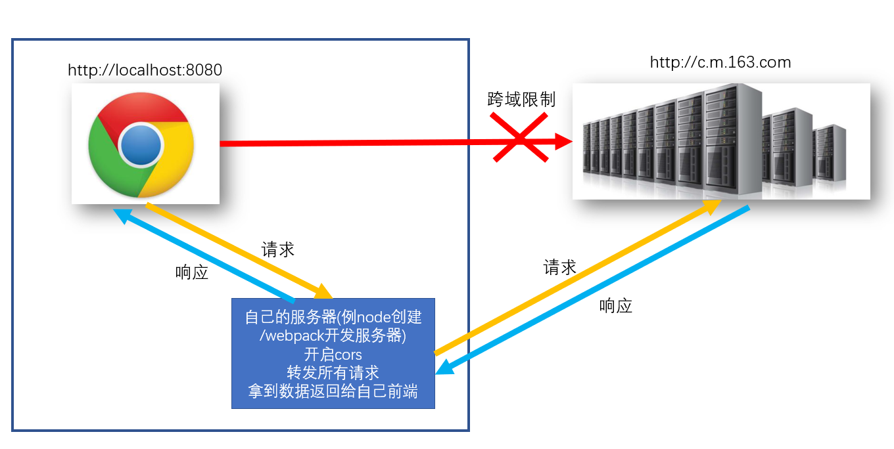
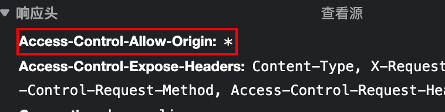
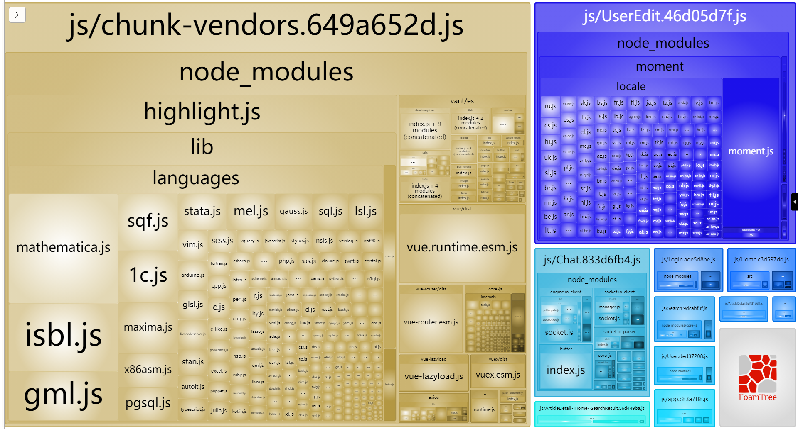
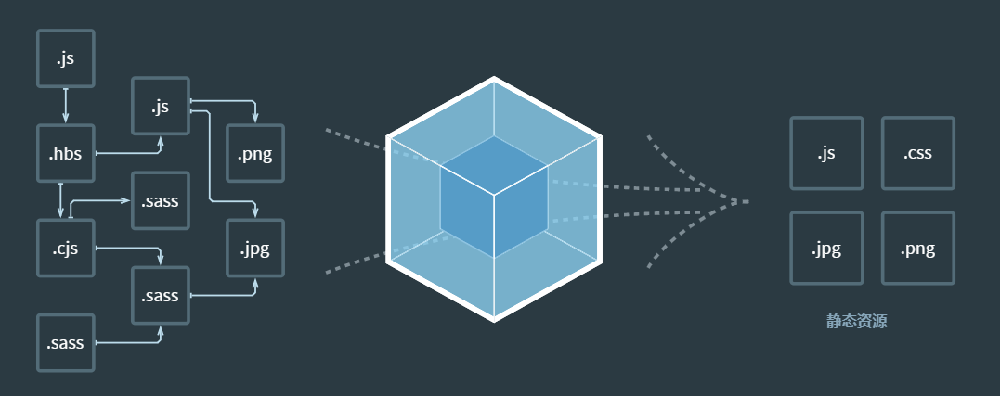
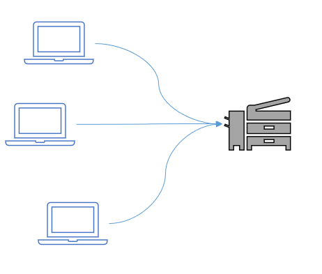
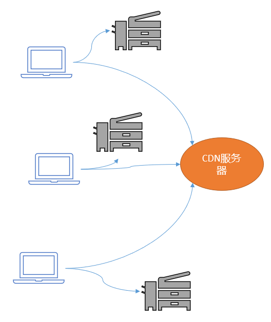

# 知识扩展-打包部署

## 知识点\_vuecli 开发环境-做代理服务器

### 目标

- 回顾什么是跨域
- 跨域的几种解决方案是什么

### 回顾

1. 什么是跨域

   - 网页所在 url 的**协议**， **域名**，**端口号**，和 Ajax 请求 url 的**协议**，**域名**，**端口号**有一个对应不上，就发生跨域
   - 跨域是浏览器对 ajax 做出的限制

2. 演示用 axios 请求网易新闻地址，发现跨域报错

   ```url
   http://c.m.163.com/nc/article/headline/T1348647853363/0-40.html
   ```

### jsonp 方式

- 需要前端和后端同时支持

  > 前端用 script+src 属性，发送函数名给后台，同时准备好同名的函数，准备接收数据
  >
  > 后端返回的字符串一定用方法名(数据字符串)格式返回，到 script 标签中执行
  >
  > 调用函数名，并传递数据

- 例子代码(看看就行，不用尝试)

  ```vue
  <script>
  function callBackFn(data) {
    // data就是'{"a": 10, "b": 20}'
  }
  </script>
  <script src="http://后台接口地址?callback=callBackFn"></script>
  <!-- 后台接口返回 'callBackFn({"a": 10, "b": 20})' -->
  ```

### cors 方式

- 前端什么也不用做

- 后端需要开启 cors

  > 实际上就是在响应头添加允许跨域的源
  >
  > Access-Control-Allow-Origin: 字段和值(意思就是允许去哪些源地址去请求这个服务器)

### 代理转发

- 如果后端 jsonp 也不弄，cors 也不弄，就给你个接口地址

  > 我们可以在本地弄个服务器，然后用服务器请求后台服务器接口地址

  

- vuecli 脚手架，启动了一个 webpack 开发服务器，它就能做代理转发

  - 而且前端和这个服务器是同源的都是 8080 端口

- 需要修改 webpack 开发服务器的配置即可

  > 更多配置项参考这里: https://webpack.docschina.org/configuration/dev-server/#devserverproxy

  ```js
  devServer: {
      proxy: {
        // http://c.m.163.com/nc/article/headline/T1348647853363/0-40.html
        '/api': { // 请求相对路径以/api开头的, 才会走这里的配置
          target: 'http://c.m.163.com', // 后台接口域名
          changeOrigin: true, // 改变请求来源(欺骗后台你的请求是从http://c.m.163.com)
          pathRewrite: {
            '^/api': '' // 因为真实路径中并没有/api这段, 所以要去掉这段才能拼接正确地址转发请求
          }
        }
      }
    }
  ```

- axios 请求的代码

  ```js
  axios({
    url: "/api/nc/article/headline/T1348647853363/0-40.html",
  })
  ```

### 小结

1. 跨域几种解决方案?
   - jsonp / cors / 代理转发
2. vuecli 环境如何设置代理转发?
   - 在 vue.config.js - 添加规则和配置

## 项目打包\_开始

### 目标

- yarn serve 是启动开发环境的服务器 (编写代码过程查看效果用)
- yarn build 也是打包项目代码(但是会输出到 dist 文件夹下)

### 分析

你可以直接把 webpack 开发服务器部署到线上服务器，但是不要那么干，因为有热更新和转换代码的过程，慢

建议让 webpack 打包出 dist 文件夹，把 dist 静态文件夹发给后台/运维，部署到公司服务器上

### 步骤

1. 脚手架工程中运行

   命令: `npm run build`

   作用：用 vue-cli 内部集成的 webpack，把.vue .less .js 等打包成浏览器可直接执行的代码。

   结果：会在项目根目录下创建 /dist 目录，在这个目录下产出打包后的结果。

   讲解：css / js 里重点文件讲解

   

   - app.hash 值.js ：主入口

   - app.hash 值.js.map：记录当前的.js 文件，打包之前对应代码位置，有利于代码出错快速找到源代码的位置。（灵魂地图）

     > (webpack 把所有代码都压缩成一行了，报错肯定在第一行不方便查找)

   - 模块名.hash 值.js：模块里写的 js 代码

     > `component: () => import('../views/search/index.vue')`，在打包时，就会生成对应的 chunk 片段文件

   - chunk-vendors：第三方包的代码统一放在这里（dayjs vue vuex vue-router vant）只要被 webpack 构建依赖关系发现的包

   - chunk-hash 值.js：某个第三方模块对应的 js，某个.vue 文件编译之后的.js

### 运行

1. 可以直接用 vscode+liveserver 插件运行静态网页 index.html

   > 哇，可怕的问题来了，空白页，悄悄打开控制，发现全是路径引入报错
   >
   > 仔细一看，要的都是服务器根目录下的 js / css 文件夹里的打包的片段文件

2. 原因：vscode+liveServer 插件，会把 vscode 打开的根目录当做服务器的根目录，根目录下并没有 js / css 文件夹

   > 而且服务器也不会把你的 dist 里代码放到公司线上服务器根目录

### 解决

1. 只需要让 webpack 打包时，把路径弄成相对路径即可咯

   在 vue.config.js, 第一次对象里添加配置

   ```js
   publicPath: "./"
   ```

### 小结

1. 打包命令是什么?

   - yarn build / npm run build

2. 打包后, 会得到什么?

   - webpack 和各种插件加载器，把代码翻译后，输出整合到 dist 文件夹下

     > 注意：这时 dist 和开发代码环境一毛钱关系都没有了

## 项目打包\_跨域问题

### 目标

- 为何打包后，不跨域

### 分析

1. 打包后运行在 http://localhost:5500

2. ajax 请求的是http://toutiao.itheima.net

   按道理来说，应该跨域了啊

   但是，后台开启了 cors，所以直接请求

   

### 注意

1. 如果你的后台没开启 cors，你使用 webpack 开发服务器来做的代理转发

2. 那么打包后，与 webpack 开发服务器没关系了

   解决：自己用 node+express 搭建一个本地服务器开启 cors，并启动

   把自己前端的请求基地址改成这个服务器一起部署到线上

### 小结

1. 如果用 webpack 开发服务器做代理转发，一定要注意打包后，就没关系了，需要自己准备服务器转发

2. 不论是后端开启 cors，还是配置代理服务器，都会导致后端接口暴露，任何人都可以直接请求，有风险。`解决：需要登录后有token，再去调用接口`

3. ```bash
   // 打包后跨域问题
   // 情况1: 后端直接开启了cors
   // 以后无论开发环境, 还是生产环境, 都可以直接访问接口, 无需考虑跨域问题
   // 隐患: 后端接口暴露了, 任何人找到都可以直接请求(有风险)
   // 解决: 需要登录之后 + token调用接口
   
   // 情况2: 后端不开启cors
   // 开发环境: webpack开发服务器做代理转发
   // 开发环境: nodejs+express在本地搭建一个服务器, 代理转发
   
   // 情况3: 后端不开启cors
   // 生产环境：打包后的dist文件, 和webpack开发服务器环境, 无任何关系了, 没有人给你转发了
   // 解决方案1: 把你自己搭建的nodejs+webpack在本地搭建的代理服务器和dist一起部署到一个云服务器上
   // 前端dist -> nodejs+express服务器地址(http-server包) -> 请求真正的后台接口
   // 解决方案2: dist和你公司的后台接口服务, 直接放在一个云服务器上(避免跨域访问)
   ```

## 项目打包\_分析-代码高亮

### 目标

- 如何优化打包体积

### 打包结果分析

> vuecli 中提供一个打包分析的工具

命令: yarn build --report

它会在 dist 目录下产生一个 report.html 文件，其中就有对打包结果的分析说明


效果 - 帮助我们分析哪个包的体积过大(针对性优化)

> 例如只用到一个方法的 moment / dayjs 可以删除不要, 换成原生 js 自己写



### 优化-代码高亮

1. highlight.js 体积过大，可以让后台给代码标签设置好 class 类名给我返回

   > 现在的接口已经弄好了

2. 所以把 main.js，这段代码删除掉，我们只要引入对应样式即可

   ```js
   // import hljs from 'highlight.js'
   import "highlight.js/styles/default.css" // 代码高亮的样式

   //Vue.directive('highlight', function (el) { // 自定义一个代码高亮指令
   //  const highlight = el.querySelectorAll('pre, code') // 获取里面所有pre或者code标签
   //  highlight.forEach((block) => {
   //    hljs.highlightBlock(block) // 突出显示pre和code内标签, 并自动识别语言, 添加类名和样式
   //  })
   //})
   ```

3. 千万不要忘了，去文章详情，把使用的指令删除掉

4. 但是后台没有提前设置类名的 pre 和 code 标签就没有了高亮

   > aid=7997 这个文章提前设置了类名，所以还是 ok 的

5. 再次打包观察体积

   

### 小结

1. 打包分析工具帮助我们找到哪个包体积过大

   > 如果有体积庞大的，想想针对性的优化 / 换一个工具包使用

## 项目打包\_分析优化-moment

### 目标

- moment 就用了一个格式化时间

### 解决

1. 所以我们只用了其中一个功能，但是 webpack 把整个包都打包进 dist 下了

2. 所以我们可以自己用原生 js 实现，格式化时间，卸载 moment 包

   > yarn remove moment

   ```js
   // 时间选择
   async confirmFn () {
       // console.log(this.currentDate instanceof Date)
       // this.currentDate里值是日期对象
       // 但是后台要"年-月-日"格式字符串参数值

       console.log(this.currentDate)
       const year = this.currentDate.getFullYear()
       let month = this.currentDate.getMonth() + 1
       let day = this.currentDate.getDate()
       month = month < 10 ? '0' + month : month
       day = day < 10 ? '0' + day : day
       const dateStr = `${year}-${month}-${day}`
       await updateProfileAPI({
           birthday: dateStr
       })
       // 前端页面同步
       this.profile.birthday = dateStr
       // 时间选择器关闭
       this.isShowBirth = false
   }
   ```

3. 再次打包观察 dist 文件夹体积大小

   > 观察报告，最大的就是 vue 源码了，那就没什么可以优化的了

### 小结

1. moment 作用?
   - 格式化时间的，我们也可以用原生 js 自己来写，这样不用打包太多没用的代码

## 项目打包\_优化-去掉打印

### 目标

- 上线后想让所有打印失效

### 分析

1. 如果自己删除，那开发还得加回来，注释也一样啊，麻烦
2. 能否配置环境变量，让代码自己来判断呢
3. 先在项目 根目录下配置文件(脚手架环境变量)


- 在.env.development (开发环境变量)

  > NODE_ENV 变量名随便起，值不用加引号就是字符串了

  ```js
  NODE_ENV = development
  ```

- 在.env.production (生产上线环境变量)

  ```js
  NODE_ENV = production
  ```

4. 在 main.js 里加入如下配置

   ```js
   if (process.env.NODE_ENV !== "development") {
     // process是Node环境全部变量, 运行时根据敲击的命令不同, 脚手架会取环境变量给env添加属性和值
     console.log = function () {}
     console.error = function () {}
     console.dir = function () {}
   }
   ```

### 小结

1. 我们可以在这 2 个文件里定义不同的属性和值，来区分线上和线下环境不同的值
2. 而且可以让代码自适应在不同环境，自动选择对应值来使用

## 项目部署-gitee

### 目标

- `部署项目，得到一个全网可用的url地址`

### 步骤

1. gitee 注册账号(有了就忽略这步)
2. 新建仓库(空的，ReadME 也不要)
3. 把 dist 推送到这个新的仓库上 (开发是一个仓库，部署是另外一个了)
4. 启动 gitee 提供的 page 服务 (注意路径会自动找 index.html 文件来访问给用户看)
5. 如果以后代码更新，要在本地重新打包，然后重新推到 gitee 仓库，还必须更新重启 page 服务才能生效)

### 小结

1. 部署项目，为了得到一个 url 地址，可以在公网中，大家都可以访问你做的项目

## 项目部署-公司自己服务器

### 目标

- 创建一个 web 服务(如果后端有 java/其他，就把 dist 文件夹发给后台吧)
- 把整个 web 服务器+dist，部署到公司自己服务器

### 步骤

1. 先创建一个本地的服务(用 nodejs+express+静态资源文件夹)

   ```js
   // 导入 express 模块
   const express = require("express")
   // 创建 express 的服务器实例
   const app = express()

   // 1. 将 dist 目录托管为静态资源服务器
   app.use(express.static("./dist"))

   // 调用 app.listen 方法，指定端口号并启动web服务器
   app.listen(3001, function () {
     console.log("Express server running at http://127.0.0.1:3001")
   })
   ```

2. 在本地访问测试下，是否可以正确打开 vue 打包项目页面，ok 了再继续下面的

3. 阿里云 百度云 腾讯云选择某一家的即可 (尽量赶上过节再去买)

4. 然后购买线上的云服务器 (学生应该什么时候都便宜) 一人打 100kb 左右计算 (可以预估同时能支持多少人访问) 根据业务选择多大带宽的服务器 (如果就自己玩，越低越好，越便宜越好)

5. 选择系统可以选择 windows / linux(可以按宝塔面板，一键安装软件)

6. 想办法把代码 传到云服务器上 (win: 百度网盘/gitee，linux 有宝塔面板网页一键上传)

7. 线上的云服务器，开启一个 web 服务器 (node+express / nginx / apache / 等)

8. 一定要关闭服务器的防火墙(在哪个网站买的, 来到管理页面，放行端口)

9. 访问 ip+端口和路径即可打开线上服务器的这个网站使用了

### 小结

1. 租一台云服务器 / 公司自己服务器(需要公网 ip 能访问 - 如果不能还要研究如何得到一个固定的 ip)
2. 把 web 服务部署到服务器上
3. 访问服务器 ip:web 服务端口/路径，打开对应页面访问

### 扩展

1. 只有 ip 不行，如何得到一个域名呢?

   可以看这个文档https://help.aliyun.com/product/35473.html?spm=5176.21213303.J_6028563670.7.d5653edanjoH7j&scm=20140722.S_help%40%40%E4%BA%A7%E5%93%81%E9%A1%B5%40%4035473.S_hot.ID_35473-RL_%E5%9F%9F%E5%90%8D-OR_s%2Bhelpmain-V_1-P0_0

2. 寻找和购买域名(付款) https://wanwang.aliyun.com/domain/?spm=a2c4g.11174283.2.2.46f34c07iCNNPy

3. 域名解析到自己的服务器 ip 地址上

4. 域名需要备案(注意: 第一次可能需要很多天，所以请在部署项目之前尽早购买)

5. 以后输入域名跟输入 ip 一样可以访问你服务器项目了

# 打包

## 概念介绍

### 目标

- 前端资源打包，在每个项目中都会有涉及，每位开发者都希望打包是用最少的时间构建出最小的代码，这不仅能提高团队中的效率，也能提高页面的访问性能

### 讲解

项目开发完成之后的打包，需要使用 webpack 做打包

`打包后将项目中的.html .vue .scss .js等素材打包成.html .js .css`



### 小结

1. webpack 的作用是什么

   我们可以把文件打包成模块，压缩 整合 提高加载速度

2. webpack 开发服务器

   yarn build 打包生成的 dist 目录，在开发服务器中是把这些代码打包到了内存里

## publicPath

### 目标

- 介绍 publicPath 的作用

### 讲解

1. 不使用 publicPath，打包的项目必须保证 dist 的内容在服务器的根目录

2. 使用 publicPath 可以影响 index.html 引入其他打包后的资源的前缀相对路径

3. 在 vue.config.js 中添加

   ```js
   node里有个内置的环境变量process.env.NODE_ENV
   process.env.NODE_ENV会根据我敲击的命令，来使用不用的值
   如果敲击的是yarn serve，值就是'development'字符串
   如果敲击的是yarn build，值就是'production'字符串
   // 影响打包时，index.html引入其它资源的前缀地址
   publicPath: process.env.NODE_ENV === 'development' ? '/' : './'
   ```

### 小结

1. publicPath 这个固定配置项的作用

   可以影响打包时 index.html 引入其他资源的相对路径

1. 路径区别

   - ./是当前目录（其中./等价于不写，即 href=“./layui/css/layui.css”和 href=“layui/css/layui.css”是一样的效果）
   - ../是父级目录（表示当前文件夹下的，上一个文件夹）

   - /是根目录（表示一下子回到最顶端的那个文件夹下）

## 减少包体积 - 整体分析

### 目标

了解如何减少包体积的思路

### 讲解

1.  打包过程：从 main.js 开始出发，寻找项目中需要使用到的依赖，最终交由 webpack 进行打包

 

2. 我们是否需要把**第三方的库**全部打包到自己的项目中呢？

   比如 elementUI 文件就很大，而且这类插件长期不需要我们进行更新，所以**没有必要打包进来**！

3. 思路


### 小结

1. 如何减少包体积?

   把一些不必经常维护的第三方插件，不用 webpack 模块化方式打包，而是变成 cdn 的 script 的 src 方式加载，因为 cdn 有物理加速的能力，会找用户就近的服务器拿到指定地址的文件

## 减少包体积 - 排除第三方

### 目标

通过配置 vue-cli 把一些平常不需要用的包排除在打包文字之外。

例如：让 `webpack` 不打包 `vue` `element` 等等

### 讲解

1. 先找到 `vue.config.js`， 添加 `externals` 项，具体如下：

   - 此选项作用，告诉 webpack 排除掉这些包，不进行打包

   - 一定要去修改掉引入 Element 用的变量名，这里要匹配去替换，因为 cdn 里的源代码配置在 ELEMENT 这个变量上

```js
configureWebpack: {
  // provide the app's title in webpack's name field, so that
  // it can be accessed in index.html to inject the correct title.
  name: name,
  externals: {
    // 基本格式：
    // '包名' : '在项目中引入的名字'
    'echarts': 'echarts',
    'vue': 'Vue',
    'vue-router': 'VueRouter',
    'vuex': 'Vuex',
    'axios': 'axios',
    'dayjs': 'dayjs',
    'element-ui': 'ELEMENT',
    'vue-quill-editor': 'VueQuillEditor',
    'vuex-persistedstate': 'createPersistedState'
  },
  resolve: {
    alias: {
      '@': resolve('src')
    }
  }
}
```

再次运行，我们会发现包的大小已经大幅减小，三个包已经不在打包的目标文件中了。

### 小结

1. webpack 如何剔除包, 不参与打包?

   webpack 把对应几个包名写在 key 上，就可以刨除掉

## 了解 CDN

### 目标

- 了解什么是 CDN 以及它的好处

### 讲解

CDN 全称叫做“Content Delivery Network”，中文叫**内容分发网络**。我们用它来**提高访问速度**。

 之后  />

把一些静态资源：css， .js，图片，视频放在第三方的 CDN 服务器上，可以加速访问速度。

前端项目中使用 CDN 好处：

1. 减少应用打包出来的包体积
2. 加快静态资源的访问，cdn 服务器集群，就近返回
3. 利用浏览器缓存，不会变动的文件长期缓存

### 小结

1. 我们为何使用 cdn?

   可以适当提高第三方插件的链接速度，但是开发的时候我们还是可以在本地用 npm 下载，但是上线后要配置 cdn 地址，用户的浏览器默认还有缓存功能

## 引用 CDN

### 目标

- 掌握 CDN 的使用

### 讲解

做相关配置：把排除在外的包，通过公共网络资源方式引入

 

1. 请注意，在开发环境时，文件资源还是可以从本地 node_modules 中取出，而只有项目上线了，才需要去使用外部资源。此时我们可以使用**环境变量**来进行区分。具体如下

2. 在**`vue.config.js`**文件中

   ```js
   // 需要排除的包对象
   let externals = {}
   // 判断是否是生产环境
   const isProduction = process.env.NODE_ENV === "production"
   // 如何是生产环境，需要执行以下逻辑
   if (isProduction) {
     externals = {
       /**
        * '包名': '在项目中引入的名字'
        * 以 element-ui 举例 我再 main.js 里是以
        * import ELEMENT from 'element-ui'
        * Vue.use(ELEMENT)
        * 这样引入的，所以我的 externals 的属性值应该是 ELEMENT
        * 一定要去main.js设置
        */
       echarts: "echarts",
       vue: "Vue",
       "vue-router": "VueRouter",
       vuex: "Vuex",
       axios: "axios",
       dayjs: "dayjs",
       "element-ui": "ELEMENT",
       "vue-quill-editor": "VueQuillEditor",
       "vuex-persistedstate": "createPersistedState",
     }
   }
   ```

3. webpack 配置 externals 配置项

   ```js
   configureWebpack: {
     // 配置单页应用程序的页面的标题
     name: name,
     externals: externals,
     resolve: {
       alias: {
         '@': resolve('src')
       }
     }
   }
   ```

4. 在`public/index.html`中，填入 cdn 的地址

   因为 webpack 不会再打包这些第三方代码了，所以运行时缺少他们，我们用 cdn 链接的方式引入到 html 里参与运行

   ```html
   <!-- built files will be auto injected -->
   <script src="https://unpkg.com/echarts@5.3.2/dist/echarts.min.js"></script>
   <script src="https://unpkg.com/vue@2.6.14/dist/vue.js"></script>
   <script src="https://unpkg.com/vue-router@3.5.1/dist/vue-router.js"></script>
   <script src="https://unpkg.com/vuex@3.6.2/dist/vuex.js"></script>
   <script src="https://unpkg.com/axios@0.27.2/dist/axios.min.js"></script>
   <script src="https://unpkg.com/dayjs@1.11.3/dayjs.min.js"></script>
   <script src="https://unpkg.com/element-ui@2.15.8/lib/index.js"></script>
   <script src="https://unpkg.com/quill@1.3.7/dist/quill.js"></script>
   <script src="https://unpkg.com/vue-quill-editor@3.0.6/dist/vue-quill-editor.js"></script>
   <script src="https://unpkg.com/vuex-persistedstate@3.2.1/dist/vuex-persistedstate.umd.js"></script>
   ```

5. 在头部再引入样式文件的 cdn 地址

   ```html
   <link rel="stylesheet" href="https://unpkg.com/element-ui@2.15.8/lib/theme-chalk/index.css" />
   <link rel="stylesheet" href="https://unpkg.com/quill@1.3.7/dist/quill.core.css" />
   <link rel="stylesheet" href="https://unpkg.com/quill@1.3.7/dist/quill.snow.css" />
   <link rel="stylesheet" href="https://unpkg.com/quill@1.3.7/dist/quill.bubble.css" />
   ```

6. 在 `main.js` 中注释掉 `element-ui` 的引入和 `quill` 的样式

   ```js
   // 1. 导入 element-ui 组件库的样式
   // import 'element-ui/lib/theme-chalk/index.css'

   // 2. 导入 quill 的样式
   // import 'quill/dist/quill.core.css'
   // import 'quill/dist/quill.snow.css'
   // import 'quill/dist/quill.bubble.css'
   ```

7. 最终在重新打包，和在开发环境运行，看看是否都一切正常

8. 而且可以观察下 重新打包出来的包体积 dist 文件夹大小，是否有所减少

### 小结

1. 我们如何引入 cdn 地址?

   在 index.html 网页中引入对应的 js 和 css 代码
